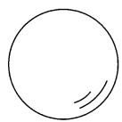
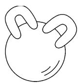
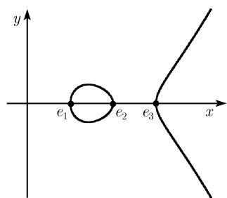

##### 3.8.5 曲线的亏格

本小节考虑 $\mathbb{CP}^2$ 中的不可约的代数曲线, 即过渡到射影坐标. 一条平面代数的最重要和基本的特征是它的亏格. 亏格的定义建立在曲线的一个适当的参数化的基础上, 这个参数化由单值化定理给出.

平面代数曲线的单值化定理 每条曲线

$$
C: p (x, y, u) = 0
$$

有一个整体的参数化

$$
x = x (t), \quad y = y (t), \quad u = u (t), \quad t \in \mathcal {T},\tag{3.65}
$$

具有下列性质:

(i) 参数空间 T 是个紧的, 连通的一维复的流形, 换句话说, 是一个黎曼面.

(ii) 由 (3.65) 定义的映射 $\pi: \mathcal{T} \to C$ 是全纯和满的.

以 $S$ 代表一条曲线 $C$ 的奇点集, 它必须是有限的. 称逆象 $\mathcal{S} = \pi^{-1}(s)$ 为参数值临界集.

(iii) 映射

$$
\pi : \mathcal {T} / \mathcal {S} \to C S
$$

为双全纯, 且参数值的临界集为紧并无内点, 即 S 是个 “薄” 集.

注 我们将曲线的参数 $t$ 解释为时间. 于是 (3.65) 把曲线 $C$ 描述为一个点的 (广义) 轨线. 重要的在于参数空间 $\mathcal{S}$ 没有奇点. 由于这个原因, 也把 (3.65) 称为曲线 $C$ 的一个奇点分解.

例1：首先考虑环索线 $(x + u)x^{2} + (x - u)y^{2} = 0$ 在 $\mathbb{R}^2$ 中的情形.这时有参数化

$$
x = \frac {t ^ {2} - 1}{t ^ {2} + 1}, \quad y = \frac {t (t ^ {2} - 1)}{t ^ {2} + 1}, \quad u = 1, \quad - \infty <   t <   \infty .\tag{3.66}
$$

在这里的参数空间是实轴 $\mathbb{R}$ , 没有奇点. 如果时间才通过所有实数, 则图 3.86 中的曲线恰巧被写过一次. 但是参数化 (3.66) 并不符合我们的需要. 这是因为我们需要了解复曲线上包括无穷远点在内的所有点 $(x, y, u)$ . 进一步还要求参数空间为紧, 而 $\mathbb{R}$ 不是的.

  
图3.86 尖点三次线的单值化

这个简单例子已经表明了单值化定理远不是平凡的. 相反地, 它是个极其深刻的数学结果.

亏格的定义 曲线 C 的亏格是单值化定理的参数空间 S 的亏格 $p^{1)}$ .

(i) 如果 $\mathcal{T}$ 同胚于黎曼球, 则 $p = 0$ (图3.87(a)).

(ii) 如果 T 同胚于一个球面, 则 p = 1(图 3.87(b)).

(iii) 如果以上两种情形都不成立, 则 $\mathcal{T}$ 同胚于由黎曼球面安装了 $p$ 个环柄而得到的曲面. 称 $p$ 为此曲线的亏格 (图3.87(c)).

  
(a) p = 0

  
(b) p = 1

  
(c) p = 2

  
(d) p = 2  
图3.87 各种亏格的曲线

注 由于在单值化定理中出现的不同类型的参数化给出了同胚的具同一亏格的参数空间, 故亏格是有确切定义的.

例 2: 在图 3.87(c) 和 (d) 中的两个曲面同胚, 即它们可由一个弹性运动变形到另一个, 因此它们有同一个亏格.

黎曼面的亏格是由黎曼在 1857 年当他进行阿贝尔积分的研究时引进的, 至少本质上如此. genus (亏格) 这个名词则是在 7 年之后由克莱布施 (Clebsch) 引入的. 亏格的基本不变性 曲线的亏格在双有理变换下不变.

这里有一个经验法则：

一个曲面的亏格越大, 它的结构就越复杂.

确定亏格的例子

(i) 庞加莱定理: 一条曲线为有理的, 当且仅当其亏格 p = 0.

这些曲线包括直线, 圆锥截线 (二次曲线) 和有奇点的三次曲线.

(ii) 光滑的三次曲线有亏格 p = 1. 按定义, 这些是椭圆曲线.

(iii) n 次的非并曲线 C 具有亏格

$$
\boxed {p = \frac {(n - 1) (n - 2)}{2}, \quad n = 1, 2, \dots .}
$$

$C$ 的欧拉示性数 $\chi$ 由公式

$$
\boxed {\chi = 2 - 2 p = 2 - (n - 1) (n - 2)}
$$

给出.

(iv) 克莱布施公式：如果一条不可约的 $n$ 次曲线只有二重点和尖点作为奇点，则对亏格有公式

$$
\boxed {p = \frac {(n - 1) (n - 2)}{2} - c - d,}\tag{3.67}
$$

其中 d 是二重点的个数, c 是尖点的个数.

(v) 哈纳克定理: 一条亏格为 p 的具实系数的 (不可约) 代数曲线在实区域中最多只有 $p+1$ 个分支.

例 3: 设 $e_{1}, e_{2}$ 和 $e_{3}$ 为满足 $e_{1} < e_{2} < e_{3}$ 的实数, 则方程

$$
\boxed {y ^ {2} = (x - e _ {1}) (x - e _ {2}) (x - e _ {3})}
$$

定义了一条亏格 p = 1 的曲线, 它由 $p + 1 = 2$ 个分支组成 (图 3.88).

  
图3.88 一条三次曲线的实点

例 4: 若不可约三次曲线 C 有唯一的二重点或尖点, 则由 (3.67) 知有不等式

$$
p = 1 - c - d \geqslant 0,
$$

即对于 $C$ 只有下面的三种情形是可能的：

(i) C 正则 (即无奇点) 见 p = 1.

(ii) C 恰好有一个二重点 $(d=1 \text{ 且 } c=0)$ ，而此曲线为有理 $(p=0)$ .

(iii) C 恰好有一个尖点而无二重点 $(d=0 \text{ 且 } c=1)$ ，而 C 为有理 $(p=0)$ .

注 利用奇点重数的概念, 可以得到一个比 (3.67) 更一般的公式, 由它可推出一条三次曲线除二重点或尖点外没有其他的奇点, 就是说, 上面关于 $C$ 只有二重点或尖点的假定总是满足的. 因此上面所列出的三种情形是三次曲线唯一的可能性.

例 5: 阿涅西箕舌线是有一个二重点的三次曲线, 它位于无穷远处, 对应于在图 3.79 中画出的那条实渐近线. 因此 d = 1, c = 0 和 p = 0.
