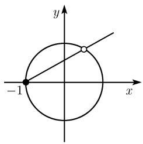
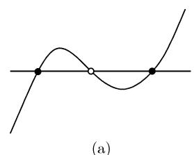
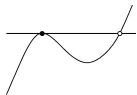

##### 3.8.6 丢番图几何

在数学和自然科学中没有未完成交响乐. 数百年来一些问题可以一代又一代的研究下去而未失其动力. 回顾一下这类问题: 为研究这些问题而长期持续不断发展的所有思想形成了人类思想连续性的引人入胜范例.

汉斯 乌森 (Hans Wussing, 1974)

丢番图 (Diophantine) 是科学上最大的谜团之一. 我们不能确切知道他生活的年代, 也不知道谁是他的同辈和前辈. 谁与他从事像他所进行的同样的工作.

他居住在亚历山大城的时间不能准确地确定, 只能说它是在半个世纪中的任何可能的时间. 在他的关于多边形数的书中, 丢番图多次提到阿历山大城的数学家许普西克勒斯 (Hypsicles). 从他那里我们知道丢番图生活在公元前 2 世纪. 另一方面, 亚历山大城的塞翁 (Theon) 关于天文学家托勒密的《天文学大成 (Almagest)》的评论中包含了丢番图的工作的摘录. 塞翁生活在公元 4 世纪中.

伊莎贝拉 巴施马柯娃 (Isabella Baschmakowa, 1974)

3.8.6.1 初等丢番图方程

丢番图方程的基本思想是求具整 (分别地, 有理) 系数多项式给出的方程的整数 (分别地, 有理数) 解. 在本节中我们首先考虑整数解的情形.

线性丢番图方程和欧几里得算法 设 a, b, c 为已知的不全为零的整数. 我们将寻找整数 x 和 y 使得

$$
\boxed {a x + b y = c.}
$$

这是个线性丢番图方程.

(i) 此方程有解, 当且仅当 $a$ 和 $b$ 的最大公因子 $d$ 也除尽 $c$ .

(ii) 此方程的通解可令

$$
x = \frac {c x _ {0} - b g}{d}, y = \frac {c y _ {0} + a g}{d}
$$

得到, 其中 g 为任意整数, $x_{0} := \alpha_{n}sgna$ 和 $y := \beta_{n}sgnb$ . 对 $\alpha_{n}$ 和 $\beta_{n}$ 的计算应用欧几里得算法:

$$
r _ {0} = q _ {0} r _ {1} + r _ {2}, \quad \dots , \quad r _ {n - 1} = q _ {n - 1} r _ {n} + r _ {n + 1}, \quad r _ {n} = q _ {n} r _ {n + 1},
$$

其中 $r_{0} := |a|, r_{1} := |b|$ ; 然后令

$$
\alpha_ {0} := 0, \beta_ {0} := 1, \alpha_ {k} := \beta_ {k - 1}, \beta_ {k} := \alpha_ {k - 1} - q _ {n - b} \beta_ {k - 1}, \quad k <   1, \dots , n.
$$

例 1: 丢番图方程

$$
\boxed {9 9 7 3 x - 2 1 3 7 y = 1}
$$

具有通解 $x = 3 + 2137g, y = 14 + 9973g$ ，其中 g 为任意整数.

证明：欧几里得在这时给出了关系

$$
\begin{array}{c} 9 9 7 3 = 4 \cdot 2 1 3 7 + 1 4 2 5, \\ 2 1 3 7 = 1 \cdot 1 4 2 5 + 7 1 2, \\ 1 4 2 5 = 2 \cdot 7 1 2 + 1, \\ 7 1 2 = 7 1 2 \cdot 1. \end{array}
$$

因此 $n = 3, q_0 = 4, q_1 = 1$ 和 $q_2 = 2$ . 由此得到

$$
\begin{array}{l l} \alpha_ {1} = 1, & \beta_ {1} = - q _ {2} = - 2, \\ \alpha_ {2} = \beta_ {1} = - 2, & \beta_ {2} = \alpha_ {1} - q _ {1} \beta_ {1} = 3, \\ \alpha_ {3} = \beta_ {2} = 3, & \beta_ {3} = \alpha_ {2} - q _ {0} \beta_ {2} = - 1 4, \end{array}
$$

因而 $x_{0}=\alpha_{3}=3,\ y_{0}=-\beta_{3}=14.$

这种求解的方法已为公元 16 世纪的印度天文学所使用.

毕达哥拉斯数 因为

$$
3 ^ {2} + 4 ^ {2} = 5 ^ {2},
$$

每个边长 $x = 3, y = 4$ 和 $z = 5$ 的三角形是直角三角形. 这个事实可被用来构造直角, 它是古埃及人使用的方法.

有意思的是, 三条长成比例 3:4:5 的弦所对应的和弦被称为四六和弦, 它由基本音素, 和在此基础上的四和六音素给出.

定理 二次丢番图方程

$$
\boxed {x ^ {2} + y ^ {2} = z ^ {2}}
$$

具有通解

$$
x = 2 a b, \quad y = a ^ {2} - b ^ {2}, \quad z = a ^ {2} + b ^ {2},
$$

其中 a 和 b 为满足 $0 < b \leqslant a$ 的任意自然数, 并在此假定了该方程的解被限定在两两互素的自然数 x, y, z.

这个结果早为 3500 年前的巴比伦数学家所知.

例 2: 对 a = 11, b = 10, 我们得到毕达哥拉斯数 x = 220, y = 21 和 z = 221.

费马或佩尔方程以及连分式 设 $d > 0$ 为自然数, 其不被任意素数的平方除尽. 我们要寻找出自然数 $x$ 和 $y$ 使得满足

$$
\boxed {x ^ {2} - d y ^ {2} = 1.}
$$

(i) 所有的解 $(x_{n},y_{n})$ 由公式

$$
x _ {n} + y _ {n} \sqrt {d} = (x _ {1} + y _ {1} \sqrt {d}) ^ {n}, \quad n = 2, 3, \dots
$$

得到.

(ii) 最小的这个解 $(x_{1},y_{1})$ 可按下面方式得到. 数 $\sqrt{d}$ 有一个周期为 $k$ 的连分式表示.

如果 $p_{j}/q_{j}, j=0,1,\cdots$ 为相应的连分式的有限部分，则 $x_{1}=p_{k-1}, y_{1}=q_{k-1}$ 当 k 为偶数以及

$$
x _ {1} = p _ {2 k - 1}, \quad y _ {1} = q _ {2 k - 1}, \quad \text {当} k \text {为奇数}.
$$

这个结果是由拉格朗日 (1736—1813) 得到的, 他是柏林科学院中欧拉的继任者, 但在 1787 年又返回了巴黎. 他的遗体与那些法国的其他伟大人物一起安眠于巴黎的先贤祠中.

例 3: 对 d = 8, 有 $x_{1} = 3, y_{1} = 1$ , 对 d = 13 则有

$$
x _ {1} = 6 4 9, \quad y _ {1} = 1 8 0.
$$

一般地, 解 $x_{1}, y_{1}$ 非常不规则, 它能给出小的和非常大的值. 譬如, 对 $d = 60$ , 得到 $x_{1} = 31$ , $y_{1} = 4$ , 而对 $d = 61$ , 则有

$$
x _ {1} = 1 7 6 6 3 1 9 0 4 9, y _ {1} = 2 2 6 1 5 3 9 8 0.
$$

3.8.6.2 曲线上的有理点及亏格的作用

基本问题 考虑方程

$$
p (x, y) = 0,\tag{3.68}
$$

其中 p 是 x 和 y 的多项式. 这里的关键性假定是此多项式的系数是有理数.

目标是求出所有满足方程 (3.68) 的有理数 $x$ 和 $y$ .

几何解释 若把 (3.68) 看成是 $\mathbb{R}^2$ 中的一条曲线的 (丢番图) 方程, 则是要找出曲线上的所有有理点. 称 $\mathbb{R}^2$ 中一个点为有理的, 如果两个坐标 $x$ 和 $y$ 都是有理数.

有理点的集合在平面中稠密, 但是却有着更加多的无理点. 更确切地说, 根据康托尔 (Cantor, 1845—1918) 知, 有理点集与平面中的整点集具有相同的基数 (这表示存在这两个集合间的双射), 而无理点集与整个平面有相同的基础 (参看 4.3.4). 因此没有直观的方法看出在一条复杂的曲线上有多少个有理点. 我们期待曲线的亏格是给出答案的一个重要方面, 这是因为亏格越高曲线越加复杂.

例 1: 在直线

$$
\boxed {y = x}
$$

上有无穷多个有理点和无穷多个无穷点, 这只取决于 $x$ 是有理还是无理的.

例 2: 在圆

$$
\boxed {x ^ {2} + y ^ {2} = 1}
$$

上有无穷多个有理点.

证明(按照丢番图的证法): 直线 $y = m(x + 1)$ 交此圆的点, 当 m 为有理 (斜率) 时它为有理点 (图 3.89).

  
图3.89

  
(b)  
图3.90 三次曲线上的有理点

丢番图定理 (i) 在每条丢番图直线上存在无穷多个有理点.

(ii) 在每个丢番图圆锥截线上要么没有要么就有无穷多个有理点.

我们现在考虑一条光滑的三次丢番图曲线 C. 这表明此曲线的亏格 p = 1.

(iii) 丢番图割线法：若在 $C$ 上有两个有理点，则连接这两个点的直线交 $C$ 于此曲线上的第三个有理点.

(iv) 丢番图切线法：若在 C 上有有理点 P，则 C 在 P 点的切线交 C 于另一个有理点 (图 3.90(b)) $^{1)}$ .

注 这些结果都可以在丢番图的书《算术》中给出的各种例题中找到. 《算术》是在数学史中关于数论的第一部伟大的专著. 在该书中丢番图使用了正和负的有理数, 同时还有符号

$$
\zeta , \Delta^ {\tilde {v}}, K ^ {\tilde {v}}, \Delta^ {\tilde {v}} \Delta , \Delta K ^ {\tilde {v}}, K ^ {\tilde {v}} K,
$$

它对应于今天所使用的符号 $^{2)}$ $x, x^{2}, x^{3}, x^{4}, x^{5}$ 和 $x^{6}$ . 一直到庞加莱在 1901 年发表了他在这一专题上的基础文章前丢番图几何一直都没有取得决定性的进展. 庞加莱的论文完全解决了我们前面所讨论的亏格 p = 0 的情形. 他也第一个意识到对于椭圆曲线 p = 1 的情形中丢番图的割线法和切线法的重要性. 他发现所有这两个结果都是在椭圆曲线上群结构的一种表达 (参看 (3.47)). 丢番图的方法事实上非常精巧, 这可在下面庞加莱和莫德尔定理中看出; 这些定理表明了丢番图方法是对亏格 p = 0 或 p = 1 的情形是普遍有效的.

庞加莱的丢番图双有理变换 称变换

$$
x = f (\xi , \eta), \quad y = g (\xi , \eta)
$$

为丢番图有理的(用现代语言表示即在 $\mathbb{Q}$ 上有理或定义于 $\mathbb{Q}$ 上)，如果 f 和 g 是具有理系数的有理函数.

如果一个丢番图变换是可逆的使得逆变换也是丢番图有理的, 则我们称此变换为丢番图双有理变换.

丢番图等价 称两个丢番图曲线为 (丢番图)等价, 如果在它们两个之间存在一个丢番图双有理变换.

庞加莱进一步猜想有下面的结果, 而此结果后来被莫德尔证明.

对于格 p = 1 的莫德尔定理 (1922) 在一条丢番图椭圆曲线 $(p = 1)$ 上或者在曲线上没有有理点或者有有限个点 $P_{1}, \cdots, P_{n}$ ，使得曲线上的每个有理点都可由这些点经应用割线和切线法得到。以群论的语言表示就是说这条椭圆曲线的加法群的有理点于群由有限个点 $P_{1}, \cdots, P_{n}$ 生成，即每个有理点可写为

$$
\boxed {P = m _ {1} P _ {1} + \dots + m _ {m} P _ {n},}
$$

其中 $m_{1},\cdots,m_{n}$ 为整数. 这个表示中的加法的意思理解为在 (3.47) 意义下的.

1) 在 (iii) 和 (iv) 中必须也考虑曲线 C 在无穷远的点.

2) 符号 $\Delta^{\hat{v}}$ (我们今天记其为 $x^{2}$ ) 是由希腊字 $\Delta \acute{\upsilon} \nu \alpha \mu \iota \zeta$ (dynamis) 导出的, 意思是幂. 记号 $K^{\hat{v}}$ 代表三次幂表示 $\kappa \acute{\upsilon} \beta \sigma \zeta$ (Kubos), 意思是立方.

对丢番图而言, 数总意味着有理数. 他用 $\dot{\alpha}\rho\iota\theta\mu\acute{o}\zeta(Arithmos)$ 表示. 算术的记号便由此得到 (即研究对数和字母的计算). 负数被丢番图表示为 $\lambda\varepsilon\bar{\iota}\psi\iota\zeta(leipsis)$ , 它表示 “不是”. 另外丢番图还引进了我们今天的负幂 $x^{-1},\cdots,x^{-6}$ 的符号.

下面的结果由莫德尔在 1922 年猜测的, 这是保持了一个长时间没有解决的猜想.

由法尔廷斯在1983年证明的对亏格 $p \geqslant 2$ 时的丢番图几何的基本定理

$$
\text { 在每条亏格 } p \geqslant 2 \text { 的丢番图曲线上最多只有有限个有理点. }
$$

因为这个基本性结果, 法尔廷斯 (Gerd Faltings, 1954) 在 1986 年的伯克利举行的国际数学家大会上获得了菲尔兹奖, 菲尔兹奖被称为数学的诺贝尔奖, 后者是对自然科学的奖项. 法尔廷斯的证明建立在非常抽象的数学模型之上, 这些模型只是在 20 世纪中期才发展起来的.

志村-谷山-韦依猜想 (1955) 设 $y^{2} = ax^{3} + bx^{2} + cx + d$ 为一丢番图椭圆曲线. 对每个素数 $p$ 设 $n_p$ 表示方程

$$
\boxed {y ^ {2} \equiv a x ^ {3} + b x ^ {2} + c x + d \mod p}
$$

的解 $(x,y)$ 的个数.

猜想：存在一个模形式 $^{1)}$ f，其傅里叶展开式为

$$
f (z) = \sum_ {h = 0} ^ {\infty} b _ {n} \mathrm{e} ^ {2 \pi \mathrm{i} n z},
$$

其中 z 在上半平面中, 使得对充分大的常数 p, 有惊人的简单关系式

$$
\boxed {b _ {p} = p + 1 - n _ {p}.}
$$

这个猜想遵从了一个一般性原理, 即模形式是解密可数的无限系的一个基本工具.

3.8.6.3 费马大定理

现代数学的年龄应从四位伟大的法国数学家算起，他们是德萨格（1591—1661）、笛卡儿（1596—1650）、费马(1601—1665)和帕斯卡(1623—1662). 四个很少有共同点的人的这个四重奏是难以想象的；德萨格是四个人中最具独创性的人，是一位建筑师；他被描写为一个乖僻的人，他把他大部分重要著作以一种秘密的语言书写并以一种要用显微镜才能看到的极小的字母加以印刷. 笛卡儿，其中最著名的一位，原是退役士兵，并且如有必要，可用匕首进行自卫以对抗莱茵河水手中的窃贼们；以一名士兵的状态他也准备对于科学的基础（“方法论 (Discourse surlaméthode)”) 发起总攻. 帕斯卡, 最足智多谋的一位, 背离了数学并在其后来的生活中变成了一个宗教的痴迷者, 他整个一生都受到便秘的折磨. 最后一位, 费马, 这是最重要的一位, 他作为图鲁兹最高法院的顾问而被王室雇用, 这个职位与现今的资深文职官相比是最相当的. 他因而有充裕的闲暇时间用来考虑数学……

沙尔劳与欧波卡 (Winfried Scharleau and Hans Opolka) 摘自《从费马到闵可夫斯基》, 1990 $^{1)}$

费马是解析几何和概率论的奠基人之一；他的计算极大和极小值的方法是牛顿和莱布尼茨微积分的前奏。在费马的那本丢番图的《算术》抄本中下面的结果被写在其边白上：

Cubum autem in duos cubos, aut quadrato-quadratum in duos quadrato-quadratos, et generaliter nullam in infinitum ultra quadratum potestatem in duas ejusdem nominis fas est dividere; cujus rei demonstrationem mirabilem sane detexi. Hanc marginis exiguitas non caperet.

用现代的术语来讲, 费马在这里宣称的是: 方程

$$
\boxed {x ^ {n} + y ^ {n} = z ^ {n},}
$$

$n = 3,4,\cdots$ ，对于整数 x,y,z 无解。进一步他写道，他已找到了一个对它的漂亮证明，但是空白边的大小以致不能写在这里。这个边批似乎写于 1631 年到 1637 年之间的某个时间。从此之后，这个结果便以费马大定理为知名，虽说更正确地应该把它叫做费马猜想。

欧拉在 1760 年证明了 n = 3 的情形. 在 1825 到 1830 年间, 狄利克雷和勒让德已能完成对 n = 4 情形的证明. 在 1843 年库默尔寄给狄利克雷的一篇文章, 在该文中宣称已找到了对所有 n > 3 情形的证明. 但是狄利克雷发现在此证明中一个严重的漏洞. 这等于说库默尔承认在任意数域中均成立整数的素分解唯一性, 但这是不正确的. 为了纠正这个错误, 库默尔深入细致地研究了数论中的可除性定律, 这后来成为由狄利克雷发展起来的除子理论的一个基础. 借助于可除性理论, 库默尔便能够证明费马猜想对于所有被称作正则素数是正确的, 例如对所有素数 n < 100 但除了 n = 37.59 和 67 外这个猜想正确. 在 1977 年瓦格斯达夫 (Wagstaff) 利用计算机的计算证明了费马与定理对 z < p < 125,000 的素数正确. 费马大定理等价于下面的丢番图几何中的论述: 在曲线

$$
\boxed {x ^ {n} + y ^ {n} = 1}
$$

上, 当 $n \geqslant 3$ 时没有有理点.

怀尔斯定理 (1994) 费马大定理是个定理.

怀尔斯以证明志村-谷山-韦伊猜想对所有所谓半稳定曲线成立的方法证明了这个论断。志村-谷山-韦伊猜想蕴涵了费马大定理本身就是十分深刻的，它原本是由弗雷格提出来的。其想法是，假若费马大定理不真，那么用一个复杂的构造知可由它的一个解产生一条椭圆曲线，而此曲线将与志村-谷山-韦伊猜想矛盾。
