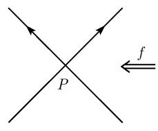
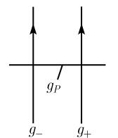
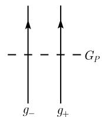
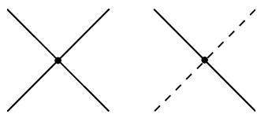

##### 3.8.8 奇点分解

设已知 $\mathbb{C}^n$ 中一个解析集 $X$ , 其在原点 $z = 0$ 有一个孤立奇点. 我们想要找到集合 $X$ 的一个局部参数化

$$
\boxed {z = \pi (t), \quad t \in \mathcal {T}}
$$

使得参数空间 T 没有奇点. 以 $\mathcal{S} := \pi^{-1}(0)$ 记参量的临界点集.

广中平佑的局部单值化定理 (1964) $^{1)}$

存在一个具下列性质的参数化 $\pi: T \rightarrow X$ :

(i) 参数空间 T 是个光滑复流形.

(ii) $\pi$ 为逆紧 $^{2)}$ 的由 T 到 X 的原点邻域的全纯映射.

(iii) 映射 $\pi: T \backslash S \rightarrow X \backslash \{0\}$ 为双全纯.

(iv) 参数的临界点集 $\mathcal{S}$ 是 $\mathcal{T}$ 的一个余维为 1 的解析集, 即 $\dim \mathcal{S} = \dim \mathcal{T}-1$ . 我们称 $\pi: \mathcal{T} \to X$ 为 $X$ 在原点 (孤立奇点) 的一个奇点分解.

在奇点的拉开 在它的分解过程中, 奇点经过了有限次的拉开. 现在通过举几个例子来描述这个过程, 这对代数几何是很基本的东西.

例(图 3.91): 考虑曲线

$$
\boxed {X: x ^ {2} - y ^ {2} = 0, \quad (x, y) \in \mathbb {C} ^ {2},}\tag{3.71}
$$

它在 $P = (0, 0)$ 有一个二重点.

  
(a) 具二重点的曲线

  
(b) 二重点的拉开

  
图3.91 消解一个二重点  
(c) 嵌入

第 1 步：拉开二重点 P 为直线 $g_{P}$ (图 3.91(b)), 即将此点换成一条射影直线. 这可利用参数化

$$
(x, y) = f (u, v), \quad (u, v) \in \mathbb {C} ^ {2}\tag{3.72}
$$

1) 日本数学家广中平佑 (1931 年生) 因其在局部和整体单值化的基础性结果获得 1970 年的菲尔兹奖. 整体单值化结果见 3.8.9.2.

2) 一个逆紧映射具有紧集逆象仍为紧的重要性质.

得到, 其中 $f(u,v):=(u,uv)$ . 由 (3.71) 得到方程

$$
\boxed {v ^ {2} (1 - u ^ {2}) = 0, \quad (u, v) \in \mathbb {C} ^ {2}.}
$$

这引出了三条直线 $g_{\pm}: u = \pm 1$ 和 $g_{P}: u = 0$ . 直线 $g_{+}$ 和 $g_{-}$ (分别地, 直线 $g_{P}$ ) 由 (3.72) 被变换为 $X$ 的两条分支直线 (分别地, $X$ 的二重点).

第 2 步: 现在把直线 $g_{P}$ 嵌入到一个三维空间中从而得到在 $\mathbb{C}^{3}$ 中的一条直线, 记其为 $G_{P}$ (图 3.91(c)). 例如, 可以由令

$$
G _ {P} := \{(u, v, w) \in \mathbb {C} ^ {3}: v = 0, w = 1 \}, \quad g _ {\pm} := \{(u, v, w) \in \mathbb {C} ^ {3}: u = \pm 1, w = 0 \}
$$

来做到这一点.

第 3 步——构造分解：选取参数空间 T 为三条不相交的直线 $g_{+}, g_{-}$ 和 $G_{P}$ . 分解映射 $\pi: T \rightarrow X$ 直接由令

$$
\pi : \mathcal {T} \xrightarrow {\pi} \mathbb {C} ^ {2} \xrightarrow {f} X
$$

给出, 其中的投射 $\pi(u,v,w):=(u,v)$ .

在这个例子中我们可以容易地用将局部结构融入三维空间的办法来显式地定义这个消解 (图3.92). 一般的拉开的构造的优点是它可扩张到一个普遍适用的构造上.

  
图3.92
