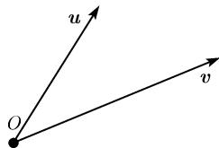
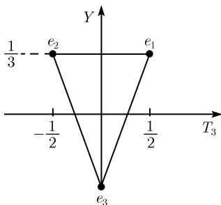

##### 3.9.2 酉几何、希尔伯特空间和基本粒子

酉几何建立在一个正定的内积基础上, 这个内积推广了对于向量 $\pmb{u}$ 和 $\pmb{v}$ 的经典的内积 $\pmb{uv}$ (参看1.8.3). 酉几何的所有重要的概念正如我们将看到的那样, 可以直接在基本粒子的夸克模型中得到解释.

定义 一个酉空间是 $\mathbb{K}$ 上的一个线性空间, 在其上有一个给定的内积. 这表明对于每对 $u, v \in X$ 向量我们相伴以一个数 $(u, v) \in \mathbb{K}$ 使得对所有 $u, v, w \in X$ 及所有数 $\alpha, \beta \in \mathbb{K}$ , 有

(i) $(u, v) \geqslant 0; (u, u) = 0$ 当且仅当 $u = 0$ ;

(ii) $(w, \alpha u + \beta v) = \alpha(w, u) + \beta(w, v);$

(iii) $\overline{(u,v)}=(v,u).$

由 (ii) 和 (iii) 得到, 对所有 $u, v, w \in X, \alpha, \beta \in \mathbb{K}$ 有

$$
(\alpha u + \beta v, w) = \overline {{\alpha}} (u, w) + \overline {{\beta}} (v, w).
$$

在这里, $\overline{\alpha}$ 代表了一个复数 $\alpha$ 的复共轭, 故如果 $\mathbb{K} = \mathbb{R}$ , 这便是个恒等式, 从而 “-” 可以去掉.

希尔伯特空间 每个有限维酉空间都同时是一个在一般定义下的希尔伯特空间, 一般定义可在 [212] 中找到.

伴随算子 若 $A: X \to X$ 是个线性算子，则有一个自然的伴随线性算子 $A^{*}: X \to X$ ，它满足关系式

$$
\boxed {(u, A v) = (A ^ {*} u, v),}
$$

其中 $u, v \in X$ ，称 $A^{*}$ 为 A 的伴随算子.

酉群 $U(n,X)$ 称一个算子 $U:X\to X$ 为酉算子, 如果它保持内积不变, 即如果 $U$ 是线性的, 并对所有 $v,w\in X$ 满足关系式

$$
\boxed {(U v, U w) = (v, w).}
$$

$X$ 上的所有酉算子的集合构成一个群, 称其为酉群, 并记以 $U(n, X)$ . 这个群中所有满足另外一个关系

$$
\det U = 1
$$

的所有算子构成了 $U(n,X)$ 的一个子群, 记其为 $SU(n,X)$ , 称之为特殊酉群. 所有线性算子 $U:X\to X$ 属于 $U(n,X)$ , 当且仅当

$$
\boxed {U U ^ {*} = U ^ {*} U = I.}
$$

在实空间情形 (即 $\mathbb{K} = \mathbb{R}$ ), 我们以 $O(n, X)$ (分别地, $SO(n, X)$ ) 代替 $U(n, X)$ (分别地, $SU(n, X)$ ) 并且称这种情形下的这个群为正交群(分别地, 特殊正交群) $^{1)}$ .

例 1: 相对于某个原点 O 的我们现实三度空间的位置向量 u, v 构成一个实的三维希尔伯特空间 H, 其具有通常的内积

$$
\boxed {(\boldsymbol {u}, \boldsymbol {v}) = \boldsymbol {u} \boldsymbol {v}}
$$

(图 3.93). 群 $SO(3, H)$ 由绕点 $O$ 的所有旋转组成. 如果再加上对点 $O$ 的反射 $\boldsymbol{u} \mapsto -\boldsymbol{u}$ (就是说, 我们考虑所有由 $SO(3, H)$ 中元与这种反射的复合形成的变换的群), 则我们便得到了 $O(3, H)$ .

  
图3.93

酉几何 由定义, 一个性质属于希尔伯特空间 $X$ 的酉几何, 当且仅当它在群 $U(n, X)$ 的所有算子下不变. 在这个意义下, 下列性质应属于酉几何. 体积是一个例外, 它只在保持定向的变换下不变. 酉几何把直观的例 1 推广到任意维的情形.

1) 群 $U(n, X), SU(n, X), O(n, X)$ 和 $SO(n, X)$ 均是维数分别为

$$
\begin{array}{l} \dim U (n, X) = n ^ {2}, \quad \dim S U (n, X) = n ^ {2} - 1, \\ \dim U (n, X) = \dim S O (n, X) = \frac {n (n - 1)}{2} \end{array}
$$

的实紧李群. 这些维数表明了这些群依赖了多少参数 (参看 [212]).

正交性 两个向量 $u, v \in X$ 被称为正交的, 如果它们满足

$$
\boxed {(u, v) = 0.}
$$

如果 L 是 X 的一个线性子空间, 我们以 $L^{\perp}$ 表示 L 的正交补. 按定义, 这表明

$$
L ^ {\perp} := \{\boldsymbol {w} \in X | (\boldsymbol {v}, \boldsymbol {w}) = 0, \text {对所有} \boldsymbol {v} \in L \}.
$$

对任意一个向量 $u \in X$ 有一个唯一的分解

$$
\boxed {\boldsymbol {u} = \boldsymbol {v} + \boldsymbol {w}, \quad \boldsymbol {v} \in L, \boldsymbol {w} \in L ^ {\perp}.}
$$

特别地, $X = L \oplus L^{\perp}$ , 并且有关于维数的公式

$$
\dim L + \dim L ^ {\perp} = \dim X.
$$

长度和距离 如果对每个向量 $u \in X$ 伴以一个长度 $\|u\|$ ，其定义为

$$
\boxed {\| \boldsymbol {u} \| := \sqrt {(\boldsymbol {u} , \boldsymbol {u})}.}
$$

我们有 $\|u\|>0$ 当且仅当 $u\neq0$ 。另外对于 u=0 有 $\|u\|=0$ 。于是数

$$
\boxed {d (\boldsymbol {u}, \boldsymbol {v}) := \| \boldsymbol {u} - \boldsymbol {v} \|}
$$

称为两个向量 $\pmb{u}$ 和 $\pmb{v}$ 之间的距离．以此距离的概念，每个希尔伯特空间都成为一个度量空间.

角 我们进一步对已知两个向量 $u, v \in X$ 伴以一个唯一确定的这两个向量之间的角, 其中 X 是一个实希尔伯特空间; 这个角 $\alpha$ 的定义为

$$
\cos \alpha = \frac {(\boldsymbol {u} , \boldsymbol {v})}{\| \boldsymbol {u} \| \| \boldsymbol {v} \|}, \quad 0 \leqslant \alpha \leqslant \pi .
$$

在这里假设 $u \neq 0, v \neq 0$ . 在任意实和复的希尔伯特空间 X, 我们有施瓦茨不等式

$$
\boxed {| (\boldsymbol {u}, \boldsymbol {v}) | \leqslant \| \boldsymbol {u} \| \| \boldsymbol {v} \|, \text {对所有} \boldsymbol {u}, \boldsymbol {v} \in X.}
$$

法正交基 X 中 n 个已知向量 $e_{1}, \cdots, e_{n}$ 构成一组法正交基, 如果

$$
\boxed {(\boldsymbol {e} _ {j}, \boldsymbol {e} _ {k}) = \delta_ {j k}, \quad j, k = 1, \dots , n.}
$$

这时我们对任一向量 $u \in X$ 有傅里叶表示

$$
\boldsymbol {u} = \sum_ {j = 1} ^ {n} u _ {j} \boldsymbol {e} _ {j},\tag{3.73}
$$

其傅里叶系数

$$
u _ {j} := (\boldsymbol {e} _ {j}, \boldsymbol {u}).
$$

数组 $(u_{1},\cdots,u_{n})$ 按定义构成了向量关于基 $e_{1},\cdots,e_{n}$ 的笛卡儿坐标.

基本定理 每个希尔伯特空间都有一组法正交基.

构造酉算子 若 $e_{1},\cdots,e_{n}$ 和 $e_{1}^{\prime},\cdots,e_{n}^{\prime}$ 为希尔伯特空间 X 中任意两组基，则由

$$
U \boldsymbol {e} _ {j} := \boldsymbol {e} _ {j} ^ {\prime}, \quad j = 1, \dots , n\tag{3.74}
$$

定义的映射是一个酉算子 $U: X \rightarrow X$ . 按此方法得到 X 上的所有酉算子.

定理 1 一个线性算子 $U: X \rightarrow X$ 为酉算子当且仅当每个法正交基还是映成一组法正交基.

定向 一个希尔伯特空间 X 的定向是由选取一个固定的法正交基 $e_{1}, \cdots, e_{n}$ 给出的，并定义体积形式

$$
\boxed {\mu = \mathrm{d} x ^ {1} \wedge \mathrm{d} x ^ {2} \wedge \dots \wedge \mathrm{d} x ^ {n}.}
$$

在这里的 $dx^{j}: X \to R$ 是一个线性映射, 它满足 $\mathrm{d}x^{j}(e_{k}) = \delta_{jk}$ , 对所有 $j, k = 1, \cdots, n$ . 如果 $b_{1}, \cdots, b_{n}$ 是 X 中任意一组基, 则称数

$$
\boxed {\alpha := \operatorname{sgn} \mu (b _ {1}, \dots , b _ {n})}
$$

为这组基的定向. 我们总有 $\alpha = 1$ (正定向) 或 $\alpha = -1$ (负定向).

定理 2 (i) 对任意法正交基 $e_{1}^{\prime}, \cdots, e_{n}^{\prime}$ 有

$$
\mu = \alpha \mathrm{d} x ^ {\prime 1} \wedge \mathrm{d} x ^ {\prime 2} \wedge \dots \wedge \mathrm{d} x ^ {\prime n},
$$

即体积形式 $\mu$ 的定义只依赖于希尔伯特空间的定向.

(ii) 一个酉变换保持定向不变; 当且仅当 $\operatorname{det} U = 1$ , 即当 $U \in SO(n, X)$ . 体积 设 $\mathcal{G}$ 代表一个实定向希尔伯特空间 $X$ 中的有界区域. $\mathcal{G}$ 的体积定义为

$$
\operatorname{Vol} (\mathcal {G}) := \int_ {\mathcal {G}} \mu .
$$

为了解释这个公式, 可通过分解 (3.73). 设 G 表示在 G 中点的全部笛卡儿坐标 $(x_{1}, \cdots, x_{n})$ 的集合. 于是得到经典的公式

$$
\int_ {\mathcal {G}} \mu = \int_ {G} \mathrm{d} x _ {1} \mathrm{d} x _ {2} \dots \mathrm{d} x _ {n}.
$$

这个体积只依赖于希尔伯特空间 $X$ 定向的选取．相反的定向给出该体积的符号改变.

若 $U: X \rightarrow X$ 为 $O(n, X)$ 中的算子, 则有

$$
\left| \operatorname{Vol} (U \mathscr {G}) = (\operatorname{sgn} U) \operatorname{Vol} (\mathscr {G}), \right|
$$

其中 $\operatorname{sgn} U = \pm 1$ 且 $\operatorname{sgn} U = 1$ 当 $U \in SO(n, X)$ .

无穷小酉算子和李代数 $u(n,X)$ 一个算子 $A:X\to X$ 被称为无穷小酉算子, 如果它是线性的, 并满足关系式

$$
\boxed {(u, A _ {v}) = - (A u, v), \quad u, v \in X.}
$$

这等价于 $A^{*} = -A$ ( $A$ 是反埃尔米特的). 所有这样的算子的集合记之为 $u(n, X)$ , 而所有满足附加条件 $\operatorname{tr} A = 0$ 的这些算子 ( $\det A = 0$ 的无穷小形式) 的集合按定义组成了集合 $su(n, X)$ .

若 $X$ 是实希尔伯特空间, 则以 $o(n, X)$ (分别地, $so(n, X)$ ) 代替 $u(n, X)$ (分别地, $su(n, X)$ ).

定理 3 设 X 为复希尔伯特空间, 满足 $\dim X = n$ .

(i) 对于李括号

$$
[ A, B ] := A B - B A\tag{3.75}
$$

以及通常线性算子的线性组合 $\alpha A + \beta B, \alpha, \beta \in \mathbb{R}, u(n, X)$ 成为一个实向量空间从而一个 $\dim u(n, X) = n^2$ 的李代数．另外， $su(n, X)$ 是 $u(n, X)$ 的子李代数，维数为 $\dim su(n, X) = n^2 - 1$

(ii) 由 $A \in u(n, X)$ 知 $\exp(A) \in U(n, X)(\exp(A)$ 是算子的幂级数). 反之, 存在数 $\varepsilon > 0$ 使得对每个 $U \in U(n, X)$ , 满足 $\|I - U\| < \varepsilon$ , 存在一个唯一的算子 $A \in u(n, A)$ 使得

$$
\boxed {U = \mathrm{e} ^ {A},}\tag{3.76}
$$

即 $A = \ln U$ (这仍然是算子的一个幂级数).

(iii) 由 $A \in su(n, X)$ 得到 $\exp(A) \in SU(n, X)$ . 反之, 存在一个数 $\varepsilon > 0$ 使得对每个 $U \in SU(n, X)$ 满足 $\|T - U\| < \varepsilon$ 时存在一个唯一的算子 $A \in su(n, X)$ 满足方程 (3.76).

论述 (ii)(分别地, (iii)) 表明 $u(n,X)$ (分别地 $su(n,X)$ ) 代表了李群 $U(n,X)$ (分别地, $SU(u,X)$ ) 的李代数 (参看 [212]).

定理 4 设 X 为一实希尔伯特空间, $\dim X = n$ .

(i) 相对于李括号 (3.75), $o(n, X)$ 是个实向量空间及 $\dim o(n, X) = n(n - 1)/2$ 的李代数.

(ii) 由 $A \in o(n, X)$ 得到 $\exp(A) \in O(n, X)$ . 反之, 存在数 $\varepsilon > 0$ 使得对每个满足 $\|I - U\| < \varepsilon$ 的 $U \in O(n, X)$ 存在一个唯一的算子 $A \in o(n, X)$ 使得 $U = \exp(A)$ , 即 $A = \ln U$ .

(iii) 由 $A \in so(n, X)$ 得到 $\exp(A) \in O(n, X)$ . 反之, 存在数 $\varepsilon > 0$ 使得满足 $\|I - U\| < \varepsilon$ 的每个 $U \in O(n, X)$ 存在一个唯一的算子 $A \in so(n, X)$ 其满足方程 (3.76).

根据 (ii)(分别地, (iii)), $o(n,X)$ (分别地, $so(n,X)$ ) 是李群 $O(n,X)$ (分别地, $SO(n,X)$ ) 的李代数.

构造一个希尔伯特空间 设 $e_{1},\cdots,e_{n}$ 为一个线性空间 X 的一组基. 我们定义

$$
(e _ {j}, e _ {k}) = \delta_ {j k}, \quad \text { 对所有的 } j, k.\tag{3.77}
$$

这样, X 便成了具有法正交基 $e_{1}, \cdots, e_{n}$ 的一个希尔伯特空间. 更加显式地, 有

$$
(u, v) = \overline {{x}} _ {1} y _ {1} + \dots + \overline {{x}} _ {n} y _ {n},
$$

其中 $(x_{j})$ 和 $(y_{j})$ 分别代表 $u$ 和 $v$ 的笛卡儿坐标. 这给出了每个线性空间以一个希尔伯特空间的结构. 但这里的内积依赖于基的选取.

对粒子物理的夸克模型的应用 考虑一个三维复希尔伯特空间 X, 其具法正交基 $e_{1}, e_{2}, e_{3}$ . 我们的解释是 $^{1)}$ :

$e_{1}$ 是 $u$ 夸克 (上), $e_{2}$ 是 $d$ 夸克 (下) 而 $e_{3}$ 是 $s$ 夸克 (奇异). 物理状态对应于 $X$ 中具单位长的向量. 如果 $u \in X, \|u\| = 1$ , 则傅里叶表示

$$
\boxed {u = (e _ {1}, u) e _ {1} + (e _ {2}, u) e _ {2} + (e _ {3}, u) e _ {3}}
$$

使我们有下面的物理解释：

$$
\left| \left| (e _ {j}, u) \right| ^ {2} \text {是夸克} e _ {j} \text {在状态} u \text {中存在的概率}. \right.
$$

这里用到了关系

$$
\left| \left(e _ {1}, u\right) \right| ^ {2} + \left| \left(e _ {2}, u\right) \right| ^ {2} + \left| \left(e _ {3}, u\right) \right| ^ {2} = (u, u) = 1.
$$

按定义, 两个单位向量 u 和 v 代表同一个物理态是说, 如果有复数 $\lambda$ , 其绝值满足 $|\lambda| = 1$ 使得 $u = \lambda v$ .

(可观测的)物理量是指由自伴算子 $A:X\to X$ 所代表的, 即使得 $A = A^{*}$ . 数

$$
\boxed {\overline {{A}} := (u, A u)}
$$

1) 在自然界中有六个夸克. 它们中最后一个即顶级夸克, 直到 1994 年才经实验证实. 一个光子由两个 $u$ 夸克和一个 $d$ 夸克组成. 这对应于状态

$$
p = \frac {1}{\sqrt {2}} (e _ {1} \otimes e _ {1} \otimes e _ {2} - e _ {2} \otimes e _ {1} \otimes e _ {1}).\tag{3.78}
$$

总为实数, 它是物理可观测量 A 在状态 u 被测量时的期望值. 相应的变差 $\Delta A \geqslant 0$ 来自

$$
(\Delta A) ^ {2} := (A - \overline {{A}}) ^ {2} = (u, (A - \overline {{A}}) ^ {2} u).
$$

夸克的超荷和同位旋 夸克的数学模型中起决定性作用的是群 $SU(3,X)$ 及其李代数 $su(3,X)$ . 按定义, 李代数 $\mathcal{L}$ 的嘉当代数 $\mathcal{C} = \mathcal{C}(\mathcal{L})$ 是 $\mathcal{L}$ 的最大交换子代数.

对于 $su(3,X)$ , 我们有 $\dim \mathcal{D} = 2$ . 可取 $i\mathcal{T}_3$ 和 $i\mathcal{Y}$ 得到 $\mathcal{C}$ 的一组基, 基中 $\mathcal{T}_3, \mathcal{Y}: X \to X$ 为自伴线性算子. 显式地有

$$
\boxed { \begin{array}{c c} \mathcal {T} _ {3} e _ {1} = \frac {1}{2} e _ {1}, & \mathcal {T} _ {3} e _ {2} = - \frac {1}{2} e _ {2}, \quad \mathcal {T} _ {3} e _ {3} = 0, \\ \mathcal {Y} e _ {1} = \frac {1}{3} e _ {1}, & \mathcal {Y} e _ {2} = \frac {1}{3} e _ {2}, \quad \mathcal {Y} e _ {3} = - \frac {2}{3} e _ {3}. \end{array} }\tag{3.79}
$$

我们称 $\mathcal{T}_3$ (分别地, $\mathcal{Y}$ ) 为此同位旋 (分别地, 超荷) 的第三个分量的算子. $\mathcal{T}_3$ (分别地, $\mathcal{Y}$ ) 的特征值 $T_3$ (分别地, $Y$ ) 被称为对应的夸克粒子的同位旋 (分别地, 超荷) 的第三分量.

例 2: 根据 (3.79), 我们对 u 夸克 $e_{1}$ 有 $T_{3}=Y_{2}$ 和 Y=1/3(图 3.94).

  
图3.94 夸克

对夸克的负荷算子 根据盖尔曼 (Gell-Mann) 和西岛 (1953), 对基本粒子的负荷算子 $\mathcal{D}$ 由下面的著名公式给出:

$$
\boxed {\mathcal {Q} := \left(\mathcal {T} _ {3} + \frac {1}{2} (\mathcal {Y} + \mathcal {S})\right) | e |.}
$$

这里的 $\mathcal{S}$ 是奇异算子 $^{1)}$ ，而 $e$ 代表电子的负荷. 在希尔伯特空间 $X$ ，对于这三个夸克 $e_1, e_2$ 和 $e_3$ 有关系 $\mathcal{S} = 0$ . 因此有

$$
\boxed {\mathcal {Q} e _ {1} = \frac {2}{3} | e | e _ {1}, \quad \mathcal {Q} e _ {2} = \frac {1}{3} | e | e _ {2}, \quad \mathcal {Q} e _ {3} = - \frac {1}{3} | e | e _ {3}.}
$$

例 3(光子的负荷): 27 个张量积 $e_i \otimes e_j \otimes e_k, i, j, k = 1, 2, 3$ 构成了空间 $Z := X \otimes X \otimes X$ 的一组基. 设一个线性算子 $A: X \to X$ 作用于 $Z$ , 其公式为

$$
A \left(e _ {i} \otimes e _ {j} \otimes e _ {k}\right) = \left(A e _ {i}\right) \otimes e _ {j} \otimes e _ {k} + e _ {i} \otimes \left(A e _ {j}\right) \otimes e _ {k} + e _ {i} \otimes e _ {j} \otimes \left(A e _ {k}\right).
$$

因此由 (3.78) 得到对光子态的特征值公式

$$
\mathcal {Q} _ {p} = \frac {1}{\sqrt {z}} (\mathcal {Q} e _ {1} \otimes e _ {1} \otimes e _ {2} + \dots) + \dots
$$

它给出了

$$
\boxed {\mathcal {Q} _ {p} = | e | p,}
$$

换句话说, 光子具有负荷 $|e|$ .

与矩阵计算的关系 设 X 的 K 上的一个 n 维希尔伯特空间. 我们选取一组法正交基 $e_{1}, \cdots, e_{n}$ 并对每个线性算子 $A: X \to X$ 伴以一个矩阵 $\mathcal{A} = (a_{ij})$ ，这只要令

$$
a _ {j k} := (e _ {j}, A _ {e _ {k}})
$$

即可. 于是有

$$
A \left(\alpha_ {1} e _ {1} + \dots + \alpha_ {n} e _ {n}\right) = \sum_ {j = 1} ^ {n} (\mathscr {A} \alpha) _ {j} e _ {j} = \sum_ {j, k = 1} ^ {n} a _ {j k} \alpha_ {k} e _ {j}.
$$

以 $L(X,X)$ 记由所有线性算子 $A:X\to X$ 构成的环. 又, 设 $L(\mathbb{K}^n,\mathbb{K}^n)$ 表示由所有 $n\times n$ 矩阵组成的环, 其中矩阵的每个分量在 $\mathbb{K}$ 中.

定理 5 利用关联关系 $A \mapsto A$ ，定义了一个双射的线性映射

$$
\boxed {\varphi : L (X, X) \to L (\mathbb {K} ^ {n}, \mathbb {K} ^ {n}),}\tag{3.80}
$$

它保持了乘法结构以及 \* 结构, 这表明对所有 $A, B \in L(X, X), \alpha, \beta \in \mathbb{K}$ 有

(i) $\varphi(\alpha A + \beta B) = \alpha \varphi(A) + \beta \varphi(B);$

(ii) $\varphi(AB)=\varphi(A)\varphi(B);$

(iii) $\varphi(A^{*})=\varphi(A)^{*}$ .

注意, 对于实矩阵有 $A^{*} = A^{T}$ .

例 4: 设 X 为复希尔伯特空间. $\varphi$ 诱导出群同构

$$
\boxed {U (n, X) \simeq U (n) \quad \text {和} \quad S U (n, X) \simeq S U (n).}
$$

在这里 $U(n)$ 代表所有 $n \times n$ 复酉矩阵的群, 即其中的矩阵满足关系 $U^{*}U = UU^{*} = E$ . 记号 $SU(n)$ 表示 $U(n)$ 中满足 $\det U = 1$ 的矩阵 U 组成的子群.

例 5: 设 X 为实希尔伯特空间. 则 $\varphi$ 诱导了同构

$$
\boxed {O (n, X) \simeq O (n) \quad \text {和} \quad S O (n, X) \simeq S O (n).}
$$

在这里 $O(n)$ 代表所有 $n \times n$ 实正交矩阵的群, 即其由关系 $U^{\mathrm{T}}U = UU^{\mathrm{T}} = E$ 成立为特征. 另外, $SO(n)$ 表示由 $U \in O(n)$ , $\det U = 1$ 构成的子群.
