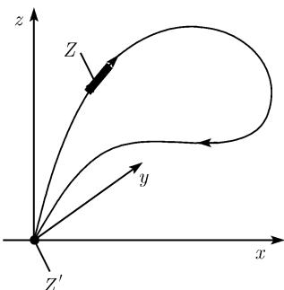

##### 3.9.5 对狭义相对论的应用

爱因斯坦的相对性原理 (1905)

$$
\text {   在任意两个具有完全相同的初始条件和边界条件的惯性条中,   所有的物理过程被认定具有完全相同的性态.   }\tag{3.89}
$$

一个惯性系 $\Sigma$ 是一个具有一个法正交基 $i, j, k$ 的笛卡儿坐标系 $(x, y, z)$ , 使得关于时间 $t$ 一个没有外力的物体处于静止状态或者以均速沿直线运动.

例 1: 在每个惯性系中的真空中, 光速是常值, 记为常数 c.

爱因斯坦的相对性原理取代了伽利略的相对性原理, 根据它, (3.89) 对于力学的物理过程成立.

例 2: 设 $\Sigma$ 和 $\Sigma'$ 为两个惯性系, 它们具有相互平行的轴, 在其上一个 $\Sigma$ 中的观察者观察到 $\Sigma'$ 的原点的运动, 其方程为

$$
x = v t
$$

(图 3.95). 根据伽利略的原理, 有变换公式

$$
x ^ {\prime} = x - v t, y ^ {\prime} = y, z = z ^ {\prime}, t = t ^ {\prime},\tag{3.90}
$$

它是在 $\Sigma$ 的坐标 $x, y, z, t$ 和 $\Sigma'$ 中坐标 $x', y', z', t'$ 之间的变换 (即所谓的伽利略变换). 在 $\Sigma$ 中的光线

$$
x = c t
$$

  
图 3.95 参照标架

在 $\Sigma'$ 中有方程

$$
x ^ {\prime} = (c - v) t ^ {\prime}.
$$

这表明若在 $\Sigma$ 中光速为 $c$ , 则它在 $\Sigma'$ 中的速度为 $c - v$ , 这表明例 1 中的论述不成立. 这就是为什么爱因斯坦把伽利略变换换作特殊洛伦兹变换

$$
\boxed {x ^ {\prime} = \frac {x - v t}{\sqrt {1 - v ^ {2} / c ^ {2}}}, \quad y ^ {\prime} = y, \quad z ^ {\prime} = z, \quad t ^ {\prime} = \frac {t - v x / c ^ {2}}{\sqrt {1 - v ^ {2} / c ^ {2}}} .}\tag{3.91}
$$

由 $x = ct$ 从而得到 $x' = ct'$ , 即例 1 中的论述现在实际有效.

若相对于光速 c, v 非常小, 则洛伦兹变换 (3.91) 近似于伽利略变换 (3.90). 更精确地, 当 $c \to \infty$ 时 (3.91) 的极限是 (3.90). 更加一般地, 有

$$
\boxed {\text {当} c \to \infty \text {时相对论的极限是经典物理}.}
$$

例 3: 若惯性系 $\Sigma'$ 不平行于 $\Sigma$ , 则应用一个旋转 D 可将 $\Sigma'$ 带到使其轴平行于 $\Sigma$ 的轴的位置. 在此之后, 我们可应用洛伦兹变换 (3.91), 然后以逆于原旋转 D 的逆旋转 $D^{-1}$ .

特殊洛伦兹变换 (3.91) 可以用双曲函数特别简洁的描述为形式

$$
\boxed {x ^ {\prime} = x \mathrm{cosh} \alpha - c t \mathrm{sinh} \alpha , \quad y = y ^ {\prime}, \quad z = z ^ {\prime}, \quad c t ^ {\prime} = c t \mathrm{cosh} \alpha - x \mathrm{sinh} \alpha .}
$$

其中的 $\alpha$ 定义为

$$
\tanh \alpha = {\frac {v}{c}}, \quad \text {即} \quad \alpha := \operatorname{arctanh} {\frac {v}{c}}, \quad \text {且} \quad | v | <   c.
$$

用我们今天的观点看, 爱因斯坦的相对性原理 (3.89) 比伽利略的相对性原理更为自然, 后者适用于一个特殊的物理学科——力学. 事实上, 爱因斯坦原理是对经典的时空思想的一个全面修订. 不再存在像是绝对世界时这样的东西, 而正好相反, 每个惯性系都有它们自己的时间概念. 另外, 只有速度 $v$ , $|v| < c$ 是被允许的. 爱因斯坦相关于此假定了要强得多的论述:

在一个给定的惯性系中, 任意一个物理作用最多以速度 c 传递.

洛伦兹变换 考虑变换

$$
\left( \begin{array}{c} x ^ {\prime} \\ y ^ {\prime} \\ z ^ {\prime} \\ c t ^ {\prime} \end{array} \right) = \mathcal {A} \left( \begin{array}{c} x \\ y \\ z \\ c t \end{array} \right) + \left( \begin{array}{c} x _ {0} \\ y _ {0} \\ z _ {0} \\ c t _ {0} \end{array} \right)\tag{3.92}
$$

并令

$$
\mathcal {L} _ {v} := \left( \begin{array}{c c c c} \beta & 0 & 0 & - \beta v / c \\ 0 & 1 & 0 & 0 \\ 0 & 0 & 1 & 0 \\ - \beta v / c & 0 & 0 & \beta \end{array} \right), \quad \mathcal {D} := \left( \begin{array}{c c c c} d _ {1 1} & d _ {1 2} & d _ {1 3} & 0 \\ d _ {2 1} & d _ {2 2} & d _ {2 3} & 0 \\ d _ {3 1} & d _ {3 2} & d _ {3 3} & 0 \\ 0 & 0 & 0 & 1 \end{array} \right),
$$

$$
\mathcal {S} := \left( \begin{array}{c c c c} s _ {1} & 0 & 0 & 1 \\ 0 & s _ {2} & 0 & 0 \\ 0 & 0 & s _ {3} & 0 \\ 0 & 0 & 0 & s _ {4} \end{array} \right),
$$

其中 $\beta := 1 / \sqrt{1 - v^2 / c^2}, s_j = \pm 1$ 对所有 $j$ 成立. 另外, $\mathcal{D}$ 是一个旋转, 即我们有 $\mathcal{DD}^{\mathrm{T}} = \mathcal{D}^{\mathrm{T}}\mathcal{D} = E$ 和 $\det \mathcal{D} = 1$ . 矩阵 $\mathcal{S}$ 对 $s_4 = 1$ 描述恒同映射或是空间中的一个反射. 当 $s_4 = -1$ 时, 我们得到对时间的反射.

定义 洛伦兹群 $O(3,1)$ 由形如

$$
\boxed {\mathcal {A} = \mathcal {S D} _ {1} \mathcal {L} _ {v} \mathcal {D} _ {2}.}
$$

的所有矩阵 A 组成.

由此得到 $\det\mathcal{A}=\det\mathcal{S}=\pm1$ 。又群 $SO(3,1)$ (分别地， $SO^{+}(3,1)$ ) 由所有满足 $\det\mathcal{S}=1$ 的矩阵 $\mathcal{A}\in O(3,1)$ (分别地 S=E) 组成。如果 A 是个洛伦兹变换，即 $\mathcal{A}\in O(3,1)$ ，则 (3.92) 被称作庞加莱变换。所有这些庞加莱映射的集合按定义组成了庞加莱群。另外，对于 $\mathcal{A}\in SO^{+}(3,1)$ 的洛伦兹变换被称为正常的，即不允许有空间和时间的反射。对于基本粒子理论我们需要整个庞加莱群 $^{1)}$ 。

几何解释 我们考虑闵可夫斯基空间. 一个伪法正交基 $e_1, e_2, e_3, e_4$ 及分解 $^{2)}$

$$
\pmb {u} = x _ {1} \pmb {e} _ {1} + x _ {2} \pmb {e} _ {2} + x _ {3} \pmb {e} _ {3} + x _ {4} \pmb {e} _ {4}.\tag{3.93}
$$

对应于笛卡儿坐标

$$
x = x _ {1}, \quad y = x _ {2}, \quad z = x _ {3} \quad {\text {和}} \quad x _ {4} = c t.
$$

我们还有 $e_{1}=i, e_{2}=j, e_{3}=k$ . 由此得到

1) 庞加莱群 $\mathcal{P}$ 是个 10 维实李群. 在 $\mathcal{P}$ 的李代数中可以找到 10 个基本算子, 它在量子场论中对应于能量守恒, 动量和角动量.

2) 代替 $x_{j}$ 我们在此也写作 $x^{j}$ .

$$
\pmb {u} = \pmb {x} + c t \pmb {e} _ {4}, \quad \text {其中} \quad \pmb {x} = x \pmb {i} + y \pmb {j} + z \pmb {k}.
$$

定理 庞加莱变换 (3.92) 的群 $\mathcal{P}$ 同构于 $M_4$ 上庞加莱变换

$$
\boxed {\boldsymbol {u} ^ {\prime} = \boldsymbol {A} \boldsymbol {u} + \boldsymbol {a}}
$$

的群 $P(M_4)$ . 这个同构由

$$
\pmb {u} ^ {\prime} = x _ {1} ^ {\prime} \pmb {e} _ {1} + x _ {2} ^ {\prime} \pmb {e} _ {2} + x _ {3} ^ {\prime} \pmb {e} _ {3} + x _ {4} ^ {\prime} \pmb {e} _ {4}, \quad \pmb {a} = x _ {0} \pmb {e} _ {1} + y _ {0} \pmb {e} _ {2} + z _ {0} \pmb {e} _ {3} + c t _ {0} \pmb {e} _ {4}
$$

并利用公式 (3.92) 计算 $x_{j}^{\prime}$ 给出.

固有时 考虑在一个惯性系统中以小于 c 的速度的一个质点的运动:

$$
\boldsymbol {x} = \boldsymbol {x} (t).
$$

于是曲线

$$
\boldsymbol {u} = \boldsymbol {u} (t) = \boldsymbol {x} (t) + c t \boldsymbol {e} _ {4}
$$

属于 $M_4$ 。我们有 $\pmb{u}'(t) = \pmb{x}'(t) + ce_4$ 和 $\pmb{u}'(t)^2 = \pmb{x}'(t)^2 - c^2$ 。由 (3.86)，固有时为

$$
\boxed {\tau = \int_ {t _ {0}} ^ {t} \sqrt {1 - \boldsymbol {x} ^ {\prime} (\sigma) ^ {2} / c ^ {2}} \mathrm{d} \sigma .}\tag{3.94}
$$

  
图 3.96 孪生佯谬

这个时间是固定在运动质点上的时钟所显示的. 爱因斯坦孪生佯谬 我们假设在一个惯性系的原点 $x = 0$ 在时刻 $t_0 = 0$ 诞生了一对孪生的 $Z$ 和 $Z'$ . 当 $Z'$ 留在原点时, $Z$ 以太空船旅行, 并在时刻 $t$ 返回. 于是 $Z$ 已经经历了固有时 $\tau$ 而 $Z'$ 则经历了固有时 $\tau' = t$ , 这是因为 $x = 0$ . 由 (3.94) 我们得到

$$
\boxed {\tau <   t,}
$$

即 Z 在他返回后比 $Z'$ 年轻. 旅行时的速度 $|x'(t)|$ 越大年龄的差异就越大 (图 3.96).

电动力学的麦克斯韦方程 在一个任意的惯性系中, 我们考虑下列的量:

E, 电场强度向量,

B, 磁场强度向量,

C, 电荷密度,

J, 电流密度向量.

这些量相伴于 $M_{4}$ 上下列的几何对象:

$$
F = \boldsymbol {E} \wedge e _ {4} - \operatorname{Alt} (\boldsymbol {B}), \quad J = \boldsymbol {J} + \varrho e _ {4}.\tag{3.95}
$$

由此得到.

$$
* F = - \boldsymbol {B} \wedge e _ {4} - \operatorname{Alt} (\boldsymbol {E}).\tag{3.96}
$$

称 $F$ 为电磁场张量. 因此麦克斯韦电动力学方程变成了极简单、漂亮的形式

$$
\boxed {\operatorname{Div} F = J, \quad \operatorname{Div} * F = 0.}\tag{3.97}
$$

第一个方程 $\operatorname{Div} F = J$ 表达的事实是, 电荷和电流是电磁场张量的源头. 第二个方程 $\operatorname{Div} * F = 0$ 反映了在电场和群场之间的一种对偶性, 并且还同时反映出某种非对称性, 它是由于没有齐次项而产生的. 原因是在经典的电动力学中没有作为孤立磁负荷 (磁单极子) 这样的东西. 这种非对称性使狄拉克感到困惑. 为了能从中解脱出来, 他假定了磁单极子的存在性. 在现代规范场的各种理论中这种磁单极子的存在性纯粹地来自数学. 当代研究者一直在空间中搜索这些东西的存在性.

讨论 公式化的 (3.97) 在闵可夫斯基空间 $M_4$ 是成立的. 如果 $F$ 和 $J$ 相对于 $M_4$ 的一组基 $b_1, \cdots, b_4$ 被表述, 于是我们得到了参照于基 $b_1, \cdots, b_4$ 系统的麦克斯韦方程的形式. 电场有转换为磁场的可能性, 反之亦然 $^{1)}$ .

对每个伪法正交基, $F$ 和 $J$ 具有相同的结构. 由此, 麦克斯韦方程在任何一个惯性系中具有相同形式. 显式地, 有2)

$$
\boxed { \begin{array}{c c} \operatorname{div} \boldsymbol {E} = \varrho , & \operatorname{div} \boldsymbol {B} = 0, \\ \mathbf {r o t} \boldsymbol {B} = \boldsymbol {E} _ {t} + \boldsymbol {J}, & \mathbf {r o t} \boldsymbol {E} = - \boldsymbol {B} _ {t}. \end{array} }\tag{3.98}
$$

这是借助于特殊洛伦兹变换 (3.91) 从一个惯性系 $\Sigma$ 到另一个惯性系 $\Sigma'$ 的转移, 在其中电磁场和电荷及电流必须作如下变换:

$$
\begin{array}{l l} \varrho^ {\prime} = \beta (\varrho - \boldsymbol {v} \boldsymbol {J}), & \boldsymbol {J} ^ {\prime} = \beta (\boldsymbol {J} - \boldsymbol {v} \varrho), \qquad Q ^ {\prime} = Q, \\ \boldsymbol {E} ^ {\prime} = \beta (\boldsymbol {E} _ {*} + \boldsymbol {v} \times \boldsymbol {B} _ {*}), & \boldsymbol {B} ^ {\prime} = \beta (\boldsymbol {B} _ {*} + \boldsymbol {E} _ {*} \times \boldsymbol {v}). \end{array}
$$

在此, $v := vi, E = E_{1}i + E_{2}j + E_{3}k$ , 以及 $\boldsymbol{E}_{*} = \beta^{-1}(E_{1}\boldsymbol{i} + E_{2}\boldsymbol{j} + E_{3}\boldsymbol{k})$ , 其中 $\beta^{-1} := \sqrt{1 - v^{2}}$ . 这些量均被写成无量纲的量.

1) 一个静电荷只能生成一个电场. 但是, 一个运动中的观察者看到的是一个运动的电荷, 它对应了一个产生磁场的电场.

在 1900 年左右, 运动的介质电动力学是物理学中一个重要的未解决问题. 不清楚该如何描述在参照坐标变化下电磁场的转变. 爱因斯坦在 1906 年认识到只需将伽利略变换替换为洛伦兹变换而麦克斯韦方程可以不变.

2) 这个分式化描述由于不包含物理常数非常引人注目. 这是由过渡到导致无量纲量的国际 MKSA 一系统并用表 1.5 的替换得到的:

$$
\pmb {x} \Rightarrow r _ {e} \pmb {x}, \quad t \Rightarrow r _ {e} t / c, \quad m _ {0} \Rightarrow m _ {e} m _ {0}, \quad Q \Rightarrow e Q, \quad \pmb {v} \Rightarrow c \pmb {v},
$$

$$
\pmb {E} \Rightarrow \frac {e}{4 \pi \varepsilon_ {0} r _ {e} ^ {2}} \pmb {E}, \quad \pmb {B} \Rightarrow \frac {1}{4 \pi \varepsilon_ {0} r _ {e} ^ {2} c} \pmb {B}, \quad \pmb {J} \Rightarrow \frac {e c}{4 \pi r _ {e} ^ {3}} \pmb {J}, \quad \varrho \Rightarrow \frac {e}{4 \pi \varepsilon_ {0} r _ {e} ^ {3} c} \varrho ,
$$

其中 e 是电子的电荷, $m_{e}$ 为其质量, $r_{e}$ 是其半径, 而 $\varepsilon_{0}$ 是在真空中的介电常数.

麦克斯韦方程的对偶对称性 由于 $* * F = -F$ , 麦克斯韦方程 (3.97) 具有一种对偶性, 它是由 (3.95) 和 (3.96) 在 $\rho = 0$ 和 $j = 0$ 时以及由替换

$$
\boldsymbol {E} \Rightarrow - \boldsymbol {B}, \quad \boldsymbol {B} \Rightarrow \boldsymbol {E}
$$

产生的.

在电磁场中一个负荷粒子的运动方程 一个处静止态粒子具质量 m 和电荷 Q 的运动 $u = u(\tau)$ 由方程 $^{1)}$

$$
\boxed {m _ {0} u ^ {\prime \prime} (\tau) = Q F (u (\tau)) u ^ {\prime} (\tau).}\tag{3.99}
$$

给出. 这对应于微分方程

$$
\boxed {\boldsymbol {p} ^ {\prime} (t) = Q \boldsymbol {E} (\boldsymbol {x} (t), t) + Q \boldsymbol {x} ^ {\prime} (t) \times \boldsymbol {B} (\boldsymbol {x} (t), t),}
$$

其中 $\boldsymbol{x} = \boldsymbol{x}(t)$ 为在任一惯性系中的轨线, $p := mx'$ 是动量向量, 并且称量

$$
m = \frac {m _ {0}}{\sqrt {1 - \pmb {x} ^ {\prime} (t) ^ {2} / c ^ {2}}}
$$

为此粒子的相对论质量. 它当该粒子的速度 $\left|x'(t)\right|$ 趋向光速 c 时增大.

运动方程 (3.99) 的第四个分量是在一个惯性系中的:

$$
\boxed {E ^ {\prime} (t) = Q \boldsymbol {E} (\boldsymbol {x} (t), t) \boldsymbol {x} ^ {\prime} (t).}
$$

这表明了能量

$$
\boxed {E = m c ^ {2}}
$$

随时间的变化等于电力 F = QE 施于运动粒子时的功率. 如果该粒子处于静止态, 则 $m = m_{0}$ , 我们得到了爱因斯坦的著名质能方程的特殊情形

$$
\boxed {E _ {0} = m _ {0} c ^ {2},}
$$

这是处于静止态的相对论粒子的能量. 这个能量是在促使太阳的能量产生的聚变过程中释放出来的.

注 除了使用在 (3.97) 中用到的四维向量分析的语言外, 麦克斯韦方程也能以一般张量分析的语言, 微分形式的语言, 以及主纤维丛的语言进行阐述. 这在 [212] 中有详细的讨论. 在那里也可以找到对于速度的相对论加法定理, 还有长度的相对论收缩和时间的相对论膨胀.

1) 如果 $b_{1}, b_{2}, b_{3}, b_{4}$ 是 $M_{4}$ 的一组基, 则有

$$
F = F ^ {j k} b _ {j} \wedge b _ {k}, \quad u = x ^ {j} b _ {j}, \quad F u = (F ^ {j k} x _ {k}) b _ {j},
$$

其中 $x_{k} = g_{kr}x^{r},g_{kr} = b_{k}b_{r}$ .在这里我们对出现在上和下的同一指标按1到4求和(爱因斯坦约定). $Fu$ 的定义与基选取无关.

电磁场的麦克斯韦方程已经显著推动了物理和数学的发展.

特别地, 我们可以在 $U(1)$ 规范场理论的背景下对麦克斯韦方程阐述. 如果我们把阿贝尔群 $U(1)$ 替换成其他李群 (例如 $U(2)$ 或 $U(3)$ ), 则我们便得了非阿贝尔的规范场论, 它已被用到了基本粒子理论中的标准模型中 (参看 [212]).
