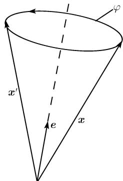

##### 3.9.6 旋量几何和费米子

相对论的电子与闵可夫斯基空间 $M_{4}$ 的克利福德代数紧密相关. 电子的自旋是由三维空间中旋转群 $SO(3)$ 的万有覆叠群 $\mathrm{Spin}(3)$ 给出的对称性; 而 $\mathrm{Spin}(3)$ 则同构于特殊酉群 $SU(2)$ . 当人们试图把复数的 (一个实二维空间) 结构推广到高维时, 自然地导向了克利福德代数. 哈密顿 (William Hamilton, 1805—1865) 在 1843 年第一个发现了四元数的四维空间, 这是他在寻找复数的三维类比的努力失败后得到的 $^{1)}$ . 欧几里得空间的克利福德代数是由克利福德 (William Clifford, 1845—1897) 引进的, 这出现在他逝世的前一年. 这些代数具有维数 $2^{n}, n = 1, 2, 3, \cdots$ .

记号 符号 $SL(z,\mathbb{C})$ 代表所有满足 $\operatorname{det} A = 1$ 的复 $(2\times 2)$ 矩阵 $A$ 的群. $SU(2,\mathbb{C})$ 中的酉矩阵按定义构成了群 $SU(2)$ . 另外, $U(1)$ 代表所有满足 $|z| = 1$ 的复数的 (乘法) 群. 群 $SO(n)$ 定义了所有 $(n\times n)$ 的满足 $\operatorname{det} A = 1$ 的实正交矩阵的群. 特别地, $SO(2)$ 由 $SU(2)$ 中的实矩阵组成.

3.9.6.1 闵可夫斯基空间的克利福德代数

设 $\mathcal{C}(M_4)$ 为闵可夫斯基空间 $M_4$ 的克利福德代数 (见2.4.3.4). 于是 $M_4 \subset \mathcal{C}(M_4)$ . 对所有 $\pmb{u}, \pmb{v} \in M_4$ , 我们有

$$
\boxed {\boldsymbol {u} \vee \boldsymbol {v} + \boldsymbol {v} \vee \boldsymbol {u} = 2 \boldsymbol {u} \boldsymbol {v}.}
$$

如果我们选取一组伪法正交基 $e_{1}, \cdots, e_{4}$ ，则有

$$
e _ {j} \vee e _ {k} + e _ {k} \vee e _ {j} = 2 e _ {j} e _ {k},\tag{3.100}
$$

即 $e_1 \vee e_1 = e_2 \vee e_2 = e_3 \vee e_3 = 1$ , 而 $e_4 \vee e_4 = -1$ , 同样有

$$
e _ {j} \vee e _ {k} = - e _ {k} \vee e _ {j}, \quad j = 1, 2, 3, 4.
$$

我们有 $\dim\mathcal{C}(M_{4})=16.\mathcal{C}(M_{4})$ 的一组基可取为下面的 16 个元素：

1) 按照哈密顿自己的说法, 是由于早餐时他的两个儿子问的问题导致了四元数的发现, 这个问题是: 你能对三元数组 $(a, b, c)$ 作乘积吗? 在长时间思考后他不能做到, 但他却发现一种方法去作四元数组 $(a, b, c, d)$ 的乘积, 即四元数的积 (见3.9.6.3)

三元数组没有乘法的直观理由是由于经典的向量积不是可结合的. 向量的概念也是由哈密顿在 1845 年引进的.

数学史上多次出现简单的提问导致了后来产生了描述自然的非常富于成果的数学结果.

(i) $1, e_{1}, e_{2}, e_{3}, e_{4};$

(ii) $e_1 \vee e_2, e_1 \vee e_3, e_1 \vee e_4, e_2 \vee e_3, e_2 \vee e_4, e_3 \vee e_4$ ;

(iii) $e_{1} \vee e_{2} \vee e_{3}, e_{1} \vee e_{2} \vee e_{4}, e_{1} \vee e_{3} \vee e_{4}, e_{2} \vee e_{3} \vee e_{4};$

(iv) $e_{1} \vee e_{2} \vee e_{3} \vee e_{4}.$

所有其他的乘积均可借助 (3.100) 用上面这些表述.

泡利矩阵和李代数 $su(2)$ 由定义, 代数 $su(2)$ 由满足 $\mathbf{A}^{*} = -\mathbf{A}$ 和 $\operatorname{tr} \mathbf{A} = 0$ 的复 $2 \times 2$ 矩阵组成. 称矩阵

$$
\boldsymbol {\sigma} _ {1} := \left( \begin{array}{c c} 0 & 1 \\ 1 & 0 \end{array} \right), \quad \boldsymbol {\sigma} _ {2} := \left( \begin{array}{c c} 0 & - \mathrm{i} \\ \mathrm{i} & 0 \end{array} \right), \quad \boldsymbol {\sigma} _ {3} := \left( \begin{array}{c c} 1 & 0 \\ 0 & - 1 \end{array} \right), \quad \boldsymbol {\sigma} _ {4} := \left( \begin{array}{c c} 1 & 0 \\ 0 & 1 \end{array} \right)
$$

为泡利矩阵; $i\sigma_{1}, i\sigma_{2}, i\sigma_{3}$ 构成实线性空间 $su(2)$ 的基, 令

$$
[ A, B ] := A B - B A
$$

则将其做成了一个李代数 $^{1)}$ .

泡利-狄拉克矩阵 这是些复 $4 \times 4$ 矩阵, 定义为

$$
\gamma_ {\alpha} = \mathrm{i} \left( \begin{array}{c c} 0 & - \sigma_ {\alpha} \\ \sigma_ {\alpha} & 0 \end{array} \right), \quad \gamma_ {4} := \mathrm{i} \left( \begin{array}{c c} 0 & \sigma_ {4} \\ \sigma_ {4} & 0 \end{array} \right), \quad \alpha = 1, 2, 3.
$$

另外, 我们令 $\gamma^{\alpha} := \gamma_{\alpha}, \alpha = 1, 2, 3$ 以及 $\gamma^{4} := -\gamma_{4}$ . 令 $\mathbf{Mat}(4, 4)$ 记所有 $4 \times 4$ 复矩阵的集合我们有

$$
\boxed {\gamma_ {j} \gamma_ {k} + \gamma_ {k} \gamma_ {j} = 2 \gamma_ {j} \gamma_ {k},} \quad j = 1, 2, 3, 4,\tag{3.101}
$$

我们立刻看出 (3.100) 与 (3.101) 相类似.

定理 相对于矩阵的乘法, $\mathbf{Mat}(4,4)$ 是一个克利福德代数. 利用相伴关系

$$
\boxed {e _ {j} \mapsto \gamma_ {j}}
$$

我们得到了闵可夫斯基空间的克利福德代数 $\mathcal{C}(M_4)$ 和克利福德代数 $\mathbf{Mat}(4,4)$ 间的同构.

例：在此同构下， $e_{j} \vee e_{k}$ 映到 $\gamma_{j}\gamma_{k}$ ，等等.

3.9.6.2 狄拉克方程及相对论的电子

在本节我们采用爱因斯坦的求和约定, 依此同时出现在上和下的同一指标被求和. 拉丁指标从 1 到 4, 希腊指标从 1 到 3.

狄拉克方程 狄拉克在 1928 年对自由电子推导出的方程是

$$
\partial \vee \Psi + \frac {m _ {0} c}{\hbar} \Psi = 0.\tag{3.102}
$$

这里的复四元列矩阵 $\Psi = (\varphi_1, \varphi_2, i x_1, i x_2)^{\mathrm{T}}$ 被称作这个电子的波函数. 我们简写其为 $\Psi = (\varphi, i x)^{\mathrm{T}}$ . 这个狄拉克方程 (3.102) 是关于具坐标 $x = (x^1, x^2, x^3, x^4)$ , $x^4 = ct$ 的惯性系写出来的 (参看 3.9.5). 函数 $\Psi = \Psi(x)$ 依赖于时空点 $x$ . 又, 我们令

$$
\partial \vee \psi := \gamma^ {k} \partial_ {k},
$$

其中 $\partial_k := \partial/\partial x^k$ . 另外, $c$ 为在真空中的光速, $m_0$ 是电子静止质量. $\hbar$ 是普朗克作用量子且 $\hbar = h/2\pi$ . 狄拉克方程 (3.102) 对应于方程组 $^{1)}$

$$
\boxed { \begin{array}{c} \sigma_ {\alpha} \partial_ {\alpha} \varphi - \sigma_ {4} \partial_ {4} \varphi + \frac {m _ {0} c}{\hbar} \chi = 0, \\ \sigma_ {\alpha} \partial_ {\alpha} \chi + \sigma_ {4} \partial_ {4} \chi + \frac {m _ {0} c}{\hbar} \varphi = 0. \end{array} }\tag{3.103}
$$

在变换下的性态 以一个正常洛伦兹变换从一个惯性系过渡到另一个惯性系时, 有

$$
\boxed { \begin{array}{c} x ^ {\prime} = L (\boldsymbol {A}) x, \\ \varphi^ {\prime} = \boldsymbol {A} ^ {*} \varphi , \quad \chi^ {\prime} = \boldsymbol {A} ^ {- 1} \chi , \quad \boldsymbol {A} \in S L (2, \mathbb {C}) \end{array} }.
$$

它把狄拉克方程变换为相应的对 $\Psi'$ 的方程. 对每个矩阵 $A \in SL(2, \mathbb{C})$ , 存在一个洛伦兹变换 $x' = L(A)x$ 对于它, 其中的 $x'$ 由方程

$$
\boxed {\sigma_ {j} x ^ {j ^ {\prime}} = \boldsymbol {A} ^ {- 1} (\sigma_ {j} x ^ {j}) (\boldsymbol {A} ^ {*}) ^ {- 1}.}
$$

导出. 我们称 $\varphi$ 和 $\chi$ 分别为旋量和双旋量.

定理 (i) 相伴关系 $\mathbf{A} \mapsto L(\mathbf{A})$ 给出了由群 $SL(2, \mathbb{C})$ 到正常洛伦兹群 $SO^{+}(3,1)$ 的同态, 其核为 $N = \{E, -E\}$ .

(ii) 存在同构

$$
\boxed {S L (2, \mathbb {C}) / N \simeq S O ^ {+} (3, 1).}
$$

(iii) 如果 $SL(2, \mathbb{C})$ 中矩阵 $\mathbf{A}$ 还另外是酉矩阵, 则洛伦兹变换 $x' = L(\mathbf{A})x$ 对应于一个空间旋转. 按此方式, 相伴关系 $\mathbf{A} \mapsto L(\mathbf{A})$ 产生一个从群 $SU(2)$ 到三维空间的旋转群 $SO(3)$ 的同态.

(iv) 存在同构 $^{1)}$

$$
\boxed {S U (2) / N \cong S O (3).}
$$

空间反射 $P$

$$
x ^ {\alpha^ {\prime}} = - x ^ {\alpha}, \quad \alpha = 1, 2, 3, \quad x ^ {4 ^ {\prime}} = x ^ {4},
$$

$$
\varphi^ {\prime} = \chi , \quad \chi^ {\prime} = - \varphi .
$$

时间的反射 $T$

$$
x ^ {\alpha^ {\prime}} = x ^ {\alpha}, \quad \alpha = 1, 2, 3, \quad x ^ {4 ^ {\prime}} = - x ^ {4},
$$

$$
\varphi^ {\prime} = \chi , \quad \chi^ {\prime} = \varphi .
$$

负荷对偶 $C$

$$
x ^ {j ^ {\prime}} = x ^ {j}, \quad j = 1, 2, 3, 4,
$$

$$
\varphi^ {\prime} = - \sigma_ {2} \overline {{\chi}}, \quad \chi^ {\prime} = \sigma_ {2} \overline {{\varphi}}.
$$

狄拉克方程在上述三个变换中每一个都不变. 对涉及基本粒子的一般过程, 存在一个在复合变换 PCT 下的不变量. 下面的这个直观的原理便隐藏在此不变量之后.

如果基本粒子的某个过程 $\mathcal{P}$ 在自然界是可能的, 则也就可能有另外一个过程 $\mathcal{P}'$ , 它是由 $\mathcal{P}$ 通过空间反射, 时间反射和从粒子转移到它的反粒子, 而所有这一切都在同一时刻发生.

电子自旋 算子

$$
\boxed {D \Psi = (\boldsymbol {x} \times \boldsymbol {p}) \Psi + \frac {\mathrm{h}}{2} s \Psi}
$$

称为总角动量算子. 所涉及的表达式的定义为

$$
\boldsymbol {p} := \frac {\hbar}{\mathrm{i}} e _ {\alpha} \partial_ {\alpha} \quad \text { and } \quad \boldsymbol {s} := \left( \begin{array}{c c} \sigma_ {\alpha} & 0 \\ 0 & \sigma_ {\alpha} \end{array} \right) e _ {\alpha},
$$

其中 $\alpha$ 被从 1 到 3 求和. 如果我们把狄拉克方程 (3.102) 写为形式 $i\hbar\partial_{4}\Psi = H\Psi$ , 我们便得到了

$$
\boxed {H D - D H = 0.}\tag{3.104}
$$

这里的 D 代表了一个守恒量, 它是一个对没有自旋算子 s 的表达式 $x \times P$ 不成立的性质. 对于 s 的 $e_{3}$ 分量, 我们有

$$
\boxed {s _ {3} \Psi_ {\pm} = \pm \frac {\hbar}{2} \psi_ {\pm}}
$$

1) 群 $SL(2, \mathbb{C})$ (分别地, $SU(2)$ ) 是 $SO^{+}(3, 1)$ (分别地, $SO(3)$ ) 的万有覆叠群更多的细节参看 [212].

其中 $\Psi_{+}:=2^{-\frac{1}{2}}(1,0,1,0)^{\mathrm{T}},\Psi_{-}=2^{-\frac{1}{2}}(0,1,0,1)^{\mathrm{T}}$ 。函数 $\Psi_{\pm}$ 代表电子具有 $e_3$ 轴方向大小为 $\pm\hbar/2$ 的一个自旋 (自角动量) 状态.

对总动量守恒的自然要求 (3.104) 因此强使电子自旋存在.

手征性 我们以表达式

$$
\boxed {P := \frac {1}{2} (1 + \gamma_ {5})}
$$

定义手征算子, 其中 $\gamma_{5} := -\mathrm{i}\gamma_{1}\gamma_{2}\gamma_{3}\gamma_{4}$ . 我们有 $\gamma_{5}^{2} = I$ 和

$$
P ^ {2} = P.
$$

满足 $P\Psi = \Psi$ 的状态 $\Psi$ 被赋予一个等于1的手征, 而对满足 $(I - P)\Psi = \Psi$ 的状态, 则赋以手征-1. 更明确地, 我们有

$$
\boldsymbol {\gamma} _ {5} = \left( \begin{array}{c c} \sigma_ {4} & 0 \\ 0 & - \sigma_ {4} \end{array} \right).
$$

它确切地是 $\gamma_{5}$ 的具有确定手征的特征向量的集合. 由 $\gamma_{5}\Psi=\alpha\Psi$ , 手征 $(\alpha=\pm1)$ 被确定.

例： $\Psi := (\varphi, 0)$ 具有手征 +1，而 $\Psi := (0, \mathrm{i}x)$ 具手征 -1。在空间反射 $\varphi \mapsto \varphi', x \mapsto x'$ 的情形，我们有

$$
\varphi^ {\prime} = x, \quad x ^ {\prime} = - \varphi ,
$$

即手征变号.

1956 年李政道和杨振宁引入假定, 称中微子自然地以手征 -1 出现. 这意味着当一个过程涉及中微子时, 不会出现空间的反射. 其结果被称为弱相互作用 (力) 的宇称不守恒, 这个空间的非对称性在 1957 年由吴健雄以实验证实, 这是她在对钴的 $\beta$ 衰变的观测中得出的. 同年李和杨因宇称不守恒理论而获诺贝尔物理奖.

费米子、玻色子和基本粒子的标准模型 所有具有一个半整自旋

$$
k \hbar / 2, \quad k = 1, 3, 5, \dots
$$

的粒子被称为费米子; 而其自旋为整的

$$
m \hbar , \quad m = 0, 1, \dots ,
$$

被称作玻色子. 目前形式的标准理论用作基本粒子的是

$$
\boxed {6 \text {个夸克和} 6 \text {个轻子(诸如电子和中微子)}}
$$

以及它们的反粒子 $^{1)}$ . 所有这些粒子都是费米子并由作为狄拉克方程的同一类型的方程描述. 根据局部规范不变性的原理, 这些狄拉克方程必定与对应于规范玻色子的另外的场相结合, 其中这些玻色子描述了 (或者传递了) 这 12 个基本费米子之间的作用 (参看 [212]). 例如, 电磁的相互作用由光子所传递 (表 3.11).

表 3.11 四个基本力的胶子

<table><tr><td>自然界中出现的相互作用</td><td>规范玻色子</td><td>旋量</td></tr><tr><td>电磁力</td><td>光子</td><td> $\hbar$ </td></tr><tr><td>强(核力)</td><td>8个胶子</td><td> $\hbar$ </td></tr><tr><td>弱(放射衰变)</td><td> $W^{\pm}, Z$ </td><td> $\hbar$ </td></tr><tr><td>引力</td><td>引力子</td><td> $2\hbar$ </td></tr></table>

反粒子的存在性只是在量子场论的背景下狄拉克方程的第二量子化后才需要. 超对称性 (SUSY) 一般都同意, 宇宙的实际模型应包含这样的概念——在爆炸后初期的物理是超对称的, 即对每个玻色子有一个相伴的粒子, 而它是一个费米子. 例如, 对应于引力子的费米子是具有旋量 $3\hbar / 2$ 的引力微子.

仍然希望下一代的加速器将能够证实超对称粒子的存在性, 它们至今还没有被观察到; 一个加速器的能量越大, 就能更好地模拟大爆炸后的条件.

3.9.6.3 希尔伯特空间的克利福德代数和旋量群

设 $X$ 为一实希尔伯特空间, 具有 $\dim X = n$ . 于是 $X$ 的克利福德代数 (参看2.4.3.4) $\mathcal{C}(X)$ 是 $X$ 的一个子集 $\mathcal{C}(X) \subset X$ , 并且

$$
\boxed {u \vee v + v \vee u = - 2 (u, v) _ {X}, \quad \text {对所有} u, v \in X,}
$$

其中 $(u,v)_{X}$ 代表 X 上的内积.

选取 X 的一组法正交基 $e_{1}, \cdots, e_{n}$ . 于是有

$$
e _ {j} \vee e _ {k} + e _ {k} \vee e _ {j} = - 2 \delta_ {j k}, \quad j, k = 1, \dots , n,
$$

即 $e_j \vee e_k = -e_k \vee e_j$ 当 $j \neq k$ , 而

$$
\boxed {e _ {j} \vee e _ {j} = - 1, \quad j = 1, \dots , n.}
$$

这个关系推广了对虚单位的方程 $i^{2} = -1$ . 我们令 $e_{0} := 1$ 以及

$$
e _ {\alpha} := e _ {\alpha_ {1}} \vee e _ {\alpha_ {2}} \vee \dots \vee e _ {\alpha_ {k}}
$$

对 $1 \ll \alpha_{1} < \cdots < \alpha_{k} \leqslant n, \alpha = (\alpha_{1}, \cdots, \alpha_{n})$ 及 $|\alpha| = \alpha_{1} + \cdots + \alpha_{n}$ .

基本定理 我们有 $\dim \mathcal{C}(x) = 2^n$ . $\mathcal{C}(x)$ 的一组基可由 $e_0$ 及 $e_{\alpha}$ 的集合组成. 例1：设 $\dim X = 1$ 则 $e_1 \vee e_1 = -1$ . 因此这种情形中可以在其克利福德代数 $\mathcal{C}(X)$ 可对元 $a + be_1$ 进行正像对复数那样的计算，即存在同构

$$
\mathcal {C} (X) \cong \mathcal {C} (\mathbb {R}) \cong \mathbb {C},
$$

即克利福德代数 $\mathcal{C}(\mathbb{R})$ 与域 C 之间的同构.

希尔伯特空间 $\mathcal{C}(X)$ 我们赋以 $\mathcal{C}(X)$ 一个唯一确定的内积 $(.,.)_{\mathcal{C}(X)}$ ，使得对于它基 $e_{0}, e_{\alpha}, \cdots$ 是法正交的，即有 $(e_{\beta}, e_{\gamma}) = 0$ 当 $\beta \neq \gamma$ ，而当 $\beta = \gamma$ 时有 $(e_{\beta}, e_{\gamma})_{\mathcal{C}(X)} = 1$ .

例 2: 对于 $\mathcal{C}(\mathbb{R})$ 有

$$
(a + b e _ {1}, c + d e _ {1}) _ {\mathcal {C} (X)} = a c + b d.
$$

克利福德范数 对任意 $u \in \mathcal{C}(X)$ ，定义

$$
\boxed {| u | := \sup \| u \vee w \| _ {\mathcal {C} (X)}.}
$$

在这里的上确界取自所有满足 $\|w\|_{\mathcal{C}(X)} \leqslant 1$ 的 $w \in \mathcal{C}(X)$ .

例 3: 对于 $\mathcal{C}(\mathbb{R})$ , 有

$$
\left| a + b e _ {1} \right| = \sqrt {a ^ {2} + b ^ {2}}.
$$

这个公式对应于复数 $a + \mathrm{bi}$ 的绝对值 $|a + \mathrm{bi}|$ , 而这个复数由上面的例 1 中那样, 对应于 $a + be_{1}$ .

共轭算子 赋值如下:

$$
\varphi (e _ {0}) := e _ {0}, \quad \varphi (e _ {j}) := - e _ {j}, \quad j = 1, \dots , n,
$$

我们得到一个克利福德代数的自同构 $\varphi : \mathcal{C}(X) \to \mathcal{C}(X)$ , 即映射 $\varphi$ 保持了线性组合和 $V$ 乘积. 我们也将 $\varphi(u)$ 记作 $\bar{u}$ .

例 4: 对 $j, k = 1, \cdots, n,$ 有

$$
\bar {e} _ {j} = - e _ {j}, \quad \overline {{e _ {j} \vee e _ {k}}} = \bar {e} _ {j} \vee \bar {e} _ {k} = e _ {j} \vee e _ {k}.
$$

例 5: 对于 $\mathcal{C}(\mathbb{R})$ 我们特别得到

$$
\overline {{(a + b e _ {1})}} = a - b e _ {1}.
$$

这时应了到复共轭数 $\overline{a+bi}=a-bi$ 的过渡.

\* 算子 令

$$
e _ {0} ^ {*} := e _ {0}, \quad e _ {j} ^ {*} := e _ {j}, \quad j = 1, \dots , n.
$$

而在基的其他元素上这个作用由将乘积的次序相反:

$$
\left(e _ {\alpha_ {1}} \vee e _ {\alpha_ {2}} \vee \dots \vee e _ {\alpha_ {k}}\right) ^ {*} := e _ {\alpha_ {k}} \vee \dots \vee e _ {\alpha_ {2}} \vee e _ {\alpha_ {1}}.
$$

最后再进一步要求 \* 算子在 $\mathcal{C}(X)$ 上为线性, 于是它被唯一确定.

例 6: $(a + be_{1} + ce_{1} \vee e_{2})^{*} = a + be_{1} + c(e_{2} \wedge e_{1}).$

哈密顿四元数代数 (1843) 考虑所有形式和

$$
\boxed {a + \boldsymbol {v},}
$$

它由实数 $a$ 和一个经典的 (三维) 向量 $\pmb{v}$ 组成. 我们以下面规则定义在此集合上的加法

$$
(a + \boldsymbol {v}) + (b + \boldsymbol {w}) := (a + b) + (\boldsymbol {v} + \boldsymbol {w})
$$

和一个乘法规则

$$
\boxed {(a + \boldsymbol {v}) \vee (b + \boldsymbol {w}) := a b + a \boldsymbol {w} + b \boldsymbol {v} + (\boldsymbol {v} \times \boldsymbol {w}) - \boldsymbol {v} \boldsymbol {w}.}
$$

这里的 $v \times w$ (分别地, $vw$ ) 代表经典的向量积 (分别地, 经典的内积).

这些运算满足结合律和分配律. 令

$$
\overline {{a + \boldsymbol {v}}} := a - \boldsymbol {v}.
$$

特别地, 得到

$$
(a + \boldsymbol {v}) \vee \overline {{(a + \boldsymbol {v})}} = a ^ {2} + \boldsymbol {v} ^ {2}.
$$

最后，令

$$
| a + \pmb {v} | = \sqrt {a ^ {2} + \pmb {v} ^ {2}}.
$$

于是所有这些元素的集合定义了一个非交换域, 其中

$$
(a + \boldsymbol {v}) ^ {- 1} = \frac {a - \boldsymbol {v}}{| a + \boldsymbol {v} |}.
$$

例 7: 设 i, j, k 为一组法正交基, 于是有

$$
\boxed {i \vee j = - j \vee i = k, \quad i \vee i = - 1.}\tag{3.105}
$$

其他的乘积则可以以循环置换 $i \rightarrow j \rightarrow k \rightarrow i$ 得到. 若记

$$
a + \boldsymbol {v} = a + \alpha \boldsymbol {i} + \beta \boldsymbol {j} + \gamma \boldsymbol {k},
$$

则乘法也可用 (3.105) 容易得到. 例如, 有

$$
(1 + i) \vee (j + k) = j + k + i \vee j + i \vee k = j + k + k - j = 2 k.
$$

定理 若 $X$ 是一个实希尔伯特空间具 $\dim X = 2$ 及法正交基 $i$ 和 $j$ , 则克利福德代数 $\mathcal{C}(X)$ 同构于 (哈密顿) 四元数代数. 此同构显式地由映射

$$
a + \alpha \boldsymbol {i} + \beta \boldsymbol {i} + \gamma (\boldsymbol {i} \vee \boldsymbol {j}) \mapsto a + \alpha \boldsymbol {i} + \beta \boldsymbol {j} + \gamma \boldsymbol {k}
$$

给出. 它保持绝对值 (范数) 不变并将每个元映到它的共轭元.

哈密顿旋转公式 设

$$
Q := \cos {\frac {\varphi}{2}} + e \sin {\frac {\varphi}{2}},
$$

其中 $e^{2}=1$ . 那么, 这个简洁的公式

$$
\boxed {\boldsymbol {x} ^ {\prime} = Q \vee \boldsymbol {x} \vee \bar {Q}}\tag{3.106}
$$

对应了向量 x 以角 $\varphi$ 绕轴 e 以数学正向的旋转 (图 3.97).

我们的目标是利用克利福德代数将公式 (3.106) 推广到高维情形.

群 $\operatorname{Spin}(n, X), n \geqslant 2$ 所有包含偶数个因子的乘积

  
图3.97

$$
a = u _ {1} \vee u _ {2} \vee \dots \vee u _ {2 k}
$$

并满足另外两个条件

$$
a \vee a ^ {*} = 1 \quad {\text {和}} \quad | a | = 1
$$

的集合对于乘积 “V” 构成一个群, 记其为 $\text{Spin}(n, X)$ .

布饶尔和外尔的定理 (1955) 每个元 $a \in \operatorname{Spin}(n, X)$ 通过表现

$$
D (a) u := a \vee u \vee a ^ {*}, \quad \text {所有} u \in X
$$

生成一个酉变换 (旋转) $D(a): X \rightarrow X$ . 映射

$$
a \mapsto D (a)
$$

给出了群 $\mathrm{Spin}(n,X)$ 到群 $SO(n,X)$ 的同态, 其核 $N=\{I,-I\}$ . 从而它给出了一个同构 $^{1)}$

$$
\boxed {\operatorname{Spin} (n, X) / N \cong S O (n, X).}
$$

对于 $X = R^{n}$ ，我们以 $\mathrm{Spin}(n)$ 代替 $\mathrm{Spin}(n, X)$ .

例 8: 我们有下列的同构 $^{2)}$ :

(i) $SO(2) \cong U(1), \mathbb{R}/\mathbb{Z} \cong SO(2)$ ; 实数的加法群 R 是 $SO(2)$ 的万有覆叠群.

(ii) Spin(3) ≅ SU(2).

(iii) Spin(4) ≅ SU(2) × SU(2).

(iv) $\operatorname{Spin}(n, X) \cong \operatorname{Spin}(n)$ 对于 $\dim X = n$ 的所有实希尔伯特空间 $X$ 成立.

1) 对 $n \geqslant 2$ , $\operatorname{Spin}(n, X)$ 是个 $n(n - 1)/2$ 维的紧实李群. 又, 对 $n \geqslant 3$ , $\operatorname{Spin}(n, X)$ 是 $SO(n, X)$ 的万有覆叠群.

2) (i)\~(ii) 是所谓例外同构的例子, 它们存在于某些低维李群间.

椭圆狄拉克算子 这个算子定义为

$$
D _ {4} := \sum_ {j = 1} ^ {n} e _ {j} \partial_ {j} \psi .
$$

它作用在函数 $\psi : \mathbb{R}^n \to \mathcal{C}(X)$ 上，取值于克利福德代数 $\mathcal{C}(X)$ 。又，我们定义拉普拉斯算子 $^{1)}$

$$
\boxed {\Delta := \sum_ {j = 1} ^ {n} \partial_ {j} ^ {2}.}
$$

定理 我们有

$$
D \vee D = - \Delta .
$$

注 此关系表明拉普拉斯算子可通过狄拉克算子构造. 这是为什么狄拉克算子在现代分析中起着极端基础作用的原因之一. 在流形上的狄拉克算子的指标计算问题是导向 1960 年阿蒂亚-辛格指标定理发现的问题之一. 这是 20 世纪中最深刻的结果之一 (参看 [212]) $^{2}$ .
