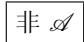

#### 4.1 数学的语言

与我们日常的交流形式相比, 数学使用的是一种非常精确的语言; 我们先来解释一些有关的基本概念.

##### 4.1.1 真命题和假命题

一个命题是一种要么为真要么为假的有意义的语言结构.

析取 若 A 和 B 表示命题, 则存在一个复合命题

若两个命题 A 或 B 之一为真, 则它是真的; 若两个命题 A 和 B 都是假的, 则复合命题 “A 或 B” 也是假的. 这个命题称为一个析取命题或者一个或命题.

例 1: 命题 “2 整除 4 或 3 整除 5” 是真的, 因为该命题的第一部分是真的.

另一方面, 命题 “2 整除 5 或 3 整除 7” 是假的, 因为该命题的两部分都是假的.

严格析取 命题

要么 $\mathcal{A}$ 要么 $\mathcal{B}$

是真的, 如果两个命题之一为真, 并且 (同时) 另一个为假; 在所有其他情形中, 命题 “要么 A 要么 B” 是假的.

例 2: 设 m 是一个整数. 命题 “要么 m 是偶数要么 m 是奇数” 是真的.

另一方面, 命题 “要么 m 是偶数要么 m 被 3 整除” 是假的.

合取 命题

被定义成真的, 如果该命题的两部分都是真的; 否则, 它是假的. 这个命题称为一个合取命题或者一个与命题.

例 3: 命题 “2 整除 4 且 3 整除 5” 是假的.

否定 命题

是真 (假) 的, 如果 $\mathcal{A}$ 是假 (真) 的.

存在命题 设 $D$ 是一个固定的对象集合. 例如, $D$ 可能代表实数集合.

略显冗长的命题

$D$ 中存在具有性质 $E$ 的一个对象 $x$

可以简写成

$$
\left| \exists_ {x \in D}: E (\text {或者} \exists_ {x \in D} | E). \right|
$$

这个命题是真的, 若 $D$ 中存在一个具有性质 $E$ 的对象 $x$ ; 反之, 若 $D$ 中不存在任何这样的具有上述性质的对象 $x$ , 则这个命题是假的. 这样的一个命题称为一个存在命题.

例 4: 命题 “存在具有性质 $x^{2} + 1 = 0$ 的一个实数 x” 是假的.

概括命题 同上面一样, 我们也把命题

$D$ 中的所有对象 $x$ 都具有性质 $E$

简写成

$$
\left| \forall_ {x \in D}: E (\text {或者} \forall_ {x \in D} | E). \right|
$$

这个命题是真的, 如果 $D$ 中的所有对象 $x$ 都具有性质 $E$ ; 若 $D$ 中至少有一个对象 $x$ 不具有这一性质, 则该命题为假. 这样的一个命题称为一个概括命题, 或者更经常地, 称为一个全称命题.

例 5: 命题 “所有的整数都是素数” 是假的, 因为 (例如)4 不是素数.

##### 4.1.2 蕴涵

对于命题

A 蕴涵B(或者B由A推出)

我们使用符号记作

$$
\boxed {\mathcal {A} \Rightarrow \mathcal {B}.}\tag{4.1}
$$

这样的一个复合命题称为一个推论(或者蕴涵). 关于 (4.1) 下列术语是我们再熟悉不过的了:

(i) A 对于 B 是充分的;

(ii) B 对于 A 是必要的.

蕴涵 “ $A \Rightarrow B$ ” 是假的, 如果假设 A 是真的而被推出的命题 B 是假的; 否则, 该蕴涵是真的. 这与数学中乍看起来有些令人惊讶的约定是相符的, 即从一个假的前提 (假设) 出发作出的任何结论都是真的. 换句话说, 利用一个假的假设, 人们可以证明任何事情. 下面的例子表明这个约定是十分自然的并且与数学命题的通常表述相一致.

例 1: 设 m 是一个整数. 命题 A (相应地有, B) 是 “m 能被 6 整除”(相应地有, “m 能被 2 整除”). 于是蕴涵 “ $A \Rightarrow B$ ” 能被表述如下:

由 $m$ 关于6的可除性可以推出 $m$ 关于2的可除性.

(4.2)

这也可以表述为

(a) m 关于 6 的可除性对于 m 关于 2 的可除性来说是充分的;

(b) $m$ 关于2的可除性对于 $m$ 关于6的可除性来说是必要的.

直观上读者会认为命题 (4.2) 总是真的, 即它表达的是一个数学定理. 但要实际去证明这是对的, 我们必须要考虑两种情形:

情形 1: m 能被 6 整除.

这是指有一个整数 $k$ 使得 $m = 6k$ . 这也意味着 $m = 2(3k)$ , 它表达了 $m$ 能被2整除这个事实; 因此, 命题 (4.2) 在这种情形中是正确的.

情形 2: m 不能被 6 整除.

这意味着前提是假的 (由此推出的任何结论都是正确的), 因此, 推论 (4.2) 在这种情形中也是正确的.

将两种情形合起来考虑, 我们看到命题 (4.2) 总是真的. 我们在上面展示的论证就是人们所称的 (4.2) 的一个证明.

逻辑等值 从 “ $\mathcal{A} \Rightarrow \mathcal{B}$ ” 到 “ $\mathcal{B} \Rightarrow \mathcal{A}$ ” 的推论是假的. 例如, 命题 (4.2) 反方向的蕴涵是假的. 这也可表达成对于 $m$ 能被 6 整除来说, $m$ 关于 2 的可除性是必要的, 但不是充分的.

一个形式为

$$
\boxed {\mathcal {A} \Leftrightarrow \mathcal {B}}\tag{4.3}
$$

的命题的意思是指两个蕴涵 “ $\mathcal{A} \Rightarrow \mathcal{B}$ ” 和 “ $\mathcal{B} \Rightarrow \mathcal{A}$ ” 都为真。作为所说的逻辑等值(4.3) 的替代, 下列中的任何一个都可用来描述同样的情况:

(i) A 成立当且仅当 B 成立;

(ii) A 对于 B 是充分必要的;

(iii) B 对于 A 是充分必要的.

例 2: 设 m 是一个整数. 命题 A(相应地有, B) 是 “m 能被 6 整除”(相应地有, “m 能被 2 和 3 整除”), 则逻辑等值 “ $A \Leftrightarrow B$ ” 是指

人们也可以说： $m$ 关于2和3的可除性对于 $m$ 关于6的可除性而言是充分必要的.

逻辑等值形式的数学命题总是包含一个推论, 因而对于数学来说尤其重要.
蕴涵的换位 一个给定的蕴涵 “ $A \Rightarrow B$ ” 总是隐含着并且隐含于新的 (等价的) 蕴涵

$$
\boxed {\text {非} \mathcal {B} \Rightarrow \text {非} \mathcal {A},}
$$

其中命题 “非 A” 的意思是假定 A 不成立, “非 B” 具有同样的意思. 注意到每个命题 (A 和 B) 是被否定的, 而蕴涵的方向是逆过来的. 这称为蕴涵 “ $A \Rightarrow B$ ” 的换位或否定.

例 3: 从命题 (4.2) 我们得到新的命题: 如果 m 不能被 2 整除, 则 m 也不能被 6 整除.

逻辑等值的换位 从逻辑等值 “ $A \Leftrightarrow B$ ” 我们得到新的等价的逻辑等值

$$
\left| \text {非} \mathcal {A} \Leftrightarrow \text {非} \mathcal {B}. \right|
$$

例 4: 设 $(a_{n})$ 是一个递增的 (或者递减的) 实数序列. 考虑定理: $^{1)}$

$$
(a _ {n}) \text {   是收敛的   } \Leftrightarrow (a _ {n}) \text {   是有界的.   }
$$

对这个逻辑等值应用换位我们得到新定理：

$$
(a _ {n}) \text {   是不收敛的   } \Leftrightarrow (a _ {n}) \text {   不是有界的.   }
$$

换句话说, (i) 一个递增的 (或者递减的) 序列是收敛的, 当且仅当它是有界的;

(ii) 一个递增的 (或者递减的) 序列是不收敛的, 当且仅当它不是有界的.

##### 4.1.3 重言律和逻辑定律

重言式是复合命题, 无论组成它的部分命题的真值为何, 它总是真的. 我们全部的逻辑思维 (这是数学的根基) 本身是建立在重言式的应用基础之上的. 这些重言式也可看作逻辑定律. 以下就是最重要的重言式.

(i) 析取和合取的分配律:

$$
\mathcal {A} \text { 且 } (\mathcal {B} \text { 或 } \mathcal {C}) \Leftrightarrow (\mathcal {A} \text { 且 } \mathcal {B}) \text { 或 } (\mathcal {A} \text { 且 } \mathcal {C}),
$$

$$
\mathcal {A} \text {或} (\mathcal {B} \text {且} \mathcal {C}) \Leftrightarrow (\mathcal {A} \text {或} \mathcal {B}) \text {且} (\mathcal {A} \text {或} \mathcal {C}).
$$

(ii) 否定之否定:

$$
\text { 非 } (\mathcal {\text { 非 }} \mathcal {A}) \Leftrightarrow \mathcal {A}.
$$

(iii) 蕴涵的换位:

$$
(\mathcal {A} \Rightarrow \mathcal {B}) \Leftrightarrow (\text { 非 } \mathcal {B} \Rightarrow \text { 非 } \mathcal {A}).
$$

(iv) 逻辑等值的换位:

$$
(\mathcal {A} \Rightarrow \mathcal {B}) \Leftrightarrow (\text { 非 } \mathcal {B} \Rightarrow \text { 非 } \mathcal {A}).
$$

(v) 析取的否定 (德摩根律) $^{1)}$ :

$$
\text { 非 } (\mathcal {A} \text { 或 } \mathcal {B}) \Leftrightarrow (\text { 非 } \mathcal {A} \text { 且非 } \mathcal {B}).
$$

(vi) 合取的否定 (德摩根律) $^{1)}$ :

$$
\boxed {\text {非} (\mathcal {A} \text {且} \mathcal {B}) \Leftrightarrow (\text {非} \mathcal {A} \text {或非} \mathcal {B}).}
$$

(vii) 存在命题的否定:

$$
\boxed {\text {非} (\exists_ {x} | E) \Leftrightarrow (\forall_ {x} | \text {非} E).}
$$

(viii) 概括命题的否定:

$$
\boxed {\text {非} (\forall_ {x} | E) \Leftrightarrow (\exists_ {x} | \text {非} E).}
$$

(ix) 蕴涵的否定:

$$
\boxed {\text {非} (\mathcal {A} \Rightarrow \mathcal {B}) \Leftrightarrow (\mathcal {A} \text {且非} \mathcal {B}).}
$$

(x) 逻辑等值的否定:

$$
\text { 非 } (\mathcal {A} \Leftrightarrow \mathcal {B}) \Leftrightarrow \{(\mathcal {A} \text { 且非 } \mathcal {B}) \text { 或 } (\mathcal {B} \text { 且非 } \mathcal {A}) \}.
$$

(xi) 狄奥弗拉斯特 (公元前 372—前 287) 的分离基本规则 (肯定前件式):

$$
\boxed {\{(\mathcal {A} \Rightarrow \mathcal {B}) \text {且} \mathcal {A} \} \Rightarrow \mathcal {B}.}
$$

(i) 中的重言式是集合论 (见 4.3.2) 中 (关于并和交的) 分配律的根据.

否定之否定律意味着一个命题的双重否定逻辑等值于原来的命题.

我们已经在 4.1.2 的例 3 和例 4 中使用了重言式 (iii) 和 (iv).

重言式 (iv) 到 (x) 经常被用于数学中的间接证明 (见 4.2.1).

分离规则 (xi) 蕴涵着下列逻辑定律, 在整个数学中经常被使用, 因此有时被称为逻辑学基本定理:

如果一个命题 $\mathcal{B}$ 由假设 $\mathcal{A}$ 推出, 并且如果假设 $\mathcal{A}$ 被满足, 那么命题 $\mathcal{B}$ 成立.

德摩根律 (v) 蕴涵着下列逻辑定律:

一个析取的否定逻辑等值于否定后的支命题的合取.

例: 设 m 是一个整数. 则:

(i) 若数 $m$ 不满足: 它是偶数或它能被 3 整除, 则 $m$ 不是偶数且 $m$ 不能被 3 整除.

(ii) 若数 $m$ 不满足: 它是偶数且它能被 3 整除, 则 $m$ 不是偶数或 $m$ 不能被 3 整除.

重言式 (vii) 用文字来表达就是命题：若不存在具有性质 $E$ 的对象 $x$ ，则所有对象都不具有性质 $E$ ，并且逆命题也是真的。

重言式 (viii) 用文字来表达是说: 若所有对象 $x$ 具有性质 $E$ 不是真的, 则存在一个对象 $x$ , 它不具有性质 $E$ , 并且逆命题也成立.
