#### 4.3 朴素集合论

在本节中将叙述对于集合的朴素处理. 对此给出的一个公理基础可以在 4.4.3 中找到.

##### 4.3.1 基本概念

类和元素 一个类是对象的一个汇集. 符号

$a\in A$

的意思是对象 $a$ 属于类 $A$ . 符号

的意思是对象 a 不是类 A 的元素. 要么 $a \in A$ 是真的要么 $a \notin A$ 是真的.

在数学中, 人们经常考虑类的类, 即类是多重的. 例如, 一个平面是一个类, 其元素是点. 另一方面, 通过三维空间原点的所有平面之集是一个类, 称为格拉斯曼流形. 有两种类型的类 (图 4.1):

(i) 若一个类本身是一个新类中的元素, 则这个类称为集合,

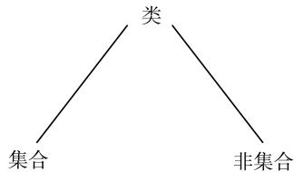  
图 4.1 集合与非集合

(ii) 若一个类不能成为一个新类的元素, 则这个类称为非集合.

直观上, 人们可以认为非集合是如此巨大的类, 以致没有更大的类能够将其纳为一个元素. 例如, 所有集合的类是一个非集合.

集合论是 G. 康托尔(1845—1918) 在 19 世纪最后的四分之一时期创立的. 康托尔的这一惊世思想是要通过引入超穷基数 (见 4.3.4) 以及发展一种超穷序数和超穷基数的算术 (见 4.4.4) 而给出无穷的结构. 康托尔给出了下面的定义:

“一个集合是我们的想象或我们的直觉中适当定义的对象 (因此它们是该集合的元素) 的一个汇总。”

1901 年, 英国哲学家和数学家 B. 罗素发现 “所有集合的集” 的概念是矛盾的 (罗素悖论). 这在数学基础中产生了一场危机, 然而, 通过

(i) 在集合与非集合之间作出区分, 及

(ii) 赋予集合论一个公理基础, 这一危机能够被化解.

通过定义所有集合的汇总不是一个集合, 而是一个非集合, 罗素悖论得以解决. 我们将在 4.4.3 对此作更详细的讨论.

子集与集合的相等 如果 A 和 B 是集合, 则符号

$$
\boxed {A \subseteq B}
$$

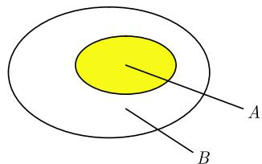  
图4.2 子集

表示 A 的每个元素同时是 B 的一个元素. 人们也说 A 是 B 的一个子集(图 4.2). 若两个条件 $A \subseteq B$ 和 $B \subseteq A$ 都满足, 则两个集合 A 和 B 称为是相等的, 用符号记作

$$
\boxed {A = B.}
$$

而且, 如果 $A \subseteq B$ 并且 $A \neq B$ , 就写成

$$
\boxed {A \subset B.}
$$

对于集合 A, B 和 C, 下列规则是正确的.

(i) $A \subseteq A$ (自反性);

(ii) 条件 $A \subseteq B$ 和 $B \subseteq C$ 蕴涵着关系 $A \subseteq C$ (传递性);

(iii) 条件 $A \subseteq B$ 和 $B \subseteq A$ 蕴涵着关系 A = B (反对称性).

性质 (iii) 用于证明 (而且事实上经常是唯一的证明方法) 集合的相等 (见 4.3.2 中的例子).

集合的定义 定义集合的最重要方法是借助于公式

$$
\boxed {A := \{x \in B | \text {对于} x \text {命题} \mathscr {A} (x) \text {成立} \}.}
$$

这意味着集合 $A$ 由集合 $B$ 的这样一些元素 $x$ 组成, 对于它们命题 $\mathcal{A}(x)$ 是真的. 例: 设 $\mathbb{Z}$ 表示整数集. 则公式

$$
A := \{x \in \mathbb {Z} | x \text {被} 2 \text {整除} \}
$$

定义了偶数集. 如果 $a$ 和 $b$ 是对象, 则 $\{a\}$ (相应地, $\{a, b\}$ ) 表示只包含元素 $a$ (相应地, 元素 $a$ 和 $b$ ) 的集合.

空集 符号 $\varnothing$ 表示空集, 它是不包含任何元素的集合 (注意这个集合是被唯一定义的).

##### 4.3.2 集合的运算

在本节中设 A, B, C, X 表示集合.

两个集合的交 两个集合 A 和 B 的交记作

$$
A \cap B,
$$

按定义包含所有既属于 A 又属于 B 的元素 (图 4.3(a)). 应用上面的公式记号, 这就是 $A \cap B := \{x \mid x \in A \text{ 且 } x \in B\}$ .

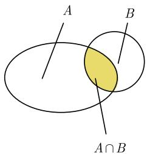  
(a)

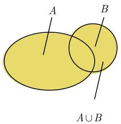  
(b)

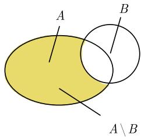  
图 4.3 集合的交、并和差  
(c)

如果 $A \cap B = \varnothing$ , 则称集合 $A$ 和 $B$ 是不相交的. 两个集合的并 两个集合 $A$ 和 $B$ 的并记作

$$
\boxed {A \cup B,}
$$

按定义包含要么属于 A 要么属于 B 的元素 (图 4.3(b)).

我们有交和并之间的包含关系:

$$
\boxed {(A \cap B) \subseteq A \subseteq (A \cup B).}
$$

而且, $A \subseteq B$ 等价于 $A \cap B = A$ 也等价于 $A \cup B = B$ .

交 $A \cap B$ (相应地, 并 $A \cup B$ ) 在表现方式上类似于两个数的积 (相应地, 和); 空集 $\varnothing$ 扮演着数 0 的角色. 显然, 我们有下列规则.

(i) 交换律:

$$
A \cap B = B \cap A, \quad A \cup B = B \cup A.
$$

(ii) 结合律:

$$
A \cap (B \cap C) = (A \cap B) \cap C, \quad A \cup (B \cup C) = (A \cup B) \cup C.
$$

(iii) 分配律:

$$
\left| A \cap (B \cup C) = (A \cap B) \cup (A \cap C), \quad A \cup (B \cap C) = (A \cup B) \cap (A \cup C). \right.
$$

(iv) 零元:

$$
A \cap \varnothing = \varnothing , \quad A \cup \varnothing = A.
$$

例 1: 要证明 $A \cap B = B \cap A$ .

步骤 1: 证明 $A \cap B \subseteq B \cap A$ . 事实上, 我们有

$$
a \in (A \cap B) \Rightarrow (a \in A \text {且} a \in B) \Rightarrow (a \in B \text {且} a \in A) \Rightarrow a \in (B \cap A).
$$

步骤 2: 证明 $B \cap A \subseteq A \cap B$ . 这可按我们证明步骤 1 时同样的方法推出 (交换 A 和 B).

从这两个步骤我们得到 $A \cap B = B \cap A$ . 证毕.

两个集合的差 差集

$$
\boxed {A \backslash B}
$$

按定义包含 A 中不是 B 的元素的那些元素 (图 4.3(c)). 应用上面的公式记法, 这就是 $A \setminus B := \{x \in A | x \notin B\}$ . 这一符号并不普遍; 在某些情形, 它可能被误作陪集符号. 为了避免误解, 符号 A - B 也经常被使用.

除了明显的包含关系

$$
A \backslash B \subseteq A
$$

以及 $A \backslash A = \varnothing$ 外, 下列规则成立.

(i) 分配律:

$$
(A \cap B) \backslash C = (A \backslash C) \cap (B \backslash C), \quad (A \cup B) \backslash C = (A \backslash C) \cup (B \backslash C).
$$

(ii) 广义分配律:

$$
A \backslash (B \cap C) = (A \backslash B) \cup (A \backslash C), \quad A \backslash (B \cup C) = (A \backslash B) \cap (A \backslash C).
$$

(iii) 广义结合律:

$$
(A \backslash B) \backslash C = A \backslash (B \cup C), \quad A \backslash (B \backslash C) = (A \backslash B) \cup (A \cap C).
$$

集合的补 设 A 和 B 是集合 X 的子集. A 在 X 中的补

$$
\boxed {C _ {X} A}
$$

A 按定义是 X 的不属于 A 的元素的集合, 即, $C_{X}A:=X\backslash A$ (图 4.4(b)). 我们有不交的分解 $X=A\cup C_{X}A, A\cap C_{X}A=\varnothing$ . 而且, 我们有所谓的德摩根律:

$$
\boxed {\mathrm{C} _ {X} (A \cap B) = \mathrm{C} _ {X} A \cup C _ {X} B, \quad \mathrm{C} _ {X} (A \cup B) = \mathrm{C} _ {X} A \cap \mathrm{C} _ {X} B.}
$$

此外， $C_{X}X = \varnothing, C_{X}\varnothing = X$ 并且 $C_{X}(C_{X}A) = A.$ 包含 $A \subseteq B$ 等价于 $C_{X}B \subseteq C_{X}A.$

有序对 直观上, 一个有序对 $(a, b)$ 是两个对象 $a$ 和 $b$ 的一个汇总, 附带着一个序 (" $a$ 在先"). 其精确的数学定义如下 1):

$$
(a, b) := \{\{a \}, \{a, b \} \}.
$$

1) 这意味着 $(a, b)$ 是一个集合, 它由单元集 (具有一个元素的集) $\{a\}$ 和集合 $\{a, b\}$ 所组成.

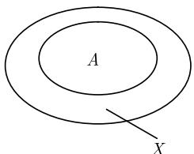  
(a) $A \subseteq X$

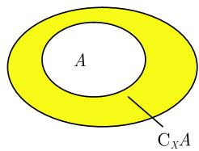  
(b) $X = A\cup C_{X}A$  
图 4.4 集合的补

由此推出, $(a,b)=(c,d)$ 当且仅当a=c且b=d.

对于 $n=1,2,3,4,\cdots$ 应用条件

$$
(a _ {1}, \dots , a _ {n}) := \left\{ \begin{array}{l l} a _ {1}, & \text {对于} n = 1, \\ (a _ {1}, a _ {2}), & \text {对于} n = 2, \\ ((a _ {1}, \dots , a _ {n - 1}), a _ {n}), & \text {对于} n > 2 \end{array} \right.
$$

相继地定义 n 元有序组.

两个集合的笛卡儿积 如果 A 和 B 是集合, 则两个集合的笛卡儿积, 记作

$$
\boxed {A \times B}
$$

按定义包含所有的有序对 $(a, b)$ , 其中 $a \in A$ 且 $b \in B$ . 对任意的集合 $A, B, C, D$ , 我们有下面的分配律:

$$
A \times (B \cup C) = (A \times B) \cup (A \times C), \quad A \times (B \cap C) = (A \times B) \cap (A \times C),
$$

$$
(B \cup C) \times A = (B \times A) \cup (C \times A), \quad (B \cap C) \times A = (B \times A) \cap (C \times A),
$$

$$
A \times (B \backslash C) = (A \times B) \backslash (A \times C), \quad (B \backslash C) \times A = (B \times A) \backslash (C \times A).
$$

我们有 $A \times B = \varnothing$ 当且仅当 $A = \varnothing$ 或 $B = \varnothing$ .

类似地, 对于 $n=1,2,\cdots$ , 定义笛卡儿积

$$
\boxed {A _ {1} \times \dots \times A _ {n}}
$$

为所有 n 元有序对 $(a_{1},\cdots,a_{n})$ 的集合, 其中对所有的 $j=1,2,\cdots,a_{j}\in A_{j}$ . 应用积号这也可以记作 $\prod_{j=1}^{n}A_{j}$ .

不交并 一个不交并, 记作

$$
\boxed {A \bigcup_ {\mathrm{d}} B}
$$

是并 $(A \times \{1\}) \cup (B \times \{2\})$ . 记号 $A \dot{\cup} B$ 也常用于表示不交并.

例 2: 对于 $A := \{a, b\}$ ，我们有 $A \cup A = A$ ，但

$$
A \cup_ {d} A = \{(a, 1), (b, 1), (a, 2), (b, 2) \}.
$$

##### 4.3.3 映射

直观定义 两个集合 $X$ 和 $Y$ 之间的一个映射, 记作

$$
\boxed {f: X \to Y}
$$

是唯一定义的元素 $y = f(x)$ 对每个 $x \in X$ 而言的一种关联; $f(x)$ 称为 $x$ 的象点. 映射也常常被说成是函数, 尽管后面的这个术语一般地更经常用于象为实数集或复数集的映射.

若 $A \subseteq X$ , 则我们定义 $A$ (在 $f$ 下) 的像为

$$
f (A) := \{f (a) | a \in A \}.
$$

集合 X 称为 f 的定义域, 集合 $f(X)$ 称为 f 的值域.

f 的定义域也记作 $D(f)$ 或者 Dom f; 值域也记作 $R(f)$ 或者 Im f, 后者表示 f 的象 (更确切地说是 “f 的定义域的象”, 即 f 在其上有定义的整个集合的象集).

集合

$$
G (f) := \{(x, f (x)) | x \in X \}
$$

称为 f 的图像.

例 1: 通过对所有的实数 x 规定 $f(x) := x^{2}$ 我们得到一个函数 $f : R \to R$ ，其中 $D(f) = \mathbb{R}$ 而 $R(f) = [0, \infty]$ . 图像 $G(f)$ 由图 4.5(a) 中所描绘的抛物线给出.

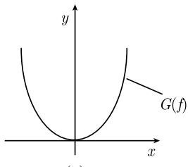

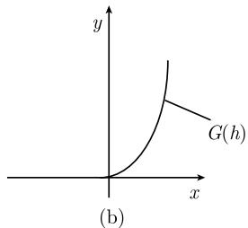  
图4.5 函数的图像

函数的分类 设给定映射 $f: X \rightarrow Y$ . 我们考虑方程

$$
\boxed {f (x) = y.}\tag{4.18}
$$

(i) $f$ 称为满射, 当且仅当方程 (4.18) 对每个 $y \in Y$ 有一个解 $x \in X$ , 即 $f(X) = Y$ .

(ii) $f$ 称为单射, 当且仅当方程 (4.18) 对每个 $y \in Y$ 至多有一个解, 即 $f(x_{1}) = f(x_{2})$ 蕴涵着 $x_{1} = x_{2}$ .

(iii) $f$ 称为双射, 当且仅当它既是单射也是满射, 即对每个 $y \in Y$ 恰有一个 (4.18) 的解 $x \in X$ .

逆映射 若映射 $f: X \to Y$ 是单射, 则 (对于一个给定的 $y \in Y$ ) 用 $f^{-1}(y)$ 代表 (4.18) 的唯一解 $x \in X$ 并称 $f^{-1}: f(X) \to X$ 为 $f$ 的逆映射.

例 2: 令 $X := \{a, b\}$ , $Y := \{c, d, e\}$ . 设

$$
f (a) := c, \quad f (b) := d,
$$

则 $f: X \rightarrow Y$ 是单射, 但不是满射. 逆映射 $f^{-1}: f(X) \rightarrow X$ 由

$$
f ^ {- 1} (c) = a, f ^ {- 1} (d) = b
$$

给出.

例 3: 若对于所有的实数 x, 设 $f(x) := x^{2}$ ，则映射 $f := R \to [0, \infty)$ 是满射，但不是单射，因为例如方程 $f(x) = 4$ 有两个解 x = 2 和 x = -2，因此 (4.18) 不是唯一可解的 (图 4.5(a)).

另一方面, 若对于所有的非负实数 $x$ , 定义 $h(x) := x^2$ , 则映射 $h := [0, \infty) \to [0, \infty)$ 是双射. 相应的逆映射由 $h^{-1}(y) = \sqrt{y}$ 给出 (图 4.5(b)).

例 4: 若设 $\Pr_{1}(a, b) := a$ ，则得到所谓的投影映射 $\Pr_{1}: A \times B \to A$ ，它是满射.

恒等映射；复合 映射 $id_{X}: X \rightarrow X$ 定义为

对所有 $x \in X$ $\mathrm{id}_{X}(x):=x,$

称为 $X$ 的恒等映射. 它也记作 $I$ 或 $I_X$ . 如果

$$
f: X \to Y \text {并且} g: Y \to Z
$$

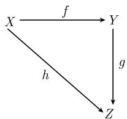

是两个映射, 则复合映射 $g \circ f: X \to Z$

由关系

$$
\boxed {(g \circ f) (x) := g (f (x))}
$$

定义.

结合律成立：

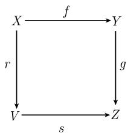

$$
h \circ (g \circ f) = (h \circ g) \circ f.
$$

交换图表 借助于交换图表, 映射之间的许多关系可以很容易地变成可视的. 称一个图表是交换的, 如果 $h = g \circ f$ , 即它与我们按照图表是从 $X$ 出发经过 $Y$ 到 $Z$ 还是直接到 $Z$ 无关. 同样, 称一个图表是交换的, 如果 $g \circ f = s \circ r$ (见上面两个图).

例 5: 如果映射 $f: X \rightarrow Y$ 是双射, 则

$$
f ^ {- 1} \circ f = \mathrm{id} _ {X} \text {并且} f \circ f ^ {- 1} = \mathrm{id} _ {Y}.
$$

定理 假定已给一个映射 $f: X \to Y$ , 则

(i) f 是满射, 当且仅当存在一个映射 $g: Y \rightarrow X$ 使得

$$
f \circ g = \mathrm{id} _ {Y},
$$

即, 图 4.6(a) 中的图表是交换的.

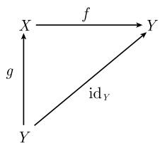  
(a) $f$ 是满射

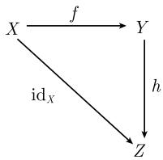  
(b) $f$ 是单射  
图 4.6 通过图表定义的映射性质

(ii) f 是单射当且仅当存在一个映射 $h: Y \rightarrow X$ 使得

$$
h \circ f = \mathrm{id} _ {X},
$$

即, 图 4.6(b) 中的图表是交换的.

(iii) f 是双射当且仅当存在映射 $g: Y \rightarrow X$ 和 $h: Y \rightarrow X$ 有

$$
f \circ g = \mathrm{id} _ {Y} \text {和} h \circ f = \mathrm{id} _ {X},
$$

即, 图 4.6 中的两个图表都是交换的. 在这种情形, 也有 $h = g = f^{-1}$ .

逆象 令 $f: X \to Y$ 是一个映射, 并且令 $B$ 是 $Y$ 的子集. 设

$$
f ^ {- 1} (B) := \{x | f (x) \in B \},
$$

即, $f^{-1}(B)$ 是所有 $X$ 的那些其象位于集合 $B$ 中的点的集合. 称 $f^{-1}(B)$ 是集合 $B$ 的逆象.

对于 Y 的任意子集 B 和 C, 有

$$
f ^ {- 1} (B \cup C) = f ^ {- 1} (B) \cup f ^ {- 1} (C), \quad f ^ {- 1} (B \cap C) = f ^ {- 1} (B) \cap f ^ {- 1} (C).
$$

从 $B \subseteq C$ 可以推出 $f^{-1}(B) \subseteq f^{-1}(C)$ 和 $f^{-1}(C \setminus B) = f^{-1}(C) \setminus f^{-1}(B)$ . 幂集 若 $A$ 是一个集合, 则 $2^A$ 表示 $A$ 的幂集, 即 $A$ 的所有子集的集合.

对应 两个集合 $A$ 和 $B$ 之间的一个对应 $c$ 是从 $A$ 到幂集 $2^{B}$ 中的一个映射

$$
\boxed {c: A \to 2 ^ {B},}
$$

即, $A$ 的每个点 $a \in A$ 被映射到 $B$ 的一个唯一确定的子集, 我们用 $c(a)$ 表示它.

一个对应 c 的象集是 c 的象中所有子集 $c(a)$ 的并.

映射的精确集合论定义 从 $X$ 到 $Y$ 的一个映射 $f$ 是笛卡儿积 $X \times Y$ 的一个子集, 具有下列两个性质:

(i) 对任何 $x \in X$ 存在一个 $y \in Y$ 有 $(x, y) \in f$ .

(ii) 两个关系 $(x, y_1) \in f$ 和 $(x, y_2) \in f$ 蕴涵着 $y_1 = y_2$ .

(i) 和 (ii) 一起是说对任何 $x \in X$ 存在 (条件 (i)) 一个唯一确定的由子集定义的 $y \in Y$ (条件 (ii)). 唯一的元素 $y$ 也表示成 $f(x)$ , 对于映射 $f$ 我们也记作 $f: X \to Y$ 或 $G(f)$ .

##### 4.3.4 集合的等势

定义 两个集合 A 和 B 称为是等势的, 记作

$$
\boxed {A \cong B}
$$

当且仅当存在一个双射 $\varphi: A \rightarrow B$ .

对任意的集合 A, B, C, 下列定律成立:

(i) $A \cong A$ (自反律);

(ii) $A \cong B$ 蕴涵着 $B \cong A$ (对称性);

(iii) $A \cong B$ 和 $B \cong C$ 蕴涵着 $A \cong C$ (传递律).

有限集 一个集合 $A$ 称为是有限的, 如果它要么是空集, 要么存在一个自然数 $n$ , 使得 $A$ 和 $B := \{k \in \mathbb{N} | 1 \leqslant k \leqslant n\}$ 等势. 在这一情形, $n$ 称为 $A$ 中元素的个数 (在第一种情形, $A$ 具有零个元素).

如果 A 由 n 个元素构成, 则幂集 $2^{A}$ 恰好有 $2^{n}$ 个元素 (这解释了记号).

无限集 一个集合称为是无限的, 如果它不是有限的.

例 1: 自然数集 N 是无限的.

定理 一个集合是无限的当且仅当它和一个真子集等势.

一个集合是无限的当且仅当它包含一个无限子集.

可数集 一个集合 A 称为是可数的, 如果它和自然数集 N 等势.

一个集合 A 称为是至多可数的, 如果它是有限的或者是可数的.

一个集合 A 称为是不可数的, 如果它不是至多可数的.

显然, 可数集和不可数集都是无限集.

例 2: (a)下列集合是可数的：整数集、有理数集、代数数集.

(b) 下列集合是不可数的：实数集、无理数集、超越数集、复数集.

(c) n 个可数集 $M_{1}, \cdots, M_{n}$ 的并仍是可数的.

(d) 可数多个可数集 $M_{1}, M_{2}, \cdots$ 的并仍是可数的.

例 3: 集合 N × N 是可数的.

证明：以矩阵形式对 $\mathbb{N} \times \mathbb{N}$ 的元素排序：

$$
\begin{array}{c c c} (0,   0) \to (0,   1) & (0,   2)   \dots \\ \downarrow & \downarrow \\ (1,   0) \leftarrow (1,   1) & (1,   2)   \dots \\ & \downarrow \\ (2,   0) \leftarrow (2,   1) \leftarrow (2,   2)   \dots \\ \dots \quad \dots \quad \dots \end{array}
$$

若像箭头所指的那样计数矩阵元素, 则每个矩阵元素都关联着唯一一个自然数, 反之, 每个自然数被刚好一个矩阵元素所代表. 证毕.

注 这个证明尽管看起来平凡, 但却是重要的, 它是证明任意集合可数性的通常方式.

使用记号

$$
A \lesssim B
$$

表示 B 包含一个和 A 等势的子集. 称 B 比 A 具有较大的势, 如果 $A \lesssim B$ , 而 A 不具有和 B 相同的势.

施罗德-伯恩斯坦定理 对任意的集合 $A, B$ , 下列定律成立:

(i) $A \lesssim A$ (自反律);

(ii) 两个关系 $A \lesssim B$ 和 $B \lesssim A$ 蕴涵着 $A \cong B$ (反对称性);

(iii) 两个关系 $A \lesssim B$ 和 $B \lesssim C$ 蕴涵着 $A \lesssim C$ (传递律).

康托尔定理 一个集合的幂集总是具有比该集合本身更大的势.

##### 4.3.5 关系

直观地讲, 集合 $X$ 上的一个关系是 $X$ 的任何两个元素之间要么成立要么不成立的一种联系. 形式上, 定义 $X$ 上的一个关系是笛卡儿积 $X \times X$ 的一个子集 $R$ . 例: 设 $R$ 由具有性质 $x \leqslant y$ 的实数 $x$ 和 $y$ 的有序对 $(x, y)$ 组成. 于是 $\mathbb{R} \times \mathbb{R}$ 的这个子集 $R$ 相应于有序关系.

4.3.5.1 等价关系

定义 集合 X 上的一个等价关系是 $X \times X$ 的一个子集, 具有下列三个性质:

(i) 对于所有 $x \in X$ 有 $(x, x) \in R$ (关系的自反性);

(ii) 从 $(x, y) \in R$ 可以推出 $(y, x) \in R$ (关系的对称性);

(iii) 从 $(x,y)\in R$ 和 $(y,z)\in R$ 可以推出 $(x,z)\in R$ (关系的传递性).

换句话说, 一个等价关系是一个具有自反性、对称性和传递性的关系. 我们常常不用 $(x, y) \in R$ , 而是写成 $x \sim y$ . 使用这一记号, 上面的条件就是

(a) 对于所有 $x \in X$ 有 $x \sim x$ (关系的自反性);

(b) 从 $x \sim y$ 可以推出 $y \sim x$ (关系的对称性);

(c) 从 $x \sim y$ 和 $y \sim z$ 可以推出 $x \sim z$ (关系的传递性).

令 $x \in X$ . 我们用 $[x]$ 表示 $x$ 的等价类, 根据定义, 它是与 $x$ 等价的所有元素的集合, 即

$$
[ x ] := \{y \in X | x \sim y \}.
$$

[x] 的元素称为等价类的代表.

定理 任何集合 X(在 X 上的任一等价关系之下) 都分解为两两不交的等价类.

商集 用 $X / \sim$ 表示所有等价类的集合. 这个集合也常被称为商集(或商空间).

如果存在定义在集合 X 上的运算, 则只要运算与等价关系相符, 就能将这些运算转入商空间; 这就是说运算保持等价关系 (见下面的例子). 对于构造新的结构 (商结构 $^{1)}$ ) 来说这在数学上是一个普遍的原理.

例: 如果 x 和 y 是两个整数, 则我们记 $x \sim y$ 当且仅当 x - y 能被 2 整除. 关于这一等价关系, 有

$$
[ 0 ] = \{0, \pm 2, \pm 4, \dots \}, [ 1 ] = \{\pm 1, \pm 3, \dots \},
$$

即等价类 [0](相应地有, [1]) 包括所有的偶 (相应地有, 奇) 整数.

而且, 从 $x \sim y$ 和 $u \sim v$ 可以推出 $x + u \sim y + v$ . 因此, 定义

$$
[ x ] + [ y ] := [ x + y ]
$$

独立于代表的选取. 于是

$$
[ 0 ] + [ 1 ] = [ 1 ] + [ 0 ] = [ 1 ], \quad [ 1 ] + [ 1 ] = [ 0 ], \quad [ 0 ] + [ 0 ] = [ 0 ].
$$

每个认知过程都基于这样的事实, 即利用彼此的等同区分不同的事物, 并对相应的等同类进行描述 (例如, 用哺乳类、鱼类、鸟类等基本概念对动物进行分类). 等价关系是对这一过程的精确数学表述.

4.3.5.2 序关系

定义 集合 X 上的一个序关系是笛卡儿积 $X \times X$ 的一个子集 R, 具有下列三个性质:

(i) 对于所有 $x \in X$ 有 $(x, x) \in R$ (自反律).

(ii) 从关系 $(x, y) \in R$ 和 $(y, x) \in R$ 可以推出 $x = y$ (反对称性).

(iii) 从 $(x, y) \in R$ 和 $(y, z) \in R$ 可以推出 $(x, z) \in R$ (传递律).

我们也把上述 $(x,y)\in R$ 记作 $x\leqslant y$ .应用这一记号，有

(a) 对于所有 $x \in X, x \leqslant x$ (自反律).

(b) 从 $x \leqslant y$ 和 $y \leqslant x$ 可以推出 $x = y$ (反对称性).

(c) 从 $x \leqslant y$ 和 $y \leqslant z$ 可以推出 $x \leqslant z$ (传递律).

符号 x < y 确切地表示了 $x \leqslant y$ 且 $x \neq y$ .

一个有序集 $X$ 称为是全序的, 如果对于 $X$ 的所有元素 $x$ 和 $y$ , 要么关系 $x \leqslant y$ 成立, 要么 $y \leqslant x$ 成立.

设给定 $x \in X$ . 如果 $x \leqslant z$ 总蕴涵着 $x = z$ , 则称 $x$ 是 $X$ 的一个极大元. 假设 $M \subseteq X$ . 如果对于所有 $y \in M$ 和某个固定的 $s \in X$ 有 $y \leqslant s$ , 则 $s$ 称为子集 $M$ 的一个上界.

最后, $u$ 称为 $M$ 的一个极小元, 如果 $u \in M$ 并且对所有 $z \in M$ 有 $u \leqslant z$ . 佐恩引理 如果一个有序集 $X$ 的任何全序子集都有一个上界, 则 $X$ 具有一个极大元.

良序 一个有序集称为是良序的, 如果它的任何非空子集包含一个最小元.

例: 自然数集关于通常的序关系是良序的.

另一方面, 实数集 $\mathbb{R}$ 关于通常的序关系不是良序的, 因为开集 $(0,1]$ 不包含一个最小元.

策梅洛的良序定理 任何集合都可以被良序化.

超限归纳原理 令 $M \subseteq X$ 是良序集 $X$ 的一个子集. 如果对于所有的 $a \in X$ , 有

若集合 $\{x \in X | x < a\}$ 属于 M, 则也有 $a \in M$ ,

那么就有 M = X.

保序映射 两个有序集 X 和 Y 之间的一个映射 $\varphi: X \to Y$ 被说成是保序的, 如果从 $x \leqslant y$ 可以推出 $\varphi(x) \leqslant \varphi(y)$ .

称两个有序集具有同样的序, 如果存在一个双射映射 $\varphi: X \to Y$ 使得 $\varphi$ 和 $\varphi^{-1}$ 都是保序的.

4.3.5.3 $n$ 重关系

集合 X 上的一个 n 重关系 R 是 n 重乘积 $X \times \cdots \times X$ 的一个子集.

这种关系常常被用来刻画运算.

例：令集合 $R$ 是由满足 $ab = c$ 的实数 $a, b, c$ 的所有三元组 $(a, b, c)$ 构成．则三重关系 $R \subseteq \mathbb{R} \times \mathbb{R} \times \mathbb{R}$ 是实数的乘法.

##### 4.3.6 集系

一个集系 $\mathcal{M}$ 是一个集合, 它的元素是各个集合 $X$ . 根据定义, 并

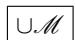

由属于 M 的各个集合 X 之一的那些元素组成.

如果 $\mathcal{M}$ 包含至少一个集合, 则根据定义, 交

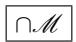

由属于 M 的所有元素 (集合)X 的元素组成.

根据定义, 集族 $(X_{\alpha})_{\alpha \in A}$ 是定义在指标集 $A$ 上的一个函数并且它对每个 $\alpha \in A$ 关联着一个集合 $X_{\alpha}$ .

一个 $A$ 元组 $(x_{\alpha})$ (也记作 $(x_{\alpha})_{\alpha \in A}$ ) 是 $A$ 上的一个函数, 它对每个 $\alpha \in A$ 关联着一个元素 $x_{\alpha} \in X_{\alpha}$ . 箍卡儿积

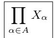

由所有的 A 元组 $(x_{\alpha})$ 组成. 也称 $(x_{\alpha})$ 为一个选择函数. 并

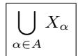

由包含在各个集合 $X_{\alpha}$ 中至少之一的元素组成.

假设 A 是非空集. 交

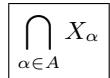

由一切属于所有集合 $X_{\alpha}$ 的元素组成.
