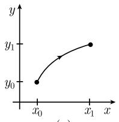
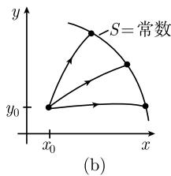
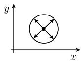
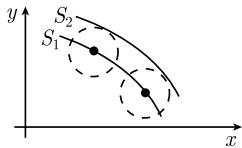
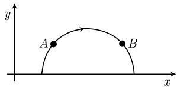
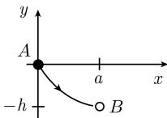
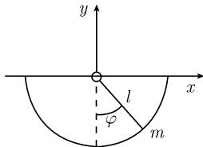

##### 5.1.2 应用

两点之间的最短路径问题 变分问题

$$
\boxed { \begin{array}{c} \int_ {t _ {0}} ^ {t _ {1}} \sqrt {1 + q ^ {\prime} (t) ^ {2}} \mathrm{d} t \stackrel {!} {=} \min, \\ q (t _ {0}) = a, \quad q (t _ {1}) = b, \end{array} }\tag{5.11}
$$

意味着我们要找出两点 $(t_0, q_0)$ 和 $(t_1, q_1)$ 之间的最短路径. 根据 (5.10), 欧拉-拉格朗日方程 $(L_{q'})' - L_q = 0$ 的解是曲线族

$$
q (t) = \alpha + \beta t.
$$

自由常数 $\alpha$ 和 $\beta$ 可以通过边界条件 $q(t_{0}) = a$ 和 $q(t_{1}) = b$ 唯一确定.

定理 (5.11) 的解必定具有形式

$$
q (t) = a + \frac {b - a}{t _ {1} - t _ {0}} (t - t _ {0}).
$$

这些解是直线, 丝毫也不奇怪.

几何光学中的光线 (费马原理) 变分问题

$$
\boxed { \begin{array}{c} \int_ {t _ {0}} ^ {t _ {1}} \frac {n (x , y (x))}{c} \sqrt {1 + y ^ {\prime} (x) ^ {2}} \mathrm{d} x \stackrel {!} {=} \min, \\ y (x _ {0}) = y _ {0}, \quad y (x _ {1}) = y _ {1} \end{array} }\tag{5.12}
$$

是几何光学中基本问题. 这里 $y = y(x)$ 是光线的轨线 ( $c$ 是真空中的光速, $n(x, y)$ 是在点 $(x, y)$ 处的折射指数). (5.12) 左端的积分等于光在折射介质中从 $(x_0, y_0)$ 到达 $(x_1, y_1)$ 所需要的时间 (图 5.2(a)). 因此 (5.12) 表达的是费马(1601—1665)原理:

$$
\text { 光线在两点之间以最小时间量的方式通过介质. }
$$

对应于 (5.12) 的欧拉-拉格朗日方程是几何光学的基本方程:

$$
\boxed {\frac {\mathrm{d}}{\mathrm{d} x} \bigg (\frac {n (x , y (x)) y ^ {\prime} (x)}{\sqrt {1 + y ^ {\prime} (x) ^ {2}}} \bigg) - n _ {y} (x, y) \sqrt {1 + y ^ {\prime} (x) ^ {2}} = 0.}\tag{5.13}
$$

  
图 5.2 光线: 费马原理

特殊情形：若折射指数 $n = n(y)$ 与位置变量 $x$ 无关，则(5.8)意味着在这种情形下从(5.13)得到

$$
\frac {n (y (x))}{\sqrt {1 + y ^ {\prime} (x) ^ {2}}} = \text { 常数 }.\tag{5.14}
$$

短时距 S 和波前 固定点 $(x_{0}, y_{0})$ ，并令

$$
S (x _ {1}, y _ {1}) = \int_ {x _ {0}} ^ {x _ {1}} \frac {n (x , y)}{c} \sqrt {1 + y ^ {\prime} (x) ^ {2}} \mathrm{d} x.
$$

这里 $y = y(x)$ 是变分问题 (5.12) 的解, 即 $S(x_{1}, y_{1})$ 表示光线从 $(x_{0}, y_{0})$ 到 $(x_{1}, y_{1})$ 所要的时间.

函数 S 称为短时距, 如果它满足短时距方程

$$
\boxed {S _ {x} (x, y) ^ {2} + S _ {y} (x, y) ^ {2} = \frac {n (x , y) ^ {2}}{c ^ {2}},}\tag{5.15}
$$

它仅是哈密顿-雅可比微分方程的一种特殊情形 (见 5.1.3).

由方程

$$
S (x, y) = \text { 常数 }
$$

确定的曲线称为波前, 这是由某一固定原点出发在相同时刻到达的点组成的集合(图 5.2(b)).

横截性 所有从某一固定原点出发的光线都与波前横截相交 (即相交角为直角).

例：若折射指数 $n(x,y)\equiv 1$ ，则依据(5.14)光线是直线.在这种情形下波前是圆周(图5.3).

惠更斯原理(图 5.4) 若考虑波前

$$
S (x, y) = S _ {1},
$$

并且从该波上每一点的光线出发, 则经过时间 t 以后它们都到达第二个波前

$$
S (x, y) = S _ {2},
$$

这里 $S_{2}=S_{1}+t$ . 这第二个波前可以作为 “基本波” 的包络得到. 这些是由固定点经过时间 t 后产生的波前.

  
图 5.3 单位折射指数下的波前

  
图 5.4 惠更斯原理

非欧几里得几何和光线：变分原理

$$
\boxed { \begin{array}{c} \int_ {x _ {0}} ^ {x _ {1}} \sqrt {1 + y ^ {\prime} (x) ^ {2}} \mathrm{d} x \stackrel {!} {=} \min, \\ y (x _ {0}) = y _ {0}, y (x _ {1}) = y _ {1}, \end{array} }\tag{5.16}
$$

可以给出两种解释.

(i) 在几何光学意义下, (5.16) 描述光线在折射指数为 $n = 1 / y$ 的介质中的运动. 联合 (5.14), 这就意味着光线具有形式

$$
(x - a) ^ {2} + y ^ {2} = r ^ {2}.\tag{5.17}
$$

这些是中心位于 x 轴的圆周 (图 5.5).

(ii) 我们在上半平面引入度量

$$
\mathrm{d} s ^ {2} = \frac {\mathrm{d} x ^ {2} + \mathrm{d} y ^ {2}}{y ^ {2}}.
$$

由于

$$
\int \mathrm{d} s = \int \frac {\sqrt {1 + y ^ {\prime} (x) ^ {2}}}{y} \mathrm{d} x,
$$

(5.16) 描述两点 $A(x_0, y_0)$ 和 $B(x_1, y_1)$ 之间的最短路径问题. 圆周 (5.17) 是这种几何下的“直线”，因此它们与庞加莱模型下非欧几里得双曲几何相合 (见 3.2.8).

约翰·伯努利于 1696 年提出的著名的最速降线问题 在 Leipziger Acta Eruditorium $^{1)}$ 1696 年 6 月版中 (该杂志当时在莱比锡刚创刊不久), 约翰·伯努利发表了如下的问题: “找出在重力作用下运动质点的轨迹”(图 5.6).

  
图 5.5 光线: 1/y

  
图5.6 最速降线

这一问题是变分法的开端. 伯努利在其处理中还没有欧拉-拉格朗日方程; 然而我们现在则应用此方程来处理最速降线问题.

解答 变分问题是

$$
\boxed { \begin{array}{l} \int_ {0} ^ {a} \frac {\sqrt {1 + y ^ {\prime} (x) ^ {2}}}{\sqrt {- y}} \mathrm{d} x \stackrel {!} {=} \min, \\ y (0) = 0, y (a) = - h. \end{array} }\tag{5.18}
$$

相应的欧拉-拉格朗日方程 (5.14) 的解为

$$
x = C (u - \sin u), \quad y = C (\cos u - 1), \quad 0 \leqslant u \leqslant u _ {0},
$$

其中常数 $C$ 和 $u_0$ 由条件 $y(a) = -h$ 确定. 这是一条摆线.

落石运动律 拉格朗日函数是

$$
L = \mathrm{动能} - \mathrm{势能} = {\frac {1}{2}} m y ^ {' 2} - m g y
$$

(这里 m 是落石的质量, g 是重力常数). 由此得到欧拉-拉格朗日方程

$$
\boxed {m y ^ {\prime \prime} + m g = 0,}
$$

其解 $y(t)$ ，即落石在 t 时刻的高度是

$$
\boxed {y (t) = h - v t - \frac {g t ^ {2}}{2}.}
$$

这里 h 是落石在初始时刻 t = 0 的高度和速度. 这就是伽利略运动定律.

  
图 5.7 圆周摆

圆周摆和拉格朗日的适应坐标法(图 5.7)
对于地球重力场中圆周摆的运动, 以笛卡儿坐标 $x(t)$ 和 $y(t)$ 表达, 其拉格朗日函数为
L = 动能 - 势能 = $\frac{1}{2}m(x^{2} + y'^{2}) - mgy$ .
然而, 对于相应的变分问题, 必须考虑约束条件

$$
x (t) ^ {2} + y (t) ^ {2} = l ^ {2},
$$

这里 $m$ 和 $l$ 分别为摆的质量和长度, $g$ 为重力常数. 处理这一问题需要使用拉格朗日乘子 (见5.1.6).

使用极坐标而不是用笛卡儿坐标来处理这一问题则要简单得多. 用极坐标写出方程相当简单:

$$
\boxed {\varphi = \varphi (t),}
$$

这里不再出现任何约束条件. 我们有

$$
x (t) = l \sin \varphi (t), \quad y (t) = - l \cos \varphi (t).
$$

由于 $x^{\prime}(t) = \varphi^{\prime}(t)\cos \varphi (t),y^{\prime}(t) = l\varphi^{\prime}(t)\sin \varphi (t)$ 和 $\sin^2\varphi +\cos^2\varphi = 1,$ 我们得到拉格朗日函数的表达式

$$
\boxed {L = \frac {1}{2} m l ^ {2} \varphi^ {\prime 2} + m g l \cos \varphi .}
$$

从欧拉-拉格朗日方程

$$
\frac {\mathrm{d}}{\mathrm{d} t} L _ {\varphi^ {\prime}} - L _ {\varphi} = 0
$$

得到

$$
\boxed {\varphi^ {\prime \prime} + \omega^ {2} \sin \varphi = 0,}
$$

其中 $\omega^{2}=g/l$ . 若 $\varphi_{0}$ 是摆的最大摆角 $(0<\varphi_{0}<\pi)$ ，则运动 $\varphi(t)$ 从方程

$$
2 \omega t = \int_ {0} ^ {\varphi} \frac {\mathrm{d} \xi}{\sqrt {k ^ {2} - \sin^ {2} \frac {\xi}{2}}}
$$

推出, 其中 $k = \sin \frac{\varphi_0}{2}$ . 代入 $\sin \frac{\varphi}{2} = k \sin \psi$ 得到椭圆积分

$$
\boxed {\omega t = \int_ {0} ^ {\psi} \frac {\mathrm{d} \eta}{\sqrt {1 - k ^ {2} \sin^ {2} \eta}}.}
$$

摆的周期从著名的公式

$$
\boxed {T = 4 \sqrt {\frac {l}{g}} K (k)}
$$

得到, 这里 $K(k)$ 是第一类完全椭圆积分

$$
K (k) = \int_ {0} ^ {\frac {\pi}{2}} \frac {\mathrm{d} \psi}{1 - k ^ {2} \sin^ {2} \psi} = \frac {\pi}{2} \Big (1 + \frac {k ^ {2}}{4} + O (k ^ {4}) \Big), \quad k \to 0.
$$

只要最大辐角 $\varphi_{0}$ 小于 $70^{\circ}$ ，近似式

$$
T = 2 \pi \sqrt {\frac {l}{g}} \left(1 + \frac {\varphi_ {0} ^ {2}}{1 6}\right)
$$

精确到约 1%.

小振动圆周摆和谐振子 当摆的振动 $\varphi$ 很小时, 有 $\cos\varphi=1+\frac{\varphi^{2}}{2}+\cdots$ 略去高阶项, 拉格朗日函数 L 近似地为

$$
L = \frac {1}{2} m l ^ {2} \varphi^ {2} - \frac {1}{2} m g l \varphi^ {2}.
$$

相应的变分问题

$$
\begin{array}{l} {{ \int_ {t _ {0}} ^ {t _ {1}} L \mathrm{d} t \stackrel {!} {=} \mathrm{稳态},}} \\ {{\varphi (t _ {0}) = a, \quad \varphi (t _ {1}) = b}} \end{array}
$$

的欧拉-拉格朗日方程为

$$
\boxed {\varphi^ {\prime \prime} + \omega^ {2} \varphi = 0,}
$$

其中 $\omega = g / l$ ，其解为

$$
\varphi (t) = \varphi_ {0} \sin (\omega t + \alpha),
$$

这里最大振幅 $\varphi_0$ 和相位 $\alpha$ 从初始条件 $\varphi(0) = \alpha$ 和 $\varphi'(0) = \beta$ 推出. 至于周期 $T$ , 则有

$$
\boxed {T = 2 \pi \sqrt {\frac {l}{g}}.}
$$

几何和物理中其他重要的变分问题（见 [212]）

(i) 推导极小曲面方程.

(ii) 推导毛细管曲面和太空旅行实验方程.

(iii) 找出弦理论和基本粒子理论的方程.

(iv) 找出黎曼几何中的短程线.

(v) 找出非线性弹性理论的方程.

(vi) 应力和分岔方程.

(vii) 导出高黏性液体和硬材料的流变学中的非线性守恒方程.

(viii) 根据爱因斯坦狭义和广义相对论找出粒子迁移运动方程.

(ix) 找出广义相对论中重力场的基本方程.

(x) 导出电动力学中麦克斯韦方程.

(xi) 导出电子、正电子和光子的基本方程.

(xii) 导出规范理论和基本粒子的基本方程.
