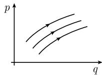

##### 5.1.3 哈密顿方程

数学的固有特征之一是其任何实在的进展都伴随着新方法的发现和发展, 以及原有程序的简化……数学的统一特征在于其非常自然; 实际上, 数学是一切精确的自然科学的基础.

D. 希尔伯特 (Hilbert)

1900 年在巴黎 ICM 大会上的演讲

在 18 世纪欧拉和拉格朗日的开创性工作之后, 哈密顿 (1805—1865) 将几何光学的光辉思想应用到曾经用拉格朗日方法研究过的力学问题. 这就导致了如下的 “词典”:

<table><tr><td>几何光学</td><td>哈密顿力学</td></tr><tr><td>光线</td><td> $\longleftrightarrow$ 粒子轨线,哈密顿典范方程</td></tr><tr><td>短时距  $S$ </td><td> $\longleftrightarrow$ 作用函数  $S$ </td></tr><tr><td>短时距方程和波前</td><td> $\longleftrightarrow$ 哈密顿-雅可比微分方程</td></tr><tr><td>费马原理</td><td> $\longleftrightarrow$ 哈密顿最小作用原理</td></tr></table>

欧拉-拉格朗日二阶微分方程用一组新的一阶方程代替：

哈密顿典范方程.

这样就有可能把流形 (相空间) 上的动力学系统理论应用到经典力学. 原来隐藏在经典力学背后有一种几何, 即所谓的辛几何(见 1.13.1.7). 19 世纪末, 吉布斯 (1839—1903) 认识到哈密顿力学公式可以方便地用来处理统计物理范畴下的许多粒子系统 (例如气体). 其出发点是这样一个事实: 基于辛几何, 哈密顿相位流保持相空间的体积不变 (刘维尔定理).

作为自然界基本量的作用量 作用量是一种物理量, 其量纲为

$$
\boxed {\text {作用量} = \text {能量} \times \text {时间}.}
$$

1900 年, M. 普朗克 (Planck, 1858—1947) 提出了划时代的量子假设, 即自然界中出现的任何作用量都不可能是任意小的. 最小的作用量单位是普朗克作用量子

$$
\boxed {h = 6. 6 2 6 \cdot 1 0 ^ {- 3 4} \mathrm{J} \cdot \mathrm{s}.}
$$

这是完成量子理论的关键, 它与爱因斯坦的相对论 (从 1905 年算起) 一起彻底改变了物理学 (见 1.13.2.11).

哈密顿形式体系是物理学定律的一种基本表述, 它特别适合于作用量的传播. 这种形式体系可用于经典场论以及更一般的量子场论范畴中的量子化 (典范量子化, 或使用路径积分的费因曼量子化).

$$
\text {当按照哈密顿使用} (\text {广义}) \text {位置和矩量变量并研究作用量的传播时, 力学的更深刻的意义就变得显而易见了.}
$$

在量子力学中位置和矩量之间的密切联系特别明显．根据海森伯测不准原理，位置 q 和矩量 p 无法同时测量到．更确切地说，如果 $\Delta q$ 和 $\Delta p$ 表示这些变量的方差，则

$$
\boxed {\Delta q \Delta p \geqslant \frac {\hbar}{2}.}
$$

这里令 $\hbar = h/2\pi.$

与现代控制理论之间的联系 此外, 1960 年前后哈密顿力学也成为最优控制理论的模型 (见 5.3.3), 后者是基于 L. S. 庞特里亚金 (Pontryagin) 极大值原理发展起来的.

下面通过方程

$$
\boxed {q = q (t)}
$$

来描述粒子的运动, 这里 t 表示时间, 而位置坐标 $q = (q_{1}, \cdots, q_{F})$ . 数 F 称为系统的自由度. 坐标 $q_{j}$ 一般说来不是笛卡儿坐标, 而是某类合适的坐标 (例如, 圆周摆的摆角, 见图 5.7).

哈密顿稳态作用原理

$$
\boxed { \begin{array}{c} {\int_ {t _ {0}} ^ {t _ {1}} L (q (t), q ^ {\prime} (t), t) \mathrm{d} t \stackrel {!} {=} \text {稳态},} \\ {q (t _ {0}) = a, q (t _ {1}) = b,} \end{array} }\tag{5.19}
$$

这里 $t_0, t_1 \in \mathbb{R}, a, b \in \mathbb{R}^F$ 为给定数. 左端的积分具有作用量的量纲.

欧拉-拉格朗日方程 在充分正则的情形下, 问题 (5.19) 等价于如下方程组:

$$
\boxed {\frac {\mathrm{d}}{\mathrm{d} t} L _ {q _ {j} ^ {\prime}} (q (t), q ^ {\prime} (t), t) - L _ {q _ {j} ^ {\prime}} (q (t), q ^ {\prime} (t), t) = 0, \quad j = 1, \dots , F.}\tag{5.20}
$$

勒让德变换 引入新的变量

$$
\boxed {p _ {j} := \frac {\partial L}{\partial q _ {j} ^ {\prime}} (q, q ^ {\prime}, t), \quad j = 1, \dots , F,}\tag{5.21}
$$

该变量称为广义矩量. 再者, 假定方程 (5.21) 可以解出 $q':^{1)}$

$$
q ^ {\prime} = q ^ {\prime} (q, p, t).
$$

使用哈密顿函数 $H = H(q, p, t)$ :

$$
\boxed {H (q, p, t) = \sum_ {j = 1} ^ {F} q _ {j} ^ {\prime} p _ {j} - L (q, q ^ {\prime}, t)}
$$

代替拉格朗日函数 L. 在此方程中, $q'$ 必须用 $q'(q, p, t)$ 代替. 变换

$$
\begin{array}{c} {{(q, q ^ {\prime}, t) \longmapsto (q, p, t)}} \\ {{\text {勒让德函数} L \longmapsto \text {哈密顿函数} H}} \end{array}\tag{5.22}
$$

称为勒让德变换. 我们称 $q$ 坐标的 $F$ 维空间 $M$ 为构形空间, 而 $(q,p)$ 坐标的 $2F$ 维空间为相空间. 这里我们把 $M$ 看成 $\mathbb{R}^F$ 中的一开子集, 而把相空间看成 $\mathbb{R}^{2F}$ 中的开子集. 当我们使用流形语言时这一理论的强大的威力就显现出来了.

哈密顿典范方程 从拉格朗日函数的欧拉-拉格朗日方程, 我们得到拉格朗日函数在勒让德变换下一组新的一阶方程 $^{3)}$

$$
\boxed {p _ {j} ^ {\prime} = - H _ {q _ {j}}, \quad q _ {j} ^ {\prime} = H _ {p _ {j}}, \quad j = 1, \dots , F.}\tag{5.23}
$$

哈密顿－雅可比方程

$$
\boxed {S _ {t} (q, t) + H (q, S _ {q} (q, t), t) = 0.}\tag{5.24}
$$

常微分方程组 (5.23) 和一阶偏微分方程 (5.24) 之间有密切联系.

(i) 从 (5.24) 的依赖于参数的解组可以得到 (5.23) 的解.

(ii) 反之, 从 (5.23) 的解族可得到 (5.24) 的解.

$$
\det \left(\frac {\partial^ {2} L}{\partial q _ {j} ^ {\prime} \partial q _ {k} ^ {\prime}} (q _ {0}, q _ {0} ^ {\prime}, t _ {0})\right) > 0,
$$

这些问题在 1.13.1.3 中讨论. 在几何光学中, 从波前构造光线隐藏在 (i) 中, 而在 (ii) 中则是波前作为光线族被构造出来.

哈密顿流 假定哈密顿函数 H 不依赖于时间 t, 并把典范方程的解

  
图5.8 流

$$
q = q (t), \quad p = p (t)\tag{5.25}
$$

理解成粒子在流道中运动的轨线 (图 5.8). 称其为哈密顿流.

(i) 能量守恒: 函数 $H$ 是哈密顿流的守恒量, 即

$$
\boxed {H (q (t), p (t)) = \text {常数}.}
$$

函数 H 解释为系统的能量.

(ii) 相体积的守恒(刘维尔定理): 哈密顿流的体积保持不变. $^{1)}$ 作用函数的意义 在时刻 $t_{0}$ 固定一点 $q_{*}$ ，并令

$$
\boxed {S (q _ {* *}, t _ {1}) := \int_ {t _ {0}} ^ {t _ {1}} L (q (t), q ^ {\prime} (t), t) \mathrm{d} t.}
$$

在积分中选择欧拉-拉格朗日方程 (5.20) 在边界条件

$$
q (t _ {0}) = q _ {*}, \quad q (t _ {1}) = q _ {* *}
$$

下的解 $q = q(t)$ . 假定这个解是唯一确定的.

定理 若解是充分光滑的, 则作用函数 S 是哈密顿-雅可比微分方程 (5.24) 的解.

这里所要求的光滑性得不到满足的情形在几何光学中对应于波前彼此接触或交叉 (焦散线).

泊松括号与守恒量 若 $A = A(q, p, t)$ 和 $B = B(q, p, t)$ 是函数, 则泊松括号定义为

$$
\{A, B \} = \sum_ {j = 1} ^ {F} (A _ {p _ {j}} B _ {q _ {j}} - A _ {q _ {j}} B _ {p _ {j}}).
$$

我们有

$$
\boxed {\{A, B \} = - \{B, A \},}
$$

于是特别有 $\{A, A\}=0$ . 其次, 有雅可比恒等式

$$
\boxed {\{A, \{B, C \} \} + \{B, \{C, A \} \} + \{C, \{A, B \} \} = 0.}
$$

1) 在 $t = 0$ 时刻区域 $G_{0}$ 中流粒子在 $t$ 时刻位于区域 $G_{t}$ 中, 并且 $G_{t}$ 与 $G_{0}$ 有相同的体积.

李代数 相空间上实 $C^{\infty}$ 函数相对于加法, (实) 标量乘法, 和作为乘法的泊松括号, 构成一个无穷维李代数.

泊松运动方程 沿着哈密顿流的轨线 (5.25), 对于所有充分光滑的函数 $A(q, p, t)$ , 有关系式 $^{1)}$

$$
\boxed {\frac {\mathrm{d} A}{\mathrm{d} t} = \{H, A \} + A _ {t}.}\tag{5.26}
$$

定理 若 A 与 t 无关, 并且 $\{H, A\} = 0$ , 则 A 是一个守恒量, 即沿着哈密顿流的轨线有

$$
\boxed {A (q, p) = \text {常数}.}
$$

例1: 若哈密顿函数也与 $t$ 无关, 则 $H$ 本身是哈密顿流的一个守恒量. 这可从明显的关系 $\{H, H\} = 0$ 得出.

例 2: 广义变量 $q_{i}$ 和矩量 $p_{j}$ 之间的泊松括号满足

$$
\boxed {\left\{p _ {j}, q _ {k} \right\} = \delta_ {j k}, \quad \left\{q _ {j}, q _ {k} \right\} = 0, \quad \left\{p _ {j}, p _ {k} \right\} = 0.}\tag{5.27}
$$

从 (5.26) 看出

$$
\left| q _ {j} ^ {\prime} = \{H, q _ {j} \}, \quad p _ {j} ^ {\prime} = \{H, p _ {j} \}, \quad j = 1, \dots , F. \right|\tag{5.28}
$$

这些就是哈密顿典范方程.

玻尔和索末菲的半经典量子化规则 (1913)

$$
\boxed {(q, p) \text {相空间由数量为} h ^ {F} \text {个晶格组成.}}\tag{5.29}
$$

这一规则受如下事实的启发得到： $\Delta q\Delta p$ 具有作用量的量纲，而普朗克作用量量子h是最小可能的作用量单位.

海森伯括号 对于线性算子 A 和 B, 定义

$$
\boxed {[ A, B ] _ {\mathcal {H}} = \frac {\hbar}{\mathrm{i}} (A B - B A).}
$$

海森伯的基本量子化规则 (1924)

通过把广义变量 $q_{j}$ 和矩量 $p_j$ 提升为算子，并用海森伯括号代替泊松括号，可以将经典力学系统量子化.

1) 更清楚地表达这个关系式为

$$
\frac {\mathrm{d}}{\mathrm{d} t} A (q, p, t) = \{A, H \} (q, p, t) + A _ {t} (q, p, t).
$$

自从普朗克于 1900 年提出量子化假设以来, 物理学家们一直在致力于寻找这一类量子化过程的一般公式. 从 (5.27) 和 (5.28) 导出海森伯量子力学观点下的基本方程:

$$
\boxed { \begin{array}{l} p _ {j} ^ {\prime} = [ H, p _ {j} ] _ {\mathcal {H}}, \quad q _ {j} ^ {\prime} = [ H, q _ {j} ] _ {\mathcal {H}}, \quad j = 1, \dots , F, \\ [ p _ {j}, q _ {k} ] _ {\mathcal {H}} = \delta_ {j k}, \quad [ p _ {j}, p _ {k} ] _ {\mathcal {H}} = [ q _ {j}, q _ {k} ] _ {\mathcal {H}} = 0. \end{array} }\tag{5.30}
$$

1925 年, 薛定谔发现了一种表面看来完全不同的量子化规则, 从而导出一偏微分方程 —— 薛定谔方程 (见 1.13.2.11). 但事实上可以证明, 量子化过程的这两种提法是等价的. 他们代表了希尔伯特空间中事物同一状态的两种不同的表达方法.
