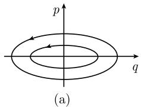

##### 5.1.4 应用

一维运动 我们考虑质量为 $m$ 的粒子沿着 $q$ 轴的一维运动 $q = q(t)$ (图5.9). 若 $U = U(q)$ 为势能, 则拉格朗日函数是

  
图 5.9 一维中的运动

$$
L = \text { 动能 } - \text { 势能 } = \frac {m q ^ {\prime 2}}{2} - U (q).
$$

从稳态作用原理

$$
\begin{array}{c} {{ \int_ {t _ {0}} ^ {t _ {1}} L (q (t), q ^ {\prime} (t), t) \mathrm{d} x \stackrel {!} {=} \text {稳态},}} \\ {{q (t _ {0}) = a, \quad q (t _ {1}) = b}} \end{array}
$$

导出欧拉-拉格朗日微分方程 $(L_{q'})' - L_q = -U'(q)$ ，即

$$
\boxed {m q ^ {\prime \prime} = - U ^ {\prime} (q).}\tag{5.31}
$$

这也就是在力 $F(q) = -U'(q)$ 作用下的牛顿运动定律. 令

$$
p := L _ {q ^ {\prime}} (q, q ^ {\prime}), \quad E := q ^ {\prime} p - L.
$$

那么 $p = mq'$ 是经典的矩量 (质量 × 速度).

(i) 能量守恒: 量

$$
E = \frac {1}{2} m q ^ {\prime 2} + U (q)
$$

与经典的能量相同 (动能加势能). 根据 (5.8), E 是一守恒量 (第一积分), 即沿着每一个运动 ((5.31) 的解) 有

$$
\frac {1}{2} m q (t) ^ {\prime 2} + U (q (t)) = \mathrm{常数}.
$$

(ii) 勒让德变换：哈密顿函数 $H = H(q, p)$ 是作为拉格朗日函数的勒让德变换出现的， $H(q, p) := q' p - L$ ，因此

$$
H (q, p) := \frac {p ^ {2}}{2 m} + U (q).
$$

这一表达式与能量 E 相同.

(iii) 典范方程:

$$
\boxed {p ^ {\prime} = - H _ {q}, \quad q ^ {\prime} = H _ {p}.}
$$

这些方程对应于 $q' = p/m$ 和牛顿运动定律 $mq'' = -U(q)$ 两个方程.

应用于谐振子 谐振子是力学系统中最简单的非平凡的数学模型. 然而, 从这个简单的数学模型可以洞察深邃的物理含义. 例如, 谐振子的量子化导致爱因斯坦的光子理论, 从而推出辐射的普朗克定律, 这对于理解宇宙的起源和寿命是基础性的 (见 [213], 第 IV 卷).

我们考虑具有如下性质的一维运动：

(a) 假定系统关于平衡态仅有小偏离.

(b) 在平衡点处没有作用力.

(c) 势能是正的.

把势能展开成泰勒级数得到

$$
U (q) = U (0) + U ^ {\prime} (0) q + \frac {U ^ {\prime \prime} (0)}{2} q ^ {2} + \dots
$$

于是假设 (b) 隐含 $0 = F(0) = -U'(0)$ . 由于常数 $U(0)$ 与力不相关 (因为 $F(1) = -U'(q)$ ), 从而也与运动方程 $mq'' = F$ 不相关, 故不失一般性我们可以设 $U(0) = 0$ . 这样就导出谐振子势能的公式

$$
U (q) = \frac {k q ^ {2}}{2},
$$

其中 $k := U''(0) > 0.$

(iv)牛顿运动定律: 从 (5.31) 得到关系

$$
\boxed { \begin{array}{l} q ^ {\prime \prime} + \omega^ {2} q = 0, \\ q (0) = q _ {0} (\text {初始位置}), \quad q ^ {\prime} (0) = q _ {1} (\text {初始速度}), \end{array} }
$$

其中 $\omega = \sqrt{k/m}$ . 该方程的唯一解是

$$
q (t) = q _ {0} \cos \omega t + \frac {q _ {1}}{\omega} \sin \omega t.
$$

(v) 相空间中的哈密顿流: 哈密顿函数 (能量函数) 是

$$
H (q, p) = \frac {p ^ {2}}{2 m} + \frac {k q ^ {2}}{2}.
$$

由此可知典范方程 $p' = -H_{q}, q' = H_{p}$ 取形式

$$
p ^ {\prime} = - k q, \quad q ^ {\prime} = \frac {p}{m}.
$$

相应的解曲线

$$
\begin{array}{r l} & q (t) = q _ {0} \cos \omega t + \frac {p _ {0}}{m} \sin \omega t, \\ & p (t) = - q _ {0} m \omega \sin \omega t + p _ {0} \cos \omega t \end{array}
$$

描述 $(q,p)$ 相空间中哈密顿流的轨线 $(p_0\coloneqq q_1 / m)$ . 能量守恒导致

$$
\frac {p (t) ^ {2}}{2 m} + \frac {\omega^ {2} m q (t) ^ {2}}{2} = E,
$$

即轨线是椭圆, 其大小随能量增加而增大 (图 5.10(a)).

  
图 5.10 相空间中的哈密顿流

(vi) 作用变量I和作用角变量 $\varphi$ : 定义

$$
I := \frac {1}{2 \pi} \quad ((q, p) \text {相空间中能量} E \text {处椭圆的面积}).
$$

于是

$$
I = \frac {E}{\omega}.
$$

因此哈密顿函由 $H = \frac{\omega I}{2\pi}$ 给出.新的变量 $I =$ 常数和 $\varphi := \omega t$ 满足新的哈密顿方程组

$$
\varphi^ {\prime} = H _ {I}, \quad I ^ {\prime} = - H _ {\varphi}.
$$

(vii) 玻尔佐末菲量子化(1913): 根据 (5.29), $(q, p)$ 相空间中面积元由长度为 $h$ 的晶格组成. 如果我们考虑能量 $E_{1}$ 和 $E_{2}$ 处 $(E_{2} > E_{1})$ 的两根轨线, 那么对于相应的两椭圆之间曲面区域, 得到

$$
2 \pi I _ {2} - 2 \pi I _ {1} = h
$$

(图 5.10(b)). 若令 $\Delta E = E_{2} - E_{1}$ ，则得到方程

$$
\boxed {\Delta E = \hbar \omega .}
$$

这就是普朗克于 1900 年提出的著名的量子假设.

爱因斯坦在 1905 年提出假设：光由称作光子的量子组成。对于频率为 $\nu$ 和角频率为 $\omega = 2\pi\nu$ 的光，根据爱因斯坦，光子的能量是

$$
\varepsilon = \hbar \omega .
$$

爱因斯坦因光量子理论于 1921 年获得诺贝尔物理奖 (值得注意的是他并没有因相对论而获得诺贝尔奖).

(viii) 海森伯量子化准则(1924): 海森伯根据他的方法计算了量子化的谐振子各个精确的能级, 得到

$$
\boxed {E = \hbar \omega \Big (n + \frac {1}{2} \Big), \qquad n = 0, 1, 2, \dots .}\tag{5.32}
$$

我们已经在 1.13.2.12 看到如何从薛定谔方程导出 (5.32).

有意思的是, 基态 $n = 0$ 对应于非零能量 $E = \frac{1}{2} \hbar \omega$ . 实际上, 这一事实在量子理论中具有基本的重要性. 它意味着量子场的基态具有无穷能量. 这又引起粒子从基态到激发态的自发跃迁, 从而解释 (可能发生的) 黑洞的崩解.
