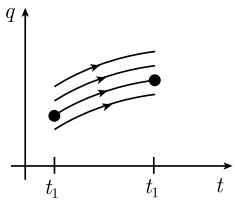

##### 5.1.5 局部极小值的充分条件

除了实函数 $q = q(t)$ 的极小化问题

$$
\boxed { \begin{array}{c} \int_ {t _ {0}} ^ {t _ {1}} L (q (t) q ^ {\prime} (t), t) \mathrm{d} t \stackrel {!} {=} \min, \\ q (t _ {0}) = a, \quad q (t _ {1}) = b, \end{array} }\tag{5.33}
$$

我们还考虑欧拉-拉格朗日方程

$$
\frac {\mathrm{d}}{\mathrm{d} t} L _ {q ^ {\prime}} - L _ {q} = 0\tag{5.34}
$$

和雅可比本征值问题

$$
\boxed { \begin{array}{c} - (R h ^ {\prime}) ^ {\prime} + P h = \lambda h, \quad t _ {0} \leqslant t \leqslant t _ {1}, \\ h (t _ {0}) = h (t _ {1}) = 0, \end{array} }\tag{5.35}
$$

这里 $Q := (q(t), q'(t), t)$ ，而

$$
R (t) := L _ {q ^ {\prime} q ^ {\prime}} (Q), \quad P (t) := L _ {q q} - \frac {\mathrm{d}}{\mathrm{d} t} L _ {q q ^ {\prime}} (Q).
$$

其次, 考虑雅可比初值问题

$$
\boxed { \begin{array}{c} - (R h ^ {\prime}) ^ {\prime} + P h = 0, t _ {0} \leqslant t \leqslant t _ {1}, \\ h (t _ {0}) = 0, \quad h (t _ {1}) = 1. \end{array} }\tag{5.36}
$$

设 $h = h(t)$ 是 (5.35) 的解, 我们把 $h(t)$ 的满足 $t_* > t_0$ 的最小的零点 $t_*$ 称为 $t_0$ 的共轭点.

根据定义, 实数 $\lambda$ 是 (5.35) 的一个本征值, 是指该方程有非平凡 (不恒等于零) 解 $h$ .

光滑性 假设拉格朗日函数 L 充分光滑 (例如属于 $C^{3}$ 型).

极值 欧拉-拉格朗日方程 (5.34) 的每一个 $C^2$ 解都称为一个极值. 然而, 这样的极值未必对应于 (5.33) 中局部极小, 正如函数情形一样. 为了存在极小, 需要满足附加条件.

魏尔斯特拉斯 E 函数 这个函数定义为

$$
\boxed {E (q, q ^ {\prime}, u, t) := L (q, u, t) - L (q, q ^ {\prime}, t) - (u - q ^ {\prime}) L _ {q ^ {\prime}} (q, q ^ {\prime}, t).}
$$

拉格朗日函数的凸性 $L$ 相对于 $q'$ 的凸性是一个特别重要的事实. 为了得到 $L$ 的这种凸性, 只需假定下列两条件之一满足:

(i) $L_{q'q'}(q,q',t) \geqslant 0,\quad \forall q,q' \in \mathbb{R},\quad \forall t \in [t_0,t_1].$

(ii) $E(q, q', u, t) \geqslant 0, \forall q, q', u \in \mathbb{R}, \forall t \in [t_0, t_1].$

5.1.5.1 雅可比充分条件

勒让德充分条件 (1788) 如果 $q = q(t)$ 是 $C^2$ 函数, 并且是 (5.33) 的一个弱局部极小, 那么它满足所谓的勒让德条件

$$
\boxed {L _ {q ^ {\prime} q ^ {\prime}} (q (t), q ^ {\prime} (t), t) \geqslant 0, \forall t \in [ t _ {0}, t _ {1} ].}
$$

雅可比条件 (1837) 设 $q = q(t)$ 是 (5.33) 的极小, 满足 $q(t_0) = a$ 和 $q(t_1) = b$ , 以及严格的勒让德条件

$$
\left| L _ {q ^ {\prime} q ^ {\prime}} (q (t), q ^ {\prime} (t), t) > 0, \forall t \in [ t _ {0}, t _ {1} ]. \right.
$$

如果满足如下两个附加条件之一的话:

(i) 雅可比本征方程 (5.35) 的所有本征值都正,

(ii) 雅可比初值问题 (5.36) 的解在区间 $t_{0}, t_{1}$ [中无零点, 即该区间不含 $t_{0}$ 的共轭点.

那么 q 是 (5.33) 的一个弱局部极小.

例: (a) 函数 $q(t) \equiv 0$ 是两点之间最短路径问题 (图 5.12)

$$
\begin{array}{l} \int_ {t _ {0}} ^ {t _ {1}} \sqrt {1 + q ^ {\prime} (t) ^ {2}} \mathrm{d} t \stackrel {!} {=} \min, \\ q (t _ {0}) = q (t _ {1}) = 0 \end{array}\tag{5.37}
$$

的一个弱局部极小.

(b) 直线 $q(t) \equiv 0$ 是 (5.37) 的一个全局极小.

(a) 的证明：我们有 $L = \sqrt{1 + q'^2}$ ，由此得

$$
L _ {q ^ {\prime} q ^ {\prime}} = \frac {1}{\sqrt {(1 + q ^ {\prime} (t) ^ {2}) ^ {3}}} \geqslant 0, L _ {q q ^ {\prime}} = L _ {q q} = 0.
$$

雅可比初值问题

$$
- h ^ {\prime \prime} = 0 \text {在} [ t _ {0}, t _ {1} ] \text {上}, \quad h (t _ {0}) = 0, \quad h ^ {\prime} (t _ {0}) = 1
$$

的解 $h(t) = -t - t_{0}$ 仅有单个零点在 $t_{0}$ .

雅可比本征值问题

$$
- h ^ {\prime \prime} = \lambda h \text {在} [ t _ {0}, t _ {1} ] \text {上}, \quad h (t _ {0}) = h (t _ {1}) = 0
$$

的本征函数为

$$
h (t) = \sin {\frac {n \pi (t - t _ {0})}{t _ {1} - t _ {0}}}, \quad \lambda = \frac {n ^ {2} \pi^ {2}}{(t _ {1} - t _ {0}) ^ {2}}, \quad n = 1, 2, \dots ,
$$

即所有本征值都是正的.

(b) 的证明：我们把极值曲线 $q(t) \equiv 0$ 嵌入到由 $q(t) =$ 常数组成的极值曲线族．从 $L_{q'q'} \geqslant 0$ 可知拉格朗日函数 $L$ 相对于 $q'$ 是凸的，从而所需结论从下面的5.1.5.2推出.

5.1.5.2 魏尔斯特拉斯充分条件

假定我们给定一族含参数 $\alpha$ 的光滑的极值曲线

$$
q = q (t, \alpha),
$$

它按正则方式覆盖 $(t,q)$ 空间中一区域 D，即各极值曲线之间没有交点或接触点。作如下假设。

(i) 这族曲线中含有一条通过点 $(t_{0}, a)$ 和 $(t_{1}, b)$ 的极值曲线 $q_{*}$ (图 5.11(a)).

  
(a)

  
(b)  
图5.11 通过 $(t_0,a)$ 和 $(t_1,b)$ 的极值曲线 $q_{*}$

(ii) 拉格朗日函数 L 相对于 $q'$ 是凸的.
那么 $q_{*}$ 是 (5.33) 的强局部极小.

推论 若存在一族覆盖整个 $(t,q)$ 空间（意指 $D = \mathbb{R}^2$ ）的极值曲线 $q = q(t,\alpha)$ ，则 $q_*$ 是(5.33)的全局极小.

几何光学中的解释 极值曲线族对应于几何光学中的光线族. 交点 (焦点) 和接触点 (焦散线) 表示奇异行为. 在图 5.11 中我们看到两个焦点. 特殊情形是这里不一定每一条光线都是两点之间的最短路径.

$$
q _ {*}
$$

若极值曲线通过两个焦点, 则 5.1.5.1 的雅可比条件未必成立; 于是这些焦点也称为共轭点.
