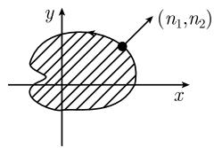
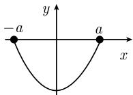
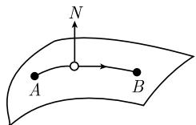
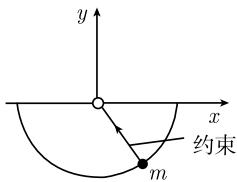

##### 5.1.7 应用

狄多 (黛朵) 女王的经典等周问题 据传说, 在迦太基 (Carthago) 建造之初, 狄多女王仅被允许获得由一张公牛皮所能界定的那样多的土地. 聪明的女王把牛皮剪成薄条, 然后用它围成一个圆周.

定理 在所有长度为 l 所围成的二维区域 D 中, 圆周所围的面积最大.

为了启发这种情况, 我们考虑极小化问题

$$
\boxed { \begin{array}{l} {-  \int_ {D} \mathrm{d} x \mathrm{d} y \stackrel {!} {=} \min \quad (\text {负面积}),} \\ { \int_ {\partial D} \mathrm{d} s = l \qquad (\text {界线的长度}).} \end{array} }
$$

我们寻找形式 $x = x(t), y = y(t), t_0 \leqslant t \leqslant t_1$ 的边界曲线 (图5.13(a)). 于是其外法向单位向量的分量为

$$
n _ {1} = \frac {y ^ {\prime} (t)}{\sqrt {x ^ {\prime} (t) ^ {2} + y ^ {\prime} (t) ^ {2}}}, n _ {2} = \frac {x ^ {\prime} (t)}{\sqrt {x ^ {\prime} (t) ^ {2} + y ^ {\prime} (t) ^ {2}}}.
$$

  
(a)

图5.13  

分部积分得到

$$
2 \int_ {D} \mathrm{d} x \mathrm{d} y = \int_ {D} \left(\frac {\partial x}{\partial x} + \frac {\partial y}{\partial y}\right) \mathrm{d} x \mathrm{d} y = \int_ {\partial D} (x n _ {1} + y n _ {2}) \mathrm{d} s.
$$

这样, 我们把问题重新表述得到新的问题

$$
\begin{array}{l} \int_ {t _ {0}} ^ {t _ {1}} (- y ^ {\prime} (t) x (t) + x ^ {\prime} (t) y (t)) \mathrm{d} t \stackrel {!} {=} \min, \\ x (t _ {0}) = x (t _ {1}) = R, \quad y (t _ {0}) = y (t _ {1}) = 0, \\ \int_ {t _ {0}} ^ {t _ {1}} \sqrt {x ^ {\prime} (t) ^ {2} + y ^ {\prime} (t) ^ {2}} \mathrm{d} t = l. \end{array}
$$

这里 R 是一实参数. 对于修正的拉格朗日函数 $L := -y'x + x'y + \lambda\sqrt{x'^{2} + y'^{2}}$ ，得到欧拉-拉格朗日方程

$$
\frac {\mathrm{d}}{\mathrm{d} t} \mathcal {L} _ {x ^ {\prime}} - \mathcal {L} _ {x} = 0, \quad \frac {\mathrm{d}}{\mathrm{d} t} \mathcal {L} _ {y ^ {\prime}} - \mathcal {L} _ {y} = 0,
$$

即

$$
\boxed {2 y ^ {\prime} + \lambda \frac {\mathrm{d}}{\mathrm{d} x} \frac {x ^ {\prime}}{\sqrt {x ^ {\prime 2} + y ^ {\prime 2}} = 0}, \quad - 2 x ^ {\prime} + \lambda \frac {\mathrm{d}}{\mathrm{d} x} \frac {y ^ {\prime}}{\sqrt {x ^ {\prime 2} + y ^ {\prime 2}}} = 0.}
$$

于是当 $\lambda = -2$ 时, 得到解 $x = R \cos t, y = R \sin t$ , 其中 $l = 2\pi R$ .

术语：按照雅各布·伯努利 (Jakob Bernoulli, 1655—1705), 我们称带积分约束的变分问题为等周问题.

悬索问题 我们寻找一根长度为 l 的悬索在重力作用下的形状 $y = y(x)$ . 假定悬索在两点 $(-a,0)$ 和 $(a,0)$ 固定起来 (图 5.14).

解答: 最小势能原理使我们得到如下的变分问题:

$$
\boxed { \begin{array}{c} \int_ {- a} ^ {a} \rho g y (x) \sqrt {1 + y ^ {\prime} (x) ^ {2}} \mathrm{d} x \stackrel {!} {=} \min, \\ y (- a) = y (a) = 0, \\ \int_ {- a} ^ {a} \sqrt {1 + y ^ {\prime} (x) ^ {2}} \mathrm{d} x = l. \end{array} }
$$

  
图5.14

(这里 $\rho$ 是悬索的密度常数, 而 $g$ 是重力加速度常数). 为了简化公式, 令 $\lambda g = 1$ . 修正的拉格朗日函数为 $\mathcal{L} := (y + \lambda) \sqrt{1 + y'^2}$ , 这里实数 $\lambda$ 为拉格朗日乘子. 由此根据 (5.18) 从相应的欧拉-拉格朗日方程得到关系式

$$
y ^ {\prime} \mathcal {L} _ {y ^ {\prime}} - \mathcal {L} = \text { 常数 }.
$$

于是经计算推出 $\frac{y+\lambda}{\sqrt{1+y'^{2}}} = c,$ 从而得到解族

$$
y = c \cosh \left(\frac {x}{c} + b\right) - \lambda .
$$

这些就是悬链线 $^{1)}$ . 常数 b, c 和 $\lambda$ 从边界条件和约束条件得出.

测地线 在由 $M(x,y,z) = 0$ 给出的曲面上，寻找点 $A(x_0,y_0,z_0)$ 和 $B(x_{1},y_{1},z_{1})$ 之间的最短路径 $x = x(t),y = y(t),z = z(t),t_0\leqslant t\leqslant t_1.$ 如图5.15.解答：变分问题是

  
图 5.15 测地线的变分问题

$$
\boxed { \begin{array}{l} {\int_ {t _ {0}} ^ {t _ {1}} \sqrt {x ^ {\prime} (t) ^ {2} + y ^ {\prime} (t) ^ {2} + z ^ {\prime} (t) ^ {2}} \mathrm{d} t \stackrel {!} {=} \min,} \\ {x (t _ {0}) = x _ {0}, y (t _ {0}) = y _ {0}, z (t _ {0}) = z _ {0},} \\ {x (t _ {1}) = x _ {1}, y (t _ {1}) = y _ {1}, z (t _ {1}) = z _ {1},} \\ {M (x, y, z) = 0 \quad (\text {约束}).} \end{array} }
$$

对于修正的拉格朗日函数 $\mathcal{L} := \sqrt{x^2 + y^2 + z^2} + \lambda M(x, y, z)$ , 其欧拉-拉格朗日方程

$$
\frac {\mathrm{d}}{\mathrm{d} t} \mathcal {L} _ {x ^ {\prime}} - \mathcal {L} _ {x} = 0, \quad \frac {\mathrm{d}}{\mathrm{d} t} \mathcal {L} _ {y ^ {\prime}} - \mathcal {L} _ {y} = 0, \quad \frac {\mathrm{d}}{\mathrm{d} t} \mathcal {L} _ {z ^ {\prime}} - \mathcal {L} _ {z} = 0
$$

在以弧长 s 作为参数进行变量替换后就变成

$$
\boxed {\boldsymbol {r} ^ {\prime \prime} (s) = \mu (s) (\mathbf {g r a d} M) (\boldsymbol {r} (s)).}
$$

几何上这意味着, 曲线 $\boldsymbol{r} = \boldsymbol{r}(s)$ 的主法向量或者平行于曲面的法向量 N, 或者与其反平行.

圆周摆及其约束(图 5.16) 如果 $x = x(t)$ ， $y = y(t)$ 是长为 l 质量为 m 的圆周摆的轨线，那么将稳态作用原理用于拉格朗日函数

  
图 5.16 圆周摆

$$
L = \mathrm{动能} - \mathrm{势能} = {\frac {1}{2}} m (x ^ {' 2} + y ^ {' 2}) - m g y
$$

就得到如下的变分问题:

$$
\boxed { \begin{array}{l} {{ \int_ {t _ {0}} ^ {t _ {1}} L (x (t), x ^ {\prime} (t), y (t), y ^ {\prime} (t), t) \mathrm{d} t \stackrel {!} {=} \text {平稳},}} \\ {{x (t _ {0}) = x _ {0}, y (t _ {0}) = y _ {0}, x (t _ {1}) = x _ {1}, y (t _ {1}) = y _ {1},}} \\ {{x (t) ^ {2} + y (t) ^ {2} - l ^ {2} = 0 \quad (\text {约束}).}} \end{array} }
$$

对于带有实参数 $\lambda$ 的修正的拉格朗日函数 $\mathcal{L} := L - \lambda(x^{2} + y^{2} - l^{2})$ ，得到欧拉-拉格朗日方程

$$
\frac {\mathrm{d}}{\mathrm{d} t} \mathcal {L} _ {x ^ {\prime}} - \mathcal {L} _ {x} = 0, \quad \frac {\mathrm{d}}{\mathrm{d} t} \mathcal {L} _ {y ^ {\prime}} - \mathcal {L} _ {y} = 0.
$$

上式化成

$$
m x ^ {\prime \prime} = - 2 \lambda x, m y ^ {\prime \prime} = - m g - 2 \lambda y.
$$

如果使用方向向量 $r = xi + yj$ ，则得到圆周摆运动方程

$$
\boxed {m \boldsymbol {r} ^ {\prime \prime} = g \boldsymbol {j} - 2 \lambda \boldsymbol {r}.}
$$

这里 -gj 对应于重力, $-2\lambda r$ 则是摆沿圆周运动相反方向作用的附加力.
