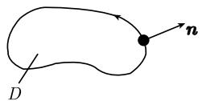
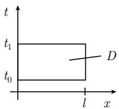

#### 5.2 多变量函数的变分法

##### 5.2.1 欧拉-拉格朗日方程

假设给定 $R^{N}$ 中一有界区域 D 和边界 $\partial D$ 上一函数 $\psi$ . 考虑极小化问题

$$
\boxed { \begin{array}{c} {\int_ {D} L (\pmb {x}, \pmb {q}, \partial \pmb {q}) \mathrm{d} \pmb {x} \stackrel {!} {=} \min,} \\ {\pmb {q} = \pmb {\psi}, \text {在} \partial D \text {上},} \end{array} }\tag{5.44}
$$

以及更一般的问题

$$
\boxed { \begin{array}{c} {\int_ {D} L (\pmb {x}, \pmb {q}, \partial \pmb {q}) \mathrm{d} \pmb {x} \stackrel {!} {=} \text {稳态},} \\ {\pmb {q} = \pmb {\psi}, \text {在} \partial D \text {上}.} \end{array} }\tag{5.45}
$$

在这里, 已经令 $\partial_{j} = \partial/\partial x_{j}$ , 且

$$
\boldsymbol {x} = (x _ {1}, \dots , x _ {N}), \quad \boldsymbol {q} = (q _ {1}, \dots , q _ {K}), \quad \partial \boldsymbol {q} = (\partial_ {j} q _ {k}).
$$

我们还假定函数 L 和 $\psi$ 在边界 $\partial D$ 上充分光滑.

主定理 如果 $\boldsymbol{q} = \boldsymbol{q}(t)$ 是 (5.44) 或 (5.45) 的解, 那么 q 在 D 上满足如下的欧拉-拉格朗日方程: $^{1)}$

$$
\boxed {\sum_ {j = 1} ^ {N} \partial_ {j} L _ {\partial_ {j} q _ {k}} - L q _ {k} = 0, \quad k = 1, \dots , K.}\tag{5.46}
$$

这些著名的方程是拉格朗日在 1762 年推导出来的. 物理中各领域的理论都可借助于 (5.46) 用公式表达, 在这里 (5.45) 对应于稳态作用原理.

推论 对于充分光滑的函数 q, 问题 (5.45) 等价于 (5.46).

##### 5.2.2 应用

平面（二维）问题 极小化问题

$$
\boxed { \begin{array}{c} {\int_ {D} L (q (x, y), q _ {x} (x, y), q _ {y} (x, y), x, y) \mathrm{d} x \mathrm{d} y \stackrel {!} {=} \min,} \\ {q = \psi , \text {在} \partial D \text {上}} \end{array} }\tag{5.47}
$$

1) 以更详细的方式表达, 这些方程是

$$
\sum_ {j = 1} ^ {N} \frac {\partial}{\partial x _ {j}} \frac {\partial L (Q)}{\partial (\partial_ {j} q _ {k})} - \frac {\partial L (Q)}{\partial q _ {k}} = 0, \quad k = 1, \dots , K,
$$

其中 $Q = (\boldsymbol{x}, \boldsymbol{q}(\boldsymbol{x}), \partial \boldsymbol{q}(\boldsymbol{x}))$ .

可解的一个必要条件是欧拉-拉格朗日方程

$$
\boxed {\frac {\partial}{\partial x} L _ {q _ {x}} + \frac {\partial}{\partial y} L _ {q _ {y}} - L _ {q} = 0}\tag{5.48}
$$

可解.

极小曲面(图 5.18) 我们寻找一个曲面 $\mathcal{F}: z = q(x, y)$ ，它在通过给定边界曲线 C 的曲面中有最小的曲面面积。相应的变分问题是

$$
\boxed {\int_ {D} \sqrt {1 + q _ {x} (x , y) ^ {2} + q _ {y} (x , y) ^ {2}} \mathrm{d} x \mathrm{d} y \stackrel {!} {=} \min, \quad q = \psi , \text {在} \partial D \text {上},}
$$

其在 $D$ 上的欧拉-拉格朗日方程是

$$
\boxed {\frac {\partial}{\partial x} \left(\frac {q _ {x}}{\sqrt {1 + q _ {x} ^ {2} + q _ {y} ^ {2}}}\right) + \frac {\partial}{\partial y} \left(\frac {q _ {y}}{\sqrt {1 + q _ {x} ^ {2} + q _ {y} ^ {2}}}\right) = 0.}\tag{5.49}
$$

这一方程的所有解都称为极小曲面．方程(5.49)在几何上意味着曲面的平均曲率恒等于零,即在 $\partial D$ 上 $H\equiv 0$

  
图 5.18 极小曲面

  
图 5.19 悬链曲面

悬链曲面 (图 5.19) 我们让一条曲线 $y = y(x)$ 围绕 x 轴旋转. 目的是按这一方式产生一个面积最小的曲面. 相应的变分问题是

$$
\boxed {\int_ {x _ {0}} ^ {x _ {1}} L (y (x), y ^ {\prime} (x), x) \mathrm{d} x \stackrel {!} {=} \min, \quad y (x _ {0}) = y _ {0}, \quad y (x _ {1}) = y _ {1},}
$$

这里 $L = y \sqrt{1 + y'^{2}}$ . 根据 (5.8), 从欧拉-拉格朗日方程得到 $y' L_{y'} - L =$ 常数, 即有

$$
\frac {y (x)}{\sqrt {1 + y ^ {\prime} (x) ^ {2}}} = \text { 常数 }.
$$

悬链曲面 $y = c\cosh \left(\frac{x}{c} +b\right)$ 是一个解.

这个悬链曲面是通过旋转曲线得到的唯一的极小曲面. 泊松方程的第一边界问题 极小化问题

$$
\boxed {\int_ {D} \frac {1}{2} (q _ {x} ^ {2} + q _ {y} ^ {2} - 2 f q) \mathrm{d} x \mathrm{d} y \stackrel {!} {=} \min, \quad q = \psi , \text {在} \partial D \text {上}}\tag{5.50}
$$

的每一个充分光滑的解都满足欧拉-拉格朗日方程

$$
\boxed {- q _ {x x} - q _ {y y} = f, \text {在} D \text {上}, \qquad \qquad q = \psi , \text {在} \partial D \text {上}.}\tag{5.51}
$$

这就是泊松方程的第一边值问题.

弹性膜 物理上, (5.51) 对应于由边界 $C$ 张成的膜 $z = q(x, y)$ 的极小势能原理 (图 5.18). 量 $q$ 在这里对应于外力密度. 至于重力我们选择 $f(x, y) = -\rho g(\rho$ 为密度, 而 $g$ 为重力常数).

泊松方程的第二和第三边界值问题 极小化问题

$$
\boxed {\int_ {D} (q _ {x} ^ {2} + q _ {y} ^ {2} - 2 f q) \mathrm{d} x \mathrm{d} y + \int_ {\partial D} (a q ^ {2} - 2 b q) \mathrm{d} s \stackrel {!} {=} \min}\tag{5.52}
$$

的每一个充分光滑的解都满足欧拉-拉格朗日方程

$$
\boxed {- q _ {x x} - q _ {y y} = f, \text {在} D \text {上},}\tag{5.53}
$$

  
图 5.20 泊松方程边值问题

$$
\boxed {\frac {\partial q}{\partial \pmb {n}} + a q = b, \text {在} \partial D \text {上}.}\tag{5.54}
$$

这里 s 表示在数学意义下正定向的边界曲线上的弧长, 而

$$
\frac {\partial q}{\partial \pmb {n}} = n _ {1} q _ {x} + n _ {2} q _ {y}
$$

表示外法向导数, 其中 $n = n_{1}i + n_{2}j$ 为单位外法向向量 (图 5.20).

对于 $a \equiv 0$ (相应地 $a \neq 0$ ), (5.53)(相应地, (5.54)) 称为泊松方程第二(相应地, 第三)边值问题.

边界条件 (5.54) 在变分问题 (5.52) 中并未出现. 因此, 这是一个自然边界条件. 对于 $a \equiv 0$ , 函数 $f$ 和 $b$ 不是任意的, 而必须满足可解性条件

$$
\int_ {D} f \mathrm{d} x \mathrm{d} y + \int_ {\partial D} b \mathrm{d} s = 0.\tag{5.55}
$$

证明轮廓 设 q 是 (5.52) 的解.

步骤 1: 我们用 $q + \varepsilon h$ 代替 q, 其中 $\varepsilon$ 为实小参数, 得到

$$
\begin{array}{l} \varphi (\varepsilon) := \int_ {D} [ (q _ {x} + \varepsilon h _ {x}) ^ {2} + (q _ {y} + \varepsilon h _ {y}) ^ {2} - 2 f (q + \varepsilon h) ] \mathrm{d} x \mathrm{d} y \\ \qquad + \int_ {\partial D} [ a (q + \varepsilon h) ^ {2} - 2 (q + \varepsilon h) b ] \mathrm{d} s. \end{array}
$$

由于 (5.52), 函数 $\varphi$ 在 $\varepsilon = 0$ 处达到极小, 即有 $\varphi'(0) = 0$ . 于是

$$
\frac {1}{2} \varphi^ {\prime} (0) = \int_ {D} (q _ {x} h _ {x} + q _ {y} h _ {y} - f h) \mathrm{d} x \mathrm{d} y + \int_ {\partial D} (a q h - b h) \mathrm{d} s = 0.\tag{5.56}
$$

如果 $a \equiv 0$ , 则 (5.55) 从 (5.56) 取 $h \equiv 1$ 推出.

步骤 2: 分部积分得到

$$
- \int_ {D} (q _ {x x} + q _ {y y} + f) h \mathrm{d} x \mathrm{d} y + \int_ {\partial D} \left(\frac {\partial q}{\partial \boldsymbol {n}} + a q - b\right) h \mathrm{d} s = 0.\tag{5.57}
$$

步骤 3: 我们介绍一种启发式的论证, 它的正确性是完全可以证明的. 方程 (5.57) 对于所有光滑函数 h 成立.

(i) 首先考虑沿边界 $\partial D$ 为0的所有光滑函数 $h$ 组成的集合. 于是 (5.57) 中的边界积分为0, 从而由于 $h$ 是任意的, 得到

$$
q _ {x x} + q _ {y y} + f = 0, \quad \text {在} D \text {上}.
$$

(ii) 于是 (5.57) 中 $D$ 上的积分为0.由于可以选择函数 $h$ 在边界上取任意值，从而有

$$
{\frac {\partial q}{\partial \pmb {n}}} + a q - b = 0, \quad \text {在} \partial D \text {上}.
$$

注 对于变分问题 (5.50), 类似的讨论导致类似的结果. 由于在 $\partial D$ 上 $q = \psi$ , 因此在这种情形我们将限制函数 $h$ 在 $\partial D$ 上 $h = 0$ . 于是从结论 (i) 得到 (5.51).

振动弦的稳态作用原理 设方程 $q = q(x, t)$ 描述一根弦 t 时刻在点 x 处的位移 (图 5.21(a)). 令 $D := \{(x, t) \in \mathbb{R}^{2} : 0 \leqslant x \leqslant l, t_{0} \leqslant t \leqslant t_{1}\}$ .

  
图 5.21 振动弦的平稳作用原理

对于拉格朗日函数

$$
L = \mathrm{动能} - \mathrm{势能} = {\frac {1}{2}} \rho q _ {t} ^ {2} - {\frac {1}{2}} k q _ {x} ^ {2}
$$

(这里 $\rho$ 表示密度, 而 k 是材料常数), 稳态作用原理是说

$$
\boxed { \begin{array}{l} {\int_ {D} L \mathrm{d} x \stackrel {!} {=} \text {平稳},} \\ {q \text {沿着边界} \partial D \text {给定}.} \end{array} }
$$

相应的欧拉-拉格朗日方程 $(L_{q_t})_t + (L_{qx})_x = 0$ 导致弦振动方程

$$
\boxed {\frac {1}{c ^ {2}} q _ {t t} - q _ {x x} = 0,}\tag{5.58}
$$

其中 $c^{2}=k/\rho.$

定理 (5.58) 的最一般的 $C^2$ 解是

$$
\boxed {q (x, t) = a (x - c t) + b (x + c t),}\tag{5.59}
$$

这里 a 和 b 为任意 $C^{2}$ 函数. 解 (5.59) 对应于以速度 c 在相反方向传播的两个波的叠加 (一个从左到右, 另一个从右到左).

##### 5.2.3 带约束的问题和拉格朗日乘子

用一个例子来讨论这一重要的方法.

拉普拉斯方程的本征值问题 为了求解变分问题

$$
\boxed { \begin{array}{l} {{ \int_ {D} (q _ {x} ^ {2} + q _ {y} ^ {2}) \mathrm{d} x \mathrm{d} y \stackrel {!} {=} \min, \quad q = 0 \text {在} \partial D \text {上},}} \\ {{ \int_ {\partial D} q ^ {2} \mathrm{d} s = 1,}} \end{array} }\tag{5.60}
$$

类似于 5.1.6, 选择拉格朗日函数

$$
\mathcal {L} := L + \lambda q ^ {2} = q _ {x} ^ {2} + q _ {y} ^ {2} + \lambda q ^ {2}.
$$

实数 $\lambda$ 称为拉格朗日乘子. L 的欧拉-拉格朗日方程是

$$
\frac {\partial}{\partial x} \mathcal {L} _ {q _ {x}} + \frac {\partial}{\partial y} \mathcal {L} _ {q _ {y}} - \mathcal {L} _ {q} = 0.
$$

这对应于本征值问题

$$
\boxed {q _ {x x} + q _ {y y} = \lambda q, \text {在} D \text {上}, q = 0, \text {在} \partial D \text {上}.}\tag{5.61}
$$

可以证明 (5.61) 是 (5.60) 存在 $C^2$ 解的一个必要条件. 在这种情形下拉格朗日乘子成为一个本征值.
