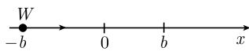

#### 5.3 控制问题

目的 控制理论研究通过适当选取控制量 (或控制) 开发用于最优化过程的数学工具.

```txt
哈密顿力学 控制理论
作用泛函 S 的哈密顿-雅可比微分方程 → 贝尔曼动态最优化
能量函数 H 的哈密顿典范方程 → 庞特里亚金极大值原理
```

例 1: 当宇宙飞船从月球返回时, 必须对其进入大气层的轨道进行控制, 以尽量减少热护罩上的热量. 对此没有办法进行试验; 更确切地说, NASA 必须使用工程师的

模型方程并应用这些方程作数值模拟．计算机计算对于控制参数的小变化极为敏感．实际上，为返回舱可能的进入仅有一个小窗口．如果错过这个窗口，返回舱将熔化，或者被弹回宇宙．图5.22表示轨道．跟人们的预期有些相反，返回舱首先下降至相当深的大气层，然后直到进入稳定的圆轨道才令

  
图5.22

其调整姿态作最后的降落. $^{1)}$

例 2: 火箭的发射应使用最少量的燃料达到预定姿态. 这个问题在 [212] 中有研究.
例 3: 月球登陆车的控制是使得登陆尽可能平稳, 并要使用最少量的燃料.

例 4: 飞向火星的宇宙飞船的飞行要求使用最少量的燃料. 为此, 计算机仿真计算轨道时要考虑其他行星的重力影响.

控制理论中两种不同的对策 现代控制理论诞生于 1950 年至 1960 年期间. 它在两个方向推广了经典的变分法:

##### 5.3.1 贝尔曼动态最优化

基本问题 考虑极小化问题

$$
\boxed {F (\boldsymbol {z} (t _ {1}), t _ {1}) \stackrel {!} {=} \min.}\tag{5.62}
$$

此外, 有如下约束条件.

(i) 状态 z 的控制方程(函数 u 称为控制):

$$
\boldsymbol {z} ^ {\prime} (t) = \boldsymbol {f} (\boldsymbol {z} (t), \boldsymbol {u} (t), t).
$$

(ii) 状态的初始条件:

$$
\boldsymbol {z} (t _ {0}) = \boldsymbol {a}.
$$

(iii) 状态的末时刻条件:

$$
t _ {1} \in \mathcal {T}, \qquad \boldsymbol {z} (t _ {1}) \in \mathcal {Z}.
$$

1) 这个问题在 [213], 第 III 卷, 48.10 节中应用庞特里亚金极大值原理进行了讨论.

(iv) 控制的约束:

$$
u (t) \in {\mathcal {U}}, \quad {\text { 在 }} [ t _ {0}, t _ {1} ]   \text { 上 }.
$$

参数 t 对应于时间. 未知量是末时刻 $t_{1}$ 以及

$$
\boxed {\text {轨线} \boldsymbol {z} = \boldsymbol {z} (t) \text {和最优控制} \boldsymbol {u} = \boldsymbol {u} (t).}
$$

这里采用记号： $z = (z_{1}, \cdots, z_{N})$ ， $u = (u_{1}, \cdots, u_{M})$ 。初始时刻 $t_{0}$ 随初始状态给定，T 为时间区间，而 $Z \subset R^{N}$ ， $U \subset R^{M}$ 。

容许对 一对函数

$$
\boldsymbol {z} = \boldsymbol {z} (t), \quad \boldsymbol {u} (t), \quad t _ {0} \leqslant t \leqslant t _ {1}
$$

称为容许的, 是指这些函数除了有限个跳跃点外, 都是连续的, 并且还满足上述约束 (i) 到 (iv). 所有这样的容许对组成的集合将记作 $Z(t_{0}, a)$ .

贝尔曼作用函数 S 定义

$$
\boxed {S (t _ {0}, \boldsymbol {a}) := \inf _ {(\boldsymbol {u}, \boldsymbol {z}) \in Z (t _ {0}, a)} F (\boldsymbol {z} (t _ {1}), t _ {1}),}
$$

即我们在所有容许对上取下确界. 下面让初始条件 $(t_{0}, \boldsymbol{a})$ 变化, 研究函数 S.

主定理(必要条件) 设 $(z^{*}, u^{*})$ 是控制问题 (5.62) 的解. 那么下列三个条件满足:

(i) 函数 $S = S(\pmb{z}(t), t)$ 对于所有容许对 $(\pmb{z}, \pmb{u})$ 在时间区间 $[t_0, t_1]$ 上是严格下降的.

(ii) 函数 $S = S(z^{*}(t), t)$ 在 $[t_{0}, t_{1}^{*}]$ 上取常值.

(iii) 有 $S(\pmb{b}, t_1) = F(\pmb{b}, t_1) \forall \pmb{b} \in \mathcal{Z}, t_1 \in \mathcal{T}$ .

推论(充分条件) 如果函数 $S$ 与容许对 $(z^{*}, u^{*})$ 一起满足上述 (i) 到 (iii), 那么 $(z^{*}, u^{*})$ 是控制问题 (5.62) 的解.

哈密顿 - 雅可比 - 贝尔曼方程 假定作用函数 $S$ 充分光滑。对于每一个容许对 $(z, u)$ ，我们有不等式

$$
\boxed {S _ {t} (\boldsymbol {z} (t), t) + S _ {\boldsymbol {z}} (\boldsymbol {z} (t), t) f (\boldsymbol {z} (t), \boldsymbol {u} (t), t) \geqslant 0, \quad \forall t \in [ t _ {0}, t _ {1} ].}\tag{5.63}
$$

对于控制问题 (5.62) 的解, (5.63) 中的不等式是一个等式.

##### 5.3.2 应用

带二次成本函数的线性控制问题

$$
\boxed { \begin{array}{c} \int_ {t _ {0}} ^ {t _ {1}} (x (t) ^ {2} + u (t) ^ {2}) \mathrm{d} t \stackrel {!} {=} \min, \\ \hline x ^ {\prime} (t) = A x (t) + B u (t), \quad x (t _ {0}) = a, \end{array} }\tag{5.64}
$$

(5.65)

式中, A 和 B 是实数.

定理 设 w 是里卡蒂微分方程

$$
w ^ {\prime} (t) = - 2 A w (t) + B ^ {2} w (t) ^ {2} - 1, \quad \forall t \in [ t _ {0}, t _ {1} ]
$$

满足 $w(t_{1}) = 0$ 的解. 那么为了得到控制问题的解 $x = x(t)$ , 只需求解微分方程

$$
x ^ {\prime} (t) = A x (t) + B (- w (t) B x (t)), \quad x (t _ {0}) = a.\tag{5.66}
$$

最优控制由下式给出:

$$
u (t) = - w (t) B x (t).\tag{5.67}
$$

反馈控制 方程 (5.67) 刻画了状态 $x(t)$ 和最优控制 $u(t)$ (反馈控制) 之间的耦合. 这样的最优控制在工程中可用这种方式非常有效地设计出来, 并且在生物系统中也常会遇到. 方程 (5.66) 是通过将 (5.67) 耦合到控制方程 (5.65) 得到的.

证明: 第一步(问题的转化): 我们引入新的函数 $y(\cdot)$ :

$$
y ^ {\prime} (t) = x (t) ^ {2} + u (t) ^ {2}, \quad y (t _ {0}) = 0.
$$

将 $y$ 作为变量我们得到等价的问题

$$
\begin{array}{l} y (t _ {1}) \stackrel {!} {=} \min, \\ y ^ {\prime} (t) = x (t) ^ {2} + u (t) ^ {2}, \quad y (t _ {0}) = 0, \\ x ^ {\prime} (t) = A x (t) + B u (t), \quad x (t _ {0}) = a. \end{array}
$$

此外, 令 $z := (x, y)$ .

第二步: 对于贝尔曼作用函数 S, 使用

$$
S (x, y, t) := w (t) x ^ {2} + y.
$$

第三步: 我们验证 5.3.1 中推论的假设.

(i) 如果 $w = w(t)$ 是里卡蒂方程的解, 并且 $x = x(t), u = u(t)$ 满足控制方程 (5.65), 那么

$$
\begin{array}{r l} \frac {\mathrm{d} S (x (t) , y (t) , t)}{\mathrm{d} t} & = w ^ {\prime} (t) x (t) ^ {2} + 2 w (t) x (t) x ^ {\prime} (t) + y ^ {\prime} (t) \\ & = (u (t) + w (t) B x (t)) ^ {2} \geqslant 0. \end{array}
$$

于是函数 $S = S(x(t),y(t),t)$ 相对于时间 $t$ 是下降的.

(ii) 如果耦合条件 (5.67) 满足, 那么在 (i) 中我们有等式, 即 $S(x(t), y(t), t) =$ 常数.

(iii) 从 $w(t_{1}) = 0$ 我们得到 $S(x(t_{1}), y(t_{1}), t_{1}) = y(t_{1})$ .

##### 5.3.3 庞特里亚金极大值原理

控制问题 我们考虑极小化问题

$$
\boxed {\int_ {t _ {0}} ^ {t _ {1}} L (\boldsymbol {q} (t), \boldsymbol {u} (t), t) \mathrm{d} t \stackrel {!} {=} \min.}\tag{5.68}
$$

另外我们有如下约束条件：

(i) 轨线q的控制方程:

$$
\boldsymbol {q} ^ {\prime} (t) = \boldsymbol {f} (\boldsymbol {q} (t), \boldsymbol {u} (t), t).
$$

(ii) 轨线q的初始条件:

$$
\boldsymbol {q} (t _ {0}) = \boldsymbol {a}.
$$

(iii) 轨线在末时刻 $t_{1}$ 的条件:

$$
\boldsymbol {h} (\boldsymbol {q} (t _ {1}), t _ {1}) = \boldsymbol {0}.
$$

(iv) 对于控制的约束:

$$
\boldsymbol {u} (t) \in \mathcal {U}, \quad \forall t \in [ t _ {0}, t _ {1} ].
$$

注 必须要考虑所有可能的有穷区间 $[t_0, t_1]$ . 假定控制 $u(t)$ 除了有穷个间断点外是连续的. 此外, 假定轨线是连续的, 并且除了有穷个点外, 相对于 $t$ 一阶可导. 令

$$
\boldsymbol {q} = \left(q _ {1}, \dots , q _ {N}\right), \quad \boldsymbol {u} = \left(u _ {1}, \dots , u _ {M}\right), \quad \boldsymbol {f} = \left(f _ {1}, \dots , f _ {N}\right), \quad \boldsymbol {h} = \left(h _ {1}, \dots , h _ {N}\right).
$$

给定量是初始时刻 $t_0$ , 初始位置 $\boldsymbol{a} \in \mathbb{R}^N$ , 和控制集 $\mathcal{U} \subset \mathbb{R}^M$ . 最后我们假定给定函数 $L, \boldsymbol{f}$ 和 $\boldsymbol{h}$ 属于 $C^1$ .

广义哈密顿函数 $\mathcal{H}$ 我们定义

$$
\mathscr {H} (\boldsymbol {q}, \boldsymbol {u}, \boldsymbol {p}, t, \lambda) := \sum_ {j = 1} ^ {N} p _ {j} f _ {j} (\boldsymbol {q}, \boldsymbol {u}, t) - \lambda L (\boldsymbol {q}, \boldsymbol {u}, t).
$$

主定理 如果 $\pmb{q},\pmb{u},t_1$ 构成控制问题(5.68)的一个解, 那么存在数 $\lambda = 1$ 或 $\lambda = 0$ , 向量 $\alpha \in \mathbb{R}^N$ 和 $[t_0,t_1]$ 上的连续函数 $p_j = p_j(t)$ , 使得如下条件满足.

(a) 庞特里亚金极大值原理:

$$
\boxed {\mathcal {H} (\boldsymbol {q} (t), \boldsymbol {u} (t), \boldsymbol {p} (t), t, \lambda) = \max _ {\boldsymbol {w} \in \mathcal {U}} \mathcal {H} (\boldsymbol {q} (t), \boldsymbol {w}, \boldsymbol {p} (t), t, \lambda).}
$$

(b) 广义典范方程: 1)

$$
p _ {j} ^ {\prime} = \mathcal {H} _ {q _ {j}}, q _ {j} ^ {\prime} = \mathcal {H} _ {p _ {j}}, j = 1, \dots , N.
$$

1) 这意味着

$$
p _ {j} ^ {\prime} (t) = - \frac {\partial \mathcal {H}}{\partial q _ {j}} (Q), \quad q _ {j} ^ {\prime} (t) = \frac {\partial \mathcal {H}}{\partial p _ {j}} (Q),
$$

其中 $Q := (\boldsymbol{q}(t), \boldsymbol{u}(t), \boldsymbol{p}(t), \lambda)$ .

(c) 末时刻 $t_{1}$ 的条件: 1)

$$
\pmb {p} (t _ {1}) = - h _ {q} (\pmb {q} (t _ {1}), t _ {1}) \pmb {\alpha}.
$$

式中, 或者 $\lambda = 1$ , 或者 $\lambda = 0$ , 并且 $\alpha \neq 0$ . 如果 $h \equiv 0$ , 那么 $\lambda = 1$ .

推论 如果在右端的连续点上令

$$
\boldsymbol {p} _ {0} (t) := \mathscr {H} (\boldsymbol {q} (t), \boldsymbol {u} (t), \boldsymbol {p} (t), t, \lambda),
$$

那么 $p_{0}$ 可以扩展成整个 $[t_{0}, t_{1}]$ 上的连续函数。此外， $^{2)}$

$$
\pmb {p} _ {0} ^ {\prime} = \mathcal {H} _ {t},\tag{5.69}
$$

和

$$
\pmb {p} _ {0} (t _ {1}) = h _ {t} (q (t _ {1}), t _ {1}) \pmb {\alpha}.
$$

方程 (a), (b) 和 (5.69) 在最优控制 $u = u(t)$ 连续的所有时刻 $t \in [t_0, t_1]$ 处都连续.

##### 5.3.4 应用

理想化的机动车的最优控制 假定质量为 $m$ 的车辆 $W$ 在初始时刻 $t_0 = 0$ 在点 $x = -b$ 处于静止状态. 现在车辆在沿 $x$ 轴的发动机的力 $u = u(t)$ 的作用下开始运动. 要寻找一运动 $x = x(t)$ 使得车辆 $W$ 在尽可能短的时间 $t_1$ 达到点 $x = b$ , 并且处于静止状态 (图5.23). 这里重要的是发动机的功率满足约束 $|u| \leqslant 1$ .

  
图5.23

问题的数学提法:

$$
\boxed { \begin{array}{l} \int_ {t _ {0}} ^ {t _ {1}} \mathrm{d} t \stackrel {!} {=} \min, \quad x ^ {\prime \prime} (t) = u (t), \quad | u | \leqslant 1, \\ x (0) = - b, \quad x ^ {\prime} (0) = 0, \quad x (t _ {1}) = - b, \quad x ^ {\prime} (t _ {1}) = 0. \end{array} }
$$

砰砰控制：现在证明，最优控制使得车辆在运动中最大加速紧跟着最大减速。这一过程是在前半路程让发动机开足马力 $u = 1$ 直到 $x = 0$ ，然后用 $u = -1$ 减速。应用庞特里亚金极大值原理的证明：令 $q_{1} := x, q_{2} := x'$ 。于是有

$$
\begin{array}{l} \int_ {t _ {0}} ^ {t _ {1}} \mathrm{d} t \stackrel {!} {=} \min, \quad | u (t) | \leqslant 1, \\ q _ {1} ^ {\prime} = q _ {2}, \quad q _ {2} ^ {\prime} = u, \\ q _ {1} (0) = - b, \quad q _ {2} (0) = 0, \quad q _ {1} (t _ {1}) - b = 0, \quad q _ {2} (t _ {1}) = 0. \end{array}
$$

1) 这意味着 $p_k(t_0) = -\sum_{j=1}^{N} \frac{\partial \mathcal{H}}{\partial q_k} (\pmb{q}(t_1), t_1) \alpha_j$ .

2) 这意味着 $p_0'(t) = \mathcal{H}_t(\pmb{q}(t), \pmb{u}(t), \pmb{p}(t), \lambda)$ .

根据 5.3.3, 广义哈密顿函数是

$$
\mathcal {H} := p _ {1} q _ {2} + p _ {2} u - \lambda .
$$

设 $q = q(t)$ 和 $u = u(t)$ 是其一个解. 令

$$
p _ {0} (t) := p _ {1} (t) q _ {2} (t) + p _ {2} (t) u (t) - \lambda .
$$

于是从5.3.3可得

(i) $p_{0}(t)=\max_{|w|\leqslant1}(p_{1}(t)q_{2}(t)+p_{2}(t)w-\lambda).$

(ii) $p_{1}^{\prime}(t) = -\mathcal{H}_{q_{1}} = 0, p_{1}(t_{1}) = -\alpha_{1}.$

(iii) $p_{2}^{\prime}(t) = -\mathcal{H}_{q_{2}} = -p_{1}(t), p_{2}(t_{1}) = -\alpha_{2}.$

$$
\mathrm{(iv)} p _ {0} ^ {\prime} (t) = \mathcal {H} _ {t} = 0, p _ {0} (t _ {1}) = 0.
$$

从 (ii) 到 (iv) 得到 $p_0(t) = 0, p_1(t) = -\alpha_1, p_2(t) = \alpha_1(t - t_1) - \alpha_2$ .

第一种情形：设 $\alpha_{1} = \alpha_{2} = 0$ ，那么 $\lambda = 1$ 。这与(i)矛盾，因为 $p_0(t) = p_1(t) = p_2(t) = 0,$ 从而这种情形被排除.

第二种情形： $\alpha_{1}^{2}+\alpha_{2}^{2}\neq0.$ 于是 $p_{2}\neq0,$ 并且从 (i) 可知

$$
p _ {2} (t) u (t) = \max _ {| w | \leqslant 1} p _ {2} (t) w.
$$

由此可见

$$
u (t) = 1, \text {若} p _ {2} (t) > 0; \qquad u (t) = - 1, \text {若} p _ {2} (t) <   0.
$$

由于 $p_{2}$ 是线性函数, 它至多只能改变一次正负号. 假定符号改变发生在时刻 $t_{*}$ . 由于在时刻 $t_{1}$ 必须减速, 故得到

$$
u (t) = 1, \text {若} 0 \leqslant t <   t _ {*}; u (t) = - 1, \text {若} t _ {*} <   t \leqslant t _ {1}.
$$

从运动方程 $x''(t)=u(t)$ ，我们得到

$$
x (t) = \left\{ \begin{array}{l l} \frac {1}{2} t ^ {2} - b, & 0 \leqslant t <   t _ {*}, \\ - \frac {1}{2} (t - t _ {1}) ^ {2} + b, & t _ {*} <   t \leqslant t _ {1}. \end{array} \right.
$$

在加速变成减速的时刻 $t_{*}$ ，位置和速度必须重合。因此

$$
x ^ {\prime} (t _ {*}) = t _ {*} = t _ {1} - t _ {*},
$$

即 $t_* = t_1 / 2$ . 最后从

$$
x (t _ {*}) = \frac {t _ {1} ^ {2}}{8} - b = - \frac {t _ {1} ^ {2}}{8} + b
$$

我们看出 $x(t_{*})=0$ . 这意味着小车在加速变成减速的时刻 $t_{*}$ 必须位于 x=0.
