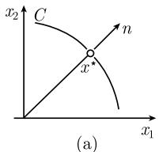
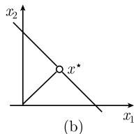
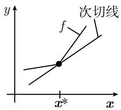
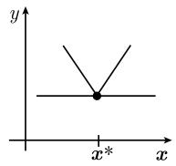

#### 5.4 经典非线性最优化

##### 5.4.1 局部极小化问题

设给定定义在点 $x^{*}$ 的某个邻域 U 上的函数

$$
\boxed {f: U \subseteq \mathbb {R} ^ {N} \to \mathbb {R}.}
$$

只要研究极小化问题就够了, 因为用 -f 代替 f, 极大化问题就转换成极小化问题. 设 $\boldsymbol{x} = (x_{1}, \cdots, x_{N})$ .

定义 称函数 f 在点 $x^{*}$ 处有局部极小, 是指存在 $x^{*}$ 的一个邻域 V, 使得

$$
\boxed {f (\boldsymbol {x} ^ {*}) \leqslant f (\boldsymbol {x}), \quad \forall   \boldsymbol {x} \in V.}\tag{5.70}
$$

如果 $f(\pmb{x}^{*}) < f(\pmb{x}), \forall \pmb{x} \in V, \pmb{x} \neq \pmb{x}^{*}$ , 则称 $\pmb{x}^{*}$ 是一严格的局部极小. 必要条件 如果 $f$ 是 $C^1$ 函数, 并且 $f$ 在点 $\pmb{x}^{*}$ 有局部极小, 那么

$$
\boxed {f ^ {\prime} (\boldsymbol {x} ^ {*}) = 0.}
$$

这等价于 $^{1)}$ $\partial_{j}f(\boldsymbol{x}^{*})=0,j=1,\cdots,N.$

充分条件 设 f 属于 $C^{2}$ 型, 并且 $f'(x^{*}) = 0$ , 那么只要 f 满足

$$
f \text {在} \boldsymbol {x} ^ {*} \text {处的二阶偏导数矩阵} f ^ {\prime \prime} (\boldsymbol {x} ^ {*}) \text {仅有正本征值},\tag{D}
$$

$f$ 在点 $\pmb{x}^{*}$ 处就有严格局部极小. 条件 (D) 等价于所有主子式

$$
\det \left(\partial_ {j} \partial_ {k} (\boldsymbol {x} ^ {*})\right), \quad j, k = 1, \dots , M
$$

都是正的.

例: 函数 $f(x):=\frac{1}{2}(x_{1}^{2}+x_{2}^{2})+x_{1}^{3}$ 在 $\boldsymbol{x}^{*}=(0,0)$ 有严格极小.

证明：经计算得到 $\partial_{1}f(\boldsymbol{x})=x_{1}+3x_{1}^{2},\partial_{2}f(\boldsymbol{x})=x_{2},\partial_{1}^{2}f(0,0)=\partial_{2}^{2}f(0,0)=1,$ 并且 $\partial_{1}\partial_{2}f(0,0)=0.$ 由此可见

$$
\partial_ {1} f (0, 0) = \partial_ {2} f (0, 0) = 0,
$$

并且

$$
\partial_ {1} ^ {2} f (0, 0) > 0, \quad \left| \begin{array}{c c} \partial_ {1} ^ {2} f (0, 0) & \partial_ {1} \partial_ {2} f (0, 0) \\ \partial_ {1} \partial_ {2} f (0, 0) & \partial_ {2} ^ {2} f (0, 0) \end{array} \right| = \left| \begin{array}{c c} 1 & 0 \\ 0 & 1 \end{array} \right| > 0.
$$

##### 5.4.2 全局极小化问题和凸性

定理 对于凸集 K 上的凸函数 $f: K \subseteq R^{N} \to R$ ，其每一个局部极小都是其全局极小.

如果 f 是严格凸的, 那么 f 至多只有一个全局极小.

凸性判据：设 $f: U \subseteq \mathbb{R}^N \to \mathbb{R}$ 是开凸集 $U$ 上的一个 $C^2$ 函数，如果矩阵 $f''(\pmb{x})$ 在所有点 $\pmb{x} \in U$ 处仅有正本征值，则 $f$ 是严格凸函数.

例: 函数 $f(\boldsymbol{x})=\sum_{j=1}^{n}x_{j}\ln x_{j}$ 在集合 $U=\{\boldsymbol{x}\in\mathbb{R}^{N}\mid x_{j}>0,j=1,\cdots,N\}$ 上是严格凸的. 因此 -f 在 U 上上严格凹的. 熵函数 (见 5.4.6) 就属于这一类型函数.
证明：所有行列式

$$
\det \left(\partial_ {j} \partial_ {k} (\boldsymbol {x})\right) = \left| \begin{array}{c c c c} x _ {1} ^ {- 1} & 0 & \dots & 0 \\ 0 & x _ {2} ^ {- 1} & \dots & 0 \\ \vdots & \vdots & & \vdots \\ 0 & 0 & \dots & x _ {M} ^ {- 1} \end{array} \right|, \quad j, k = 1, \dots , M
$$

都是正的.

连续性判据 开凸集 U 上的每一个凸函数 $f: U \subseteq R^{N} \to R$ 都是连续的.

存在性结果 如果 $f: \mathbb{R}^N \to \mathbb{R}$ 是一凸函数, 并且当 $|\pmb{x}| \to +\infty$ 时 $f(\pmb{x}) \to +\infty$ , 那么函数 $f$ 有全局极小.

##### 5.4.3 对于高斯最小二乘法的应用

设给定如下 N 组量测数据:

$$
\boxed {x _ {1}, y _ {1}; \quad x _ {2}, y _ {2}; \quad \dots ; \quad x _ {N}, y _ {N}.}
$$

我们希望通过一族依赖于 M 个参数 $a_{1}, \cdots, a_{M}$ 的曲线

$$
\boxed {y = f (\boldsymbol {x}; a _ {1}, \dots , a _ {M})}
$$

来逼近这些数据. 为此, 我们应用如下的极小化问题:

$$
\boxed {\sum_ {j = 1} ^ {N} (y _ {j} - f (x _ {j}; a _ {1}, \dots , a _ {M})) ^ {2} \stackrel {!} {=} \min.}\tag{5.71}
$$

定理 (5.71) 的解 $\boldsymbol{a}=(a_{1},\cdots,a_{M})$ 满足方程组

$$
\boxed {\sum_ {j = 1} ^ {N} (y _ {j} - f (x _ {j}; \boldsymbol {a})) \frac {\partial f}{\partial a _ {m}} (x _ {j}; \boldsymbol {a}) = 0, \quad m = 1, \dots , M.}\tag{5.72}
$$

$f, g_j: U \subseteq \mathbb{R}^N \to \mathbb{R}$ 是点 $x^*$ 的某个邻域 $U$ 中的 $C^n$ 型函数, 并假定满足重要的边界条件 2)
$\operatorname{rank} g'(x^*) = J.$

此外, 假定 $g_j(x^*) = 0, j = 1, \cdots, J.$

证明：对 (5.71) 相对于 $a_{m}$ 求导数，并令此导数等于零。证毕。

1795 年, 年仅 18 岁的高斯找到了这种最小二乘法. 后来他在天文计算以及测地问题中曾反复使用了这一方法.

(5.72) 的数值解将在 7.2.4 中讨论.

##### 5.4.4 对于伪逆的应用

设给定一实 $n \times M$ 矩阵 $\mathbf{A}$ 和一实 $n \times 1$ 列矩阵 $\mathbf{b}$ . 目的是找出一实 $m \times 1$ 列矩阵 $\mathbf{x}$ , 使得

$$
\boxed {| \boldsymbol {b} - \boldsymbol {A x} | ^ {2} \stackrel {!} {=} \min.}\tag{5.73}
$$

这意味着我们在高斯最小二乘法意义下求解问题 Ax = b. $^{1)}$ 然而问题 (5.73) 并不总是唯一可解的.

定理 在 (5.73) 的所有解中间, 存在唯一确定的使得 $|x|$ 最小的元 $x$ . 对于每一个 $b$ , 这一特解可以表示成

$$
\boxed {\boldsymbol {x} = \boldsymbol {A} ^ {+} \boldsymbol {b},}
$$

式中, $A^{+}$ 是一实 $m \times n$ 矩阵, 称为 A 的伪逆.

如果 $b_{j}$ 表示第 j 个元为 1 而其余元为 0 的 $n \times 1$ 列矩阵, 并且 $x_{j}$ 表示 (5.73) 当 $b = b_{j}$ 时的特解, 那么我们有

$$
\boldsymbol {A} ^ {+} = \left(\boldsymbol {x} _ {1}, \dots , \boldsymbol {x} _ {n}\right).
$$

例：如果 $\mathbf{A}$ 是一逆为 $A^{-1}$ 的可逆方阵，那么(5.73)有唯一解 $\pmb {x} = A^{-1}\pmb {b}$ ，并且 $\pmb{A}^{+} = \pmb{A}^{-1}$

##### 5.4.5 带约束的问题和拉格朗日乘子

考虑极小化问题

$$
\boxed { \begin{array}{l} f (\boldsymbol {x}) \stackrel {!} {=} \min, \\ g _ {j} (\boldsymbol {x}) = 0, \quad j = 1, \dots , J. \end{array} }\tag{5.74}
$$

这里, 令 $\boldsymbol{x} = (x_{1}, \cdots, x_{N})$ , N > J. 考虑如下假设:

(H)

1) $|\pmb{b} - \pmb{A}\pmb{x}|^2 = \sum_{i=1}^{N}\left(b_i - \sum_{k=1}^{m}a_{ik}x_k\right)^2$ ，并且 $|\pmb{x}|^2 = \sum_{k=1}^{m}x_k^2.$

2) 这意味着在 $x^{*}$ 的一阶偏导数矩阵 $(\partial_{k}g_{j}(x^{*}))$ 有最大秩.

必要条件 假定 (H) 当 n = 1 时成立. 如果 $x^{*}$ 是 (5.74) 的局部极小, 那么存在实数 $\lambda_{1}, \cdots, \lambda_{J}$ (拉格朗日乘子), 使得

$$
\boxed {\mathcal {F} ^ {\prime} (\boldsymbol {x} ^ {*}) = 0,}\tag{5.75}
$$

其中 $\mathscr{F} := f - \lambda^{T} g.^{1)}$

充分条件 假定 (H) 当 n=2 时成立, 存在实数 $\lambda_{1},\cdots,\lambda_{J}$ , 使得 $\mathcal{F}^{\prime}(x^{*})=0$ , 并且 $\mathcal{F}^{\prime\prime}(x^{*})=0$ 仅有正本征值. 那么 $x^{*}$ 是 (5.74) 的一个严格局部极小.

一条曲线上两点之间的最短差

$$
\boxed { \begin{array}{c} f (x _ {1}, x _ {2}) := x _ {1} ^ {2} + x _ {2} ^ {2} \stackrel {!} {=} \min, \\ C: g (x _ {1}, x _ {2}) = 0. \end{array} }\tag{5.76}
$$

这里假定 $g$ 是 $C^1$ 类函数．目的是找出曲线 $C$ 上离原点 $(0,0)$ 最近的点 $\pmb{x}^{*}$ （图5.24(a)).

  
图 5.24 极小化距离

$g'$ 的秩条件 $\text{rank } g'(x) = 1$ 意味着 $g_{x_1}(x)^2 = g_{x_2}(x)^2 \neq 0$ , 即曲线在点 x 的法向量存在.

令

$$
\mathscr {F} (\boldsymbol {x}) := f (\boldsymbol {x}) - \lambda g (\boldsymbol {x}).
$$

(5.76) 存在局部极小的必要条件是 $\mathcal{F}^{\prime}(\boldsymbol{x}^{*})=0$ , 即

$$
2 x _ {1} ^ {*} = \lambda g _ {x _ {1}} (\boldsymbol {x} ^ {*}), \quad 2 x _ {2} ^ {*} = \lambda g _ {x _ {2}} (\boldsymbol {x} ^ {*}).\tag{5.77}
$$

这意味着连接原点与点 $x^{*}$ 的直线与曲线 C 相交成直角.

例：如果我们选择直线 $g(x_{1}, x_{2}) := x_{1} + x_{2} - 1 = 0$ ，那么 (5.76) 的解是

$$
\boxed {x _ {1} ^ {*} = x _ {2} ^ {*} = \frac {1}{2}.}\tag{5.78}
$$

证明：(i) 必要条件满足：从 (5.77) 我们看到

$$
2 x _ {1} ^ {*} = \lambda , 2 x _ {2} ^ {*} = \lambda ,
$$

即 $x_{1}^{*}=x_{2}^{*}$ . 从 $x_{1}^{*}+x_{2}^{*}-1=0$ 可知 (5.78) 成立, 并且 $\lambda=1$ .

(ii) 充分条件满足：我们选择 $\mathcal{F}(\pmb{x}) = f(\pmb{x}) - \lambda (x_1 + x_2 - 1), \lambda = 1.$ 于是

$$
\mathcal {F} ^ {\prime \prime} (\boldsymbol {x} ^ {*}) = \det \left(\partial_ {j} \partial_ {k} \mathcal {F} (\boldsymbol {x} ^ {*})\right) = \left| \begin{array}{c c} 2 & 0 \\ 0 & 2 \end{array} \right| > 0,
$$

由此得证所需结论.

##### 5.4.6 对熵的应用

我们希望证明气体的绝对温度可以看成一个拉格朗日乘子.统计物理的基本问题

$$
\boxed { \begin{array}{c} {S \text {的熵} \stackrel {!} {=} \max,} \\ {\sum_ {j = 1} ^ {n} w _ {j} = 1, \quad \sum_ {j = 1} ^ {n} w _ {j} E _ {j} = E, \quad \sum_ {j = 1} ^ {n} w _ {j} N _ {j} = N,} \\ {0 \leqslant w _ {j} \leqslant 1, \quad j = 1, \dots , n.} \end{array} }\tag{5.79}
$$

解释 考虑一热动力系统 $\Sigma$ (例如, 处于化学反应中的粒子数可变的气体). 假定 $\Sigma$ 具有能量 $E_{j}$ 和粒子数 $N_{j}$ 的概率为 $w_{j}$ . 根据定义,

$$
S := - k \sum_ {j = 1} ^ {n} w _ {j} \ln w _ {j}
$$

是系统 $\Sigma$ 的熵 (或信息), 这里 $k$ 表示玻尔兹曼常数. 假定知道平均总能量 $E$ 和平均粒子数 $N$ . 于是 (5.79) 实质上就是最大熵原理. 我们有

$$
\text { rank } \left( \begin{array}{c c c c} 1 & 1 & \dots & 1 \\ E _ {1} & E _ {2} & \dots & E _ {n} \\ N _ {1} & N _ {2} & \dots & N _ {n} \end{array} \right) = 3.
$$

定理 如果 $(w_{1},\cdots,w_{n})$ 是 (5.79) 的一个解, $0<w_{j}<1, j=1,\cdots,n$ , 那么存在实数 $\gamma$ 和 $\delta$ , 使得对于 $j=1,\cdots,n$ , 有

$$
\boxed {w _ {j} = \frac {\exp \left(\gamma E _ {j} + \delta N _ {j}\right)}{\sum_ {k = 1} ^ {n} \exp \left(\gamma E _ {j} + \delta N _ {j}\right)}.}\tag{5.80}
$$

注 在统计物理中, 通常设

$$
\boxed {\gamma = - \frac {1}{k T}, \quad \delta = \frac {\mu}{k T},}
$$

并称 $T$ 为绝对温度, 而 $\mu$ 为化学势. 如果把 $w_{j}$ 放到 (5.79) 的约束中, 则 $T$ 和 $\mu$ 成为 $E$ 和 $N$ 的函数. 公式 (5.80) 是整个统计物理的经典和现代理论的出发点 (详细讨论见 [212]).

证明：令

$$
\mathscr {F} (\boldsymbol {w}) := S (\boldsymbol {w}) + \alpha \left(\sum w _ {j} - 1\right) + \gamma \left(\sum w _ {j} E _ {j} - E\right) + \delta \left(\sum w _ {j} N _ {j} - N\right).
$$

这里求和是指相对 j 从 1 到 n. 数 $\alpha, \gamma$ 和 $\delta$ 是拉格朗日乘子. 从 $\mathcal{F}'(w) = 0$ 可知 F 相对于 $w_{j}$ 的偏导数等于零, 即

$$
- k (\ln w _ {j} + 1) + \alpha + \gamma E _ {j} + \delta N _ {j} = 0.
$$

由此推出 $w_{j} = \text{常数} \cdot \exp\left(\gamma E_{j} + \delta N_{j}\right)$ . 式中的常数从关系式 $\sum w_{j} = 1$ 得到, 定理证毕.

##### 5.4.7 次微分

次微分是现代最优化理论的重要的工具. 在函数没有足够光滑性的情形下通过定义次微分来代替微分. $^{1)}$

定义 设给定函数 $f: \mathbb{R}^N \to \mathbb{R}$ . 次微分 $\partial f(x^*)$ 由满足下式的所有 $\pmb{p} \in \mathbb{R}^N$ 组成：2)

$$
\boxed {f (\boldsymbol {x}) \geqslant f (\boldsymbol {x} ^ {*}) + \langle \boldsymbol {p} | \boldsymbol {x} - \boldsymbol {x} ^ {*} \rangle , \forall \boldsymbol {x} \in \mathbb {R} ^ {N}.}
$$

$\partial f(x^{*})$ 中的元 p 称为 f 在点 $x^{*}$ 处的次梯度.

极小值原理 如果 f 满足广义欧拉方程

$$
\boxed {0 \in \partial f (\boldsymbol {x} ^ {*}),}\tag{5.81}
$$

那么 f 在点 $x^{*}$ 有极小.

定理 如果 f 是点 $x^{*}$ 的某个邻域中的 $C^{1}$ 型函数, 那么 $\partial f(x^{*})$ 与导数 $f'(x^{*})$ 相等, 而 (5.81) 就是经典的方程 $f'(x^{*}) = 0$ .

例: 设 $y = f(\pmb{x})$ 是一实值函数. 那么 $\pmb{x}^{*}$ 处的次梯度是通过点 $(\pmb{x}^{*}, f(\pmb{x}^{*}))$ 的一条直线, 并且 $f$ 的图像在此线上方 (图 5.25(a)). 于是

<table><tr><td>次微分  $\partial f(x^{*})$  由  $x^{*}$  处的所有次梯度的斜率组成.</td></tr></table>

方程 (5.81) 表达的事实是说在 $f$ 的极小点 $\pmb{x}^{*}$ 处存在一水平方向的次梯度 (图 5.25(b)).

  
(a)

  
图 5.25 次梯度  
(b)

##### 5.4.8 对偶理论和鞍点

设给定一个极小化问题

$$
\boxed {\inf _ {x \in X} F (x) = \alpha .}\tag{5.82}
$$

我们希望再构造一个极大化问题

$$
\boxed {\sup _ {y \in Y} G (y) = \beta ,}\tag{5.83}
$$

它能为我们给出 (5.82) 可解的充分条件. 为此, 我们选择一函数 $L = L(x, y)$ 并假定 $F$ 可以写成

$$
F (x) := \sup _ {y \in Y} L (x, y).
$$

于是我们可以定义 $G$

$$
G (y) := \inf _ {x \in X} L (x, y).
$$

这里 L 是任意两个非空集 X 和 Y 上的函数, $L: X \times Y \to R$ .

鞍点 根据定义, $(x^{*},y^{*})$ 是 L 的鞍点,是指它满足

$$
\max _ {y \in Y} L (x ^ {*}, y) = L (x ^ {*}, y ^ {*}) = \min _ {x \in X} L (x, y ^ {*}).
$$

主定理 如果已知点 $x^{*} \in X$ 和 $y^{*} \in Y$ 满足

$$
\boxed {F (x ^ {*}) \leqslant G (y ^ {*}),}
$$

那么 $x^{*}$ 是原问题 (5.82) 的一个解, 而 $y^{*}$ 是对偶问题 (5.93) 的一个解.

推论 (i) 对于任意两个点 $x \in X$ 和 $y \in Y$ , 我们有极小值 $\alpha$ 的逼近:

$$
G (y) \leqslant \alpha \leqslant F (x).
$$

此外, $G(y)\leqslant\beta\leqslant F(x)$ ，并且 $\beta\leqslant\alpha$ .

(ii) 点 $x^{*}$ 是 (5.82) 的解且 $y^{*}$ 是 (5.83) 的解, 当且仅当 $(x^{*}, y^{*})$ 是 $L$ 的一个鞍点.

这一简单的原理具有众多的应用. 其中的一些应用可以在 [213], 第 III 卷, 第 49\~52 章中找到.
