#### 5.5 线性最优化

线性最优化研究线性函数在线性等式或线性不等式这样一些约束下的极小问题. 在几何上线性最优化对应于线性函数在有穷多个超平面和半空间的交集上的极小化问题.

使用 Mathematica 的线性最优化 这一软件包运用单形法可以解决任意线性最优化问题 (见下面的 5.5.4). 下面我们仅描述线性最优化的基本理论, 至于实验工作或具体的计算, 我们推荐 Mathematica.

##### 5.5.1 基本思想

设

$$
\boldsymbol {x} = \left( \begin{array}{c} x _ {1} \\ \vdots \\ x _ {n} \end{array} \right).
$$

对于二维或三维空间, 就写 $x = x_{1}, y = x_{2}$ 和 $z = x_{3}$ .

极端点 一个凸集 $K$ 的点 $\pmb{x}$ 称为极端点, 是指它不是任意端点位于 $K$ 中的区间的内点, 即它不可能是如下形式的点:

$$
\boldsymbol {x} = t \boldsymbol {y} + (1 - t) \boldsymbol {z}, \quad 0 <   t <   1, \quad \boldsymbol {y}, \boldsymbol {z} \in K, \boldsymbol {y} \neq \boldsymbol {z}.
$$

例 1: 图 5.26(a) 中三角形 K 的极端点正好是其顶点.

克赖因-米尔曼定理 设 $K$ 是 $\mathbb{R}^n$ 的紧凸子集, 那么包含 $K$ 的所有极端点的最小紧凸集是 $K$ 本身.

线性最优化的主要定理 如果 $F: \mathbb{R}^N \to \mathbb{R}$ 是一线性函数, $K$ 是 $\mathbb{R}^N$ 的一非空紧凸子集, 那么极小化问题

$$
\boxed { \begin{array}{c} F (\boldsymbol {x}) \stackrel {{!}} {{=}} \min, \\ \boldsymbol {x} \in K \end{array} }
$$

有解, 并且是 K 的一个极端点.

上述问题所有解的集合本身是一凸集.

集合 K 称为问题的容许域. 今后也将把极端点看作顶点(至少在线性凸集范围内).

单形法的思想 著名的单形法的最简单的模式是: 取 F 在 K 的所有顶点的值, 并选出 F 取值最小的一个顶点. 然而, 单形法则更巧妙和优雅. 它从一个顶点开始, 并且不用作任何比较就能确定这个顶点是否已经是一个解了. 如果它不是解, 就检查下一个顶点, 等等.

例 2:

$$
\boxed {x + y \stackrel {!} {=} \min,}\tag{5.84}
$$

$$
\boxed { \begin{array}{l} x + y \leqslant 1, \\ x \geqslant 0, y \geqslant 0. \end{array} }\tag{5.85}
$$

约束条件 (5.85) 定义容许域 $K$ , 它是一个三角形 (图 5.26(a)). $K$ 的极端点是顶点

$$
(0, 0), \quad (0, 1), \quad (1, 0).
$$

对于函数 $F(x):=x+y,$ 我们得到

$$
F (0, 0) = 0, F (0, 1) = 1, F (1, 0) = 1.
$$

因此 $(0,0)$ 是 $(5.84)$ 和 $(5.85)$ 的解.

几何解释 考虑容许域 $K$ 上方的平面 $E: z = x + y$ , 并寻找平面上离 $K$ 最近的点的 $(x, y)$ (图5.26(b)).

(a)  
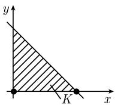

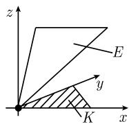  
(b)  
图 5.26 克赖因-米尔曼定理

对于平面容许域的图像解法 画水平线

$$
F (x, y) = c,
$$

并让 $c$ 越来越小; 然后我们确定使得水平线离开容许域的 $c$ 的值. 例3: 在(5.84)和(5.85)中, 我们要考虑水平线 $x + y = c$ (图5.27). 几何复杂性

(i) 如果容许集是空的(这是可能发生的), 则根本就没有解.
例 4: 平面中没有点 $(x, y)$ 满足 y = -1, 并且 $x \geqslant 0, y \geqslant 0$ (图 5.28).

(ii) 如果容许域无界(这也可以发生), 则可能有解, 也可能没有解.

例 5: 问题

$$
\begin{array}{l} {- x \stackrel {!} {=} \min,} \\ {0 \leqslant y \leqslant 1, x \geqslant 0} \end{array}
$$

的容许域 K 是图 5.29 中画出的带条纹的区域. 这个问题没有解. 另一方面, 问题

$$
\begin{array}{l} {y \stackrel {!} {=} \min,} \\ {0 \leqslant y \leqslant 1, x \geqslant 0} \end{array}
$$

在同样的容许域中则有解 (例如 $(0,0)$ ).

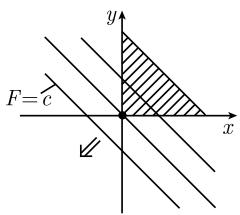  
图5.27

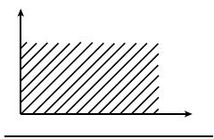  
图5.28

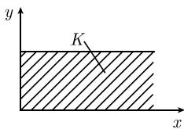  
图5.29

(iii) 发生几何上降秩的情形下的容许域.

在非降秩情形, 顶点 $P$ 是 $\mathbb{R}^n$ 中 (恰好) $n$ 个超平面的交点. 降秩情形则是多于 $n$ 个超平面在 $P$ 相交.

扰动 通过小扰动法可以把降秩情形转化成非降秩情形.

单形法可能在降秩情形失效.

例 6: 在图 5.30(a) 中, P 是一降秩顶点, 因为有三条直线在此处相交. 图 5.30(b) 则表明如何通过小扰动达到解决问题.

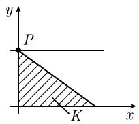  
(a) 降秩

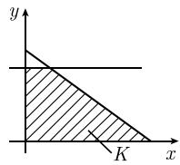  
(b) 非降秩  
图5.30 扰动降秩顶点

##### 5.5.2 一般线性最优化问题

利用矩阵记号, 一般线性最优化问题可以表示成如下方程组:

$$
\boxed { \begin{array}{l} \boldsymbol {p} ^ {\mathrm{T}} \boldsymbol {x} + \boldsymbol {q} ^ {\mathrm{T}} \boldsymbol {y} \stackrel {!} {=} \min, \\ \boldsymbol {A x} + \boldsymbol {B y} = \boldsymbol {b}, \\ \boldsymbol {C x} + \boldsymbol {D y} \geqslant \boldsymbol {c}, \\ \boldsymbol {x} \geqslant \boldsymbol {0}. \end{array} }\tag{5.86}
$$

向量 x 和 y 待定.

利用坐标显式地写出来, 这些方程为

$$
\begin{array}{c c c c c c c} p _ {1} x _ {1} & + \dots + & p _ {n} x _ {n} & + & q _ {1} y _ {1} & + \dots & + q _ {r} y _ {r} \stackrel {!} {=} \min, \\ a _ {1 1} x _ {1} & + \dots + & a _ {1 n} x _ {n} & + & b _ {1 1} y _ {1} & + \dots & + b _ {1 r} y _ {r} = b _ {1}, \\ \vdots & & \vdots & \vdots & & \vdots & \vdots \\ a _ {m 1} x _ {1} & + \dots + & a _ {m n} x _ {n} & + & b _ {m 1} y _ {1} & + \dots & + b _ {m r} y _ {r} = b _ {m}, \\ c _ {1 1} x _ {1} & + \dots + & c _ {1 n} x _ {n} & + & d _ {1 1} y _ {1} & + \dots & + d _ {1 r} y _ {r} \geqslant c _ {1}, \\ \vdots & & \vdots & \vdots & & \vdots & \vdots \\ c _ {k 1} x _ {1} & + \dots + & c _ {k n} x _ {n} & + & d _ {k 1} y _ {1} & + \dots & + d _ {k r} y _ {r} \geqslant c _ {k}, \\ x _ {1} \geqslant 0, \dots , x _ {0} \geqslant 0. \end{array}
$$

实数 $x_{1},\cdots,x_{n}$ 和 $y_{1},\cdots,y_{r}$ 待定.

为了单形法的公式化, 过渡到标准形较方便.

LOP 型问题 术语 LOP 用来表示如下形式的线性最优化问题:

$$
\boxed { \begin{array}{l} \boldsymbol {p} ^ {\mathrm{T}} \boldsymbol {x} \stackrel {!} {=} \min, \\ \boldsymbol {A} \boldsymbol {x} = \boldsymbol {b}, \\ \boldsymbol {x} \geqslant \mathbf {0}. \end{array} }\tag{5.87}
$$

我们假定 $b \geqslant 0$ ，并且 $m \times n$ 矩阵 A 的秩等于 m, m < n.

容许域 (5.87) 的容许域 $K$ 是集合

$$
K = \{\boldsymbol {x} \in \mathbb {R} ^ {n}: \boldsymbol {A x} = \boldsymbol {b}, \boldsymbol {x} \geqslant \boldsymbol {0} \}.\tag{5.88}
$$

于是 K 是第一象限与 m 个线性独立的超平面之交 $(m < n)$ .

例 1: 图 5.31 表示在平面情形 n = 2 时容许域的一些可能性.

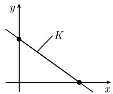

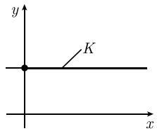  
图 5.31 LOP 型问题的容许域

化成形式 (5.87) 必要的话, 通过引入几个新的变量, 每一个线性最优化问题都可以化成 LOP 型问题.

(i) 若 $b_{j} \leqslant 0$ , 则我们用 $(-1)$ 乘以相应的行.

(ii) 通过引入以新的变量 z, 不等式可以变成等式.

例 2: 把不等式 $x + y \leqslant 1$ 变成等式 $x + y + z = 1$ ，这里假定 $z \geqslant 0$ .

(iii) 如果 $x \geqslant 0$ , 则令 $x = y - z, y \geqslant 0, z \geqslant 0$ , 这里 $y$ 和 $z$ 是新变量.

把问题表达成 LOP 形式的优点是我们很容易刻画容许域 K 的顶点. 为此我们写 $\boldsymbol{A} = (\boldsymbol{a}_{1}, \cdots, \boldsymbol{a}_{n})$ ，这里 $a_{j}$ 表示 A 的第 j 列.

顶点定理 点 $\boldsymbol{x}=(x_{1},\cdots,x_{n})^{\mathrm{T}}$ 是 K 的顶点当且仅当如下条件成立：

(i) x 是方程组 Ax = b 的解.

(ii) 所有分量 $x_{j}$ 非负.

(iii) A 的属于正分量 $x_{j}$ 的列 $a_{j}$ 都是线性独立的.

如果问题 (5.87) 可解, 那么 $K$ 的顶点是其解.

定义 $K$ 的一顶点称为非降秩顶点, 是指它有最大正分量数, 即其正分量数为 $m$ . 基 顶点 $\pmb{x}$ 的基是指 $\pmb{A}$ 的 $m$ 个线性独立的一组列向量, 它包含所有属于正分量 $x_{j}$ 的列向量.

任意非降秩的顶点都有唯一确定的基.

例 3: 对于容许域

$$
K: \quad x + y + z = 1, \quad x \geqslant 0, y \geqslant 0, z \geqslant 0,
$$

我们有 $\boldsymbol{A}=(1,1,1)$ ，并且 $m=\operatorname{rank}\boldsymbol{A}=1$ 。三个顶点 $(1,0,0)$ ， $(0,1,0)$ 和 $(0,0,1)$ 是非降秩的（图 5.32(a))。

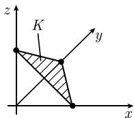  
(a) 非降秩顶点

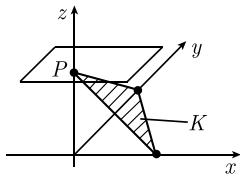  
(b) 降秩顶点  
图 5.32 容许域的顶点

例 4: 对于容许域

$$
K: \quad x + y + z = 1, \quad z = 1, x \geqslant 0, y \geqslant 0, z \geqslant 0,
$$

我们有

$$
\boldsymbol {A} = \left( \begin{array}{c c c} 1 & 1 & 1 \\ 0 & 0 & 1 \end{array} \right),
$$

于是 $m = \operatorname{rank} A = 2$ . 顶点 $P = (0, 0, 1)$ 是非降秩的 (图5.32(b)).

##### 5.5.3 最优化问题的标准形式和最小试验

定义 线性最优化问题称为标准形的, 是指它具有如下形式:

$$
\boxed { \begin{array}{l} p _ {1} x _ {1} + \dots + p _ {m} x _ {m} + c \stackrel {!} {=} \min, \\ a _ {1 1} x _ {1} + \dots + a _ {1, n - m} x _ {n - m} = b _ {1} - x _ {n - m + 1}, \\ a _ {2 1} x _ {1} + \dots + a _ {2, n - m} x _ {n - m} = b _ {2} - x _ {n - m + 2}, \\ \dots \dots \\ a _ {m 1} x _ {1} + \dots + a _ {m, n - m} x _ {n - m} = b _ {m} - x _ {n}, \\ x _ {1} \geqslant 0, \dots , x _ {n} \geqslant 0. \end{array} }\tag{5.89}
$$

此外, 我们假定对于所有 $j, b_{j} \geqslant 0$ .

例 1: 问题

$$
\boxed { \begin{array}{l} x _ {1} + a x _ {2} + c \stackrel {!} {=} \min, \\ x _ {1} + 2 x _ {2} = 3 - x _ {3}, \\ 3 x _ {1} + 4 x _ {2} = 5 - x _ {4} \end{array} }\tag{5.90}
$$

是一标准形线性最优化问题. 变量 $x_{1}, x_{2}$ 是非基变量, 而 $x_{3}, x_{4}$ 是基变量. 这种标准形的一大优点是从表达式直接可以看出解的特性.

最小试验 (i) 如果对于所有 $j, p_j \geqslant 0$ , 那么

$$
\boxed {x _ {1} = x _ {2} = \dots = x _ {m} = 0, \quad x _ {n - m + 1} = b _ {1}, \dots , x _ {n} = b _ {m}}\tag{5.91}
$$

是 (5.89) 在 $c$ 为最小值下的解. 这个解称为基解, 并表示容许域的一个顶点.

如果对于所有 j, $p_{j} > 0$ , 那么 (5.91) 是 (5.89) 的唯一解.

(ii) 如果存在一 (列) 指数 $j$ , 使得 $p_j < 0$ , 并且对于所有的 (行) 指数 $i$ , 有 $a_{ij} > 0$ , 则问题 (5.89) 无解.

替换 如果这两种情形都不发生, 那么单形法就过渡至一新的标准形. 为此, 我们选择一适当的基变量 $x_{j}$ 和一适当的非基变量 $x_{k}$ , 并作变量替换, 即把 $x_{j}$ 变成一非基变量, 而把 $x_{k}$ 变成一基变量. 然后我们可以将最小试验应用于这一新的标准形. 退化情形 有可能这一过程永远不会结束, 因为可能出现一种 (非常的) 退化情形. 在这种情形下, 对原问题作一小扰动就得到非退化情形. 为此, 只要对某个 $i$ , 用 $b_{i} + \varepsilon$ 代替 $b_{i}$ , 这里 $\varepsilon$ 为一充分小的正数. 一旦得到这个非退化问题的解, 令 $\varepsilon = 0$ 就可以得到原问题的解.

##### 5.5.4 单形法

为了有一种方便的方法进行单形法的计算, 可使用所谓的单形表. 对于标准形

(5.89), 这一格式如下:

<table><tr><td></td><td> $x_{1}$ </td><td> $x_{2}$ </td><td> $\cdots$ </td><td> $x_{n-m}$ </td><td></td></tr><tr><td> $x_{n-m+1}$ </td><td> $a_{11}$ </td><td> $a_{12}$ </td><td> $\cdots$ </td><td> $a_{1,n-m}$ </td><td> $b_{1}$ </td></tr><tr><td> $x_{n-m+2}$ </td><td> $a_{21}$ </td><td> $a_{22}$ </td><td> $\cdots$ </td><td> $a_{2,n-m}$ </td><td> $b_{2}$ </td></tr><tr><td> $\vdots$ </td><td> $\vdots$ </td><td> $\vdots$ </td><td></td><td> $\vdots$ </td><td> $\vdots$ </td></tr><tr><td> $x_{n}$ </td><td> $a_{m1}$ </td><td> $a_{m2}$ </td><td> $\cdots$ </td><td> $a_{m,n-m}$ </td><td> $b_{m}$ </td></tr><tr><td></td><td> $p_{1}$ </td><td> $p_{2}$ </td><td> $\cdots$ </td><td> $p_{n-m}$ </td><td> $c$ </td></tr></table>

(5.92)

在第一行中排列非基本变量, 而在第一列中排列基本变量.

对于 (5.90), 单形表是

<table><tr><td></td><td> $x_1$ </td><td> $x_2$ </td><td></td></tr><tr><td> $x_3$ </td><td>1</td><td>2</td><td>3</td></tr><tr><td> $x_4$ </td><td>3</td><td>4</td><td>5</td></tr><tr><td></td><td>1</td><td>a</td><td>c</td></tr></table>

(5.93)

具体计算时, 右边的形式更方便些, 这里向量 $x_{j}$ 用标号 j 代替.

##### 5.5.5 最小试验

现在将 5.5.3 的最小试验应用于单形表.

例: 考虑表 (5.93).

情形 1: 如果 $a \geqslant 0$ , 则根据最小试验问题 (5.90) 有解

$$
x _ {1} = x _ {2} = 0, \quad x _ {3} = 3, \quad x _ {4} = 5,
$$

并且 c 是希望极小化的函数的最小值.

情形 2: 如果 a < 0, 则我们需要对单形法作变量替换.

替换: 我们将表 (5.92) 中所有的量用质化后的量代替得到如下新的表:

$$
\begin{array}{c c c c c c} & x _ {1} ^ {\prime} & x _ {2} ^ {\prime} & \dots & x _ {n - m} ^ {\prime} \\ \hline x _ {n - m + 1} ^ {\prime} & a _ {1 1} ^ {\prime} & a _ {1 2} ^ {\prime} & \dots & a _ {1, n - m} ^ {\prime} & b _ {1} ^ {\prime} \\ x _ {n - m + 2} ^ {\prime} & a _ {2 1} ^ {\prime} & a _ {2 2} ^ {\prime} & \dots & a _ {2, n - m} ^ {\prime} & b _ {2} ^ {\prime} \\ \vdots & \vdots & \vdots & & \vdots & \vdots \\ x _ {n} ^ {\prime} & a _ {m 1} ^ {\prime} & a _ {m 2} ^ {\prime} & \dots & a _ {m, n - m} ^ {\prime} & b _ {m} ^ {\prime} \\ \hline & p _ {1} ^ {\prime} & p _ {2} ^ {\prime} & \dots & p _ {n - m} ^ {\prime} & c ^ {\prime} \end{array}\tag{5.94}
$$

主列 我们在 (5.92) 最后一行中选最小的 $p_{j}$ ，其所在的列数记作 s。依据定义，表 (5.92) 中由 $a_{is}, i = 1, 2, \cdots$ 组成的列称为主列。

情形 1: 主列的所有元都非正. 那么给定的最优化问题无解.

情形 2: 情形 1 不出现, 则我们进行如下步骤.

主行 对于主列中的所有正元 $a_{is}$ ，作商

$$
\frac {b _ {i}}{a _ {i s}}.
$$

现在将对应于上述商最小的列 $z$ (若这样的列不是唯一的, 则从中任取一列), 称之为主行.

主元 称 $a_{zs}$ 为主元, 并令

$$
\boxed {\alpha := \frac {1}{a _ {z s}}.}
$$

变量替换 作替换

$$
\boxed {x _ {z} ^ {\prime} = x _ {s}, \quad x _ {s} ^ {\prime} = x _ {z}.}
$$

其余所有变量保持不变. 下面假定 $i \neq z, j \neq s$ .

新主行

$$
\boxed {a _ {z s} ^ {\prime} = \alpha , \quad a _ {z j} ^ {\prime} = a _ {z j} \alpha , \quad b _ {z} ^ {\prime} = b _ {z} \alpha .}
$$

新主列

$$
\boxed {a _ {i s} ^ {\prime} = - a _ {i s} \alpha , \quad p _ {s} ^ {\prime} = - p _ {s} \alpha .}
$$

其余行和列

$$
\boxed { \begin{array}{c c} a _ {i j} ^ {\prime} = a _ {i j} - a _ {z j} ^ {\prime} a _ {i s}, & p _ {j} ^ {\prime} = p _ {j} - a _ {z j} ^ {\prime} p _ {s}, \\ c ^ {\prime} = c + b _ {z} ^ {\prime} p _ {s}, & b _ {i} ^ {\prime} = b _ {i} - b _ {z} ^ {\prime} a _ {i s}. \end{array} }
$$

5.5.5.1 一个例子

对于典范形式下的问题

$$
\begin{array}{r l r} 4 x _ {1} - 6 x _ {2} + 9 x _ {3} + 6 6 & \stackrel {!} {=} \min, \\ 2 x _ {1} - x _ {2} + 3 x _ {3} & = 1 - x _ {4}, \\ 3 x _ {3} & = 2 - x _ {5}, \\ 2 x _ {1} & = 6 - x _ {6}, \\ x _ {2} & = 6 - x _ {7}, \\ - 2 x _ {1} + x _ {2} - 3 x _ {3} & = 2 - x _ {8}, \\ x _ {1} \geqslant 0, \dots , x _ {8} \geqslant 0, \end{array}\tag{5.95}
$$

我们得到单形表

<table><tr><td></td><td>1</td><td>2</td><td>3</td><td></td></tr><tr><td>4</td><td>2</td><td>-1</td><td>3</td><td>1</td></tr><tr><td>5</td><td>0</td><td>0</td><td>3</td><td>2</td></tr><tr><td>6</td><td>2</td><td>0</td><td>0</td><td>6</td></tr><tr><td>7</td><td>0</td><td>1</td><td>0</td><td>6</td></tr><tr><td>8</td><td>-2</td><td> $\boxed{1}$ </td><td>-3</td><td>2</td></tr><tr><td></td><td>4</td><td>-6</td><td>9</td><td>66</td></tr></table>

这里主元带方框. $(x_{2}$ 和 $x_{8}$ 的) 第一个替换是

<table><tr><td></td><td>1</td><td>8</td><td>3</td><td></td></tr><tr><td>4</td><td>2</td><td>1</td><td>0</td><td>3</td></tr><tr><td>5</td><td>0</td><td>0</td><td>3</td><td>2</td></tr><tr><td>6</td><td>2</td><td>0</td><td>0</td><td>6</td></tr><tr><td>7</td><td>2</td><td>-1</td><td>3</td><td>4</td></tr><tr><td>2</td><td>-2</td><td>1</td><td>-3</td><td>2</td></tr><tr><td></td><td>-8</td><td>6</td><td>-9</td><td>54</td></tr></table>

这里替换的元加上了圆圈. 在最后一行中, 所有系数 $p_{j}$ 并非全正, 从而我们要继续作替换,

<table><tr><td></td><td>1</td><td>8</td><td>5</td><td></td></tr><tr><td>4</td><td>0</td><td>1</td><td>0</td><td>3</td></tr><tr><td>3</td><td>0</td><td>0</td><td> $1/3$ </td><td> $2/3$ </td></tr><tr><td>6</td><td>2</td><td>0</td><td>0</td><td>6</td></tr><tr><td>7</td><td> $\boxed{2}$ </td><td>-1</td><td>-1</td><td>2</td></tr><tr><td>2</td><td>-2</td><td>1</td><td>1</td><td>4</td></tr><tr><td></td><td>-8</td><td>6</td><td>3</td><td>48</td></tr></table>

<table><tr><td></td><td> $7$ </td><td>8</td><td>5</td><td></td></tr><tr><td>4</td><td>0</td><td>1</td><td>0</td><td>3</td></tr><tr><td>3</td><td>0</td><td>0</td><td> $\boxed{1/3}$ </td><td>2/3</td></tr><tr><td>6</td><td>-1</td><td>1</td><td>1</td><td>4</td></tr><tr><td> $1$ </td><td>1/2</td><td>-1/2</td><td>-1/2</td><td>1</td></tr><tr><td>2</td><td>1</td><td>0</td><td>0</td><td>6</td></tr><tr><td></td><td>4</td><td>2</td><td>-1</td><td>40</td></tr></table>

直至最后我们得到如下的表

<table><tr><td></td><td>7</td><td>8</td><td>3</td><td></td></tr><tr><td>4</td><td>0</td><td>1</td><td>0</td><td>3</td></tr><tr><td>5</td><td>1</td><td>0</td><td>3</td><td>2</td></tr><tr><td>6</td><td>-1</td><td>1</td><td>-3</td><td>2</td></tr><tr><td>1</td><td> $1/2$ </td><td> $-1/2$ </td><td> $2/3$ </td><td>2</td></tr><tr><td>2</td><td>1</td><td>0</td><td>0</td><td>6</td></tr><tr><td></td><td>4</td><td>2</td><td>3</td><td>38</td></tr></table>

(5.96)

这里所有的量 $p_{j} \geqslant 0$ (最后一行).

解：(5.96)的第一行包含基变量的指数. 根据最小测试结果, 我们从 (5.96) 读出基本解

$$
\left| x _ {4} = 3, x _ {5} = 2, x _ {6} = 2, x _ {1} = 2, x _ {2} = 6 \text {和} x _ {7} = x _ {8} = x _ {3} = 0. \right.
$$

在 (5.96) 的右下角则是我们所希望极小化的函数的最小值, 即 38.

##### 5.5.6 标准形式的获得

使用初始顶点 我们首先假定已知容许域 $K$ 的一个顶点. 然后我们总可以按如下方式产生标准形式.

我们选择属于顶点 x 的一组基. 在重新编号后, 我们可以假定这组基由 A 的列 $a_{n-m+1}, \cdots, a_{n}$ 组成. 方程 Ax = b 对应于方程

$$
\pmb {a} _ {1} x _ {1} + \dots + \pmb {a} _ {n - m} x _ {n - m} + \pmb {a} _ {n - m + 1} x _ {n - m + 1} + \dots + \pmb {a} _ {n} x _ {n} = \pmb {b}.\tag{5.97}
$$

我们可以对基变量 $x_{n-m+1}, \cdots, x_{n}$ 求解这一方程, 由此即得问题的标准形式.
计算初始顶点 假定我们给定 LOP 型问题

$$
\begin{array}{l} F (\boldsymbol {x}) \stackrel {{!}} {{=}} \min, \\ A \boldsymbol {x} = \boldsymbol {b}, \quad \boldsymbol {x} \geqslant \mathbf {0}. \end{array}\tag{5.98}
$$

引入附加变量 $x_{n+1}, \cdots, x_{n+m}$ ，并考虑辅助问题

$$
\begin{array}{l} x _ {n + 1} + \dots + x _ {n + m} \stackrel {!} {=} \min, \\ a _ {1 1} x _ {1} + \dots + a _ {1 n} x _ {n} = b _ {1} - x _ {n + 1}, \\ a _ {m 1} x _ {1} + \dots + a _ {m n} x _ {n} = b _ {m} - x _ {n + m}, \\ x _ {1} \geqslant 0, \dots , x _ {n + m} \geqslant 0, \end{array}\tag{5.99}
$$

显然, 这已经是一标准形式了.

定理 如果 (5.98) 的容许域非空, 那么 (5.99) 的每一个解都具有形式

$$
(x _ {1}, \dots , x _ {n}, 0, \dots , 0),
$$

并且是 (5.98) 的一个顶点.

如果辅助问题 (5.99) 有正极小值的解, 那么原问题 (5.98) 的容许域是空的. 标准形式 给定 LOP 型问题 (5.98).

(i) 对于辅助问题 (5.99) 应用单形法, 并得到 (5.98) 的一个顶点 x.

(ii) 选择属于 x 的一组基, 然后从 (5.97) 得到标准形式.

##### 5.5.7 线性最优化中的对偶性

除了对于 $(\pmb {x},\pmb{y})$ 的原问题

$$
\boxed { \begin{array}{l} \boldsymbol {p} ^ {\mathrm{T}} \boldsymbol {x} + \boldsymbol {q} ^ {\mathrm{T}} \boldsymbol {y} \stackrel {!} {=} \min, \\ \boldsymbol {A x} + \boldsymbol {B y} = \boldsymbol {b}, \\ \boldsymbol {C x} + \boldsymbol {D y} \geqslant \boldsymbol {c}, \\ \boldsymbol {x} \geqslant \boldsymbol {0}, \end{array} }\tag{5.100}
$$

还考虑对于 $(u,v)$ 的对偶问题

$$
\boxed { \begin{array}{l} \boldsymbol {c} ^ {\mathrm{T}} \boldsymbol {u} + \boldsymbol {b} ^ {\mathrm{T}} \boldsymbol {v} \stackrel {!} {=} \max, \\ \boldsymbol {D} ^ {\mathrm{T}} \boldsymbol {u} + \boldsymbol {B} ^ {\mathrm{T}} \boldsymbol {v} = \boldsymbol {q}, \\ \boldsymbol {C} ^ {\mathrm{T}} \boldsymbol {u} + \boldsymbol {A} ^ {\mathrm{T}} \boldsymbol {v} \leqslant \boldsymbol {p}, \\ \boldsymbol {u} \geqslant \boldsymbol {0}. \end{array} }\tag{5.101}
$$

定理 (i) 如果这两个问题中一个可解, 则另一个也可解, 并且函数的极值相同 (?).

(ii) 再作一次对偶又回到原问题.

解的充分必要条件 我们假定 $(\pmb{x},\pmb{y})$ 和 $(\pmb{u},\pmb{v})$ 分别满足(5.100)和(5.101)的约束,那么下列两个命题等价：

(a) $(x,y)$ 是(5.100)的解,而 $(u,v)$ 是(5.101)的解,

(b) 我们有

$$
\boxed {\boldsymbol {u} ^ {\mathrm{T}} (\boldsymbol {C x} + \boldsymbol {D y} - \boldsymbol {c}) = \boldsymbol {0}, \quad \boldsymbol {x} (\boldsymbol {C} ^ {\mathrm{T}} \boldsymbol {u} - \boldsymbol {A} ^ {\mathrm{T}} \boldsymbol {v} - \boldsymbol {p}) = \boldsymbol {0}.}\tag{5.102}
$$

例:

的对偶问题是

$$
\begin{array}{l} \boldsymbol {p} ^ {\mathrm{T}} \boldsymbol {x} \stackrel {{!}} {{=}} \min, \\ C \boldsymbol {x} \geqslant \boldsymbol {c}, \quad \boldsymbol {x} \geqslant \boldsymbol {0} \\ \boldsymbol {c} ^ {\mathrm{T}} \boldsymbol {u} \stackrel {{!}} {{=}} \max, \\ C ^ {\mathrm{T}} \boldsymbol {u} \leqslant \boldsymbol {p}, \quad \boldsymbol {u} \geqslant \boldsymbol {0}. \end{array}
$$

如果 $p \geqslant 0$ ，那么通过如 5.5.2 那样引入新变量，对偶问题可以直接变成标准形式.

##### 5.5.8 单形法的修改

单形法有一些比较经典且方便的节省计算量的修改方案, 这里列出如下两种:

(i) 修正单形法,

(ii) 对偶单形法.

在 (i) 中使用基的倒换. 在大系统 (即很多变量) 情形, 这可以使得在所要求的计算步数内大大减少计算量, 并可以大幅提高精度.

在 (ii) 中使用对偶问题的结构. 我们计算对偶问题的非退化解, 并通过 (5.102) 得到一组线性方程, 其解就是原问题的解.

如果对偶问题包含的约束数比原问题的少, 或者对偶问题可以比较容易地化成标准形, 则我们就使用对偶问题.
