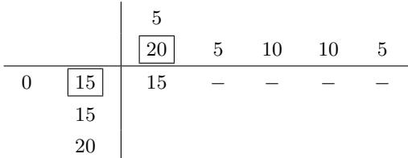
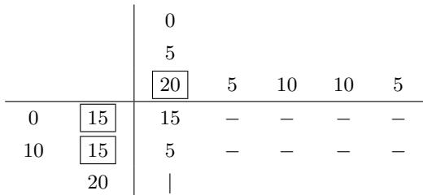
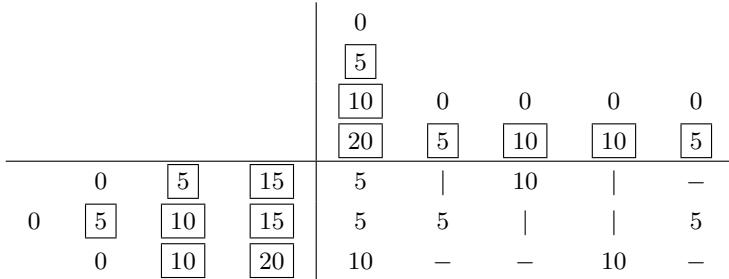
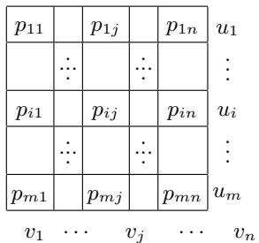
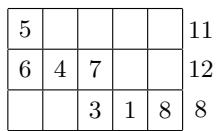
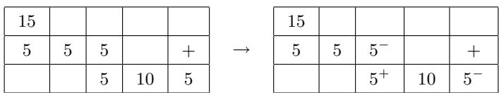
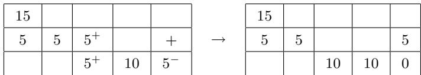
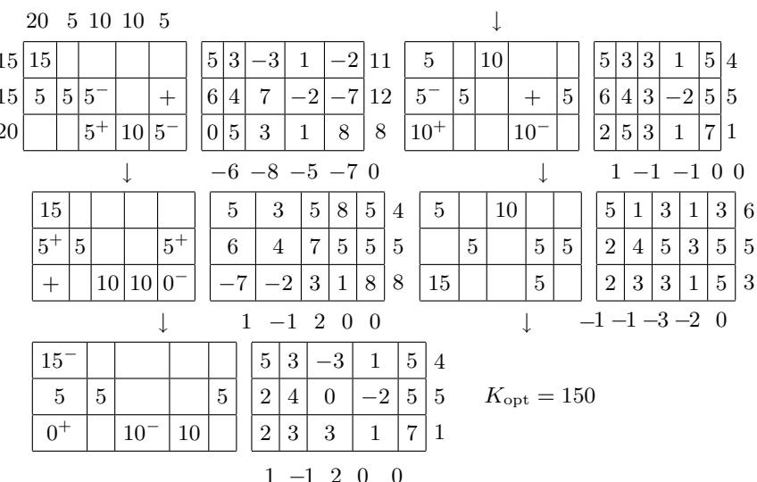

#### 5.6 线性最优化的应用

自然发生的大量的问题可以化成线性最优化问题. 下面用几个典型的例子予以说明. $^{1)}$

##### 5.6.1 容量利用问题

例：假定我们生产4种产品 $A_{i}$ ，其产量在 $a_{i}$ 和 $b_{i}$ 之间，单价为 $p_i, i = 1,2,3,4$ 。每一种产品 $A_{i}$ 需要在三台机器 $M_{j}$ 上工作 $a_{ij}$ 分钟， $j = 1,2,3$ ，机器 $M_{j}$ 的使用时间在 $n_j$ 和 $m_j$ 分钟之间。目的是要找出代价最小的生产规划。

变量 $x_{i}$ ：设 $x_{i}$ 是生产产品 $A_{i}$ 的件数.

数学模型:

$$
\boxed { \begin{array}{c} p _ {1} x _ {1} + p _ {2} x _ {2} + p _ {3} x _ {3} + p _ {4} x _ {4} \stackrel {!} {=} \min, \\ a _ {1 j} x _ {1} + a _ {2 j} x _ {2} + a _ {3 j} x _ {3} + a _ {4 j} x _ {4} \leqslant m _ {j}, \quad j = 1, 2, 3, \\ a _ {1 j} x _ {1} + a _ {2 j} x _ {2} + a _ {3 j} x _ {3} + a _ {4 j} x _ {4} \geqslant n _ {j}, \quad j = 1, 2, 3, \\ x _ {i} \leqslant b _ {i}, x _ {i} \geqslant a _ {i}, x _ {i} \geqslant 0, \qquad i = 1, 2, 3, 4. \end{array} }
$$

变式: 设 $p_{j}$ 表示利润而不是成本, 这就变成最大化问题.

<table><tr><td> $A_i$ </td><td> $M_i$ </td></tr><tr><td>农业单位</td><td>劳动力, 机器</td></tr><tr><td>畜禽品种</td><td>劳动力, 畜舍, 饲料</td></tr></table>

1) 本节相当程度上参考了 [354] 的 6.2 和 6.3 节.

##### 5.6.2 混合问题

例: 我们有三种金属原料 $M_{i}$ ，相应的密度为 $a_{i1}$ ，碳含量为 $a_{i2}$ ，黄磷含量为 $a_{i3}$ 。我们打算把它们混合起来制成一种合金，要求每种金属原料的用量在 $a_{i}$ 和 $b_{i}$ 之间。每种金属原料的价格是每千克 $p_{i}$ 元，并且要求合金的密度在 $n_{1}$ 和 $m_{1}$ 之间，碳含量在 $n_{2}$ 和 $m_{2}$ 之间，磷含量在 $n_{3}$ 和 $m_{3}$ 之间。总的产量应是 c 千克，成本应最小。变量 $x_{j}$ ：第 j 种金属原料的千克数。

数学模型:

$$
\boxed { \begin{array}{l} p _ {1} x _ {1} + p _ {2} x _ {2} + p _ {3} x _ {3} \stackrel {!} {=} \min, \\ a _ {1 j} x _ {1} + a _ {2 j} x _ {2} + a _ {3 j} x _ {3} \leqslant m _ {j}, \\ a _ {1 j} x _ {1} + a _ {2 j} x _ {2} + a _ {3 j} x _ {3} \geqslant n _ {j}, \\ c x _ {j} \leqslant b _ {j}, c x _ {j} \geqslant a _ {j}, x _ {j} \geqslant 0, \quad j = 1, 2, 3. \end{array} }
$$

其他例子:

<table><tr><td> $M_{i}$ </td><td> $a_{ij}$ </td></tr><tr><td>饲料</td><td>营养值,有害物质含量,</td></tr><tr><td>天然气</td><td>热值,硫和尘埃含量</td></tr><tr><td>各种大头菜</td><td>叶和根的产量</td></tr></table>

##### 5.6.3 资源或产品的分配问题

例：我们打算生产 $m$ 种产品 $P_{j}$ ，产量为 $a_{j}$ 。我们有 $n$ 台机器 $M_{i}$ 进行生产，每台机器工作时间为 $b_{i}$ 分钟。 $\mathbf{P}_{j}$ 的每一件产品可以在任何一台机器 $M_{i}$ 上进行生产，需要花费 $c_{ij}$ 分钟和 $p_{ij}$ 元钱。目的是确定最优生产规划，以使代价最小。

变量 $x_{ij}$ ：在机器 $M_{i}$ 上生产的产品 $P_{j}$ 的数量.

数学模型:

$$
\boxed { \begin{array}{l} \sum_ {i = 1} ^ {n} \sum_ {j = 1} ^ {m} p _ {i j} x _ {i j} \stackrel {!} {=} \min, \\ \sum_ {i = 1} ^ {n} x _ {i j} = a _ {j}, j = 1, \dots , m; \sum_ {j = 1} ^ {m} c _ {i j} x _ {i j} \leqslant b _ {i}, i = 1, \dots , n; \\ x _ {i j} \geqslant 0, \quad \forall (i, j). \end{array} }\tag{M}
$$

变式: 使得机器所用时间总量最小.

我们选择模型 (M), 其待极小的函数 $F$ 为 $F := \sum_{i=1}^{n} \sum_{j=1}^{m} p_{ij} x_{ij}$ .

例 1:

<table><tr><td> $P_{j}$ </td><td> $M_{i}$ </td><td> $c_{ij}$ </td><td> $p_{ij}$ </td><td>目的</td></tr><tr><td>农业单位</td><td>土地</td><td>成本</td><td>收入</td><td>最大!</td></tr><tr><td>工厂</td><td>能量供给</td><td>成本</td><td>利用程度</td><td>最大!</td></tr><tr><td>产品</td><td>工厂</td><td>成本</td><td>利润</td><td>最大!</td></tr></table>

例 2:

<table><tr><td> $P_{j}$ </td><td> $M_{i}$ </td><td> $p_{ij}$ </td><td>目的</td></tr><tr><td> $m$ 个产品</td><td> $n$ 个工厂</td><td>生产成本</td><td>最小!</td></tr><tr><td> $m$ 个待建工厂</td><td> $n$ 个地点</td><td>建造成本</td><td>最小!</td></tr><tr><td> $m$ 列待编火车</td><td> $n$ 条铁路线</td><td>调度运转</td><td>最小!</td></tr><tr><td> $m$ 个任务</td><td> $n$ 个工人</td><td>花费时间</td><td>最小!</td></tr></table>

##### 5.6.4 设计问题和轮班计划

例 1: 对于以长为 l 的细长棒形式交付的原材料, 有 $Z_{i}$ 个设计变式 $Z_{i}, i = 1, \cdots, 6$ , 以生产如下订单: 长 $l_{j}$ 的部件 $T_{j}$ 为 $a_{j}$ 个, j = 1, 2, 3, 4. 对于设计变式 $Z_{i}$ , 所生产的部件 $T_{j}$ 的数目是 $k_{ij}$ . 订单应该用最少数量细长棒进行生产.

变量 $x_{i}$ ：应用变式 $Z_{i}$ 所需要的细长棒数量.

数学模型:

$$
\begin{array}{l} x _ {1} + x _ {2} + x _ {3} + x _ {4} + x _ {5} + x _ {6} \stackrel {!} {=} \min, \\ k _ {1 j} x _ {1} + k _ {2 j} x _ {2} + k _ {3 j} x _ {3} + k _ {4 j} x _ {4} + k _ {5 j} x _ {5} + k _ {6 j} x _ {6} \geqslant a _ {j}, \quad j = 1, \dots , 4; \\ x _ {i} \geqslant 0, \quad i = 1, \dots , 6. \end{array}
$$

注 通过引进新的变量并用 -1 乘方程, 我们直接得到对偶-容许标准形式, 从而单形法有意义.

更多的例子:

<table><tr><td>原材料</td><td> $T_j$ </td></tr><tr><td>胶合板块</td><td>切割板块</td></tr><tr><td>绕在滚筒上 L米长的材料或宽 l 的金属薄板</td><td>较小块材料或宽  $l_j$  的细长金属薄板</td></tr></table>

推出图书馆、售票店等的轮班计划都可以用同样的方法进行建模. 设 $Z_{i}$ 是一天中的各种轮班, $T_{j}$ 为一天的某些时刻, 而若在 $T_{j}$ 轮班 $Z_{i}$ 是主动轮班的, 则 $k_{ij} = 1$ , 否则 $k_{ij} = 0$ . 此外, 设 $a_{j}$ 是在 $T_{j}$ 时刻主动轮班的工人数, 而 $x_{i}$ 则表示轮班 $Z_{i}$ 中的那些工人.

在 $a_{j} = 1, k_{ij} = 0,1$ 的特殊情形下, 会发生某些超出 (整数) 范围的问题, 这就需要用整线性最优化方法来讨论.

例 2: 设想有 6 个建设水电厂的地点 $Z_{i}$ ，每一地点都供给 4 个镇区 $T_{j}$ 中的几个；如果 $Z_{i}$ 供给 $T_{j}$ ，则 $k_{ij}=1$ ，否则 $k_{ij}=0$ 。通过建造尽可能少的电厂，使得 4 个镇区 $T_{j}$ 中的每一个至少有一个电厂供给。

变量: 若电厂建在 $Z_{i}$ . 则设 $x_{i}=1$ , 否则 $x_{i}=0$ .

数学模型：我们选择设计模型时，取 $a_{1}=a_{2}=a_{3}=a_{4}=1$ ，以及附加约束条件 $x_{i}=0$ 或 $x_{i}=1, i=1,\cdots,6$ .

变式: 在 $Z_{i}$ 建造电厂的成本是 $p_{i}$ ; 目标是使得成本最小, 同时确保所有镇区供电. 于是待极小的函数是

$$
p _ {1} x _ {1} + p _ {2} x _ {2} + p _ {3} x _ {3} + p _ {4} x _ {4} + p _ {5} x _ {5} + p _ {6} x _ {6}.
$$

我们也可以要求 n 个电厂供电, 这时就要满足条件 $a_{i}=n$ .

更多的例子:

<table><tr><td> $Z_{i}$ </td><td> $T_{j}$ </td></tr><tr><td>交通信号灯变换周期</td><td>待调节的交通流量</td></tr><tr><td>探险申请人</td><td>需要提供的服务 (医疗、网络、语言····)</td></tr></table>

##### 5.6.5 线性运输问题

线性运输问题是具有特殊结构的线性最优化问题. 因此利用单形法的特殊变种来处理这些问题特别有效, 并将其恰当地称为运输算法.

问题的提法 我们寻找

$$
\begin{array}{l} {{ \begin{array}{l} {{\text {从} m \text {个仓库} (\text {编号为} i = 1, \dots , m)}} \\ {{\text {到} n \text {个顾客} (\text {编号为} j = 1, \dots , n),}} \end{array} }} \end{array}
$$

运输产品的最经济有效解.

如果顾客 j 从仓库 i 提取一单位产品, 则要花费的

代价为 $p_{ij}$

我们假定运输成本与所运输的产品数量成比例, 并引入如下记号:

$a_{j}$ 顾客 j 的需求,

$b_{i}$ 在仓库 i 提取的产品的总量.

这里假定

$$
\boxed {\sum_ {i = 1} ^ {n} b _ {i} = \sum_ {j = 1} ^ {m} a _ {j}.}\tag{5.103}
$$

注 如果 $\sum_{i=1}^{n} b_i > \sum_{j=1}^{m} a_j$ , 那么差 $\sum_{i=1}^{n} b_i - \sum_{j=1}^{m} a_j$ 仍然在仓库里. 为了讨论这种情形, 我们引入一虚拟顾客 $n+1$ , 他的需求是 $\sum_{i=1}^{n} b_i - \sum_{j=1}^{m} a_j$ , 并且对于这个虚拟顾客, 令运输成本 $p_{i,n+1}$ 等于 0. 量 $x_{i,n+1}$ (见下面) 可以视为留在仓库中的总量. 变量 $x_{ij}$ : 表示从仓库 $i$ 运输到顾客 $j$ 的产品数量. 利用 (5.103), 我们要求解如下线性最优化问题:

$$
\boxed { \begin{array}{l} \sum_ {i = 1} ^ {n} \sum_ {j = 1} ^ {m} p _ {i j} x _ {i j} \stackrel {!} {=} \min, \\ \sum_ {i = 1} ^ {m} x _ {i j} = a _ {j}, \quad j = 1, \dots , n, \\ \sum_ {j = 1} ^ {n} x _ {i j} = b _ {i}, \quad i = 1, \dots , m, \\ x _ {i j} \geqslant 0, \quad i = 1, \dots , m, \quad j = 1, \dots , n. \end{array} }\tag{5.104}
$$

这一类运输问题可以用如下的运输表和成本表来描述:

$$
\begin{array}{c c c c} & a _ {1} & \dots & a _ {n} \\ \hline b _ {1} & & & \\ \vdots & & & \\ b _ {m} & & & \end{array}
$$

<table><tr><td> $p_{11}$ </td><td> $\cdots$ </td><td> $p_{1n}$ </td></tr><tr><td> $\vdots$ </td><td></td><td> $\vdots$ </td></tr><tr><td> $p_{m1}$ </td><td> $\cdots$ </td><td> $p_{mn}$ </td></tr></table>

于是用如下运输表来表示一个容许的运输计划：

<table><tr><td></td><td> $a_{1}$ </td><td> $\cdots$ </td><td> $a_{n}$ </td></tr><tr><td> $b_{1}$ </td><td> $x_{11}$ </td><td> $\cdots$ </td><td> $x_{1n}$ </td></tr><tr><td> $\vdots$ </td><td> $\vdots$ </td><td></td><td> $\vdots$ </td></tr><tr><td> $b_{m}$ </td><td> $x_{m1}$ </td><td> $\cdots$ </td><td> $x_{mn}$ </td></tr></table>

这里第 i 行的和是 $a_{i}$ ，第 j 行的和是 $a_{j}$ ，并要求所有 $x_{ij}$ 非负.

<table><tr><td></td><td>20</td><td>5</td><td>10</td><td>10</td><td>5</td></tr><tr><td>15</td><td></td><td></td><td></td><td></td><td></td></tr><tr><td>15</td><td></td><td></td><td></td><td></td><td></td></tr><tr><td>20</td><td></td><td></td><td></td><td></td><td></td></tr></table>

我们得到如下线性最优化问题:

<table><tr><td>5</td><td>6</td><td>3</td><td>5</td><td>9</td></tr><tr><td>6</td><td>4</td><td>7</td><td>3</td><td>5</td></tr><tr><td>2</td><td>5</td><td>3</td><td>1</td><td>8</td></tr></table>

$$
\begin{array}{r l r l r l} x _ {1 1} + x _ {1 2} + x _ {1 3} + x _ {1 4} + x _ {1 5} & = 1 5, \\ x _ {2 1} + x _ {2 2} + x _ {2 3} + x _ {2 4} + x _ {2 5} & = 1 5, \\ x _ {3 1} + x _ {3 2} + x _ {3 3} + x _ {3 4} + x _ {3 5} = 2 0, \\ x _ {1 1} + x _ {2 1} + x _ {3 1} & = 2 0, \\ x _ {1 2} + x _ {2 2} + x _ {3 2} & = 5, \\ x _ {1 3} + x _ {2 3} + x _ {3 3} & = 1 0, \\ x _ {1 4} + x _ {2 4} + x _ {3 4} & = 1 0, \\ x _ {1 5} + x _ {2 5} + x _ {3 5} = 5, \\ x _ {i j} \geqslant 0, i, j = 1, 2, 3, 4, 5, & (5. 1 0 5) \end{array}
$$

这里待极小的函数是

$$
\begin{array}{r l} & 5 x _ {1 1} + 6 x _ {1 2} + 3 x _ {1 3} + 5 x _ {1 4} + 9 x _ {1 5} \\ & \qquad + 6 x _ {2 1} + 4 x _ {2 2} + 7 x _ {2 3} + 3 x _ {2 4} + 5 x _ {2 5} \\ & \qquad + 2 x _ {3 1} + 5 x _ {3 2} + 3 x _ {3 3} + x _ {3 4} + 8 x _ {3 5}. \end{array}
$$

主定理 每一个运输问题都有解.

整数定理 如果运输问题的所有 $a_{j}$ 和 $b_{i}$ 都是整数, 则在任何基中 (特别是相对于任何最优解) 写出的变量 $x_{ij}$ 也取整数值.

5.6.5.1 获得初始构形

首先列出表

$$
\begin{array}{c c c c} & a _ {1} & \dots & a _ {n} \\ \hline b _ {1} & & & \\ \vdots & & & \\ b _ {m} & & & \end{array}
$$

(1) 选择一对标号 $(i^{*}, j^{*})$ .

(2) 在表中的位置 $(i^{*},j^{*})$ 用 $\bar{x}_{i^{*}j^{*}} = \min \{b_{i^{*}},a_{j^{*}}\}$ 代替：1)

$$
\begin{array}{c c c c c c} & a _ {1} & \dots & a _ {j ^ {*}} & \dots & a _ {n} \\ \hline b _ {1} & & & & \\ \vdots & & & & \\ b _ {i ^ {*}} & & & \bar {x} _ {i ^ {*} j ^ {*}} & & \\ \vdots & & & & \\ b _ {m} & & & & \end{array}
$$

(a) $b_{i^*} < a_{j^*}$ : 第 $i^*$ 行的其余元素删掉 (这意味着仓库 $i^*$ 的全部产品被送到 $j^*$ ). 然后元 $a_{j^*}$ 用 $a_{j^*} - b_{i^*}$ 代替, 而 $b_{i^*}$ 用 0 代替.

1) 如果 $\min \{b_{i*}, a_{j*}\} = 0$ , 那么就放上一个 0. 放一个 0 与根本不放元素是有区别的.

(b) $b_{i^*} \geqslant a_{j^*}$ : 第 $j^*$ 列的其元删除. (这意味着顾客 $j^*$ 已经收到了他或她所需要的全部产品.) 元素 $b_{i^*}$ 用 $b_{i^*} - a_{j^*}$ 代替, 而 $a_{j^*}$ 用 0 代替.

例外情形：如果表仅由一列组成，则不删除这列，但要删除第 $i^{*}$ 行.

(3) 表的其余部分所包含的行 (或列) 小于原有的行 (或列).

这一过程不断重复, 直至表中不含空位为止.

在有限步骤后, 我们可以把原始表中的每一个元与一个被删除的元或某一个数 $\bar{x}_{ij}$ 联系起来. 这样我们就找到了问题的基解: 与被删除元关联的变量 $x_{ij}$ 恰是非基变量. 其余元被变换成基变量. 于是在每一行和每一列中, 至少由一个基变量 (其值可能为 0, 这时就涉及退化情形).

一般说来, 我们选择属于最小运输成本 $\left(\min_{i,j} p_{ij} = p_{i^{*}j^{*}}\right)$ 的元 $(i^{*}, j^{*})$ , 以便得到最方便的初始基.

如果我们总是取左上角元, 则这种选择称为西北角规则.

例子中初始位置的选择

(i) 应用西北角规则：在左上角我们放 $\min \{15, 20\} = 15$ ，该行的其余元删除，得到

在剩余表的左上角, 有 $\min\{5,15\}=5$ ; 将此数放在中间, 并删除该列的其余元得到

最后, 得到表

<table><tr><td></td><td></td><td></td><td></td><td>0</td><td></td><td>0</td><td></td><td></td></tr><tr><td></td><td></td><td></td><td></td><td>5</td><td>0</td><td>5</td><td>0</td><td>0</td></tr><tr><td></td><td></td><td></td><td></td><td>20</td><td>5</td><td>10</td><td>10</td><td>5</td></tr><tr><td></td><td></td><td>0</td><td>15</td><td>15</td><td>-</td><td>-</td><td>-</td><td>-</td></tr><tr><td>0</td><td>5</td><td>10</td><td>15</td><td>5</td><td>5</td><td>5</td><td>-</td><td>-</td></tr><tr><td>0</td><td>5</td><td>15</td><td>20</td><td>|</td><td>|</td><td>5</td><td>10</td><td>5</td></tr></table>

这对应于基解 $x_{11}=15,\quad x_{21}=5,\quad x_{22}=5,\quad x_{23}=5,\quad x_{33}=5,\quad x_{34}=10,\quad x_{35}=5$ (这些是基变量), 而其余变量是非基变量, 在基解中, 它们的值为 0.

(ii) $\min_{i,j} p_{ij} = 2 = p_{34}$ : 在 (3, 4) 位置我们放 $\min\{20, 10\} = 10$ , 并删除所在列的其余元.

$\min_{j\neq4}p_{ij}=2=p_{31}$ ：在 $(3,1)$ 位置我们放 $\min\{10,20\}=10$ ，并删除第三行的其余元.

$\min_{i\neq3,j\neq4}p_{ij}=3=p_{13}$ ：在 $(1,3)$ 位置我们放 $\min\{15,10\}=10$ ，并删除第三列的其余元。如果继续按这种方法作下去，则结果得到表

5.6.5.2 运输算法

假定给定一运输表, 其初始解为: 基变量 $x_{ij} = \bar{x}_{ij}$ ，而非基变量为 $x_{ij}$ (这意味着非基变量所在的位置仍然是空的). 其次, 我们需要由给定值 $p_{ij}$ 组成的成本表. 下面我们将会引用 (5.105) 中描述的例子.

单形乘子的确定 复制成本表, 但让对应于非基变量的位置空着. 在最右列中, 放进不确定的值 $u, \cdots, u_m$ , 而在最底行中, 我们放进不确定的值 $v_1, \cdots, v_m$ (图5.33). 这 $m + n$ 个不确定的值要求对于所有的标号对 $(i, j)$ , 满足 $u_i + v_j = p_{ij}$ .

  
图 5.33 单形乘子的确定

可以证明对于所有基解, 这一方程组具有三角形式, 其秩为 $n + m - 1$ , 从而它总是可以如此求解:

(i) 第一步, 我们令 $v_{n}=0$ .

(ii) 如果某一个变量的值在第 $k$ 步被确定, 那么在系统中总会有还未确定的变量, 它可以在第 $k + 1$ 步从方程 $u_{i} + v_{j} = p_{ij}$ 唯一地被确定, 因为这个方程中的其余变量都是已知的. (只要有未确定的变量, 这个结论就成立.)

可以在第 $k+1$ 步确定的变量是通过试凑的办法确定的. 元素 $u_{i}$ 和 $v_{j}$ 在单形法的一般理论中作为单形乘子是已知的, 因为在这个程序中要用到这些数. 有时也将之称为 “位势”, 而算法本身称为 “位势算法”.

例:

<table><tr><td>5</td><td></td><td></td><td></td><td></td></tr><tr><td>6</td><td>4</td><td>7</td><td></td><td></td></tr><tr><td></td><td></td><td>3</td><td>1</td><td>8</td></tr><tr><td> $v_1$ </td><td> $v_2$ </td><td> $v_3$ </td><td> $v_4$ </td><td> $v_5$ </td></tr></table>

$$
\begin{array}{r l} & {u _ {1} \qquad v _ {5} = 0 \to u _ {3} = 8 \text {因为} u _ {3} + v _ {5} = p _ {3 5} = 8} \\ & {u _ {2} \to v _ {4} = - 7 \text {因为} u _ {3} + v _ {4} = p _ {3 4} = 1} \\ & {u _ {3} \to v _ {3} = - 5 \text {因为} u _ {3} + v _ {3} = 3} \\ & {\qquad \to u _ {2} = 1 2 \to v _ {2} = - 8 \to v _ {1} = - 6 \to u _ {1} = 1 1.} \end{array}
$$

主列的确定 单形乘子也给了我们一个暗示：在替换的某一步产生一非基元加进到基中 (这对应于在单形法中找出主列). 按照上述办法将值

$$
p _ {i j} ^ {\prime} = p _ {i j} - u _ {i} - v _ {j}
$$

加到空位上以确定单形乘子 (我们要相对于非基变量极小化的函数的系数). 如果所有 $p_{ij}'$ 都非负, 则基解是最优的 (使用最小试验). 否则的话, 选择一任意元 $p_{\alpha \beta} < 0$ ; 通常我们选择具有这种性质的最小元. 标号 $(\alpha, \beta)$ 表示应该输入到基变量的一非基变量. 我们在表中相应处标以‘+’号.

例:

<table><tr><td rowspan="3"> $p_{ij}$ </td><td>5</td><td>6</td><td>3</td><td>5</td><td>9</td></tr><tr><td>6</td><td>4</td><td>7</td><td>3</td><td>5</td></tr><tr><td>2</td><td>5</td><td>3</td><td>1</td><td>8</td></tr></table>

<table><tr><td>5</td><td>3</td><td>-3</td><td>1</td><td>-2</td></tr><tr><td>6</td><td>4</td><td>7</td><td>-2</td><td>-7</td></tr><tr><td>0</td><td>5</td><td>3</td><td>1</td><td>8</td></tr></table>

主行的确定 除了位置 $(\alpha, \beta)$ 外, 我们在有数的位置加上标记 $+$ 或 $-$ , 直到每一行和每一列中有相同个数标记 $+$ 和 $-$ . 这总能用唯一的方式做到在每一行和每一列至多有一个 $+$ 和一个 $-$ .

例:

(解释: 首先在位置 $(2, 5)$ 加上 +. 那么在最后一列要加上 -, 这只可能在位置 $(3,$

5) 做到. 然后我们要在最后一行加一个 +, 这只可能在位置 (3, 3) 做到. 一旦这样做后, 必须在位置 (2, 3) 加上 -, 这样就做成了: 若要在第二行中加上另一个 +, 则也必须加一个 -, 这是不可能的.)

最后我们确定所有带 - 号位置的最小值 $M$ , 并选择达到该最小值的一个位置 $(\gamma, \delta)$ . 在我们的例子中, $M = 5$ , 并且可以选择 $(\gamma, \delta) = (2, 3)$ ; 然后 $(\gamma, \delta)$ 表示应该加到非基中的基变量, 对应于单形法中的主行.

(a) 在新表的位置 $(\gamma, \delta)$ 放 M.

(b) 在新表的位置 $(\gamma, \delta)$ 不放元.

(c) 在标以 “=” (相应地标以 “+”) 的其余位置, 将给定元减去 (相应地加上) M, 结果就是新表中相应位置处的值.

(d) 不带标号的数留在新表的原位. 新表的所有其余处保留空白. 例 1:

按这种方式得到一新的运输表, 对它我们可以再次利用这一程序. 除了在退化情形理论上有出现封闭循环的可能性, 一般说来, 这一过程总会在有限多步后满足最小试验.

例 2: 图 5.34 表示例 (5.105) 的整个过程. 第一个运输表是利用西北角规则推出的.

  
图 5.34 例 (5.105) 的解

第一个辅助表和第二个运输表的生成正如上所述. 之后, 通过一般程序至四步以后达到最优状况 (满足最小试验), 就产生一新的辅助表和一新的运输表.

注意紧随最后一个运输表的正好是在 5.6.5.1 为找到初始解使用改进程序所导出的表. 从这步出发只要再往前作一步 (与此相反, 当使用西北角规则时则需要走四步).

退化的特征 如果原始的运输表是退化的 (这可用一 0 值元来识别), 那么元 $a_{m}$ 可以改成 $a_{m} + n\varepsilon$ , 并且所有 $b_{j}$ 改成 $b_{j} + \varepsilon$ , 其中 $\varepsilon >$ 为小数, 而同时修改基变量 $\bar{x}_{ij}$ 以使我们得到新值 $a_{i}$ 和 $b_{j}$ 下的新的基解. 这一点是总能做到的 (按照类似于确定单形乘子的方法).

<table><tr><td colspan="5"></td><td> $20+\varepsilon$ </td><td> $5+\varepsilon$ </td><td> $10+\varepsilon$ </td><td> $10+\varepsilon$ </td><td> $5+\varepsilon$ </td></tr><tr><td>15</td><td></td><td></td><td></td><td></td><td>15</td><td></td><td></td><td></td><td></td></tr><tr><td>5</td><td>5</td><td></td><td></td><td>5</td><td>15</td><td></td><td></td><td></td><td></td></tr><tr><td></td><td></td><td>10</td><td>10</td><td>0</td><td> $20+5\varepsilon$ </td><td></td><td></td><td></td><td></td></tr></table>

<table><tr><td>15+ε</td><td></td><td></td><td></td><td></td></tr><tr><td>5-ε</td><td>5+ε</td><td></td><td></td><td>5-2ε</td></tr><tr><td></td><td></td><td>10+ε</td><td>10+ε</td><td>3ε</td></tr></table>

若如此得到的 $\bar{x}_{kl}$ 中有一个是负的, 那么必定在同一行中有某个正的 $\bar{x}_{kr}$ , 在同一列中有某个正的 $\bar{x}_{sl}$ . 于是得到位置 $(s,r)$ ; 现在这里放置 + 号并作替换步骤. 按此方式, 所有这样的负值都可以去掉. $^{1)}$ 在这样变更以后, 在所得的运输表基础上作运输算法, 并且这样完全可以避免退化情形. 通过在解中考虑极限 $\varepsilon\to0$ , 即得到原问题的解.
