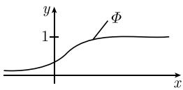
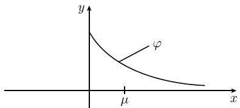
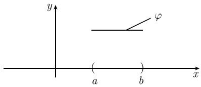
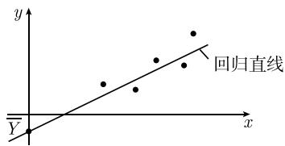

#### 6.1 基本的随机性

现在, 我们讨论概率论的几种基本形式, 这几种形式在概率论的发展过程中至关重要.

##### 6.1.1 古典概型

基本模型 考虑一个随机试验, 并用

$$
\boxed {e _ {1}, e _ {2}, \dots , e _ {n}}
$$

表示其全部可能结果. 我们称 $e_{1}, e_{2}, \cdots, e_{n}$ 为该试验的基本事件.

进一步地, 我们使用下面一些符号.

(i) 全体事件 E, 它表示由所有 $e_{j}$ 组成的集合.

(ii) 事件 $A$ , 指的是 $E$ 的一个子集.

对于给定的事件 A, 我们通过如下法则赋予它一个概率 $P(A)^{1)}$

$$
\boxed {P (A) := \frac {A \text {所包含元素的个数}}{n}.}\tag{6.1}
$$

在古典文献中, 人们称 A 中的基本事件为 “有利结果”, 而称由所有基本事件组成的集合为由 “可能结果” 组成的集合. 于是, 我们有

$$
P (A) := \frac {\text {有利结果数}}{\text {可能结果数}}.\tag{6.2}
$$

概率概念的这个定义式是雅各布·伯努利在17世纪末引入的.下面我们考虑几个例子.

掷一粒骰子 这个随机试验的全部可能结果由基本事件

$$
e _ {1}, e _ {2}, \dots , e _ {6}
$$

组成, 其中 $e_{j}$ 相应于掷出 j 点.

(i) 事件 $A := \{e_1\}$ 表示掷出 1 点. 由 (6.1), 我们有 $P(A) = \frac{1}{6}$ .

(ii) 事件 $B := \{e_2, e_4, e_6\}$ 表示掷出偶数点. 由 (6.1), 我们有 $P(B) = \frac{3}{6} = \frac{1}{2}$ . 这证明了我们的直觉, 即掷出偶数点与掷出奇数点的机会各占 $50\%$ .

掷两粒骰子 在这种情形, 可能结果由基本事件

$$
e _ {i j}, \quad i, j = 1, 2, \dots , 6
$$

组成. 这里 $e_{23}$ 表示第一粒骰子掷出 2 点, 而第二粒骰子掷出 3 点. 本试验共有 36 个基本事件.

(i) 对于 $A := \{e_{ij}\}$ (对于任何固定的 i, j), 由 (6.2), 有 $P(A) = \frac{1}{36}$ .

(ii) 事件 $B := \{e_{11}, e_{22}, e_{33}, e_{44}, e_{55}, e_{66}\}$ 表示两粒骰子掷出的点数相同. 由 (6.1) 可得 $P(B) = \frac{6}{36} = \frac{1}{6}$ .

抽彩问题 考虑 “45 取 6” 的抽彩游戏. 在这里, 45 个数中有 6 个打了勾, 要从这 45 个数中任取 6 个以决定赢家. 取到 n 个打了勾的正确数字的概率是多少? 有关结果见表 6.1.

表 6.1 “45 取 6” 的抽彩游戏

<table><tr><td>抽得正确数字的个数</td><td>概率</td><td>1000万个抽奖者中获胜的人数</td></tr><tr><td>6</td><td> $a := \frac{1}{\left( \begin{array}{c} 45 \\ 6 \end{array} \right)} = 10^{-7}$ </td><td>1</td></tr><tr><td>5</td><td> $\binom{6}{5} 39a = 2 \cdot 10^{-5}$ </td><td>200</td></tr><tr><td>4</td><td> $\binom{6}{4} \left( \begin{array}{c} 39 \\ 2 \end{array} \right) a = 10^{-3}$ </td><td>10 000</td></tr><tr><td>3</td><td> $\binom{6}{3} \left( \begin{array}{c} 39 \\ 3 \end{array} \right) a = 2 \cdot 10^{-2}$ </td><td>200 000</td></tr></table>

在这个例子中, 基本事件的形式为

$$
\boxed {e _ {i _ {1} i _ {2} \dots i _ {6}}.}
$$

其中, $i_j = 1, \cdots, 45$ , 而且 $i_1 < i_2 < \cdots < i_6$ . 本试验共有 $\left( \begin{array}{c} 45 \\ 6 \end{array} \right)$ 个这种形式的基本事件 (见 2.1.1 例 5). 例如, 如果获胜数字是 1, 2, 3, 4, 5, 6, 则 $A = \{e_{123456}\}$ 表示有 6 个正确数字这一事件. 由 (6.1), 我们有

$$
P (A) = \frac {1}{\binom{4 5}{6}}.
$$

为了确定抽到 5 个正确数字的所有基本事件, 我们从 1, 2, 3, 4, 5, 6 中任取 5 个, 从剩下的 39 个错误数字 7, 8, …, 45 中任取 1 个. 因此有利结果共有

$\left(\begin{array}{l}6\\ 5\end{array}\right)\times39$ 个.

用类似方法可以检验表 6.1 中给出的所有数值.

如果用参加抽彩游戏的人数乘以上述各概率, 便可得到表中最后一列给出的每类获胜者的大致人数.

生日问题 $n$ 位客人参加一个聚会. 这 $n$ 位客人中至少有两人生日在同一天的概率 $p$ 是多少? 由表6.2可知, 即使客人只有30位, 也可以相当有把握地打赌说至少有两个人的生日在同一天. 事实上, 我们有

$$
p = \frac {3 6 5 ^ {n} - 3 6 5 \times 3 6 4 \times \cdots \times (3 6 5 - n + 1)}{3 6 5 ^ {n}}.\tag{6.3}
$$

这个试验的基本事件为

$$
\boxed {e _ {i _ {1} \dots i _ {n}}, \quad i _ {j} = 1, \dots , 3 6 5.}
$$

例如, $e_{12,14,\dots}$ 表示事件第一位客人的生日是一年中的第 12 天, 第二位客人的生日是一年中的第 14 天 …… 本试验共有 $365^{n}$ 个基本事件. 而 “这 $n$ 个人生日各不相同” 所包含的基本事件共有 $365 \times 364 \times \cdots \times (365 - n + 1)$ 个. 这样, (6.3) 中的分子就是有利结果数.

表 6.2 生日问题

<table><tr><td>客人数</td><td>20</td><td>23</td><td>30</td><td>40</td></tr><tr><td>至少有两位客人生日相同的概率</td><td>0.4</td><td>0.5</td><td>0.7</td><td>0.9</td></tr></table>

##### 6.1.2 伯努利大数定律

人们的一个基本经验是如果将一个随机试验重复许多次, 那么所得到的事件的频率将会越来越接近该事件的概率. 这是概率论的大量应用的基础. “大数定律” 从数学上证明了这个事实. 大数定律是由雅各布·伯努利最早提出并证明的. 下面我们以抛硬币为例对该定律进行解释.

抛一枚硬币 抛一枚硬币的试验可能是所有试验中最简单的一个. 这个试验的基本事件为

$$
\boxed {e _ {1}, e _ {2}.}\tag{6.4}
$$

其中, $e_1$ 表示“正面向上”, $e_2$ 表示“反面向上”. 事件 $A = \{e_1\}$ 相应于抛掷结果为正面向上. 由 (6.1) 可知 $A$ 的概率为

$$
\boxed {P (A) = \frac {1}{2}.}
$$

频率 经验告诉我们: 将一枚硬币抛 n 次, 并大量重复进行这个试验, 所得到的正面向上和反面向上的频率均接近于 1/2. 现在, 我们将给出这个问题的数学讨论. 将一枚硬币抛 n 次 基本事件为

$$
\boxed {e _ {i _ {1} i _ {2} \dots i _ {n}}, \quad i _ {1}, \dots , i _ {n} = 1, 2.}
$$

这里 $e_{i_{1}i_{2}\cdots i_{n}}$ 表示第一次抛硬币得到由 (6.4) 给出的基本事件 $e_{i_{1}}$ ，第二次抛硬币得到由 (6.4) 给出的基本事件 $e_{i_{2}},\cdots$ 这样，对于所有的 j, $i_{j}=1$ 或 $i_{j}=2$ 。我们赋予这个基本事件的频率为（这里是关于“正面向上”的）

$$
\boxed {H (e _ {i _ {1} i _ {2} \dots i _ {n}}) := \frac {\text {正面向上发生的次数}}{\text {试验次数} n}.}
$$

因此, 上式中的分子等于基本事件 $e_{i_1i_2\dots i_n}$ 的下标中“1”出现的次数. 伯努利大数定律 $^{1)}$ 设 $\varepsilon >0$ 为任意给定的实数. 记 $A_{n}$ 为满足

$$
\left| H (e \dots) - \frac {1}{2} \right| <   \varepsilon
$$

的所有基本事件 $e_{i_{1}i_{2}}$ … 组成的集合. 上式意味着事件 $e_{i_{1}i_{2}} \cdots i_{n}$ 的下标中 “1”(以及 “2”) 所占的百分比与 1/2(50%) 的差小于上述给定实数 $\varepsilon$ . 伯努利利用公式 (6.1) 计算了概率 $P(A_{n})$ , 并且证明了

$$
\lim _ {n \to \infty} P (A _ {n}) = 1.
$$

这个定理也可以用一个公式表示为

$$
\lim _ {n \rightarrow \infty} P \left(\left| H _ {n} - \frac {1}{2} \right| <   \varepsilon\right) = 1.
$$

##### 6.1.3 棣莫弗极限定理

概率论中最重要、最深刻的研究之一就是得到对于试验次数 $n \rightarrow \infty$ 时的极限情形易于理解的结果. 我们还是利用抛硬币的试验对此进行解释. 设 $A_{n,k}$ 表示由恰好有 k 个下标为 “1” 的所有基本事件 $e_{i_{1}i_{2}\cdots i_{n}}$ 组成的集合. 这个集合相应于 n 次试验中正面向上的次数为 k 的所有试验组成的集合. 于是, 在 $A_{n,k}$ 的每个基本事件中, 正面向上的频率

$$
H _ {n} = \frac {k}{n},
$$

而 $P(A_{n,k}) = \left( \begin{array}{l}n\\ k \end{array} \right)\frac{1}{2^n}$ 这个结果也可以用一个式子表示如下：

$$
\boxed {P \left(H _ {n} = \frac {k}{n}\right) = \binom{n}{k} \frac {1}{2 ^ {n}}.}
$$

这是 $n$ 次试验中正面向上的频率 $H_{n}$ 等于 $\frac{k}{n}$ 的概率.

棣莫弗定理 (1730) 当试验次数 $n$ 很大时, 有下面的渐近等式 $^{1)}$ :

$$
\boxed {P \left(H _ {n} = \frac {k}{n}\right) \sim \frac {1}{\sigma \sqrt {2 \pi}} \mathrm{e} ^ {- (k - \mu) ^ {2} / 2 \sigma^ {2}}, \quad k = 1, 2, \dots , n.}\tag{6.5}
$$

其中, 参数 $\mu = n/2, \sigma = \sqrt{n/4}$ . 表达式 (6.5) 中右边的函数就是所谓的高斯正态分布的概率密度(图 6.2). 正如我们预料的一样, 当 k = n/2 时, (6.5) 中的概率 P 取得最大值.

##### 6.1.4 高斯正态分布

测量过程的基本模型 假设给定了一个连续 (或者更一般地, 几乎处处连续) 函数 $\varphi: \mathbb{R} \to \mathbb{R}$ , 它满足

$$
\boxed {\int_ {- \infty} ^ {\infty} \varphi \mathrm{d} x = 1.}
$$

这种情况可以用概率的方式解释如下：

(i) 假设给定了一个随机测量变量 $X$ , 它由取某些实数值的测量结果确定, 如人的身高.

(ii) 规定

$$
\boxed {P (a \leqslant X \leqslant b) := \int_ {a} ^ {b} \varphi (x) \mathrm{d} x,}
$$

这个表达式是被测量的量 $X$ 落入区间 $[a, b]$ 的概率. 直观地说, $P(a \leqslant X \leqslant b)$ 相当于以曲线 $\varphi$ 为顶, 以区间 $[a, b]$ 为底的图形的面积 (图6.1(a)). 称 $\varphi$ 为 $X$ 的概率密度, 并称函数

$$
\Phi (x) := \int_ {- \infty} ^ {x} \varphi (\xi) \mathrm{d} \xi , \quad x \in \mathbb {R}
$$

为由 $\varphi$ 所确定的分布函数(图 6.1(b)).

  
(a) 概率密度

  
(b) 分布函数  
图 6.1 概率密度及其相应的分布函数

(iii) 称

$$
\boxed {\overline {{X}} := \int_ {- \infty} ^ {\infty} x \varphi (x) \mathrm{d} x}
$$

为 X 的均值(或期望). 进一步地, 称

$$
\boxed {(\Delta X) ^ {2} := \int_ {- \infty} ^ {\infty} (x - \overline {{X}}) ^ {2} \varphi (x) \mathrm{d} x}
$$

为 X 的方差或平方离差, 并称非负量 $\Delta X$ 为 X 的标准差.

如果我们将 $\varphi$ 理解为质量密度, 那么 $\overline{X}$ 就是质量中心. 切比雪夫不等式 对于任意的 $\beta > 0$ , 有

$$
\boxed {P (| X - \overline {{X}} | > \beta \Delta X) \leqslant \frac {1}{\beta^ {2}}.}
$$

特别地, 当 $\Delta X = 0$ 时, 我们有 $P(X = \overline{X}) = 1$ .

置信区间 设 $0 < \alpha < 1$ . 随机变量 X 的测量值落入区间

$$
\boxed {\left[ \overline {{X}} - \frac {\Delta X}{\sqrt {\alpha}}, \overline {{X}} + \frac {\Delta X}{\sqrt {\alpha}} \right]}
$$

的概率大于 $1 - \alpha$ .

例 1: 设 $\alpha = \frac{1}{16}$ ，则 X 的测量值落入区间 $[\overline{X} - 4\Delta X, \overline{X} + 4\Delta X]$ 内的概率大于 $\frac{15}{16}$ .

这一结果使均值和标准差的含义更加精确:

标准差 $\Delta X$ 越小, X 的测量值就越密集在均值 $\overline{X}$ 附近.

高斯正态分布 $N(\mu,\sigma)$ 这种分布的概率密度为

$$
\boxed {\varphi (x) := \frac {1}{\sigma \sqrt {2 \pi}} \mathrm{e} ^ {- (x - \mu) ^ {2} / 2 \sigma^ {2}}, \quad x \in \mathbb {R}}
$$

其中参数 $\mu, \sigma$ 均为实数, 且 $\sigma > 0$ (图 6.2). 对于这种分布, 有

$$
\boxed {\overline {{X}} = \mu , \quad \Delta X = \sigma .}
$$

  
图 6.2 高斯正态分布

正态分布是概率论中最重要的分布. 这是因为根据中心极限定理, 任何随机变量, 只要它是由大量相互独立的随机变量叠加而成的, 那么它就近似服从正态分布 (见 6.2.4).

指数分布 相应的概率密度见表 6.3. 这种分布用于描述产品 (如灯泡) 的使用寿命等. 于是

$$
\int_ {a} ^ {b} \frac {1}{\mu} \mathrm{e} ^ {- x / \mu} \mathrm{d} x
$$

就是产品的使用寿命值落入区间 $[a, b]$ 的概率. 产品的平均使用寿命为 $\mu$ .

表 6.3 几种连续型分布

<table><tr><td>分布名称</td><td>概率密度  $\varphi$ </td><td>均值  $\overline{X}$ </td><td>标准差  $\Delta X$ </td></tr><tr><td>正态分布 $N(\mu,\sigma)$ </td><td> $\frac{1}{\sigma\sqrt{2\pi}}\mathrm{e}^{-(x-\mu)^{2}/2\sigma^{2}}$ </td><td> $\mu$ </td><td> $\sigma$ </td></tr><tr><td>指数分布 (图 6.3)</td><td> $\left\{\begin{array}{ll}\frac{1}{\mu}\mathrm{e}^{-x/\mu},&x\geqslant0(\mu>0)\\0,&x<0\end{array}\right.$ </td><td> $\mu$ </td><td> $\mu$ </td></tr><tr><td>均匀分布 (图 6.4)</td><td> $\left\{\begin{array}{ll}\frac{1}{b-a},&a\leqslant x\leqslant b\\0,&\text{其他}\end{array}\right.$ </td><td> $\frac{b+a}{2}$ </td><td> $\frac{b-a}{\sqrt{12}}$ </td></tr></table>

  
图 6.3 指数分布

  
图6.4 均匀分布

随机变量的函数的均值 设 $Z = F(X)$ 是随机变量 $X$ 的函数. 由 $X$ 的每个测量值可以得到 $Z$ 的一个对应值. $Z$ 的均值 $\overline{Z}$ 和方差 $(\Delta Z)^2$ 由下面的公式给出:

$$
\boxed {\overline {{Z}} = \int_ {- \infty} ^ {\infty} F (x) \varphi (x) \mathrm{d} x, \quad (\Delta Z) ^ {2} = \int_ {- \infty} ^ {\infty} (F (x) - \overline {{Z}}) ^ {2} \varphi (x) \mathrm{d} x.}
$$

例 2: $(\Delta X)^{2}=\overline{(X-\overline{X})^{2}}=\int_{-\infty}^{\infty}(x-\overline{X})^{2}\varphi(x)\mathrm{d}x.$

均值加法公式

$$
\boxed {\overline {{F (X) + G (X)}} = \overline {{F (X)}} + \overline {{G (X)}}.}
$$

##### 6.1.5 相关系数

对于任意的测量来说, 最重要的量是均值, 标准差和满足 $-1 \leqslant r \leqslant 1$ 的相关系数 r. 对于上述最后一个量, 我们有下述事实:

$$
\text { 相关系数的绝对值 } | r | \text { 越大,   所测量的两个量的相关性(即其相互依赖性)越强. }
$$

测量两个随机变量的基本模型 假设给定了一个几乎处处连续的非负函数 $\varphi : \mathbb{R}^2 \to \mathbb{R}$ , 它满足

$$
\boxed {\int_ {\mathbb {R} ^ {2}} \varphi (x, y) \mathrm{d} x \mathrm{d} y = 1.}
$$

对于这种情况可以给出如下的概率解释：

(i) 设有两个随机变量 $X$ 和 $Y$ , 它们的取值是两个由测量给出的实数值. 我们称二元组 $(X, Y)$ 为一个随机向量.

(ii) 概率：规定

$$
\boxed {P ((X, Y) \in G) := \int_ {G} \varphi (x, y) \mathrm{d} x \mathrm{d} y.}
$$

这是当 $(X,Y)$ 的坐标分别取 $X$ 和 $Y$ 的测量值时, 相应点落在集合 $G$ 中的概率. 称 $\varphi$ 为随机向量 $(X,Y)$ 的概率密度.

(iii) X 和 Y 的概率密度 $\varphi_{X}$ 和 $\varphi_{Y}$ 分别为

$$
\boxed {\varphi_ {X} (x) := \int_ {- \infty} ^ {\infty} \varphi (x, y) \mathrm{d} y, \quad \varphi_ {Y} (y) := \int_ {- \infty} ^ {\infty} \varphi (x, y) \mathrm{d} x.}
$$

(iv) X 的均值 $\overline{X}$ 和方差 $(\Delta X)^{2}$ 由下式给出:

$$
\overline {{{{X}}}} = \int_ {- \infty} ^ {\infty} x \varphi_ {X} (x) \mathrm{d} x, (\Delta X) ^ {2} = \int_ {- \infty} ^ {\infty} \left(x - \overline {{{{X}}}}\right) ^ {2} \varphi_ {X} (x) \mathrm{d} x.
$$

$\overline{Y}$ 和 $(\Delta Y)^{2}$ 可类似计算.

(v) 函数 $Z = F(X, Y)$ 的均值由下式给出:

$$
\boxed {\overline {{Z}} := \int_ {\mathbb {R} ^ {2}} F (x, y) \varphi (x, y) \mathrm{d} x \mathrm{d} y.}
$$

(vi) $Z = F(X,Y)$ 的方差 $(\Delta Z)^{2}$ 由下式给出：

$$
\boxed {(\Delta Z) ^ {2} := \overline {{(Z - \overline {{Z}}) ^ {2}}} = \int_ {\mathbb {R} ^ {2}} (F (x, y) - \overline {{Z}}) ^ {2} \varphi (x, y) \mathrm{d} x \mathrm{d} y.}
$$

(vii) 均值加法公式为

$$
\left| \overline {{F (X , Y) + G (X , Y)}} = \overline {{F (x , y)}} + \overline {{G (X , Y)}}. \right|
$$

协方差 称数

$$
\operatorname{Cov} (X, Y) := \overline {{\left(X - \overline {{X}}\right) \left(Y - \overline {{Y}}\right)}}
$$

为 X 和 Y 的协方差. 显然, 有

$$
\operatorname{Cov} (X, Y) = \int_ {\mathbb {R} ^ {2}} \left(x - \overline {{X}}\right) \left(y - \overline {{Y}}\right) \varphi (x, y) \mathrm{d} x \mathrm{d} y.
$$

相关系数 关于两个随机变量的一个基本问题是： $X$ 和 $Y$ 是强相关还是弱相关？这个问题的答案由相关系数

$$
r = \frac {\operatorname{Cov} (X , Y)}{\Delta X \Delta Y}
$$

给出. 相关系数 $r$ 恒满足 $-1 \leqslant r \leqslant 1$ , 即 $r^2 \leqslant 1$ .

定义 $r^{2}$ 越大, X 与 Y 的相关性越强.

解决方案 考虑最小化问题

$$
\boxed {\overline {{(Y - a - b X ^ {2})}} \stackrel {!} {=} \min, \quad a, b \in \mathbb {R}.}\tag{6.6}
$$

也就是说, 我们要寻找一个最密切逼近 $Y$ 的线性函数 $a + bX$ . 这个最小化问题相应于高斯的最小二乘法.

(a) (6.6) 的解是所谓的回归直线

$$
\overline {{Y}} + r \frac {\Delta Y}{\Delta X} (X - \overline {{X}}).
$$

(b) 对于这个解, 有

$$
\overline {{(Y - a - b X) ^ {2}}} = (\Delta Y) ^ {2} \left(1 - r ^ {2}\right).
$$

  
图6.5 回归直线

对于 $r^{2}=1$ (或 r=0), 我们得到的是最好 (或最差) 的逼近.

例: 在实际情形, X 和 Y 的测量值 $x_{1}, \cdots, x_{n}$ 和 $y_{1}, \cdots, y_{n}$ 是给定的. 将所有这些测量值 $(x_{j}, y_{j})$ 描在 $(x, y)$ 平面上. 回归直线

$$
\boxed {y = \overline {{Y}} + r \frac {\Delta Y}{\Delta X} (x - \overline {{X}})}
$$

是最好地拟合所有这些点的直线 (图 6.5).

$\Delta X, \Delta Y$ 和 r 的真值未知, 但可以利用已经得到的测量值对它们进行估计:

$$
\overline {{X}} = \frac {1}{n} \sum_ {j = 1} ^ {n} x _ {j}, \quad (\Delta X) ^ {2} = \frac {1}{n - 1} \sum_ {j = 1} ^ {n} (x _ {j} - \overline {{X}}) ^ {2},
$$

$$
r = \frac {1}{(n - 1) \Delta X \Delta Y} \sum_ {j = 1} ^ {n} (x _ {j} - \overline {{X}}) (y _ {j} - \overline {{Y}}).
$$

随机变量的独立性 若随机变量 X 和 Y 的 (联合) 概率密度 $\varphi$ 具有如下因式分解形式:

$$
\boxed {\varphi (x, y) = a (x) b (y), \quad (x, y) \in \mathbb {R} ^ {2},}
$$

则称 X 与 Y 是相互独立的.

此时, 我们有

(i) $\varphi_{X}(x)=a(x),\varphi_{Y}(y)=b(y).$

(ii) 概率乘法公式:

$$
\left| P (a \leqslant X \leqslant b, c \leqslant Y \leqslant d) = P (a \leqslant X \leqslant b) P (c \leqslant Y \leqslant d). \right.
$$

(iii) 均值乘法公式:

$$
\boxed {\overline {{F (X) G (Y)}} = \overline {{F (X)}} \cdot \overline {{G (Y)}}.}
$$

(iv) 相关系数 $r$ 为 $0.^{1)}$

(v) 方差加法公式:

$$
\boxed {(\Delta (X + Y)) ^ {2} := (\Delta X) ^ {2} + (\Delta Y) ^ {2}.}
$$

高斯正态分布

$$
\boxed {\varphi (x, y) := \frac {1}{\sigma_ {x} \sqrt {2 \pi}} \mathrm{e} ^ {- (x - \mu_ {x}) ^ {2} / 2 \sigma_ {x} ^ {2}} \cdot \frac {1}{\sigma_ {y} \sqrt {2 \pi}} \mathrm{e} ^ {- (y - \mu_ {y}) ^ {2} / 2 \sigma_ {y} ^ {2}}.}
$$

这个概率密度是两个一维正态分布概率密度的乘积, 它相应于两个相互独立随机变量 X 和 Y 的联合分布. 对于这个分布, 有

$$
\overline {{X}} = \mu_ {x}, \quad \Delta X = \sigma_ {x}, \quad \overline {{Y}} = \mu_ {y}, \quad \Delta Y = \sigma_ {y},
$$

以及

$$
\left(\Delta \left(X + Y\right)\right) ^ {2} = \sigma_ {x} ^ {2} + \sigma_ {y} ^ {2}.
$$

1) 这可由 $\overline{X - \overline{X}} = 0$ 和 $\overline{(X - \overline{X})(Y - \overline{Y})} = \overline{(X - \overline{X})}\cdot \overline{(Y - \overline{Y})} = 0$ 得到.

##### 6.1.6 在经典统计物理学中的应用

利用上一段的结果, 全部经典统计物理学可以描述得非常优美和简洁. 考虑由 N 个质量为 m 的粒子组成的系统. 在开始对经典统计物理学进行描述之前, 我们首先给出系统能量 E 的如下表达式:

$$
\boxed {E = H (\boldsymbol {q}, \boldsymbol {p}).}
$$

这里, 函数 $H$ 是系统的哈密顿函数. 假设每个粒子具有 $f$ 个自由度 (例如三个平移自由度, 以及/或者其他来自于旋转或震动的自由度). 设

$$
\boldsymbol {q} = \left(q _ {1}, \dots , q _ {f N}\right), \boldsymbol {p} = \left(p _ {1}, \dots , p _ {f N}\right).
$$

这里, $q_{j}$ 是粒子的坐标, $p_{j}$ 是与粒子的速度有关的 (广义) 动量变量.

经典力学 粒子在时刻 t 的运动 $\boldsymbol{q} = \boldsymbol{q}(t)$ , $\boldsymbol{p} = \boldsymbol{p}(t)$ 的方程由下面的方程组给出:

$$
\left| q _ {j} ^ {\prime} (t) = H _ {p _ {j}} (\boldsymbol {q} (t), \boldsymbol {p} (t)), p _ {j} ^ {\prime} (t) = - H _ {q _ {j}} (\boldsymbol {q} (t), \boldsymbol {p} (t)), \quad j = 1, \dots , f N. \right|
$$

假设变量 $(\pmb{q},\pmb{p})$ 在 $\mathbb{R}^{fN}$ 的一个区域 $\Pi$ 中运动, 称 $\Pi$ 为系统的相空间 (有关这些哈密顿力学的基本概念, 见5.1.3).

经典统计力学 我们从概率密度

$$
\boxed {\varphi (\boldsymbol {q}, \boldsymbol {p}) := C \mathrm{e} ^ {- H (\boldsymbol {q}, \boldsymbol {p}) / \mathrm{k} T}}
$$

出发开始讨论, 其中常数 $C$ 由 $\int_{\Pi} \varphi \mathrm{d}\boldsymbol{q} \mathrm{d}\boldsymbol{p} = 1$ 确定. 这里, $T$ 表示系统的绝对温度, $k$ 是一个取自然数值的常数, 称为玻尔兹曼常量, 它使 $H / kT$ 成为无维数的量. 现在, 我们可以借助 $\varphi$ 引入一些重要的量.

(i) 系统落入相空间的子区域 G 中的概率 $P(G)$ :

$$
\boxed {P (G) = \int_ {G} \varphi (\boldsymbol {q}, \boldsymbol {p}) \mathrm{d} \boldsymbol {q} \mathrm{d} \boldsymbol {p}.}\tag{6.7}
$$

(ii) 函数 $F = F(\boldsymbol{q}, \boldsymbol{p})$ 的均值和方差:

$$
\overline {{F}} = \int_ {\Pi} F (\boldsymbol {q}, \boldsymbol {p}) \varphi (\boldsymbol {q}, \boldsymbol {p}) \mathrm{d} \boldsymbol {q} \mathrm{d} \boldsymbol {p}, \quad (\Delta F) ^ {2} = \int_ {\Pi} \left(F (\boldsymbol {q}, \boldsymbol {p}) - \overline {{F}}\right) ^ {2} \varphi (\boldsymbol {q}, \boldsymbol {p}) \mathrm{d} \boldsymbol {q} \mathrm{d} \boldsymbol {p}.
$$

(iii) 两个给定函数 $A = A(\pmb{q}, \pmb{p})$ 和 $B = B(\pmb{q}, \pmb{p})$ 的相关系数：

$$
\boxed {r = \frac {1}{\Delta A \Delta B} \overline {{(A - \overline {{A}}) (B - \overline {{B}})}}.}
$$

(iv) 系统在绝对温度 T 时的熵 $^{1)}$ :

$$
\boxed {S = - \mathrm{k} \overline {{\mathrm{ln} \varphi}}.}
$$

对麦克斯韦速度分布的应用 考虑由 N 个质量为 m 的粒子组成的, 在 $R^{3}$ 的有界区域 $\Omega$ 中运动的理想气体. 设 V 表示区域 $\Omega$ 的体积. 第 j 个粒子用坐标向量 $\boldsymbol{x}_{j} = \boldsymbol{x}_{j}(t)$ 和动量向量

$$
\pmb {p} _ {j} (t) = m \pmb {x} _ {j} ^ {\prime} (t)
$$

描述, 其中 $\boldsymbol{x}_{j}^{\prime}(t)$ 是粒子在时刻 t 的速度. 如果我们用 v 表示在笛卡儿坐标系中第 j 个粒子的速度向量的任意一个分量, 则有

$$
\boxed {P (a \leqslant m v \leqslant b) = \int_ {a} ^ {b} \frac {1}{\sigma \sqrt {2 \pi}} \mathrm{e} ^ {- x ^ {2} / 2 \sigma^ {2}} \mathrm{d} x.}\tag{6.8}
$$

这是 $mv$ 落入区间 $[a, b]$ 的概率. 相应的概率分布是均值 $\overline{mv} = 0$ , 标准差

$$
\Delta (m v) = \sigma = \sqrt {m k T}
$$

的高斯正态分布.

这条定律是麦克斯韦在1860年确立的。他利用这条定律为玻尔兹曼建立统计力学奠定了基础。

推理: 在笛卡儿坐标系中, 我们令 $p_{1}=p_{1}i+p_{2}j+p_{3}k, p_{2}=p_{4}i+p_{5}j+p_{6}k,\cdots$ , 以及 $x_{1}=q_{1}i+q_{2}j+q_{3}k,\cdots$ . 因为 (理想气体的) 粒子之间没有相互作用, 所以理想气体的总能量 E 是每个粒子动能的和:

$$
E = \frac {p _ {1} ^ {2}}{2 m} + \dots + \frac {p _ {N} ^ {2}}{2 m} = \sum_ {j = 1} ^ {3 N} \frac {p _ {j} ^ {2}}{2 m}.
$$

例如, 考虑 $p_{1}=mv$ . 由 (6.7), 有 $^{2)}$

$$
P (a \leqslant p _ {1} \leqslant b) = C \int_ {a} ^ {b} \exp \left(- \frac {p _ {1} ^ {2}}{2 m k T}\right) d p _ {1} \cdot J,
$$

其中, J 由对 $p_{2} \cdots p_{3N}$ 从 $-\infty$ 到 $\infty$ 的积分, 以及关于坐标 $q_{j}$ 的积分得到. 然后, CJ 的值就可以从规范化条件 $P(-\infty < p < \infty) = 1$ 求出. 这样就得到了 (6.8).

波动原理 经典统计力学中的一个关键问题是：为什么要了解气体的统计性质必须具备非常灵敏的测量能力？这个问题的答案可以在对理想气体成立的基本公式

$$
\boxed {\frac {\Delta E}{\overline {{E}}} = \frac {1}{\sqrt {N}} \frac {\Delta \varepsilon}{\overline {{\varepsilon}}}}\tag{6.9}
$$

中找到. 这里, 我们使用的符号的意思分别是: $N$ 为粒子数, $E$ 是总能量, $\varepsilon$ 是单个粒子的能量. 由于 $\Delta \varepsilon / \overline{\varepsilon}$ 近似等于 1, 而 $N$ 的量级为 $10^{23}$ , 因此气体能量的相对方差 $\Delta E / \overline{E}$ 相当小, 在日常生活中没有任何明显作用.

推理: 由于理想气体的粒子之间没有相互作用, 所以每个粒子的能量是相互独立的随机变量. 因此, 可以应用均值和方差的加法公式. 这样可以得到

$$
\overline {{E}} = N \overline {{\varepsilon}}, \quad (\Delta E) ^ {2} = N (\Delta \varepsilon) ^ {2}.
$$

由此可得 (6.9).

具有可变粒子数和化学势的系统 在化学反应期间, 粒子数可以变化. 因此, 相应的统计物理学就需要考虑参数 $T$ (绝对温度) 和参数 $\mu$ (化学势). 有关讨论见 [212]. 在那里, 我们考虑了一个也可以应用于现代量子统计 (原子, 分子, 光子和基本粒子的统计) 的一般方案.
