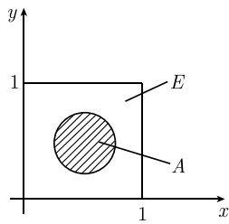

#### 6.2 科尔莫戈罗夫的概率论公理化基础

科尔莫戈罗夫的一般概率模型 设有非空集合 E, 我们称之为全体事件. E 的元素 e 称为基本事件. 令 P 为 E 上的一个测度, 它满足

$$
\boxed {P (E) = 1.}
$$

在这种模型中, 一般事件 A 是有确定测度 $P(A)$ 的子集 $A \subseteq E$ .

与测度论的联系 利用这些假设, 概率论就只不过是测度论这个现代数学分支的一种特殊情形. 有关测度论的详尽阐述见 [212]. 集合 $E$ 上满足性质 $P(E) = 1$ 的测度称为概率测度. 事件相应于可测集. 下面将简洁而系统地介绍概率测度的定义. 科尔莫戈罗夫公理简述 假设在集合 $E$ 上给定了一个由 $E$ 的子集 $A \subseteq E$ 组成的系统 $\mathcal{S}$ , 它满足如下条件:

(i) 空集 $\varnothing$ 与集合 E 都是 S 的元素.

(ii) 若 $A$ 和 $B$ 都属于 $\mathcal{S}$ , 则 $A$ 与 $B$ 的并集 $A \cup B$ , 交集 $A \cap B$ , 差集 $A - B$ 以及 $A$ 的补集 $\mathrm{C}_E A := E - A$ 都属于 $\mathcal{S}$ .

(iii) 若 $A_{1}, A_{2}, \cdots$ 都属于 S, 则 (无限) 并 $\bigcup_{n=1}^{\infty} A_{n}$ 与 (无限) 交 $\bigcap_{n=1}^{\infty} A_{n}$ 也属于 S.

事件是 $\mathcal{S}$ 的元素. 对于每个事件 $A$ , 赋予它一个实数 $P(A)$ , 满足:

(a) $0 \leqslant P(A) \leqslant 1.$

(b) $P(E) = 1$ , $P(\varnothing) = 0$ .

(c) 对于任意两个事件 $A$ 和 $B$ , 如果 $A \cap B = \varnothing$ , 则

$$
\boxed {P (A \cup B) = P (A) + P (B).}
$$

(d) 如果 $A_{1}, A_{2}, \cdots$ 是可数无穷多个事件, 而且对于所有的下标 $j \neq k$ , 都有 $A_{j} \cap A_{k} = \varnothing$ , 则

$$
\boxed {P \left(\bigcup_ {n = 1} ^ {\infty} A _ {n}\right) = \sum_ {n = 1} ^ {\infty} P (A _ {n}).}\tag{6.10}
$$

解释 基本事件相应于随机试验的可能结果； $P(A)$ 就是结果 A 发生的概率；P 就是定义在 S 上的所谓概率测度.

定义 上述三元总体 $(E, \mathscr{S}, P)$ 称为概率空间.

哲学背景 这种概率论的一般方法是由科尔莫戈罗夫在 1933 年提出的. 这种方法假定随机试验的每个结果都有一个明确的, 而且与从该试验得到的任何测量结果无关的概率.

在历史上, 也曾经有人试图建立基于试验结果以及由试验得到的频率的概率理论, 但没有取得任何成功.

通过假定概率先验存在, 科尔莫戈罗夫的方法也与 I. 康德(Kant, 1724—1804)的哲学一致. 而另一方面, 频率是实验观测的产物, 因此是后验的.

我们体验到的三个事实 在日常生活中, 我们使用下面三个基本事实.

(i) 概率很小的事件极少会发生.

(ii) 概率可以用频率来估计.

(iii) 当完成并记录一定数量的试验之后, 事件的频率是稳定的.

大数定律从数学上说明, 事实上, 上述 (ii) 和 (iii) 可以由 (i) 推出.

例 1: 在 “45 取 6” 的摸彩游戏中, 抽到 6 个正确数字的概率为 $10^{-7}$ . 人人都明白, 在这样的游戏中, 获胜概率可以忽略不计.

例 2: 人寿保险公司需要知道其各年龄段顾客的死亡概率. 当然, 这种概率不能用 6.1.1 中介绍的组合方法进行推算, 而是需要通过对大量数据进行详细分析才能得到. 例如, 为了确定一个人活到 70 岁的概率 p, 我们随机选取 n 个人. 如果其中有 k 个人的年龄是 70 岁或更大, 那么就可以近似地说

$$
\boxed {p = \frac {k}{n}.}
$$

例 3: 为了确定新生儿为女婴或男婴的概率, 也必须使用数据分析. 拉普拉斯曾经研究了从伦敦、柏林、圣彼得堡等城市获得的数据, 以及更多来自于法国的数据. 他发现, 女孩出生的频率大约为

$$
\boxed {p = 0. 4 9.}
$$

然而, 在巴黎女婴出生的频率却大约是 p = 0.5. 因为拉普拉斯相信或然性法则的普遍性, 所以他试图解释这种差异. 他发现, 在巴黎被人发现的弃婴也被统计在内了; 而当时巴黎人遗弃的多数是女婴. 一旦不统计这些弃婴, 那么在巴黎女婴出生的频率也接近 p = 0.49.

有限多种可能结果 如果一个随机试验有 n(有限数) 个可能结果, 那么我们可以假设集合 E 由元素

$$
\boxed {e _ {1}, \dots , e _ {n}}
$$

构成, 并给每个基本事件 $e_j$ 赋予一个数 $P(e_j)$ , 它满足 $0 \leqslant P(e_j) \leqslant 1$ , 而且

$$
P (e _ {1}) + P (e _ {2}) + \dots + P (e _ {n}) = 1.
$$

E 的所有子集 A 都叫做事件. 对于每个事件 $A = \{e_{i_{1}}, \cdots, e_{i_{k}}\}$ ，我们赋予它一个概率：

$$
\boxed {P (A) := P \left(e _ {i _ {1}}\right) + P \left(e _ {i _ {2}}\right) + \dots + P \left(e _ {i _ {k}}\right).}
$$

例 4(掷一粒骰子): 对于这个试验 n=6. 如果

$$
P (e _ {j}) = \frac {1}{6}, \quad j = 1, \dots , 6,
$$

那么这粒骰子是均匀的, 否则它可能就是一粒骗人的骰子.

投针试验、无穷多种可能结果以及蒙特卡罗方法 让一枚针垂直落入单位正方形 $E: \{(x, y) | 0 \leqslant x, y \leqslant 1\}$ , 则落下的针尖扎中 $E$ 的子集 $A$ 的概率

$$
\boxed {P (A) := A \text {的面积}}
$$

(图 6.6(a)). 这里, 集合 E 仍为全体事件. 一个基本事件 e 就是 E 中的任何一个点. 在这种情形, 我们可以观察到如下两个令人惊讶的事实:

(i) 并非 E 的每个子集 A 都是事件.

(ii) $P(\{e\}) = 0.$

  
(a)

  
(b)  
图 6.6 概率对应于表面积

事实上, 我们不可能对 $E$ 的每个子集 $A$ 都赋予一个表面积, 并由此得到 $E$ 上的一个满足 (6.10) 的测度. 我们自然考虑选择 $\mathbb{R}^2$ 上的勒贝格测度作为 $E$ 上的这种测度. 对于足够合理的集合 $A$ , 概率 $P(A)$ 恰好就是 $A$ 的表面积. 然而, 也存在着 $E$ 的“奇异的”子集 $A$ , 它们不是勒贝格可测的, 因此不是事件. 对于这些“奇异的”集合, 我们不可能以任何合理的方式赋予它一个数值, 并使这个数值成为针尖扎入该集合的概率.

若我们考虑的集合 A 是由单位正方形 E 除去一个点 e 以后得到的集合, 则

$$
P (A) = 1 - P (\{e \}) = 1.
$$

对此, 可以用针尖几乎必然落入集合 A 来解释.

由此, 得到下面的定义:

几乎不可能事件 若 $P(A)=0$ ，则称事件 A 为几乎不可能事件.

几乎必然事件 若 $P(A)=1$ ，则称事件 A 为几乎必然事件。

例 5: 取一个落入上述单位正方形 E 的半径为 r 的圆 A，则针落入 A 的概率 $P(A) = \pi r^{2}$ 。因此，我们可以利用上述投针试验确定 $\pi$ 的实验值。落下的针可以用计算机中的随机数发生器来模拟。这是蒙特卡罗模拟方法潜在的基本思想。蒙特卡罗方法可用于计算原子物理，基本粒子理论以及量子化学中的高维积分。

例 6(蒲丰投针问题): 下面这个问题是法国自然科学家蒲丰在1777年提出的. 假设在平面上等间距 d 画着一些平行直线 (图 6.7). 现在将一枚长度为 $L(L < d)$ 的针抛向该平面. 问这枚针能与一条直线相交的概率是多少? 这个问题的答案是:

$$
\boxed {p = \frac {2 L}{d \pi}.}
$$

1850 年，苏黎世（瑞士）天文学家沃尔夫 (Wolf) 投针 5000 次，得到了概率 $p$ (的一个近似值)，并由此获得了 $\pi$ 的一个近似值 $\pi \approx 3.16$ ，这个值与 $\pi$ 的真值（保留两位小数为 3.14）非常接近.

图 6.7 蒲丰投针问题

##### 本节包含的小节

- [6.2.1 事件与概率的计算](<6.2.1 事件与概率的计算.md>)
- [6.2.2 随机变量](<6.2.2 随机变量.md>)
- [6.2.3 随机向量](<6.2.3 随机向量.md>)
- [6.2.4 极限定理](<6.2.4 极限定理.md>)
- [6.2.5 应用于独立重复试验的伯努利模型](<6.2.5 应用于独立重复试验的伯努利模型.md>)
