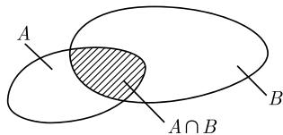

##### 6.2.1 事件与概率的计算

事件是集合. 集合论的每一种关系和运算都对应着一个概率论的解释和意义, 有关结果见表 6.4. 事件的运算根据集合论的有关规则 (有关说明见 4.3.2) 进行. 概率的单调性 若 $A_{1}, A_{2}, \cdots$ 为事件, 则对于 $N = 1, 2, \cdots$ 和 $N = \infty$ 均有不等式

$$
P \left(\bigcup_ {n = 1} ^ {N} A _ {n}\right) \leqslant \sum_ {n = 1} ^ {N} P \left(A _ {n}\right).
$$

由 (6.10) 可知, 若对于所有的 $k \neq j$ , $A_{j}$ 和 $A_{k}$ 都没有共同元素, 即这些事件两两互不相容, 则上式中的等号成立.

表 6.4 事件的逻辑演算

<table><tr><td>事件</td><td>解释</td><td>概率</td></tr><tr><td> $E$ </td><td>全体事件</td><td> $P(E) = 1$ </td></tr><tr><td> $\varnothing$ </td><td>不可能事件</td><td> $P(\varnothing) = 0$ </td></tr><tr><td> $A$ </td><td>任意事件</td><td> $0 \leqslant P(A) \leqslant 1$ </td></tr><tr><td> $A \cup B$ </td><td>事件  $A$  或  $B$  发生</td><td> $P(A \cup B) = P(A) + P(B) - P(A \cap B)$ </td></tr><tr><td> $A \cap B$ </td><td>事件  $A$  和  $B$  都发生</td><td> $P(A \cap B) = P(A) + P(B) - P(A \cup B)$ </td></tr><tr><td> $A \cap B = \varnothing$ </td><td>事件  $A$  和  $B$  不能同时发生</td><td> $P(A \cup B) = P(A) + P(B)$ </td></tr><tr><td> $A - B$ </td><td>事件  $A$  发生而  $B$  不发生</td><td> $P(A - B) = P(A) - P(A \cap B)^*$ </td></tr><tr><td> $C_E A$ </td><td>事件  $A$  不发生 $(C_E A := E - A)$ </td><td> $P(C_E A) = 1 - P(A)$ </td></tr><tr><td> $A \subseteq B$ </td><td>若事件  $A$  发生,则  $B$  发生</td><td> $P(A) \leqslant P(B)$ </td></tr><tr><td></td><td>事件  $A$  与  $B$  相互独立</td><td> $P(A \cap B) = P(A)P(B)$ </td></tr></table>

\* 原文为 $P(A - B) = P(A) - P(B)$ , 但这个结果仅当 $B \subseteq A$ 时才成立.——译者

极限性质

(i) 若 $A_{1} \subseteq A_{2} \subseteq \cdots$ ，则 $\lim_{n \to \infty} P(A_{n}) = P\left(\bigcup_{n=1}^{\infty} A_{n}\right)$ .

(ii) 若 $A_{1} \supset A_{2} \supseteq \cdots$ , 则 $\lim_{n \to \infty} P(A_{n}) = P\left(\bigcap_{n=1}^{\infty} A_{n}\right)$ .

6.2.1.1 条件概率

选择一个固定的全体事件 E, 并考虑属于 E 的事件 A, B, $\cdots$ .

定义 设 $P(B) \neq 0$ , 则数

$$
\boxed {P (A | B) := \frac {P (A \cap B)}{P (B)}}\tag{6.11}
$$

称为在 B 已经发生的条件下 A 发生的条件概率.

解决方案 选择集合 $B$ 作为一个新的全体事件并考虑 $B$ 的子集 $A \cap B$ , 其中 $A$ 是关于 $E$ 的事件 (即 $A \subseteq E$ , 图6.8). 在 $B$ 上建立一个概率测度 $P_B$ , 它满足

$$
P _ {B} (B) := 1, \quad \text {以及} P _ {B} (A \cap B) := P (A \cap B) / P (B).
$$

于是, 我们有 $P(A|B)=P_{B}(A\cap B)$ .

例 1(抛两枚硬币): 考虑两个事件 A 和 B.

A: 两枚硬币均为正面向上,

B: 第一枚硬币为正面向上,

则有

$$
\boxed {P (A) = \frac {1}{4}, \quad P (A | B) = \frac {1}{2}.}
$$

(i) 概率的直观确定: 试验结果 (基本事件)为

$$
\begin{array}{c c c c} H H, & H T, & T H, & T T. \end{array}
$$

  
图6.8

这里 HT 表示第一枚硬币正面向上, 而第二枚硬币反面向上; …… 有

$$
A = \{H H \}, \quad B = \{H H, H T \}.
$$

由此可得 $P(A)=1/4$ . 若知道事件 B 已经发生, 则就只有 HH 或 HT 发生, 这意味着 $P(A|B)=1/2$ .

(ii) 使用定义 (6.11): 由 $A \cap B = \{HH\}$ , $P(A \cap B) = 1/4$ , 以及 $P(B) = 1/2$ , 可得

$$
P (A | B) = \frac {P (A \cap B)}{P (B)} = \frac {1}{2}.
$$

区分清楚普通概率与条件概率是重要的.

全概率公式 如果

$$
E = \bigcup_ {j = 1} ^ {n} B _ {j}, \quad \text {而且对于所有的} j \neq k, \text {都有} B _ {j} \cap B _ {k} = \varnothing ,\tag{6.12}
$$

那么, 对于任何事件 A, 都有

$$
\boxed {P (A) = \sum_ {j = 1} ^ {n} P (B _ {j}) P (A | B _ {j}).}
$$

例 2: 设有两只相同的罐子, 其中

(i) 第一只罐子装有 1 粒白色弹球和 4 粒黑色弹球；

(ii) 第二只罐子装有 1 粒白色弹球和 2 粒黑色弹球. 从这两只罐子中任取一粒弹球. 考虑事件

A: 取到的是一粒黑色的弹球.

$B_{j}$ : 取到的弹球是从第 j 只罐子中取出的.
于是, 对于取出一粒黑色弹球的概率 $P(A)$ , 有

$$
P (A) = P (B _ {1}) P (A | B _ {1}) + P (B _ {2}) P (A | B _ {2}) = \frac {1}{2} \cdot \frac {4}{5} + \frac {1}{2} \cdot \frac {2}{3} = \frac {1 1}{1 5}.
$$

贝叶斯定理 (1763) 设 $P(A) \neq 0$ , 则在假设 (6.12) 之下, 有

$$
\boxed {P (B _ {j} | A) = \frac {P (B _ {j}) P (A | B _ {j})}{P (A)}.}
$$

例 3: 在例 2 中, 假设我们已经取到了一粒黑色的弹球, 那么这粒弹球取自第一只罐子的概率是多少?

由上例可知 $P(B_{1})=1/2,\ P(A|B_{1})=4/5,\ P(A)=11/15,$ 所以我们有

$$
P (B _ {1} | A) = \frac {P (B _ {1}) P (A | B _ {1})}{P (A)} = \frac {6}{1 1}.
$$

6.2.1.2 独立事件

概率论中最重要的问题之一是给出事件相互独立这一直观概念的精确数学定义.

定义 设 A 和 B 是 E 中的两个事件, 若

$$
\boxed {P (B \cap A) = P (A) P (B),}
$$

则称事件 A 与事件 B 是相互独立的. 类似地, 设 $A_{1}, \cdots, A_{n}$ 是 E 中的 n 个事件, 若对于所有的 $m = 2, \cdots, n$ , 以及任意的 $1 \leqslant j_{1} < j_{2} < \cdots < j_{m} \leqslant n$ , 都成立等式

$$
P \left(A _ {j _ {1}} \cap A _ {j _ {2}} \cap \dots \cap A _ {j _ {m}}\right) = P \left(A _ {j _ {1}}\right) P \left(A _ {j _ {2}}\right) \dots P \left(A _ {j _ {m}}\right),
$$

则称事件 $A_{1},\cdots,A_{n}$ 是相互独立的.

定理 设 $P(B) \neq 0$ , 则事件 A 与事件 B 是相互独立的, 当且仅当其条件概率满足

$$
\boxed {P (A | B) = P (A).}
$$

解决方案 在日常生活中, 我们经常用频率代替概率. 我们预计事件 A(相应地事件 B) 在 n 次试验中发生的次数为 $nP(A)$ (相应地 $nP(B)$ ).

若 A 与 B 是相互独立的, 则直觉告诉我们, 事件 “A 和 B 都发生” 在 n 次试验中发生的次数为 $(nP(A)) \times P(B)$ .

例：掷一对骰子，并考虑如下事件：

A: 第一粒骰子为 “1” 点,

B: 第二粒骰子为 “3” 点或 “6” 点.

本试验共有 36 个基本事件:

$$
(i, j), i, j = 1, \dots , 6.
$$

这里, $(i,j)$ 表示事件“第一粒骰子为 $i$ 点而第二粒骰子为 $j$ 点”。事件 $A, B$ 以及 $A \cap B$ 分别相应于如下基本事件：

$$
\begin{array}{l l} A: & (1, 1), (1, 2), (1, 3), (1, 4), (1, 5), (1, 6). \\ B: & (1, 3), (2, 3), (3, 3), (4, 3), (5, 3), (6, 3), \\ & (1, 6), (2, 6), (3, 6), (4, 6), (5, 6), (6, 6). \\ A \cap B: & (1, 3), (1, 6). \end{array}
$$

因此, $P(A) = 6 / 36 = 1 / 6$ , $P(B) = 12 / 36 = 1 / 3$ , 而 $P(A \cap B) = 2 / 36 = 1 / 18$ . 于是, 我们有 $P(A \cap B) = P(A)P(B)$ , 也就是说, 事件 $A$ 与 $B$ 是相互独立的.
