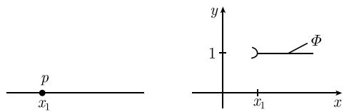
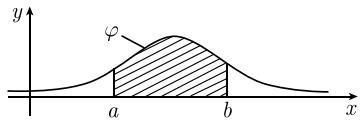

##### 6.2.2 随机变量

在这一节中, 我们引入随机变量的概念. 这个概念用于刻画具有随机性特征的观测量 (如人的身高等).

6.2.2.1 基本思想

设 $E = \{e_{1}, \cdots, e_{n}\}$ 是有限个可能结果, 而且结果 $e_{1}, \cdots, e_{n}$ 发生的概率分别为 $p_{1}, \cdots, p_{n}$ . E 上的一个随机函数

$$
\boxed {X: E \to \mathbb {R}}
$$

是一个将每个基本事件 $e_j$ 映射为一个实数 $X(e_j) := x_j$ 的函数。这意味着，如果对 $X$ 进行一次测量，那么我们将以概率 $p_j$ 得到测量值 $x_j$ 。对于这种函数，重要的量是均值 $\overline{X}$ 和标准差的平方 $(\Delta X)^2$ 。它们的定义分别为

$$
\boxed {\overline {{X}} := \sum_ {j = 1} ^ {n} x _ {j} p _ {j}, \quad (\Delta X) ^ {2} := \overline {{(X - \overline {{X}})}} ^ {2} = \sum_ {j = 1} ^ {n} (x _ {j} - \overline {{X}}) ^ {2} p _ {j}.}
$$

人们通常将标准差的平方称为方差．量 $\Delta X = \sqrt{(\Delta X)^{2}}$ 称为标准差，因为它是观测值与期望值的平均偏差.

下面的结果是切比雪夫不等式的一个特殊情况, 它解释了方差和标准差的重要性: X 的任意一个测量值落入区间

$$
\left[ \overline {{X}} - 4 \Delta X, \overline {{X}} + 4 \Delta X \right]\tag{6.13}
$$

的概率大于 0.93(见 6.2.2.4).

例：一个 (假想的) 卡西诺游戏允许玩家掷一粒骰子并根据掷出的点数按照表 6.5 所列的数额付钱给该玩家. 其中, 负数 (或正数) 是此卡西诺赢 (或输) 的钱数.

表 6.5 一场卡西诺牌戏中的输赢情况

<table><tr><td>玩家掷出的点数</td><td>1</td><td>2</td><td>3</td><td>4</td><td>5</td><td>6</td></tr><tr><td>卡西诺支付的钱数/美元</td><td>1</td><td>2</td><td>3</td><td>-4</td><td>-5</td><td>-6</td></tr><tr><td> $x_{j}$ </td><td> $x_{1}$ </td><td> $x_{2}$ </td><td> $x_{3}$ </td><td> $x_{4}$ </td><td> $x_{5}$ </td><td> $x_{6}$ </td></tr></table>

假设这种卡西诺游戏每天要玩 10 000 次.

我们的问题是: 开设这种卡西诺游戏每天的平均收入是多少?
解答: 先建立全体事件

$$
E = \left\{e _ {1}, \dots , e _ {n} \right\}.
$$

这里 $e_{i}$ 表示事件“掷出 i 点”. 进一步地, 令

$$
X (e _ {j}) := \text { 当玩家掷出 } j \text { 点时卡西诺支付的钱数 } ^ {*},
$$

则作为平均结果, 有

$$
\overline {{{X}}} = \sum_ {j = 1} ^ {6} x _ {j} p _ {j} = (x _ {1} + \dots + x _ {6}) \frac {1}{6} = - 1. 5.
$$

这样, 开设这种卡西诺游戏平均每天可挣 $1.5 \times 10000$ 美元 = 15000 美元. 然而, 由于 $X$ 的标准差 $\Delta X = 3.6$ 非常之大, 所以该卡西诺游戏每天的收益会有巨大的变化. 一般来说, 这会促使该卡西诺的老板开发更加有利可图的游戏.

17 世纪, 人们在进行机会游戏的过程中认识到了均值(期望) $\overline{X}$ 这一基本概念的重要性. 而当时最好的数学家中的两位——帕斯卡(Pascal, 1623—1662)与费马(Fermat, 1601—1665)之间一组著名的通信对此起了非常重要的作用.

6.2.2.2 分布函数

定义 设 $(E, \mathcal{S}, P)$ 是以 P 为概率测度的概率空间. E 上的随机变量 $X := E \to R$ 是一个函数, 而且对于每个 $x \in R$ , 集合

$$
A _ {x} = \{e \in E: X (e) <   x \}
$$

都是一个事件 $^{1)}$ . 这样, X 的分布函数

$$
\boxed {\Phi (x) := P (X <   x)}
$$

就是有明确定义的. 这里 $P(X < x)$ 代表 $P(A_x)$ .

策略 我们将对随机变量的全面研究简化为对分布函数的研究.

分布函数的直观解释 假设我们已经在实数轴上赋予了一个质量分布, 并且使得整个数轴的质量为 1. 分布函数 $\Phi(x)$ 的值表示的是区间 $J :=] -\infty, x[$ 所包含的质量. 这个质量值也是 $X$ 的测量值落入区间 $J$ 的概率.

$$
\boxed {\Phi (x) \text {越大}, X \text {的测量值落入区间} ] - \infty , x [ \text {的概率越大}.}
$$

例 1: 若点 $x_{1}$ 的质量 p = 1，则相应的分布函数如图 6.9 所示.

  
图6.9 具有单位质量的点 $p$

例 2: 若两个点 $x_{1}$ 和 $x_{2}$ 分别有质量 $p_{1}$ 和 $p_{2}$ ，且 $p_{1} + p_{2} = 1$ ，则相应分布函数如图 6.10 所示.

  
图 6.10 两点分布

更明确地, 有

$$
\Phi (x) = \left\{ \begin{array}{l l} 0, & x \leqslant x _ {1}, \\ p _ {1}, & x _ {1} <   x \leqslant x _ {2}, \\ p _ {1} + p _ {2} = 1, & x _ {2} <   x. \end{array} \right.
$$

例 3: 若分布函数 $\Phi: R \rightarrow R$ 是连续可微的, 则其导函数

$$
\boxed {\varphi (x) := \Phi^ {\prime} (x)}
$$

是一个连续质量密度 $\varphi: R \rightarrow R,$ 而且有

$$
\boxed {\varPhi (x) = \int_ {- \infty} ^ {x} \varphi (\xi) \mathrm{d} \xi , \quad x \in \mathbb {R}.}
$$

区间 $[a,b]$ 所包含的质量等于图 6.11 中阴影部分的面积.

  
图 6.11 视概率密度和分布函数为质量函数

函数 $\varphi$ 称为质量密度(或概率密度). 例如, 高斯正态分布的概率密度为 $^{1)}$

$$
\boxed {\varphi (x) := \frac {1}{\sigma \sqrt {2 \pi}} \mathrm{e} ^ {- (x - \mu) ^ {2} / 2 \sigma^ {2}}.}
$$

离散型随机变量与连续型随机变量 若一个随机变量 $X$ 的分布函数只取有限多个值, 则称 $X$ 为离散型随机变量.

若随机变量 X 的分布函数是连续可微的 (如例 3), 则称 X 为连续型随机变量.

我们规定 $\Phi(x \pm 0) := \lim_{t \to x \pm 0} \Phi(t)$ .

定理 1 分布函数 $\Phi: R \rightarrow R$ 有如下性质:

(i) $\Phi$ 是单调增加函数, 而且是左连续的, 即对于所有的 $x \in \mathbb{R}$ , 都有 $\Phi(x - 0) = \Phi(x)$ .

(ii) $\lim_{x\to-\infty}\Phi(x)=0,\quad\lim_{x\to+\infty}\Phi(x)=1.$ 定理 2 对于一切实数 a, b (a < b), 有

(i) $P(a \leqslant x < b) = \Phi(b) - \Phi(a).$

(ii) $P(a \leqslant x \leqslant b) = \Phi(b + 0) - \Phi(a).$

(iii) $P(X = a) = \Phi(a + 0) - \Phi(a - 0).$

斯蒂尔切斯 (Stieltjes) 积分 对于随机变量的运算, 斯蒂尔切斯积分

$$
S := \int_ {- \infty} ^ {\infty} f (x) \mathrm{d} \varPhi (x)
$$

是最基本, 也是最重要的工具 (见 6.2.2.3). 上述积分是关于实数轴上相应于 $\Phi$ 的质量密度所形成的测度的. 直观地讲, 近似有等式

$$
S = \sum_ {j} f (x _ {j}) \Delta m _ {j}.
$$

  
图6.12

这意味着，我们先将实直线划分成了质量为 $\Delta m_j$ 的小区间 $[x_j, x_{j+1}]$ ，再构造乘积 $f(x_j)\Delta m_j$ ，并在整个实直线上对所有这些乘积求和（图6.12）。最后，通过无限缩小区间长度得到了一个极限。因此，我们有

$$
\boxed {\int_ {- \infty} ^ {\infty} \mathrm{d} \varPhi = \mathbb {R} \text {上的总质量} = 1.}
$$

斯蒂尔切斯积分的严格定义可以在 [212] 中找到. 下面给出的结果可以充分满足最实用的目的.

斯蒂尔切斯积分的计算 假设 $f: R \rightarrow R$ 是一个给定的连续函数.

(i) 若分布函数 $\Phi : \mathbb{R} \to \mathbb{R}$ 可微, 则只要经典积分 $\int_{-\infty}^{\infty} f(x) \Phi'(x) \mathrm{d}x$ 收敛, 就有

$$
\boxed {\int_ {- \infty} ^ {\infty} f (x) \mathrm{d} \varPhi = \int_ {- \infty} ^ {\infty} f (x) \varPhi^ {\prime} (x) \mathrm{d} x.}
$$

(ii) 若 $\Phi$ 只取有限多个值, 则

$$
\boxed {\int_ {- \infty} ^ {\infty} f (x) \mathrm{d} \Phi = \sum_ {j = 1} ^ {n} f (x _ {j}) (\Phi (x _ {j} + 0) - \Phi (x _ {j} - 0)).}
$$

其中, 求和运算是关于 $\Phi$ 的所有不连续点 $x_{j}$ 进行的.

(iii) 若 $\Phi$ 只取可数个值, 而且对于不连续点 $x_{j}$ , 有关系式 $\lim_{n\to \infty}x_j = +\infty$ , 则只要 $\sum_{j=1}^{\infty}f(x_j)(\Phi(x_j+0) - \Phi(x_j-0))$ 收敛, 就有

$$
\boxed {\int_ {- \infty} ^ {\infty} f (x) \mathrm{d} \Phi = \sum_ {j = 1} ^ {\infty} f (x _ {j}) (\Phi (x _ {j} + 0) - \Phi (x _ {j} - 0)).}
$$

(iv) 若分布函数 $\Phi$ 除去有限多个不连续点 $x_{1},\cdots,x_{n}$ 外可微，则只要积分 $\int_{-\infty}^{\infty}f(x)\Phi'(x)\mathrm{d}x$ 收敛，就有

$$
\boxed {\int_ {- \infty} ^ {\infty} f (x) \mathrm{d} \varPhi = \int_ {- \infty} ^ {\infty} f (x) \varPhi^ {\prime} (x) \mathrm{d} x + \sum_ {j = 1} ^ {n} f (x _ {j}) (\varPhi (x _ {j} + 0) - \varPhi (x _ {j} - 0)).}
$$

6.2.2.3 期望值 (均值)

期望值是随机变量的最重要的数量特征. 随机变量的所有其他重要的数量特征(例如, 标准差、高阶矩、相关系数、协方差)都可以通过构造随机变量的适当函数并求其期望获得.

定义 设 $X: E \rightarrow R$ 为一个随机变量, 若积分 $\int_{E} X(e) \, \mathrm{d}P$ 存在, 则 X 的期望(均值)为

$$
\boxed {\overline {{X}} = \int_ {E} X (e) \mathrm{d} P.}\tag{6.14}
$$

上述积分应当作为一个抽象的测度论积分（见 [212]）来理解. 不过它可以简化为关于 $X$ 的分布函数的斯蒂尔切斯积分. 对此, 有

$$
\boxed {\overline {{X}} = \int_ {- \infty} ^ {\infty} x \mathrm{d} \varPhi .}
$$

直观意义 期望 $\overline{X}$ 是对应于 $\Phi$ 的质量分布的质量中心.

计算 关于期望运算, 有如下法则:

(i) 可加性: 如果 X 和 Y 都是 E 上的随机变量, 则有

$$
\overline {{X + Y}} = \overline {{X}} + \overline {{Y}}.
$$

(ii) 随机变量的函数：假设 $X: E \to \mathbb{R}$ 是以 $\Phi$ 为分布函数的随机变量。若 $F: \mathbb{R} \to \mathbb{R}$ 是一个连续函数，则复合函数 $Z := F(X)$ 也是 $E$ 上的随机变量，而且只要积分 $\int_{-\infty}^{\infty} F(x) \, \mathrm{d}\Phi$ 收敛，就有 $Z$ 的期望值

$$
\overline {{{Z}}} = \int_ {E} F (X (e)) \mathrm{d} P = \int_ {- \infty} ^ {\infty} F (x) \mathrm{d} \varPhi .
$$

6.2.2.4 方差与切比雪夫不等式

定义 若 $X: E \rightarrow R$ 是一个随机变量, 则 X 的方差定义为

$$
\boxed {(\Delta X) ^ {2} := \overline {{(X - \overline {{X}}) ^ {2}}}.}
$$

若 $\varPhi$ 是 $X$ 的分布函数, 则只要 $\int_{-\infty}^{\infty}\left(x - \overline{X}\right)^2\mathrm{d}\varPhi$ 收敛, 就有

$$
\left(\Delta X\right) ^ {2} = \int_ {E} \left(X (e) - \overline {{X}}\right) ^ {2} \mathrm{d} P = \int_ {- \infty} ^ {\infty} \left(x - \overline {{X}}\right) ^ {2} \mathrm{d} \varPhi .
$$

$X$ 的标准差 $\Delta X$ 定义为

$$
\Delta X := \sqrt {(\Delta X) ^ {2}}.
$$

例 1(连续型随机变量): 若 $\Phi$ 在 R 上有连续导数 $\varphi = \Phi'$ ，则

$$
\boxed {\overline {{X}} = \int_ {- \infty} ^ {\infty} x \varphi (x) \mathrm{d} x, \quad (\Delta X) ^ {2} = \int_ {- \infty} ^ {\infty} (x - \overline {{X}}) ^ {2} \varphi (x) \mathrm{d} x.}
$$

例 2(离散型随机变量): 若 X 只取有限个值 $x_{1}, \cdots, x_{n}$ ，而且规定 $p_{j} := P(X = x_{j})$ ，则 \_\_\_\_

$$
\boxed {\overline {{X}} = \sum_ {j = 1} ^ {n} x _ {j} p _ {j}, \quad (\Delta X) ^ {2} = \sum_ {j = 1} ^ {n} (x _ {j} - \overline {{X}}) ^ {2} p _ {j}.}
$$

切比雪夫不等式 若 $X: E \to \mathbb{R}$ 是一个随机变量, 且其标准差 $\Delta X < \infty$ , 则对于任何实数 $\beta > 0$ , 都有如下重要不等式:

$$
\boxed {P (| X - \overline {{X}} | > \beta \Delta X) \leqslant \frac {1}{\beta^ {2}}.}
$$

特别地, 若 $\Delta X = 0$ , 则有 $P(X = \overline{X}) = 1$ , 即 $X$ 几乎必然只取其期望值.

对置信区间的应用 如果我们选择一个满足 $0 < \alpha < 1$ 的实数 $\alpha$ , 则 $X$ 的观测值落入区间

$$
\left[ \overline {{X}} - \frac {\Delta X}{\sqrt {\alpha}}, \overline {{X}} + \frac {\Delta X}{\sqrt {\alpha}} \right]
$$

的概率大于 $1 - \alpha$ .

例 3 (4ΔX 准则): 假设 α = 1/16. 则 X 的所有观测值落入区间

$$
\boxed {[ \overline {{X}} - 4 \Delta X, \overline {{X}} + 4 \Delta X ]}
$$

的概率大于 0.93.

随机变量的矩 X 的 k 次幂的期望

$$
\mu_ {k} := \overline {{X ^ {k}}} \quad k = 0, 1, 2, \dots
$$

称为 X 的 k 阶矩. 如果 $\Phi$ 是 X 的分布函数, 则有

$$
\mu_ {k} = \int_ {E} X ^ {k} \mathrm{d} P = \int_ {- \infty} ^ {\infty} x ^ {k} \mathrm{d} \varPhi .
$$

著名的“矩问题”： $X$ 的各阶矩的值能唯一确定其分布函数吗？在适当的假设下，这个问题的答案是肯定的（见[212]).
