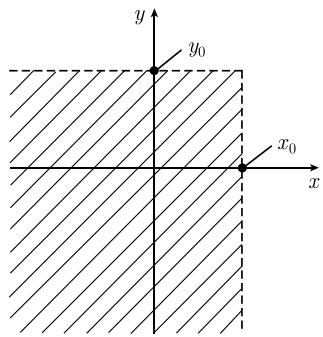
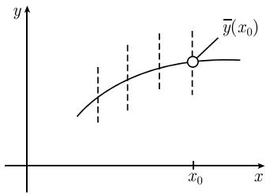

##### 6.2.3 随机向量

在数理统计中, 为了处理一个随机变量的一系列测量 (观测) 值, 必须考虑所有分量 $X_{j}$ 均为随机变量的向量 $(X_{1}, \cdots, X_{n})$ . 直观地说, $X_{j}$ 是 X 在第 j 次试验中的测量值.

6.2.3.1 联合分布

定义 假设 $(E, \mathcal{S}, P)$ 为一个概率空间. $E$ 上的一个随机向量 $(X, Y)$ 就是一个满足条件: 对于任意一对实数 $(x, y)$ , 集合

$$
A _ {x, y} := \{e \in E: X (e) <   x, Y (e) <   y \}
$$

都是事件的函数对 $X, Y: E \rightarrow R$ . 此时, 分布函数

$$
\boxed {\Phi (x, y) := P (X <   x, Y <   y)}
$$

是有明确定义的. 这里, $P(X < x, Y < y)$ 代表 $P(A_{x,y})$ . 我们称上述分布函数为 $X$ 和 $Y$ 的联合分布函数, 或随机向量 $(X,Y)$ 的分布函数.

策略 与前面类似, 我们将对随机向量的研究简化为对分布函数的研究.

分布函数的直观解释 假设平面上赋予了某种使整个平面质量为 1 的质量密度. 分布函数的值 $\Phi(x_0, y_0)$ 表示的是集合

  
图6.13

$$
\left\{(x, y) \in \mathbb {R} ^ {2}: x <   x _ {0}, y <   y _ {0} \right\}
$$

(图 6.13) 所包含的质量．该质量值等于 X 和 Y 的测量值落入相应开区域 $-\infty$ , $x_{0}[$ 且 $]-\infty, y_{0}[$ 内的概率.

定理 随机向量 $(X,Y)$ 的分量 X 和 Y 是随机变量, 其分布函数分别为

$$
\varPhi_ {X} (x) = \lim _ {y \to + \infty} \varPhi (x, y),
$$

$$
\varPhi_ {Y} (y) = \lim _ {x \to + \infty} \varPhi (x, y).
$$

概率密度 若存在一个非负连续函数 $\varphi : \mathbb{R}^2 \to \mathbb{R}$ , 使得 $\int_{\mathbb{R}^2} \varphi(x, y) \mathrm{d}x \mathrm{d}y = 1$ , 且

$$
\Phi (x, y) = \int_ {- \infty} ^ {x} \int_ {- \infty} ^ {y} \varphi (\xi , \eta) \mathrm{d} \xi \mathrm{d} \eta , \quad x, y \in \mathbb {R},
$$

则称 $\varphi$ 为随机向量 $(X,Y)$ 的概率密度, 或随机变量 X 和 Y 的联合概率密度. 此时, 随机变量 X 和 Y 的概率密度分别为

$$
\varphi_ {X} (x) := \int_ {- \infty} ^ {\infty} \varphi (x, y) \mathrm{d} y, \quad \varphi_ {Y} (y) := \int_ {- \infty} ^ {\infty} \varphi (x, y) \mathrm{d} x.
$$

随机向量 $(X_{1},\cdots,X_{n})$ 以上所有讨论都可以很容易地推广到 n 维向量的情形.

6.2.3.2 相互独立的随机变量

定义 设有两个随机变量 $X, Y: E \to \mathbb{R}$ , 若随机向量 $(X, Y)$ 满足如下乘法性质:

$$
\boxed {\text {对于所有的} x, y \in \mathbb {R}, \text {都有} \Phi (x, y) = \Phi_ {X} (x) \Phi_ {Y} (y),}\tag{6.15}
$$

则称随机变量 $X$ 与 $Y$ 是相互独立的. 这里, $\Phi$ , $\Phi_X$ 和 $\Phi_Y$ 分别是 $(X,Y)$ , $X$ 和 $Y$ 的分布函数.

运算法则 若 $X$ 与 $Y$ 是相互独立的随机变量, 则有

(i) $\overline{XY} = \overline{X} \overline{Y}.$

(ii) $(\Delta (X + Y))^{2} = (\Delta X)^{2} + (\Delta Y)^{2}$ .

(iii) X 和 Y 的相关系数 r(见下段) 等于零.

(iv) 若 J 和 K 是实区间, 则

$$
P (X \in J, Y \in K) = P (X \in J) P (Y \in K).
$$

定理 若随机向量 $(X, Y)$ 有连续概率密度 $\varphi$ ，则 X 与 Y 相互独立的充要条件是对于所有的 $x, y \in R$ ，都成立乘积关系式

$$
\boxed {\varphi (x, y) = \varphi_ {X} (x) \varphi_ {Y} (y).}
$$

随机量的相依性 在实际应用中, 人们经常会怀疑两个给定的随机变量 $X$ 与 $Y$ 之间有某种相依性. 关于这一点, 有两种数学方法可以检验实际情况是否果真如此. 这两种方法分别是:

(i) 使用相关系数 (见 6.2.3.3).

(ii) 使用回归直线 (见 6.2.3.4).

6.2.3.3 相依随机变量及相关系数

定义 1 设 $(X,Y)$ 为随机向量, 则称

$$
\operatorname{Cov} (X, Y) := \overline {{(X - \overline {{X}}) (Y - \overline {{Y}})}}
$$

为 X 与 Y 的协方差, 并称

$$
\boxed {r := \frac {\operatorname{Cov} (X , Y)}{\Delta X \Delta Y}}
$$

为 X 与 Y 的相关系数. 对于相关系数 r, 总成立关系式 $-1 \leqslant r \leqslant 1$ .

定义 2 $r^{2}$ 越大, X 与 Y 的相关性越强.

解决方案 最小化问题

$$
\boxed {\overline {{(Y - a - b X) ^ {2}}} \stackrel {!} {=} \min., \quad a, b \in \mathbb {R}}
$$

的解是所谓的回归直线:

$$
\overline {{Y}} + r \frac {\Delta Y}{\Delta X} (X - \overline {{X}}),
$$

且此时上述问题的最小值为 $(\Delta Y)^{2}(1-r^{2})$ (见 6.1.5 的讨论).

对于协方差, 我们有

$$
\boxed {\operatorname{Cov} (X, Y) := \int_ {E} (X (e) - \overline {{X}}) (Y (e) - \overline {{Y}}) \mathrm{d} P = \int_ {\mathbb {R} ^ {2}} (x - \overline {{X}}) (y - \overline {{Y}}) \mathrm{d} \varPhi ,}
$$

其中, $\Phi$ 是 X 和 Y 的联合分布函数.

例 1 (离散型随机变量): 若 $(X,Y)$ 只取有限多个值 $(x_{j},y_{k})$ ，且相应概率 $p_{jk} := P(X = x_{j}, Y = y_{k}), j = 1, \cdots, n, k = 1, \cdots, m,$ 则

$$
\operatorname{Cov} (X, Y) = \sum_ {j = 1} ^ {n} \sum_ {k = 1} ^ {m} (x _ {j} - \overline {{X}}) (y _ {k} - \overline {{Y}}) p _ {j k},
$$

其中，

$$
\overline {{X}} = \sum_ {j = 1} ^ {n} x _ {j} p _ {j}, \quad (\Delta X) ^ {2} = \sum_ {j = 1} ^ {n} \left(x _ {j} - \overline {{X}}\right) ^ {2} p _ {j}, \quad p _ {j} := \sum_ {k = 1} ^ {m} p _ {j k},
$$

$$
\overline {{Y}} = \sum_ {k = 1} ^ {m} y _ {k} q _ {k}, \quad (\Delta Y) ^ {2} = \sum_ {k = 1} ^ {m} \left(y _ {k} - \overline {{Y}}\right) ^ {2} q _ {k}, \quad q _ {k} := \sum_ {j = 1} ^ {n} p _ {j k}.
$$

例 2: 若 $(X,Y)$ 有连续概率密度 $\varphi$ ，则 $\operatorname{Cov}(X,Y)$ 和 r 可以用 6.1.5 中所述的方法进行计算.

协方差阵 若 $(X_{1},\cdots,X_{n})$ 是一个给定的随机向量,

$$
\boxed {c _ {j k} := \operatorname{Cov} (X _ {j}, X _ {k}), \quad j, k = 1, \dots , n,}
$$

则称 $n \times n$ 的矩阵 $C = (c_{jk})$ 为 $(X_{1}, \cdots, X_{n})$ 的协方差阵. 任何一个随机向量的协方差阵都是对称矩阵, 且其所有特征值都非负.

解释 (i) $c_{jj} = (\Delta X_j)^2, j = 1, \cdots, n.$

(ii) 当 $j \neq k$ 时, 数

$$
r _ {j k} ^ {2} := \frac {c _ {j k} ^ {2}}{c _ {j j} c _ {k k}}
$$

是 $X_{j}$ 和 $X_{k}$ 的相关系数的平方.

(iii) 若 $X_{1}, \cdots, X_{n}$ 相互独立，则对于所有的 $j \neq k$ ，都有 $c_{jk} = 0$ ，即 $(X_{1}, \cdots, X_{n})$ 的协方差阵为对角矩阵，且其主对角线元素依次为各随机变量的方差。

广义高斯分布 假设 A 是 $n \times n$ 的实对称正定矩阵。若随机向量 $(X_{1}, \cdots, X_{n})$ 的概率密度为

$$
\boxed {\varphi (\boldsymbol {x}) := K \mathrm{e} ^ {- Q (\boldsymbol {x}, \boldsymbol {x})}, \quad \boldsymbol {x} \in \mathbb {R} ^ {n},}
$$

其中， $Q(\boldsymbol{x},\boldsymbol{x}):=\frac{1}{2}\boldsymbol{x}^{\mathrm{T}}\boldsymbol{A}\boldsymbol{x},K^{2}:=\frac{\det\boldsymbol{A}}{(2\pi)^{n}}$ ，则称 $(X_{1},\cdots,X_{n})$ 服从协方差阵为

$$
\boxed {(\operatorname{Cov} (X _ {j}, X _ {k})) = \boldsymbol {A} ^ {- 1},}
$$

而且对于所有的 j, 期望 $\overline{X_{j}} = 0$ 的广义高斯分布.

若 $A = \text{diag}(\lambda_{1}, \cdots, \lambda_{n})$ 是特征值为 $\lambda_{j}$ 的对角矩阵，则随机变量 $X_{1}, \cdots, X_{n}$ 相互独立。进一步地，有

$$
\operatorname{Cov} (X _ {j}, X _ {k}) = {\left\{ \begin{array}{l l} {(\Delta X _ {j}) ^ {2} = \lambda_ {j} ^ {- 1},} & {{\text {当}} j = k {\text {时}},} \\ {0,} & {{\text {当}} j \neq k {\text {时}}.} \end{array} \right.}
$$

6.2.3.4 两个随机变量间的相关曲线

条件分布 假设 $(X,Y)$ 是一个随机向量. 我们固定一个实数值 $x$ , 并规定

$$
\text {对于所有的} y \in \mathbb {R},   \Phi_ {x} (y) := \lim _ {h \to + 0} \frac {P (x \leqslant X <   x + h , Y <   y)}{P (x \leqslant X <   x + h)}.
$$

若上述极限存在, 则称 $\Phi_x$ 为在 $X = x$ 的条件下, 随机变量 $Y$ 的条件分布.

相关曲线(回归曲线) 曲线

$$
\boxed {\overline {{y}} (x) := \int_ {- \infty} ^ {\infty} y \mathrm{d} \varPhi_ {x} (y)}
$$

称为随机变量 Y 关于随机变量 X 的相关曲线(或回归曲线).

解释 数 $\overline{y}(x)$ 是在 X = x 的假设下 Y 的期望值 (图 6.14). 如果在 $x = x_{0}$ 处, Y 有观测值 $y_{1}, \cdots, y_{n}$ , 则可取

  
图6.14

$$
\frac {y _ {1} + \cdots + y _ {n}}{n}
$$

作为 $\overline{y}(x_{0})$ 的观测值 (图 6.14).

概率密度 若 $(X,Y)$ 具有连续概率密度 $\varphi$ ，则有

$$
\varPhi_ {x} (y) = \frac {\int_ {- \infty} ^ {y} \varphi (x , \eta) \mathrm{d} \eta}{\int_ {- \infty} ^ {\infty} \varphi (x , y) \mathrm{d} y},
$$

以及

$$
\boxed {\overline {{y}} (x) = \frac { \int_ {- \infty} ^ {\infty} y \varphi (x , y) \mathrm{d} y}{ \int_ {- \infty} ^ {\infty} \varphi (x , y) \mathrm{d} y}.}
$$
