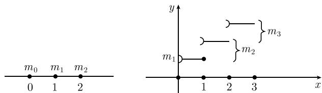

##### 6.2.5 应用于独立重复试验的伯努利模型

雅各布·伯努利提出并研究了下面的模型. 该模型可广泛应用于许多情形, 是概率论中最重要的模型之一. 特别地, 利用它可以得到理论概率与频率之间的关系.

6.2.5.1 基本思想

直观情形 (i) 首先做一个试验 (比较试验或基本试验), 它有两个可能结果

$$
\boxed {e _ {1}, e _ {2}.}
$$

假设结果 $e_j$ 出现的概率是 $p_j$ . 进一步地, 我们规定 $p := p_1$ , 于是 $p_2 = 1 - p$ . 称 $p$ 为该基本试验的概率.

(ii) 现在将这个试验进行 n 次.

(iii) 所有这些试验相互独立, 也就是说它们的结果彼此互不影响.

例：将一枚硬币抛一次的试验是一个基本试验，其中 $e_1$ 表示“正面向上”，而 $e_2$ 表示“反面向上”。如果 $p = 1 / 2$ ，我们认为这枚硬币是公平的；如果 $p \neq 1 / 2$ ，则它显然不是一枚公平的硬币。在6.2.5.5中，我们将说明如何通过分析评价一系列试验揭露一个使用不公平硬币行骗的骗子。

6.2.5.2 概率模型

概率空间 全部事件 E 由基本事件

$$
\boxed {e _ {i _ {1} i _ {2} \dots i _ {n}}, \quad i _ {j} = 1, 2, j = 1, \dots , n}
$$

组成, 且相应概率为

$$
\boxed {P (e _ {i _ {1} i _ {2} \dots i _ {n}}) := p _ {i _ {1}} p _ {i _ {2}} \dots p _ {i _ {n}}.}\tag{6.18}
$$

解释 $e_{121}$ 表示该试验序列的结果依次为 $e_{1}, e_{2}, e_{1}, \cdots$ 例如, $P(e_{121}) = p(1 - p)p = p^{2}(1 - p)$ .

试验的独立性 我们定义事件

$A_{i}^{(k)}$ ：事件 $e_{i}$ 在第 k 次试验中发生，

则对于所有可能的下标 $i_{1},\cdots,i_{n}$ ，事件

$$
A _ {i _ {1}} ^ {(1)}, A _ {i _ {2}} ^ {(2)}, \dots , A _ {i n} ^ {(n)}
$$

相互独立.

证明: 考虑 n = 2 的特殊情形. 事件 $A_{i}^{(1)} = \{e_{i1}, e_{i2}\}$ 由基本事件 $e_{i1}$ 和 $e_{i2}$ 组成. 因此,

$$
P (A _ {i} ^ {(1)}) = P (e _ {i 1}) + P (e _ {i 2}) = p _ {i} p _ {1} + p _ {i} p _ {2} = p _ {i}.
$$

因为 $A_{j}^{(2)} = \{e_{1j}, e_{2j}\}$ , 所以我们有 $A_{i}^{(1)} \cap A_{j}^{(2)} = \{e_{ij}\}$ . 由 (6.18), 有 $P(e_{ij}) = p_i p_j$ . 又由于 $P(A_{i}^{(1)}) P(A_{j}^{(2)}) = p_i p_j$ , 所以

$$
P \left(A _ {i} ^ {(1)} \cap A _ {j} ^ {(2)}\right) = P \left(A _ {i} ^ {(1)}\right) P \left(A _ {j} ^ {(2)}\right).
$$

这就是我们所需要的独立事件所满足的概率乘法性质．因此 $A_{i}^{(1)}$ 与 $A_{j}^{(2)}$ 相互独立. □

作为 $E$ 上的一个随机变量的频率 由

$$
\boxed {H _ {n} \left(e _ {i _ {1}} \dots e _ {i _ {n}}\right) = \frac {1}{n} \cdot (e \dots \text {的等于} 1 \text {的脚标个数})}
$$

定义一个函数 $H_{n}: E \rightarrow R$ . 则 $H_{n}$ 是事件 $e_{1}$ 在试验序列中发生的频率 (例如在抛硬币试验中 “正面向上” 发生的频率).

我们的任务是研究随机变量 $H_{n}$ .

定理 1 (i) 对于 $k = 0, \cdots, n$ ，有 $\left(H_{n} = \frac{k}{n}\right) = \binom{n}{k} p^{k}(1 - p)^{n - k}$ .

(ii) $\overline{H}_n = p$ (期望).

(iii) $\Delta H_{n} = \frac{\sqrt{p(1 - p)}}{\sqrt{n}}$ (标准差).

(iv) $P(|H_n - p| \leqslant \varepsilon) \geqslant 1 - \frac{p(1 - p)}{n\varepsilon^2}$ (切比雪夫不等式).

在 (iv) 中, 数 $\varepsilon > 0$ 必须充分小. 我们将会看到, 当试验次数 $n$ 增大时, 频率与期望值的差会变得越来越小. 这个期望值就是 $e_1$ 在这个比较试验中发生的概率 $p$ . 如上所述, 在硬币公平的情形, $p = 1/2$ .

雅各布·伯努利(Jacob Bernoulli, 1654—1705) 最早考虑了这个概率模型. (i) 中给出的概率计算公式使用起来不方便. 为了解决这个问题, 棣莫弗 (de Moivre, 1667—1754)、拉普拉斯 (Laplace, 1749—1827) 和泊松(Poisson, 1781—1840) 都曾经尝试寻找适当的逼近公式 (见 6.2.5.3). 切比雪夫 (Chebychev, 1821—1894) 不等式对于任意的随机变量都成立.

频数 函数 $A_{n} := nH_{n}$ 刻画事件 $e_{1}$ 在试验序列中出现的次数 (例如在一系列抛硬币试验中得到 “正面向上” 的总次数).

定理 2 (i) 对于 $k=0,\cdots,n$ , $P(A_{n}=k)=P\left(H_{n}=\frac{k}{n}\right)=\binom{n}{k}p^{k}(1-p)^{n-k}$ .

(ii) $\overline{A}_{n}=n\overline{H}_{n}=np$ (期望).

(iii) $\Delta A_{n} = \sqrt{np(1-p)}$ (标准差).

示性函数 利用如下规则

$$
X _ {j} (e _ {i _ {1} \ldots i _ {n}}) = {\left\{ \begin{array}{l l} {1,} & {{\text {若}} i _ {j} = 1,} \\ {0,} & {{\text {其他}}} \end{array} \right.}
$$

定义一个随机变量 $X_{j}: E \to \mathbb{R}$ . 于是, $X_{j}$ 等于1当且仅当 $e_{1}$ 在第 $j$ 次试验中发生.

定理 3 (i) $P(X_{j}=1)=p.$

(ii) $\overline{X}_{j}=p,\Delta X_{j}=\sqrt{p(1-p)}.$

(iii) $X_{1}, \cdots, X_{n}$ 相互独立.

(iv) $H_{n} = \frac{1}{n} (X_{1} + \cdots + X_{n})$ .

(v) $A_{n} = X_{1} + \cdots + X_{n}.$

于是, 频数 $A_{n}$ 是一些可以同样处理的独立随机变量的叠加. 因此, 考虑到中心极限定理, 我们预期当 $n$ 很大时, $A_{n}$ 近似服从正态分布. 这就是棣莫弗-拉普拉斯定理的内容.

6.2.5.3 逼近定理

大数定律 (伯努利) 对于任意的 $\varepsilon > 0$ , 我们都有

$$
\boxed {\lim _ {n \to \infty} P (| H _ {n} - p | <   \varepsilon) = 1.}\tag{6.19}
$$

雅各布·伯努利通过大量计算发现了这条定律. 事实上, (6.19) 可由切比雪夫不等式(6.2.5.2 中的定理 1) 得到.

如果利用 6.2.5.2 中定理 3 的结论 (iv), 则 (6.19) 是切比雪夫弱大数定律(见 6.2.4.1) 的一种特殊情况.

棣莫弗-拉普拉斯局部极限定理 当 $n \to \infty$ 时, 关于频数有如下渐近关系式

$$
\boxed {P (A _ {n} = k) \sim \frac {1}{\sigma \sqrt {2 \pi}} \mathrm{e} ^ {- (k - \mu) ^ {2} / 2 \sigma^ {2}}}\tag{6.20}
$$

其中， $\mu=\overline{A}_{n}=np,\sigma=\Delta A_{n}=\sqrt{np(1-p)}.$

这意味着, 对于每个 $k = 0, 1, \cdots$ , 当 $n \to \infty$ 时, (6.20) 式两边表达式商的极限是 $1^{1)}$ .

现在我们研究频率

$$
\mathcal {H} _ {n} := \frac {H _ {n} - \overline {{H}} _ {n}}{\Delta H _ {n}}.
$$

显然, 我们有 $\overline{\mathcal{H}}_n = 0, \Delta \mathcal{H}_n = 1$ . 我们用 $\Phi_n$ 表示 $\mathcal{H}_n$ 的分布函数. 假设 $\Phi$ 是均值 $\mu = 0$ , 标准差 $\sigma = 1$ 的标准高斯正态分布 $N(0,1)$ 的分布函数. 标准化的频数

$$
\mathcal {A} _ {n} := \frac {A _ {n} - \overline {{A}} _ {n}}{\Delta A _ {n}}
$$

等于标准化的频率 $H_{n}$ . 因此, $A_{n}$ 的分布函数也是 $\Phi_{n}$ .

棣莫弗-拉普拉斯全面极限定理 $^{2)}$ 对于所有的 $x \in R$ ，均有

$$
\lim _ {n \to \infty} \varPhi_ {n} (x) = \varPhi (x).
$$

对于所有的区间 $[a, b]$ , 可以由此得到等式

$$
\lim _ {n \rightarrow \infty} P (a \leqslant \mathscr {H} _ {n} \leqslant b) = \frac {1}{\sqrt {2 \pi}} \int_ {a} ^ {b} \mathrm{e} ^ {- z ^ {2} / 2} \mathrm{d} z.\tag{6.22}
$$

事实上, 还有一个非常精确的估计式:

$$
\sup _ {x \in \mathbb {R}} | \Phi_ {n} (x) - \Phi (x) | \leqslant \frac {p ^ {2} + (1 - p) ^ {2}}{\sqrt {n p (1 - p)}}, \quad n = 1, 2, \dots .\tag{6.23}
$$

注 当 $n$ 较大时, 频率近似服从期望 $\overline{H}_n = p$ , 标准差 $\Delta H_n = \sqrt{p(1 - p) / n}$ 的正态分布. 因此, 当 $n$ 较大时, 对于每个区间 $[a, b]$ , 有如下重要关系式:

$$
\boxed {P (p + a \Delta H _ {n} \leqslant H _ {n} \leqslant p + b \Delta H _ {n}) = \Phi_ {0} (b) - \Phi_ {0} (a) = \frac {1}{\sqrt {2 \pi}} \int_ {a} ^ {b} \mathrm{e} ^ {- z ^ {2} / 2} \mathrm{d} z.}\tag{6.24}
$$

1) 为了证明这个结果, 住在伦敦的 A. 棣莫弗(de Moivre, 1667—1754) 在 n 的值很大时, 使用了近似公式

$$
n! = C \sqrt {n} \left(\frac {n}{\mathrm{e}}\right) ^ {n}, \quad n \to \infty ;\tag{6.21}
$$

其中 C 的值近似为 $C \approx 2.5047$ . 当棣莫弗向斯特林(Stirling, 1692—1770) 寻求帮助时, 斯特林发现 C 的精确值为 $C = \sqrt{2\pi}$ . 相应公式 (6.21) 称为斯特林公式.

2) 棣莫弗在 $p = 1/2$ 和对称边界 $b = -a$ 的情形发现了这个公式. 拉普拉斯在其 1812 年出版的重要著作《分析概率论》(Théorie analytique des probabilités) 中证明了这里给出的一般公式.

上式左边是频率 $H_{n}$ 的观测值落在区间 $[p + a\Delta H_n, p + b\Delta H_n]$ 内的概率. 这个式子给出了伯努利大数定律的一个精确表述.

$\Phi_0$ 的值可以在表0.34中查到.

当 z 取负值时, 有 $\Phi_{0}(z) = -\Phi_{0}(-z)^{*}$ .

公式 (6.24) 等价于

$$
P (x \leqslant H _ {n} \leqslant y) = \Phi_ {0} \left(\frac {y - p}{\Delta H _ {n}}\right) - \Phi_ {0} \left(\frac {x - p}{\Delta H _ {n}}\right).
$$

因为 $A_{n} = nH_{n}$ ，所以频数 $A_{n}$ 满足关系式

$$
\boxed {P (u \leqslant A _ {n} \leqslant v) = \Phi_ {0} \left(\frac {v - n p}{\sqrt {n p (1 - p)}}\right) - \Phi_ {0} \left(\frac {u - n p}{\sqrt {n p (1 - p)}}\right).}
$$

这里， $-\infty < x < y < \infty, -\infty < u < v < \infty.$

比较试验中的小概率 p 若概率 p 非常小, 则公式 (6.23) 告诉我们, 只有当 n 非常大时, 用正态分布逼近 $\Phi_{n}$ 才有效. S. D. 泊松 (Poisson, 1781—1840) 发现, 当 p 的值较小时, 有一个更好的逼近公式.

泊松分布的定义 假设我们在实数轴上的点 $x = 0, 1, 2, \cdots$ 处分别赋予质量 $m_{0}, m_{1}, \cdots$ ，其中

$$
\boxed {m _ {r} := \frac {\lambda^ {r}}{r !} \mathrm{e} ^ {- \lambda}, \quad r = 0, 1, \dots ,}
$$

这里, $\lambda > 0$ 是参数. 则相应质量分布函数

$$
\varPhi (x) := \text { 区间 } ] - \infty , x [ \text { 所包含的质量 }
$$

称为泊松分布函数(图 6.15).

  
图 6.15 泊松分布函数

定理 如果随机变量 X 服从上述泊松分布 (即 X 的分布函数是上述泊松分布函数), 则有

$$
\overline {{{{X}}}} = \lambda (\text {均值}), \quad \Delta X = \sqrt {\lambda} (\text {标准差}).
$$

泊松逼近定理 (1837) 如果比较试验的概率 $p$ 非常小, 则对于频数 $A_{n}$ , 近似有

$$
\text {(i)} P (A _ {n} = r) = \frac {\lambda^ {r}}{r !} \mathrm{e} ^ {- \lambda}, \text {其中} \lambda = n p, r = 0, 1, \dots , n.
$$

(ii) $A_{n}$ 的分布函数 $\Phi_n$ 近似等于参数 $\lambda = np$ 的泊松分布的分布函数. 更精确地, 有估计式

$$
\sup _ {x \in \mathbb {R}} | \Phi_ {n} (x) - \Phi (x) | \leqslant 3 \sqrt {\frac {\lambda}{n}}.
$$

$$
\boxed {\frac {\lambda^ {r}}{r !} \mathrm{e} ^ {- \lambda} \text {的值可以在} 0. 4. 6. 9 \text {中查到}.}
$$

6.2.5.4 在质量控制中的应用

假设某工厂生产一种产品 $\mathcal{P}$ (如灯泡), 而且 P 是次品的概率非常小, 设此概率为 $p$ (例如 p = 0.001). 我们进一步假设在一个运输集装箱中装有 n 件这种产品.

(i) 根据 6.2.5.2 中给出的模型, 集装箱中恰好装有 r 件次品的概率为

$$
P (A _ {n} = r) = \binom{n}{r} p ^ {r} (1 - p) ^ {n - r}.
$$

(ii) 集装箱中的次品数介于 k 和 m 之间的概率为

$$
P (k \leqslant A _ {n} \leqslant m) = \sum_ {r = k} ^ {m} P (A _ {n} = r).
$$

近似 现在我们希望给出计算上面这些概率的实用近似公式. 为此, 注意到 $p$ 很小, 因此可以采用泊松逼近, 即有

$$
P (A _ {n} = r) = \frac {\lambda^ {r}}{r !} \mathrm{e} ^ {- \lambda},
$$

其中 $\lambda = np.$ 泊松分布的数值表见 0.4.6.9.

例 1：假设在集装箱中装有 1000 只灯泡，而且一只灯泡为次品的概率 p = 0.001。由 0.4.6.9，以及 $\lambda = np = 1$ ，得到

$$
\begin{array}{l} P (A _ {1 0 0 0} = 0) = 0. 3 7, \\ P (A _ {1 0 0 0} = 1) = 0. 3 7, \quad P (A _ {1 0 0 0} = 2) = 0. 1 8. \end{array}
$$

由此可得

$$
P (A _ {1 0 0 0} \leqslant 2) = 0. 3 7 + 0. 3 7 + 0. 1 8 = 0. 9 2.
$$

因此, 集装箱中无残次灯泡的概率为 0.37(37%); 集装箱中至多有两只残次灯泡的概率为 0.92.

若 $n$ 充分大, 则可以假设 $A_{n}$ 服从正态分布. 由 (6.24) 以及紧接其后的等式, 可以得到

$$
\boxed {P (k \leqslant A _ {n} \leqslant m) = \Phi_ {0} \left(\frac {m - n p}{\sqrt {n p (1 - p)}}\right) - \Phi_ {0} \left(\frac {k - n p}{\sqrt {n p (1 - p)}}\right).}
$$

$\Phi_{0}$ 的值可以在表 0.34 中查到.

例 2: 现在, 假设一只灯泡为次品的概率是 0.005. 那么在装载的 10 000 只灯泡中至多有 100 只次品的概率为 $^{1)}$

$$
P (A _ {1 0 0 0 0} \leqslant 1 0 0) = \Phi_ {0} (7) - \Phi_ {0} (- 7) = 2 \Phi_ {0} (7) = 1.
$$

因此, 几乎可以肯定在这 10 000 只灯泡中至多有 100 只残次灯泡.

6.2.5.5 在假设检验中的应用

我们的目标是只通过对一个实验的试验观测, 揭露使用不均匀硬币行骗的骗子. 为此, 我们使用数理统计中一个典型的数学论证方法. 就目前情况而言, 数理统计的主要特性之一是, 它认为 “揭露一个骗子” 只能在一定的残概率 (比方说 $\alpha$ ) 下才能进行. 这里所说的残概率是指所作结论不正确的概率\*. 对于 $\alpha = 0.05$ , 这意味着, 如果我们试图揭露一个骗子 100 次, 那么平均来说我们大约会有 5 次作出错误的结论, 此时我们会把一个无辜的人当成骗子.

揭露一枚不公平硬币（抛币者）的试验 将一枚硬币抛 $n$ 次，观察“正面向上出现 $k$ 次”这一事件. 我们称 $h_n = k / n$ 为随机变量 $H_{n}$ (频率) 的实现. 我们用 $p$ 来表示在一次试验中正面向上出现的概率. 现在我们作如下假设：

(H) 硬币是公平的, 即 p = 1/2.

数理统计基本原理 如果

$$
\left| h _ {n} \text {不在置信区间} \left[ \frac {1}{2} - z _ {\alpha} \Delta H _ {n}, \frac {1}{2} + z _ {\alpha} \Delta H _ {n} \right] \text {内,} \right|\tag{6.25}
$$

我们便以残概率 $\alpha$ 放弃假设 (H). 这里 $\Delta H_{n} := 1 / 2\sqrt{n}$ , 而 $z_{\alpha}$ 的值则根据等式 $2\Phi_{0}(z_{\alpha}) = 1 - \alpha$ , 并查表 0.34 确定. 对于 $\alpha = 0.01$ (或者 0.05 和 0.1), 我们有 $z_{\alpha} = 1.6$ (相应地 2.0 和 2.6).

推理 根据 (6.24), 当 $n$ 的值很大时, 理论量 $H_{n}$ 的实测值 $h_n$ 落入 (6.25) 给出的置信区间的概率是

$$
\varPhi_ {0} (z _ {\alpha}) - \varPhi_ {0} (- z _ {\alpha}) = 1 - \alpha .
$$

如果 $H_{n}$ 的实测值没有落入上述置信区间, 那么就放弃假设 (H). 这时, 作出错误结论的概率是 $\alpha^{*}$

例: 当抛硬币的次数 n = 10 000 时, 我们有 $\Delta H_{n} = 1/200 = 0.05$ . 于是, 相应于残概率 $\alpha = 0.05$ 的置信区间是

$$
[ 0. 4 9, 0. 5 1 ].\tag{6.26}
$$

如果抛了 10 000 次硬币, 其中有 5200 次是 “正面向上”, 那么 $h_{n} = 0.52$ . 这个值落在置信区间 (6.26) 之外, 因此我们以 0.05 的出错概率下结论说: 这枚硬币不公平.

另一方面, 如果抛了 10 000 次硬币, 其中 “正面向上” 出现了 5050 次, 那么 $h_{n}=0.505$ , 因为 $h_{n}$ 落在置信区间 (6.26) 中, 所以我们相信硬币其实是公平的. 这个结论正确的概率是 95%, 错误的概率 $\alpha=0.05^{**}$

6.2.5.6 关于概率 $p$ 的置信区间的应用

考虑一枚硬币. 假设 $p$ 是在一次比较试验中出现“正面向上”的概率. 将此硬币抛 $n$ 次, 并观测“正面向上”出现的频率 $h_n$ . 现在, 我们认为 $p$ 是未知的, 因此希望以一定的置信度确定它的值.

数理统计基本原理 在错误概率 $\alpha$ 下, 假定未知的 p 值落在区间

$$
\boxed {[ p _ {-}, p _ {+} ]}
$$

内. 这里, 有 $^{1)}$

$$
\left(1 + \frac {z _ {\alpha} ^ {2}}{n}\right) p _ {\pm} = h _ {n} + \frac {z _ {\alpha} ^ {2}}{2 n} \pm \sqrt {\frac {h _ {n} z _ {\alpha} ^ {2}}{n} + \frac {z _ {\alpha} ^ {2}}{4 n ^ {2}}} .
$$

一般来说, 对于 6.2.5.2 中伯努利模型的概率 $p$ 的估计, 这个结论是正确的. 推理 由 (6.24) 可知, 当 $n$ 的值较大时, 不等式

$$
\left| \frac {h _ {n} - p}{\Delta H _ {n}} \right| <   z _ {\alpha}\tag{6.27}
$$

成立的概率为 $\Phi_{0}(z_{\alpha}) - \Phi_{0}(-z_{\alpha}) = 1 - \alpha.$ 由于 $(\Delta H_{n})^{2} = p(1 - p)/n,$ 所以 (6.27) 等价于

$$
(h _ {n} - p) ^ {2} <   z _ {\alpha} ^ {2} \frac {p (1 - p)}{n},
$$

也就是

$$
p ^ {2} \left(1 + \frac {z _ {\alpha} ^ {2}}{n}\right) - \left(2 h _ {n} + \frac {z _ {\alpha} ^ {2}}{n}\right) p + h _ {n} ^ {2} <   0.\tag{6.28}
$$

当且仅当 p 的值介于相应二次方程

$$
p ^ {2} \left(1 + \frac {z _ {\alpha} ^ {2}}{n}\right) - \left(2 h _ {n} + \frac {z _ {\alpha} ^ {2}}{n}\right) p + h _ {n} ^ {2} = 0
$$

的两个根 $p_{-}$ 和 $p_{+}$ 之间时, 不等式 (6.28) 成立.

例: 将一枚硬币抛 10 000 次, 假设 “正面向上” 出现了 5010 次, 则 $h_{n}=0.501$ , 正面向上的未知概率 p 落在区间 [0.36, 0.64] 中, 其残概率 $\alpha=0.05$ .

然而, 这个估计还是十分粗糙的. 若将一枚硬币抛掷 10 000 次, 得到正面向上的频率为 0.501, 则我们可以在相同的残概率 $\alpha = 0.05$ 下断定 $p$ 的值落在区间 [0.500, 0.503] 内.

6.2.5.7 强大数定律

无穷多重试验 前面已经考虑了 $n$ 重伯努利试验. 为了系统阐述强大数定律, 我们需要将试验重数增加到无穷大.

考虑由基本事件

$$
\boxed {e _ {i _ {1} i _ {2}} \dots}
$$

组成的全体事件 E, 其中每个 $i_{j}$ 的值都等于 1 或 2. 符号 $e_{12}$ 表示在第一次试验中 $e_{1}$ 发生, 在第二次试验中 $e_{2}$ 发生 …… 我们用 $A_{i_{1} \ldots i_{n}}$ 表示由所有形如 $e_{i_{1} \ldots i_{n}}$ 的基本事件组成的集合, 并规定

$$
\boxed {P (A _ {i _ {1} i _ {2} \dots i _ {n}}) = p _ {i _ {1} i _ {2} \dots i _ {n}},}\tag{6.29}
$$

其中 $p_1 := p, p_2 := 1 - p$ (见 (6.18)). 我们用 $\mathcal{S}$ 表示对于所有的 $n$ , 包含一切集合 $A_{i_1 \ldots i_n}$ 的 $E$ 的最小 $\sigma$ 域.

定理 在 $\mathcal{S}$ 的子集上存在满足性质 (6.29) 的唯一确定的概率测度 $P$ . 于是, $(E, \mathcal{S}, P)$ 是一个概率空间.

频率 我们通过

$$
H _ {n} (e _ {i _ {1} \ldots i _ {n} \ldots}) = {\frac {1}{n}} \times (e \text {的满足} i _ {j} = 1 \text {且} 1 \leqslant j \leqslant n \text {的脚标} i _ {j} \text {的个数})
$$

定义随机变量 $H_{n}: E \rightarrow R$ .

博雷尔 (1909)-坎泰利 (1917) 强大数定律 在 $E$ 上几乎必然成立 $^{1)}$ 极限关系式

$$
\boxed {\lim _ {n \to \infty} H _ {n} = p.}
$$
