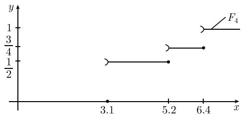
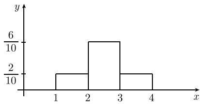

##### 6.3.4 经验分布函数

随机变量的经验分布函数是其真实分布函数的一个近似. 数理统计主定理精确描述了这一结果.

6.3.4.1 数理统计主定理及分布函数的科尔莫戈罗夫检验

定义 假设给定了随机变量 X 的观测值 $x_{1}, x_{2}, \cdots, x_{n}$ . 规定

$$
\boxed {F _ {n} (x) := \frac {1}{n} \cdot (\text {小于} x \text {的观测值的个数}),}
$$

并称阶梯函数 $F_{n}$ 为经验分布函数.

例：假定我们的观测值为 $x_{1} = x_{2} = 3.1, x_{3} = 5.2, x_{4} = 6.4$ 。则经验分布函数为（见图6.17）

$$
F _ {n} (x) = \left\{ \begin{array}{l l} 0, & x \leqslant 3. 1, \\ \frac {1}{2}, & 3. 1 <   x \leqslant 5. 2, \\ \frac {3}{4}, & 5. 2 <   x \leqslant 6. 4, \\ 1, & x > 6. 4. \end{array} \right.
$$

  
图 6.17 经验分布函数

随机变量X 的经验分布函数 $F_{n}$ 与其真实分布函数 $\Phi$ 之间的差异由

$$
d _ {n} := \sup _ {x \in \mathbb {R}} | F _ {n} (x) - \Phi (x) |
$$

来度量.

数理统计主定理 (格利文科 (Glivenko), 1933)

$$
\boxed {\lim _ {n \to \infty} d _ {n} = 0}
$$

几乎必然成立.

科尔莫戈罗夫-斯米尔诺夫定理 对于所有实数 $\lambda$ , 都有

$$
\lim _ {n \to \infty} P (\sqrt {n} d _ {n} <   \lambda) = Q (\lambda),
$$

其中 $Q(\lambda) := \sum_{k=-\infty}^{\infty} (-1)^{k} e^{-2k^{2}\lambda^{2}}.$

科尔莫戈罗夫-斯米尔诺夫检验 选择一个分布函数 $\Phi : \mathbb{R} \to \mathbb{R}$ . 如果

$$
\boxed {\sqrt {n} d _ {n} > \lambda_ {\alpha},}
$$

便拒绝认为 $\Phi$ 是 X 的分布函数, 这时, 犯错误的概率为 $\alpha$ .

这里, $\lambda_{\alpha}$ 是方程 $Q(\lambda_{\alpha}) = 1 - \alpha$ 的一个解, 其值可由 0.4.6.8 查得.

若 $\sqrt{n} d_n \leqslant \lambda_\alpha$ ，则认为观测结果与 $\Phi$ 是 $X$ 的分布函数的假设不矛盾，因此接受这个假设，这时犯错误的概率为 $\alpha$ .\*

只有当观测值的个数 $n$ 充分大时，才能使用科尔莫戈罗夫-斯米尔诺夫检验。而且，当分布函数依赖于某些参数，而这些参数本身又必须通过这些观测值才能估计时，也不能采用科尔莫戈罗夫-斯米尔诺夫检验。这时，可以使用 $\chi^2$ 检验（见6.3.4.4）。

对于均匀分布情形的应用 假设给定了随机变量 X, 其值为 $a_{1} < a_{2} < \cdots < a_{k}$ ，而且 X 服从均匀分布，即 X 取每个值 $a_{j}$ 的概率均为 $\frac{1}{k}$ 。对于这种情形，科尔莫戈罗夫-斯米尔诺夫检验步骤如下：

(i) 确定观测值 $x_{1}, x_{2}, \cdots, x_{n}$ .

(ii) 设落入区间 $[a_{r}, a_{r+1}]$ 内的观测值的个数为 $m_{r}$ .

(iii) 给定错误概率 $\alpha$ ，由表 0.4.6.8 确定满足 $Q(\lambda_{\alpha}) = 1 - \alpha$ 的 $\lambda_{\alpha}$ 的值.

(iv) 计算检验量

$$
d _ {n} := \max _ {r = 1, \dots , k} \left| \frac {m _ {r}}{n} - \frac {1}{k} \right|.
$$

统计说明 若 $\sqrt{n}d_{n} > \lambda_{\alpha}$ ，则拒绝 X 服从均匀分布的假设，此时犯错误的概率为 $\alpha$ .

如果 $\sqrt{n} d_n \leqslant \lambda_\alpha$ ，则我们接受 $X$ 服从均匀分布的假设，此时犯错误的概率为 $\alpha$ .\*

检验一个抽彩装置 将分别标有数字 $r = 1, \cdots, 6$ 的 6 个球放入一个摸彩装置, 并进行 600 次摸彩试验, 在这 600 次试验中摸到标有数 r 的球的次数 $m_{r}$ 见表 6.7.

表 6.7 观测到的次数

<table><tr><td>r</td><td>1</td><td>2</td><td>3</td><td>4</td><td>5</td><td>6</td></tr><tr><td> $m_r$ </td><td>99</td><td>102</td><td>101</td><td>103</td><td>98</td><td>97</td></tr></table>

假设 $\alpha = 0.05$ . 由 $Q(\lambda_{\alpha}) = 0.95$ 并查表 0.4.6.8 可得 $\lambda_{\alpha} = 1.36$ . 由表 6.7, 我们可以得到 $d_{n} = \frac{3}{600} = 0.005$ . 由于 $\sqrt{600} d_{n} = 0.12 < \lambda_{\alpha}$ , 所以我们没有理由怀疑该装置的公平性 (错误概率 $\alpha = 0.05$ )\*\*.

6.3.4.2 直方图

直方图相应于经验概率密度.

定义 设有观测值

$$
x _ {1}, \dots , x _ {n}.
$$

选择数 $a_{1}<a_{2}<\cdots<a_{k}$ 以及相应区间 $\Delta_{r}:=[a_{r},a_{r+1}]$ ，使得每个观测值至少落入其中一个区间，称

$$
\boxed {m _ {r} := \text {落入区间} \Delta_ {r} \text {中的观测值个数}}
$$

为第 r 组的频数. 经验概率密度函数由

$$
\varphi_ {n} (x) := \frac {m _ {r}}{n}, \text { 对于所有的 } x \in \Delta_ {r}
$$

给出. 该函数的图像称为直方图.

例: 若观测值 $x_{1}, \cdots, x_{10}$ 如表 6.8 所示, 则表 6.9 给出了这些观测值的一个可能的分组方式, 相应的直方图如图 6.18 所示.

表6.8

<table><tr><td> $x_{1}$ </td><td> $x_{2}$ </td><td> $x_{3}$ </td><td> $x_{4}$ </td><td> $x_{5}$ </td><td> $x_{6}$ </td><td> $x_{7}$ </td><td> $x_{8}$ </td><td> $x_{9}$ </td><td> $x_{10}$ </td></tr><tr><td>1</td><td>1.2</td><td>2.1</td><td>2.2</td><td>2.3</td><td>2.3</td><td>2.8</td><td>2.9</td><td>3.0</td><td>4.9</td></tr></table>

\* 这时所犯的错误是第二类错误, 其概率一般不等于检验的显著性水平 $\alpha$ . ——译者  
\*\* 这时所犯的错误是第二类错误, 其概率一般不等于检验的显著性水平 $\alpha$ . ——译者

表6.9

<table><tr><td>r</td><td> $\Delta_r$ </td><td> $m_r$ </td><td> $\frac{m_r}{n} (n=10)$ </td></tr><tr><td>1</td><td>1≤x&lt;2</td><td>2</td><td> $\frac{2}{10}$ </td></tr><tr><td>2</td><td>2≤x&lt;3</td><td>6</td><td> $\frac{6}{10}$ </td></tr><tr><td>3</td><td>3≤x&lt;5</td><td>2</td><td> $\frac{2}{10}$ </td></tr></table>

  
图6.18

6.3.4.3 分布函数的 $\chi^{2}$ 拟合检验

分布函数的 $\chi^{2}$ 拟合检验用于确定一个函数 $\Phi$ 是否为某个给定随机变量 X 的分布函数.

假设 X 的分布函数为 $\Phi$ .

变列 (i) 获取 X 的测量值 $x_{1}, \cdots, x_{n}$ ，分别将这些测量值划入区间 $\Delta_{r} := [a_{r}, a_{r+1}], r = 1, \cdots, k.$

(ii) 确定区间 $\Delta_{r}$ 内所包含的测量值的个数 $m_{r}$ .

(iii) 令 $p_r := \Phi(a_{r+1}) - \Phi(a_r)$ , 并计算检验量

$$
c ^ {2} = \sum_ {r = 1} ^ {k} \frac {(m _ {r} - n p _ {r}) ^ {2}}{n p _ {r}}.
$$

(iv) 选择一个错误概率 $\alpha$ , 并由 0.4.6.4 确定自由度为 $m = k - 1$ 的 $\chi_{\alpha}^{2}$ 的值. 统计说明 若 $c^{2} > \chi_{\alpha}^{2}$ , 则认为 $\Phi$ 不是 $X$ 的分布函数, 此时犯错误的概率为 $\alpha$ .

若 $c^{2} \leqslant \chi_{\alpha}^{2}$ ，则断定我们的假设是正确的，即 $\Phi$ 是 X 的分布函数，此时犯错误的概率也为 $\alpha.$ ^{\*}

推理 当 $n \to \infty$ 时, 检验量 $c^2$ 渐近服从自由度为 $m = k - 1$ 的 $\chi^2$ 分布.

含有未知参数的分布的 $\chi^{2}$ 检验 若分布函数 $\Phi$ 含有未知参数 $\beta_{1},\cdots,\beta_{s}$ ，则必须先利用所得到的观测值估计这些参数.

当观测值分为 $k$ 组时, 需要规定 $m = k - 1 - s$ , 并利用表0.4.6.4确定 $\chi_{\alpha}^{2}$ 的值.

例：正态分布的均值和标准差可分别由经验均值 $\overline{x}$ 和经验标准差 $\Delta x$ 来估计（见6.3.4.4).

对于一般的情形, 可以用最大似然估计法来估计这些参数的值 (见 6.3.5).

6.3.4.4 正态分布的 $\chi^2$ 拟合检验

本段介绍的检验法用于检验一个从实验观测来看是服从正态分布的随机变量是否真的服从正态分布. 其步骤如下：

(i) 获取 X 的观测值 $x_{1}, \cdots, x_{n}$ ，并计算其经验期望 $\overline{x}$ 和经验标准差 $\Delta x$ :

$$
\overline {{x}} = \frac {1}{n} \sum_ {j = 1} ^ {n} x _ {j}, (\Delta x) ^ {2} = \frac {1}{n - 1} \sum_ {j = 1} ^ {n} (x _ {j} - \overline {{x}}) ^ {2}.
$$

(ii) 选择数值 $a_{1} < a_{2} < \cdots < a_{k}$ ，并确定落入各个区间 $\Delta_{r} := [a_{r}, a_{r+1}]$ 内的 X 的观测值个数.

(iii) 借助表 0.34 计算

$$
p _ {r} := \Phi \left(\frac {a _ {r + 1} - \overline {{x}}}{\Delta x}\right) - \Phi \left(\frac {a _ {r} - \overline {{x}}}{\Delta x}\right).
$$

(iv) 构造检验量

$$
c ^ {2} = \sum_ {r = 1} ^ {n} \frac {(m _ {r} - n p _ {r}) ^ {2}}{n p _ {r}}.
$$

(v) 给定错误概率 $\alpha$ , 借助 0.4.6.4 确定自由度为 $m = k - 3$ 的 $\chi_{\alpha}^{2}$ 的值. 统计说明 若

$$
\boxed {c ^ {2} \leqslant \chi_ {\alpha} ^ {2},}
$$

则接受 X 服从正态分布的假设, 这时犯错误的概率为 $\alpha$ .

若 $c^{2} > \chi_{\alpha}^{2}$ ，则认为假设 X 服从正态分布不正确因此拒绝接受它，这时犯错误的概率也是 $\alpha^{*}$ .

这里保证 $np_{r} \geqslant 5$ 是重要的. 这一点可以通过适当选取 $a_{r}$ 的值来实现.

测量仪器的误差 考虑一个测量某种尺度 (如长度) 的仪器. 想要证实该仪器的测量误差服从正态分布. 为此, 对某个标准物体 (即知道测量值正确与否的物体) 进行 100 次测量, 并将每次测量的误差记入表 6.10. 例如, 假定 $\bar{x} = 1, \Delta x = 10$ . 对于这种情形, 先利用表 0.34 算出每个 $p_{r}$ 的值, 如

$$
p _ {8} = \Phi \left(\frac {1 5 - \bar {x}}{\Delta x}\right) - \Phi \left(\frac {1 0 - \bar {x}}{\Delta x}\right) = \Phi_ {0} (1. 4) - \Phi_ {0} (0. 9) = 0. 4 2 - 0. 3 2 = 0. 1 0.
$$

表 6.10 测量仪器的误差

<table><tr><td>r</td><td>测量区间</td><td>测量频率 $m_r$ </td><td> $p_r$ </td><td> $npr$ </td><td> $\frac{(m_r - npr)^2}{npr}$ </td></tr><tr><td>1</td><td>x&lt;-20</td><td>1</td><td>0.01</td><td>1</td><td>0</td></tr><tr><td>2</td><td>-20≤x&lt;-15</td><td>4</td><td>0.03</td><td>3</td><td>0.3</td></tr><tr><td>3</td><td>-15≤x&lt;-10</td><td>9</td><td>0.09</td><td>9</td><td>0</td></tr><tr><td>4</td><td>-10≤x&lt;-5</td><td>10</td><td>0.14</td><td>14</td><td>1.1</td></tr><tr><td>5</td><td>-5≤x&lt;0</td><td>24</td><td>0.19</td><td>19</td><td>1.3</td></tr><tr><td>6</td><td>0≤x&lt;5</td><td>26</td><td>0.20</td><td>20</td><td>1.8</td></tr><tr><td>7</td><td>5≤x&lt;10</td><td>16</td><td>0.16</td><td>16</td><td>0</td></tr><tr><td>8</td><td>10≤x&lt;15</td><td>6</td><td>0.10</td><td>10</td><td>1.6</td></tr><tr><td>9</td><td>15≤x&lt;20</td><td>2</td><td>0.06</td><td>6</td><td>2.7</td></tr><tr><td>10</td><td>20≤x</td><td>2</td><td>0.02</td><td>2</td><td>0</td></tr><tr><td></td><td>和</td><td>100</td><td>1.0</td><td>100</td><td> $c^2=8.8$ </td></tr></table>

接着计算相应的 $np_r$ ，以及 $\frac{(m_r - np_r)^2}{np_r}$ 的值，然后算出 $c^2$ 的值（有关结果见表6.10）。最后，例如，如果选择 $\alpha = 0.05$ ，则由0.4.6.4可知，当自由度为 $m = 10 - 3 = 7$ 时， $\chi_\alpha^2 = 14.1$ 。由于 $c^2 < 14.1$ ，因此，可以推断该仪器的测量误差的确服从正态分布，这时犯错误的概率为 $\alpha^*$

事实上，在表6.10中，条件 $np_r \geqslant 5$ 不满足．为此，分别将 $r = 1,2,3$ 和 $r = 9,10$ 的区间合并在一起.

6.3.4.5 用威尔科克森检验比较两个分布函数

可以利用威尔科克森检验法检验两个给定的变异序列是否确实属于不同的统计量. 这种检验法最根本的优点是它对分布函数不作任何假定, 而且使用起来非常方便.

假设 随机变量 X 与随机变量 Y 的分布函数相同.

变列 假定 $X$ 和 $Y$ 的观测值分别为

$$
x _ {1}, \dots , x _ {n _ {1}} \mathrm{和} y _ {1}, \dots , y _ {n _ {2}}.
$$

若 $y_{k} < x_{j}$ ，则称数对 $(x_{j}, y_{k})$ 为倒置的。考虑量

$$
u := \mathrm{倒置的个数}.
$$

对于给定的 $\alpha,$ 可以由 0.4.6.7 确定 $u_{\alpha}$ 的值 $^{1)}$ .

\* 这时所犯的错误是第二类错误, 其概率一般不等于检验的显著性水平 $\alpha$ . —— 译者

1) 当 $n_{1}$ 和 $n_{2}$ 较大时, 有

$$
u _ {\alpha} = z _ {\alpha} \sqrt {\frac {n _ {1} n _ {2} (n _ {1} + n _ {2} + 1)}{1 2}}.
$$

这里, $z_{\alpha}$ 由方程 $\Phi_0(z_\alpha) = \frac{1}{2}(1 - \alpha)$ 并查表0.34确定.

统计说明 若

$$
\boxed {\left| u - \frac {n _ {1} n _ {2}}{2} \right| > u _ {\alpha},}
$$

则拒绝假设, 也就是说断定这两个随机变量有显著差异, 这时犯错误的概率为 $\alpha$ .

检验两种药物 假设 A 与 B 是治疗某种疾病的两种药物. 表 6.11 列出的是病人康复前的用药天数. 这里, 每个 $y_{j}$ 对于所有的 $x_{k}$ 倒置. 因此, 倒置个数 $u = 4 \times 5 = 20$ .

表6.11

<table><tr><td rowspan="2">药物 A</td><td> $x_{1}$ </td><td> $x_{2}$ </td><td> $x_{3}$ </td><td> $x_{4}$ </td><td> $x_{5}$ </td></tr><tr><td>3</td><td>3</td><td>3</td><td>4</td><td>5</td></tr><tr><td rowspan="2">药物 B</td><td> $y_{1}$ </td><td> $y_{2}$ </td><td> $y_{3}$ </td><td> $y_{4}$ </td><td>—</td></tr><tr><td>2</td><td>1</td><td>2</td><td>1</td><td>—</td></tr></table>

由 0.4.6.7, 对于 $\alpha = 0.05$ 和 $n_1 = 5, n_2 = 4$ , 有 $u_{\alpha} = 9$ . 由于

$$
\left| u - \frac {n _ {1} n _ {2}}{2} \right| = | 2 0 - 1 0 | = 1 0 > u _ {\alpha},
$$

因此, 可以在错误概率 $\alpha$ 下断定, 这两种药物对于这种疾病的疗效非常不同. 换句话说, 看到的药物 $B$ 的疗效更快并不仅仅是一个偶然结果.
