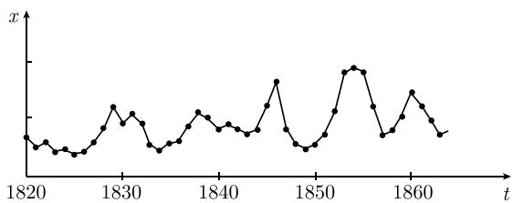
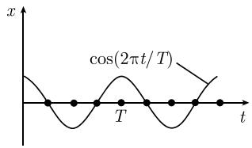
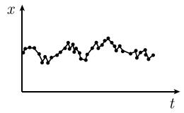
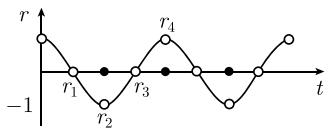
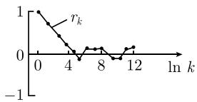

##### 6.4.1 时间序列

基本思想 考虑时间点

$$
t = 0, \Delta t, 2 \Delta t, \dots ,
$$

其中 $\Delta t > 0$ . 对于每个时刻 $t = n\Delta t$ , 都有一个相应的随机变量 $X_{n}$ . 我们将随机变量 $X_{n}$ 的观测值记为 $x_{n}$ .

例 1: 对 1500 年到 1870 年小麦价格的分析表明, 在这些年中小麦价格有一个为期 13.3 年的价格周期. 图 6.19 节录的是 1820 年至 1860 年的小麦价格.

$$
\begin{array}{r l} & \text {时间序列分析的一个重要问题是发现所关心的量} \\ & \text {在时间上的周期行为或者否定这种周期的存在性.} \end{array}
$$

为此, 人们使用自相关系数的基本方法或者更加现代的谱分析方法 (自协方差函数的傅里叶分析).

在计算机上计算时间序列 我们推荐使用 SPSS 统计软件包.

  
图 6.19 1820—1860 年小麦价格的周期性表现

6.4.1.1 经验自相关系数

假设给定了一个变异序列 $x_{0}, x_{1}, \cdots, x_{N}$ . 我们固定一个数 $k = 1, 2, \cdots, N/2$ , 并考虑 $x_{0}, x_{1}, \cdots, x_{N}$ 的两个相对移位的子序列

$$
\boxed {x _ {0}, x _ {1}, \dots , x _ {N - k}}
$$

和

$$
\left| x _ {k}, x _ {k + 1}, \dots , x _ {N}. \right.
$$

回顾这两个变异序列的经验相关系数 $r_{k}$ 的概念；这里，称 $r_{k}$ 为变异序列 $x_{0}, x_{1}, \cdots, x_{N}$ 的 k 阶自相关系数。显然，有

$$
\boxed {r _ {k} := \frac { \sum_ {j = 0} ^ {N - k} (x _ {j} - \overline {{x}}) (y _ {j} - \overline {{y}})}{\left( \sum_ {j = 0} ^ {N - k} (x _ {j} - \overline {{x}}) ^ {2} \sum_ {j = 0} ^ {N - k} (y _ {j} - \overline {{y}}) ^ {2}\right) ^ {1 / 2}}.}
$$

这里已经规定 $y_{j} := x_{j+k}$ ，以及

$$
\overline {{x}} = \frac {1}{N - k + 1} \sum_ {j = 0} ^ {N - k} x _ {j}, \quad \overline {{y}} = \frac {1}{N - k + 1} \sum_ {j = 0} ^ {N - k} y _ {j}.
$$

对 $r_{k}$ 的说明 首先, 有 $-1 \leqslant r_{k} \leqslant 1$ . $|r_{k}|$ 越大, 通过时间移位 $k\Delta t$ 得到的观测值的相关性越大.

(i) 如果当 $k = m, 2m, 3m, \cdots$ 时， $|r_{k}|$ 的值与 k 取其他值时 $|r_{k}|$ 的值相比特别大，这就强烈地暗示在这个时间序列中存在着一个周期 $T = 2m\Delta t$ （见下面的例 2）.

(ii) 如果所有 $|r_k|$ 的值都很小, 那么不同时刻的观测值之间实际上没有什么相关性. 这是对该时间序列的非周期行为的一个强烈暗示.

例 2: 对于一个周期为 $T = 2m\Delta t$ 的纯周期序列

$$
x _ {j} = a \cos \left(\frac {2 \pi j \Delta t}{T}\right), j = 0, 1, \dots , N
$$

以及振幅 $a \neq 0$ ，当观测值个数 N 很大时，近似有

$$
r _ {k} = \cos \left(\frac {2 \pi k \Delta t}{T}\right), k = 1, 2, \dots
$$

特别地, 有 (图 6.20 (a))

$$
r _ {0} = 1, r _ {m} = - 1, r _ {2 m} = 1, r _ {3 m} = - 1, r _ {4 m} = 1, \dots .
$$

例 3: 假定对于所有的 j, $x_{j} =$ 常数. 则对于所有的 k, 都有 $r_{k} = 0$ .

例 4: 在图 6.20 (b) 中, 我们描述了一个只有短时相关性的时间序列. 对于大的时间移位 $k\Delta t, |r_{k}|$ 的值变得越来越小, 因此根本不再有任何相关性.

近似值 当观测值的个数 N 很大时, 有近似公式

$$
\boxed {r _ {k} = \frac {c _ {k}}{c _ {0}},}\tag{6.40}
$$

  
(a) 纯周期序列

  
(b) 短时相关  
图 6.20 时间序列及自相关系数

其中，

$$
c _ {k} := \frac {1}{N} \sum_ {j = 0} ^ {N - k} (x _ {j} - \overline {{x}}) (x _ {j + k} - \overline {{x}}), \overline {{x}} := \frac {1}{N} \sum_ {j = 0} ^ {N} x _ {j}.
$$

在实际工作中, 经常使用近似公式 (6.40).

6.4.1.2 离散时间序列的谱分析

谱分析方法是以运用系数为自协方差系数的傅里叶级数为基础的.平稳时间序列 设 E 是一个概率空间, 而

$$
X _ {n}: E \to \mathbb {R}, n = 0, \pm 1, \pm 2, \dots
$$

是由满足 $0 < \Delta X_{n} < \infty$ 的随机变量 $X_{n}$ 组成的随机变量序列. 将 $X_{n}$ 看成时刻 $t = n\Delta t$ 的一个随机变量. 如果对于所有的 $n, k = 0, \pm1, \pm2, \cdots$ , 有

$$
\boxed {\overline {{X}} _ {n} = \overline {{X}} _ {0}}
$$

以及

$$
\boxed {\operatorname{Cov} (X _ {n}, X _ {n + k}) = \operatorname{Cov} (X _ {0}, X _ {k}),}
$$

就称随机变量序列 $\{X_{n}:E\to R,n=0,\pm1,\pm2,\cdots\}$ 是（广义）平稳的，这里， $\mathrm{Cov}(X,Y)=\overline{(X-\overline{X})(Y-\overline{Y})}$ ，因此特别地，有 $\mathrm{Cov}(X,X)=(\Delta X)^{2}$ .

$$
r _ {k} := \frac {\operatorname{Cov} (X _ {n} , X _ {n + k})}{\Delta X _ {n} \Delta X _ {n + k}}, \quad k = 1, 2, \dots
$$

为随机变量序列 $\{X_{n}:E\to\mathbb{R},n=0,\pm1,\pm2,\cdots\}$ 的自相关系数.

解释 数 $r_k$ 是时刻 $n\Delta t$ 的随机变量 $X_{n}$ 与时刻 $(n + k)\Delta t$ 的随机变量 $X_{n + k}$ 的相关系数. 时间序列是平稳的, 实际上就意味着期望 $\overline{X}_n$ 和标准差 $\Delta X_{n}$ 不依赖于时间 $t = n\Delta t$ . 进一步地, 相关系数 $r_{k}$ 也不依赖于所选择的时刻 $t = n\Delta t$ , 但依赖于所考虑的两个时刻的差值 $k\Delta t$ .

定理 若规定 $R(k) := \operatorname{Cov}(X_{0}, X_{k})$ ，则有

$$
\boxed {r _ {k} = \frac {R (k)}{R (0)}, \quad k = 0, 1, \dots .}
$$

另外, 对于所有的 k, 都有 $R(-k) = R(k)$ .

谱定理 设 $\sum_{k=0}^{\infty}|R(k)|<\infty$ , 则函数

$$
f (\lambda) := \frac {1}{2 \pi} \sum_ {k = - \infty} ^ {\infty} R (k) \mathrm{e} ^ {- \mathrm{i} k \lambda}
$$

连续, 且有

$$
\boxed {R (k) = \int_ {- \pi} ^ {\pi} f (\lambda) \mathrm{e} ^ {\mathrm{i} k \lambda} \mathrm{d} \lambda , \quad k = 0, \pm 1, \pm 2, \dots .}\tag{6.41}
$$

特别地, 对于所有的 n, 有关于方差的表达式

$$
(\Delta X _ {n}) ^ {2} = R (0) = \int_ {- \pi} ^ {\pi} f (\lambda) \mathrm{d} \lambda .\tag{6.42}
$$

上述周期为 $2\pi$ 的函数 $f$ 称为该平稳时间序列的谱密度. 由 (6.41) 和 (6.42) 可知, 谱密度包含关于标准差 $\Delta X$ 和自相关系数 $r_k = R(k)/R(0)$ 的全部信息. 例 1: 对于固定的自然数 $n \geqslant 1$ , 假设 $R(\pm n) \neq 0$ , 而且对于所有的 $k \neq n$ , $R(k) = 0$ , 则有

$$
f (\lambda) = \frac {R (n)}{2 \pi} \left(\mathrm{e} ^ {- \mathrm{i} n \lambda} + \mathrm{e} ^ {\mathrm{i} n \lambda}\right) = \frac {1}{\pi} \cos n \lambda , \quad \lambda \in \mathbb {R}.
$$

例 2: 假设 $R(0) \neq 0$ ，而且对于所有的 $k \neq 0, R(k) = 0$ ，则

$$
f (\lambda) = \frac {R (0)}{2 \pi}, \quad \lambda \in \mathbb {R}.
$$

这种不相关的时间序列称为白噪声.

6.4.1.3 离散时间序列的统计学

假设给定了 (广义) 平稳时间序列 $\{X_{n}\}$ . 现在, 我们希望利用观测值

$$
x _ {0}, x _ {1}, \dots , x _ {N - 1}
$$

估计一些重要的量. 假设 N 充分大.

(i) 对于所有的 n，期望 $\overline{X}_{n}$ 的估计：

$$
\mu = \frac {1}{N} \sum_ {j = 0} ^ {N - 1} x _ {j}.
$$

(ii) $R(k)$ 的估计:

$$
R _ {N} (k) = \frac {1}{N - k} \sum_ {j = 0} ^ {N - k - 1} \left(x _ {j} - \mu\right) \left(x _ {j + k} - \mu\right).
$$

特别地, 对于所有的 $n$ , $R_{N}(0)$ 是标准差 $\Delta X_{n}$ 的估计. 而且

$$
\frac {R _ {N} (k)}{R _ {N} (0)}, \quad k = 1, 2, \dots
$$

是自相关系数 $r_{k}$ 的一个估计.

(iii) 谱密度的估计:

$$
f _ {N} (\lambda) = \frac {1}{2 \pi N} \left| \sum_ {n = 0} ^ {N - 1} x _ {j} \mathrm{e} ^ {- \mathrm{i} n \lambda} \right| ^ {2}.
$$

6.4.1.4 赫格洛兹谱定理

定理 如果 $\{X_{n}\}$ 是一个 (广义) 平稳的时间序列, 那么存在一个非降的有界函数 $F:[-\pi, \pi] \to \mathbb{R}$ , 使得

$$
\boxed {R (k) = \int_ {- \pi} ^ {\pi} \mathrm{e} ^ {\mathrm{i} \lambda k} \mathrm{d} F (\lambda), \quad k = 0, \pm 1, \pm 2, \dots .}\tag{6.43}
$$

上式给出了 $R(k)$ 作为一个勒贝格-斯蒂尔切斯积分的表达式. 如果 $\sum_{k=0}^{\infty}|R(k)| < \infty$ , 则导函数 $F'(\lambda) =: f(\lambda)$ 几乎处处存在, 而且, 可以用 $f(\lambda)\mathrm{d}\lambda$ 代替 (6.43) 中的 $\mathrm{d}F(\lambda)$ .

6.4.1.5 连续时间序列的谱分析及白噪声

设 E 为概率空间, 而

$$
X _ {t}: E \to \mathbb {R}, \quad t \in \mathbb {R}
$$

是由满足 $0 < \Delta X_{t} < \infty$ 的随机变量 $X_{t}$ 组成的连续时间序列. 我们将 $X_{t}$ 理解为时刻 $t$ 的一个随机变量. 如果对于所有的时刻 $t, s \in \mathbb{R}$ , 都有

$$
\boxed {\overline {{X}} _ {t} = \overline {{X}} _ {0}}
$$

以及

$$
\boxed {\operatorname{Cov} (X _ {t}, X _ {t + s}) = \operatorname{Cov} (X _ {0}, X _ {s}),}
$$

则称连续时间序列 $\{X_{t}:E\to \mathbb{R},t\in \mathbb{R}\}$ 为(广义)平稳的.由表达式

$$
R (s) := \operatorname{Cov} (X _ {t}, X _ {t + s})
$$

定义的函数 $R:\mathbb{R}\to \mathbb{R}$ ，称为该连续时间序列的自协方差函数.数

$$
r (s) = \frac {R (s)}{R (0)}, \quad s \in \mathbb {R}
$$

是随机变量 $X_{t}$ 与 $X_{t+s}$ 的相关系数. 对于所有的 s, 均有 $R(-s) = R(s)$ .

谱定理 设 $\int_{-\infty}^{\infty}|R(s)|\mathrm{d}s < \infty$ ，则函数

$$
f (\lambda) := \frac {1}{2 \pi} \int_ {- \infty} ^ {\infty} R (s) \mathrm{e} ^ {- \mathrm{i} s \lambda} \mathrm{d} s
$$

连续, 且有

$$
\boxed {R (s) = \int_ {- \pi} ^ {\pi} f (\lambda) \mathrm{e} ^ {\mathrm{i} s \lambda} \mathrm{d} \lambda , \quad s \in \mathbb {R}.}
$$

因此, 谱密度函数 f 就是自协方差函数 R 的傅里叶变换.

短时相关, 白噪声及分布 对于某个固定的小量 $\varepsilon > 0$ , 令

$$
R _ {\varepsilon} (s) := \left\{ \begin{array}{l l} { \frac {1}{2 \varepsilon},} & {- \varepsilon \leqslant s \leqslant \varepsilon ,} \\ {0,} & {\text {其他},} \end{array} \right.
$$

则相关系数满足：在小时间区间 $[- \varepsilon, \varepsilon]$ 内， $r_{\varepsilon}(s) = 1$ ；而在此区间之外， $r(s) = 0$ 。这是典型的短时相关。对于谱密度 $f_{\varepsilon}$ ，有表达式

$$
f _ {\varepsilon} (\lambda) = \frac {1}{4 \pi \varepsilon} \int_ {- \varepsilon} ^ {\varepsilon} \mathrm{e} ^ {- \mathrm{i} \lambda s} \mathrm{d} s, \lambda \in \mathbb {R}.
$$

在 $\varepsilon \rightarrow +0$ 的极限情形, 得到

$$
\boxed {\lim _ {\varepsilon \to + 0} f _ {\varepsilon} (\lambda) = \frac {1}{2 \pi}.}
$$

这种极限情形称为白噪声．用物理学家和工程师的话来说, 对于自协方差函数, 有关系式

$$
R (s) = \lim _ {\varepsilon \rightarrow + 0} R _ {\varepsilon} (s) = \delta (s)\tag{6.44}
$$

其中 $\delta$ 表示狄拉克 $\delta$ 分布 (见 [212]). 事实上, $\delta$ 不仅是一个经典函数而且是一个分布. 在分布的意义下, 将标准表达式 (6.44) 解释为关系式

$$
R = \lim _ {\varepsilon \to + 0} R _ {\varepsilon} = \delta_ {0},\tag{6.45}
$$

就更加严格了. 这意味着, 对于所有的试验函数 $\varphi \in C_0^\infty (\mathbb{R})$ , 都成立

$$
\lim _ {\varepsilon \rightarrow + 0} \int_ {- \infty} ^ {\infty} R _ {\varepsilon} (s) \varphi (s) \mathrm{d} s = \delta_ {0} (\varphi) = \varphi (0).
$$

白噪声是发生在自然界和工程中的, 只有当时间间隔非常小时才存在相关性的随机过程的模型.
