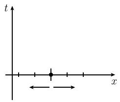
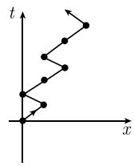

##### 6.4.4 布朗运动与扩散

6.4.4.1 随机运动的经典模型

布朗运动的转移概率 考虑一个沿实数轴运动的粒子. 用 $X_{t}$ 表示该粒子在时刻 $t$ 的位置, 并定义

$$
\begin{array}{r l} & {P (y, s; J, t) := \text {粒子在时刻} s \text {已经处于点} y \text {的条件下},} \\ & {\qquad \text {在时刻} t \text {落入区间} J \text {的条件概率}.} \end{array}
$$

也称 $P(y, s; J, t)$ 为转移概率. 对于布朗运动, 有

$$
\boxed {P (y, s; J, t) = \int_ {J} p (y, s; x, t) \mathrm{d} x.}\tag{6.47}
$$

其中，

$$
\boxed {p (y, s; x, t) := \frac {1}{\sqrt {2 \pi (t - s)}} \mathrm{e} ^ {- (x - y) ^ {2} / 2 (t - s)}, \quad s <   t.}
$$

解决方案 用格子点

$$
x = 0, \pm \Delta x, \pm 2 \Delta x, \dots
$$

划分实数轴, 并考虑离散时间点

$$
t = 0, \Delta t, 2 \Delta t, \dots ,
$$

假定粒子在初始时刻 t = 0 处于点 x = 0. 现在, 假设如果粒子在时刻 $t = n \Delta t$ 位于点

$$
x = m \Delta x,
$$

那么它在下一时刻 $t = (n + 1)\Delta t$ 以概率 $p = 1 / 2$ 位于该点的右邻点

$$
x = (m + 1) \Delta x,
$$

并以相同的概率位于该点的左邻点

$$
x = (m - 1) \Delta x
$$

(图 6.21). 在 N 重伯努利试验中可以得到这种情况 (参见 6.2.5). 此时, 比较试验的两个结果分别为 $e_{+}$ (向右运动) 和 $e_{-}$ (向左运动). 如果事件

$$
e _ {i _ {1}} e _ {i _ {2}} \dots e _ {i _ {N}}
$$

(其中 $e_{i_{j}} = e_{\pm}$ ) 中恰好有 k 个符号为 $e_{+}, N - k$ 个符号为 $e_{-}$ ，则粒子在时刻 $t = N \Delta t$ 位于点

$$
x = k \Delta x - (N - k) \Delta x.
$$

这个事件的概率为

$$
\binom{N}{k} \frac {1}{2 ^ {k}} \frac {1}{2 ^ {N - k}}.
$$

如果考虑当 $N \to \infty$ 时的极限, 并让 $\Delta x \to 0$ , 以及最终让 $\Delta t \to 0$ , 则由棣莫弗-拉普拉斯极限定理就可以得到 (6.47). 但我们对此不作更详细的讨论.

  
(a)

  
(b)  
图 6.21 布朗运动

6.4.4.2 扩散方程

现在我们不再考虑单个粒子, 而是考虑 x 轴上的流体, 并假设点 x 处在时刻 t 的流体粒子密度为 $\rho(x,t)$ . 由 (6.47), 可以得到关系式

$$
\boxed {\rho (x, t) = \int_ {- \infty} ^ {\infty} \rho (y, s) p (y, s; x, t) \mathrm{d} y.}
$$

由此可得扩散方程

$$
\boxed {\rho_ {t} = \frac {1}{2} \rho_ {x x}, \quad x \in \mathbb {R}, t > s.}
$$

这样, 扩散过程就可以用随机运动的例子来解释.

6.4.4.3 维纳测度及维纳过程

我们规定 $R_{+} := \{ t \in R | t \geqslant 0 \}$ ，并用 $C(x_{0})$ 表示由所有满足 $w(0) = x_{0}$ 的连续函数

$$
w: \mathbb {R} _ {+} \to \mathbb {R}
$$

组成的空间. 将 $x = w(t)$ 理解为在初始时刻 $t = 0$ 处于点 $x_0$ 的粒子的一条运动轨迹. 我们的目标是构造 $C(x_0)$ 的子集 $M$ 的一个 $\sigma$ 域 $\mathcal{S}$ 以及 $\mathcal{S}$ 上的测度 $\mu_{x_0}$ , 使得

$$
\mu_ {x _ {0}} (M) := \text {布朗运动的一条轨迹} x = w (t) \text {属于} C (x _ {0}) \text {的子集} M \text {的概率}.
$$

为此, 首先考虑所谓的柱面集 $^{1)}$

$$
\mathscr {Z} := \left\{w \in C (x _ {0}) | w (t _ {k}) \in J _ {k}, k = 1, \dots , n \right\}.
$$

假定时刻 $t_{k}$ 满足条件 $0 < t_{1} < t_{2} < \cdots < t_{n}$ ，而 $J_{k}$ 是一个任意的实区间。这样，Z 由所有在时刻 $t_{k}$ 落入区间 $J_{k}$ 内的连续轨迹 $x = w(t)$ 所组成， $k = 1, \cdots, n$ 。如果 $0 < t_{1} < t_{2}$ ，我们定义

$$
\mu_ {x _ {0}} (\mathcal {L}) := \int_ {J _ {1}} \int_ {J _ {2}} p (x _ {0}, t _ {0}; x _ {1}, t _ {1}) p (x _ {1}, t _ {1}; x _ {2}, t _ {2}) \mathrm{d} x _ {1} \mathrm{d} x _ {2},
$$

其中, $t_{0} := 0$ . 在 $0 < t_{1} < \cdots < t_{n}$ 的一般情形, 规定

$$
\boxed {\mu_ {x _ {0}} (\mathscr {Z}) := \int_ {J _ {1}} \dots \int_ {J _ {2}} p (x _ {0}, t _ {0}; x _ {1}, t _ {1}) \dots p (x _ {n - 1}, t _ {n - 1}; x _ {n}, t _ {n}) \mathrm{d} x _ {1} \dots \mathrm{d} x _ {n}.}
$$

最后, 我们用 S 表示 $C(x_{0})$ 的子集的包含所有柱面集的最小 $\sigma$ 域 (见 [212]).

定理 测度 $\mu_{x_{0}}$ 可以唯一地延拓为定义在整个 S 上的测度. 这种测度称为维纳测度.
例: 用 D 表示由 $C(x_{0})$ 中所有可微的轨迹组成的集合, 则

$$
\mu_ {x _ {0}} (\mathcal {D}) = 0.
$$

这样, 布朗运动的任何一条轨迹几乎必定不可微. 这个结果解释了布朗运动的颤抖现象.

维纳过程 假设 $X_{t}$ 表示一条轨迹 $w \in C(x_{0})$ 在时刻 t 的位置 $w(t)$ . 则有:

(i) $X_{t}$ 服从期望(均值) $\overline{X}_{t}=x_{0}$ ，标准差 $\Delta X_{t}=\sqrt{t}$ 的正态分布.

(ii) 在时刻 $t = 0$ , $X_{t} = x_{0}$ 的概率为 1.

1) 注意这个集合 $\mathcal{Z}$ 依赖于 $J_{k}$ , 所以一个更精确的记号应为 $\mathcal{Z}(J_{1},\cdots,J_{n})$ . 然而, 为简洁起见, 我们不采用这种更加精确的记号.

(iii) 假设 $0 < s < t, 0 < h \leqslant t - s$ , 则差值

$$
X _ {t + h} - X _ {t} \mathrm{与} X _ {s + h} - X _ {s}
$$

相互独立. 进一步地, 它们都服从均值为 0, 标准差为 $\sqrt{h}$ 的正态分布.

(iv) 随机变量 $X_{t_{1}}, X_{t_{2}}, \cdots, X_{t_{n}}$ 的联合分布函数 $\Phi_{t_{1} \ldots t_{n}}$ 的概率密度为

$$
\prod_ {j = 1} ^ {n} \varphi_ {t _ {j}} (x _ {j}).
$$

这里, $\varphi_t(x) := \frac{1}{\sqrt{2\pi t}} \mathrm{e}^{-(x - x_0)^2 / 2t}$ 是均值 $\mu = x_0$ , 标准差 $\sigma = \sqrt{t}$ 的正态分布的概率密度. 于是, 可以将维纳过程定义为由概率空间 $(C(x_0), \mathcal{S}, \mu_{x_0})$ 上的随机变量 $X_t$ 组成的随机变量族 (一个随机过程)

$$
\boxed {X _ {t}: C (x _ {0}) \to \mathbb {R}, \quad t \geqslant 0.}\tag{6.48}
$$

N. 维纳在 1922 年研究了这个过程.

6.4.4.4 费恩曼-卡茨公式

扩散是由粒子的布朗运动导致的。著名的费恩曼-卡茨公式的基本思想是将粒子密度 $\rho$ 作为这些粒子的随机轨迹的一个平均来求得它。构造这种平均值要用到维纳测度 $\mu_{x}$ 的性质。

对于一个由函数 U 给出的外力作用下的扩散过程, 考虑初值问题:

$$
\boxed { \begin{array}{l l} \rho_ {t} = a (\rho_ {x x} - U (x)), & x \in \mathbb {R}, t > 0, \\ \rho (x, 0) = \rho_ {0} (x), & x \in \mathbb {R}. \end{array} }\tag{6.49}
$$

点 $x$ 处在时刻 $t$ 的粒子密度 $\rho = \rho(x, t)$ 是未知的. 初始密度 $\rho_0 \in C_0^\infty(\mathbb{R})$ 及函数 $U \in C_0^\infty(\mathbb{R})$ 是给定的. 我们选择一个时间单位, 使得 $a = 1/2$ .

定理 (6.49) 的唯一解由费恩曼-卡茨公式

$$
\boxed {\rho (x, t) = \int_ {C (x)} \rho_ {0} (w (t)) \mathrm{e} ^ {- \int_ {0} ^ {t} U (w (s)) \mathrm{d} s} \mathrm{d} \mu_ {x} (w), \quad x \in \mathbb {R}, t > 0}\tag{6.50}
$$

给出. 这里, 积分是对于所有的轨迹 $w \in C(x)$ 进行的. 就像 [212] 中解释的那样, 这里出现的 $C(x)$ 上关于维纳测度 $\mu_x$ 的积分应当理解为一个测度积分.

6.4.4.5 费恩曼积分

D. 费恩曼 (Feynman) 是一位卓越不凡的科学家。为了系统阐述自己的量子力学观点，他辛勤工作了五年。我用传统的薛定谔方程为 H。贝特 (Bethe) 进行的计算，花了好几个月的时间和数百页纸才完成。而费恩曼使用他自己的方法，只需在黑板上花半个小时就能得到相同的结果。

F. 戴森 (Dyson), 1979

薛定谔方程的初值问题

$$
\boxed { \begin{array}{l l} - \mathrm{i}   \varPsi_ {t} = a (-   \varPsi_ {x x} + U (x)), & x \in \mathbb {R}, t > 0, \\ \varPsi (x, 0) =   \varPsi_ {0} (x), & x \in \mathbb {R} \end{array} }\tag{6.51}
$$

可以通过公式

$$
\boxed {\Psi (x, t) = \rho (x, \mathrm{i} t)}\tag{6.52}
$$

与扩散方程的初值问题 (6.49) 从形式上联系起来. 这使我们得以提出如下解释:

$$
\text { 量子的运动是虚时间中的布朗运动. }
$$

这就是费恩曼量子力学方法的数学背景。这种方法是费恩曼依靠他天才的物理直觉，采用与经典量子力学完全不同的方式发现的。费恩曼发现，粒子的量子运动可以作为其经典轨迹的加权平均得到，其中的权相当于概率。这种平均使用所谓的费恩曼积分，它同时也给出了经典力学与量子力学之间最深刻联系。

从形式上看, 将费恩曼-卡茨公式 (6.50) 中的密度 $\rho$ 用薛定谔 (波) 函数 $\psi$ 代替, 即可得到费恩曼积分.

然而，费恩曼积分只在极少数几种特殊情形有严格定义并被数学证明。尽管如此，费恩曼积分却是量子场论中计算基本粒子过程的极其重要的工具。费恩曼积分异常成功的奥秘在于它能够描述量子过程中行为传播的微观效果。

对于费恩曼积分及其物理背景的介绍可以在 [215] 中找到.
