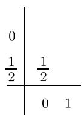
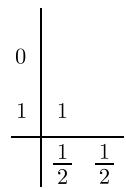
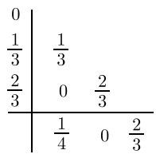
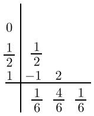
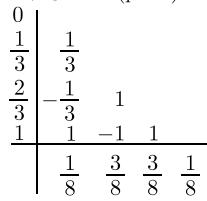
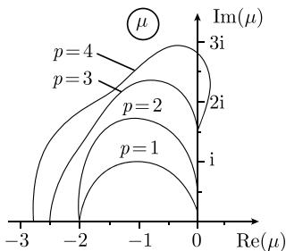
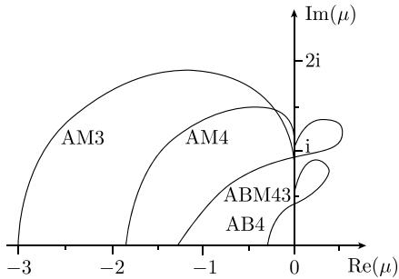

#### 7.6 常微分方程

由于 $r$ 阶微分方程或微分方程组（见1.12）的通解一般不能显式给出，那么在应用中必须数值求解微分方程。为了用适当的方法处理问题，需要区分初值问题和边值问题，详见1.12.9。下面假设要求的解存在且唯一。

##### 7.6.1 初值问题

每一个 r 阶显式微分方程或微分方程组通过适当的变量代换化为 r 个一阶的微分方程组. 初值问题就是确定 r 个函数 $y_{1}(x)$ , $y_{2}(x)$ , $\cdots$ , $y_{r}(x)$ 为下面方程的解:

$$
y _ {i} ^ {\prime} (x) = f _ {i} \left(x, y _ {1}, y _ {2}, \dots , y _ {r}\right), \quad i = 1, 2, \dots , r,
$$

且对给定点 $x_{0}$ 和初值 $y_{i0}, i = 1, 2, \cdots, r$ ，满足初始条件

$$
y _ {i} \left(x _ {0}\right) = y _ {i 0}, \quad i = 1, 2, \dots , r.
$$

利用向量 $\boldsymbol{y}(x):=(y_{1}(x),y_{2}(x),\cdots,y_{r}(x))^{\mathrm{T}},\boldsymbol{y}:=(y_{10}(x),y_{20}(x),\cdots,y_{r0}(x))^{\mathrm{T}}$ 及 $\boldsymbol{f}(x,\boldsymbol{y}):=(f_{1}(x,\boldsymbol{y}),f_{2}(x,\boldsymbol{y}),\cdots,f_{r}(x,\boldsymbol{y}))^{\mathrm{T}}$ 柯西问题可以写为

$$
\boxed {\boldsymbol {y} ^ {\prime} (x) = \boldsymbol {f} (x, \boldsymbol {y} (x)), \quad \boldsymbol {y} (x _ {0}) = \boldsymbol {y} _ {0}.}
$$

为简化记号, 下面考虑一阶标量微分方程的初值问题

$$
y ^ {\prime} (x) = f (x, y (x)), \quad y (x _ {0}) = y _ {0}.
$$

求解这一问题的方法容易推广到方程组的情况.

7.6.1.1 单步法

最简单的欧拉法是用过初始点 $(x_0, y_0)$ 的切线来近似计算曲线 $y(x)$ ，斜率 $y'(x_0) = f(x_0, y_0)$ 由微分方程本身确定。在点 $x_1 := x_0 + h$ (其中 $h$ 为步长)，可以得到近似值

$$
y _ {1} = y _ {0} + h f \left(x _ {0}, y _ {0}\right)
$$

作为解向量的精确值 $y(x_{1})$ 。若在点 $(x_{1},y_{1})$ 处，按微分方程在该点方向场所定义切线的切线继续这一过程，对等距节点 $x_{k}:=x_{0}+kh,k=0,1,2,\cdots$ ，可以依次得到近似值 $y_{k}$

$$
\boxed {y _ {k + 1} = y _ {k} + f \left(x _ {k}, y _ {k}\right), \quad k = 0, 1, 2, \dots .}
$$

由这些近似可作几何解释的结构, 欧拉法也被称为多边形边方法. 显然它比较粗糙, 只有当步长 $h$ 很小时, 才导致有用的逼近. 但由于它简单, 是最简单的单步法, 只要知道点 $x_{k}$ 处的近似值 $y_{k}$ , 就可以计算下一个近似值 $y_{k+1}$ .

一般地, 显式单步算法为

$$
y _ {k + 1} = y _ {k} + h \Phi (x _ {k}, y _ {k}, h), \quad k = 0, 1, 2, \dots ,
$$

其中 $\Phi (x_k,y_k,h)$ 规定：由 $(x_{k},y_{k})$ 及点 $x_{k + 1} = x_0 + kh,$ 以步长 $h$ 近似计算 $y_{k + 1}$ 函数 $\Phi (x,y,h)$ 与要解的微分方程相关.于是有如下术语：若

$$
\lim _ {h \to 0} \varPhi (x, y, h) = f (x, y, h),
$$

则单步法是相容的. 欧拉法是相容的.

定义单步法在点 $x_{k+1}$ 的局部离散误差为

$$
d _ {k + 1} := y \left(x _ {k + 1}\right) - y \left(x _ {k}\right) - h \Phi \left(x _ {k}, y \left(x _ {k}\right), h\right).
$$

它用来描述准确解 $y(x)$ 被插入后算法的误差. 根据带余项的泰勒展开式

$$
y \left(x _ {k + 1}\right) := y \left(x _ {k}\right) + h y ^ {\prime} \left(x _ {k}\right) + \frac {1}{2} h ^ {2} y ^ {\prime \prime} (\xi), \quad x _ {k} <   \xi <   x _ {k + 1},
$$

可以得到欧拉法的局部离散误差

$$
d _ {k + 1} = \frac {1}{2} h ^ {2} y ^ {\prime \prime} (\xi), \quad x _ {k} <   \xi <   x _ {k + 1}.
$$

另一方面, 在点 $x_{k}$ 处的整体误差 $g_{k}$ 为

$$
g _ {k} := y \left(x _ {k}\right) - y _ {k}.
$$

它描述单步法所有离散误差的总和. 如果函数 $\Phi(x, y, h)$ 在区域 $B$ 内关于变量 $y$ 满足利普希茨 (Lipschitz) 条件, 有

$$
| \Phi (x, y, h) - \Phi (x, y ^ {*}, h) | \leqslant L | y - y ^ {*} |, \quad \text {对} \quad x, y, y ^ {*}, h \in B, 0 <   L <   \infty ,
$$

在点 $x_{n} = x_{0} + nh, n \in \mathbb{N}$ 处的整体误差 $g_{k}$ 可以通过局部离散误差估计. 如果 $\max_{1 \leqslant k \leqslant n} |d_{k}| \leqslant D$ , 则有估计

$$
\left| g _ {n} \right| \leqslant \frac {D}{h L} \left\{\mathrm{e} ^ {n h L} - 1 \right\} \leqslant \frac {D}{h L} \mathrm{e} ^ {n h L} = \frac {D}{h L} \mathrm{e} ^ {\left(x _ {n} - x _ {0}\right) L}.
$$

除了利普希茨常数 L, 区间 $[x_{0}, x_{n}]$ 上的局部离散误差 $d_{k}$ 绝对值的最大值 D 在这一公式中起重要作用.

单步法根据定义有p阶误差, 若局部离散误差有如下估计:

$$
\max _ {1 \leqslant k \leqslant n} | d _ {k} | \leqslant D = \mathrm{常数} \cdot h ^ {p + 1} = O \left(h ^ {p + 1}\right),
$$

使得整体误差为

$$
| g _ {n} | \leqslant {\frac {\text {常数}}{L}} \mathrm{e} ^ {n h L} h ^ {p} = O \left(h ^ {p}\right).
$$

欧拉法的误差阶 p=1，其在固定点 $x := x_{0} + nh$ 的整体误差随 h 线性趋于零.

与刚才讨论的方法误差相比, 对高阶单步法而言, 舍入误差及其传播的重要性是第二位的.

显式龙格-库塔法是重要且具有较高误差阶的常用方法. 该方法从等价于微分方程的积分方程开始

$$
y \left(x _ {k + 1}\right) = y \left(x _ {k}\right) + \int_ {x _ {k}} ^ {x _ {k + 1}} f (x, y (x)) \mathrm{d} x,
$$

积分可以通过区间 $[x_{k}, x_{k+1}]$ 上的 s 个插值点 $\xi_{1}, \xi_{2}, \cdots, \xi_{s}$ 的积分公式近似求得

$$
\int_ {x _ {k}} ^ {x _ {k + 1}} f (x, y (x)) \mathrm{d} x \approx h \sum_ {i = 1} ^ {s} c _ {i} f (\xi_ {i}, y _ {i} ^ {*}) =: h \sum_ {i = 1} ^ {s} c _ {i} k _ {i}.
$$

插值点 $\xi_{i}$ 为

$$
\xi_ {1} = x _ {k}, \xi_ {i} = x _ {k} + a _ {i} h, \quad i = 2, 3, \dots , s,
$$

对于未知函数值 $y_{i}^{*}$ ，假设满足关系

$$
y _ {1} ^ {*} := y _ {k}, y _ {i} ^ {*} := y _ {k} + h \sum_ {j = 1} ^ {i - 1} b _ {i j} f \left(\xi_ {i}, y _ {i} ^ {*}\right), \quad i = 2, 3, \dots , s.
$$

这一公式中的参数 $c_{i}, a_{i}, b_{ij}$ 在进一步简化的假设下，被 $s$ 个插值点的有尽可能高的误差阶 $p$ 的龙格-库塔法得到

$$
y _ {k + 1} = y _ {k} + h \sum_ {i = 1} ^ {s} c _ {i} f \left(\xi_ {i}, y _ {i} ^ {*}\right) = y _ {k} + h \sum_ {i = 1} ^ {s} c _ {i} k _ {i}, \quad k = 0, 1, 2, \dots
$$

在这些条件下参数并不能唯一确定, 因此需要考虑更多的因素. 显式龙格-库塔法的系数可以由如下格式给出:

$$
\begin{array}{c c c c c c} a _ {1} & & & & \\ a _ {2} & b _ {2 1} & & & \\ a _ {3} & b _ {3 1} & b _ {3 2} & & \\ \vdots & \vdots & \vdots & & \\ a _ {s} & b _ {s 1} & b _ {s 2} & \dots & b _ {s, s - 1} \\ \hline & c _ {1} & c _ {2} & \ldots & c _ {s - 1} & c _ {s} \end{array}
$$

低误差阶的龙格-库塔法的例子如下：

辛普森公式库塔法 $(p = 3)$  

修正多边形法 $(p = 2)$

霍伊恩(Heun)法 $(p = 2)$

霍伊恩法 $(p = 3)$

$$
\begin{array}{c c c c c} 0 & \\ \frac {1}{2} & \frac {1}{2} & & \\ \frac {1}{2} & 0 & \frac {1}{2} & & \\ 1 & 0 & 0 & 1 & \\ \hline & \frac {1}{6} & \frac {2}{6} & \frac {2}{6} & \frac {1}{6} \end{array}
$$

经典龙格-库塔法 $(p = 4)$  
  
(3/8)公式龙格-库塔法 $(p = 4)$

常用简单龙格原理来估计局部离散误差的大小, 这同样适用于步长的自动直接改变. 设 $Y_{k}(x_{k}) = y_{k}$ 是 $y' = f(x, y)$ 的解. 我们希望确定经过两次 $h$ 步长的积分后 $y_{k+2}$ 与 $Y_{k}(x_{k} + 2h)$ 的误差. 为此使用 $2h$ 步长的点 $x = x_{k} + 2h$ 处的值 $\tilde{y}_{k+1}$ . 如果该方法具有 $p$ 阶误差, 则有

$$
\begin{array}{l} Y _ {k} \left(x _ {k} + h\right) - y _ {k + 1} = d _ {k + 1} = C _ {k} h ^ {p + 1} + O \left(h ^ {p + 2}\right), \\ Y _ {k} \left(x _ {k} + 2 h\right) - y _ {k + 2} = 2 C _ {k} h ^ {p + 1} + O \left(h ^ {p + 2}\right), \\ Y _ {k} \left(x _ {k} + 2 h\right) - \tilde {y} _ {k + 1} = 2 ^ {p + 1} C _ {k} h ^ {p + 1} + O \left(h ^ {p + 2}\right). \end{array}
$$

由此可得

$$
\begin{array}{l} y _ {k + 2} - \tilde {y} _ {k + 1} = 2 C _ {k} \left(2 ^ {p} - 1\right) h ^ {p + 1} + O \left(h ^ {p + 2}\right), \\ Y _ {k} \left(x _ {k} + 2 h\right) - y _ {k + 2} \approx 2 C _ {k} h ^ {p + 1} \approx \frac {y _ {k + 2} - \tilde {y} _ {k + 1}}{2 ^ {p} - 1}. \end{array}
$$

在两个步长后估计误差要求用 s 个插值点的龙格-库塔法求 s-1 个辅助函数值以计算 $\tilde{y}_{k+1}$ .

另一个估计离散误差的原理是基于高阶误差的龙格-库塔法. 为了使计算量尽可能小, 应用的方法需要嵌入于高阶误差方法, 且两者需要相同的函数求值. 将修正多边形法嵌入库塔法作为局部离散误差的估计, 则有 $d_{k+1}^{(\mathrm{VP})} \approx \frac{h}{6} \{k_1 - 2k_2 + k_3\}$ .

这一原理被费尔贝格(Fehlberg)作了很大改进, 同时嵌入两个有不同误差阶的方法得到两个 $y_{k+1}$ 值来估计局部离散误差, 这就是龙格-库塔-费尔贝格方法. 因为五阶的龙格-库塔法需要6个点的函数值, 文献 [436] 中描述了离散误差非常小的四阶方法.

上述方法的进一步推广即所谓隐式龙格-库塔法, 其插值点更一般, 为

$$
\xi_ {i} = x _ {k} + a _ {i} h, \quad i = 1, 2, \dots , s.
$$

未知函数值 $y_{i}^{*}$ 定义为

$$
y _ {i} ^ {*} = y _ {k} + h \sum_ {j = 1} ^ {s} b _ {i j} f (\xi_ {j}, y _ {j} ^ {*}), \quad i = 1, 2, \dots , s,
$$

故在每一步积分中方程组

$$
k _ {i} = f \left(x _ {k} + a _ {i} h, y _ {k} + h \sum_ {j = 1} ^ {s} b _ {i j} k _ {j}\right), \quad i = 1, 2, \dots , s
$$

一般不是线性的, 需要求解 s 个未知量 $k_{i}$ , 于是有

$$
y _ {k + 1} = y _ {k} + h \sum_ {i = 1} ^ {s} c _ {i} k _ {i}, \quad k = 0, 1, 2, \dots .
$$

在 s 个插值点龙格-库塔法中也有一些有某种稳定性, 这对于求解刚性微分方程组是重要的. 此外, s 个插值点的隐式龙格-库塔法适当选择参数可以使误差阶最大, 即 p = 2s.

隐式龙格-库塔法的例子为梯形公式:

$$
\boxed {y _ {k + 1} = y _ {k} + \frac {h}{2} \left[ f \left(x _ {k}, y _ {k}\right) + f \left(x _ {k + 1}, y _ {k + 1}\right) \right],}
$$

其误差阶 p=2. 单步法:

$$
\boxed { \begin{array}{l} k _ {1} = f \left(x _ {k} + \frac {1}{2} h, y _ {k} + \frac {1}{2} h k _ {1}\right), \\ y _ {k + 1} = y _ {k} + h k _ {1}, \end{array} }
$$

误差阶 $p = 2$ .而双步法：

<table><tr><td> $\frac{3-\sqrt{3}}{6}$ </td><td> $\frac{1}{4}$ </td><td> $\frac{3-2\sqrt{3}}{12}$ </td></tr><tr><td> $\frac{3+\sqrt{3}}{6}$ </td><td> $\frac{3+2\sqrt{3}}{12}$ </td><td> $\frac{1}{4}$ </td></tr><tr><td></td><td> $\frac{1}{2}$ </td><td> $\frac{1}{2}$ </td></tr></table>

有最大误差阶 p=4.

单步法的稳定性首先通过线性检验初值问题进行分析

$$
y ^ {\prime} (x) = \lambda y (x), \quad y (0) = 1, \quad \lambda \in \mathbb {C},
$$

为了数值比较计算解和真解, 特别和指数或振荡衰减的解 $y(x) = \mathrm{e}^{\lambda x}$ 相比较, 其中 $\mathrm{Re}(\lambda) < 0$ . 如果应用龙格-库塔法于检验初值问题, 结果表述为

$$
y _ {k + 1} = F (h \lambda) \cdot y _ {k}, \quad k = 0, 1, 2, \dots ,
$$

其中, 对显式方法, $F(\lambda h)$ 为关于 $\lambda h$ 的多项式; 对隐式方法, $F(\lambda h)$ 为关于 $\lambda h$ 的有理式. 在这两种情况下对小变量, $F(\lambda h)$ 都是 $\mathrm{e}^{\lambda h}$ 的近似. 数值计算近似解 $y_{k}$ 的定性行为仅当 $|F(\lambda h)| < 1$ 且 $\operatorname{Re}(\lambda) < 0$ 时, 才与 $y(x_{k})$ 相同. 因此定义单步法的绝对稳定区域为集合

$$
B := \{\mu \in \mathbb {C}: | F (\mu) | <   1 \}.
$$

对误差阶 p=4 的 s 个插值点的显式龙格-库塔法, 有

$$
F (\mu) = 1 + \mu + \frac {1}{2} \mu^ {2} + \frac {1}{6} \mu^ {3} + \frac {1}{2 4} \mu^ {4}, \quad \mu = h \lambda ,
$$

  
图7.1

这与 $e^{\lambda}$ 的泰勒展开式的前几项相同. 显式龙格-库塔方法当 x = p = 1, 2, 3, 4 时的绝对稳定区域的边界如图 7.1 所示, 仅在上半平面内. 且绝对稳定区域随误差阶的增大而变大.

步长 h 的选取应该满足稳定性条件 $\lambda h = u \in B$ ，其中 $\mathrm{Re}(\lambda) < 0$ 。否则，显式龙格-库塔法可能得到无用的结果。稳定性条件必须考虑到（线性）微分方程组的数值积分，其中步长 h 需要保证常数 $\lambda_{j}, j = 1, 2, \cdots, r$ 满足 $\lambda_{j} h \in B$ 。如果 $\lambda_{j}$ 的负实部的绝对值变化很大，则称为刚性微分方程组. 此时, 即使 $\lambda_{j}$ 的绝对值非常小, 绝对稳定条件对步长 h 的限制也非常强.

对隐式梯形公式和单步龙格-库塔法, 有

$$
F (\lambda h) = \frac {2 + \lambda h}{2 - \lambda h},
$$

其中，对所有的 $\mu$ 和 $\operatorname{Re}(\mu) < 0$ ，有 $|F(\mu)| = \left|\frac{2 + \mu}{2 - \mu}\right| < 1$ 。其绝对稳定区域为整个左半复平面。由于步长 $h$ 不需要满足稳定性条件，这两个隐式方法被称为绝对稳定的。两点插值的龙格-库塔法也是绝对稳定的。

进一步，更精细的稳定性概念，尤其是非线性微分方程的稳定性分析，见文献 [437] 和 [438].

7.6.1.2 多步法

若应用带等距插值点 $x_{k-1}, x_{k-2}, \cdots, x_{k-m+1}$ 的算法得到的近似信息，确定 $x_{k+1}$ 处的近似值 $y_{k+1}$ ，则是多步法，它常可更有效地数值求解微分方程。对 $s := k - m + 1$ ，一般的线性多步法是

$$
\boxed {\sum_ {j = 0} ^ {m} a _ {j} y _ {s + j} = h \sum_ {j = 0} ^ {m} b _ {j} f (x _ {s + j}, y _ {s + j}), \quad m \geqslant 2,}
$$

其中 $k \geqslant m - 1$ ，即 $s \geqslant 0$ ，系数 $a_{j}, b_{j}$ 固定。在规范化意义下设 $a_{m} = 1$ ，若 $a_{0}^{2} + b_{0}^{2} \neq 0$ ，我们论及一个真的 m 步法。如果 $b_{m} = 0$ ，该多步法称为显式多步法，否则称为隐式多步法。为了运用 m 步法，除了初值 $y_{0}$ ，需要增加 m - 1 个初始值 $y_{1}, \cdots, y_{m-1}$ ，例如它们可以借助于单步法确定。

若局部离散误差 $d_{k+1}$ 在任意点 $\bar{x}$ 有如下表达式：

$$
\begin{array}{l} d _ {k + 1} := \sum_ {j = 0} ^ {m} \left\{a _ {j} y \left(x _ {s + j}\right) - h b _ {i} f \left(x _ {s + j}, y \left(x _ {s + j}\right)\right) \right\} \\ = c _ {0} y \left(\bar {x}\right) + c _ {1} h y ^ {\prime} \left(\bar {x}\right) + c _ {2} h ^ {2} y ^ {\prime \prime} \left(\bar {x}\right) + \dots + c _ {p} h ^ {p} y ^ {\left(p\right)} \left(\bar {x}\right) + c _ {p + 1} h ^ {p + 1} y ^ {\left(p + 1\right)} \left(\bar {x}\right) + \dots , \end{array}
$$

则称线性多步法是p阶的, 其中 $c_{0}=c_{1}=\cdots=c_{p}=0, c_{p+1}\neq0$ . 且 p 和 $c_{p+1}$ 与点 $\bar{x}$ 的选取无关. 若其误差阶 $p\geqslant1$ , 则线性多步法称为相容的. 与 m 步法相关有两个特征多项式:

$$
\rho \left(z\right) := \sum_ {j = 0} ^ {m} a _ {j} z ^ {j} \quad {\text {和}} \quad \sigma \left(z\right) := \sum_ {j = 0} ^ {m} b _ {j} z ^ {j}.
$$

因此, 相容性条件可写为

$$
c _ {0} = \rho (1) = 0, c _ {1} = \rho^ {\prime} (1) - \sigma (1) = 0.
$$

仅有相容性条件并不能保证当 $h \to 0$ 时多步法的收敛性, 还要增加零稳定条件. 也就是说特征多项式 $\rho(z)$ 要满足根条件, 即特征多项式的零点的绝对值最大为 1 且其重根都在单位圆内 (即不在单位圆周上). 对相容且零相容的误差阶为 $p$ 的多步法, 假设初值

$$
\max _ {0 \leqslant i \leqslant m - 1} | y (x _ {i}) - y _ {i} | \leqslant K \cdot h ^ {p}, \quad 0 \leqslant K <   \infty ,
$$

作为整体误差 $g_{n} := y(x_{n}) - y_{n}$ 的估计, 有

$$
\left| g _ {n} \right| = O \left(h ^ {p}\right), \quad n \geqslant m.
$$

在上述假设下近似解 $y_{n}$ 以 p 阶收敛于解 $y(x_{n})$ .

最常见的多步法是亚当斯法, 它是从与给定微分方程等价的积分方程的插值求积公式提出来的. 亚当斯-巴什福思法是这类方法的例子. 设 $f_{l} := f(x_{l}, y_{l})$ , 有

$$
\boxed { \begin{array}{l} y _ {k + 1} = y _ {k} + \frac {h}{1 2} \left[ 2 3 f _ {k} - 1 6 f _ {k - 1} + 5 f _ {k - 2} \right], \\ y _ {k + 1} = y _ {k} + \frac {h}{2 4} \left[ 5 5 f _ {k} - 5 9 f _ {k - 1} + 3 7 f _ {k - 2} - 9 f _ {k - 3} \right], \\ y _ {k + 1} = y _ {k} + \frac {h}{7 2 0} \left[ 1 9 0 1 f _ {k} - 2 7 7 4 f _ {k - 1} + 2 6 1 6 f _ {k - 2} - 1 2 7 4 f _ {k - 3} + 2 5 1 f _ {k - 4} \right]. \end{array} }
$$

这类 m 步法的误差阶为 p = m. 每一积分步只需要求一个函数值.

隐式亚当斯-莫尔顿方法的公式为

$$
\boxed { \begin{array}{l} y _ {k + 1} = y _ {k} + \frac {h}{2 4} \left[ 9 f \left(x _ {k + 1}, y _ {k + 1}\right) + 1 9 f _ {k} - 5 f _ {k - 1} + f _ {k - 2} \right], \\ y _ {k + 1} = y _ {k} + \frac {h}{7 2 0} \left[ 2 5 1 f \left(x _ {k + 1}, y _ {k + 1}\right) + 6 4 6 f _ {k} - 2 6 4 f _ {k - 1} + 1 0 6 f _ {k - 2} - 1 9 f _ {k - 3} \right], \\ y _ {k + 1} = y _ {k} + \frac {h}{1 4 4 0} \left[ 4 7 5 f \left(x _ {k + 1}, y _ {k + 1}\right) + 1 4 2 7 f _ {k} - 7 9 8 f _ {k - 1} + 4 8 2 f _ {k - 2} - 1 7 3 f _ {k - 3} + 2 7 f _ {k - 4} \right]. \end{array} }
$$

亚当斯-莫尔顿 $m$ 步法的误差阶 $p = m + 1$ , 需要在每一个积分步中求解关于 $y_{k + 1}$ 的隐式方程, 例如运用不动点迭代近似 (见7.4.2.1). 这一迭代初值可以由亚当斯-莫尔顿方法得到.

预估-校正法是显式多步法和隐式多步法的结合, 其过程如下. 用显式法得到预估公式, 将其代入校正公式, 并在一步不动点迭代的意义下改进之. 如果这样结合不同阶的多步法, 则预估-校正法的局部离散误差等于所用隐式方法误差的最小绝对值.

ABM43方法是四步亚当斯-巴什福思法和三步亚当斯-莫尔顿法的结合，其误

差阶 p=4. 此时算法定义为

$$
\begin{array}{l} y _ {k + 1} ^ {\mathrm{(P)}} = y _ {k} + \frac {h}{2 4} \left[ 5 5 f _ {k} - 5 9 f _ {k - 1} + 3 7 f _ {k - 2} - 9 f _ {k - 3} \right], \\ y _ {k + 1} = y _ {k} + \frac {h}{2 4} \left[ 9 f \left(x _ {k + 1}, y _ {k + 1} ^ {\mathrm{(P)}}\right) + 1 9 f _ {k} - 5 f _ {k - 1} + f _ {k - 2} \right]. \end{array}
$$

当然这里需要始发值及对每一积分步的两次函数求值. 这一类预估-校正法的优点是可以对误差阶稍有改进, 而需要计算的函数值仍是两个.

另一类重要的隐式多步法为向后差分法, 简记为 BDF, 因为它具有特殊的稳定性. 微分方程在点 $x_{k+1}$ 处的一阶导数利用在该插值点和前面的等距插值点的插值的微分公式来逼近 (见 7.3.2). 这一类方法的最简单的例子是向后欧拉法:

$$
\boxed {y _ {k + 1} - y _ {k} = h f \left(x _ {k + 1}, y _ {k + 1}\right).}
$$

当 $m = 2,3,4$ 时， $m$ 步向后差分法为

$$
\boxed { \begin{array}{c} \frac {3}{2} y _ {k + 1} - 2 y _ {k} + \frac {1}{2} y _ {k - 1} = h f \left(x _ {k + 1}, y _ {k + 1}\right), \\ \frac {1 1}{6} y _ {k + 1} - 3 y _ {k} + \frac {3}{2} y _ {k - 1} - \frac {1}{3} y _ {k - 2} = h f \left(x _ {k + 1}, y _ {k + 1}\right), \\ \frac {2 5}{1 2} y _ {k + 1} - 4 y _ {k} + 3 y _ {k - 1} - \frac {4}{3} y _ {k - 2} + \frac {1}{4} y _ {k - 3} = h f \left(x _ {k + 1}, y _ {k + 1}\right). \end{array} }
$$

以线性检验初值问题 $y'(x) = \lambda y(x), y(0) = 1$ 来研究多步法的稳定性．将右端代入一般的 $m$ 步法得到 $m$ 阶差分方程

$$
\sum_ {j = 0} ^ {m} (a _ {j} - h \lambda b _ {j}) y _ {s + j} = 0.
$$

设 $y_{k}=z^{k}, z\neq0,$ 相应的特征方程为

$$
\varphi (z) := \sum_ {j = 0} ^ {m} \left(a _ {j} - h \lambda b _ {j}\right) z ^ {j} = \rho (z) - h \lambda \sigma (z) = 0.
$$

这里我们只关心当 $\operatorname{Re}(\lambda) < 0$ ，当且仅当特征方程的零点 $z_i$ 的绝对值都小于1时， $m$ 阶差分方程的通解和准确解 $y(x)$ 才有相同的渐近性态。多步法的绝对稳定区域是使得 $\varphi(z)$ 的解 $z_i \in \mathbb{C}$ 都在单位圆内部的复数 $\mu = \lambda h$ 的集合。

预估-校正法的特征方程是相应的多步法特征多项式的组合, 例如对 ABM43 法有

$$
\varphi_ {\mathrm{ABM43}} (z) = z [ \rho_ {\mathrm{AM}} (z) - \mu \sigma_ {\mathrm{AM}} (z) ] + b _ {3} ^ {(\mathrm{AM})} \mu [ \rho_ {\mathrm{AB}} (z) - \mu \sigma_ {\mathrm{AB}} (z) ] = 0,
$$

其中 $b_{3}^{(AM)}$ 为亚当斯-莫尔顿法的系数.

图 7.2 画出了绝对稳定区域的边界曲线 (根据对称性, 仅显示上半平面中的部分), 曲线的标记说明所代表的方法.

隐式 BDF 方法的绝对稳定区域有些有趣的性质. 例如, 向后欧拉法是绝对稳定的, 其绝对稳定区域是左半复平面. 二步 BDF 方法也是这样, 因为此时左半复平面包含在绝对稳定区域中. 其他的 BDF 方法不再是绝对稳定的, 因为其边值曲线部分在左半平面内. 然而存在顶点是原点的半开角 $\alpha > 0$ 的最大角区域, 而这些区域完全在绝对稳定区域内. 因此称之为 $A(\alpha)$ 稳定方法. 三步 BDF 方法是 $A(88^{\circ})$ 稳定的, 而四步 BDF 方法是 $A(72^{\circ})$ 稳定的.

  
图7.2

##### 7.6.2 边值问题

7.6.2.1 解析法

为了求解线性边值问题

$$
\begin{array}{l} L \left[ y \right] := \sum_ {i = 0} ^ {r} f _ {i} \left(x\right) y ^ {\left(i\right)} \left(x\right) = g \left(x\right), \\ U _ {i} \left[ y \right] := \sum_ {j = 0} ^ {r - 1} \left\{a _ {i j} y ^ {\left(j\right)} \left(a\right) + \beta_ {i j} y ^ {\left(j\right)} \left(b\right) \right\} = \gamma_ {i}, \quad i = 1, 2, \dots , r, \end{array}
$$

其中 $f_{i}(x)$ , $g(x)$ 为区间 $[a, b]$ 上连续函数，且 $f_{r}(x) \neq 0$ 。利用任意微分方程的解可以写为如下线性组合的事实：

$$
y (x) = y _ {0} (x) + \sum_ {k = 1} ^ {r} c _ {k} y _ {k} (x),
$$

其中 $y_{0}(x)$ 为非齐次微分方程 L[y] = g 的特解， $y_{k}(x), k = 1, 2, \cdots, r$ 构成对应齐次微分方程 L[y] = 0 的基本系(见 1.12.6). 这 $r + 1$ 个函数可由 $r + 1$ 个具有初始条件

$$
y _ {0} (a) = y _ {0} ^ {\prime} (a) = \dots = y _ {0} ^ {(r - 1)} (a) = 0,
$$

$$
y _ {k} ^ {(j)} (a) = \delta_ {k, j + 1}, k = 1, 2, \dots , r, j = 0, 1, \dots , r - 1.
$$

的初值问题的积分近似得到. 由于朗斯基(Wronski)行列式 $W(a)$ 的值等于1, 构造函数 $y_{1}(x), y_{2}(x), \cdots, y_{k}(x)$ 是线性无关的. 根据 $r + 1$ 个函数, 上面线性展开式的系数 $c_{k}$ 可由非齐次线性方程组确定:

$$
\sum_ {k = 1} ^ {r} c _ {k} U _ {i} \left[ y _ {k} \right] = \gamma_ {i} - U _ {i} \left[ y _ {0} \right], \quad i = 1, 2, \dots , r.
$$

线性边值问题的逼近通常用拟设法得到, 假设待求函数 $y(x)$ 具有如下形式:

$$
Y (x) := \omega_ {0} (x) + \sum_ {k = 1} ^ {n} c _ {k} \omega_ {k} (x),
$$

其中 $\omega_{0}(x)$ 满足非齐次边值条件 $U_{i}[\omega_{0}] = \gamma_{i}, i = 1, 2, \cdots, r$ ，而线性无关的函数 $\omega_{k}(x), k = 1, 2, \cdots, n$ 满足齐次边值条件 $U_{i}[\omega_{k}] = 0$ 。于是对任意 $c_{k}, Y(x)$ 满足边值条件。将展开式代入微分方程，得到误差函数

$$
\varepsilon \left(x; c _ {1}, c _ {2}, \dots , c _ {n}\right) := L [ Y ] - g (x) = \sum_ {k = 1} ^ {n} c _ {k} L \left[ \omega_ {k} \right] + L \left[ \omega_ {0} \right] - g (x).
$$

近似函数 $Y(x)$ 的未知系数 $c_{k}$ 可以通过求解从误差函数的下列条件之一得到的线性方程组确定.

(1) 定位法：适当选取 n 个局部点 $a \leqslant x_{1} < x_{2} < \cdots < x_{n} \leqslant b$ ，要求

$$
\varepsilon \left(x _ {i}; c _ {1}, c _ {2}, \dots , c _ {n}\right) = 0, \quad i = 1, 2, \dots , n.
$$

(2) 部分区间法：将区间 $[a,b]$ 分为 n 个子区间 $a = x_{0} < x_{1} < x_{2} < \cdots < x_{n} = b$ 要求误差函数的均值在每个子区间上为零，即

$$
\int_ {x _ {i - 1}} ^ {x _ {i}} \varepsilon (x; c _ {1}, c _ {2}, \dots , c _ {n}) \mathrm{d} x = 0, \quad i = 1, 2, \dots , n.
$$

(3) 方均误差法: 在连续情况下, 要求

$$
\int_ {a} ^ {b} \varepsilon^ {2} (x; c _ {1}, c _ {2}, \dots , c _ {n}) \mathrm{d} x \stackrel {!} {=} \min.,
$$

而在 N 个插值点 $x_{i} \in [a, b]$ , N > n 的离散情况下, 极小化

$$
\sum_ {i = 1} ^ {N} \varepsilon^ {2} \left(x _ {i}; c _ {1}, c _ {2}, \dots , c _ {n}\right) \mathrm{d} x \stackrel {!} {=} \min.,
$$

得到相应的正规化方程组.

(4) 伽辽金法：误差函数正交于 n 维子空间 $U := \text{span}(v_{1}, v_{2}, \cdots, v_{n})$ ，即

$$
\int_ {a} ^ {b} \varepsilon (x; c _ {1}, c _ {2}, \dots , c _ {n}) v _ {i} (x) \mathrm{d} x = 0, \quad i = 1, 2, \dots , n.
$$

一般说来, 有 $v_{i}(x) = w_{i}(x), i = 1, 2, \cdots, n.$ 有限元法选取特殊的具有小支集的函数 $\omega_{i}(x)$ , 是伽辽金法的现代形式.

7.6.2.2 简化为初值问题

求解带分离的边界条件

$$
\alpha_ {0} y (a) + \alpha_ {1} y ^ {\prime} (a) = \gamma_ {1}, \quad \beta_ {0} y (b) + \beta_ {1} y ^ {\prime} (b) = \gamma_ {2}
$$

的非线性二阶边值问题

$$
y ^ {\prime \prime} (x) = f (x, y (x), y ^ {\prime} (x))
$$

的常用求解方法是将问题化为初值问题. 为此, 考虑初始条件

$$
y (a) = \alpha_ {1} s + c _ {1} \gamma_ {1}, y ^ {\prime} (a) = - (\alpha_ {0} s + c _ {0} \gamma_ {1}),
$$

它依赖于参数 $s$ , 其中 $c_{0}, c_{1}$ 为常数, 满足条件 $\alpha_{0}c_{1} - \alpha_{1}c_{0} = 1$ . 数值计算得到的初值问题的解记为 $Y(x; s)$ . 对使 $Y(x; s)$ 存在的所有 $s$ , 该函数在点 $a$ 满足初值条件. 为了求边值问题的一个解, 还必须满足第二个边界条件. 于是 $Y(x; s)$ 必须满足方程

$$
h (s) := \beta_ {0} Y (b; s) + \beta_ {1} Y ^ {\prime} (b; s) - \gamma_ {2} = 0.
$$

这个方程关于 $s$ 一般是非线性的, 可以通过试位法、割线法或牛顿法求解. 在最后一种情况, $h'(s)$ 可以用差商或者通过积分确定 $h(s + \Delta s)$ 来逼近.

刚才讨论的简单的归化过程可以推广到初始条件中具有更多参数的高阶微分方程组的情况。除了选取适当的迭代初值的困难之外，在某些应用中关于 $s$ 的小变化对 $Y(b;s)$ 的强烈敏感，也产生问题。为了改进问题的条件，在多步归化中将区间 $[a,b]$ 分为多个子区间，对每一个这样的子区间，待定初值条件的集合作为参数，而微分方程则在每个子区间中求解。该方法中的参数可由非线性方程组确定，这样子区间中的部分解能被组合到一起得到原问题的解。

7.6.2.3 差分方法

下面以二阶非线性边值问题为例阐述差分方法的基本原理

$$
\begin{array}{l} y ^ {\prime \prime} (x) = f (x, y (x), y ^ {\prime} (x)), \\ y (a) = \gamma_ {1}, \quad y (b) = \gamma_ {2}. \end{array}
$$

将给定区间 $[a,b]$ 等分为步长为 $h:=(b-a)/(n+1)$ 的 $n+1$ 个子区间，插值点为 $x_{i}=a+ih, i=0,1,\cdots,n+1$ 。方程在 n 个插值点的准确解 $y(x_{i})$ 的逼近值为 $y_{i}$ ，此时在每一个内部插值点，一阶导数和二阶导数被中心（或 2 阶）差商逼近：

$$
y ^ {\prime} \left(x _ {i}\right) \approx \frac {y _ {i + 1} - y _ {i - 1}}{2 h} \quad \left(y ^ {\prime \prime} \left(x _ {i}\right) \approx \frac {y _ {i + 1} - 2 y _ {i} + y _ {i - 1}}{h ^ {2}}\right).
$$

两者的离散误差都是 $O\left(h^{2}\right)$ . 根据这一近似, 我们得到关于 n 个未知量 $y_{1}, y_{2}, \cdots, y_{n}$ 的非线性方程组

$$
\frac {y _ {i + 1} - 2 y _ {i} + y _ {i - 1}}{h ^ {2}} = f \left(x _ {i}, y _ {i}, \frac {y _ {i + 1} - y _ {i - 1}}{2 h}\right), \quad i = 1, 2, \dots , n,
$$

这里需要考虑给定 $y_0 = \gamma_1, y_{n+1} = \gamma_2$ 作为边界条件.

在关于解函数 $y(x)$ 和函数 $f(x,y,y')$ 的适当假设下, 得到的近似有如下形式的误差估计:

$$
\max _ {1 \leqslant i \leqslant n} | y (x _ {i}) - y _ {i} | = O (h ^ {2}).
$$

非线性方程组一般用牛顿-坎托罗维奇方法或7.4.2.2中介绍的简化变式求解. 其特殊结构为

$$
\begin{array}{r l r l} {2 y _ {1} - y _ {2}} & & {+ h ^ {2} f \left(x _ {1}, y _ {1}, \frac {y _ {2} - y _ {1}}{2 h}\right)} & {- \gamma_ {1} = 0,} \\ {- y _ {1} + 2 y _ {2} - y _ {3}} & & {+ h ^ {2} f \left(x _ {2}, y _ {2}, \frac {y _ {3} - y _ {1}}{2 h}\right)} & {= 0,} \\ {- y _ {2} + 2 y _ {3} - y _ {4}} & & {+ h ^ {2} f \left(x _ {3}, y _ {3}, \frac {y _ {4} - y _ {2}}{2 h}\right)} & {= 0,} \\ & & {\dots \dots} \\ & & {- y _ {n - 1} + 2 y _ {n} + h ^ {2} f \left(x _ {n}, y _ {n}, \frac {y _ {2} - y _ {n - 1}}{2 h}\right)} & {- \gamma_ {2} = 0.} \end{array}
$$

在每一个方程中最多有三个指标连续的未知量, 也就是说方程组的系数矩阵为三对角矩阵. 因此牛顿-坎托罗维奇法中校正向量的计算量仅与 $n$ 成比例. 如果微分方程是线性的, 则差分法直接得到未知函数值的三对角矩阵线性方程组.
