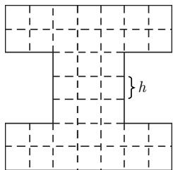
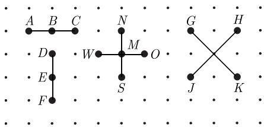
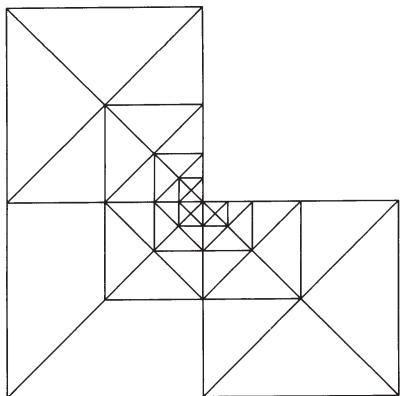

##### 7.7.2 离散方法概述

7.7.2.1 差分方程

差分方法基于用差商代替微分方程中的导数. 为此需要网格, 一般选为正则网格. 对区间 $[a, b]$ , 步长为 $h := (b - a) / N, N = 1, 2, \cdots$ , 则等距网格为

$$
\boxed {G _ {h} := \left\{x _ {k} = a + k h: 0 \leqslant k \leqslant N \right\}.}
$$

对含有 $d$ 个独立变量的偏微分方程, 需要一个 $d$ 维的定义在 $D \subset \mathbb{R}^d$ 上的网格, 此时等距格点为

$$
G _ {h} := \left\{x \in D: x = x _ {k} = k h: k = (k _ {1}, \dots , k _ {d}), k _ {i} \text {为整数} \right\},
$$

见图7.3.

对于下面提到的差分方法, 我们主要关注格点而不是相关的矩形或边 (对 $d = 2$ , 见图7.3). 我们用函数在格点 $x_{k} \in G_{h}$ 处的值 $u(x_{k})$ 来近似其导数. 由于大多数差分逼近是一维的, 至少作为介绍, 讨论单变量函数已经足够.

(光滑) 函数 $u$ 的一阶导数可以有多种近似方法. 向前差分

$$
\boxed {\partial_ {h} ^ {+} u \left(x _ {k}\right) := \frac {1}{h} \left(u \left(x _ {k + 1}\right) - u \left(x _ {k}\right)\right)}\tag{7.1a}
$$

及向后差分

$$
\boxed {\partial_ {h} ^ {-} u \left(x _ {k}\right) := \frac {1}{h} \left(u \left(x _ {k}\right) - u \left(x _ {k - 1}\right)\right)}\tag{7.1b}
$$

图 7.3 步长为 h 的网格

是单侧差分的例子. 它们仅是一阶的, 满足

$$
u ^ {\prime} (x _ {k}) - \partial_ {h} ^ {\pm} u (x _ {k}) = O (h), \quad h \to 0.\tag{7.1c}
$$

中心差分或对称差分

$$
\boxed {\partial_ {h} ^ {0} u \left(x _ {k}\right) := \frac {1}{2 h} \left(u \left(x _ {k + 1}\right) - u \left(x _ {k - 1}\right)\right)}\tag{7.2a}
$$

是二阶的, 即

$$
u ^ {\prime} \left(x _ {k}\right) - \partial_ {h} ^ {0} u \left(x _ {k}\right) = O \left(h ^ {2}\right), \quad h \rightarrow 0.\tag{7.2b}
$$

二阶导数可由下式近似:

$$
\boxed {\partial_ {h} ^ {2} u \left(x _ {k}\right) := \frac {1}{h ^ {2}} \left(u \left(x _ {k + 1}\right) - 2 u \left(x _ {k}\right) + u \left(x _ {k - 1}\right)\right).}\tag{7.3a}
$$

这个二阶差分也是二阶收敛的:

$$
u ^ {\prime \prime} (x _ {k}) - \partial_ {h} ^ {2} u (x _ {k}) = O (h ^ {2}), \quad h \rightarrow 0.\tag{7.3b}
$$

需要指出, 因为缺少必要的相邻格点, 并非所有差分在边界点 $x_0 = a$ 或 $x_N = b$ 上都有定义.

对于二维的情况, 我们需要用到无穷格点 $\{(x,y) = (kh,lh):k,l\in \mathbb{N}\}$ 的子集 $G_{h}$ . 差分 (7.1a), (7.1b), (7.2a), (7.3a) 可以用来计算 $x$ 方向或 $y$ 方向的值; 与之对应的我们记为 $\partial_{h,x}^{+},\partial_{h,y}^{+}$ . 在图 7.4 中, 二次差分用到格点 $A,B,C$ 的值表示 $\partial_{h,x}^{2}u$ ; 用点 $D,E,F$ 的值表示 $\partial_{h,y}^{2}u$ . 这两个差分的和用来近似计算拉普拉斯算子 $\Delta u = u_{xx} + u_{yy}$ :

$$
\boxed { \begin{array}{c} \Delta_ {h} u (k h, l h) = \left(\partial_ {h, x} ^ {2} + \partial_ {h, y} ^ {2}\right) u (k h, l h) \\ = \frac {1}{h ^ {2}} \left(u _ {k - 1, l} + u _ {k + 1, l} + u _ {k, l - 1} + u _ {k, l + 1} - 4 u _ {k l}\right), \end{array} }\tag{7.4}
$$

其中 $u_{kl} := u(kh, lh)$ . 由于用到五个格点, 见图7.4中的 $M, N, S, O, W$ . 式 (7.4) 称为五点公式.

用上面的差分公式, 形如 $u_{x}, u_{y}, u_{xx}, u_{yy}, \Delta u$ 的导数都可近似计算. 混合导数 $u_{xy}$ 也可用乘积 $\partial_{h,x}^{0} \partial_{h,y}^{0}$ 来近似计算:

$$
\frac {1}{4 h ^ {2}} \left(u _ {k + 1, l + 1} + u _ {k - 1, l - 1} - u _ {k + 1, l - 1} - u _ {k - 1, l + 1}\right) = u _ {x y} \left(k h, l h\right) + O \left(h ^ {2}\right), \quad h \to 0
$$

(见图7.4中的格点 $G, H, J, K$ ). 这一方法简记为星记号, 详细论述见[442]. 推广 $d$ 个独立变量的 $d$ 维格点的差分近似是显然的. 于是, 高阶导数也可以用差分来逼近.

尽管我们至今保持等距网格, 但不难给出在不同 $x_{i}$ 方向有不同步长 $h_{i}$ 的 $d$ 维网格. 如果在某一方向的步长是非等距的, 那么该方向的导数用牛顿均差法来逼近. 然而, 这里不讨论基坐标方向一般非结构的非正规网格, 因为计算二阶导数的差分逼近需要共线格点. 显然, 几何网格结构的刚性使差分法不灵活, 特别很难实现网格的局部细分.

  
图 7.4 差分近似

7.7.2.2 里茨-伽辽金方法

设 Lu = f 为微分方程, $(u, v) := \int_{D} u v \, \mathrm{d}x$ 为在定义域 D 上的内积, u 对所有的检验函数 v 都满足方程

$$
\boxed {(L u, v) = (f, v).}\tag{7.5}
$$

(7.5) 的左端一般经过分部积分写为微分方程的所谓弱形式(变分形式):

$$
\boxed {a (u, v) = f (v),}\tag{7.6}
$$

其中 $a$ 和 $f$ 分别表示函数空间 $U$ 和 $V$ 上的双线性型及泛函, 其中 $u$ 和 $v$ 是变化的. 下面仅讨论 $U = V$ 的标准情况.

里茨-伽辽金方法通过用一个有限维函数空间 $V_{n}, n = \dim V_{n}$ , 逼近全空间 $V$ , 代替微分算子 $L$ , 将问题化为

求 $u \in V_n$ ，使得 $a(u, v) = f(v)$ ，对所有的 $v \in V_n$ 都成立.

(7.7)

狄利克雷边界条件是所谓本质边界条件, 是 $V_{n}$ 定义的一部分. 另一类边界条件是所谓自然边界条件, 由问题的变分形式得到, 在公式中并未显示, 且仅被近似满足 (见 [442]).

在实际计算时, 选取 $V_{n}$ 的一组基 $\{\varphi_{1},\varphi_{2},\cdots,\varphi_{n}\}$ . 式 (7.7) 的解 u 被写成 $\sum\xi_{k}\varphi_{k}$ 的形式, 则问题 (7.7) 等价于如下线性方程组:

$$
\boxed {A x = b,}\tag{7.8a}
$$

其中 x 包含待定系数 $\xi_{k}$ ，所谓刚度矩阵 A 及右端 b 定义为

$$
\boldsymbol {A} = \left(a _ {i k}\right), \quad a _ {i k} = a \left(\varphi_ {i}, \varphi_ {k}\right), \quad \boldsymbol {b} = \left(b _ {i}\right), \quad b _ {i} = f \left(\varphi_ {i}\right).\tag{7.8b}
$$

因为剩余 $r = Lu - f$ 加权后为零： $(r,\varphi_i) = 0$ （见7.5)，该方法也被称为加权剩余法.

7.7.2.3 有限元法

有限元法, 简记为 FEM, 是相应地称为有限元 (FE) 的特殊的函数空间里的里茨-伽辽金方法. 伽辽金方法的刚度矩阵一般是满的. 为了得到与差分法类似的稀疏矩阵, 人们尝试用支集尽可能小的基函数 $\varphi_{k}$ (函数 $\varphi$ 的支集是使得 $\varphi(x) \neq 0$ 的 $x$ 的闭包). 除了少数例外, $a(\varphi_{k}, \varphi_{i})$ 中的函数的支集都是不相交的, 从而 $a_{ik} = 0$ . 全局多项式或其他全局定义的函数空间不再满足要求, 代之以分片定义的函数. 其定义包括两个方面: ① 几何单元 (定义域的非重叠分解); ② 定义在区域的这些部分的解析函数.

几何单元的一个典型例子是将二维定义域分解为三角形 (三角剖分). 这些三角形具有某种正规结构, 如将图 7.3 中的每个矩形都分成两个三角形; 但三角形结构也可如图 7.5 所示是非正规的. 若两个不同的三角形的交集或者是空集或者有公共的边或顶点, 则三角剖分称为容许的. 若三角形大小的比是有界的, 则三角剖分称为拟一致的. 若所有三角形的外接圆半径和内切圆半径之比是一致有界的, 则三角剖分称为正规的.

给定三角剖分, 在三角形上可以定义不同的函数. 例如, 分片常数函数 (此时空间 $V_{n}$ 的维数 $n$ 为三角形的个数)、分片线性函数 (在每一个三角形上线性, 整体连续; 构成的空间维数等于三角剖分顶点的个数), 或分片二次函数 (其维数等于边数与顶点数之和).

还可以用四边形代替三角形. 此外还有三维剖分 (以四面体代替三角形, 立方体代替四边形). 关于有限元法更详细的介绍见文献 [440].

因为三角剖分的三角形（四边形）作为积分区域进入有限元方程（7.8a）和(7.8b)，所以对有限元法而言，网格更重要的方面是面，而不是顶点或边．生成三角剖分的适当方法包括由粗剖分出发及随后加密，如下面7.7.6.2和7.7.7.6所述.

  
图 7.5 非正规三角剖分

7.7.2.4 彼得罗夫-伽辽金方法

若 (7.6) 中的函数 $u$ 和 $v$ 分别属于不同的函数空间 $U$ (函数空间) 和 $V$ (检验函数空间), 则得到推广的里茨-伽辽金方法, 也称彼得罗夫-伽辽金方法.

7.7.2.5 有限体积法

有限体积法 (有时称为盒方法) 是差分法和有限元法的混合. 就差分法而论, 常用图 7.3 所示的正方形网格, 并且关注沿着网格边的流量.

为了给出该方法的数学公式, 取式 (7.5) 中的 $v$ 为单元 $E$ 的特征函数 (即在正方形 $E$ 上 $v = 1$ , 其他 $v = 0$ ). 式 (7.5) 的左端是 $E$ 上的积分 $\int_{E} L u \mathrm{d} x$ . 分部积分得到正方形边界 $\partial E$ 上的积分, 后者可以用不同的方法逼近.

若微分算子 L 具有 $Lu = divMu$ 的形式 (如 M = grad), 则分部积分导致

$$
\int_ {\partial E} (M u) \boldsymbol {n} \mathrm{d} F = \int_ {E} f \mathrm{d} x,
$$

其中 $(Mu)\pmb{n}$ 为与外法线单位向量 $\pmb{n}$ 的内积. 若两个单元的公共边的法向量方向相反, 则所有单元 $E$ 的和表示在定义域 $D$ 上的守恒律

$$
\int_ {\partial D} (M u) \boldsymbol {n} \mathrm{d} F = \int_ {D} f \mathrm{d} x.
$$

这一守恒性正是选用有限体积法的决定性原因. 为说明名称的合理性, 这里考虑以立方体为 “有限体积” 的三维情况.

7.7.2.6 谱方法和配置法

有限元法用固定分片多项式的次数而减小单元尺寸来逼近. 用这种方法只能达到固定阶的逼近. 实际上, 形如 $Ch^p$ 的典型误差, 其中 $h$ 为单元的大小, $p$ 为最大可能的逼近阶. 在二维的情况, $h$ 和有限元空间 $V_n$ 维数 $n$ 由 $n = C / h^2$ 相联系. 于是误差是维数的函数 $O\left(n^{-p/2}\right)$ . 另一方面, 估计 $O(\mathrm{e}^{-\alpha n^b}), \alpha > 0, b > 0$ , 描述以全局多项式或三角函数逼近光滑解时可能达到的指数收敛速度.

谱方法用全局函数结合特殊的几何结构 (如正方形)，由配置法得到离散方程. 该方法对微分方程 $Lu = f$ 只要求在某些特定的点而不是在整个区域上成立. 彼得罗夫-伽辽金方法形式上可以根据检验空间的分布来说明.

谱方法的不足在于刚度矩阵是满的, 而且对计算区域要求具有特殊的结构. 另外, 解的光滑性要求一般不能整体满足.

7.7.2.7 h 方法, p 方法和 hp 方法

步长 h 趋于零的通常有限元法也称为 h 方法. 另一方面, 若对于固定的网格, 如谱方法一样增加分片多项式的次数 p, 则称之为 p 方法.

这两种方法的组合称为 hp 方法. 此时函数空间由大小为 h 的几何单元上的 p 次有限元函数组成. 若对问题应用 hp 方法则可得到很精确的逼近. 如在 7.7.6 中简要介绍的, 局部选取 h 和 p 的途径是自适应离散化的典型课题. 这里选取检验空间等同于函数空间, 因此事实上, 它是里茨-伽辽金方法的特殊情况.
