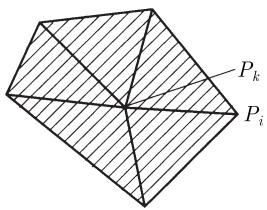
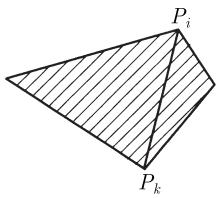
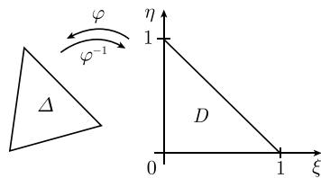
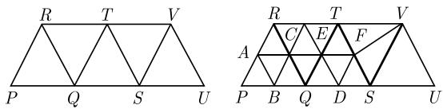
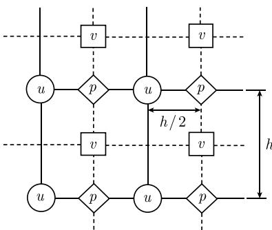

##### 7.7.3 椭圆型微分方程

7.7.3.1 正定边值问题

现在讨论标量微分方程. 而对可视为一类鞍点问题的微分方程组, 因其对有限元离散化提出新的要求, 将在 7.7.3.2 中讨论.

7.7.3.1.1 模型问题 (泊松方程和亥姆霍兹方程)

设 $\Omega$ 为 $\mathbb{R}^2$ 上的有界区域, 边界为 $\Gamma := \partial \Omega$ . 拉普拉斯算子定义为 $\Delta u := u_{xx} + u_{yy}$ . 所有二阶微分方程的范例由泊松方程给出

$$
\boxed {- \Delta u = f \quad \text {在} \Omega \text {上}.}\tag{7.9a}
$$

函数 $f = f(x, y)$ 为源, 是已知的. 问题是确定函数 $u = u(x, y)$ . 边值问题由微分方程 (7.9a) 加上边界条件给出, 如狄利克雷边界条件

$$
\boxed {u = g \quad \text {在边界} \quad \Gamma \text {上}.}\tag{7.9b}
$$

这类边值问题的解是唯一确定的. 若 $f = 0$ , 则是拉普拉斯方程或位势方程, 且如下极值原理成立: 解 $u$ 在边界 $\Gamma$ 上取极大值或极小值.

下面为了方便, 仅考虑齐次边值条件, 即 $g = 0$ 的情况. 对于边界 $\Gamma$ 上非齐次边值 $g$ , 求其到整个 $\Omega$ 的任意光滑延拓 $G$ (即在 $\Gamma$ 上 $G = g$ ). 引入辅助函数 $\tilde{u} := u - G$ , 它满足 $\Gamma$ 上的齐次边界条件 $\tilde{u} = 0$ 和新的微分方程 $-\Delta \tilde{u} = \tilde{f}$ , 其中 $\tilde{f} := \Delta G + f$ .

作为第二个例子, 引入函数 $u = u(x, y)$ 的亥姆霍兹方程:

$$
\boxed {- \Delta u + u = f \quad \text {在} \Omega \text {上},}\tag{7.10a}
$$

其诺伊曼边界条件为

$$
\left| \frac {\partial u}{\partial \boldsymbol {n}} = g \quad \text {在边界} \Gamma \text {上}. \right|\tag{7.10b}
$$

其中

$$
\frac {\partial u}{\partial \boldsymbol {n}} := \boldsymbol {n} (\operatorname{grad} u)
$$

表示边界点上的外法向导数, 即 n 为外法向单位向量.

在关于函数 $u$ 无穷远性态的适当假设下，诺伊曼边值问题即使对无界区域 $\Omega$ 也唯一可解.

d 维泊松方程是 $-\Delta u = f$ ，其中

$$
- \Delta u := - u _ {x _ {1} x _ {1}} - \dots - u _ {x _ {d} x _ {d}} = - \mathrm{div} \mathbf {g r a d} u.
$$

此外, 设 $\boldsymbol{A} = \boldsymbol{A}(x_{1}, \cdots, x_{d})$ 为 $d \times d$ 矩阵, $\boldsymbol{b} = \boldsymbol{b}(x_{1}, \cdots, x_{d})$ 为 d 维向量函数及 $c = c(x_{1}, \cdots, x_{d})$ 为标量函数. 则有

$$
- \operatorname{div} (A \operatorname{grad} u) + b \operatorname{grad} u + c u = f\tag{7.11}
$$

为一般的二阶线性微分方程. 若 $A(x_{1},\cdots,x_{d})$ 是正定的, 则称之为椭圆型方程, 其中, $-\mathrm{div}(A\mathrm{grad}u)$ 为扩散项, $bgradu$ 为对流项, cu 为反应项. 泊松方程和亥姆霍兹方程都是 (7.11) 中 A=I 和 b=0 时的特殊情况.

7.7.3.1.2 变分问题

根据相应于分部积分的格林公式

$$
- \int_ {\Omega} (\Delta u) v \mathrm{d} x = \int_ {\Omega} \mathbf {g r a d} u \mathbf {g r a d} v \mathrm{d} x - \int_ {\Gamma} \frac {\partial u}{\partial \boldsymbol {n}} v \mathrm{d} F,
$$

由 $-\Delta u = f$ 可得

$$
\boxed {\int_ {\Omega} \mathbf {g r a d} u \mathbf {g r a d} v \mathrm{d} x = \int_ {\Omega} f v \mathrm{d} x + \int_ {\Gamma} \frac {\partial u}{\partial \boldsymbol {n}} v \mathrm{d} F,}
$$

其中

$$
\operatorname{grad} u \operatorname{grad} v := \sum_ {i = 1} ^ {d} u _ {x _ {i}} v _ {x _ {i}},
$$

$u_{x}$ 表示 u 关于 $x_{i}$ 的偏导数. 在 $R^{2}$ 中, 有 d=2.

根据 7.7.3.1.1, 可假设有齐次狄利克雷边界条件, 即在 $\Gamma$ 上 u = 0. 因此假设 u 和 v 在边界 $\Gamma$ 上都为 0.

例 1: 泊松方程的经典齐次狄利克雷问题为

$$
- \Delta u = f \quad \text {在} \varOmega \text {上}, \quad u = 0 \quad \text {在} \varGamma \text {上}.
$$

在方程两边同时乘以边界上为 0 的任意光滑函数 v，则由格林公式得到所谓的弱形式

$$
\boxed {\int_ {\Omega} \mathbf {g r a d} u \mathbf {g r a d} v \mathrm{d} x = \int_ {\Omega} f v \mathrm{d} x, \quad u = 0 \text {在} \Gamma \text {上}.}
$$

注意到, 由于在 $\Gamma$ 上 $v = 0$ , 格林公式中的边界积分 $\int (\partial u / \partial \pmb{n}) v \mathrm{d}F$ 为零.

为了保证解的存在性, 必须利用索伯列夫空间. 最终的变分问题是求函数

$$
u \in H _ {0} ^ {1} (\Omega)
$$

使得

$$
\boxed {a (u, v) = b (v), \quad \text {对所有的} \quad v \in H _ {0} ^ {1} (\Omega).}\tag{7.12}
$$

这里设

$$
a (u, v) := \int_ {\Omega} \mathbf {g r a d} u \mathbf {g r a d} v \mathrm{d} x, \quad b (v) = \int_ {\Omega} f v \mathrm{d} x.
$$

索伯列夫空间 在方程 (7.12) 中, $H_0^1 (\Omega)$ 表示所谓的索伯列夫空间. 简单地说, 索伯列夫空间 $H^{1}(\Omega)$ 由平方可积且其一阶偏导数也平方可积的函数组成. 换言之, 有

$$
\int_ {\Omega} \left(u ^ {2} + | \mathbf {g r a d} u | ^ {2}\right) \mathrm{d} x <   \infty .
$$

空间 $H^{1}(\Omega)$ 可通过引入如下内积赋以希尔伯特空间结构

$$
(u, v) := \int_ {\Omega} (u v + \mathbf {g r a d} u \mathbf {g r a d} v) \mathrm{d} x.
$$

索伯列夫空间 $H_0^1 (\Omega)$ 由 $H^{1}(\Omega)$ 空间中所有在 $\Gamma$ 上满足 $u = 0$ (在所谓广义边值的意义下)的函数组成.该空间关于内积

$$
(u, v) := \int_ {\Omega} \mathbf {g r a d} u \mathbf {g r a d} v \mathrm{d} x
$$

也有希尔伯特空间结构.

这里用到的准确定义见 [212]. 注意 $H^{1}(\Omega)$ (及 $H_{0}^{1}(\Omega)$ ) 相应于 $p = 2$ 时的 $W_{p}^{1}(\Omega)$ (及 $\stackrel{\circ}{W}_{p}^{1}(\Omega)$ ).

例 2: 考虑带诺伊曼边界条件的亥姆霍兹方程

$$
- \Delta u + u = f \quad {\text {在}} \Omega {\text {上}}, \quad {\frac {\partial u}{\partial {\pmb n}}} = g \quad {\text {在}} \Gamma {\text {上}}.
$$

现在重要的是函数 $v$ 在边界上不再受限制. 类似于例1在方程两边同时乘以函数 $v$ , 得到如下变分问题. 问题化为确定函数

$$
u \in H ^ {1} (\Omega)
$$

使得

$$
\boxed {a (u, v) = b (v), \quad \text {对所有的} v \in H ^ {1} (\Omega).}\tag{7.13}
$$

这里用到记号

$$
\begin{array}{c} a \left(u, v\right) := \int_ {\Omega} (\mathbf {g r a d} u \mathbf {g r a d} v + u v) \mathrm{d} x, \\ b \left(v\right) := \int_ {\Omega} f v \mathrm{d} x + \int_ {\Gamma} g v \mathrm{d} F. \end{array}
$$

例 1 和例 2 生成的双线形型 $a(\cdot,\cdot)$ 是强正定的 $^{1)}$ ，即有确定的不等式

$$
\boxed {a (u, v) \geqslant c \| u \| _ {V} ^ {2}, \quad \text {对所有的} u \in V \text {以及某些} c > 0.}\tag{7.14}
$$

在例 1 中, 必须选取空间 $V = H_{0}^{1}(\Omega)$ , 且赋予范数

$$
\| u \| _ {V} ^ {2} = (u, u) _ {V} = \int_ {\Omega} \mathbf {g r a d} u \mathbf {g r a d} u \mathrm{d} x.
$$

另一方面, 在例 2 中, 取空间 $V = H^{1}(\Omega)$ 及

$$
\| u \| _ {V} ^ {2} = (u, u) _ {V} = \int_ {\Omega} \left(u ^ {2} + | \mathbf {g r a d} u | ^ {2}\right) \mathrm{d} x.
$$

我们将在 [212] 中讨论, 方程

$$
a (u, v) = b (v), \quad \text { 对所有的 } v \in V, \quad \text { 及给定的 } u \in V
$$

在适当的假设下, 等价于二次变分问题

$$
\frac {1}{2} a (u, u) - b (u) \stackrel {!} {=} \min., \quad u \in V.
$$

这使得用 “变分问题” 这一名字更合理.

不等式 (7.14) 确保变分问题 (7.12) 和 (7.13) 有唯一解.

7.7.3.1.3 对有限元法的应用

对协调有限元法, 函数空间 $V_{n}$ 必须是 (7.12) 和 (7.13) 中用到的 $H_{0}^{1}(\Omega)$ 和 $H^{1}(\Omega)$ 的子空间. 对于上述定义的分片函数, 这实际上意味着函数必须整体连续. 在 $\Omega$ 的容许三角剖分上最简单的选择是分片线性函数. 为简单起见, 假设 $\Omega$ 为多边形, 那么准确的三角剖分是可能的.

首先考虑 (7.13) 中给出的例子. 以拉格朗日函数 $\{\varphi_P: P \in E\}$ 作为有限元空间的基函数, 其中 $E$ 为三角剖分顶点的集合. 作为满足 $\varphi_P(Q) = \delta_{PQ}(P, Q \in E, \delta_{PQ}$ 为克罗内克记号) 的分片连续函数, 拉格朗日函数被唯一确定. 其支集由以 $P$ 为公共顶点的所有三角形组成. 有限元空间 $V_n \subset H^1(\Omega)$ 由所有基函数 $\{\varphi_P: P \in E\}$ 张成. 拉格朗日基也被称为标准基. 根据 (7.8b) 需要计算刚度矩阵 $\mathbf{A}$ 的元素 $a_{ik} = a(\varphi_k, \varphi_i)$ , 其中指标 $i, k = \{1, \cdots, n\}$ 与三角剖分的顶点 $\{P_1, \cdots, P_n\} \in E$ 相一致.

对狄利克雷问题 (7.12), 空间 $V_{n} \subset H_{0}^{1}(\Omega)$ 还必须满足零边值条件. 即对所有 $v \in V_{n}, Q \in E \cap \Gamma$ , 有 $v(Q) = 0$ . 因此 $V_{n}$ 由所有的拉格朗日基函数 $\{\varphi_{P}: P \in E_{0}\}$ 张成, 其中子集 $E_{0} \subset E$ , 由 $E$ 的所有内部顶点组成, 即 $E_{0} := E \setminus \Gamma$ .

7.7.3.1.4 有限元矩阵的表示

如果 $\varphi_{i}$ 和 $\varphi_{k}$ 的支集有公共内点，则系数 $a_{ki} = a(\varphi_k, \varphi_i)$ 必定非零。此时相应的顶点 $P_{k}, P_{i}$ 重合或被三角剖分的一条边连接（图7.6(a))。因此矩阵 $\mathbf{A}$ 第 $k$ 列的非零元素的个数为1加上与 $P_{k}$ 相邻的顶点的个数。 $\dot{P}_{i}$ 被定义为 $P_{k}$ 的邻点的条件是 $P_{k}P_{i}$ 是三角剖分的一条边。为了表示这一矩阵，使用数据结构来保存关于三角剖分的几何信息总是有利的。矩阵元素 $a_{kk}$ 和顶点 $P_{k}$ 相关，而矩阵元素 $a_{ki}$ 则和点 $P_{k}$ 到 $P_{i}$ 的指向相关。每个矩阵与向量的积 $\mathbf{Ax}$ 仅要求对所有与 $i$ 相关的 $a_{ki}x_{i}$ 求和（即 $i$ 使得 $a_{ik} \neq 0$ ）。这些是 $i = k$ 和存在上述指向的所有 $i$ 。

(a)  

  
图 7.6 三角剖分和有限元矩阵

7.7.3.1.5 有限元矩阵的计算

(7.12) 中的系数 $a_{ik} = a(\varphi_k, \varphi_i)$ 等于 $\int_{\Omega} \mathbf{grad}\varphi_k\mathbf{grad}\varphi_i\mathrm{d}x$ . 积分区域 $\Omega$ 可以减小为 $\varphi_k$ 和 $\varphi_i$ 的支集之交. 当 $i = k$ 时, 即以 $P_k$ 为顶点的所有三角形之并 (见 (7.6a)), 而当 $i \neq k$ 时, 则是以 $P_k P_i$ 为公共边的两个三角形之并. 于是积分问题简化为对少数三角形计算积分 $\int_{\Omega} \mathbf{grad}\varphi_k\mathbf{grad}\varphi_i\mathrm{d}x$ .

因为三角剖分的三角形有不同的形状, 计算可通过线性映射将所有三角形映射到单位三角形 $D = \{(\xi, \eta) : \xi \geqslant 0, \eta \geqslant 0, \xi + \eta \leqslant 1\}$ 进行简化 (图7.7). 详情见 [442]8.3.2节. 于是积分化为单位三角形 $D$ 上的数值积分. 因为 $\int_{\Delta} \mathrm{grad} \varphi_k \mathrm{grad} \varphi_i \mathrm{d}x$

  
图 7.7 使用单位三角形 D

中的梯度对分片线性函数为常数，单点求积即可得准确结果. 而在 (7.13) 中，由于 $a_{ik} = a(\varphi_k, \varphi_i) = \int_{\Omega} (\mathbf{grad}\varphi_k\mathbf{grad}\varphi_i + \varphi_k\varphi_i)\mathrm{d}x$ 中有附加的二次项 $\varphi_k\varphi_i$ ，则要用较高的求积公式，见 [432]. 在如 (7.11) 这样更一般的变系数情况，求积分的误差是不变的，且必须考虑数值分析.

7.7.3.1.6 稳定条件

稳定性保证刚度矩阵 A 的逆矩阵存在且在适当意义下保持有界. 不等式 (7.14) 是一个非常强的稳定性条件. 在假设 (7.14) 下, 里茨-伽辽金方法 (特别是有限元法) 对任意 $V_{n} \subset V$ 都有唯一解. 若函数 a 满足对称性 $a(u, v) = a(v, u)$ , 则刚度矩阵是正定的.

在一般情况下, 稳定性的充分必要条件由巴布什卡 (Babuska) 条件 (infinimun-supermum 条件) 给出:

$$
\inf \left(\sup \left\{\left| a (u, v) \right|: v \in V _ {n}, \| v \| _ {V} = 1 \right\} \mid u \in V _ {n}, \| u \| _ {V} = 1\right) := \varepsilon_ {n} > 0
$$

(见 [442] 6.5 节). 如果有一族维数 $n = \dim V_n$ 增加的有限元网格, 则必须满足 $\inf_{n} \varepsilon_n > 0$ , 否则有限元法收敛到真解是成问题的.

7.7.3.1.7 等参元和分层基

图 7.7 描绘的逆映射将单位三角形 D 线性映射到任意三角形 $\Delta$ . 如果允许 $\Phi: D \to \Delta$ 是非线性 (如二次) 映射, 则提出了一个新的问题. 若 $\Omega$ 不是多边形区域, 三角剖分后边界总存在弯曲部分, 它可以由 $\Phi(D)$ 逼近. 在 $\Phi(D)$ 上使用函数 $v \circ \Phi^{-1}$ , 其中 $v$ 是 $D$ 上的线性函数. 矩阵元素的计算可以化为区域 $D$ 上的积分.

  
图 7.8 有限元剖分的加密图

有限元空间 $V_{n}$ 所属的三角剖分可以进一步加密 (图 7.8). 新的有限元空间 $V_{N}$ 包含原先的空间 $V_{n}$ . 所以, 可以将 $V_{n}$ 中新增节点的基函数添加到空间 $V_{N}$ 中, 以此得到新空间 $V_{N}$ 的基. 如图 7.8 所示, 空间 $V_{N}$ 中的顶点包含粗网格的顶点 $P, Q, \cdots, T$ , 加密后的顶点为 $A, \cdots, F, V$ . 特别若剖分加密重复多次, 称之为分层基 (见文献 [442] 8.7.5 和 [444] 11.6.4). 它也用于定义迭代算法 (见 7.7.7.7).

7.7.3.1.8 差分方法

为求解泊松方程 (7.9a)，以如图 7.3 的网格来覆盖区域。对网格的每个内部顶点，我们用五点公式 (7.4) 对拉普拉斯算子作差分逼近。如果有一个邻点在边界上，则用式 (7.9b) 给出的值代替。这样得到的线性方程组是一个 $n \times n$ 稀疏矩阵 $\mathbf{A}$ ，其中 $n$ 为网格的内部顶点个数。矩阵 $\mathbf{A}$ 的每一行最多有 5 个非零元素。因此矩阵乘积 $\mathbf{A}\mathbf{x}$ 可以快速计算。这正是迭代法求解方程组 $\mathbf{A}\mathbf{x} = \mathbf{b}$ 的优点。

对于一般的区域, 边界并不与网格的边重合, 在非等距点的边界上存在差异 (也见 7.7.2.1). 处理这类问题的肖特利-韦勒(Shortley-Weller)方法的详细介绍见 [442] 的 4.8.1 节.

除了相容性 (差分公式逼近微分算子 $L$ ), 方法的稳定性也是必要的; 这可由逆矩阵 $\mathbf{A}^{-1}$ 的有界性来表述 (见 [442], 4.8.1 节). 稳定性通常由 $\mathbf{A}$ 的 M 矩阵性质得到.

7.7.3.1.9 M 矩阵

若对 $i \neq k$ , 有 $a_{ii} \geqslant 0, a_{ik} \leqslant 0$ , 且 $\mathbf{A}^{-1}$ 所有分量非负, 则矩阵 $\mathbf{A}$ 称为 M 矩阵. 例如负的五点差分格式 (7.4) 满足关于符号的第一个条件. 关于 $\mathbf{A}^{-1}$ 的要求的充分条件是不可约对角占优, 这在当前情况也满足. 详细介绍见文献 [442] 的 4.5 节.

7.7.3.1.10 对流扩散方程

在 (7.11) 中, 尽管主项 (扩散项)–div(Agradu) 决定微分方程的椭圆性质, 但一旦 ||A|| 与 ||b|| 相比相对小, 那么对流项 bgradu 在方程中可能起决定性作用. 今以一维问题为例说明之,

$$
\boxed {- u ^ {\prime \prime} + \beta u ^ {\prime} = f \quad \text {在} [ 0, 1 ] \text {上}}
$$

(即 (7.11) 中的 $d = 1, A = 1, b = \beta, c = 0$ ). 结合对 $-u''$ 用 (7.3a) 第二个差分公式及对 $\beta u'$ 用 (7.2a) 中心差分公式, 得到关于 $u(x_k)$ ( $x_k := kh$ 为步长) 的近似值 $u_k$ 的离散方程 $-\partial_h^2 u + \partial_h^0 u = f$ :

$$
\boxed {- \left(1 + \frac {h \beta}{2}\right) u _ {k - 1} + 2 u _ {k} - \left(1 - \frac {h \beta}{2}\right) u _ {k + 1} = h ^ {2} f (x _ {k}).}
$$

当 $|h\beta| \leqslant 2$ ，得到M矩阵，此时可保证稳定性。由于 $\partial_h^2$ 和 $\partial_h^0$ 都是二阶收敛的，那么 $u_k$ 可精确到 $O(h^2)$ 。而当 $|h\beta|$ 大于2时，M矩阵的符号条件不再满足，差分解开始变得不稳定，导致振荡（见文献[442]10.2.2节）。此时求得的解 $u_k$ 一般是无用的。条件 $|h\beta| \leqslant 2$ 说明，或者步长 $h$ 充分小，或者对流项不起决定作用。

在 $|h\beta| > 2$ 的情况, 可以根据 $\beta$ 的符号在 (7.1a,b) 中以向前或向后差分代替 $\partial_h^0$ . 例如, 对 $\beta < 0$ , 有

$$
- (1 + h \beta) u _ {k - 1} + (2 - h \beta) u _ {k} - u _ {k + 1} = h ^ {2} f (x _ {k}).
$$

这里又有 M 矩阵. 然而根据 (7.1c), 逼近仅为一阶.

因为当 $\beta$ 变大时, 通常的有限元法变得不稳定, 故有限元也需要某种稳定化.

7.7.3.2 鞍点问题

拉梅 (Lamé) 方程得到的双线性型满足不等式 (7.14), 而现在讨论的斯托克斯 (Stokes) 方程则导致不定的双线性型.

7.7.3.2.1 模型：斯托克斯方程

对不可压缩流体, 流体力学中最基本的纳维-斯托克斯方程是

$$
\begin{array}{c} - \eta \Delta \boldsymbol {v} + \rho (\boldsymbol {v} \text {grad}) \boldsymbol {v} + \text {grad} p = \boldsymbol {f}, \\ \operatorname{div} \boldsymbol {v} = 0. \end{array}
$$

这里 $\boldsymbol{v}=(v_{1},\cdots,v_{d})$ 为速度矢量, p 为压力, f 为外力密度, $\eta$ 为黏性常数, $\rho$ 为流体密度.

如果与 $\rho$ 相比 $\eta$ 很大, 那么可以近似地忽略 $\rho(\mathbf{v}\operatorname{grad})\mathbf{v}$ 项. 通过规范化 $\eta=1$ , 得到斯托克斯方程

$$
\boxed {- \Delta \boldsymbol {v} + \mathbf {g r a d} p = \boldsymbol {f},}\tag{7.15a}
$$

$$
\boxed {- \operatorname{div} \boldsymbol {v} = 0.}\tag{7.15b}
$$

方程 (7.15a) 有形如 $-\Delta v_{i} + \partial p / \partial x_{i} = f_{i}$ 的 $d$ 个分量. 因为压力可以差一个常数, 取 $\int p\mathrm{d}x = 0$ 为规范化条件. 对速度场 $\pmb{v}$ 必须附加边界条件, 为简单起见我们在下面的讨论中忽略之. 对压力 p 则没有这样的自然边界条件.

在 (7.15a), (7.15b) 中给出方程是分块形式的微分方程组的例子

$$
\left( \begin{array}{c c} A & B \\ B ^ {*} & 0 \end{array} \right) \binom{\boldsymbol {v}}{p} = \binom{\boldsymbol {f}}{0},\tag{7.16}
$$

其中 $A = -\Delta, B = \operatorname{grad}, B^{*} = -\operatorname{div}(B^{*}$ 为 B 的伴随算子). 如果用实数 $\xi_{i}, i = 1, \cdots, d$ ，替换微分算子 $\partial/\partial x$ ，则 A, B, $B^{*}$ 转化为 $-|\xi|^{2} I(I$ 为 $3 \times 3$ 单位矩阵 $)$ ， $\xi$ 和 $-\xi^{T}$ . 分块微分算子 $L = \begin{pmatrix} A & B \\ B^{*} & 0 \end{pmatrix}$ 在替换后转化为矩阵 $\hat{L}(\xi)$ ，且 $\det |L(\xi)| = |\xi|^{2d}$ . 当 $\xi \neq 0$ 时为正值，从而斯托克斯方程为椭圆方程组. 椭圆方程组的阿格蒙-道格拉斯-尼伦伯格定义的详情见 [442]12.1 节.

若将问题的未知量合写成向量形式 $\varphi = \left( \begin{array}{c} \boldsymbol{v} \\ p \end{array} \right)$ , 则和 (7.15a) 一样, (7.16) 可写为 $L\varphi = \left( \begin{array}{c} \boldsymbol{f} \\ 0 \end{array} \right)$ . 乘以 $\psi = \left( \begin{array}{c} \boldsymbol{w} \\ q \end{array} \right)$ , 积分后得到双线性型

$$
c (\boldsymbol {\varphi}, \boldsymbol {\psi}) := a (\boldsymbol {v}, \boldsymbol {w}) + b (p, \boldsymbol {w}) + b (q, \boldsymbol {v}).\tag{7.17a}
$$

这里设

$$
\begin{array}{l} a \left(\boldsymbol {v}, \boldsymbol {w}\right) := \sum_ {i = 1} ^ {d} \int_ {\Omega} \mathbf {g r a d} v _ {i} \mathbf {g r a d} w _ {i} \mathrm{d} x, \\ b \left(p, \boldsymbol {w}\right) := \int_ {\Omega} \left(\mathbf {g r a d} p\right) \boldsymbol {w} \mathrm{d} x, \\ b ^ {*} \left(\boldsymbol {v}, q\right) := b \left(q, \boldsymbol {v}\right) = \int_ {\Omega} q \mathrm{div} \boldsymbol {v} \mathrm{d} x. \end{array}
$$

原问题的弱形式为：求 $\varphi = \left( \begin{array}{c}v\\ p \end{array} \right)$ ，使得

$$
\boxed {c (\boldsymbol {\varphi}, \boldsymbol {\psi}) = \int_ {\Omega} \boldsymbol {f} \boldsymbol {w} \mathrm{d} x, \quad \text {对所有的} \quad \psi = \left( \begin{array}{l} \boldsymbol {w} \\ q \end{array} \right).}\tag{7.17b}
$$

类似 (7.15a, b), 等价于 (7.17b) 的变分问题为

$$
\boxed {a (\boldsymbol {v}, \boldsymbol {w}) + b (p, \boldsymbol {w}) = \int_ {\Omega} \boldsymbol {w f} \mathrm{d} x, \quad \text {对所有的} \quad \boldsymbol {w} \in V,}\tag{7.18a}
$$

$$
\boxed {b ^ {*} (\boldsymbol {v}, q) = 0, \quad \text {对所有的} \quad q \in \boldsymbol {W}.}\tag{7.18b}
$$

在斯托克斯方程的情况, (7.18a,b) 中适当的似函数空间 $V$ 和 $W$ 为 $V = \left[H^{1}(\Omega)\right]^{d}$ , $W = L^{2}(\Omega) / \mathbb{R}$ , 后者为关于常数函数的商空间.

二次泛函 $F(\varphi):= c(\varphi, \varphi) - 2\int_{\Omega} \boldsymbol{f}\boldsymbol{v}\mathrm{d}x$ 的显式表达为

$$
F (\boldsymbol {v}, p) = a (\boldsymbol {v}, \boldsymbol {v}) + 2 b (p, \boldsymbol {v}) - 2 \int_ {\Omega} \boldsymbol {f} \boldsymbol {v} \mathrm{d} x.\tag{7.19}
$$

若双线性型 $c(\varphi, \psi)$ 对称正定, 则 (7.17b) 的解可通过极小化 $F(\boldsymbol{v}, p) \stackrel{!}{=} \min$ 得到. 若对 $\varphi = \left( \begin{array}{l} \mathbf{0} \\ p \end{array} \right) \neq \mathbf{0}$ 有 $c(\varphi, \varphi) = 0$ , 则双线性型不是对称正定的. 设 $(\boldsymbol{v}^{*}, p^{*})$ 是 (7.17b) 或 (7.18a, b) 的解. 这是 $F$ 的鞍点, 即

$$
F \left(\pmb {v} ^ {*}, p\right) \leqslant F \left(\pmb {v} ^ {*}, p ^ {*}\right) \leqslant F \left(\pmb {v}, p ^ {*}\right), \quad \text {对所有的} \pmb {v}, p.\tag{7.20}
$$

这一不等式描述 F 在点 $(\boldsymbol{v}^{*}, p^{*})$ 关于 v 最小而关于 p 最大. 此外, 有

$$
F \left(\boldsymbol {v} ^ {*}, p\right) = \min _ {\boldsymbol {v}} F \left(\boldsymbol {v} ^ {*}, p ^ {*}\right) = \max _ {p} \min _ {\boldsymbol {v}} F \left(\boldsymbol {v}, p\right).\tag{7.21}
$$

关于 $(7.17b)$ , $(7.18a,b)$ 和 $(7.21)$ 的等价性参见 [442]12.2.2 节.

为了对鞍点问题进一步解释, (7.16) 中引入满足限制条件 $B^{*} \pmb{v} = 0$ 的一类函数 $\pmb{v}$ , 其中 $\pmb{v} \in V_0 \subset V$ . 对斯托克斯问题它是无散度函数 $(\mathrm{div} \pmb{v} = 0)$ 的集合, (7.18)\~(7.20) 的解可由在 $V_0$ 上极小化 $a(\pmb{v}, \pmb{v}) - 2 \int_{\Omega} f \pmb{v} \, \mathrm{d}x$ 的变分问题得到. 在公式中压力 $p$ 为表示限制 $\mathrm{div} \pmb{v} = 0$ 的拉格朗日变量.

(7.18a,b) 有解的充分必要条件是如下巴布什卡-布雷齐条件, 对于对称的情况, $a(\boldsymbol{v}, \boldsymbol{w}) = a(\boldsymbol{w}, \boldsymbol{v})$ , 有公式

$$
\inf \left(\sup \left\{\left| a (\boldsymbol {u}, \boldsymbol {v}) \right|: \boldsymbol {v} \in V _ {0}, \| \boldsymbol {v} \| _ {\boldsymbol {V}} = 1 \right\} \mid \boldsymbol {u} \in V _ {0}, \| \boldsymbol {u} \| _ {\boldsymbol {V}} = 1\right) > 0,\tag{7.22a}
$$

$$
\inf \left(\sup \left\{\left| b (\boldsymbol {p}, \boldsymbol {v}) \right|: \boldsymbol {v} \in V, \| \boldsymbol {v} \| _ {V} = 1 \right\} \mid \boldsymbol {p} \in \boldsymbol {W}, \| \boldsymbol {p} \| _ {W} = 1\right) > 0.\tag{7.22b}
$$

对斯托克斯问题, (7.22a) 对用 V 代替 $V_{0}$ 的更强的形式也是正确的.

7.7.3.2.2 差分方法

考虑 $d = 2$ 平面的情况．将二维的速度向量 $\pmb{v}$ 写作 $(u,v)$ 与7.7.3.1.8的方法不同，这里不采用单一正方形网格，而对 $u,v,p$ 采用三个不同的网格.如图7.9所示， $u$ 网及 $v$ 网格分别在 $x$ 方向及 $y$ 方向对 $p$ 网格移动半个步长．这保证了 $u$ 格点的顶点不仅对式(7.4) $\Delta_h$ 满足五点差分格式，也满足对称差分公式$\partial_{h / 2,x}^{0}p(x,y):= [p(x + h / 2) - p(x - h / 2)] / h.$ 与(7.2a)相比，它移动半个步长定义的．这样(7.15a）的第一个方程 $-\Delta u + \partial p / \partial x = f_{1}$ ，被差分方程二阶精度逼近

$$
\boxed {- \Delta_ {h} u + \partial_ {h / 2, x} ^ {0} p = f _ {1}, \quad u \text {方向网格}}
$$

类似地, 有

$$
\boxed {- \Delta_ {h} u + \partial_ {h / 2, y} ^ {0} p = f _ {2}, \quad v \text {方向网格}.}
$$

不可压缩条件 (7.15) 的显式表达式为 $\partial u / \partial x + \partial v / \partial y = 0$ . 在每个 $p$ 网格点 $(x, y)$ , 有 $(x \pm h / 2, y)$ 处的 $u$ 值和 $(x, y \pm h / 2)$ 处的 $v$ 值. 因此, 差分方程

$$
\left| \partial_ {h / 2, x} ^ {0} u + \partial_ {h / 2, y} ^ {0} v = 0, \quad p \text {方向网格} \right.
$$

可以被引入且达到二阶精度.

  
图 7.9 变量 u, v, p 的网格

7.7.3.2.3 混合有限元法

用适当选择的有限元函数构成的有限维空间 $V_{h}$ 和 $W_{h}$ 代替无穷维空间 $V$ 和 $W$ , 鞍点问题 (7.18a), (7.18b) 可有限元离散化. 指标 $h$ 表示三角剖分后得到三角形的尺度. 有限元解 $\pmb{v}^{h} \in V_{h}, \pmb{p}^{h} \in W_{h}$ 必须满足变分问题

$$
a \left({\pmb v} ^ {h}, {\pmb w}\right) + b \left({\pmb p} ^ {h}, {\pmb w}\right) = \int_ {\Omega} {\pmb f} {\pmb w} \mathrm{d} x, \quad \text {对所有的} \quad {\pmb w} \in V _ {h},\tag{7.23a}
$$

$$
b \left({\pmb q}, {\pmb v} ^ {h}\right) = 0, \quad \text {对所有的} \quad {\pmb q} \in W _ {h}.\tag{7.23b}
$$

设 $V_{h,0}$ 是满足约束 (7.23b) 的所有函数 $\pmb{v}^h\in V_h$ 构成的空间．方程(7.23b）正是原散度条件(7.15b)的逼近.因此空间 $V_{h,0}$ 中的函数不再包含在7.7.3.2.1介绍的 $V_0$ 中．这就是称之为“混合有限元法”的原因.

在 $V_{h}$ 和 $W_{h}$ 中, 选取基 $\left\{\varphi_{1}^{V},\cdots,\varphi_{n}^{V}\right\}$ 和 $\left\{\varphi_{1}^{W},\cdots,\varphi_{m}^{W}\right\}$ , 其中 $n=\dim V_{h}$ ,$m = \dim W_h$ . 方程组与 (7.16) 中的算子有相同的块结构. 总矩阵 $C := \left( \begin{array}{cc} A & B \\ B^{\mathrm{T}} & 0 \end{array} \right)$ . 分块矩阵的元素为 $a_{ik} = a(\varphi_k^V, \varphi_i^V)$ 和 $b_{ik} = a(\varphi_k^W, \varphi_i^V)$ .

与 7.7.3.1 不同, 这里必须仔细选取有限元空间 $V_{h}$ 和 $W_{h}$ . (7.23a,b) 有解的必要条件是 $n \geqslant m$ (即 $\dim V_{h} \geqslant \dim W_{h}$ ). 否则矩阵 C 是奇异的! 这里存在一个悖论, 即通过用高维有限元空间 $W_{h}$ 来 “改善” 压力逼近将破坏数值解. 存在解的充分必要条件是巴布什卡-布雷齐条件:

$$
\inf \left(\sup \left\{\left| a (\boldsymbol {u}, \boldsymbol {v}) \right|: \boldsymbol {v} \in V _ {h, 0}, \| \boldsymbol {v} \| _ {V} = 1 \right\} \mid \boldsymbol {u} \in V _ {h, 0}, \| \boldsymbol {u} \| _ {V} = 1\right) =: \alpha_ {h} > 0,\tag{7.24a}
$$

$$
\inf \left(\sup \left\{\left| b (\boldsymbol {p}, \boldsymbol {v}) \right|: \boldsymbol {v} \in V _ {h}, \| \boldsymbol {v} \| _ {V} = 1 \right\} \mid p \in W _ {h}, \| \boldsymbol {p} \| _ {W} = 1\right) =: \beta_ {h} > 0.\tag{7.24b}
$$

(7.24a,b) 中 $\alpha_{h} > 0, \beta_{h} > 0$ 的指标表示这些量随三角剖分尺度 $h$ 而变化. 和在7.7.3.1.6一样, 要求当 $h \to 0$ 时 $\inf_{h} \alpha_{h} > 0, \inf_{h} \beta_{h} > 0$ 以一个正数一致有下界. 例如, 若仅有 $\beta_{h} =$ 常数 $\cdot h > 0$ , 则有限元解的误差估计由于因子 $h^{-1}$ 而比有限元空间的最优估计差.

验证具体给定的有限元空间的稳定性条件 (7.24a), (7.24b) 可能相当复杂. 因为 (7.24a,b) 是充分必要的, 这些条件不能被简单条件 (如所谓分片检验) 所替代.

有限元函数的选取应基于对所有分量 $v$ 和 $p$ 相同的三角剖分。但是对 $v$ 和 $p$ 取线性元不满足稳定性条件 (7.24a), (7.24b)。根据必要条件 $\dim V_h \geqslant \dim W_h$ ，用更多的函数推广有限元空间 $V_h$ 是有意义的。例如，对 $v$ 取分片二次基函数而对 $p$ 取分片线性基函数。一个有趣的变化是在分片线性函数上附加“泡函数”。“泡函数”由 $\xi \eta(1 - \xi - \eta)$ 定义在图 7.7 的单位三角形 $D$ 上。它在三角形的边为零而在区域内部为正。利用将区域 $D$ 映射到任意三角形的线性映射可用来定义任意三角形上的泡函数。这样得到的函数空间 $V_h$ 满足巴布什卡-布雷齐条件（见 [442]12.3.3.2 节）。
