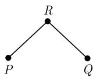
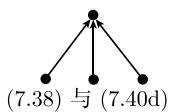
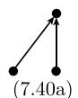
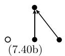
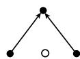

##### 7.7.5 双曲微分方程

7.7.5.1 初值和初边值问题

双曲微分方程的最简单的例子是

$$
\left| u _ {t} (t, x) + a (t, x) u _ {x} (t, x) = f (t, x) \quad (a, f \text {已知}, \quad u \text {待求}). \right|\tag{7.31}
$$

线性常微分方程

$$
x ^ {\prime} (t) = a (t, x (t))\tag{7.32}
$$

的每一个解称为 (7.31) 的特征. 带初值 $x(0) = x_0 \in \mathbb{R}$ 的所有特征 $x(t) = x(t; x_0)$ 的集合称为微分方程的特征族. 函数 $U(t) := u(t, x(t))$ 沿着特征满足常微分方程

$$
U _ {t} (t) = f (t, x (t)).\tag{7.33}
$$

若我们处理纯初值问题, 则初值沿一条曲线 (如 t=0 线) 由

$$
\boxed {u (0, x) = u _ {0} (x), \quad - \infty <   x <   \infty}\tag{7.34}
$$

规定．这就是说方程(7.33)沿着特征 $x(t,x_0)$ 的初值 $U(0) = u_0(x_0)$ . (7.31)和(7.34)的组合称为初值问题.

如果初值 (7.34) 仅在有界区间 $[x_{\ell}, x_r]$ 上给出, 则我们也需要 $x = x_{\mathrm{e}}$ (左边) 或 $x = x_{\mathrm{r}}$ (右边) 的边值. 选取哪一侧边值依赖于 $a(t, x)$ 的符号: 当特征与曲线 (这里 $x =$ 常数) 相交时, 要求它由区间外部走向区间内部. 在 $a > 0$ 的情况, 适当的边界条件为

$$
u \left(t, x _ {\mathrm{e}}\right) = u _ {\mathrm{e}} (t), \quad t \geqslant 0.\tag{7.35}
$$

区间 $[x_{e}, x_{r}]$ 上的 (7.31) 和 (7.34) 及 (7.35) 的组合称为初值-边值问题.

双曲微分方程的典型性质是保持不连续性．若初值在点 $x = x_0$ 跳跃，则这一不连续性沿着特征 $x(t,x_0)$ 延伸到内部（在 $f = 0$ 的情况，保留不连续性）．这一性质与在内部会变得光滑的椭圆微分方程和抛物微分方程大不相同.

7.7.5.2 双曲方程组

设 $\boldsymbol{u} = \boldsymbol{u}(t, x)$ 为向量值函数 $\boldsymbol{u} = (u_{1}, \cdots, u_{n})$ . 若广义特征值问题

$$
\boldsymbol {A} \boldsymbol {u} _ {x} + \boldsymbol {B} \boldsymbol {u} _ {t} = \boldsymbol {f}\tag{7.36}
$$

有相应于实特征值 $\lambda_{i}$ 的 n 个线性无关的 (左) 特征向量 $e_{i} (1 \leqslant i \leqslant n)$ ，则微分方程

$$
\boldsymbol {e} ^ {\mathrm{T}} (\boldsymbol {B} - \lambda \boldsymbol {A}) = \mathbf {0}, \quad \boldsymbol {e} \neq \mathbf {0}
$$

是双曲型的, 其中 A 和 B 为 $n \times n$ 矩阵. 在这种情况下有 n 个由 $^{1)}$

$$
\frac {\mathrm{d} t}{\mathrm{d} x} = \lambda_ {i}, \quad 1 \leqslant i \leqslant n
$$

给出的这样的族代替特征族. 若以 $(\varphi)_i = \varphi_x + \lambda_i\varphi_t$ 定义第 $i$ 个特征方向的导数, 则代替 (7.33) 得到常微分方程

$$
\left(\boldsymbol {e} _ {i} ^ {\mathrm{T}} \boldsymbol {A}\right) (\boldsymbol {u}) _ {i} = \boldsymbol {e} _ {i} ^ {\mathrm{T}} \boldsymbol {f}, \quad 1 \leqslant i \leqslant n.\tag{7.37}
$$

$A, B, e_i, \lambda_i, (t, x)$ 在线性情况下仅依赖于 $(t, x)$ , 而在一般情况下还依赖于函数 $u$ . 若将 $u$ 和 $u_0$ 视为向量值, 则方程组 (7.36) 的初值条件正如 (7.34). 关于边值规定, 注意在 $x_e$ 处有 $k_e$ 条件, 其中 $k_e$ 为特征值 $\lambda_i(t, x_1) > 0$ 的个数. 类似地, 在 $x_r$ 处也有 $k_r$ 边值条件. 若对所有特征值都有 $\lambda_i \neq 0$ , 那么 $k_e$ 和 $k_r$ 为常数且和为 $n$ .

形如 (7.31) 的双曲微分方程组经常在处理高阶标量方程后出现.

7.7.5.3 特征作为工具

如 7.7.5.1 讨论的标量情况, 我们可将求解偏微分方程简化为常微分方程 (7.32) 和 (7.33)(的数值逼近). 如果有两个不同的特征值 $\lambda_{1}$ 和 $\lambda_{2}$ , 相应的方法也可在 n=2

$$
P
$$

和 $Q$ 点的值 $x, t, u$ 通过 $P$ 点的第一个特征族的特征和通过 $Q$ 点的第二个特征族的特征在 $R$ 点相遇。差 $\left(\boldsymbol{e}_1^{\mathrm{T}}\boldsymbol{A}\right)(\boldsymbol{u}_R - \boldsymbol{u}_P)$ 和 $\left(\boldsymbol{e}_2^{\mathrm{T}}\boldsymbol{A}\right)(\boldsymbol{u}_R - \boldsymbol{u}_Q)$ 逼近 (7.37) 的左边，得到确定 $R$ 点 $\boldsymbol{u}$ 值的方程。重复应用这一方法可以从两族特征（这可解释为关于所谓特征坐标的等距网格）得到网格顶点处的解。

  
图7.10

若特征被用于其理论求导, 差分方法有时也被误称为特征方法.

7.7.5.4 差分方法

下面用 $x$ 方向 $\Delta x$ 和 $t$ 方向 $\Delta t$ 为步长的等距网格. 设 $\pmb{u}_v^m$ 为解 $\pmb{u}$ 在 $t = t_m = m\Delta t$ 和 $x = x_v = v\Delta x$ 处的近似. 当 $m = 0$ 时, 初值 $\pmb{u}_v^m$ 定义为

$$
\boldsymbol {u} _ {v} ^ {0} = \boldsymbol {u} _ {0} (x _ {v}), - \infty <   v <   \infty .
$$

若在（7.31）中用向前差分 $\left(\boldsymbol{u}_v^{m + 1} - \boldsymbol{u}_v^m\right) / \Delta t$ 代替 $\boldsymbol{u}_t$ ，用对称差分 $(\boldsymbol{u}_{v + 1}^m -\boldsymbol{u}_{v - 1}^m) / (2\Delta x)$ 代替 $\boldsymbol{u}_x$ ，则得差分方程

$$
\boldsymbol {u} _ {v} ^ {m + 1} := \boldsymbol {u} _ {v} ^ {m} + \frac {a \lambda}{2} \left(\boldsymbol {u} _ {v + 1} ^ {m} - \boldsymbol {u} _ {v - 1} ^ {m}\right) + \Delta t f \left(t _ {m}, x _ {v}\right).\tag{7.38}
$$

1) 当 $1/\lambda_{i}=0$ 时, 取 dx/dt=0.

如我们即将看到的, 它完全无效. 参数

$$
\lambda := \Delta t / \Delta x\tag{7.39}
$$

相应于 (7.27) 中抛物情况下的同名参数 $\lambda := \Delta t / \Delta x^{2}$ .

如果用左端或右端的差分 (7.1a,b) 代替对称差分, 则得到以柯朗-伊萨克森-里斯命名的如下差分方程:

$$
\boxed {\boldsymbol {u} _ {v} ^ {m + 1} := (1 + a \lambda)   \boldsymbol {u} _ {v} ^ {m} - a \lambda \boldsymbol {u} _ {v - 1} ^ {m} + \Delta t f (t _ {m}, x _ {v})  ,}\tag{7.40a}
$$

$$
\boxed {\boldsymbol {u} _ {v} ^ {m + 1} := (1 - a \lambda)   \boldsymbol {u} _ {v} ^ {m} + a \lambda \boldsymbol {u} _ {v + 1} ^ {m} + \Delta t f   (t _ {m}, x _ {v})  .}\tag{7.40b}
$$

组合对空间变量的对称差分与对时间变量不常用的差分 $\left(\boldsymbol{u}_{v}^{m+1}-\frac{1}{2}\left[\boldsymbol{u}_{v+1}^{m}+\boldsymbol{u}_{v-1}^{m}\right]\right)/\Delta t$ 得到弗里德里希斯(Friedrichs)格式：

$$
\boxed {\boldsymbol {u} _ {v} ^ {m + 1} := (1 - a \lambda / 2)   \boldsymbol {u} _ {v - 1} ^ {m} + (1 + a \lambda / 2)   \boldsymbol {u} _ {v + 1} ^ {m} + \Delta t f   (t _ {m}, x _ {v})  .}\tag{7.40c}
$$

若 $a$ 不依赖于 $t$ , 则如下拉克斯-温德罗夫(Lax-Wendorff)方法为二阶离散方法:

$$
\boxed {\boldsymbol {u} _ {v} ^ {m + 1} := \frac {1}{2} \left(a ^ {2} \lambda^ {2} - a \lambda\right) \boldsymbol {u} _ {v - 1} ^ {m} + \left(1 - a ^ {2} \lambda^ {2}\right) \boldsymbol {u} _ {v} ^ {m} + \frac {1}{2} \left(a ^ {2} \lambda^ {2} + a \lambda\right) \boldsymbol {u} _ {v + 1} ^ {m} + \Delta t f (t _ {m}, x _ {v}).}\tag{7.40d}
$$

图 7.11 给出了新值 $u_{v}^{m+1}$ 依赖于第 m 层的值的示意图. 所有的例子均为形如

$$
\boldsymbol {u} _ {v} ^ {m + 1} := \sum_ {\ell = - \infty} ^ {\infty} \boldsymbol {c} _ {\ell} u _ {v + \ell} ^ {m} + \Delta t \boldsymbol {g} _ {v}, \quad - \infty <   v <   \infty , m \geqslant 0\tag{7.41}
$$

的显式差分法.

  
图 7.11 差分模型

系数 $c_{\ell}$ 依赖于 $t_{m}, x_{n}, \Delta x, \Delta t$ . 在向量值函数 $u \in R^{n}$ 的情况, $c_{\ell}$ 为实 $n \times n$ 矩阵. 一般 (7.41) 中的和仅包含有限多的非零系数.

7.7.5.5 相容性, 稳定性和收敛性

如果差分方程 (7.41) 不是仅定义在网格顶点, 而是定义在全空间 $\mathbb{R}$ :

$$
\boldsymbol {u} ^ {m + 1} := \sum_ {\ell = - \infty} ^ {\infty} \boldsymbol {c} _ {\ell} \boldsymbol {u} ^ {m} (x + \ell \Delta t) + \Delta t \boldsymbol {g} (x), \quad - \infty <   x <   \infty , m \geqslant 0.\tag{7.41'}
$$

那么理论分析较容易. 算法 $(7.41')$ 定义了差分算子 $C = C(\Delta t)$ 的作用.

$$
\boldsymbol {u} ^ {m + 1} (x) := C (\Delta t) \boldsymbol {u} ^ {m} + \Delta t \boldsymbol {g}, \quad m \geqslant 0.\tag{7.41"}
$$

今设 $B$ 为包含函数 $u^m$ 的某个适当的巴拿赫空间1). 标准的选取为 $B = L^2(\mathbb{R})$ , 其范数为 $||\pmb{u}|| = \left(\int_{\mathbb{R}} |\pmb{u}|^2 \mathrm{d}x\right)^{1/2}$ , 或 $B = L^\infty(\mathbb{R})$ , 其范数为 $||\pmb{u}|| = \operatorname{ess} \sup \{|\pmb{u}(x)| : x \in \mathbb{R}\}$ . 设 $B_0$ 是 $B$ 的稠子集, $\pmb{u}(t)$ 为对任意初值 $\pmb{u}_0 \in B_0$ , $f = 0$ 时 (7.31) 时的解. 若

$$
\sup _ {0 \leqslant t \leqslant T} \| C (\Delta t)   {\pmb u} (t) - {\pmb u} (t + \Delta t) \| / \Delta t \rightarrow 0, \quad \text {当} \quad \Delta t \rightarrow 0 \quad \text {时},
$$

则差分算子 $C(\Delta t)$ 称为 (在区间 $[0, T]$ 中关于范数 $||\cdot||$ ) 相容的. 离散化的目标是用 $\pmb{u}^{m}(m\Delta t \to t)$ 逼近 $\pmb{u}(t)$ . 若当 $\Delta t \to 0$ 且 $m\Delta t \to t \in [0, T]$ 时, 有 $\| \pmb{u}^{m} - \pmb{u}(t) \| \to 0$ , 相应地称算法 (在区间 $[0, T]$ 中关于范数 $||\cdot||$ ) 收敛. 这里, 设 $\lambda := \Delta t / \Delta x$ 取为固定值, 使得 $\Delta t \to 0$ 也意味着 $\Delta x \to 0$ .

相容性一般容易验证, 然而肯定不足以保证收敛性. 于是有下面的结果:

等价定理 在满足相容性的前提下, 当且仅当差分算子 $C(\Delta t)$ 稳定时算法收敛.

这里, 以如下估计定义算子 $C(\Delta t)$ (在区间 $[0, T]$ 中关于范数 $||\cdot ||$ ) 的稳定性概念:

$$
\left| \left| C (\Delta t) ^ {m} \right| \right| \leqslant K \quad \text {对所有满足} \quad 0 \leqslant m \Delta t \leqslant T \text {的} m \text {和} \Delta t,\tag{7.42}
$$

其中 K 是固定的.

反过来看, 该定理说明不稳定的差分算子会导致荒谬的结果, 其中不稳定性通常表现为解的快速振荡. 注意 (7.41) 是单步法. 对常微分方程相容的单步法的收敛性一般如 7.6.1.1 中所讨论. 而与之形成对照的是, 我们仅在多步法情况遇到稳定性问题, 对于显式差分法我们至多能希望有对 $\lambda$ 存在限制的条件稳定性.

7.7.5.6 稳定性条件

7.7.5.6.1 稳定性的必要条件——CFL 条件

现在要讨论的稳定性条件源于柯朗、弗里德里希斯和列维的工作, 通常称为CFL 条件. 这个相对容易检验的标准是稳定性的必要条件.

在和式 (7.41') 中, 设 $\ell_{\min}$ 为使 $c_{\ell} \neq 0$ 的最小指标 ( $\ell_{\max}$ 为最大指标), 在标量情况 ( $u \in \mathbb{R}^1$ ), CFL 条件为对所有的 $x$ 和 $t$

$$
\ell_ {\min} \leqslant \lambda a (t, x) \leqslant \ell_ {\max},\tag{7.43}
$$

其中 $a(t,x)$ 为 (7.31) 的系数. 在高维情况 $(\pmb {u}\in \mathbb{R}^n,n\geqslant 2)$ , (7.43) 中的量 $a(t,x)$ 要换为 $n\times n$ 矩阵 $\pmb {a}(t,x)$ 的所有特征值的集合.

需要注意的是, 在 CFL 条件中, 指标界 $\ell_{\min}$ 和 $\ell_{\max}$ 是 $C(\Delta t)$ 的唯一重要的性质, 甚至连 (7.42) 中的范数如何选择也无关紧要.

除了 $\alpha = 0$ 的平凡情况，CFL条件表明当 $\lambda$ 值太大时，总是导致不稳定。另一方面，借助隐式差分法可以强制条件稳定。这可以在形式上写成带无穷和的式(7.42).由 $-\ell_{\mathrm{min}} = \ell_{\mathrm{max}} = \infty$ ，CFL条件自然满足.

CFL 条件一般不是稳定性的充分条件. 若一个方法通过对 $\lambda$ 的精确限制 (7.43) 碰巧是稳定的, 则称之为最优稳定的. 对 $\lambda$ , 从而对 $\Delta t = \lambda \Delta x$ 的限制越强, 对 (7.41") 就需要更多步才能达到 $t = m \Delta t$ .

7.7.5.6.2 充分的稳定性条件

根据 (7.42), 其中 $K := \exp(KT')$ , 稳定性的充分条件为

$$
\left\| C (\Delta t) \right\| \leqslant 1 + \Delta t K ^ {\prime}.\tag{7.44}
$$

在标量的情况取 $B = L^{\infty}(\mathbb{R})$ ，则有 $\| C(\Delta t)\| = \sum_{\ell}|c_{\ell}|$ .这表明，只要 $|\lambda a|\leqslant 1,$ 方法(7.40a)\~(7.40c）在最大模意义下是稳定的．此外，对于柯朗-伊萨克森-里斯格式(7.40a)，(7.40b)，必须要求 $a\leqslant 0$ 或 $a\geqslant 0$ 根据7.7.5.5中的等价性定理，近似解一致收敛到准确解.

拉克斯-温德罗夫方法 (7.40d) 关于 $\|\cdot\| = \|\cdot\|_{\infty}$ 不满足充分条件 (7.44)，它关于最大模确实不稳定。其原因在于该算法是二阶相容的，因此关于 $L^{\infty}(\mathbb{R})$ 是不稳定的。由此我们知道，高阶相容的要求和稳定性的要求有冲突。

今后假设 (7.41) 中的系数 $c_{\ell} = c_{\ell}(\Delta t, \lambda)$ 与 $x$ 无关. 于是 $L^2(\mathbb{R})$ 稳定性可以借助下面的放大矩阵来描述

$$
\boldsymbol {G} = \boldsymbol {G} (\Delta t, \xi , \lambda) := \sum_ {\ell = - \infty} ^ {\infty} c _ {\ell} (\Delta t, \lambda) \mathrm{e} ^ {\mathrm{i} \ell \xi}, \quad \xi \in \mathbb {R}.
$$

其中 $G$ 是以 $2\pi$ 为周期的, 在多变量 $(n > 1)$ 情况下为矩阵值的函数. 例如, 在拉克斯-温德罗夫方法 (7.40d) 的情况, 放大矩阵为 $G(\Delta t, \xi, \lambda) = 1 + \mathrm{i}\lambda a\sin (\xi) - \lambda^2 a^2 (1 - \cos (\xi)).$

$L^2 (\mathbb{R})$ 稳定性(7.42)等价于对所有的 $|\xi |\leqslant \pi$ 和 $0\leqslant m\Delta t\leqslant T$ 有

$$
\left| \boldsymbol {G} (\Delta t, \xi , \lambda) ^ {m} \right| \leqslant K,
$$

其中 $K$ 与 (7.42) 中的常数相同. 这里 $|\cdot|$ 为谱范数. 由此我们得到进一步的稳定性判据, 即冯·诺依曼条件: 对所有 $|\zeta| \leqslant \pi$ , 放大矩阵 $G(\Delta t, \xi, \lambda)$ 的特征值

$\gamma_{j} = \gamma_{j}(\Delta t,\xi ,\lambda)$ 满足不等式

$$
\left| \gamma_ {j} (\Delta t, \xi , \lambda) \right| \leqslant 1 + \Delta t K ^ {\prime}, \quad 1 \leqslant j \leqslant n.\tag{7.45}
$$

当 $n = 1$ 时，(7.45) 就是 $|\mathbf{G}(\Delta t, \xi, \lambda)| \leqslant 1 + \Delta tK'$ . 冯·诺依曼条件一般仅为稳定性的必要条件. 然而若满足下面的假设之一, 它甚至是充分条件:

(1) n = 1;

(2) G 为正规矩阵;

(3) 存在与 $\Delta t$ 和 $\ell$ 无关的相似变换, 将所有的系数 $c_{\ell}(\Delta t, \lambda)$ 化为对角型;

(4) $|\pmb{G}(\Delta t,\xi ,\lambda) - \pmb{G}(0,\xi ,\lambda)|\leqslant L\Delta t$ 且 $G(0,\xi ,\lambda)$ 满足上述条件之一.

当 $|\lambda a| \leqslant 1$ 时, 从冯·诺依曼条件可得例子 (7.40a)\~(7.40d) 是 $L^2(\mathbb{R})$ 稳定的 (如上述, 对 (7.40a),(7.40b) 我们要求 $a \leqslant 0$ 或 $a \geqslant 0$ ). 事实上, 拉克斯-温德罗夫方法是 $L^2(\mathbb{R})$ 稳定的, 但不是 $L^\infty(\mathbb{R})$ 稳定的, 从等价定理我们可得结论: 数值解二次平均收敛而不是一致收敛到准确解. 差分方法 (7.38) 导致 $G(\Delta t,\xi,\lambda)1 + \mathrm{i}\lambda a\sin (\xi)$ , 因此除了平凡的例外 $a = 0$ 以外, 它都是不稳定的.

当系数 $c_{\ell}$ 与 $x$ 有关时，可以采用冻结系数技巧。设 $C_{x_0}(\Delta t)$ 为将所有系数 $c_{\ell}(x,\Delta t,\lambda)$ (与 $x$ 有关)换成系数 $c_{\ell}(x_0,\Delta t,\lambda)$ (与 $x$ 无关)后得到的差分算子。对所有的 $x_0\in \mathbb{R},C(\Delta t)$ 与 $C_{x_0}(\Delta t)$ 的稳定性几乎是等价的。事实上在适当的技术性假设下，对所有的 $x_0\in \mathbb{R},C(\Delta t)$ 的稳定性隐含了 $C_{x_0}(\Delta t)$ 的稳定性。反过来则要求 $C(\Delta t)$ 是耗散的。这一概念定义如下：若对 $|\xi |\leqslant \pi$ 及给定的 $\delta >0$ ，不等式 $|\gamma_j(\Delta t,\xi ,\lambda)|\leqslant 1 - \delta |\xi |^{2r}$ 成立，则称 $C$ 为 $2r$ 阶耗散的。详细的论述见文献[452].

7.7.5.7 间断解的数值近似 (激波捕获)

在 7.7.5.1 中已提到, 间断初值条件可能导致解沿着特征保持间断. 在非线性的情况下, 即使初值是任意光滑的, 也可能出现间断性 (激波). 这与椭圆或抛物情况不同, 为此要求双曲离散也产生好的逼近解.

在逼近间断点的 $u_{v}^{m}$ 时要避免两种现象：

(1) 当 m 增大时, 间断变得光滑;

(2) 近似解在间断点振荡.

第二种情况出现在高阶方法中. 有在光滑区域高阶逼近, 在非常靠近间断点处也不发生振荡的所谓高分辨率方法, 如用通量极限法可以构造这样的方法.

7.7.5.8 非线性情况的性质, 守恒形式和熵

有间断解的非线性双曲方程产生在线性双曲方程或有光滑解的非线性双曲方程情况下不出现的困难 $^{1)}$ . 方程的守恒形式为

$$
\boxed {u _ {t} (t, x) + f (u (t, x)) _ {x} = 0,}\tag{7.46}
$$

其中 $f$ 为通量函数. 若 $f'(u)$ 不可对角化, 则方程是双曲型的. 由于 (7.46) 的解不必是可微的, 求 “广义解” 或弱解, 满足关系式

$$
\boxed {\int_ {0} ^ {\infty} \int_ {\mathbb {R}} [ \varphi_ {t} u + \varphi_ {x} f (u) ] \mathrm{d} x \mathrm{d} t = - \int_ {\mathbb {R}} \varphi (0, x) u _ {0} (x) \mathrm{d} x.}\tag{7.47}
$$

对所有具有有界支集的可微函数 $\varphi = \varphi(x, t)$ 都成立．初值条件 (7.43) 已包含在 (7.47) 内.

方程 (7.46) 和 (7.47) 的名称 “守恒形” 源于积分 $\int_{\mathbb{R}} u(t, x) \, dx$ 对所有 t 都是常数这一事实. (例如在欧拉方程情况下的能量、动量和质量守恒).

右极限及左极限为 $\varphi (x,t + 0),\varphi (x,t - 0)$ 的函数 $\varphi = \varphi (x,t)$ 的间断记为 $[\varphi ](t,x) = \varphi (x,t + 0) - \varphi (x,t - 0).$ 若(7.47）的弱解 $u(t,x)$ 沿曲线 $(t,x(t))$ 有跳跃(激波)，则在曲线的斜率 $\mathrm{dx / dt}$ 与跳跃之间存在如下关系：

$$
\boxed {\frac {\mathrm{d} x}{\mathrm{d} t} [ u ] = [ f (u) ] \quad (\text {兰金-于戈尼奥不连续条件}).}\tag{7.48}
$$

下面举例说明弱解 (7.47) 的重要性. 只要方程是经典的也即可微的, 则 $u_{t} - \left(u^{2} / 2\right)_{x} = 0$ 和 $v_{t} - \left(v^{3/2} / 3\right)_{x} = 0$ 在代换 $v = u^{2}$ 下是等价的. 但因为公式使用所有可能的通量函数, (7.48) 在激波情况下产生不同的斜率 $\mathrm{d}x / \mathrm{d}t$ , 从而也有不同的解.

弱解一般不能唯一确定. 有物理意义的解用熵条件描述. 该条件最简单的表述为, 沿着由 $u_{\ell} = u(t, x(t) - 0)$ 和 $u_{r} = u(t, x(t) + 0)$ 给出的激波, 有 $f'(u_{\mathrm{e}}) > \mathrm{d}x / \mathrm{d}t > f'(u_{\mathrm{r}})$ . 熵函数的推广和阐述见 [447]. 满足熵条件的 (7.47) 的解称为熵解, 也能作为 $\varepsilon \to 0$ 时 $u_{t} + f(u)_{x} = \varepsilon u_{xx} (\varepsilon > 0)$ 的极限得到.

若双曲方程的光滑解是可逆的, 则熵解不是不连续的.

7.7.5.9 非线性情况的数值性质

这里提出数值逼近的两个新问题：假设离散解收敛到函数 $u$ ，则① 函数 $u$ 是否是 (7.47) 意义下的弱解；② $u$ 是不是熵解？

为了回答第一个问题, 我们得到守恒形式的差分法:

$$
\left| u _ {v} ^ {m + 1} := u _ {v} ^ {m} + \lambda \left[ F \left(u _ {v - p} ^ {m}, u _ {v - p + 1} ^ {m}, \dots , u _ {v + q} ^ {m}\right) - F \left(u _ {v - p - 1} ^ {m}, u _ {v - p} ^ {m}, \dots , u _ {v + q - 1} ^ {m}\right) \right], \right.
$$

式中 $\lambda$ 由 (7.39) 定义. 函数 $F$ 被适当称为数值通量. 这些方程的解有离散守恒性 $\sum_{v} u_{v}^{m} =$ 常数. 弗里德里希斯方法 (7.40c) 能写为数值通量的非线性形式

$$
F \left(U _ {v}, U _ {v + 1}\right) := \frac {1}{2 \lambda} \left(U _ {v} - U _ {v + 1}\right) + \frac {1}{2} \left(f \left(U _ {v}\right) + f \left(U _ {v + 1}\right)\right)\tag{7.49}
$$

(线性情况 $f(u) = au, a =$ 常数相应于 (7.40c)). 方法的相容性能通过条件 $F(u, u) = f(u)$ 表达. 若相容的守恒型差分条件收敛, 则数值解是 (7.47) 的弱解, 但不必满足熵条件.

方法 (7.49) 是单调的, 即对初值 $u^0, v^0$ , 可由 $u^0 \leqslant v^0$ 得 $u^m \leqslant v^m$ . 高于一阶的方法不可能是单调的. 单调且相容的方法收敛到熵解.

由单调性进一步得 TVD 性质 (全变差下降), 即当 $m$ 增大时, 全变差 $\mathrm{TV}(u^m): = \sum_{v} |u_v^m - u_{v+1}^m|$ 单调递减. 此性质可防止上面提到的例子在激波附近的振荡.
