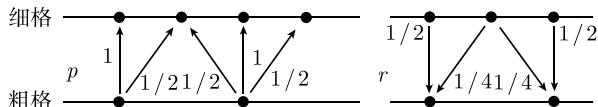

##### 7.7.7 方程组的迭代解

7.7.7.1 综述

微分方程通过离散化提出线性方程组, 一方面其维数相当高 (有代表性的大小为 10 000 至 10 000 000), 另一方面矩阵一般是稀疏的, 即每行只包含很少的非零元素, 且不依赖于维数; 后者在 7.7.3.1.4 中已讨论过. 例如, 在离散泊松方程 (7.4) 的情况, 每行非零元的个数为 5. 若采用直接法 (高斯消元法、楚列斯基分解、豪斯霍尔德方法) 求解, 可能会在算法过程中在矩阵中原先是零的地方生成非零元. 这将如 7.7.3.1.4 中所述, 导致矩阵元素存储的困难. 此外, 正如在前面的讨论中所见, 计算代价的增长将超过维数的增加. 与之相比较, 矩阵向量乘法只需要用到矩阵中的非零元素, 且计算代价正比于矩阵维数. 因此基于该运算 (矩阵向量乘法) 的迭代方法计算代价较小. 此外, 若收敛很快, 则迭代法是求解大型方程组的理想的方法.

7.7.7.1.1 理查森迭代

下面求解线性方程组

$$
\boxed {A x = b.}\tag{7.52}
$$

这里仅假设 A 非奇异, 因此保证 (7.52) 有解. 每步迭代的基本模式为理查森迭代, 其算法为

$$
\boxed {\boldsymbol {x} ^ {m + 1} := \boldsymbol {x} ^ {m} - (\boldsymbol {A} \boldsymbol {x} ^ {m} - \boldsymbol {b}),}\tag{7.53}
$$

其中初始向量 $x^{0}$ 是任意的.

7.7.7.1.2 一般线性迭代

线性迭代的一般算法为

$$
\boxed {\boldsymbol {x} ^ {m + 1} := M \boldsymbol {x} ^ {m} + N \boldsymbol {b} \quad (\text { 第一形式 }),}\tag{7.54a}
$$

其中矩阵 $M$ 和 $N$ 满足关系 $M + NA = I$ . 若从 (7.54a) 中借助 $M + NA = I$ 消去迭代矩阵 $M$ , 得到

$$
\boxed {\boldsymbol {x} ^ {m + 1} := \boldsymbol {x} ^ {m} - \boldsymbol {N} (\boldsymbol {A} \boldsymbol {x} ^ {m} - \boldsymbol {b}) \quad (\text { 第二形式 }).}\tag{7.54b}
$$

因为奇异矩阵 N 产生发散, 这里我们进一步假设 N 是可逆的, 且逆矩阵 $N^{-1}=W$ . 则有 (7.54b) 的隐式公式为

$$
\boxed {W \left(\boldsymbol {x} ^ {m} - \boldsymbol {x} ^ {m + 1}\right) = A \boldsymbol {x} ^ {m} - \boldsymbol {b} \quad (\text {第三形式}).}\tag{7.54c}
$$

7.7.7.1.3 迭代法的收敛性

若迭代序列 $\{x^{m}\}$ 对任意的初值 $x^0$ 都收敛到同一个解 (于是必定是方程 (7.52) 的解), 则 (7.54a\~c) 叙述的迭代法称为收敛的. 方法 (7.54a) 收敛的充要条件是谱半径满足条件 $\rho(M) < 1$ , 也即矩阵 $M$ 的所有特征值的绝对值都小于 1.

所谓收敛速度有特别的意义. 若对小的 $\eta$ , 有

$$
\boxed {\rho (M) = 1 - \eta <   1,}\tag{7.55a}
$$

则只需大约 $1/\eta$ 步迭代, 误差就可以 1/e 的因子改进 (其中 $e=2.71\cdots$ ). 事实上, 若有

$$
\rho \left(M\right) \leqslant \text { 常数 } <   1\tag{7.55b}
$$

其中常数不依赖于方程组的维数 (例如, 不依赖于起初生成方程组的离散方法的网格尺寸). 这样只用常数 $m$ 步的迭代, 就可达到固定的精度 (例如误差估计为 $\|x - x^m\| < \varepsilon$ ).

7.7.7.1.4 迭代法的生成

有两种不同的方法可以得到迭代法则. 第一种是分裂法. 矩阵 A 加性分裂为

$$
\boldsymbol {A} = \boldsymbol {W} - \boldsymbol {R},\tag{7.56}
$$

其中要求 W 不仅可逆, 而且形如 $Wv = d$ 的方程组有相对容易求解的性质. 其主要想法是 W 包含关于 A 的基本信息, 而 “剩余” R 较 “小”. 利用 $Wx = Rx + b$ , 我们得到迭代 $x^{m+1} := W^{-1}(Rx^{m} + b)$ , 这与 (7.54b) 中选取 $N = W^{-1}$ 是一致的.

若选取 W 为 A 的对角线矩阵，则得到 7.2.2.1 中已讨论过的雅可比方法。在高斯-赛德尔方法中，(7.56) 中的剩余 R 由矩阵 A 的右上角构成，即当 j > i 时 $R_{ij} = A_{ij}$ ，其余 $R_{ij} = 0$ 。

若在按元素不等式的意义下有 $W^{-1} \geqslant 0$ 和 $W \geqslant A$ ，则可以实现正则分解(7.56). 这自动暗示了收敛性 (见 [444]6.5 节).

另一个方法是通过非奇异矩阵 N 对方程 (7.52) 进行左变换, 使得 NAx = Nb. 若记为 $A'x = b'$ ( $A' = NA, b' = Nb$ ), 并应用理查森迭代 (7.53), 则得到变换后的迭代 $x^{m+1} := x^{m} - (A'x^{m} - b')$ , 也可写作

$$
\boldsymbol {x} ^ {m + 1} := \boldsymbol {x} ^ {m} - N (\boldsymbol {A x} ^ {m} - \boldsymbol {b})
$$

从而与第二范式 (7.54b) 一致.

上述两个方法至少在原则上可以生成各种迭代. 反之, 每种迭代 (7.54b) 可看作应用于 $A'x = b'$ 的理查森迭代 (7.53), 其中 $A' = NA$ .

矩阵 N 和 M 并不需要按分量存储. 重要的只是矩阵和向量的乘积 $d \rightarrow dN$ 容易实现. 在不完全分块 ILU 分解的情况下 (详细论述见 [444] 的 8.5.3 节), N 的形式为 $\boldsymbol{N} = (\boldsymbol{U}' + \boldsymbol{D})^{-1} \boldsymbol{D} (\boldsymbol{L}' + \boldsymbol{D})^{-1}$ , 其中 $L'$ 及 $U'$ 分别为严格下三角及严格上三角矩阵, D 为块对角矩阵.

7.7.7.1.5 有效迭代格式

迭代法一方面应该快 (见 (7.55a), (7.55b)), 另一方面其计算代价应该尽可能小 (更多关于确定 “有效代价” 的信息, 见 [444] 的 3.3.2 节). 我们陷入了固有的两难境地, 事实上这两个要求是互相对立的. 对 W = A 可以达到最快的收敛, 于是 M = 0, 这样一步就可得到准确解, 但是需要直接求解矩阵 A 的方程组 (7.54c). 同时, 若简单选择 W 为对角或下三角矩阵, 得到雅可比或高斯-赛德尔方法, 则导致与步长 h 的离散泊松方程 (7.4) 相同的收敛速度, 形如 (7.55a), 其中 $\eta = O(h^{2})$ . 根据 7.7.7.1.3, 则需要快速增加的 $O(h^{-2})$ 次迭代步.

7.7.7.2 正定矩阵

当 A 和 N(从而 W) 对称正定时, 分析将大为简化. 于是下面将作此假设.

7.7.7.2.1 矩阵条件和收敛速度

假设 A 仅有正特征值. 设 $\lambda = \lambda_{\min}(A)$ 为最小特征值而 $\Lambda = \lambda_{\max}(A)$ 为最大特征值. 7.2.1.7 中引进的条件数 $\kappa(A)$ (取欧几里得范数为向量范数) 的值为 $\kappa(A) = \Lambda / \lambda$ . 当 A 乘以常数因子时, 条件数不变, 即 $\kappa(A) = \kappa(\Theta A)$ . 在适当的标量乘法后可以假定 $\Lambda + \lambda = 2$ . 在这些假设下, 理查森迭代 (7.53) 的收敛速率为

$$
\rho (\boldsymbol {M}) = \rho (\boldsymbol {I} - \boldsymbol {A}) = (\kappa (\boldsymbol {A}) - 1) / (\kappa (\boldsymbol {A}) + 1) = 1 - 2 / (\kappa (\boldsymbol {A}) + 1) <   1,
$$

换言之,(7.55a) 中 $\eta$ 的值为 $\eta = 2/(\kappa(\mathbf{A}) + 1)$ . 因此条件数好 (即 $\kappa(\mathbf{A}) = O(1)$ 的矩阵有满意的收敛速率, 而边值问题离散得到的矩阵的条件数为 $O(h^{-2})$ .

与 $\Theta$ 的标量乘法一般相应于 (最优) 衰减迭代:

$$
\boldsymbol {x} ^ {m + 1} := \boldsymbol {x} ^ {m} - \Theta \boldsymbol {N} (\boldsymbol {A} \boldsymbol {x} ^ {m} - \boldsymbol {b}), \text {其中} \quad \Theta := 2 / \left(\lambda_ {\max} (\boldsymbol {N A}) + \lambda_ {\min} (\boldsymbol {N A})\right).\tag{7.57}
$$

因为在相似变换下矩阵的谱保持不变, 故若 A 相似于正定矩阵, 上述考虑依然有效.

7.7.7.2.2 预条件

7.7.7.1.4 所述的变换对新矩阵 $A' = NA$ (该矩阵不必正定, 但相似于正定矩阵) 得到理查森迭代. 若 $A'$ 的条件数比 A 的条件数小, 则变换后提出的方法 (7.54b) (关于 $A'$ 的理查森迭代) 的收敛速率要比 (7.53) 快. 在此意义下 N 称为预条件矩阵, 而 (7.54b) 称为预条件迭代. 若此迭代如同 (7.57) 是最优衰减迭代, 则其收敛速率为

$$
\rho (\boldsymbol {M}) = \rho (\boldsymbol {I} - \Theta \boldsymbol {N} \boldsymbol {A}) = (\kappa (\boldsymbol {N} \boldsymbol {A}) - 1) / (\kappa (\boldsymbol {N} \boldsymbol {A}) + 1) = 1 - 2 / (\kappa (\boldsymbol {N} \boldsymbol {A}) + 1) <   1.\tag{7.58}
$$

7.7.7.2.3 谱等价

下面设记号 $A \leqslant B$ 表示 A 和 B 对称且 B-A 为半正定 $^{1)}$ . 若

$$
\pmb {A} \leqslant c \pmb {W} \quad \text {且} \quad \pmb {W} \leqslant c \pmb {A},\tag{7.59}
$$

则称 A 和 W 谱等价(带等价常数 c). 特别有兴趣的情况是, c 不依赖于离散矩阵维数之类的参数. 谱等价 (7.59) 保证关于条件数的估计式 $\kappa(\mathbf{N}\mathbf{A}) \leqslant c^{2}$ 成立, 其中 $N = W^{-1}$ . 若能找到相应于 A 的矩阵 W, 其逆矩阵容易求得, 则迭代 (7.54c) 的收敛速率 (或许在包括衰减后) 为 $1 - 2 / (c^{2} + 1)$ .

7.7.7.2.4 分层基变换

假设矩阵 A 由某个标准网格上的有限元离散化生成. 在 7.7.3 中考虑的二阶椭圆问题情况, 其条件数为 $\kappa(A)=O(h^{-2})$ . 网格顶点系数 x 和 7.7.3.1.7 介绍的分层基函数系数 $x'$ 之间的变换 $x=Tx'$ 可以通过乘以 $T^{T}$ 和 T 容易实现. 通过由 (7.52) 给出的两种方式变换得到 $T^{T}ATx'=T^{T}b$ , 即 $A'x'=b'$ , 其中关于分层基的刚度矩阵为 $A'=T^{T}AT$ . 通过用理查森迭代 $x'^{m+1}:=x'^{m}-(A'x'^{m}-b')$ 表示 x 量, 得到 $x^{m+1}:=x^{m}-TT^{T}(Ax^{m}-b)$ , 即 (7.54b), 其中 $N=TT^{T}$ . 在两个空间变量的椭圆方程情况, 有 $\kappa(A')=O(|\log h|)$ . 因此, 满足 $N=TT^{T}$ 的变换后的 (分层基) 迭代有几乎最优的收敛速率 (仅与 h 弱相关), 即为 $\rho(M)=1-O(|\log h|)$ .

7.7.7.3 半迭代法

半迭代法由迭代 (7.57) 组成, 只是在迭代过程中允许衰减参数 $\Theta$ 变化:

$$
\boxed {\boldsymbol {x} ^ {m + 1} := \boldsymbol {x} ^ {m} - \Theta_ {m} \boldsymbol {N} (\boldsymbol {A} \boldsymbol {x} ^ {m} - \boldsymbol {b}).}\tag{7.60}
$$

半迭代法的基本性质由如下多项式 $p_{m}$ 描述

$$
p _ {m} (\zeta + 1) := \left(\Theta_ {0} \zeta + 1\right) \left(\Theta_ {1} \zeta + 1\right) \cdot \dots \cdot \left(\Theta_ {m} \zeta + 1\right).
$$

若已知最大和最小特征值 $\Lambda = \lambda_{\max}(\mathbf{N}\mathbf{A})$ 和 $\lambda = \lambda_{\min}(\mathbf{N}\mathbf{A})$ ，则 $p_m$ 可以选取从区间[-1,1]变换到 $[\lambda ,\varLambda ]$ 且按照 $p_m(1) = 1$ 正规化的切比雪夫多项式（见7.5.1.3).于是对简单迭代（见(7.58))，收敛速率从 $(\kappa (\mathbf{N}\mathbf{A}) - 1) / (\kappa (\mathbf{N}\mathbf{A}) + 1)$ 改进为半迭代渐近收敛速度

$$
\left(\sqrt {\kappa (\boldsymbol {N} \boldsymbol {A})} - 1\right) / \left(\sqrt {\kappa (\boldsymbol {N} \boldsymbol {A})} + 1\right)\tag{7.61}
$$

特别对较慢的迭代 (即 $\kappa(NA) \gg 1$ , 以 $\sqrt{\kappa(NA)}$ 替换 $\kappa(NA)$ 是基本的. 为有助于实施, 用下面的三项关系代替 (7.60)

$$
\boxed {\boldsymbol {x} ^ {m} := \sigma_ {m} \left\{\boldsymbol {x} ^ {m - 1} - \Theta \boldsymbol {N} \left(\boldsymbol {A} \boldsymbol {x} ^ {m - 1} - \boldsymbol {b}\right) \right\} + (1 - \sigma_ {m}) \boldsymbol {x} ^ {m - 2} \quad (m \geqslant 2),}\tag{7.62}
$$

其中 $\sigma_{m} := 4 / \left\{4 - \left[(\kappa(\mathbf{N}\mathbf{A}) - 1) / (\kappa(\mathbf{N}\mathbf{A}) + 1)\right]^{2} \sigma_{m-1}\right\}, \sigma_{1} = 2,$ 且 $\Theta$ 由(7.57)给出.对 $m = 2$ 时的初始项,用从(7.57)得到的 $\pmb{x}^{1}$ .

7.7.7.4 梯度法和共轭梯度法

半迭代 (7.60) 是一种加速基本迭代 (基迭代(7.54b)) 的方法. 根据 (7.60) 或 (7.62) 的迭代保持与初值 $x^0$ 线性无关. 下面讲述的非线性方法则相反, $x^m$ 不再线性依赖于初值 $x^0$ . 注意梯度法并不代替基本迭代, 而是与基本迭代相结合以改进后者.

7.7.7.4.1 梯度法

应用于正定矩阵 A 和 N 的基本迭代 (7.54b) 的梯度法为

$$
\pmb {x} ^ {0} \quad \text {任意}, \qquad \pmb {r} ^ {0} := \pmb {b} - A \pmb {x} ^ {0},\tag{开始}
$$

(7.63a)

$$
\boldsymbol {q} := \boldsymbol {N r} ^ {m}, \quad \boldsymbol {a} := \boldsymbol {A q}, \quad \lambda := \langle \boldsymbol {q}, \boldsymbol {r} ^ {m} \rangle / \langle \boldsymbol {a}, \boldsymbol {q} \rangle , \quad (\text {递归})\tag{7.63b}
$$

$$
\boldsymbol {x} ^ {m + 1} := \boldsymbol {x} ^ {m} + \lambda \boldsymbol {q}, \quad \boldsymbol {r} ^ {m + 1} := \boldsymbol {r} ^ {m} - \lambda \boldsymbol {a}.\tag{7.63c}
$$

这里在每一步迭代中, 不仅计算 $x^{m}$ 也计算余量 $r^{m} := b - Ax^{m}$ . 向量 q 和 a 只需存储中间结果, 因为对每一梯度步只要作一次矩阵和向量的乘积. 方法的推导见文献 [444] 9.2.4 节.

渐近收敛速度与 (7.58) 中的相同, 为 $(\kappa(\mathbf{N}\mathbf{A}) - 1) / (\kappa(\mathbf{N}\mathbf{A}) + 1)$ . 于是梯度法和最优衰减迭代 (7.57) 恰好一样快. 与 (7.57) 不同, 梯度法达到这一速度不需要关于最大特征值 $\lambda_{\max}(\mathbf{N}\mathbf{A})$ 和最小特征值 $\lambda_{\min}(\mathbf{N}\mathbf{A})$ 的明确信息. 而这些对 (7.57) 是必要的.

7.7.7.4.2 共轭梯度法

现在讨论的共轭梯度法也称为“CG方法”，可以像刚才讨论的梯度法一样用于正定矩阵 $\mathbf{A}$ 和 $N$ 的基本迭代(7.54b).其步骤为

$$
\boldsymbol {x} ^ {0} \quad \text {任意}, \quad \boldsymbol {r} ^ {0} := \boldsymbol {b} - \boldsymbol {A} \boldsymbol {x} ^ {0}, \quad \boldsymbol {p} ^ {0} := N \boldsymbol {r} ^ {0}, \quad \rho_ {0} := \langle \boldsymbol {p} ^ {0}, \boldsymbol {r} ^ {0} \rangle ,\tag{开始}
$$

(7.64a)

$$
\pmb {a} := \pmb {A p} ^ {m}, \quad \lambda := \rho_ {m} / \langle \pmb {a}, \pmb {p} ^ {m} \rangle , (\text {递归})\tag{7.64b}
$$

$$
\boldsymbol {x} ^ {m + 1} := \boldsymbol {x} ^ {m} + \lambda \boldsymbol {p} ^ {m}, \quad \boldsymbol {r} ^ {m + 1} := \boldsymbol {r} ^ {m} - \lambda \boldsymbol {a},\tag{7.64c}
$$

$$
\boldsymbol {q} ^ {m + 1} := N \boldsymbol {r} ^ {m + 1}, \rho_ {m + 1} := \langle \boldsymbol {q} ^ {m + 1}, \boldsymbol {r} ^ {m + 1} \rangle , \boldsymbol {p} ^ {m + 1} := \boldsymbol {q} ^ {m + 1} + (\rho_ {m + 1} / \rho_ {m}) \boldsymbol {p} ^ {m}.\tag{7.64d}
$$

这里“搜索方向” $p^{m}$ 本身是递归的一部分.

该方法的渐近收敛速度与 (7.61) 相同, 至少为 $\left(\sqrt{\kappa(\mathbf{N}\mathbf{A})}-1\right)/\left(\sqrt{\kappa(\mathbf{N}\mathbf{A})}+1\right)$ . 与半迭代法 (7.62) 相比, 重要的是 CG 法不要求预先知道谱的数据 $\lambda_{\max}(\mathbf{N}\mathbf{A})$ 和 $\lambda_{\min}(\mathbf{N}\mathbf{A})$ , 还比 (7.61) 更快.

若在 (7.64b) 中发生除以 0 的情况, 因为 $\langle \pmb{a}, \pmb{p}^m \rangle = 0$ , 则 $\pmb{x}^m$ 已经是问题的准确解!

CG 法 (7.64) 基本上是直接法, 因为最迟在 n 步后 (n 为方程组的维数) 得到准确解. 然而, 这一性质在应用中并无意义, 因为对大型方程组要求迭代次数远小于实际维数 n.

将 (7.64) 对理查森迭代 (7.53) 的应用作为基本迭代 $(N = I)$ , 则该算法化为在 7.2.2.2 中介绍的格式.

7.7.7.5 多重网格法

7.7.7.5.1 概述

多重网格法是可用于椭圆微分方程离散化且有最优收敛性的迭代方法. 这就是说收敛速度不依赖于离散步长从而也与方程组维数无关 (见 (7.55b)). 与刚才讨论的 CG 方法不同, 矩阵 A 是对称或正定对多重网格法并不重要.

多重网格法有光滑迭代和粗网格校正两个互补的组成部分. 光滑迭代是经典的迭代方法, 用来光滑误差 (不是解!). 粗网格校正减少光滑迭代产生的 ‘光滑’ 误差. 在作为工具的粗网格上离散化, 正是该方法名称的由来. 然而该名称并不意味着方法限于在正规网格中离散. 它也能用于有限元空间是分层型的一般的有限元法.

7.7.7.5.2 光滑迭代的例子

光滑迭代的简单例子为 7.2.2.1 介绍的高斯-赛德尔迭代和雅可比方法, 其减幅 $\Theta = 1/2$ :

$$
\boxed {\boldsymbol {x} ^ {m + 1} := \boldsymbol {x} ^ {m} - \frac {1}{2} \boldsymbol {D} ^ {- 1} (\boldsymbol {A} \boldsymbol {x} ^ {m} - \boldsymbol {b}).}\tag{7.65}
$$

在五点公式 (7.4) 的情况, 向量 $x^{m}$ 由分量 $u_{ik}^{m}$ 组成. 方程 (7.65) 可写为分量形式

$$
u _ {i k} ^ {m + 1} := \frac {1}{2} u _ {i k} ^ {m} + \frac {1}{8} \left(u _ {i - 1, k} ^ {m} + u _ {i + 1, k} ^ {m} + u _ {i, k - 1} ^ {m} + u _ {i, k + 1} ^ {m}\right) + \frac {1}{8} h ^ {2} f _ {i k}.
$$

设 $e^m := x^m - x$ 为第 $m$ 迭代步的误差. 在 (7.65) 中该误差满足递归公式

$$
e _ {i k} ^ {m + 1} := \frac {1}{2} e _ {i k} ^ {m} + \frac {1}{8} \left(e _ {i - 1, k} ^ {m} + e _ {i + 1, k} ^ {m} + e _ {i, k - 1} ^ {m} + e _ {i, k + 1} ^ {m}\right).
$$

右端为由相邻节点构造的平均值. 显然振荡将快速衰减而误差确实被光滑化.

7.7.7.5.3 粗网格校正

设 $\tilde{x}$ 为上述多步光滑迭代的结果. 误差 $\tilde{e} := \tilde{x} - x$ 为 $A\tilde{e} = \tilde{d}$ 的解, 其中 $\bar{\eta}$ 量通过 $\tilde{d} := A\tilde{x} - b$ 计算. 设 $X_{n}$ 为向量 x 的 n 维空间. 由于 $\tilde{e}$ 是光滑的, 可以被粗网格逼近. 故设 $A'$ 为粗网格 (或粗有限元空间) 的离散矩阵, $x'$ 为相应的低维有限空间 $X_{n'}(n' < n)$ 中的系数向量.

在 $X_{n}$ 和 $X_{n'}$ 之间引入两个线性映射：限制 $r: X_{n} \rightarrow X_{n'}$ 和延拓 $p: X_{n'} \rightarrow X_{n}$ .

在网格 h 和 $h' := 2h$ 上由差分 (7.3a) 离散的一维泊松方程的情况, 对 $r: X_{n} \rightarrow X_{n}'$ 选取带权平均 $d' = rd \in X_{n}'$ , 其中

$$
d ^ {\prime} \left(v h ^ {\prime}\right) = d ^ {\prime} (2 v h) := \frac {1}{2} d (2 v h) + \frac {1}{4} [ d ((2 v + 1) h) + d ((2 v - 1) h) ].
$$

对 $p: X_n' \to X_n$ ，选取线性插值

$$
u = p u ^ {\prime} \in X _ {n}, \quad \text {其中} \quad u (v h) := u ^ {\prime} \left(\frac {v}{2} h ^ {\prime}\right), \quad \text {偶数} v,
$$

$$
u (v h) := \frac {1}{2} \left[ u ^ {\prime} \left(\frac {v - 1}{2} h ^ {\prime}\right) + u ^ {\prime} \left(\frac {v + 1}{2} h ^ {\prime}\right) \right], \quad \text {奇数} v
$$

(图 7.12). 在更一般的情况, r 和 p 可选得使计算代价最小.

误差 $\tilde{e} := \tilde{x} - x$ 的方程 $A\tilde{e} = \tilde{d}$ 在粗网格上相应于所谓粗网格方程

$$
A ^ {\prime} e ^ {\prime} = d ^ {\prime}, \text { 其中 } d ^ {\prime} = r d.
$$

其解为 $e'$ , 延拓值为 $e := pe'$ . 由定义 $x = \tilde{x} - \tilde{e}$ 为准确解, 故 $\tilde{x} - pe'$ 应该是好的逼近. 粗网格校正相应为

$$
\tilde {\boldsymbol {x}} \mapsto \tilde {\boldsymbol {x}} - p \boldsymbol {A} ^ {- 1} \boldsymbol {r} (\boldsymbol {A} \tilde {\boldsymbol {x}} - \boldsymbol {b}).\tag{7.66}
$$

  
图7.12 $p$ 和 $r$ 的网格变换

7.7.7.5.4 二重网格方法

二重网格法为光滑迭代 7.7.7.5.2 和粗网格校正 (7.66) 的乘积. 若 $\boldsymbol{x} \mapsto P(\boldsymbol{x}, \boldsymbol{b})$ 表示光滑迭代 (见 (7.65)), 则二重网格算法为

$$
\boldsymbol {x} := \boldsymbol {x} ^ {m};\tag{7.67a}
$$

$$
\text { for } \quad i := 1 \quad \text { to } \quad \nu \quad \text { do } \quad \boldsymbol {x} := \mathscr {S} (\boldsymbol {x}, \boldsymbol {b});\tag{7.67b}
$$

$$
\boldsymbol {d} ^ {\prime} := \boldsymbol {r} (\boldsymbol {A x} - \boldsymbol {b});\tag{7.67c}
$$

$$
\text { solve } \quad A ^ {\prime} e ^ {\prime} = d ^ {\prime};\tag{7.67d}
$$

$$
\boldsymbol {x} ^ {m + 1} := \boldsymbol {x} - \boldsymbol {p e} ^ {\prime};\tag{7.67e}
$$

这里 v 表示光滑迭代的次数. 通常 $2 \leqslant v \leqslant 4$ . 二重网格法本身的实用价值较小, 因为 (7.67d) 要求 (低维) 方程组的准确解.

7.7.7.5.5 多重网格法

为了近似求解 (7.67d), 该方法被递归使用. 为此要求粗离散, 同时必须有分层离散

$$
\boldsymbol {A} _ {\ell} \boldsymbol {x} _ {\ell} = \boldsymbol {b} _ {\ell}, \quad \ell = 0, 1, \dots , \ell_ {\max},\tag{7.68}
$$

其中最大层 $\ell = \ell_{max}$ 的方程 (7.68) 与原方程 Ax = b 重合. 对 $\ell = \ell_{max} - 1$ , 得到 (7.67d) 中的方程组 $A'$ . 对 $\ell = 0$ , 假定维数 $n_{0}$ 是如此小 (如 $n_{0} = 1$ ), 使得可以直接计算 $A_{0}x_{0} = b_{0}$ 的准确解.

求解 $A_{\ell}x_{\ell}=b_{\ell}$ 的多重网格法的特征由如下算法表示. 对 $x=x_{\ell}^{m}$ 和 $b=b_{\ell}$ 由函数 $\mathrm{MGM}(\ell,x,b)$ 得到算法的下一步迭代 $x_{\ell}^{m+1}$ :

函数 $\operatorname{MGM}(\ell, \pmb{x}, \pmb{b})$

(7.69a)

$$
\mathrm{if} \quad \ell = 0 \quad \mathrm{then} \quad \mathrm{MGM} := A _ {0} ^ {- 1} b \quad \mathrm{else}\tag{7.69b}
$$

$$
\text {   begin   } \quad \text {   for   } \quad i := 1 \quad \text {   to   } \quad \nu \quad \text {   do   } \quad \boldsymbol {x} := \mathcal {S} _ {\ell} (\boldsymbol {x}, \boldsymbol {b})\tag{7.69c}
$$

$$
\boldsymbol {d} := \boldsymbol {r} (\boldsymbol {A} _ {\ell} \boldsymbol {x} - \boldsymbol {b});\tag{7.69d}
$$

$$
\boldsymbol {e} := 0; \quad \text { for } \quad i := 1 \quad \text { to } \quad \gamma \quad \text { do } \quad \boldsymbol {e} := \mathrm{MGM} (\ell - 1, e, d);\tag{7.69e}
$$

$$
\mathrm{MGM} := \boldsymbol {x} - p \boldsymbol {e}\tag{7.69f}
$$

end;

这里 $\gamma$ 为粗网格校正次数; 仅讨论 $\gamma = 1(V \text{ 循环})$ 和 $\gamma = 2(W \text{ 循环})$ 的情况.

关于算法实现的详情和进一步的数值算例见 [445] 和 [444] 第 10 章.

7.7.7.5.6 离散泊松方程的数值例子

方程组选为定义在区域 $\Omega = (0,1) \times (0,1)$ 上以 (7.9b) 为狄利克雷边值的泊松方程 (7.9a) 的离散化 (7.4). 步长取为 $h = 1 / 64$ , 故 $63^2 = 3969$ 为未知量个数. 第 $m$ 次误差 $e^m := u^m - u$ 按能量范数 $||e|| := \langle Ae, e \rangle^{1/2}$ 度量. 初值误差 $e^0$ 的范数为 2.47E-1. 即使在 300 步迭代后, 高斯-赛德尔迭代的初始误差仅减到 1/10. 我们用所谓带最优超松弛参数的 SOR 方法来加速收敛. 则在 161 次迭代后达到 1E-6 的误差界.

$$
\mathrm{多重网格法为此仅需五步}.
$$

若继续减小步长 h，则前两个方法的收敛速度会更差，而多重网格（每一步前后作棋盘型高斯-赛德尔光滑化）的迭代次数并不增加，在列出的三个例子中，必要的迭代数 m 分别正比于 $h^{-2}, h^{-1}$ 和常数。用于理查森迭代的共轭梯度法和表 7.5 所列的 SOR 法有类似的速度。若想借助于 CG 法加速后者，则必须以对称的 SSOR 法代替 SOR 法。这样经过 22 步后可得到 1E-6 以下的误差（表 7.6）。

表 7.5 第 m 次迭代 $u^{m}$ 在能量范数下的误差 $^{1)}$

<table><tr><td>m Gauss-Seidel</td><td>m</td><td>SOR</td><td>m</td><td>多重网格法</td></tr><tr><td>10 9.382E-2</td><td>10</td><td>1.02931E-1</td><td>1</td><td>1.711472796E-2</td></tr><tr><td>20 7.324E-2</td><td>20</td><td>5.43417E-2</td><td>2</td><td>9.659697997E-4</td></tr><tr><td>50 5.023E-2</td><td>50</td><td>1.29191E-2</td><td>3</td><td>5.501125568E-5</td></tr><tr><td>100 3.575E-2</td><td>100</td><td>8.51213E-4</td><td>4</td><td>3.206732671E-6</td></tr><tr><td>200 2.371E-2</td><td>150</td><td>2.50194E-6</td><td>5</td><td>1.891178440E-7</td></tr><tr><td>300 1.755E-2</td><td>161</td><td>9.94034E-7</td><td>6</td><td>1.128940250E-8</td></tr></table>

表 7.6 以共轭梯度法加速的迭代法

<table><tr><td>m</td><td>Richardson</td><td>m</td><td>SSOR</td><td>m</td><td>多重网格法</td></tr><tr><td>10</td><td>6.6931E-2</td><td>5</td><td>1.17912E-2</td><td>1</td><td>1.135035786E-2</td></tr><tr><td>20</td><td>4.0034E-2</td><td>10</td><td>1.00844E-3</td><td>2</td><td>7.254914612E-4</td></tr><tr><td>50</td><td>1.2571E-2</td><td>15</td><td>6.70161E-5</td><td>3</td><td>4.298721850E-5</td></tr><tr><td>100</td><td>2.5151E-4</td><td>20</td><td>3.70379E-6</td><td>4</td><td>2.274098344E-6</td></tr><tr><td>120</td><td>1.6995E-5</td><td>21</td><td>1.78763E-6</td><td>5</td><td>1.313049259E-7</td></tr><tr><td>142</td><td>9.0458E-7</td><td>22</td><td>8.78341E-7</td><td>6</td><td>7.171669050E-9</td></tr></table>

多重网格法 (用词典型高斯-赛德尔法对称光滑化) 原则上也能借助 CG 法加速. 然而这种加速对快速方法产生的优势很小, 一般并不值得麻烦. 为达到给定精度, 在所讨论的三种情况分别需要 $O(h^{-1})$ , $O(h^{-2})$ 和 $O(1)$ 的渐近迭代次数.

[444] 中给出了算例及程序. 在那里也能找到关于上述方法的更详细的介绍.

7.7.7.6 嵌套迭代

第 $m$ 次迭代的迭代误差 $\pmb{e}^{m} = \pmb{x}^{m} - \pmb{x}$ 可以被 $||\pmb{e}^{m}|| \leqslant \rho^{m}||\pmb{e}^{0}||$ 估计, 其中 $\rho$ 表示收敛速度. 为了减少误差 $\pmb{e}^{m}$ , 不仅要有好的收敛速度, 而且要有小的初始误差 $||\pmb{e}^{0}||$ . 正如多重网格采用不同层的离散 $\ell = 0, \dots$ . 该策略可以通过如下算法 (嵌套迭代) 来实现. 对 $\ell = \ell_{\max}$ 求解 $\pmb{A}_{\ell}\pmb{x}_{\ell} = \pmb{b}_{\ell}$ , 也对 $\ell < \ell_{\max}$ 求解粗网格上的方程. 因为 $\pmb{x}_{\ell-1}$ 和 $\pmb{px}_{\ell-1}$ 应该是对 $\pmb{x}_{\ell}$ 的好的逼近, 但由于低维计算代价较小, 首先逼近 $\pmb{x}_{\ell-1}$ (近似值 $\tilde{\pmb{x}}_{\ell-1}$ ), 然后利用 $\pmb{p}\tilde{\pmb{x}}_{\ell-1}$ 作为 $\ell$ 层迭代的初值更有效. 在下面介绍的算法中, 设 $\pmb{x}^{m+1} := \Phi_{\ell}(\pmb{x}^{m}, \pmb{b}_{\ell})$ 表示求解 $\pmb{A}_{\ell}\pmb{x}_{\ell} = \pmb{b}_{\ell}$ 的任意迭代.

$\tilde{x}_{0}$ solution (or approximation) of $A_{0}x_{0}=b_{0}$;

for $\ell:=1$ to $\ell_{\max}$ do

begin $\tilde{x}_{\ell}:=p\tilde{x}_{\ell-1};$ (*initial value; p from (7.69f)*) for $i:=1$ to $m_{\ell}$ do $\tilde{x}_{\ell}:=\Phi_{\ell}(\tilde{x}_{\ell},b_{\ell})$ (* $m_{\ell}$ iterations *) end;

在 $\Phi_{\ell}$ 表示多重网格法的情况下, 可取 $m_{\ell}$ 为常数. 事实上, 取 $m_{\ell}=1$ 常足以得到与离散误差大小相同的迭代误差 $\left|\left|\tilde{\boldsymbol{x}}_{\ell}-\boldsymbol{x}_{\ell}\right|\right|$ .

7.7.7.7 逼近空间的部分分解

设 Ax=b 为待求解的方程组, 其中 x 是解空间 X 中的元素. 若 $\sum_{v} X^{(v)} = X$ , 则说存在 X 对子空间 $X^{(v)}, v = 0, \cdots, k$ 的分解. 这里容许子空间有重叠, 也即是非分离的. 该方法的目标是找到迭代

$$
\boxed {\boldsymbol {x} ^ {m + 1} := \boldsymbol {x} ^ {m} - \sum_ {v} \boldsymbol {\delta} ^ {(v)},}
$$

其中校正因子 $\delta^{(v)}$ 为 $X^{(v)}$ 的元素. 为了表示向量 $\pmb{x}^{(v)} \in X^{(v)} \subseteq X$ , 我们需要在空间 $X_v = \mathbb{R}^{\dim \left(X^{(v)}\right)}$ 中的系数向量 $\pmb{x}^{(v)}$ . 借助于线性延拓可得 $X_v$ 和 $X^{(v)}$ 之间的唯一对应

$$
p _ {v}: X _ {v} \to X ^ {(v)} \subset X, v = 0, \dots , k.
$$

这就是 $p_{v}X_{v}=X^{(v)}$ . “限制” $r_{v}:=p_{v}^{T}:X^{(v)}\to X_{v}$ 为转置映射. 于是部分分解法 (也称加性施瓦茨迭代) 的基本表述为

$$
\boldsymbol {d} := \boldsymbol {A} \boldsymbol {x} ^ {m} - \boldsymbol {b};\tag{7.70a}
$$

$$
\boldsymbol {d} _ {\nu} := \boldsymbol {r} _ {\nu} \boldsymbol {d} \quad \nu = 0, \dots , k,\tag{7.70b}
$$

$$
\text { solve } \quad A _ {\nu} \delta_ {\nu} = d _ {\nu}; \qquad \qquad \nu = 0, \dots , k,\tag{7.70c}
$$

$$
\boldsymbol {x} ^ {m + 1} := \boldsymbol {x} ^ {m} - \omega \sum_ {\nu} p _ {\nu} \boldsymbol {\delta} _ {\nu}.\tag{7.70d}
$$

在 (7.70c) 中出现的维数为 $n_v := \dim \left(X^{(v)}\right)$ 的矩阵是乘积

$$
\boldsymbol {A} _ {v} := r _ {v} \boldsymbol {A} \boldsymbol {p} _ {v}, \quad v = 0, \dots , k.
$$

在 (7.70d) 中包含衰减系数 $\omega$ 以改进收敛性 (见 (7.57)). 若在迭代中加入 (7.7.7.4 中讨论的)CG 法, 则选取 $\omega \neq 0$ 无关紧要.

(7.70c) 中的局部问题可以相互独立求解, 算法对并行计算是有意义的. (7.70c) 的准确解可以 (用第二种迭代) 被逼近.

在 7.7.7.2.4 中讨论的分层迭代和多重网格法的变式, 以及将要讨论的区域分解法, 均可纳入 (7.70) 的抽象表述.

在分层迭代的情况下, $X_0$ 包含所有初始三角剖分 $\tau_0$ 的顶点, $X_1$ 包含除 $\tau_0$ 的顶点以外的接下来的剖分 $\tau_1$ 的所有顶点, 以此类推. 延拓 $p_1: X_1 \to X$ 为分片线性插值 (计算新顶点上的有限元函数值).

区域分解法的收敛理论或多或少被限于正定矩阵 A. 对于乘性施瓦茨方法也是这样, 其中在每一次校正 $x \mapsto x - p_{v} \delta_{v}$ 前, 重复 (7.70a)\~(7.70c) 步.

7.7.7.8 区域分解

现在讨论的区域分解有两种完全不同的解释. 第一种将区域分解看作数据的分解, 第二种则是以区域分解为工具的一种特殊的迭代法.

在数据分解的情况, 将系数向量 x 分块, 如 $\boldsymbol{x} = (x^{0}, \cdots, x^{k})$ . 每一块 $x^{v}$ 包含边值问题的基本区域 $\Omega$ 的某个子区域 $\Omega^{v}$ 的网格顶点的数据. 若矩阵是稀疏的, 则基本运算 (最重要的是矩阵乘法) 仅需要邻域内的信息, 即大部分来自同一子区域. 若每一块 $x^{v}$ 被指定到并行计算机的一个处理器, 则该方法只需要沿着子区域边界交换数据. 因为包含在这些边界的网格顶点数必定比总顶点数至少小一个量级, 可以期望计算中必要的数据交换与算法的主要计算相比代价要小得多.

下面考虑作为特殊迭代工具的区域分解. 设 $\bar{\Omega} = \cup \overline{\Omega^v}$ 为偏微分方程的求解区域 $\bar{\Omega}$ 的可重叠的区域分解. 对空间 $X^v$ 子区域 $\overline{\Omega^v}$ 中的网格顶点已在7.7.7.7中讨论. 延拓 $p_v: X_v \to X^{(v)}$ 可以定义为零延拓, 即在 $\overline{\Omega^v}$ 外的所有顶点都为零. 于是该方法被 (7.70) 定义.

设 $k$ 为子区域 $\overline{\Omega^v}$ 的个数. 因为 $k$ 可以是并行计算机处理器的个数, 我们想得到不仅依赖于问题的维数, 而且依赖于 $k$ 的收敛速度. 单纯的分解并不能达到这一目的, 所以需要增加一个粗网格空间 $X_0$ . 考虑到这一点, 该方法与前述二重网格法相当类似.

7.7.7.9 非线性方程组

在非线性方程组的情况, 有许多新问题需要解答. 特别地, 其解不再唯一. 因此我们假定方程组 $F(x) = 0$ 在 $x^{*}$ 的邻域内存在唯一解 $x^{*}$ . 求解 $F(x) = 0$ 有两种策略. 第一种是应用牛顿迭代的变式, 它要求在每一牛顿步求解一个线性方程组 (再作为第二迭代), 为此可用在 7.7.7.1 到 7.7.7.8 讨论过的那些方法. 这种方法能否实施主要依赖于如何加强计算雅可比矩阵 $F'$ . 第二种策略试图直接将上面讨论过的用于线性方程组的方法推广到非线性方程组. 例如, 求解 $F(x) = 0$ 的理查森迭代 (7.53) 的非线性模拟为

$$
\boxed {\boldsymbol {x} ^ {m + 1} := \boldsymbol {x} ^ {m} - \boldsymbol {F} \left(\boldsymbol {x} ^ {m}\right)}
$$

多重网格法也可推广到非线性情况. 若实施该方法, 则非线性迭代的渐近收敛速度与应用于线性化方程 (即 $\boldsymbol{A} = \boldsymbol{F}'(\boldsymbol{x}^{*})$ ) 的线性多重网格法的速度相同. 详情见 [445] 第 9 章.

在多解的情况, 迭代法至多可能有局部收敛性. 该方法在计算上最精细的部分在于确定合适的初值 $x^0$ . 为此7.7.7.6的嵌套迭代可能有一些帮助. 于是初始迭代的选取基本上限于 $\ell = 0$ 水平的低维方程组.
