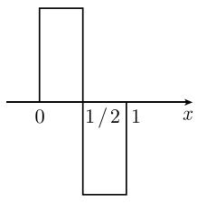
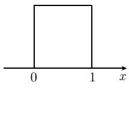
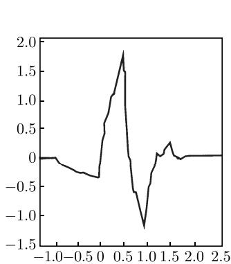
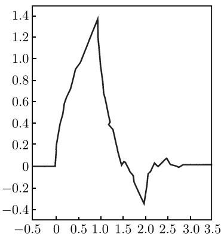

##### 7.7.9 调和分析

7.7.9.1 离散傅里叶变换和三角插值

借助复数值的系数 $c_{0}, c_{1}, \cdots, c_{n-1}$ 定义三角多项式

$$
\boxed {y \left(x\right) := \frac {1}{\sqrt {n}} \sum_ {v = 0} ^ {n - 1} c _ {v} \mathrm{e} ^ {\mathrm{i} v x}, ^ {\prime} \quad x \in \mathbb {R}.}\tag{7.74}
$$

利用代换 $z = e^{ix}$ ，可以被插值为真多项式 $\sum c_{v}z^{v}$ ，其中自变量 z 限制在单位圆 $|z| = |e^{ix}| = 1$ 上。若由 (7.74) 计算函数 y 在等距插值点 $x_{\mu} = 2\pi\mu/n$ 的值，其中 $\mu = 0, 1, \cdots, n - 1$ ，则得

$$
\boxed {y _ {u} = \frac {1}{\sqrt {n}} \sum_ {v = 0} ^ {n - 1} c _ {v} \mathrm{e} ^ {2 \pi \mathrm{i} v \mu / n}, \quad \mu = 0, 1, \dots , n - 1.}\tag{7.75}
$$

于是三角插值问题可用公式表示如下. 对给定值 $y_{\mu}$ ，从方程 (7.75) 确定傅里叶系数 $c_{v}$ . 解可利用下面的向后变换表述:

$$
\boxed {c _ {v} = \frac {1}{\sqrt {n}} \sum_ {\mu = 0} ^ {n - 1} y _ {\mu} \mathrm{e} ^ {- 2 \pi \mathrm{i} v \mu / n}, \quad v = 0, 1, \dots , n - 1.}\tag{7.76}
$$

为了用矩阵记号来表示, 引进向量 $\boldsymbol{c} = (c_{0}, \cdots, c_{n-1}) \in \mathbb{C}^{n}$ 和 $\boldsymbol{y} = (y_{0}, \cdots, y_{n-1}) \in \mathbb{C}^{n}$ . 根据 (7.75) 映射 $c \mapsto y$ 称为离散傅里叶综合, 而另一个方向的映射 $y \mapsto c$ 称为离散傅里叶分析. 若矩阵 T 的系数为 $T_{\nu\mu} := n^{-1/2} e^{2\pi i \nu \mu / n}$ , 则 (7.75) 和 (7.76) 可写为:

$$
\boxed {y = T c, \quad c = T ^ {*} y.}\tag{7.77}
$$

这里 $T^{*}$ 表示 $\boldsymbol{T}: (T^{*})_{\nu\mu} = \overline{T_{\mu\nu}}$ 的伴随矩阵. 此时 T 是酉算子, 即 $T^{*} = T^{-1}$ . 此性质相应于 (7.74) 是关于正交基 $\left\{ n^{-1/2} e^{2\pi i \nu \mu / n} : \mu = 0, 1, \cdots, n - 1 \right\}$ 的展开式这一事实.

在和式 (7.74) 中, 可轮换指标集 $\nu = 0, 1, \cdots, n - 1$ . 这并不影响求 (7.75) 在插值点 $x_{\mu} = 2\pi\mu/n$ 的值, 因为 $\exp(\mathrm{i}\nu x_{\mu}) = \exp(\mathrm{i}(\nu \pm n)x_{\mu})$ , 但对它们之间的点有影响. 例如: 对于偶数 n 我们可选取指标集 $\{1 - n/2, \cdots, n/2 - 1\}$ . 因为有关系:

$$
c _ {- v} \mathrm{e} ^ {- \mathrm{i} v x} + c _ {+ v} \mathrm{e} ^ {+ \mathrm{i} v x} = (c _ {- v} + c _ {+ v}) \cos \nu x + \mathrm{i} (c _ {+ v} - c _ {- v}) \sin v x.
$$

我们得到实三角函数 $\{\sin \nu x, \cos \nu x : 0 \leqslant \nu \leqslant n/2 - 1\}$ 的线性组合.

7.7.9.2 快速傅里叶变换 (FFT)

在很多实际应用中, (7.77) 的傅里叶综合 $c \to y$ 和傅里叶分析 $y \to c$ 起重要作用, 使得我们期望以尽可能少的计算代价实现它们. 这里为简单起见忽略标量因子 $n^{-1/2}$ , 则方程 (7.76) 可以写为如下形式:

$$
\boxed {c _ {v} ^ {(n)} = \sum_ {\mu = 0} ^ {n - 1} y _ {\mu} ^ {(n)} \omega_ {n} ^ {v \mu}, v = 0, 1, \dots , n - 1,}\tag{7.78}
$$

其中单位的第 $n$ 个根 $\omega_{n}:=\mathrm{e}^{-2\pi\mathrm{i}/n}$ . 在交换记号 $c$ 和 $y$ 并利用 $\omega_{n}:=\mathrm{e}^{2\pi\mathrm{i}/n}$ 之后, 综合 (7.75) 也可取 (7.78) 的形式. 在 $y_{\mu}^{(n)}, c_{\nu}^{(n)}$ 和 $\omega_{n}$ 中出现的指标 $n$ 表示我们用到的傅里叶变换的维数.

若按照通常的方式近似计算 (7.78)，对每一个系数需要用 $n$ 次 (复数) 乘法和 $n - 1$ 次加法。因此计算所有的分量 $c_v^{(n)}$ 需要 $2n^2 + O(n)$ 次运算。这里假定 $\Omega = \{\omega_n^{\nu \mu}: 0 \leqslant \nu, \mu \leqslant n - 1\}$ 的值是已知的。因为 $\omega_n^{\nu \mu}$ 仅依赖于以 $n$ 为模的 $\nu \mu$ 的剩余类， $\Omega$ 仅包含 $n$ 个不同的值，其计算量为 $O(n)$ 。

若 n 刚好是 2 的幂, 即 $n = 2^{p}, p \geqslant 0$ , 则计算 (7.78) 的代价 $O(n^{2})$ 可以显著减少. 若 n 为偶数, 待求系数可写成仅包含 n/2 项的和的形式:

$$
c _ {2 v} ^ {(n)} = \sum_ {\mu = 0} ^ {n / 2 - 1} \left[ y _ {\mu} ^ {(n)} + y _ {\mu + n / 2} ^ {(n)} \right] \omega_ {n} ^ {2 v \mu}, \quad 0 \leqslant 2 v \leqslant n - 1,\tag{7.79a}
$$

$$
c _ {2 v + 1} ^ {(n)} = \sum_ {\mu = 0} ^ {n / 2 - 1} \left[ \left(y _ {\mu} ^ {(n)} - y _ {\mu + n / 2} ^ {(n)}\right) \omega^ {\mu} \right] \omega_ {n} ^ {2 v \mu}, \quad 0 \leqslant 2 v \leqslant n - 1.\tag{7.79b}
$$

(7.79a)(7.79b) 中的 c 系数构成 $C^{n/2}$ 的向量

$$
\boldsymbol {c} ^ {(n / 2)} = \left(c _ {0} ^ {(n)}, c _ {2} ^ {(n)}, \dots , c _ {n - 2} ^ {(n)}\right), \quad \boldsymbol {d} ^ {(n / 2)} = \left(c _ {1} ^ {(n)}, c _ {3} ^ {(n)}, \dots , c _ {n - 1} ^ {(n)}\right).
$$

若进一步引入系数

$$
y _ {\mu} ^ {(n / 2)} := y _ {\mu} ^ {(n)} + y _ {\mu + n / 2} ^ {(n)}, \quad z _ {\mu} ^ {(n / 2)} := \left(y _ {\mu} ^ {(n)} - y _ {\mu + n / 2} ^ {(n)}\right) \omega^ {\mu}, \quad 0 \leqslant v \leqslant n / 2 - 1,
$$

并注意到 $(\omega_{n})^{2} = \omega_{n / 2}$ ，则得到新方程组

$$
c _ {v} ^ {n / 2} = \sum_ {\mu = 0} ^ {n / 2 - 1} y _ {\mu} ^ {(n / 2)} \omega_ {n / 2} ^ {v \mu}, d _ {v} ^ {n / 2} = \sum_ {\mu = 0} ^ {n / 2 - 1} z _ {\mu} ^ {(n / 2)} \omega_ {n / 2} ^ {v \mu}, 0 \leqslant v \leqslant n / 2 - 1.
$$

这里的两个和式都有 (7.78) 的形式, 只是以 $n/2$ 代替了 $n$ . 这就将 $n$ 维的问题 (7.78) 化为两个 $n/2$ 维的问题. 因为 $n = 2^p$ , 该过程可重复 $p$ 次最后得到 $n$ 个一维问题! (注意在一维情况有 $y_0 = c_0$ ). 以这种方式得到的算法可列式如下:

$$
\text { procedure } \mathrm{FFT} (\omega , p, y, c); \{y: \text { input- }, c: \text { output - vector } \}\tag{7.80}
$$

$$
\begin{array}{l} \text {if p = 0 then c[0]:= y[0] else} \\ \text {begin n2:= 2^{p - 1}}; \\ \qquad \qquad \qquad \text {for \mu := 0 to n2 - 1 do yy[\mu]:= y[\mu]+ y[\mu + n2];} \\ \qquad \qquad \qquad \qquad \text {FFT(p - 1, \omega^ {2} ,yy,cc); for \nu := 0 to n2 do c[2\nu]:= cc[\nu];} \\ \qquad \qquad \qquad \qquad \text {for \mu := 0 to n2 - 1 do yy[\mu]:= (y[\mu]- y[\mu + n2])*\omega^{\mu};} \\ \qquad \qquad \qquad \qquad \text {FFT(p - 1, \omega^ {2} ,yy,cc); for \nu := 0 to n2 do c[2\nu + 1]:= cc[\nu]} \\ \text {end;} \end{array}\tag{7.80a}
$$

(7.80b)

因为维数被 p 次减半, 其中需要 $(7.80\mathrm{a}), (7.80\mathrm{b})$ 的 n 次计算, 从而总的计算代价为 $p \cdot 3n = O(n \log n)$ 次运算.

7.7.9.3 对周期特普利茨矩阵的应用

若系数 $a_{ij}$ 仅依赖于以 n 为模的差 i-j，则矩阵 A 根据定义是特普利茨矩阵。在这种情况，A 形如

$$
\boldsymbol {A} = \left( \begin{array}{c c c c c} c _ {0} & c _ {1} & c _ {2} & \dots & c _ {n - 1} \\ c _ {n - 1} & c _ {0} & c _ {1} & \dots & c _ {n - 2} \\ \vdots & \vdots & \vdots & & \vdots \\ c _ {2} & c _ {3} & c _ {4} & \dots & c _ {1} \\ c _ {1} & c _ {2} & c _ {3} & \dots & c _ {0} \end{array} \right).\tag{7.81}
$$

每一个周期特普利茨矩阵都可借助于傅里叶变换, 即用 $(7.77)$ 给出矩阵 T 对角化

$$
\boldsymbol {T} ^ {*} \boldsymbol {A} \boldsymbol {T} = \boldsymbol {D} := \operatorname{diag} \left\{d _ {1}, d _ {2}, \dots , d _ {n} \right\}, \quad d _ {\mu} := \sum_ {v = 0} ^ {n - 1} c _ {\nu} \mathrm{e} ^ {2 \pi \mathrm{i} v \mu / n}.\tag{7.82}
$$

特别经常用到的基本运算是周期特普利茨矩阵和向量 x 的矩阵-向量乘法. 若 A 是满矩阵, 标准乘法的运算量为 $O(n^{2})$ . 相反, (7.82) 的对角矩阵的乘法只需要 $O(n)$ 次运算. 因子分解 $Ax = T(T^{*}AT)T^{*}x$ 产生如下算法.

$$
\pmb {x} \mapsto \pmb {y} := T ^ {*} \pmb {x} \qquad (\text {傅里叶分析}),\tag{7.83a}
$$

$$
\pmb {y} \mapsto \pmb {y} ^ {\prime} := D \pmb {y} \quad (\text {由} (7. 8 2) \text {定义} D),\tag{7.83b}
$$

$$
\pmb {y} ^ {\prime} \mapsto \pmb {A x} := \pmb {T y} ^ {\prime} \qquad (\text {傅里叶综合}).\tag{7.83c}
$$

假设 $n = 2^{p}$ , 可应用快速傅里叶变换 (7.80), 使得矩阵-向量乘法 $\boldsymbol{x} \rightarrow \boldsymbol{A}\boldsymbol{x}$ 的运算量为 $O(n\log n)$ .

求解周期特普利茨矩阵 A 的方程组 Ax = b 正和矩阵-向量乘法一样简单, 因为在 (7.83b) 中只需以 $D^{-1}$ 代替 D.

由 (7.81) 知 A 的逆矩阵有同样的形式, 只是以 $\zeta_{\nu}$ 代替 $c_{\nu}$ , 其中 $\zeta_{\nu}$ 由

$$
1 / d _ {\mu} = n ^ {- 1} \sum_ {v = 0} ^ {n - 1} \zeta_ {\nu} \mathrm{e} ^ {2 \pi \mathrm{i} v \mu / n}\tag{7.84}
$$

产生 (见方程 (7.75)). 插值问题 (7.84) 也能以 $O(n \log n)$ 的计算量求解.

类似地, 周期特普利茨矩阵的乘积, 多项式 $P(A)$ 或矩阵 A 的其他函数 (如在 $d_{\mu} \geqslant 0$ 情况下的平方根) 的计算量也可降低.

7.7.9.4 傅里叶级数

设 $\ell^2$ 表示由范数 $\sum_{v = -\infty}^{\infty}|c_v|^2$ 有限的所有系数序列 $\{c_v:v\text{整数}\}$ 组成的空间 (注意前面以 $\ell$ 表示指标, 这里 $\ell^2$ 则表示空间, 并非指标的平方). 对任意 $c \in \ell^2$ 有以 $2\pi$ 为周期的函数

$$
\boxed {f (x) = \frac {1}{\sqrt {2 \pi}} \sum_ {v = - \infty} ^ {\infty} c _ {\nu} \mathrm{e} ^ {\mathrm{i} v x}}\tag{7.85}
$$

(又是傅里叶综合). 该和式在二次平均意义下收敛且 $f$ 满足帕塞瓦尔(Parseval)方程

$$
\int_ {- \pi} ^ {\pi} | f (x) | ^ {2} \mathrm{d} x = \sum_ {v = - \infty} ^ {\infty} | c _ {\nu} | ^ {2}.
$$

其逆变换 (又是傅里叶分析) 为

$$
\boxed {c _ {v} = \frac {1}{\sqrt {2 \pi}} \int_ {- \pi} ^ {\pi} f (x) \mathrm{e} ^ {- \mathrm{i} v x} \mathrm{d} x.}\tag{7.86}
$$

周期函数 $f$ 常被看成是确定傅里叶系数的这种形式的初始量, 我们可以将这一观点转过来. 假如我们通过 $c_{\nu} = \varphi(\nu h)$ 给定网格函数 $\varphi$ 的值, 其中 $h$ 表示网格的尺寸, $\nu$ 为整数. 分析以 (7.85) 与之相关的函数结果是相当方便的.

对 $c \in \ell^2$ 的条件 $\sum_{\nu = -\infty}^{\infty}|c_{\nu}|^{2} < \infty$ 可以减弱. 设 $s \in \mathbb{R}$ , 则若 $s > 0$ , 条件

$$
\sum_ {v = - \infty} ^ {\infty} \left(1 + v ^ {2}\right) ^ {\frac {s}{2}} | c _ {\nu} | ^ {2} <   \infty
$$

要求增强系数的递减, 而当 s < 0 则相反: 其系数甚至可以增大而不是减小. 对 s > 0, (7.85) 定义索伯列夫空间 $H_{\text{periodic}}^{s}(-\pi, \pi)$ 中的函数, 而对 s < 0, (7.85) 可以作为空间 $H_{\text{periodic}}^{s}(-\pi, \pi)$ 上的广义函数的形式定义.

7.7.9.5 小波

7.7.9.5.1 傅里叶变换的非局部性

傅里叶变换的特性是根据函数的频率对其分解. 在 (7.85) 和 (7.86) 的情况变换是离散的, 而在积分的情况下傅里叶变换

$$
\hat {f} (\xi) = \frac {1}{\sqrt {2 \pi}} \int_ {- \infty} ^ {\infty} f (x) \mathrm{e} ^ {- \mathrm{i} \xi x} \mathrm{d} x, \quad f (x) = \frac {1}{\sqrt {2 \pi}} \int_ {- \infty} ^ {\infty} \hat {f} (\xi) \mathrm{e} ^ {\mathrm{i} \xi x} \mathrm{d} \xi ,\tag{7.87}
$$

则是连续的．另一方面，傅里叶变换的一个决定性的缺点是不能确定位置的细节．于是根据应用的需要，我们用“时间”代替“位置”.

例如考虑在区间 $[- \pi, +\pi]$ 上给定的周期函数 $f(x) = \operatorname{sgn}(x)(x$ 的符号). 它到实线的周期延拓在 $\pi$ 的所有整数倍间断. $f$ 的傅里叶系数对奇数 $\nu$ 为 $c_{\nu} = C / \nu (C = -2\mathrm{i} / \sqrt{2\pi})$ , 其余 $c_{v} = 0$ . 系数的小的下降速率 $c_{\nu} = O(1 / \nu)$ 使得函数 $f$ 整体上是不光滑的. 但当级数 (7.85) 对所有 $x$ 显示缓慢收敛 (非绝对收敛) 时, 实际上仅对间断附近的 $x$ 是这样.

傅里叶变换的非局部性的原因在于序列中的函数 $e^{i\nu x}$ 没有特定的位置, 而是仅通过频率 $\nu$ 来表征.

7.7.9.5.2 小波和小波变换

为了缓和上面遇到的问题, 我们用不仅与频率有关, 也与位置坐标有关的函数代替 $\left\{\mathrm{e}^{\mathrm{i}\xi x}:\xi \in \mathbb{R}\right\}$ . 正如 $\left\{\mathrm{e}^{\mathrm{i}\xi x}:\xi \in \mathbb{R}\right\}$ 由单个函数 $\mathrm{e}^{\mathrm{i}x}$ 通过伸缩 $x\to \xi x$ 得到, 我们同样能从称之为小波的记为 $\psi$ 的函数生成要求的函数族. 小波并不是唯一确定的对象, 可以利用所有平方可积函数 $f\in L^{2}(\mathbb{R})$ , 根据 (7.87) 其相应的傅里叶变换 $\psi$ 产生正的有限积分 $\int_{\mathbb{R}}|\hat{\psi} (\xi)|^{2} / |\xi |\mathrm{d}\xi$ . 每个小波的均值为零 $\int_{\mathbb{R}}\psi (\xi)\mathrm{d}x = 0$ .

最简单的小波是首先由哈尔给出的函数, 见图 7.13(a), 其中对 $0 \leqslant x \leqslant 1$ 为 $1 - 2x$ 的符号, 其余为零. 因为在 $L^2(\mathbb{R})$ 中所有有紧支性且 $\int_{\mathbb{R}} \psi(\xi) \, \mathrm{d}x = 0$ 的函数 $\psi \neq 0$ 已是小波, 则哈尔函数也是小波.

通过伸缩 $\psi$ 得到一族 $\{\psi_a:a\neq 0\}$ ，其中 $\psi_{a}(x):= |a|^{-1 / 2}\psi_{a}(x / a)$ .当 $|a| > 1$ 时函数是扩张的，当 $|a| < 1$ 时则是压缩的.当 $a < 0$ 时还包含一个反射. $|a|^{-1 / 2}$ 仅为尺度规范化因子.参数 $a$ 起着频率倒数 $1 / \xi$ 在函数 $\mathrm{e}^{\mathrm{i}\xi x}$ 中所起的作用.

与傅里叶方法不同, 小波变换除了伸缩还有平移. 移位参数 $b$ 表示位置 (或时间) 的特征. 生成的函数族 $\{\psi_{a,b}: a \neq 0, b \text{为实数}\}$ 有表达式

$$
\boxed {\psi_ {a, b} (x) := \frac {1}{\sqrt {| a |}} \psi \left(\frac {x - b}{a}\right).}\tag{7.88}
$$

  
(a) 小波

  
(b)尺度函数 $\chi_{[0,1]}$  
图 7.13 最简单的小波和尺度函数

小波变换 $L_{\psi}f$ 是位置和频率两者的函数, 其中 $a$ 为频率而 $b$ 为位置变量. 显然, 有

$$
\boxed {L _ {\psi} f (a, b) := c \int_ {\mathbb {R}} f (x) \psi_ {a, b} (x) \mathrm{d} x = \frac {c}{\sqrt {| a |}} \int_ {\mathbb {R}} f (x) \psi \left(\frac {x - b}{a}\right) \mathrm{d} x,}\tag{7.89a}
$$

其中 $c = \left(2\pi \int_{\mathbb{R}}\left|\hat{\psi} (\xi)\right|^2 /\left|\xi \right|\mathrm{d}\xi\right)^{-1 / 2}$ .若其逆变换为

$$
\boxed {f (x) = c \int_ {\mathbb {R}} L _ {\psi} f (a, b)   \psi_ {a, b} (x)   a ^ {- 2} \mathrm{d} a \mathrm{d} b,}\tag{7.89b}
$$

则对 $f \in L^2(\mathbb{R})$ , 小波变换 $f \mapsto L_{\psi}f$ 为双射.

7.7.9.5.3 小波的性质

哈尔小波 (图 7.13a) 有紧支性 (这里为 $[0, 1]$ ) 但不连续. 有相反性质的所谓墨西哥帽函数(事实上, 无穷次可微) 则由 $\psi(x) := (1 - x^2)\exp(-x^2/2)$ 给出.

小波 $\psi$ 的第 k 个矩为

$$
\mu_ {k} := \int_ {\mathbb {R}} x ^ {k} \psi (x) \mathrm{d} x.
$$

小波 $\psi$ 的阶为使其第 $N$ 个矩非零的最小的自然数 $N$ . 因为 $\psi$ 的均值为零, 故对所有 $0 \leqslant k \leqslant N - 1$ 有 $\mu_k = 0$ . 若对所有的 $k$ 都有 $\mu_k = 0$ , 则称小波 $\psi$ 为无穷阶. 然而, 紧支集的小波总是有限阶的 (例如, 哈尔小波 $N = 1$ , 墨西哥帽小波 $N = 2$ ).

$N$ 阶小波正交于所有次数 $\leqslant N - 1$ 的多项式. 于是对充分光滑的 $f, L_{\psi} f(a,b)$ 仅依赖于 $f$ 的泰勒级数的第 $N$ 个余项. 对标量乘法, 当 $a \to 0$ 时, $L_{\psi} f(a,b)$ 收敛到 $N$ 阶导数 $f^{N}(b)$ .

当 $f$ 光滑时, (7.87) 中的傅里叶变换 $\hat{f}(\xi)$ 随 $|\xi| \to \infty$ 更快趋向于零. 与之对照的是, 仅当 $f$ 的 $k$ 阶导数有界且 $k \leqslant N$ , 小波 $L_{\psi} f(a, b)$ 随 $|a| \to 0$ 关于 $b$ 一致趋向 $O\left(|a|^{k-1/2}\right)$ . 在此情况下, 收敛速率以阶为界.

7.7.9.6 多分辨分析

7.7.9.6.1 引言

多尺度分析(也称多分辨分析, 今后将用这一术语) 最初并没有引进小波. 但在此概念下, 小波的实际重要性变得明显. 小波变换 (7.89a), (7.89b) 是傅里叶积分变换 (7.87) 的模拟. 实际上, 有一个相应于傅里叶级数 (7.85) 的离散形式将更好. 但是只有以 $2\pi$ 为周期的函数才可以用傅里叶级数表示, 多分辨分析则能表示任意 $f \in L^{2}(\mathbb{R})$ .

因此如同在 $V_{m}$ 中可以刻画所有直到 $O\left(2^{-m}\right)$ 大小的 “细节”，下面定义的子空间 $V_{m}$ 的尺度指标 m 相应于直到 $O\left(2^{m}\right)$ 的频率范围.

里斯基的概念与多分辨分析有重要联系. 设 $\varphi_{k} \in L^{2}(\mathbb{R})$ 为在 $L^{2}(\mathbb{R})$ 的子空间 $V$ 中稠密的一族函数. 假定存在常数 $0 < A \leqslant B < \infty$ , 对平方和 $\sum_{k} |c_{k}|^{2}$ 有限的所有系数有

$$
A \sum_ {k} | c _ {k} | ^ {2} \leqslant \int_ {\mathbb {R}} \left| \sum_ {k} c _ {k} \varphi_ {k} (x) \right| ^ {2} \mathrm{d} x \leqslant B \sum_ {k} | c _ {k} | ^ {2},\tag{7.90}
$$

那么函数族 $\{\varphi_{k}\}$ 称为 V 中以 A, B 为里斯界的里斯基.

7.7.9.6.2 尺度函数和多分辨分析

多分辨分析由称为尺度函数的单个函数 $\varphi \in L^2 (\mathbb{R})$ 生成. 其名称来源于适当选取的系数 $h_k$ 满足的如下尺度方程：

$$
\boxed {\varphi (x) = \sqrt {2} \sum_ {k = - \infty} ^ {\infty} h _ {k} \varphi (2 x - k), \quad \text {对所有的} x.}\tag{7.91}
$$

方程 (7.91) 也被称为时标方程或加细方程. 实际应用中希望 (7.91) 中的和是有限的且包含的项尽可能少. 最简单的例子为图 7.13(b) 所示的特征函数 $\varphi = \chi_{[0,1]}$ , 当 $x \in [0,1]$ 时 $\varphi(x) = 1$ , 而当 $x \notin [0,1]$ 时 $\varphi(x) = 0$ . 于是 $\varphi(2x) = \chi_{[0,1/2]}$ 为 $[0,1/2]$ 的特征函数, 而 $\varphi(2x - 1)$ 为 $[1/2,1]$ 的特征函数, 因此 $\varphi(x) = \varphi(2x) + \varphi(2x - 1)$ , 即在 (7.91) 中有 $h_0 = h_1 = 1/\sqrt{2}$ 而其他 $h_k = 0$ .

$\varphi$ 的平移 $x \rightarrow \varphi(x - k)$ 生成子空间 $V_{0}$ :

$$
V _ {0} := \left\{f \in L ^ {2} (\mathbb {R}), \text {其中} f (x) = \sum_ {k = - \infty} ^ {\infty} a _ {k} \varphi (x - k) \right\}.\tag{7.92}
$$

在例子 $\varphi = \chi_{[0,1]}$ 的情况， $V_0$ 包含每个子区间 $(\ell, \ell + 1)$ ( $\ell$ 为整数) 上的分片常数函数.

若增加 $a = 2^{m}$ 的伸缩, 则得函数族

$$
\boxed {\varphi_ {m, k} (x) := 2 ^ {m / 2} \varphi (2 ^ {m} x - k), \text {对所有的} m, k}
$$

(见 (7.88)). 对所有的尺度 $m$ , 可用与 (7.92) 中同样的方式构造子空间 $V_{m}$ 为 $\operatorname{span}\{\varphi_{m,k}: m, k$ 为整数} 的闭包. 根据定义, $V_{m}$ 仅为 $V_{0}$ 的伸缩复制. 特别地, 有

$$
f \left(x\right) \in V _ {m} \quad {\text {当且仅当}} \quad f \left(2 x\right) \in V _ {m + 1}.\tag{7.93}
$$

由尺度方程 (7.91) 知 $\varphi_{0,k} \in V_1$ , 从而有包含 $V_0 \subseteq V_1$ , 这可推广到对所有的尺度有包含 $V_m \subseteq V_{m+1}$ . 反之, $V_0 \subseteq V_1$ 暗示了有表示 (7.91). 产生的包含链 (“阶梯”)

$$
\dots \subseteq V _ {- 2} \subseteq V _ {- 1} \subseteq V _ {0} \subseteq V _ {1} \subseteq V _ {2} \subseteq \dots \subseteq L ^ {2} (\mathbb {R})\tag{7.94}
$$

表明空间 $V_{m}$ 当 $m \to \infty$ 时变大, 且最后完全充满 $L^{2}(\mathbb{R})$ . 这一想法可由如下条件准确表述:

$$
\bigcup_ {m = - \infty} ^ {\infty} V _ {m} \text {在} L ^ {2} (\mathbb {R}) \text {中是稠的}, \quad \bigcap_ {m = - \infty} ^ {\infty} V _ {m} = \{0 \}.\tag{7.95}
$$

若 (7.93) 和 (7.95) 成立, 且存在其平移 $\varphi_{0,k}$ 构成 $V_0$ 的里斯基的尺度函数, 则阶梯 (7.94) 是多分辨分析.

里斯基的上述性质可以直接类比尺度函数的傅里叶变换 $\hat{\varphi}$ ，事实上，(7.90) 等价于

$$
0 <   A \leqslant 2 \pi \sum_ {k = - \infty} ^ {\infty} | \hat {\varphi} (\xi + 2 k \pi) | ^ {2} \leqslant B, \text {对} | \xi | \leqslant \pi .
$$

7.7.9.6.3 规范正交性和滤波器

$\varphi$ 的平移 $x \to \varphi(x - k)$ 构成 $V_0$ 的一组规范正交基当且仅当 (7.90) 中的里斯界为 $A = B = 1$ . 此时称 $\varphi$ 为正交尺度函数. 例如, 函数 $\varphi = \chi_{[0,1]}$ 是正交的. 对任意 (不必正交) 的 $\varphi$ , 可以构造相关的正交尺度函数 $\tilde{\varphi}$ ; 因此下面假定 $\varphi$ 是正交的.

尺度方程 (7.91) 的系数 $h_{k}$ 构成称为滤波器的序列 $\{h_{k}\}$ .

对正交的 $\varphi$ 有方程

$$
h _ {k} = \int_ {\mathbb {R}} \varphi (x)   \varphi (2 x - k)   \mathrm{d} x   \text {和}    \sum_ {k = - \infty} ^ {\infty} h _ {k} h _ {k + \ell} = \delta_ {0, \ell} \quad (\delta \text {为克罗内克符号}).
$$

滤波器组成的系数傅里叶级数

$$
H (\xi) := \frac {1}{\sqrt {2}} \sum_ {k = - \infty} ^ {\infty} h _ {k} \mathrm{e} ^ {- \mathrm{i} k \xi}\tag{7.96}
$$

称为傅里叶滤波器．它可以利用公式 $\hat{\varphi}(x)=H(\xi/2)\hat{\varphi}(\xi/2)$ 由傅里叶变换 $\hat{\varphi}$ 直接计算.

7.7.9.6.4 小波和多分辨分析

于包含 $V_{0} \subset V_{1}, V_{1}$ 可以写成 $V_{0}$ 和其正交补 $W_{0} := \left\{ f \in V_{1} : \int_{\mathbb{R}} f g \, dx = 0, \text{对所有的 } g \in V_{0} \right\}$ 的直和

$$
V _ {1} = V _ {0} \oplus W _ {0}.
$$

类似地, $V_{0}$ 可以分解为 $V_{-1} \oplus W_{-1}$ . 重复这一过程, 得到

$$
V _ {m} = V _ {\ell} \oplus \underset {j = \ell} {\overset {m - 1} {\oplus}} W _ {j}, \quad V _ {m} = \underset {j = - \infty} {\overset {m - 1} {\oplus}} W _ {j}, \quad L ^ {2} (\mathbb {R}) = \underset {j = - \infty} {\overset {\infty} {\oplus}} W _ {j}.\tag{7.97}
$$

根据 (7.97), 每个函数 $f \in L^2(\mathbb{R})$ 能写为正交分解 $f = \sum_{j} f_j, f_j \in W_j$ . $f_j$ 包含 $j$ 水平的 ‘细节’, 其中 $j$ 表示频率. 下面接着将 $f_j$ 进一步分解为位置分量.

正如空间 $V_{m}$ 可由 $\varphi_{m,k}$ 生成, 空间 $W_{m}$ 可由

$$
\boxed {\psi_ {m, k} (x) := 2 ^ {m / 2} \varphi \left(2 ^ {m} x - k\right), \quad m, k \text {为整数}}
$$

生成, 其中 $\psi$ 为小波. 对每个正交尺度函数 $\varphi$ 我们可构造适当的小波如下. 设

$$
g _ {k} = (- 1) ^ {k - 1} h _ {1 - k}, \quad \psi (x) = \sqrt {2} \sum_ {k = - \infty} ^ {\infty} g _ {k} \varphi (2 x - k).\tag{7.98}
$$

若尺度函数为图 7.13(b) 中的函数 $\varphi = \chi_{[0,1]}$ ，则相应的小波为图 7.13(a) 中的哈尔小波.

函数 $\psi_{m}$ 在 $m$ 尺度的平移 $\{\psi_{m,k}:k\text{整数}\}$ 不仅构成 $V_{m}$ 的正交基, 且 $\{\psi_{m,k}:m,k\text{整数}\}$ 还是全空间 $L^2 (\mathbb{R})$ 的正交基. 在 $\varphi$ 和 $\psi$ 的傅里叶变换之间存在关系

$$
\hat {\psi} = \exp (- \mathrm{i} \xi / 2) \overline {{H (\pi + \xi / 2)}} \hat {\varphi} (\xi / 2),
$$

其中 H 为 (7.96) 的傅里叶滤波器.

7.7.9.6.5 快速小波变换

假设已知函数 $f \in V_{0}$ 的表达式

$$
f = \sum_ {k = - \infty} ^ {\infty} c _ {k} ^ {0} \varphi_ {0, k}\tag{7.99}
$$

中的系数. 根据正交分解 $V_{0} = V_{-M} \oplus W_{-M} \oplus \cdots \oplus W_{-2} \oplus W_{-1}$ (见 (7.97)), 我们想将函数 f 分解为

$$
f = \sum_ {j = - M} ^ {0} f _ {j} + F _ {- M}, \quad \text {其中} \quad f _ {j} \in W _ {j}, F _ {- M} \in V _ {- M}\tag{7.100a}
$$

和

$$
f _ {j} = \sum_ {k} d _ {k} ^ {j} \psi_ {j, k}, \quad F _ {- M} = \sum_ {k} c _ {k} ^ {- M} \varphi_ {- M, k}.\tag{7.100b}
$$

函数 $F_{-M}$ 包含 f 的 “较大” 部分. j 尺度的细节在 (7.100b) 中分解成局部分量 $d_{k}^{j}\psi_{j,k}$ .

系数 $\{c_k^{-M}, d_k^j : k$ 整数, $-M \leqslant j \leqslant -1\}$ 原则上可以用内积 $\int_{\mathbb{R}} f\psi_{j,k} \mathrm{d}x$ 计算. 但即使我们已知函数 $\psi_{j,k}$ , 实际执行该计算任务也是没有希望的. 于是代之以尺度方程 (7.91), 用以得到快速小波变换:

$$
\begin{array}{l} {{\text {对所有的整数} k, \text {从} j = - 1 \text {到} - M}} \\ {{\text {开始} c _ {k} ^ {j} :=  \sum_ {\ell} h _ {\ell - 2 k} c _ {\ell} ^ {j + 1}; d _ {k} ^ {j} :=  \sum_ {\ell} g _ {\ell - 2 k} c _ {\ell} ^ {j + 1} \text {结束}.}} \end{array}\tag{7.101}
$$

注意到小波 $\psi$ 并不能显式计算, 仅其系数 $g_{k}$ 由 (7.98) 给出. 在算法的实施中函数 $f$ 必须假定由有限和 (7.99) 给出. 若 $k_{\min}$ 和 $k_{\max}$ 为满足 $c_{k}^{0} \neq 0$ 的最小和最大的指标 $k$ , 则这相应于“信号长度” $n = k_{\max} - k_{\min}$ . 我们进而假设滤波器 $\{h_k\}$ 是有限的. 于是快速小波变换 (7.101) 要求 $O(n) + O(M)$ 次运算, 其中 $M$ 为分解深度. 若假设 $M \ll n$ , 则快速小波变换的运算量仅随信号长度线性增加, 因此比傅里叶变换更节省.

反之若希望从系数 $\left\{c_{k}^{-M}, d_{k}^{j}: -M \leqslant j \leqslant -1\right\}$ 推导 (7.99) 的系数 $c_{k}^{0}$ ，则应用快速小波变换的逆变换如下：

$$
\mathrm{对所有的整数} k, \mathrm{从} j = - M \mathrm{到} - 1 \mathrm{有}, c _ {k} ^ {j + 1} := \sum_ {\ell} h _ {2 \ell - k} c _ {\ell} ^ {j} + g _ {2 \ell - k} d _ {\ell} ^ {j};
$$

7.7.9.6.6 道比姬丝小波

多分辨分析的困难在于具体的尺度函数 $\varphi$ , 小波 $\psi$ , 以及甚至更重要的滤波器 $\{h_k\}$ . 哈尔小波只是一种表述简单的小波. 我们试图用如 7.3.1.6 中那样的样条函数得到无限的滤波器长度.

道比姬丝(Ingrid Daubechies)作出了重要的突破, 她构造出正交小波族 $\{\psi_{N}: N > 0\}$ , 其中 $\psi_{N}$ 的阶为 N, 有紧支集和长度为 2N - 1 的滤波器.

例如, 对 N = 2, 非零的滤波器系数为

$$
\begin{array}{l l} h _ {0} = \left(1 + \sqrt {3}\right) / \left(4 \sqrt {2}\right), & h _ {1} = \left(3 + \sqrt {3}\right) / \left(4 \sqrt {2}\right), \\ h _ {3} = \left(3 - \sqrt {3}\right) / \left(4 \sqrt {2}\right), & h _ {4} = \left(1 - \sqrt {3}\right) / \left(4 \sqrt {2}\right). \end{array}
$$

然而, 尺度函数 $\varphi = \varphi_{2}$ 和小波 $\psi = \psi_{2}$ 不能显式展示. 图7.14给出了函数的图像. 曲线的尖角表明 $\varphi_{2}$ 和 $\psi_{2}$ 都只是指数为0.55的霍尔德(Hölder)连续的. $\psi_{N}$ 的光滑性随 $N$ 增大而增加. 从 $N = 3$ 开始, 函数甚至是可微的.

  
(a) 小波 $\psi_{2}$

  
(b)尺度函数 $\varphi_{2}$  
图7.14 道比姬丝小波 $\psi_{2}$ 和尺度函数 $\varphi_{2}$

7.7.9.6.7 数据压缩和自适应

小波变换有多种应用．一个例子是数据压缩，这里我们仅作简要叙述．小波变换将属于函数 f 的数据包 $c^{0}=\left\{c_{k}^{0}\right\}$ 映射到尺度为 $-M\leqslant j\leqslant-1$ 的光滑部分 $c^{-M}=\left\{c_{k}^{-M}\right\}$ 和细节 $d^{j}=\left\{d_{k}^{j}\right\}$ . 这并不是说相应的数据包有 $M+1$ 倍大. 对有限滤波器和长度为 n 的初始序列 $c_{0}$ ，其生成的序列 $c^{j}$ 和 $d^{j}$ 的渐近长度为 $2^{j}n(j<0)$ . $c^{-M}$ 和当 $-M\leqslant j\leqslant-1$ 时的 $d^{j}$ 的长度之和如前述正是 $O(n)$ . 对光滑的 f，当 j 增加时系数减小. 若函数 f 只是局部地，如在区间 I 中光滑，则对属于支集在 I 中的 $\psi_{j,k}$ 的 $d_{k}^{j}$ 同样成立. 这样可以用零代替足够小的系数. 利用这一点，一般能找到一个由确实少于 n 的数据来描述的近似 $\tilde{f}$ . 相应的表达式可看作 f 的自适应近似.

7.7.9.6.8 变式

因为并非所有期望的性质 (有限滤波器、正交性、高阶和光滑性、 $\varphi$ 和 $\psi$ 的显式表达) 能同时满足, 有不同的变式适合想要满足最重要性质的应用要求. 这些与上述多分辨的内容不同.

一个例子是预小波的概念, 其中并非所有的 $\psi_{m,k}$ 正交, 而是属于不同尺度 $m \neq j$ 的小波 $\psi_{m,k}$ 和 $\psi_{j,k}$ 正交.

另一个概念是双正交小波, 其中应用两个不同的多分辨分析空间 $\{V_{m}\}$ 和 $\left\{\tilde{V}_{m}\right\}$ 及相应的尺度函数 $\varphi, \tilde{\varphi}$ 和小波 $\psi, \tilde{\psi}$ , 后者构成一个双正交系, 即

$$
\int_ {\mathbb {R}} \psi_ {m, k} \tilde {\psi} _ {j, \ell} \mathrm{d} x = \delta_ {m j} \delta_ {k \ell}.
$$

推广多分辨分析到多维情况 (如 $L^2(\mathbb{R}^d)$ ) 是可能的 (见 [449]). 但使多分辨分析适合 $\mathbb{R}^d$ 中的区间或一般区域更加困难.
