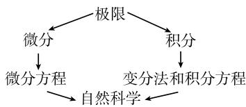

### 第1章 分析学

对函数求微分及解微分方程是有用的. $^{1)}$

1676年后牛顿致莱布尼茨的一封信

分析学中最基本的概念是极限。数学和物理中的许多重要概念可以用极限定义，如速度、加速度、功、能量、功率、作用、物体的体积和表面积、曲线的长和曲率、曲面的曲率等。分析的核心是微积分，它是由I.牛顿(Newton,1643—1727)和G.W.莱布尼茨(Leibniz,1646—1716)分别独立发现的。在古代，除了少数几个人，没人知道这个概念。今天，分析学是用数学描述自然科学的最重要的基础概念之一(图1.1).

  
图1.1 极限概念是数学的核心

然而, 只有当分析与其他数学学科, 如代数学、数论、几何、随机理论与数值理论相互作用时, 它才能发挥其真正的作用.

#### 本节包含的小节

- [1.1 初等分析](<1.1 初等分析.md>)
- [1.2 序列的极限](<1.2 序列的极限.md>)
- [1.3 函数的极限](<1.3 函数的极限.md>)
- [1.4 一个实变量函数的微分法](<1.4 一个实变量函数的微分法.md>)
- [1.5 多元实变函数的导数](<1.5 多元实变函数的导数.md>)
- [1.6 单实变函数的积分](<1.6 单实变函数的积分.md>)
- [1.7 多实变量函数的积分](<1.7 多实变量函数的积分.md>)
- [1.8 向量代数](<1.8 向量代数.md>)
- [1.9 向量分析与物理学领域](<1.9 向量分析与物理学领域.md>)
- [1.10 无穷级数](<1.10 无穷级数.md>)
- [1.11 积分变换](<1.11 积分变换.md>)
- [1.12 常微分方程](<1.12 常微分方程.md>)
- [1.13 偏微分方程](<1.13 偏微分方程.md>)
- [1.14 复变函数](<1.14 复变函数.md>)
