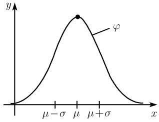
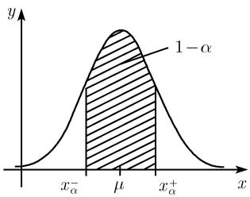

# 《数学指南——实用数学手册》0.4.2 理论分布函数

本节承接 0.4.1 对测量（试验）序列的经验描述，把 [[随机变量]] 从经验层面的频率描述提升到概率模型层面。动机是：随机变量 $X$ 的试验序列往往随试验不同而不同（例如测量一个家族、城市或国家的人，身高各不相同），因此需要引入理论分布函数这一概念来建立随机变量理论。

本节是 [[数理统计]] 中「分布函数」「正态分布」「置信区间」的原型叙述，也是 [[经验均值]] 与 [[经验标准差]] 的理论对应物（正态分布参数 $\mu$、$\sigma$）。

## 理论分布函数的定义

随机变量 $X$ 的理论分布函数 $\Phi$ 定义为：

$$
\boxed{\Phi(x) := P(X < x).}
$$

即 $\Phi(x)$ 的值等于随机变量 $X$ 小于已知数 $x$ 的概率。

## 正态分布（高斯钟形曲线）

许多测量值服从正态分布。其概率密度为高斯钟形曲线：

$$
\boxed{\varphi(x) := \frac{1}{\sigma\sqrt{2\pi}}\mathrm{e}^{-(x-\mu)^2/2\sigma^2}.} \tag{0.48}
$$

- 曲线在 $x = \mu$ 处取极大值。
- 正数 $\sigma$ 越小，曲线越向点 $x = \mu$ 集中。
- $\mu$ 与 $\sigma$ 分别称为正态分布的**均值**与**标准差**（图 0.43(a)）。

## 用面积表示概率

- 图 0.43(b) 中阴影部分的面积等于随机变量属于区间 $[a, b]$ 的概率。
- 图 0.43(d) 给出正态分布 (0.48) 的分布函数 $\Phi$；$\Phi(a)$ 等于 $a$ 左边钟形线下的曲边图形面积。
- 差值 $\Phi(b) - \Phi(a)$ 等于图 0.43(b) 中阴影部分的面积。

## 置信区间

随机变量 $X$ 的 $\alpha$ 置信区间 $[x_\alpha^-, x_\alpha^+]$ 定义为：$X$ 的所有测量值落入该区间的概率为 $1-\alpha$，即 $x$ 满足

$$
x_\alpha^- \leqslant x \leqslant x_\alpha^+
$$

的概率是 $1-\alpha$。图 0.43(c) 中端点 $x_\alpha^-$ 与 $x_\alpha^+$ 关于均值 $\mu$ 对称，且阴影部分面积等于 $1-\alpha$。因此

$$
x_\alpha^+ = \mu + \sigma z_\alpha,\qquad x_\alpha^- = \mu - \sigma z_\alpha.
$$

对实际应用中许多重要情况，即 $\alpha = 0.01, 0.05$ 和 $0.1$ 时，表 0.28 给出了 $z_\alpha$ 的值。

表 0.28（源表原文）

| $\alpha$ | 0.01 | 0.05 | 0.1 |
|---|---|---|---|
| $z_\alpha$ | 2.6 | 2.0 | 1.6 |

## 数值示例

令 $\mu = 10$、$\sigma = 2$，取 $\alpha = 0.01$，由 $z_\alpha = 2.6$ 得

$$
x_\alpha^+ = 10 + 2 \cdot 2.6 = 15.2,\qquad x_\alpha^- = 10 - 2 \cdot 2.6 = 4.8.
$$

因此测量值 $x$ 落在 4.8 到 15.2 之间的概率为 $1-\alpha = 0.99$。直观表述：

- (a) 若 $n$ 很大，选取 $X$ 的 $n$ 个测量值，则 4.8 到 15.2 之间约有 $(1-\alpha)n = 0.99n$ 个测量值。
- (b) 若对 $X$ 测量 1000 次，则 4.8 到 15.2 之间约有 990 个值。

## 图 0.43 的四幅子图

- (a) 概率密度
- (b) 用面积表示的概率
- (c) 置信区间
- (d) 分布函数

## 结构化数据：表 0.28

```
alpha    0.01   0.05   0.1
z_alpha  2.6    2.0    1.6
```

## 关联与延伸

- 本节把 [[随机变量]] 的概念从 [[测量序列]] 的经验频率描述推进到概率模型。
- 正态分布的参数 $\mu$ 与 $\sigma$ 是 [[经验均值]] 与 [[经验标准差]] 的理论对应物。
- [[直方图]] 与 [[相对测量频率]] 的经验图像是 [[概率密度]] 的直观前身。
- [[置信区间]] 是 [[数理统计中的标准过程]] 的核心工具之一。

## 相关图像

- `media/10-数学指南实用数学手册--10-042-理论分布函数--118ygtx/001-655f11d1b34cc2ed66ad3612f3973db3fcf3f7cc9396e0aed7deee3b192d1ae9.jpg` — 图 0.43(a) 概率密度
- `media/10-数学指南实用数学手册--10-042-理论分布函数--118ygtx/002-4afd1e6b910d612db5cefbcad88806473263bb44a113d126dbe3d4520842060d.jpg` — 图 0.43(b) 用面积表示的概率
- `media/10-数学指南实用数学手册--10-042-理论分布函数--118ygtx/003-effff39c551c9408362320ad31b0a63681ce61890a631236423a4b84274d5170.jpg` — 图 0.43(c) 置信区间
- `media/10-数学指南实用数学手册--10-042-理论分布函数--118ygtx/004-51c18dd523d1e09ac58c16874cd4b215d854d7b2e5b461542437b4ab2b26bff1.jpg` — 图 0.43(d) 分布函数

<!-- llm-wiki:embedded-images -->
## Embedded Images

### Document





<!-- llm-wiki:embedded-images -->
