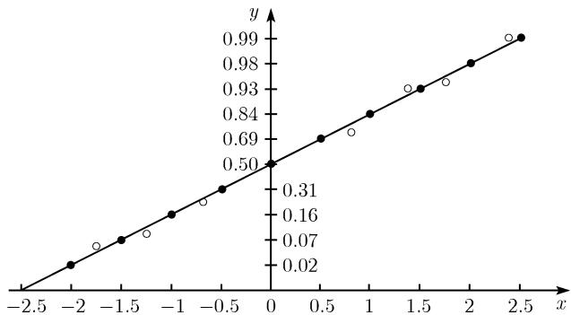

# 《数学指南——实用数学手册》0.4.3 正态分布检验

## 背景与定位

本节属于手册 0.4 节「数理统计表与标准过程」下的一个标准过程条目。开篇给出动机：在实际应用中，许多检验程序都要事先假设随机变量 $X$ 服从正态分布；本节讨论的是用来检验 $X$ 是否服从正态分布的一个**图解过程**。

该过程的定位是"直观方法"，原文在末尾明确将其与被评价为"重要得多"的正态分布 $\chi^2$ 拟合检验并列，并指出后者见 6.3.4.5。

## 图解法的三步过程

(i) 在 $(z, y)$ 坐标平面上画一条直线，它包含了表 0.29 中给出的所有点 $(z, \Phi(z))$（图 0.44）。原文特别提示：在此情况下 $y$ 轴上的不是标准刻度。

(ii) 由所给的 $X$ 的测量值 $x_1, \cdots, x_n$，得到量

$$
z_{j} := \frac{x_{j} - \bar{x}}{\Delta x}, \quad j = 1, \dots, n.
$$

(iii) 计算

$$
\varPhi_{*}(z_{j}) = \frac{1}{n}\,(\text{小于 } z_{j} \text{ 的测量值 } z_{k} \text{ 的数目})
$$

并在图 0.44 中标出点 $(z_{j}, \Phi_{*}(z_{j}))$。

判据：若这些点的位置**非常接近** (i) 中画出的直线，则称 $X$ 近似正态分布。

原文所给例子：图 0.44 中的开圆表示的测量值是近似正态分布的。

## 表 0.29 正态分布函数的样本值

| $z$ | -2.5 | -2 | -1.5 | -1 | -0.5 | 0 | 0.5 | 1 | 1.5 | 2 | 2.5 |
|---|---|---|---|---|---|---|---|---|---|---|---|
| $\Phi(z)$ | 0.01 | 0.02 | 0.07 | 0.16 | 0.31 | 0.5 | 0.69 | 0.84 | 0.93 | 0.98 | 0.99 |

原文就表 0.29 的说明：表 0.29 给出了 $\Phi$ 值的更精确的列表。

## 概率纸

原文补充：图 0.44 中的图像也可以用所谓的**概率纸**得到。

## 与 $\chi^2$ 拟合检验的关系

原文末段标题为「正态分布的 $\chi^{2}$ 拟合检验」，正文为：这种检验方法要比刚才用概率纸给出的直观方法重要得多，6.3.4.5 对此进行了介绍。

本节并未展开 $\chi^2$ 拟合检验的任何技术细节，仅给出指向 6.3.4.5 的指针。

## 图 0.44

图 0.44 中直线上的实心圆点为理论基准/示范点，开圆为观测点，二者略有偏离但整体仍被判为近似正态。这一结论仅针对图 0.44 中的开圆观测组，不可外推至其他数据。

## 与其他页面的关系

- 基准直线直接由 $\Phi(z)$ 值构成，是对 [[理论分布函数]] 与 [[正态分布]] 概念在检验场景下的应用。
- 标准化变换 $z_j$ 的输入为 [[经验均值]] 与 [[经验标准差]]；分母 $\Delta x$ 的校正约定本节未声明。
- $\Phi_*(z_j)$ 的定义式与 [[经验分布函数]] 直接相关，也是 [[经验分布与理论分布的对照]] 这一对照思想的操作化（图解法版本）。
- 判据的定性性质与 $\chi^2$ 拟合检验的定量性质构成本节内部的方法学张力，相关开放问题见 [[概率纸判据的量化阈值]]。

## 来源

源文件：`数学指南_实用数学手册/0.4.3 正态分布检验.md`。

<!-- llm-wiki:embedded-images -->
## Embedded Images

### Document

<!-- llm-wiki:embedded-images -->
