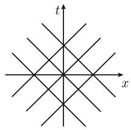

# 《数学指南——实用数学手册》1.13.3 特征的作用

## 概述

本节的主旨是：涉及波的物理过程的重要信息可以从相应的微分方程中收集到，而**不需要实际求解这些方程**。工具就是微分方程组的**象征**（Symbol）、其零点所定义的**特征**（Characteristic）以及由象征的梯度给出的**次特征**（Bicharacteristic）。

本节把间断性分为两类：

- **弱间断性**：高阶导数的跳跃。它与特征有关，并直接给出"电磁波是横波""声波是纵波""弹性波可为横波也可为纵波"这类物理命题。
- **强间断性**：函数本身的跳跃，相应于气体动力学中的**激波**以及 **兰金（Rankine）—于戈尼奥（Hugoniot）条件**。

## 章节结构

| 小节 | 主题 |
|---|---|
| 1.13.3（引言） | 弱/强间断性、跳跃的性态、多指标记号 |
| 1.13.3.1 | 特征和间断性的传播：拟线性组 (1.413)、象征、特征、次特征、间断性定理、弱适定性 |
| 1.13.3.2 | 应用于微分方程的分类：椭圆、抛物、严格双曲；二阶方程分类定理；例 1–例 4 |
| 1.13.3.3 | 应用于电磁波：麦克斯韦方程 (1.416)、波前、跳跃条件、横波 |
| 1.13.3.4 | 应用于弹性波：拉梅常量、特征方程 (1.417)、横波与纵波 |
| 1.13.3.5 | 应用于声波：可压缩流体方程、特征方程 (1.418)、声速、纵波 |
| 1.13.3.6 | 气体动力学中的激波：守恒律 (1.419)、理想气体 (1.420)、兰金—于戈尼奥条件 (1.422)、守恒律激波 (1.423)–(1.424)、声速 $c_S=\sqrt{\gamma p/\rho}$ |

## 跳跃的性态

在 $\mathbb{R}^{N+1}$ 中给定曲面

$$
\mathcal{F}\colon \psi(\boldsymbol{x}) = 0,\qquad \boldsymbol{x}=(x_1,\dots,x_N),
$$

在点 $\boldsymbol{x}$ 处的法向量为

$$
\boldsymbol{n} := \frac{\psi'(\boldsymbol{x})}{|\psi'(\boldsymbol{x})|}.
$$

跳跃的大小由

$$
[u](\boldsymbol{x}) := u_+(\boldsymbol{x}) - u_-(\boldsymbol{x}),
\qquad
u_\pm(\boldsymbol{x}) = \lim_{h\to+0} u(\boldsymbol{x}\pm h\boldsymbol{n})
$$

定义（图 1.163）。

多指标记号：$\alpha=(\alpha_1,\dots,\alpha_N)$，

$$
\partial^{\alpha} v := \partial_1^{\alpha_1}\cdots\partial_N^{\alpha_N} v,\qquad
|\alpha| := \alpha_1+\cdots+\alpha_N,\qquad
\pmb{\lambda}^{\alpha} := \lambda_1^{\alpha_1}\cdots\lambda_N^{\alpha_N}.
$$

## 1.13.3.1 特征和间断性的传播

拟线性组的初值问题：

$$
\begin{array}{l}
\sum_{|\alpha|\le m} \boldsymbol{a}_{\alpha}(\boldsymbol{x},\partial\boldsymbol{u})\,\partial^{\alpha}\boldsymbol{u} = b(\boldsymbol{x},\partial\boldsymbol{u}),\\
\partial^{\beta}\boldsymbol{u} = c_{\beta},\quad \text{在曲面 }\mathcal{F}\text{ 上，对所有 }|\beta|\le m-1\text{ 的 }\beta,
\end{array}\tag{1.413}
$$

其中每个 $\boldsymbol{a}_\alpha$ 是 $N\times N$ 矩阵。曲面 $\mathcal{F}$ 由 $\psi(\boldsymbol{x})=0$ 定义，且 $\psi'(\boldsymbol{x})\neq 0$。

**象征**

$$
\mathcal{S}(\boldsymbol{x},u(\boldsymbol{x}),\boldsymbol{\lambda})
:= \det\Big(\sum_{|\alpha|=m}\boldsymbol{a}_{\alpha}(\boldsymbol{x},\partial u(\boldsymbol{x}))\boldsymbol{\lambda}^{\alpha}\Big),\qquad
\boldsymbol{\lambda}\in\mathbb{R}^N .
$$

**特征**：曲面 $\mathcal{F}\colon\psi(\boldsymbol{x})=0$ 是特征，当且仅当

$$
\mathcal{S}(\boldsymbol{x},u(\boldsymbol{x}),\psi'(\boldsymbol{x})) = 0 .
$$

**次特征**：曲线 $\boldsymbol{x}=\boldsymbol{x}(\sigma)$ 称为特征 $\psi$ 的次特征，如果

$$
\boldsymbol{x}'(\sigma) = \mathcal{S}_{\boldsymbol{\lambda}}\big(\boldsymbol{x}(\sigma),u(\boldsymbol{x}(\sigma)),\psi'(\boldsymbol{x}(\sigma))\big).
$$

物理解释：对于麦克斯韦方程，次特征相应于光波，特征是这些光波的波前（见 1.13.3.3）。$\mathcal{S}(\boldsymbol{x},u(\boldsymbol{x}),\psi'(\boldsymbol{x}))=0$ 对 $\psi$ 是一阶的，按柯西的一个一般结果，可用相应于次特征的曲线构成一阶偏微分方程的解曲面（见 1.13.5.2）。

**间断性定理**：设 $\boldsymbol{u}=\boldsymbol{u}(\boldsymbol{x})$ 是 (1.413) 的解，$\boldsymbol{u}$ 及其直到 $(m-1)$ 阶导数在 $\mathcal{F}$ 的邻域中连续。于是：

(i) 运动学相容性条件

$$
\sum_{|\alpha|=m}\boldsymbol{a}_{\alpha}(\boldsymbol{x},\partial u(\boldsymbol{x}))[\partial^{\alpha}u](\boldsymbol{x}) = 0 .
$$

(ii) 动力学相容性条件

$$
[\partial^{\alpha}u](\boldsymbol{x}) = \psi'(\boldsymbol{x})^{\alpha}\boldsymbol{\rho},\qquad
\text{对所有 }|\alpha|=m\text{ 的 }\alpha ,
$$

其中 $\boldsymbol{\rho}\in\mathbb{R}^M$ 固定；若 $(\psi,u)$ 在 $\boldsymbol{x}$ 处是特征，即 $\mathcal{S}(\boldsymbol{x},u(\boldsymbol{x}),\psi'(\boldsymbol{x}))=0$，则 $\boldsymbol{\rho}\neq 0$。

**初值问题的弱适定性**：对光滑 $u,\psi$，下述命题等价：

(i) $u$ 在 $\boldsymbol{x}$ 处直到 $m$ 阶的导数由微分方程与初值唯一确定；
(ii) $(\psi,\boldsymbol{u})$ 在 $\boldsymbol{x}$ 处不是特征，即 $\mathcal{S}(\boldsymbol{x},\boldsymbol{u}(\boldsymbol{x}),\psi'(\boldsymbol{x}))\neq 0$。

## 1.13.3.2 应用于微分方程的分类

固定点 $\boldsymbol{x}$，考虑多项式

$$
\mathcal{P}(\boldsymbol{\lambda}) := \mathcal{S}(\boldsymbol{x},u(\boldsymbol{x}),A\boldsymbol{\lambda}),\qquad
\boldsymbol{\lambda}\in\mathbb{R}^N ,
$$

其中 $A$ 是固定的可逆实 $N\times N$ 矩阵。

**定义**：

(i) 在点 $\boldsymbol{x}$ 处**椭圆**，若 $\boldsymbol{\lambda}=0$ 是 $\mathcal{P}$ 的唯一零点。
(ii) 在点 $\boldsymbol{x}$ 处**抛物**，若 $\mathcal{P}$ 退化，即它依赖的变量数少于 $N$。
(iii) 在点 $\boldsymbol{x}$ 处**严格双曲**，若对每个非零数组 $(\lambda_1,\dots,\lambda_{N-1})\in\mathbb{R}^{N-1}$，方程 $\mathcal{P}(\boldsymbol{\lambda})=0$ 恰有 $MN$ 个不同的实解 $\lambda_N$。

定性性态：椭圆问题对应平稳过程，无特征、解无间断；抛物问题对应流过程（热导、热扩散），对时间有磨光效果；双曲问题属于波过程，间断沿波前的传播是输运物理效果的重要机理。

**二阶方程的分类**：对

$$
\sum_{j,k=1}^{n} a_{jk}\partial_j\partial_k u + \sum_{j=1}^{n} a_j\partial_j u + a u = f,\tag{1.415}
$$

$A=(a_{jk})$ 实对称，象征 $\mathcal{S}(\boldsymbol{\lambda})=\boldsymbol{\lambda}^{\mathrm{T}}A\boldsymbol{\lambda}$，特征方程 $\sum_{j,k}a_{jk}\partial_j\psi\,\partial_k\psi=0$，次特征方程 $\boldsymbol{x}'(\sigma)=2A\psi'(\boldsymbol{x}(\sigma))$。

**定理**：(i) 椭圆 $\iff$ $A$ 的本征值全正或全负；(ii) 抛物 $\iff$ $A$ 至少有一个本征值为零；(iii) 严格双曲 $\iff$ $A$ 的一个本征值为正而其余为负（或一个为负而其余为正）。

**例 1（拉普拉斯方程）**：$u_{xx}+u_{yy}=0$，象征 $\lambda_1^2+\lambda_2^2=0$ 只给出 $\lambda=0$，故椭圆。

**例 2（热导方程）**：$u_t+u_{xx}=0$，象征 $\mathcal{S}(\boldsymbol{\lambda})=-\lambda_1^2$ 不依赖 $\lambda_2$，故抛物。特征方程 $\psi_x^2=0$ 的解族 $\psi=t+\text{常数}$ 给出特征

$$
t=\text{常数}.
$$

**例 3（弦振动方程）**：$\frac{1}{c^2}u_{tt}-u_{xx}=0$，象征 $\frac{1}{c^2}\lambda_1^2-\lambda_2^2$，对每个 $\lambda_1\neq 0$ 有两个实解 $\lambda_2$，故严格双曲。特征为

$$
x=\pm ct+\text{常数}.
$$

**注**：当传播速度 $c$ 增加时，这些特征接近热方程的特征 $t=\text{常数}$。热导方程的初始扰动以任意快的速度被传播，这与爱因斯坦（A. Einstein, 1879—1955）原理（物理效应至多以光速传播）相矛盾，因而必须以狭义相对论来修正热方程。

**例 4**：$\Delta u=u_{xx}+u_{yy}+u_{zz}$。(i) 泊松方程 $\Delta u=f$ 椭圆；(ii) 热导方程 $u_t-\alpha\Delta u=f$ 抛物；(iii) 波动方程 $\frac{1}{c^2}u_{tt}-\Delta u=f$ 严格双曲。波动方程相应于活动波前的特征满足**程函方程**

$$
\frac{1}{c^2}\psi_t^2-(\mathbf{grad}\,\psi)^2=0 .
$$

特别对 $\psi=ct-\varphi(x,y,z)$，次特征由 $\boldsymbol{x}'(t)=\operatorname{grad}\varphi(\boldsymbol{x}(t))$ 给出，是垂直于波曲面 $\varphi=\text{常数}$ 的曲线；$\varphi=\alpha x+\beta y+\gamma z+\delta$ 时特征为平面 $\alpha x+\beta y+\gamma z+\delta=ct$，次特征为垂直于这些平面的直线。

## 1.13.3.3 应用于电磁波

麦克斯韦方程的初值问题

$$
\begin{array}{l}
\mathbf{curl}\,E = -B_t,\qquad \mathbf{curl}\,B = \frac{1}{c^2}E_t,\\
E=E_0,\quad B=B_0,\quad \text{在时刻 }t=0,
\end{array}\tag{1.416}
$$

其中 $E,B$ 分别为无电荷、无电流真空中电场与磁场向量，$c$ 为真空光速；设 $\operatorname{div}E_0=0$、$\operatorname{div}B_0=0$。

特征方程为 $\psi=0$，$\psi$ 满足

$$
\left(\frac{1}{c^2}\psi_t^2-(\mathbf{grad}\,\psi)^2\right)\psi_t^4 = 0 .
$$

对形如 $\psi(\boldsymbol{x})=\varphi(\boldsymbol{x})-ct$、$(\operatorname{grad}\varphi)^2\equiv 1$ 的解，$\mathcal{F}\colon\varphi(\boldsymbol{x})-ct=0$ 是沿单位法向量 $\boldsymbol{n}=\operatorname{grad}\varphi(\boldsymbol{x})$ 以速度 $c$ 传播的波前（图 1.165）。

**跳跃条件**：若 $E,B$ 沿波前 $\mathcal{F}$ 连续，则一阶导数的可能跳跃满足

$$
[\partial_k E] = \boldsymbol{a}n_k,\qquad [\partial_k B] = c^{-1}\boldsymbol{b}n_k,\qquad k=1,2,3,
$$

其中 $\boldsymbol{a},\boldsymbol{b}$ 满足 $a^2+b^2\neq 0$，$\boldsymbol{a}=\boldsymbol{b}\times\boldsymbol{n}$，$\boldsymbol{b}=\boldsymbol{n}\times\boldsymbol{a}$。因为 $\boldsymbol{a},\boldsymbol{b}$ 垂直于传播方向 $\boldsymbol{n}$，所以说它们是**横波**。

例：无线电台在 $t=0$ 开始节目时，$E$ 和 $B$ 在波前为零、其后不为零，从而产生电磁波前。

## 1.13.3.4 应用于弹性波

小形变 $\boldsymbol{y}=\boldsymbol{x}+\boldsymbol{u}(\boldsymbol{x},t)$，线性弹性理论方程为

$$
\rho\boldsymbol{u}_{tt} = \kappa\Delta\boldsymbol{u} + (\lambda+\kappa)\mathbf{grad}\,\operatorname{div}\boldsymbol{u},
$$

其中 $\rho$ 为常数密度，$\kappa,\lambda$ 为拉梅（G. Lamé, 1795—1870）物质常量。特征由

$$
\left(\frac{1}{c_{\mathrm{tr}}^2}\psi_t^2-(\mathbf{grad}\,\psi)^2\right)^2
\left(\frac{1}{c_1^2}\psi_t^2-(\mathbf{grad}\,\psi)^2\right) = 0\tag{1.417}
$$

的解 $\psi$ 给出 $\mathcal{F}\colon\psi(\boldsymbol{x},t)=0$，其中

$$
c_{\mathrm{tr}} := \sqrt{\frac{\kappa}{\rho}},\qquad
c_1 := \sqrt{\frac{\lambda+2\kappa}{\rho}} .
$$

**横波**：取 $(\operatorname{grad}\varphi)^2\equiv 1$、$\psi:=c_{\mathrm{tr}}t-\varphi(\boldsymbol{x})$，则 $\mathcal{F}$ 沿法向 $\boldsymbol{n}=\operatorname{grad}\varphi(\boldsymbol{x})$ 以速度 $c_{\mathrm{tr}}$ 移动，二阶导数的间断条件为

$$
[\partial_j\partial_k\boldsymbol{u}] = \boldsymbol{a}n_j n_k,\qquad j,k=1,2,3,
$$

$\boldsymbol{a}\neq 0$ 垂直于 $\boldsymbol{n}$，是横波。

**纵波**：以 $c_1$ 代替 $c_{\mathrm{tr}}$ 得到相同结果，但 $\boldsymbol{a}$ 平行于 $\boldsymbol{n}$，是纵波。

## 1.13.3.5 应用于声波

可压缩流体（无内摩擦）的运动方程：

$$
\begin{array}{rl}
\rho\boldsymbol{v}_t + \rho(\boldsymbol{v}\,\mathbf{grad})\boldsymbol{v} = \boldsymbol{f}-\mathbf{grad}\,p & (\text{运动方程}),\\
\rho_t + \operatorname{div}(\rho\boldsymbol{v}) = 0 & (\text{质量守恒}),\\
p = p(\rho) & (\text{状态绝热方程}).
\end{array}
$$

$\mathcal{F}\colon\psi_t(\boldsymbol{x},t)=0$ 描述曲面沿单位法向 $\boldsymbol{n}$ 速度为

$$
c = -\frac{\psi_t(\boldsymbol{x},t)}{|\mathbf{grad}\,\psi|},\qquad
\boldsymbol{n} = \frac{\mathbf{grad}\,\psi}{|\mathbf{grad}\,\psi|},
$$

且相对速度 $c-\boldsymbol{v}\boldsymbol{n} = -\frac{1}{|\mathbf{grad}\psi|}D_t\psi$，其中 $D_t\psi := \psi_t+\boldsymbol{v}\,\mathbf{grad}\,\psi$。特征方程为

$$
(D_t\psi)^2\left(\frac{1}{c_{\mathrm{S}}^2}(D_t\psi)^2-(\mathbf{grad}\,\psi)^2\right) = 0,\tag{1.418}
$$

其中

$$
c_{\mathrm{S}} := \sqrt{p'(\rho)} .
$$

**声波**：若 $\psi$ 满足 $\frac{1}{c_{\mathrm{S}}^2}(D_t\psi)^2-(\mathbf{grad}\,\psi)^2=0$，则 (1.418) 成立，且有 $c-\boldsymbol{v}\boldsymbol{n}=c_{\mathrm{S}}$，$c_{\mathrm{S}}$ 称为声速。一阶导数的间断条件为

$$
[\partial_j\boldsymbol{v}] = \boldsymbol{a}n_j,\qquad [\partial_j\rho] = bn_j,
$$

其中 $\boldsymbol{a}=bc_{\mathrm{S}}\rho^{-1}\boldsymbol{n}$，$a^2+b^2\neq 0$。由于跳跃向量 $\boldsymbol{a}$ 平行于法向量 $\boldsymbol{n}$，得到**纵波**。

## 1.13.3.6 气体动力学中的激波

气体（无摩擦、无热导）的运动方程：

$$
\begin{array}{cc}
(\rho\boldsymbol{v})_t + \operatorname{div}(\rho\boldsymbol{v}\otimes\boldsymbol{v}+pI) = \boldsymbol{f} & (\text{动量守恒}),\\
\rho_t + \operatorname{div}(\rho\boldsymbol{v}) = 0 & (\text{质量守恒}),\\
\epsilon_t + \operatorname{div}(\epsilon\boldsymbol{v}+p\boldsymbol{v}) = \boldsymbol{f}\boldsymbol{v} & (\text{能量守恒}),\\
(\rho s)_t + \operatorname{div}(\rho s\boldsymbol{v}) \ge 0 & (\text{熵方程}).
\end{array}\tag{1.419}
$$

张量积由 $(\boldsymbol{a}\otimes\boldsymbol{b})\boldsymbol{c}:=\boldsymbol{a}(\boldsymbol{b}\boldsymbol{c})$ 定义；$\operatorname{div}(\boldsymbol{a}\otimes\boldsymbol{b})$ 由高斯积分公式 $\int_G\operatorname{div}(\boldsymbol{a}\otimes\boldsymbol{b})\,\mathrm{d}\boldsymbol{x}=\int_{\partial G}(\boldsymbol{a}\otimes\boldsymbol{b})\boldsymbol{n}\,\mathrm{d}S$ 给出。

热力学关系：

$$
p=p(\rho,T),\quad e=e(\rho,T),\quad s=s(\rho,T),\qquad
\mathrm{d}e = T\,\mathrm{d}s + p\frac{\mathrm{d}\rho}{\rho^2}\ (\text{吉布斯方程}),
$$

$\epsilon := \frac{1}{2}\rho\boldsymbol{v}^2+\rho e$ 为总能量密度。

**理想气体例**（温度不太低）：

$$
p = r\rho T,\quad e = cT,\quad s = c\ln(T\rho^{1-\gamma}),\quad \gamma = 1+r/c,\tag{1.420}
$$

其中 $r$ 为气体常数，$c$ 为比热容。

**兰金—于戈尼奥间断性条件**：对活动曲面

$$
\mathcal{F}\colon \varphi(\boldsymbol{x})-t=0,\tag{1.421}
$$

（不必是特征）物理量的可能跳跃满足

$$
\begin{array}{l}
-[\rho\boldsymbol{v}] + [\rho\boldsymbol{v}\otimes\boldsymbol{v}+pI]\varphi'(\boldsymbol{x}) = \mathbf{0},\\
-[\rho] + [\rho\boldsymbol{v}]\varphi'(\boldsymbol{x}) = 0,\\
-[\epsilon] + [\epsilon\boldsymbol{v}+p\boldsymbol{v}]\varphi'(\boldsymbol{x}) = 0,\\
-[\rho s] + [\rho s\boldsymbol{v}]\varphi'(\boldsymbol{x}) \ge 0.
\end{array}\tag{1.422}
$$

出现这种间断时称 $\mathcal{F}$ 为**激波**（例如超音速飞机产生的激波）。气体动力学中方程的理论与数值处理常因激波而复杂化，这些问题在设计最小燃料消耗的现代飞机结构中极为重要。

**守恒律的激波**：对方程

$$
\mu_t + \operatorname{div}\boldsymbol{j} = g,\tag{1.423}
$$

若解 $\mu$ 与 $\boldsymbol{j}$ 在曲面 $\mathcal{F}$ 上一点 $\boldsymbol{x}$ 处有跳跃，则在广义函数意义下（参阅 [212]）

$$
-[\mu] + [\boldsymbol{j}]\varphi'(\boldsymbol{x}) = 0.\tag{1.424}
$$

由于 (1.419) 具有守恒律形式，跳跃关系 (1.422) 由 (1.424) 即得。

**气体中的声波**：过程快得使体积单元之间不交换热量，比熵密度 $s$ 保持常数。由 (1.420) 得 $T=\text{常数}\cdot\rho^{\gamma-1}$，$e=cT$ 以及状态绝热方程

$$
p = \text{常数}\cdot\rho^{\gamma}.
$$

类似 1.13.3.5，由 $c_{\mathrm{S}}=\sqrt{p'(\rho)}$ 得

$$
c_{\mathrm{S}} = \sqrt{\gamma p/\rho}.
$$

对于构成大气层的混合气体，实验给出 $\gamma\sim 1.4$。

## 关键要点

- 象征 $\mathcal{S}$ 包含 (1.413) 解组的基本信息；特征 $\mathcal{S}=0$、次特征 $\boldsymbol{x}'=\mathcal{S}_{\boldsymbol{\lambda}}$。
- 弱间断性由特征描述，导致横波/纵波的判定；强间断性对应激波与兰金—于戈尼奥条件。
- 椭圆无特征、抛物退化、严格双曲有实特征；二阶方程的分类可由系数矩阵 $A$ 的本征值符号判定。
- 热方程以任意快速度传播扰动，与爱因斯坦（相对论）原理冲突，需狭义相对论修正。

## 相关页面

- 概念：[[特征-偏微分方程]]、[[次特征]]、[[象征-微分方程组]]、[[弱间断性与强间断性]]、[[跳跃-间断大小]]、[[间断性定理]]、[[拟线性方程组]]、[[偏微分方程的分类]]、[[兰金-于戈尼奥条件]]、[[守恒律]]、[[激波]]、[[拉梅常量]]、[[声速]]、[[横波与纵波]]、[[程函方程]]、[[麦克斯韦方程]]
- 人物：[[兰金]]、[[于戈尼奥]]、[[爱因斯坦]]、[[拉梅]]、[[柯西]]、[[麦克斯韦]]、[[狄拉克]]
- 既有条目：[[热方程]]、[[波方程]]、[[拉普拉斯算子]]、[[泊松方程]]、[[调和函数]]、[[依赖域]]、[[惠更斯原理]]、[[偏微分方程]]

<!-- llm-wiki:embedded-images -->
## Embedded Images

### Document

<!-- llm-wiki:embedded-images -->
