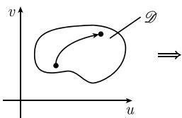

# 《数学指南——实用数学手册》1.7.7 黎曼曲面测度

## 本节定位

本节（1.7.7）位于 1.7「多实变量函数的积分」的末尾，接续 1.7.6 关于高斯-斯托克斯定理的讨论，把积分的对象从区域/曲线推进到**曲线坐标下的参数曲面**。全节的核心主张是黎曼式的：**在曲线坐标下由弧长可以直接得到曲面的面积和区域的体积**——即先把「长度」这件事写成度量，再由度量通过 Gram 行列式导出面积元与体积元，最后把曲面积分统一写成体积形式 μ 的积分。

本节与 [[微分式的积分-积分统一]] 的思路一致：曲面上的积分不是新定义，而是「密度函数 × 体积形式」的积分。

## 对象：参数曲面

令 $\mathcal{D}$ 为 $\mathbb{R}^m$ 中的区域。参数表示

$$
\boldsymbol{x} = \boldsymbol{x}(\boldsymbol{u}), \quad \boldsymbol{u} \in \mathcal{D}
$$

确定了 $\mathbb{R}^N$ 中的一个 m 维曲面，其中 $\boldsymbol{u} = (u_1, \cdots, u_m)$，$\boldsymbol{x} = (x_1, \cdots, x_N)$（参看图 1.75，那里 $u_1 = u$，$u_2 = v$，$x_1 = x$，$x_2 = y$，$x_3 = z$）。

## 定义：$\mathbb{R}^N$ 中曲线的弧长

对 $\mathbb{R}^N$ 中的曲线 $x = x(t)$，其中 $\alpha \leqslant t \leqslant \beta$，曲线上参数值分别为 $t = \alpha$、$t = \tau$ 的两点之间的弧长为

$$
S(\tau) = \int_{\alpha}^{\tau} \left(\sum_{j=1}^{N} x_j'(t)^2 \right)^{1/2} \mathrm{d}t.
$$

1.6.9 中给出了这个定义的动机。

## 定理：曲面弧长满足的微分方程 (1.153)

参数域 $\mathcal{D}$ 中的每条曲线 $u = u(t)$ 对应着曲面元素 $\mathcal{S}$ 上的曲线

$$
\boldsymbol{x} = \boldsymbol{x}(\boldsymbol{u}(t)),
$$

它的弧长满足微分方程：

$$
\left(\frac{\mathrm{d}s(t)}{\mathrm{d}t}\right)^2
= \sum_{j,k=1}^{m} g_{jk}(\boldsymbol{u}(t)) \frac{\mathrm{d}u_j(t)}{\mathrm{d}t} \frac{\mathrm{d}u_k(t)}{\mathrm{d}t}.
\tag{1.153}
$$

称

$$
g_{jk}(u) := \sum_{n=1}^{N} \frac{\partial x_n(u)}{\partial u_j} \frac{\partial x_n(u)}{\partial u_k}
$$

为**度量张量的分量**。可以把 (1.153) 符号式地记作

$$
\mathrm{d}s^2 = g_{jk} \mathrm{d}u_j \mathrm{d}u_k,
$$

这对应着近似式 $(\Delta s)^2 = g_{jk} \Delta u_j \Delta u_k$。

### 原文证明

令 $x_j(t) = x_j(u(t))$，则有关系式

$$
s'(t)^2 = \sum_{n=1}^{N} x_n'(t) x_n'(t),
$$

由链式法则得 $x_n'(t) = \sum_{j=1}^{m} \frac{\partial x_n}{\partial u_j} \frac{\mathrm{d}u_j}{\mathrm{d}t}$。

## 体积形式与曲面积分

令 $g := \det(g_{jk})$，定义曲面 $\mathcal{F}$ 的**体积形式**为

$$
\mu := \sqrt{g} \, \mathrm{d}u_1 \wedge \dots \wedge \mathrm{d}u_m.
$$

曲面积分定义为

$$
\int_{\mathcal{F}} \varrho \, \mathrm{d}F := \int_{\mathcal{F}} \varrho \mu .
$$

在经典符号里，这对应着公式：

$$
\int_{\mathscr{F}} \varrho \, \mathrm{d}F = \int_{\mathscr{D}} \varrho \sqrt{g} \, \mathrm{d}u_1 \mathrm{d}u_2 \dots \mathrm{d}u_m .
$$

### 物理解释

如果把 $\varrho$ 看成质量密度（或电量密度），那么 $\int_{\mathcal{F}} \varrho \mathrm{d}F$ 等于 $\mathcal{F}$ 上的质量（或电量）总和。当 $\varrho = 1$ 时，$\int_{\mathcal{F}} \varrho \mathrm{d}F$ 等于 $\mathcal{F}$ 的曲面测度。

## 应用到 $\mathbb{R}^3$ 中的曲面

给定 $\mathbb{R}^3$ 中的曲面 $\mathcal{F}$，它在笛卡儿坐标 $x, y, z$ 中的参数表示为

$$
x = x(u, v), \quad y = y(u, v), \quad z = z(u, v), \quad (u, v) \in \mathscr{D}
$$

（图 1.75）。那么有

$$
\mathrm{d}s^2 = E \mathrm{d}u^2 + 2F \mathrm{d}u \mathrm{d}v + G \mathrm{d}v^2,
$$

其中

$$
\begin{array}{l}
E := \boldsymbol{r}_u^2 = x_u^2 + y_u^2 + z_u^2, \quad G := \boldsymbol{r}_v^2 = x_v^2 + y_v^2 + z_v^2, \\
F := \boldsymbol{r}_u \boldsymbol{r}_v = x_u x_v + y_u y_v + z_u z_v,
\end{array}
$$

因此 $g = EG - F^2$，体积形式为 $\mu = \sqrt{EG - F^2}\,\mathrm{d}u \wedge \mathrm{d}v$，曲面积分有形式

$$
\int_{\mathcal{F}} \varrho \, \mathrm{d}F = \int_{\mathcal{F}} \varrho \mu
= \int_{\mathcal{D}} \varrho \sqrt{EG - F^2 \, \mathrm{d}u \mathrm{d}v}.
$$

（上式右端原文的根号闭合位置疑有转写讹误，见 [[queries/177节R3曲面积分公式括号缺失是否转写讹误]]。）

## 延伸

推广到黎曼流形，见 [212]。

## 图版

- 图 1.75：某域中的弧长（$\mathcal{D} \subset \mathbb{R}^2$ 中的弧，双线箭头指向后续推导）。

## 关联

- 上一节：[[sources/10-数学指南实用数学手册--20-176-微积分基本定理高斯-斯托克斯定理--omolnc]]（1.7.6 微积分基本定理、高斯-斯托克斯定理）
- 上位节：[[sources/10-数学指南实用数学手册--12-17-多实变量函数的积分--1b1bfca]]（1.7 多实变量函数的积分）
- 曲线坐标与代换：[[sources/10-数学指南实用数学手册--6-175-代换--1v4zpfn]]（1.7.5 代换）

<!-- llm-wiki:embedded-images -->
## Embedded Images

### Document

<!-- llm-wiki:embedded-images -->
