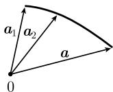
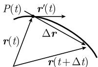
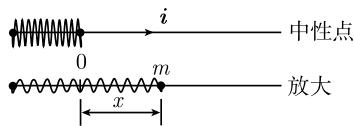

# 《数学指南——实用数学手册》1.9.1 速度和加速度

## 概述

本页是《数学指南——实用数学手册》第 1.9 节「[[concepts/向量分析]]」的第一个子节 **1.9.1 速度和加速度** 的内容摘要。该子节把实值函数的极限、连续、导数概念推广到 [[concepts/向量值函数]]，并把这些导数的物理含义落实为速度向量与加速度向量，最终给出经典力学运动方程的向量形式。

子节的叙述脉络为：极限 → 轨道 → 连续性 → 速度向量 → 加速度向量 → 牛顿基本运动定律 → 谐振子与非谐振子 → 坐标表示 → 光滑性 → 泰勒级数。

本页是既有查询 [[queries/19节子节191至1911尚未入库]] 所指子节中的**第一个**，该查询至此得到部分兑现（仅 1.9.1 入库，1.9.2–1.9.11 仍缺）。

## 关键公式（原文转录）

**向量序列的极限**

```
a = lim_{n→∞} a_n
当且仅当  lim_{n→∞} |a_n − a| = 0
```

即当 n→∞ 时，aₙ 与 a 的**终点间的距离**趋向于 0。

**轨道**

```
r = r(t),  α ≤ t ≤ β
```

选取固定点 O，令 r(t) := 向量 OP(t)，则此方程描述在时刻 t 时坐标为 P(t) 的粒子的运动。

**连续性**

```
r = r(t) 连续  ⟺  lim_{s→t} r(s) = r(t)
```

**速度向量**

```
r′(t) := lim_{Δt→0} Δr/Δt,   其中 Δr := r(t + Δt) − r(t)
```

**加速度向量**

```
r″(t) := lim_{Δt→0} [r′(t + Δt) − r′(t)] / Δt
```

**牛顿基本运动定律**

```
m r″(t) = F(r(t), t)                                    (1.160)
```

原文表述为：「力等于质量乘以加速度。」并指出该定律甚至对依赖于速度的力，即 F = F(r, r′, t)，也成立。

**谐振子微分方程**

```
m x″(t) i = −k x i
令 ω² = k/m，得      x″ + ω² x = 0
```

**非谐振子力定律（脚注 1）**

```
F(x) = F(0) + x a + x² b + x³ c + …      （泰勒展开）
F(0) = 0                                  （无运动则无力）
F(−x) = −F(x)  ⟹  b = 0                  （对称性）
a = −k i,  c = −l i                       （力方向与运动相反，k, l > 0）

F(x) = −k x i − l x³ i
```

谐振子是 l = 0 的特例。

**坐标表示与按分量求导**

```
r(t)   = x(t) i + y(t) j + z(t) k
r⁽ⁿ⁾(t) = x⁽ⁿ⁾(t) i + y⁽ⁿ⁾(t) j + z⁽ⁿ⁾(t) k
|r⁽ⁿ⁾(t)| = √( x⁽ⁿ⁾(t)² + y⁽ⁿ⁾(t)² + z⁽ⁿ⁾(t)² )
```

**坐标收敛性**

```
lim_{n→∞} a_n = a
当且仅当 n → ∞ 时  α_n → α,  β_n → β,  γ_n → γ
```

（原文此处将第三个分量写作 `r_n → ν`，疑为 `γ_n → γ` 的转写讹误，见待考问题。）

**C^k 类判据**

区间 [a, b] 上的函数 r = r(t) 是 C^k 类的，当且仅当在某一笛卡儿坐标系中，所有分量函数 x = x(t), y = y(t), z = z(t) 在 [a, b] 上都属于 C^k 类（参看 1.4.1）。

**泰勒级数与余项估计**

```
r(t + h) = r(t) + h r′(t) + (h²/2) r″(t) + … + (hⁿ/n!) r⁽ⁿ⁾(t) + R_{n+1}

|R_{n+1}| ≤ h^{n+1}/(n+1)! · sup_{s ∈ [a, b]} |r⁽ⁿ⁺¹⁾(s)|
```

适用于 [a, b] 上 C^{n+1} 类的 r = r(t)，对一切 t, t + h ∈ [a, b]。

## 例子

- **谐振子**：质量为 m 的弹簧沿一条直线放置，其终点运动由 r(t) = x(t) i 给出，作用力 F := −k x i（k > 0 为描述弹簧物理性质的常量），由此导出 x″ + ω² x = 0，并指明其解将在 1.11.1.2 给出。
- **非谐振子**：由上述脚注 1 的一般考虑导出 F(x) = −k x i − l x³ i；原文写作「这称为非谐（anharmonic）振子。当 l = 0 时的特殊情形就是谐振子」——该句的归属与位置存在疑点，见待考问题。

## 图像

- 图 1.94：`media/10-数学指南实用数学手册--10-191-速度和加速度--1kt6qq/001-4cd0f09985b12f38d87aa0c6aad319388cca5205cb774b09c6394369aac81147.jpg`（说明向量序列极限：aₙ 与 a 的终点距离趋向于 0）
- 图 1.95：`media/10-数学指南实用数学手册--10-191-速度和加速度--1kt6qq/002-fe1147a0c0df00d486d1f844802f9e56579f911305f4ad2ef6abbf4ef3cdfe0c.jpg`（位置向量 r(t)、r(t+Δt) 与弦向量 Δr，以及在 P(t) 处沿切线的 r′(t)）
- 图 1.96：`media/10-数学指南实用数学手册--10-191-速度和加速度--1kt6qq/003-b27ff358d7d799fd01aa20a935092447f5725b358526200888db4c5b1b7140e8.jpg`（谐振子：弹簧、中性点 O、位移 x 与方向 i，含放大视图）

## 与既有 wiki 的连接

- 直接延续 1.8 节 [[sources/10-数学指南实用数学手册--7-18-向量代数--hggkd1]]：本子节的分量表示与求导公式使用 [[concepts/标量与向量]]、[[concepts/基与分量]]、[[concepts/笛卡儿坐标系]]、[[concepts/向量空间VO]] 等已建概念。
- 承接 1.9 节框架页：[[concepts/向量分析]]、[[concepts/向量值函数]]、[[concepts/笛卡儿微分学]]。本子节是「[[findings/向量分析是描述经典物理学领域最基本的数学工具之一]]」这一论断的具体落地证据——速度、加速度与牛顿运动定律都用向量语言表述。
- 与 [[concepts/特征不变性]]、[[findings/向量运算与坐标系无关的特征不变性]] 呼应：C^k 类判据、极限与坐标收敛性的等价关系说明这些性质不依赖于笛卡儿系的选取。

## 待考问题

- [[queries/191节坐标收敛性中r_n到nu是否应为gamma_n到gamma]]
- [[queries/191节谐振子例中非谐振子一句归属是否讹误]]
- [[queries/191节引用1112节与141节尚未入库]]
- [[queries/191节图194内容无法辨识]]
- [[queries/191节牛顿定律是否仅以力等于质量乘以加速度表述]]

## 证据强度说明

本节全部结论均为**定义或由实值微积分逐分量推广所得的定理陈述**，不含经验数据，因此相关页面均按「定义/定理」而非「实证发现」处理；部分细节存在 OCR／转写讹误风险，已逐条列入待考问题。

<!-- llm-wiki:embedded-images -->
## Embedded Images

### Document




<!-- llm-wiki:embedded-images -->
