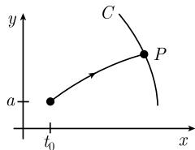

# 《数学指南——实用数学手册》5.1.8 自然边界条件

本页是《数学指南——实用数学手册》第 5.1.8 节「自然边界条件」的源文档摘要。该节承接 [[欧拉-拉格朗日方程]] 的一阶必要条件，讨论**边界条件未完全给定**时解必须额外满足的条件：一类是端点自由引出的[[自然边界条件]]，另一类是端点被约束在给定曲线上引出的[[广义横截条件]]，并给出几何光学中「光线以直角射到曲线」的特例。

## 一、自由端点问题与自然边界条件

原文给出的变分问题为

$$
\begin{array}{c} \int_{x_{0}}^{x_{1}} L(y(x), y'(x), x)\,\mathrm{d}x \stackrel{!}{=} \min, \\ y(x_{0}) = a \end{array}
$$

注意该问题只固定了左端点 $y(x_0)=a$，右端点 $x_1$、$y(x_1)$ 均未给定，因此称为**自由端点问题**（变分问题）。

结论：该问题的每一个充分光滑的解都满足欧拉-拉格朗日方程

$$
\frac{\mathrm{d}}{\mathrm{d}x} L_{y'} - L_{y} = 0 \tag{5.42}
$$

并额外地满足附加约束条件

$$
\boxed{L_{y'}(y(x), y'(x), x) = 0.}
$$

原文称该条件为**自然边界条件**（natural boundary condition），理由是该条件并不出现在原来提出的变分问题中，而是由变分法本身导出的。原文中此框内条件**未给出方程编号**（相邻的欧拉-拉格朗日方程编号为 (5.42)，后面的广义横截条件编号为 (5.43)）。

## 二、端点位于一条曲线上的问题

若端点位于由

$$
C:\ x = X(\tau),\quad y = Y(\tau)
$$

确定的曲线上，则问题变为

$$
\begin{array}{c} \int_{x_{0}}^{X(\tau)} L(y(x), y'(x), x)\,\mathrm{d}x \stackrel{!}{=} \min, \\ y(x_{0}) = a,\quad y(X(\tau)) = Y(\tau), \end{array}
$$

此处解曲线 $y=y(x)$ 与给定曲线 $C$ 的交点 $P$ 的参数值 $\tau$ **也是待定的**（见图 5.17）。

结论：该问题的每一个充分光滑的解都满足欧拉-拉格朗日方程 (5.42)，并在交点 $P$ 处满足**广义横截条件**

$$
\boxed{L_{y'}(Q) Y'(\tau) + \left[ L_{y'}(Q) y'(x_{1}) \right] X'(\tau) = 0.} \tag{5.43}
$$

其中记号定义为

$$
Q := (y(x_{1}), y'(x_{1}), x_{1}),\quad x_{1} = X(\tau).
$$

## 三、例：几何光学中的直角入射

在几何光学（光学中 Fermat 原理的变分提法）中有

$$
L = n(x,y)\sqrt{1 + y'^{2}} .
$$

代入 (5.43) 后，广义横截条件化为

$$
y'(x_{1}) Y'(\tau) + X'(\tau) = 0,
$$

即光线以**直角**射到曲线 $C$ 上。原文特别指出：波前 $C$ 就是满足这一情形的曲线（图 5.17）。

## 四、图像

图 5.17 约束：从 $(x_0, a)$ 出发的解曲线与曲线 $C$ 交于点 $P$，交点参数 $\tau$ 待定。

## 五、与其他小节的关系

- 欧拉-拉格朗日方程 (5.42) 的形式与 5.1.1 节主定理给出的方程一致，参见 [[欧拉-拉格朗日方程]] 与 [[拉格朗日函数]]。
- 本节是[[concepts/变分问题的局部极小值充分条件]]在**边界条件不完备**情形下的补充：5.1.1 节讨论固定端点（固定边界）的变分问题，本节讨论自由端点与曲线端点。
- 广义横截条件 (5.43) 与横截性概念相关，可作为端点约束的一般形式；当 $C$ 为竖直线 $x=\text{const}$ 或水平线 $y=\text{const}$ 时可退化为相应边界条件的特例。

## 六、本节可提取的结论条目

- [[518节自由端点问题与自然边界条件]]：自由端点问题 (5.42) 之外必须附加 $L_{y'}=0$。
- [[518节端点位于曲线上的广义横截条件]]：端点落在给定曲线 $C$ 上时需满足 (5.43)，且交点参数 $\tau$ 待定。
- [[518节几何光学中光线垂直射到波前]]：$L=n(x,y)\sqrt{1+y'^2}$ 时 (5.43) 退化为直角入射条件。

<!-- llm-wiki:embedded-images -->
## Embedded Images

### Document

<!-- llm-wiki:embedded-images -->
