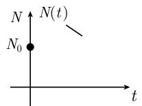
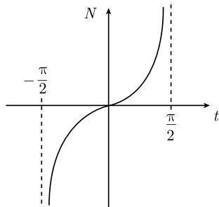
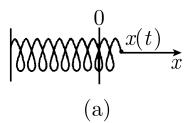
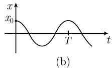
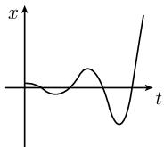
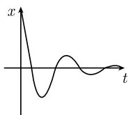

# 《数学指南——实用数学手册》1.12.1 引导性的例子

本节是《数学指南——实用数学手册》第 1.12 节「常微分方程」的首个子节，用八个由简到繁的例子引入 [[常微分方程]] 与 [[初值问题]] 的核心概念：存在性、唯一性、通解、[[适定性]]、[[稳定性]]、[[平衡态]]、特征振荡、[[共振]]、[[阻尼振动]] 以及 [[反问题]]。

本节所有结果均以「公式 + 简短论证」的方式给出，除少数情形外未给出完整的证明与文献出处；引用到的 1.12.4.2（整体唯一性定理）与 1.12.4.7（里卡蒂微分方程）尚未入库。

## 覆盖的例子与结构

| 小节 | 对象 | 核心方程 |
|---|---|---|
| 1.12.1.1 | 放射性衰减 | (1.202) $N'=-\alpha N$ |
| 1.12.1.2 | 增长方程 | (1.206) $N'=\alpha N$ |
| 1.12.1.3 | 阻抗增长（逻辑斯谛方程） | (1.208)、(1.209) |
| 1.12.1.4 | 有限时间爆炸（破裂） | (1.211) $N'=1+N^2$ |
| 1.12.1.5 | 谐振子与特征振荡 | (1.212)、(1.213) |
| 1.12.1.6 | 危险的共振效应 | (1.214)、(1.215) |
| 1.12.1.7 | 阻尼 | (1.216)、(1.217) |
| 1.12.1.8 | 化学反应与化学反应动理学的逆问题 | (1.218) |

## 1.12.1.1 放射性衰减

以镭（1898 年由 [[居里夫妇]] 发现）为对象，令 $N(t)$ 为时刻 $t$ 尚未衰减的原子数：

```latex
\begin{array}{l}
N'(t) = -\alpha N(t), \\
N(0) = N_0 \quad (\text{初值}).
\end{array}                                       \tag{1.202}
```

```latex
N(t) = N_0 \mathrm{e}^{-\alpha t}, \quad t \in \mathbb{R}.   \tag{1.203}
```

- **存在性**：对 (1.203) 求导得 $N'(t) = -\alpha N_0 \mathrm{e}^{-\alpha t} = -\alpha N(t)$，且 $N(0)=N_0$。
- **唯一性**：右端关于 $N$ 为 $C^1$ 类，引用 **1.12.4.2** 的 [[整体唯一性定理]]（本节未给证明）。
- **通解**：任意选取 $N_0$ 即得 [[通解]]。
- **微分方程的目的**：用 [[泰勒]] 级数

```latex
N(t+\Delta t) - N(t) = A \Delta t + B(\Delta t)^2 + \dots   \tag{1.204}
```

并设 $A$ 正比于 $N(t)$；由 $\Delta t>0$ 时 $N(t+\Delta t)-N(t)<0$ 知 $A$ 为负，故令

```latex
A = -\alpha N(t).                                            \tag{1.205}
```

于是 $N'(t) = \lim_{\Delta t\to 0}\frac{N(t+\Delta t)-N(t)}{\Delta t} = A = -\alpha N(t)$。此为**启发式建模论证**。

- **适定性**：对两个解 $N, N_*$ 有 $\|N-N_*\| \le |N(0)-N_*(0)|$，其中范数 $\|N\| := \max_{0\le t\le \mathcal T}|N(t)|$。
- **稳定性**：$\lim_{t\to+\infty} N(t) = 0$，解渐近稳定，趋于平衡解。

## 1.12.1.2 增长方程

令 $N(t)$ 为某种病原体在时刻 $t$ 的数目，假设再生服从 (1.204) 且 $A = \alpha N(t)$：

```latex
\begin{array}{l}
N'(t) = \alpha N(t), \\
N(0) = N_0 \quad (\text{初值}).
\end{array}                                       \tag{1.206}
```

```latex
N(t) = N_0 \mathrm{e}^{\alpha t}, \quad t \in \mathbb{R}.   \tag{1.207}
```

- **不适定**：$\|N-N_*\| = \mathrm{e}^{\alpha \mathcal T} |N(0)-N_*(0)|$，初值微小变化随时间引起解的差的大增长。
- **不稳定**：$\lim_{t\to+\infty} N(t) = +\infty$。

## 1.12.1.3 阻抗增长（逻辑斯谛方程）

```latex
\begin{array}{l}
N'(t) = \alpha N(t) - \beta N(t)^2, \\
N(0) = N_0 \quad (\text{初值}).
\end{array}                                       \tag{1.208}
```

(1.208) 是 [[里卡蒂微分方程]] 的特殊情形（见 1.12.4.7）。**重标度**（[[重标度]]）：

```latex
N(t) = \gamma \mathcal N, \quad t = \delta \tau
```

代入得 $\gamma \mathcal N'(\tau)\frac{1}{\delta} = \alpha\gamma\mathcal N(\tau) - \beta\gamma^2\mathcal N(\tau)^2$。取 $\delta := 1/\alpha$、$\gamma := \alpha/\beta$，得归一化方程

```latex
\begin{array}{l}
\mathcal N'(\tau) = \mathcal N(\tau) - \mathcal N(\tau)^2, \\
\mathcal N(0) = \mathcal N_0 \quad (\text{初始条件}).
\end{array}                                       \tag{1.209}
```

- **平衡态**：$\mathcal N \equiv 0$ 与 $\mathcal N \equiv 1$（因 $\mathcal N^2-\mathcal N=0$）。
- **存在性与唯一性**：$0<\mathcal N_0\le 1$ 时对所有 $\tau$ 有解

```latex
\mathcal N(\tau) = \frac{1}{1 + C \mathrm{e}^{-\tau}}, \quad C := (1-\mathcal N_0)/\mathcal N_0 .
```

$\mathcal N_0=0$ 时对所有 $\tau$ 有唯一解 $\mathcal N(\tau)\equiv 0$。

- **稳定性**：

```latex
\lim_{\tau\to+\infty} \mathcal N(\tau) = 1.                   \tag{1.210}
```

平衡态 $\mathcal N\equiv 1$ 稳定；$\mathcal N\equiv 0$ 不稳定。

## 1.12.1.4 在有限时间的爆炸（破裂）

在区间 $]-\pi/2,\pi/2[$ 中

```latex
N'(t) = 1 + N(t)^2, \quad N(0) = 0                         \tag{1.211}
```

有唯一解 $N(t) = \tan t$，且

```latex
\lim_{t\to \pi/2 - 0} N(t) = +\infty .
```

这是某个自感应过程的模型，为化工厂工程师所担忧（见 [[有限时间爆炸]]）。

## 1.12.1.5 谐振子和特征振荡

质量为 $m$ 的质点受弹簧力 $\mathbf F_0 := -kx\mathbf i$ 与外力 $\mathbf F_1 := \mathcal F(t)\mathbf i$ 沿 $x$ 轴运动；由 [[牛顿]] 的力定律 $mx'' = F_0 + F_1$ 得（[[谐振子]]）

```latex
\begin{array}{c}
x''(t) + \omega^2 x(t) = F(t), \\
x(0) = x_0 \quad (\text{初始位置}), \\
x'(0) = v \quad (\text{初始速度}),
\end{array}                                       \tag{1.212}
```

其中 $\omega := \sqrt{k/m}$，$F := \mathcal F/m$，$F:[0,+\infty[\to\mathbb R$ 连续。

唯一解

```latex
x(t) = x_0 \cos \omega t + \frac{v}{\omega}\sin \omega t + \int_0^t G(t,\tau) F(\tau)\,\mathrm{d}\tau,  \tag{1.213}
```

其中 [[格林函数]] $G(t,\tau) := \frac{1}{\omega}\sin \omega(t-\tau)$。

- **特征振荡**：$F\equiv 0$ 时的解，是频率 $\omega$、周期

```latex
T = \frac{2\pi}{\omega}
```

的正弦波与余弦波的叠加。

- **适定性**：对 (1.212) 的两个解 $x, x_*$，

```latex
\|x - x_*\| \le |x(0)-x_*(0)| + \frac{1}{\omega}|x'(0)-x_*'(0)|
+ \frac{\mathcal F}{\omega}\max_{0\le t\le \mathcal T}|F(t)-F_*(t)|,
```

其中 $\|x-x_*\| := \max_{0\le t\le \mathcal T}|x(t)-x_*(t)|$。

- **本征值问题**（[[本征值问题]]）：

```latex
\begin{array}{l}
-x''(t) = \lambda x(t), \\
x(0) = x(l) = 0 \quad (\text{边界条件})
\end{array}
```

非平凡解 $x\ne 0$ 称为本征解 $(x,\lambda)$，$\lambda$ 称为本征值。**定理**：所有本征解由

```latex
x(t) = C \sin(n\omega_0 t), \quad \lambda = n^2\omega_0^2, \quad
\omega_0 = \frac{\pi}{l}, \quad n = 1,2,\dots
```

给出，$C$ 为任意非零常数。证明由 (1.213) 在 $x_0=0,F\equiv 0$ 时的解 $x(t)=\frac{v}{\omega}\sin\omega t$ 与条件 $\sin(\omega l)=0$ 推出 $\omega l = n\pi$。

## 1.12.1.6 危险的共振效应

取周期外力

```latex
F(t) := \sin \alpha t .
```

**定义**：当 $\alpha=\omega$（外力频率等于特征振动频率）时，外力与谐振子的振动处于 [[共振]] 状态。

- **非共振**（$\alpha\ne\omega$）时的唯一解

```latex
x(t) = x_0 \cos \omega t + \frac{v}{\omega}\sin \omega t
+ \frac{\sin \alpha t + \sin \omega t}{2(\alpha+\omega)\omega}
- \frac{\sin \alpha t - \sin \omega t}{2(\alpha-\omega)\omega}.  \tag{1.214}
```

对所有时刻有界。

- **共振**（$\alpha=\omega$）时的唯一解

```latex
x(t) = x_0 \cos \omega t + \frac{v}{\omega}\sin \omega t
+ \frac{\sin \omega t}{2\omega^2} - \frac{t}{2\omega}\cos \omega t .  \tag{1.215}
```

末项 $t\cos\omega t$ 随 $t$ 增大无界，可导致结构毁坏。该危险项可由非共振解 (1.214) 取极限 $\alpha\to\omega$ 得到。

## 1.12.1.7 阻尼

若存在正比于速度的附加阻抗力 $\mathbf F_2 = -\gamma \mathbf x'$（$\gamma>0$），由 $m\mathbf x'' = \mathbf F_0 + \mathbf F_2 = -k\mathbf x - \gamma \mathbf x'$ 得

```latex
\begin{array}{l}
x''(t) + \omega^2 x(t) + 2\beta x'(t) = 0, \\
x(0) = x_0, \quad x'(0) = v,
\end{array}                                       \tag{1.216}
```

其中 $\beta := \gamma/2m$。作假设 $x = \mathrm{e}^{\lambda t}$ 得特征方程 $\lambda^2 + \omega^2 + 2\beta\lambda = 0$，其根 $\lambda_\pm = -\beta \pm \mathrm i\sqrt{\omega^2-\beta^2}$。

$0<\beta<\omega$ 时对所有 $t$ 有唯一解（[[阻尼振动]]）

```latex
x = x_0 \mathrm{e}^{-\beta t}\cos \omega_* t
+ \frac{v + \beta x_0}{\omega_*} \mathrm{e}^{-\beta t}\sin \omega_* t,  \tag{1.217}
```

其中 $\omega_* := \sqrt{\omega^2-\beta^2}$。

## 1.12.1.8 化学反应和化学反应动理学的逆问题

给定 $m$ 种化学物质 $A_1,\dots,A_m$ 与反应

```latex
\sum_{j=1}^{m} \nu_j A_j = 0,
```

$\nu_j$ 称为计量系数。令 $N_j$ 为 $A_j$ 的分子数，密度

```latex
c_j := \frac{N_j}{V},
```

$V$ 为反应的累积体积。例：$2A_1 + A_2 \to 2A_3$ 即 $\nu_1=-2,\nu_2=-1,\nu_3=2$；其实例为 $2\mathrm H_2 + \mathrm O_2 \to 2\mathrm H_2\mathrm O$。

化学反应动理学的基本方程（[[化学反应动理学]]）

```latex
\begin{array}{l}
\frac{1}{\nu_j}\frac{\mathrm{d}c_j}{\mathrm{d}t} = k c_1^{n_1} c_2^{n_2}\dots c_m^{n_m}, \quad j = 1,\dots,m, \\
c_j(0) = c_{j0} \quad (\text{初始条件}),
\end{array}                                       \tag{1.218}
```

$k$ 为正的反应速度常量（依赖压力 $p$ 与温度 $T$），$n_1,n_2,\dots$ 称为反应的阶。**注**：实际反应包含若干子反应，人们常常并不知道子反应、$k$ 或 $n_j$，于是需由 $c_j(t)$ 的计量反推这些量，此为 [[反问题]]。此类方程及其变形也常用于生物学（$N_j$ 为某种生物的数目，可与 (1.206)、(1.208) 比较）。

## 图像

本节含图 1.119（衰减、增长、缓慢增长三条解的曲线）、图 1.120（$\tan t$ 的爆炸）、图 1.121（振动初值问题）、图 1.122（$n=1$ 与 $n=2$ 的本征解）、图 1.123（共振与阻尼振荡）。

- media/10-数学指南实用数学手册--11-1121-引导性的例子--2uo3hb/001-1e027d495472aa91fb772e0a4afe1aacf6af7333e5483e029631c25be7f2758b.jpg
- media/10-数学指南实用数学手册--11-1121-引导性的例子--2uo3hb/002-b303cb5547f8d2a1ecf002be7bca8d9f05532b3dac05f4183e71a4bc0ae562c9.jpg
- media/10-数学指南实用数学手册--11-1121-引导性的例子--2uo3hb/003-7bd9241cda29106092e9f37464f81398f59db05958f7d56d9e529c6849d21a15.jpg
- media/10-数学指南实用数学手册--11-1121-引导性的例子--2uo3hb/004-4d7b30cd7bf4bbdc03cfd1c19cff6698e2523e8e469aff7e70cfd40b0bae2c8d.jpg
- media/10-数学指南实用数学手册--11-1121-引导性的例子--2uo3hb/005-8b42a3fec3bac402c7dbb1ad4522d432c1c00e2882366acb4b5d470ce8ce9bbb.jpg
- media/10-数学指南实用数学手册--11-1121-引导性的例子--2uo3hb/006-e023fd33c6ee0c6bf30b4d304e780ae7c445f9c6d8bc6c3618c44736438db50c.jpg
- media/10-数学指南实用数学手册--11-1121-引导性的例子--2uo3hb/007-89cbc354bd59a520d93b84fe4804746aeb1c5a930eecae8991a5f9fcf449b783.jpg
- media/10-数学指南实用数学手册--11-1121-引导性的例子--2uo3hb/008-23b06448b79207715df6336c08c89f2201d07e0edce7d814b5045fdf8bc57eeb.jpg
- media/10-数学指南实用数学手册--11-1121-引导性的例子--2uo3hb/009-b15f80da2b2f895bb85fbf9c15aa70398fc463a529f94c6521487a32a2754fb2.jpg
- media/10-数学指南实用数学手册--11-1121-引导性的例子--2uo3hb/010-45766bee1513cdef3a996ca13d372df43510cb7114e95acd38b5b42e55243914.jpg

## 相关页面

[[常微分方程]]、[[初值问题]]、[[适定性]]、[[稳定性]]、[[通解]]、[[平衡态]]、[[增长方程]]、[[逻辑斯谛方程]]、[[里卡蒂微分方程]]、[[重标度]]、[[有限时间爆炸]]、[[谐振子]]、[[特征振荡]]、[[格林函数]]、[[本征值问题]]、[[共振]]、[[阻尼振动]]、[[化学反应动理学]]、[[反问题]]、[[整体唯一性定理]]、[[居里夫妇]]、[[泰勒]]、[[格林]]、[[里卡蒂]]、[[牛顿]]。

## 与其他节的关系

- 1.12.4.2（整体唯一性定理）：本节 (1.202)/(1.206) 的唯一性引用所在，尚未入库。
- 1.12.4.7（里卡蒂微分方程）：本节 (1.208) 所属的一般类型，尚未入库。
- 1.12 节母页：[[sources/10-数学指南实用数学手册--9-112-常微分方程--6ft4l9]]。

## 待办与疑点

- 图 1.119–1.123 的多数扫描图无法辨识，见 [[queries/1121节图表无法辨识]]。
- 全部定理与公式未给完整证明与文献出处（除 (1.209)、(1.216) 的部分推导外），见 [[queries/1121节引用1124与1127未入库]]。
- 脚注 1)、2)、3) 内容未在源中转录，见 [[queries/1121节脚注内容未录]]。
- 重标度过程中记号 $N$ 与 $\mathcal N$ 的排版混用，见 [[queries/1121节重标度记号N与mathcalN混用]]。

<!-- llm-wiki:embedded-images -->
## Embedded Images

### Document











<!-- llm-wiki:embedded-images -->
