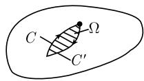

# 《数学指南——实用数学手册》1.14.5 微分式的语言

本节属《数学指南——实用数学手册》1.14「复变函数」章，紧接 [[sources/10-数学指南实用数学手册--10-1133-特征的作用--113qzfn]] 之后的 1.14.4 积分一节（见 [[sources/10-数学指南实用数学手册--7-1144-积分--z052eq]]）。其主旨是：**用微分式（微分形式）的语言重述并统一 1.14.3 的柯西-黎曼定理与 1.14.4 的柯西-莫雷拉定理**，并由此引向德拉姆上同调论、复平面的辛几何与凯勒流形。

节首题词为歌德《浮士德》中的引文「因而，那就是秘密！」（Faust）。

## 核心设定

出发点是一次微分式

$$
\omega = f(z)\,\mathrm{d}z.
$$

利用 $z = x + \mathrm{i}y$ 与 $f(z) = u(x,y) + \mathrm{i}v(x,y)$ 的实虚部分解，脚注 1 给出等价的实变量写法：

$$
\omega = f(x,y)(\mathrm{d}x + \mathrm{i}\,\mathrm{d}y).
$$

文中还指出：像黎曼-罗赫定理这样较深刻的函数论结果需要 [[黎曼面]] 的概念，而微分式在其中「既自然又不可或缺」（参看文献 [212]）。

## 四个定理

### 定理 1（积分定义的一致性）

$$
\int_{C} f(z)\,\mathrm{d}z = \int_{C} \omega.
$$

这表明 1.14.4 中积分 $\int_C f\,\mathrm{d}z$ 的定义与微分式框架下得到的积分有完全相同的意义。

证明：

$$
\int_{C}\omega = \int_{C}(u+\mathrm{i}v)(\mathrm{d}x+\mathrm{i}\,\mathrm{d}y) = \int_{a}^{b}(u+\mathrm{i}v)(x'(t)+\mathrm{i}y'(t))\,\mathrm{d}t = \int_{a}^{b} f(z(t))z'(t)\,\mathrm{d}t.
$$

### 定理 2（微分式语言下的柯西-黎曼定理）

给定开集 $U$ 上两个 $C^1$ 型函数 $u, v: U \to \mathbb{R}$（复值函数 $f$ 的实部与虚部），下列陈述等价：

- (i) 在 $U$ 上 $\mathrm{d}\omega = 0$；
- (ii) $f$ 在 $U$ 上是全纯的。

这实际上是用微分式语言叙述的 1.14.3 中的柯西-黎曼定理（见 [[findings/柯西-黎曼主定理1453]]）。

证明：由 $\mathrm{d}u = u_x\mathrm{d}x + u_y\mathrm{d}y$、$\mathrm{d}v = v_x\mathrm{d}x + v_y\mathrm{d}y$ 得到

$$
\mathrm{d}\omega = (\mathrm{d}u + \mathrm{i}\,\mathrm{d}v)(\mathrm{d}x + \mathrm{i}\,\mathrm{d}y) = \{(u_{y} + v_{x}) + \mathrm{i}(v_{y} - u_{x})\}\,\mathrm{d}y \wedge \mathrm{d}x.
$$

因而 $\mathrm{d}\omega = 0$ 等价于柯西-黎曼微分方程

$$
u_{y} + v_{x} = 0, \quad v_{y} - u_{x} = 0.
$$

### 定理 3（微分式语言下的柯西-莫雷拉定理）

设在单连通域 $U$ 上有两个 $C^1$ 型函数 $u, v$，则下列陈述等价：

- (i) 在 $U$ 上 $\mathrm{d}\omega = 0$；
- (ii) $\int_{C}\omega$ 与 $U$ 中的积分路径 $C$ 无关。

这就是 1.14.4 的 [[柯西-莫雷拉定理]]（至多相差一个附加的正则性假设）。

证明概述 (i) $\Rightarrow$ (ii)：考虑图 1.174 描绘的情况，有 $\partial\Omega = C - C'$。若在 $U$ 上 $\mathrm{d}\omega = 0$，则由 [[斯托克斯定理]] 得到

$$
0 = \int_{\Omega}\mathrm{d}\omega = \int_{\partial\Omega}\omega = \int_{C}\omega - \int_{C'}\omega,
$$

这蕴涵着 $\int_{C}\omega = \int_{C'}\omega$，即 $U$ 中 $\omega$ 的积分与积分路径无关。

(ii) $\Rightarrow$ (i)：反之，若 $U$ 中 $\omega$ 的积分与路径无关，则对 $U$ 中其边界 $\partial\Omega$ 为封闭的 $C^1$ 类 [[若尔当曲线]] 的所有区域 $\Omega$ 有

$$
\int_{\partial\Omega}\omega = 0.
$$

由此以及 [[德拉姆定理]]（参看 [212]）即得：在 $U$ 上有 $\mathrm{d}\omega = 0$。

### 定理 4（同调路径上积分相等）

如果 $f: U \subseteq \mathbb{C} \to \mathbb{C}$ 在区域 $U$ 上是全纯的，则对 $U$ 中的 $C^1$ 同调路径 $C$ 和 $C'$ 有

$$
\int_{C}\omega = \int_{C'}\omega.
$$

证明：因为在 $U$ 上 $\mathrm{d}\omega = 0$，且 $C = C' + \partial\Omega$，所以

$$
\int_{C}\omega = \int_{C'}\omega + \int_{\partial\Omega}\omega = \int_{C'}\omega,
$$

因为由斯托克斯定理即得 $\int_{\partial\Omega}\omega = \int_{\Omega}\mathrm{d}\omega = 0$。

## 图 1.174

题中给出两幅插图（(a) 与 (b)）用于定理 3 的证明。两图均未能成功加载，内容不可辨识。

## 外延一：德拉姆上同调论

前述考虑构成了 [[德拉姆定理|德拉姆上同调论]] 的基础，它位于现代微分几何的中心地位，并且在现代物理的基本粒子理论中有重要应用。

## 外延二：复平面 $\mathbb{C}$ 的辛几何

空间 $\mathbb{R}^2$ 具有自然的 [[辛结构]]，它由体积形式

$$
\mu = \mathrm{d}x \wedge \mathrm{d}y
$$

给出。通过映射 $(x,y) \mapsto x + \mathrm{i}y$ 可把 $\mathbb{R}^2$ 等同于 $\mathbb{C}$，这样 $\mathbb{C}$ 也是辛空间。因为

$$
\mathrm{d}z \wedge \mathrm{d}\overline{z} = (\mathrm{d}x + \mathrm{i}\,\mathrm{d}y) \wedge (\mathrm{d}x - \mathrm{i}\,\mathrm{d}y) = -2\mathrm{i}\,\mathrm{d}x \wedge \mathrm{d}y,
$$

$$
\mu = \frac{\mathrm{i}}{2}\,\mathrm{d}z \wedge \mathrm{d}\overline{z}.
$$

## 外延三：复平面 $\mathbb{C}$ 上的黎曼度量

$\mathbb{R}^2$ 上的经典欧几里得度量由

$$
g := \mathrm{d}x \otimes \mathrm{d}x + \mathrm{d}y \otimes \mathrm{d}y
$$

给出。若 $u = (u_1, u_2)$ 是 $\mathbb{R}^2$ 中的点，则 $\mathrm{d}x(u) = u_1$、$\mathrm{d}y(u) = u_2$，由此得到

$$
g(u,v) = u_1 v_1 + u_2 v_2 \quad \text{对所有 } u, v \in \mathbb{R}^2,
$$

即 $\mathbb{R}^2$ 里的标准标量积。若把复平面 $\mathbb{C}$ 看成 $\mathbb{R}^2$，则 $\mathbb{C}$ 也变成黎曼流形，由 $z = x + \mathrm{i}y$ 与 $\overline{z} = x - \mathrm{i}y$ 得

$$
g = \frac{1}{2}(\mathrm{d}z \otimes \mathrm{d}\overline{z} + \mathrm{d}\overline{z} \otimes \mathrm{d}z).
$$

## 外延四：作为凯勒流形的复平面 $\mathbb{C}$

空间 $\mathbb{R}^2$ 具有 [[殆复结构]]，由线性算子 $J: \mathbb{R}^2 \to \mathbb{R}^2$ 给出：

$$
J(x,y) := (-y, x), \quad \text{对所有 } (x,y) \in \mathbb{R}^2.
$$

若把 $(x,y)$ 等同于 $z = x + \mathrm{i}y$，则 $J$ 对应于映射 $z \mapsto \mathrm{i}z$（乘以复数 $\mathrm{i}$）。度量 $g$ 与殆复结构 $J$ 相容，即

$$
g(Ju, Jv) = g(u, v) \quad \text{对所有 } u, v \in \mathbb{R}^2.
$$

此外，定义 2 微分式

$$
\Phi(u,v) := g(u, Jv) \quad \text{对所有 } u, v \in \mathbb{R}^2,
$$

它称为 $g$ 的**基本形**。对任意 $u, v \in \mathbb{R}^2$ 有 $\Phi(u,v) = u_2 v_1 - u_1 v_2$，即

$$
\Phi = \mathrm{d}y \wedge \mathrm{d}x.
$$

由此即得 $\mathrm{d}\Phi = 0$。这样 $\mathbb{R}^2$ 变成了 [[凯勒流形]]。若把 $\mathbb{C}$ 看作 $\mathbb{R}^2$，则复平面 $\mathbb{C}$ 同样也变成凯勒流形。这种流形像弦的构形空间一样，在现代弦理论（又称弦论）中起着决定性的作用；该理论宣称的目标是用统一的理论（万物之理论）来解释所有四种基本力。

关于凯勒流形的一个重要定理是著名的 [[queries/丘成桐定理]]，他因此（及其他一些重要结果）于 1982 年获得了菲尔兹奖（参看 [212]）。

## 遗留问题

- 文献 [212] 无对应的 wiki 页面，书目信息未知（黎曼-罗赫定理、德拉姆定理、丘成桐定理均指向它）。
- 图 1.174 的两幅插图均无法辨识。

<!-- llm-wiki:embedded-images -->
## Embedded Images

### Document

<!-- llm-wiki:embedded-images -->
