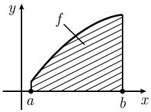
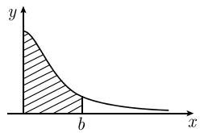
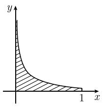
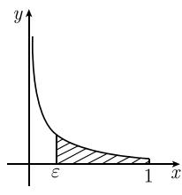
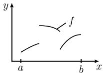
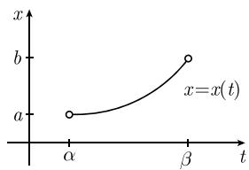
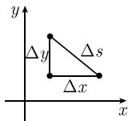

# 《数学指南——实用数学手册》1.6 单实变函数的积分

## 本节定位

本节是《数学指南——实用数学手册》第 1 章「单实变函数的微积分」中关于**积分**的部分，共 10 个小节（1.6.1–1.6.10）。它从「和的极限」这一直观图像出发，建立经典（黎曼）积分概念，给出微积分基本定理、原函数与不定积分，然后依次讨论分部积分、代换、无界区间上的积分、无界函数的积分、柯西主值，最后把积分应用于弧长与曲线质量。

本节末尾明确说明：本卷只考虑经典积分概念，现代测度论概念见文献 [212]；关于一元积分 $\int_a^b f(x)\,\mathrm{d}x$ 的论述可以立即推广到多变量积分（参看 1.7 节）。

## 1.6.1 基本思想

积分被定义为曲线 $f$ 下阴影部分区域的面积：先用矩形近似，再把矩形取细、取极限：

$$
\int_{a}^{b} f(x)\,\mathrm{d}x = \lim_{n \to \infty} \sum_{k=1}^{n} f(x_k) \Delta x. \tag{1.101}
$$

其中把紧区间 $[a,b]$ 等分为 $n$ 份，分割点为 $x_k = a + k\Delta x$，$k = 0,1,\dots,n$，且

$$
\Delta x := \frac{b-a}{n}.
$$

特别地 $x_0 = a$，$x_n = b$。脚注 1）指出宽为 $\Delta x$、高为 $f(x_k)$ 的矩形面积为 $f(x_k)\Delta x$，故该和就是图 1.52(b) 中各矩形面积之和。

牛顿与莱布尼茨发现的基本公式（微积分基本定理）：

$$
\int_{a}^{b} F'(x)\,\mathrm{d}x = F(b) - F(a). \tag{1.102}
$$

脚注 2）给出的形式动机是

$$
\sum \frac{\Delta F}{\Delta x}\Delta x = \sum \Delta F = F(b) - F(a),
$$

用莱布尼茨符号即得

$$
\int_{a}^{b} \frac{\mathrm{d}F}{\mathrm{d}x}\,\mathrm{d}x = \int_{a}^{b} \mathrm{d}F,\qquad
\int_{a}^{b} \mathrm{d}F = F(b) - F(a). \tag{1.103}
$$

(1.103) 的严格证明在一般测度论中给出，它对某一类不连续函数 $F$ 也成立（参看 [212]）。书中记

$$
F(x)\big|_{a}^{b} := F(b) - F(a).
$$

### 原函数与不定积分

令 $J$ 是开区间。$F: J \to \mathbb{R}$ 称为 $f$ 在 $J$ 上的一个**原函数**，如果

$$
F'(x) = f(x),\quad \text{对所有 } x \in J.
$$

**定理**：若 $F$ 是 $f$ 在 $J$ 上的一个原函数，则 $f$ 在 $J$ 上的所有原函数都有形式 $F + C$（$C$ 为任意实常数）。也可以写成

$$
\int f(x)\,\mathrm{d}x = F(x) + C,\quad \text{在 } J \text{ 上}, \tag{1.104}
$$

并称 (1.104) 右端所有原函数构成的集合为 $f$ 在 $J$ 上的**不定积分**。由 (1.102) 得

$$
\int_{a}^{b} f(x)\,\mathrm{d}x = F\big|_{a}^{b}. \tag{1.105}
$$

因此求积分被归结为求原函数。重要原函数表见 0.9.1（[[表091重要原函数表]]）。

### 书中给出的例

- 例 1：$F(x)=x^2$ 给出 $\int_a^b 2x\,\mathrm{d}x = x^2\big|_a^b = b^2 - a^2$。
- 例 2：$F(x)=\sin x$ 给出 $\int_a^b \cos x\,\mathrm{d}x = \sin x\big|_a^b = \sin b - \sin a$。
- 例 3：$(-\cos x)' = \sin x$ 给出 $\int \sin x\,\mathrm{d}x = -\cos x + C$，$\int_a^b \sin x\,\mathrm{d}x = \cos a - \cos b$。
- 例 4：$\alpha \neq 0$ 时由 $(x^{\alpha})' = \alpha x^{\alpha-1}$ 得 $\int \alpha x^{\alpha-1}\,\mathrm{d}x = x^{\alpha} + C$ 及 $\int_a^b \alpha x^{\alpha-1}\,\mathrm{d}x = b^{\alpha} - a^{\alpha}$。

### 不连续函数的积分

可微函数总是连续的，只有充分光滑的函数才可微；但可以对一大类不连续函数积分。

例 5：$f(x) = 1\ (x<2)$，$f(x) = 3\ (x>2)$，$f(2)=c$。由面积的可加性（图 1.53）要求

$$
\int_{0}^{4} f\,\mathrm{d}x = \int_{0}^{2} f\,\mathrm{d}x + \int_{2}^{4} f\,\mathrm{d}x = 2\cdot 1 + 2\cdot 3 = 8.
$$

$f$ 在 $x=2$ 处的不连续性是无关紧要的：当 $f$ 在有限多个点的值改变时，曲线下区域的面积不变。（原文此处积分号下漏写被积函数 $f$，见 [[queries/171节公式与文字转写疑误汇总]]。）

### 无界区间与无界函数的积分（直观引入）

$$
\int_{0}^{\infty} \frac{\mathrm{d}x}{1+x^{2}} = \lim_{b \to +\infty} \int_{0}^{b} \frac{\mathrm{d}x}{1+x^{2}} = \frac{\pi}{2},
$$

计算中用到 $\int_0^b \frac{\mathrm{d}x}{1+x^2} = \arctan x\big|_0^b = \arctan b$。

$$
\int_{0}^{1} \frac{\mathrm{d}x}{\sqrt{x}} = \lim_{\varepsilon \to +0} \int_{\varepsilon}^{1} \frac{\mathrm{d}x}{\sqrt{x}} = 2,
$$

计算中用到 $\int_\varepsilon^1 \frac{\mathrm{d}x}{\sqrt{x}} = 2\sqrt{x}\big|_\varepsilon^1 = 2 - 2\sqrt{\varepsilon}$。（原文此处写作 $\mathrm{d}/\sqrt{x}$，被积函数缺失。）

### 测度与积分

阿基米德（Archimedes，前 287—前 212）用正 96 边形近似一个圆，得到 $2\pi$ 的近似值 6.28。此后许多数学家和物理学家从事计算集合的「测度」（曲线长度、曲面面积、体积、质量、电量等）。20 世纪初，法国数学家 H. 勒贝格（Henri Lebesgue，1875—1941）发展了一般测度论，允许把测度分配到给定集合的子集并以令人满意的方式计算，特别是可以在该理论中形成极限，从而完全解决了定义和计算测度的古老问题。勒贝格测度的概念包含所谓的勒贝格积分，经典黎曼积分 (1.101) 是勒贝格积分的特殊情形。

由于教学原因，经典积分仍是高中和大学教学大纲的一部分；但在现代数学和物理学中确实需要勒贝格积分一般概念带来的广泛应用（例如概率论、变分法、偏微分方程理论、量子理论等）。书中给出的现代勒贝格积分优越性的理由是基本极限公式：

$$
\lim_{n \to \infty} \int_{a}^{b} f_n(x)\,\mathrm{d}x = \int_{a}^{b} \lim_{n \to \infty} f_n(x)\,\mathrm{d}x. \tag{1.106}
$$

对于勒贝格积分，它在很弱的假设下成立；但对经典积分并不成立。书中指出可能出现这样的情况：(1.106) 左端的积分作为经典积分也存在，而极限函数 $\lim_{n\to\infty} f_n$ 高度不连续，以致 (1.106) 的右端在经典积分意义下不存在，只在勒贝格积分意义下存在。

## 1.6.2 积分的存在性

令 $-\infty < a < b < \infty$。

**第一存在性定理**：若 $f: [a,b] \to \mathbb{C}$ 连续，则 $\int_a^b f(x)\,\mathrm{d}x$ 在 (1.101) 意义下存在。

**一维零测度集合**：$\mathbb{R}$ 的子集 $M$ 有一维勒贝格零测度，如果对每个 $\varepsilon > 0$，存在由区间 $J_1, J_2, \cdots$ 构成的至多可数集覆盖 $M$，且总长度小于 $\varepsilon$。例 1：由有限个或可数个实数构成的每个集合都有勒贝格零测度；由于 $\mathbb{Q}$ 可数，故 $\mathbb{Q}$ 有勒贝格零测度。

**几乎处处连续**：$f: [a,b] \to \mathbb{R}$ 几乎处处连续，如果存在勒贝格零测度集合 $M$，使 $f$ 在所有 $x \in [a,b] - M$ 处连续。例 2：图 1.56 中的函数只含有限个不连续点，因此几乎处处连续。

**第二存在性定理**：若 $f: [a,b] \to \mathbb{R}$ 有界且几乎处处连续，则 (1.101) 意义下的 $\int_a^b f(x)\,\mathrm{d}x$ 存在。脚注 1）解释「$f$ 有界」指对所有 $x \in [a,b]$ 有 $|f(x)| \leqslant$ 某一常数。

**复值函数**：$f: [a,b] \to \mathbb{C}$ 可写成

$$
f(x) = \varphi(x) + \mathrm{i}\psi(x),
$$

其中 $\varphi, \psi$ 分别为实部与虚部。$\varphi$ 与 $\psi$ 都在 $x$ 点连续时 $f$ 在 $x$ 点连续。上述两个存在性定理在同样条件下对复值函数仍成立；此时 $f$ 有界且几乎处处连续当且仅当 $\varphi$ 与 $\psi$ 都满足这些性质。积分满足

$$
\int_{a}^{b} f(x)\,\mathrm{d}x = \int_{a}^{b} \varphi(x)\,\mathrm{d}x + \mathrm{i}\int_{a}^{b} \psi(x)\,\mathrm{d}x.
$$

### 积分的性质

令 $-\infty < a < c < b < \infty$，设 $f, g: [a,b] \to \mathbb{C}$ 有界且几乎处处连续，$\alpha, \beta \in \mathbb{C}$。

(i) 线性性

$$
\int_{a}^{b} (\alpha f(x) + \beta g(x))\,\mathrm{d}x = \alpha \int_{a}^{b} f(x)\,\mathrm{d}x + \beta \int_{a}^{b} g(x)\,\mathrm{d}x.
$$

(ii) 三角不等式

$$
\left| \int_{a}^{b} f(x)\,\mathrm{d}x \right| \leqslant \int_{a}^{b} |f(x)|\,\mathrm{d}x \leqslant (b-a)\sup_{a \leqslant x \leqslant b}|f(x)|.
$$

(iii) 加法法则

$$
\int_{a}^{c} f(x)\,\mathrm{d}x + \int_{c}^{b} f(x)\,\mathrm{d}x = \int_{a}^{b} f(x)\,\mathrm{d}x.
$$

(iv) 不变性原理：如果在勒贝格测度为零的集合 $M$ 上改变函数 $f$ 的值，积分 $\int_a^b f(x)\,\mathrm{d}x$ 不变。

(v) 单调性：若 $f, g$ 实值且对所有 $x \in [a,b]$ 有 $f(x) \leqslant g(x)$，则 $\int_a^b f \leqslant \int_a^b g$。

### 积分中值定理

若 $f: [a,b] \to \mathbb{R}$ 连续，$g: [a,b] \to \mathbb{R}$ 非负有界且处处连续，则对某个适当的 $\xi \in [a,b]$ 有

$$
\int_{a}^{b} f(x)g(x)\,\mathrm{d}x = f(\xi)\int_{a}^{b} g(x)\,\mathrm{d}x.
$$

例 3：特殊情形 $g(x) \equiv 1$ 给出 $\int_a^b f(x)\,\mathrm{d}x = f(\xi)(b-a)$。

例 4：若 $f$ 几乎处处连续且 $m \leqslant f(x) \leqslant M$，则

$$
(b-a)m \leqslant \int_{a}^{b} f(x)\,\mathrm{d}x \leqslant (b-a)M.
$$

## 1.6.3 微积分基本定理

**基本定理**：令 $-\infty < a < b < \infty$。对于 $C^1$ 类函数 $F: [a,b] \to \mathbb{C}$（脚注 1）），

$$
\int_{a}^{b} F'(x)\,\mathrm{d}x = F(b) - F(a).
$$

例：由 $(\mathrm{e}^{\alpha x})' = \alpha \mathrm{e}^{\alpha x}$（$\alpha$ 为复数）得

$$
\alpha \int_{a}^{b} \mathrm{e}^{\alpha x}\,\mathrm{d}x = \mathrm{e}^{\alpha x}\big|_{a}^{b} = \mathrm{e}^{\alpha b} - \mathrm{e}^{\alpha a}.
$$

### 关于积分上限的微分与原函数的存在性

令

$$
F_0(x) := \int_{a}^{x} f(t)\,\mathrm{d}t,\quad a \leqslant x \leqslant b,
$$

则

$$
F'(x) = f(x),\quad \text{对所有 } x \in [a,b], \tag{1.107}
$$

其中 $F = F_0$。由此：

(i) $F_0: [a,b] \to \mathbb{C}$ 是微分方程 (1.107) 在 $C^1$ 函数类中满足 $F_0(a) = 0$ 的唯一解；特别地 $F_0$ 是 $f$ 在区间 $]a,b[$ 上的一个原函数。

(ii) (1.107) 的所有 $C^1$ 类解 $F: [a,b] \to \mathbb{C}$ 都由 $F_0(x) + C$ 给出，$C$ 为任意复常数。

(iii) 若 $F: [a,b] \to \mathbb{R}$ 是 (1.107) 的一个 $C^1$ 类解，则 $\int_a^b f(x)\,\mathrm{d}x = F(b) - F(a)$。

## 1.6.4 分部积分法

**定理**：$-\infty < a < b < \infty$，对 $C^1$ 类函数 $u, v: [a,b] \to \mathbb{C}$，

$$
\int_{a}^{b} u'v\,\mathrm{d}x = uv\big|_{a}^{b} - \int_{a}^{b} uv'\,\mathrm{d}x. \tag{1.108}
$$

**证明**：由微积分基本定理及微分乘法法则，

$$
\int_{a}^{b} (u'v + uv')\,\mathrm{d}x = \int_{a}^{b} (uv)'\,\mathrm{d}x = uv\big|_{a}^{b}. \quad \square
$$

- 例 1：$A := \int_1^2 2x\ln x\,\mathrm{d}x$，取 $u' = 2x,\ v = \ln x$（$u = x^2,\ v' = 1/x$），得 $A = x^2\ln x\big|_1^2 - \int_1^2 x\,\mathrm{d}x = 4\ln 2 - \frac{3}{2}$。
- 例 2：$A = \int_a^b x\sin x\,\mathrm{d}x$，取 $u' = \sin x,\ v = x$（$u = -\cos x,\ v' = 1$），得 $A = -x\cos x\big|_a^b + \int_a^b \cos x\,\mathrm{d}x = -x\cos x + \sin x\big|_a^b$。
- 例 3（叠分部积分）：$B = \int_a^b \frac{1}{2}x^2 \cos x\,\mathrm{d}x$，取 $u' = \cos x,\ v = \frac{1}{2}x^2$（$u = \sin x,\ v' = x$），得 $B = \frac{1}{2}x^2\sin x\big|_a^b - \int_a^b x\sin x\,\mathrm{d}x$，后一积分可按例 2 再次分部积分。

**不定积分形式**：在与 (1.108) 相同的假设下，

$$
\int u'v\,\mathrm{d}x = uv - \int uv'\,\mathrm{d}x,\quad \text{在 } ]a,b[ \text{ 上}.
$$

## 1.6.5 代换

**基本思想**：通过代换 $x = x(t)$ 变换积分 $\int_a^b f(x)\,\mathrm{d}x$。利用莱布尼茨微积分，形式规则 $\mathrm{d}x = \frac{\mathrm{d}x}{\mathrm{d}t}\mathrm{d}t$ 导致

$$
\int_{a}^{b} f(x)\,\mathrm{d}x = \int_{\alpha}^{\beta} f(x(t))\frac{\mathrm{d}x}{\mathrm{d}t}(t)\,\mathrm{d}t. \tag{1.109}
$$

**定理**：在下列假设下 (1.109) 成立：

(a) $f: [a,b] \to \mathbb{C}$ 有界且几乎处处连续；

(b) $C^1$ 类函数 $x: [\alpha,\beta] \to \mathbb{R}$ 满足（脚注 1））

$$
x'(t) > 0,\quad \text{对所有 } t \in ]\alpha,\beta[, \tag{1.110}
$$

并且 $x(\alpha) = a$，$x(\beta) = b$。

书中强调：重要条件 (1.110) 保证 $x = x(t)$ 在 $[\alpha,\beta]$ 上严格递增，从而保证反函数 $t = t(x)$ 唯一。没有假设条件 (1.110)，公式 (1.109) 将导致完全错误的结果。脚注 1）：如果对所有 $t \in ]\alpha,\beta[$ 有 $x'(t) < 0$，那么必须把 $x(t)$ 换成 $-x(t)$。

- 例 1：$A = \int_a^b \mathrm{e}^{2x}\,\mathrm{d}x$，令 $t = 2x$，则 $\alpha = 2a$、$\beta = 2b$，得 $A = \int_\alpha^\beta \frac{1}{2}\mathrm{e}^t\,\mathrm{d}t = \frac{\mathrm{e}^{2b} - \mathrm{e}^{2a}}{2}$。
- 例 2：$A = \int \mathrm{e}^{x^2} 2x\,\mathrm{d}x$，令 $t = x^2$，由 $\frac{\mathrm{d}t}{\mathrm{d}x} = 2x$ 得 $2x\,\mathrm{d}x = \mathrm{d}t$，于是 $A = \mathrm{e}^{x^2} + C$（在 $\mathbb{R}$ 上），检验 $(\mathrm{e}^{x^2})' = \mathrm{e}^{x^2}\cdot 2x$。
- 例 3：$B = \int \frac{\mathrm{d}x}{\sqrt{1-x^2}}$，令 $x = \sin t$，得 $B = \int \mathrm{d}t = t + C = \arcsin x + C$，在 $-1 < x < 1$ 上成立；推理中用到 $\cos t > 0$ 与 $\sqrt{1-\sin^2 t} = \cos t$。

**不定积分中的代换**：根据莱布尼茨记号，形式代换规则为

$$
\int f(x)\,\mathrm{d}x = \int f(x(t))\frac{\mathrm{d}x}{\mathrm{d}t}\,\mathrm{d}t. \tag{1.111}
$$

必须考虑两种情形：(i) 计算中不需要反函数；(ii) 计算中需要反函数。在非临界情况 (i) 总可以用 (1.111)；在情况 (ii) 只能使用 $x = x(t)$ 的反函数存在的那个区间。在不确定的情形，应该在算出 $\int f(x)\,\mathrm{d}x = F(x)$ 之后检验是否有 $F'(x) = f(x)$。

脚注 1）给出便于记忆的符号：

$$
\int \mathrm{e}^{x^2} 2x\,\mathrm{d}x = \int \mathrm{e}^{x^2}\,\mathrm{d}x^2 = \int \mathrm{e}^{t}\,\mathrm{d}t = \mathrm{e}^{t} + C = \mathrm{e}^{x^2} + C,
$$

熟练后可写更简短的形式 $\int \mathrm{e}^{x^2} 2x\,\mathrm{d}x = \int \mathrm{e}^{x^2}\,\mathrm{d}x^2 = \mathrm{e}^{x^2} + C$。

重要代换列表见 0.9.4（[[表094重要代换列表]]）。

## 1.6.6 无界区间上的积分

先计算有界区间上的积分，再令区间长度趋于无限求极限。脚注 1）指出：较早文献中术语「反常积分」表示这种情况，此词容易产生误导，因为这种积分也是勒贝格积分一般概念的特殊情形；对勒贝格积分而言，被积函数与区间是否有界是无关紧要的。

令 $a \in \mathbb{R}$，则

$$
\int_{a}^{\infty} f(x)\,\mathrm{d}x = \lim_{b \to +\infty} \int_{a}^{b} f(x)\,\mathrm{d}x, \tag{1.112}
$$

$$
\int_{-\infty}^{a} f(x)\,\mathrm{d}x = \lim_{b \to -\infty} \int_{b}^{a} f(x)\,\mathrm{d}x, \tag{1.113}
$$

$$
\int_{-\infty}^{+\infty} f(x)\,\mathrm{d}x = \int_{-\infty}^{a} f(x)\,\mathrm{d}x + \int_{a}^{\infty} f(x)\,\mathrm{d}x. \tag{1.114}
$$

**存在性判别准则**：设 $f: J \to \mathbb{C}$ 几乎处处连续并满足估计

$$
|f(x)| \leqslant \frac{\text{常数}}{(1 + |x|)^{\alpha}},\quad \text{对所有 } x \in J,
$$

其中常数 $\alpha > 1$。则

(i) 若 $J = [a,\infty[$（或 $J = ]-\infty, a]$），(1.112)（或 (1.113)）中的有限极限存在；

(ii) 若 $J = ]-\infty, +\infty[$，则对所有 $a \in \mathbb{R}$，(1.112) 与 (1.113) 中的有限极限都存在，且 (1.114) 右端的和与 $a$ 的选取无关。

例：

$$
\int_{0}^{\infty} \frac{\mathrm{d}x}{1+x^{2}} = \frac{\pi}{2},\quad
\int_{-\infty}^{0} \frac{\mathrm{d}x}{1+x^{2}} = \frac{\pi}{2},\quad
\int_{-\infty}^{+\infty} \frac{\mathrm{d}x}{1+x^{2}} = \pi.
$$

## 1.6.7 无界函数的积分

令 $-\infty < a < b < \infty$，起点是极限关系式

$$
\int_{a}^{b} f(x)\,\mathrm{d}x = \lim_{\varepsilon \to +0} \int_{a-\varepsilon}^{b} f(x)\,\mathrm{d}x. \tag{1.115}
$$

**存在性判别准则**：设 $f: ]a,b] \to \mathbb{C}$ 几乎处处连续并满足估计

$$
|f(x)| \leqslant \frac{\text{常数}}{|x-a|^{\alpha}},\quad \text{对所有 } x \in [a,b],
$$

其中常数 $\alpha < 1$，则 (1.115) 中的极限存在且有限。

例：令 $0 < \alpha < 1$，由 $\int_\varepsilon^1 \frac{\mathrm{d}x}{x^{\alpha}} = \frac{1}{1-\alpha}(1 - \varepsilon^{1-\alpha})$ 得 $\int_0^1 \frac{\mathrm{d}x}{x^{\alpha}} = \frac{1}{1-\alpha}$。

类似地

$$
\int_{a}^{b} f(x)\,\mathrm{d}x = \lim_{\varepsilon \to +0} \int_{a}^{b-\varepsilon} f(x)\,\mathrm{d}x. \tag{1.116}
$$

**存在性判别准则**：设 $f: [a,b[ \to \mathbb{C}$ 几乎处处连续并满足估计

$$
|f(x)| \leqslant \frac{\text{常数}}{|x-b|^{\alpha}},\quad \text{对所有 } x \in [a,b[,
$$

其中常数 $\alpha < 1$，则 (1.116) 中的极限存在且有限。

## 1.6.8 柯西主值

令 $-\infty < a < c < b < \infty$。公式

$$
\mathrm{PV}\int_{a}^{b} \frac{\mathrm{d}x}{x-c} = \lim_{\varepsilon \to +0}\left(\int_{a}^{c-\varepsilon} \frac{\mathrm{d}x}{x-c} + \int_{c+\varepsilon}^{b} \frac{\mathrm{d}x}{x-c}\right) \tag{1.117}
$$

定义了柯西主值。对足够小的 $\varepsilon > 0$，

$$
\int_{a}^{c-\varepsilon} \frac{\mathrm{d}x}{x-c} = \ln\varepsilon - \ln(c-a),\qquad
\int_{c+\varepsilon}^{b} \frac{\mathrm{d}x}{x-c} = \ln(b-c) - \ln\varepsilon,
$$

于是

$$
\mathrm{PV}\int_{a}^{b} \frac{\mathrm{d}x}{x-c} = \ln(b-c) - \ln(c-a) = \ln\frac{b-c}{c-a}.
$$

当 $\varepsilon \to +0$ 时 $\ln\varepsilon \to -\infty$；由于 (1.117) 中积分上下限的特定选择，$\ln\varepsilon$ 中的危险项互相抵消。书中强调：不论在经典积分还是勒贝格积分中，$\int_a^b \frac{\mathrm{d}x}{x-c}$ 都不存在；因此柯西主值是勒贝格积分概念的真正推广。

## 1.6.9 对弧长的应用

### 平面曲线的弧长

曲线

$$
x = x(t),\quad y = y(t),\quad a \leqslant t \leqslant b \tag{1.118}
$$

的弧长定义为积分

$$
s := \int_{a}^{b} \sqrt{x'(t)^2 + y'^2(t)^2}\,\mathrm{d}t \tag{1.119}
$$

的值。（原文 (1.119) 与 (1.120)、(1.122) 中若干平方/导数符号的排印有可疑之处，见 [[queries/171节公式与文字转写疑误汇总]]。）

**通常的动机**：按阿基米德（前 287—前 212）的例子，用开多边形逼近曲线（图 1.59(a)）。由毕达哥拉斯定理，多边形一条割线长为

$$
(\Delta s)^2 = (\Delta x)^2 + (\Delta y)^2,
$$

由此

$$
\frac{\Delta s}{\Delta t} = \sqrt{\left(\frac{\Delta x}{\Delta t}\right)^2 + \left(\frac{\Delta y}{\Delta t}\right)^2}. \tag{1.120}
$$

曲线弧长近似等于

$$
s = \sum \Delta s = \sum \frac{\Delta s}{\Delta t}\Delta t. \tag{1.121}
$$

令每个割线的长度趋于零，对 (1.121) 求极限，则积分表达式 (1.119) 就是 (1.121) 的连续形式。

**提炼后的动机**：假设曲线有弧长，用 $s(\tau)$ 表示 $t = a$ 与 $t = \tau$ 定义的点之间曲线的长度（图 1.60(b)）。当 $\Delta t \to 0$ 时由 (1.120) 得微分方程

$$
s(\tau) = \sqrt{x'(\tau)^2 + y'(\tau)^2},\quad a \leqslant \tau \leqslant b,\qquad s(a) = 0, \tag{1.122}
$$

由 (1.107) 知它有唯一解

$$
s(\tau) = \int_{a}^{\tau} \sqrt{x'(t)^2 + y'(t)^2}\,\mathrm{d}t.
$$

**例**：单位圆 $x = \cos t$，$y = \sin t$（$0 \leqslant t \leqslant 2\pi$）的弧长

$$
s = \int_{0}^{2\pi} \sqrt{\sin^2 t + \cos^2 t}\,\mathrm{d}t = \int_{0}^{2\pi} \mathrm{d}t = 2\pi.
$$

## 1.6.10 物理角度的标准推理

### 曲线的质量

令 $\rho = \rho(s)$ 为曲线 (1.118) 的密度，即其每单位长的质量。按定义，曲线上长度为 $\sigma$ 部分的质量 $m(\sigma)$ 由

$$
m(\sigma) = \int_{0}^{\sigma} \varrho(s)\,\mathrm{d}s \tag{1.123}
$$

给出。把该表达式与曲线的参数 $t$ 联系起来，对参数 $t = a$ 与 $t = \tau$ 所对应点之间那一段质量，

$$
m(s(\tau)) = \int_{0}^{\tau} \varrho(s(t))\frac{\mathrm{d}s}{\mathrm{d}t}\,\mathrm{d}t,
$$

这导致

$$
m(s(\tau)) = \int_{0}^{\tau} \varrho(s(t))\sqrt{x'(t)^2 + y'(t)^2}\,\mathrm{d}t. \tag{1.124}
$$

**通常的动机**：把曲线分割成小段，每段质量 $\Delta m$、弧长 $\Delta s$（图 1.60(a)），近似地有

$$
m = \sum \Delta m = \sum \frac{\Delta m}{\Delta s}\Delta s = \sum \varrho \Delta s = \sum \varrho \frac{\Delta s}{\Delta t}\Delta t. \tag{1.125}
$$

让曲线段越来越小，当 $\Delta t \to 0$ 时 (1.124) 就是 (1.125) 的连续形式。书中特别指出：**从牛顿的时代开始，人们在物理学中就进行了这类考虑，用它来推导以积分形式定义的物理量的公式。**

**提炼后的动机**：从质量函数 $m = m(s)$ 出发并假设 (1.123) 成立且 $\varrho$ 连续。(1.123) 在 $\sigma = s$ 处的微分为 $m'(s) = \varrho(s)$（参看 (1.107)），因此 $\varrho$ 是质量关于弧长的导数，故称**线密度**。借助积分的代换法则，由 (1.123) 即得 (1.124)。

## 交叉引用与后续

- 产生或使用的核心概念：[[黎曼积分]]、[[微积分基本定理]]、[[原函数]]、[[不定积分]]、[[勒贝格积分]]、[[勒贝格零测度]]、[[几乎处处连续]]、[[复值函数的积分]]、[[积分中值定理]]、[[积分的性质]]、[[分部积分法]]、[[积分代换法则]]、[[无界区间上的积分]]、[[无界函数的积分]]、[[柯西主值]]、[[弧长]]、[[线密度]]、[[反常积分]]。
- 人物：[[阿基米德]]、[[牛顿]]、[[柯西]]、[[勒贝格]]、[[莱布尼茨]]。
- 被引用但本节未展开的表格：0.9.1（[[表091重要原函数表]]）、0.9.4（[[表094重要代换列表]]）。
- 后续章节：1.7 节「多变量积分」（本节末明确指出本节论述可立即推广）。
- 严格化文献：[212]（现代测度论的概念与 (1.103) 的严格证明）。

## 图像材料

本节图片位于 `media/10-数学指南实用数学手册--11-16-单实变函数的积分--1exp43p/`，编号 001–014，对应图 1.52–图 1.60。其中图 1.52(b)（矩形近似，编号 002）、图 1.54(b)（曲线下阴影面积，编号 005）、图 1.55(a)（$\varepsilon$ 到 1 的阴影区域，编号 007）、图 1.57（$x = x(t)$ 在 $(\alpha,\beta)$ 上严格递增，编号 009）、图 1.58（$x = \sin t$，编号 010）、图 1.59(a)（折线逼近曲线，编号 011）可辨识；其余多张未能加载或内容不可读。

## 待确认事项

- 本节多处以「$a$」作为积分下限占位（例如 $\int_a^2 2x\ln x\,\mathrm{d}x$、$\int_a^b x\sin x\,\mathrm{d}x$、$\int_a^b \frac{1}{2}x^2\cos x\,\mathrm{d}x$、$\int_a^b \mathrm{e}^{2x}\,\mathrm{d}x$），疑为转写遗留。
- 图 1.52 的图注写作「曲面面积的近似」，与正文「曲线下面积」不符。
- 详见 [[queries/171节公式与文字转写疑误汇总]]、[[queries/16节例5积分表达式缺失被积函数]] 等条目。

<!-- llm-wiki:embedded-images -->
## Embedded Images

### Document

<!-- llm-wiki:embedded-images -->

## Related
- [[sources/10-数学指南实用数学手册--8-114-复变函数--r0uuej]]
