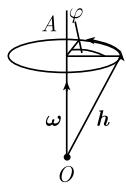

# 《数学指南——实用数学手册》1.9.3 在形变上的应用

## 概述

本节是《数学指南——实用数学手册》1.9 节「向量分析与物理学领域」的第三个子节，承接 [[速度向量|1.9.1 速度与加速度]] 与 [[梯度]]、[[散度]]、[[旋度|1.9.2 梯度、散度、旋度]]，把算子 $\operatorname{div}\boldsymbol{u}$ 与 $\operatorname{curl}\boldsymbol{u}$ 应用于连续介质（弹性体）的**形变**描述。

篇幅短，但引入了 [[形变]]、[[无穷小旋转]]、[[伸缩]]、[[伸缩主轴]]、[[形变率张量]] 等新概念，并给出一个核心定理：**旋度描述向量场的旋转，散度描述体积的相对改变**。

本节未出现任何具名人物、机构或软件工具；与 1.9.1 节（出现「牛顿」）、1.9.2 节（涉及「麦克斯韦」「嘉当」）不同，本节纯粹是数学/物理推导。

## 核心公式

### 形变映射（方框公式）

$$
\boxed{\boldsymbol{y}(\boldsymbol{r}) = \boldsymbol{r} + \boldsymbol{u}(\boldsymbol{r}).}
$$

这里 $\boldsymbol{r} := \overrightarrow{OP}$，并且 $\boldsymbol{y}(\boldsymbol{r})$ 是起点在 $O$ 处的向量（图 1.98）。为简化关系，用向量 $\boldsymbol{r}$ 的终点 $P$ 表示 $\boldsymbol{r}$。在形变下，向量 $\boldsymbol{r}$ 的终点被变换为 $\boldsymbol{y}(\boldsymbol{r}) = \boldsymbol{r} + \boldsymbol{u}(\boldsymbol{r})$ 的终点。

### 旋转向量（方框公式）

$$
\boxed{\boldsymbol{\omega} := \frac{1}{2} \mathbf{curl}\,\boldsymbol{u}(P).}
$$

用 $A$ 表示过点 $O$、以 $\boldsymbol{\omega}$ 为方向的直线。

### 形变分解式（方框公式）

$$
\boxed{\boldsymbol{y}(\boldsymbol{r} + \boldsymbol{h}) = \boldsymbol{r} + \boldsymbol{u}(\boldsymbol{r}) + (\boldsymbol{h} + \boldsymbol{\omega} \times \boldsymbol{h}) + D(\boldsymbol{r})\boldsymbol{h} + \boldsymbol{R},}
$$

其中当 $|\boldsymbol{h}| \to 0$ 时，余项 $|\boldsymbol{R}| = o(|\boldsymbol{h}|)$。

### 无穷小旋转公式

令 $T(\boldsymbol{\omega})\boldsymbol{h}$ 表示起点在 $O$ 的向量，它是 $\boldsymbol{h}$ 关于轴 $A$ 的旋转，转了 $\varphi := |\boldsymbol{\omega}|$ 角（图 1.99）。则有

$$
T(\boldsymbol{\omega})\boldsymbol{h} = \boldsymbol{h} + \boldsymbol{\omega} \times \boldsymbol{h} + o(\varphi), \quad \text{当 } \varphi \to 0 \text{ 时}.
$$

鉴于此，用乘积 $\boldsymbol{\omega} \times \boldsymbol{h}$ 表示 $\boldsymbol{h}$ 的无穷小旋转。

### 伸缩与主轴

有起点在 $P$ 处的三个两两垂直的单位向量 $\boldsymbol{b}_1, \boldsymbol{b}_2, \boldsymbol{b}_3$，并且存在三个正实数 $\lambda_1, \lambda_2, \lambda_3$，使得

$$
D(\boldsymbol{r})\boldsymbol{h} = \sum_{j=1}^{3} \lambda_j (\boldsymbol{h}\boldsymbol{b}_j)\boldsymbol{b}_j.
$$

因此有 $D(\boldsymbol{r})\boldsymbol{b}_j = \lambda_j\boldsymbol{b}_j,\; j = 1, 2, 3$。称 $\boldsymbol{b}_j$ 为伸缩于点 $P$ 处的**主轴**。

### 形变率张量分量

若考虑笛卡儿坐标系，则 $\lambda_1, \lambda_2, \lambda_3$ 是矩阵 $(d_{jk})$ 的三个特征值，其中

$$
d_{jk} := \frac{1}{2}\left(\frac{\partial u_k}{\partial x_j} + \frac{\partial u_j}{\partial x_k}\right).
$$

这里 $\boldsymbol{u} = u_1\boldsymbol{i} + u_2\boldsymbol{j} + u_3\boldsymbol{k}$。矩阵 $(d_{jk})$ 的列是主轴 $\boldsymbol{b}_1, \boldsymbol{b}_2, \boldsymbol{b}_3$ 的坐标。

## 核心定理（原文）

**定理** 令 $\boldsymbol{u} = \boldsymbol{u}(P)$ 为区域 $D \subset \mathbb{R}^3$ 中的 $C^1$ 向量场。则有：

> (i) 在点 $P$ 处体积的小增量关于轴 $A$ 以一级近似旋转 $|\boldsymbol{\omega}|$ 度。此外，它的旋转方向是主轴，且存在一个平移。
>
> (ii) 如果 $\boldsymbol{u}$ 的坐标的一阶偏导数足够小，则 $\operatorname{div}\boldsymbol{u}(P)$ 的一级近似等于在点 $P$ 处的体积小增量的**相对改变**。

**原文解释**：这就解释了向量场的「旋度」与「散度」：旋度描述了向量场的旋转，而散度则可以描述化学反应过程中化学物质质量的改变（参看 1.9.7）。

## 应用出处

在流体动力学和弹性力学方程上的应用见文献 [212]。该文献在本手册中已多次出现（1.7.7、1.7.8、1.9.2 等），本节为又一次出现，仍未核实。

## 证据强度

- 本节属于**教材综述性陈述**：定理 (i)(ii) 与分解式**均未给出证明或出处**，仅以一级近似（线性化）语言陈述。
- 数学推导本身自洽：$\boldsymbol{\omega} \times \boldsymbol{h}$ 对应速度梯度的反对称部分，$D(\boldsymbol{r})\boldsymbol{h}$ 对应对称部分，与标准连续介质力学/形变率张量理论一致。
- 证据强度：**中等偏弱**——结论正确，但本源为断言式表述，无证明、无引用支撑论点。

## 与既有 wiki 的联系

- 紧密承接 [[梯度]]、[[散度]]、[[旋度]]、[[向量场|1.9.2 节]]，把这两个算子的**物理诠释**从几何定义推进到形变运动学。
- 与 [[速度向量|1.9.1 节]] 并列：1.9.1 讲向量函数的运动学（速度、加速度、轨道），本节讲场的形变学，同属「向量分析物理应用」脉络。
- 数学前提可上溯至 [[findings/梯度散度旋度与向量梯度的笛卡儿坐标定义式]]；本节新增「旋度 = 旋转、散度 = 体积相对变化」的物理解释。
- 前向引用 1.9.7（化学反应中质量变化），该子节尚未入库。

## 相关图片

图 1.98：形变映射 $\boldsymbol{y}(\boldsymbol{r}) = \boldsymbol{r} + \boldsymbol{u}(\boldsymbol{r})$ 示意（图像内容无法直接辨识，见 [[queries/193节图198与图199内容无法辨识]]）。

图 1.99：无穷小旋转示意——点 $O$ 处沿竖直方向标注 $\boldsymbol{\omega}$，斜线标注 $\boldsymbol{h}$，椭圆表示旋转圆周，标有点 $A$ 与角 $\varphi$，弧箭头指示旋转方向。

<!-- llm-wiki:embedded-images -->
## Embedded Images

### Document

<!-- llm-wiki:embedded-images -->
