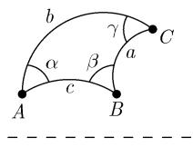

# 《数学指南——实用数学手册》3.2.8 非欧双曲几何学

## 本节定位

3.2.8 节位于《数学指南——实用数学手册》3.2「初等几何学」序列之中，紧随 3.2.7「[[concepts/非欧椭圆几何学]]」之后。本节以**庞加莱上半平面模型**给出[[concepts/非欧双曲几何学]]的具体模型，陈述其中欧几里得平行公理失效的定理，定义角、距离与运动，给出双曲三角学的公式（含三种几何的公式对照表 3.2），最后指出其黎曼几何解释与几何光学背景中的物理解释。

正文中出现的定理与公式均以原文记号为准；本节所引文献编号为 [212]（黎曼几何），并指向 5.1.2 节的物理解释，二者在本来源中均未展开。

## 庞加莱模型与双曲平面

原文选取一个笛卡儿坐标系并考虑开的上半平面

$$
\mathcal{H} = \mathcal{H}_{\mathrm{hyp}} := \{(x, y) \in \mathbb{R}^{2} \mid y > 0\},
$$

称之为**双曲平面**。约定如下：

1. 「点」为上半平面中经典的点。
2. 「线」为上半平面中那样的半圆，其中心在 $x$ 轴上（图 3.27）。

## 定理：平行公理失效（图 3.28）

1. 恰好存在通过 $\mathcal{H}$ 中两个点 $A$ 和 $B$ 的一条直线。
2. 若 $l$ 是一条直线，则通过 $l$ 外面的每个其他点 $P$ 的有无穷多条与 $l$ 不相交的直线 $p$，即存在无穷多条通过点 $P$ 的平行于 $l$ 的直线。

**在双曲几何中欧几里得平行公理不成立。**

## 角与距离

**角**：两条直线的夹「角」等于对相应圆弧间的角（图 3.28(b)）。

**距离**：在双曲平面 $\mathcal{H}$ 中一条曲线 $y = y(x),\ a \leqslant x \leqslant b$ 的长由积分

$$
L = \int_{a}^{b} \frac{\sqrt{1 + y^{\prime}(x)^{2}}}{y(x)} \mathrm{d}x
$$

给出。对于这个距离，直线是最短路径（测地线）。

## 例 1：无穷远处的直线

图 3.28(a) 中 $P$ 和 $Q$ 间距离为无穷大。因此称图 3.28(a) 中的 $x$ 轴为在双曲平面的**无穷远处的直线**。

## 双曲三角学与平移原理

双曲三角学是一门在双曲平面中的三角形计算的学科。双曲几何的所有公式都可以从球面三角学中公式经应用下述**平移原理**简练地导出：

> 在球面三角学的所有公式中将半径换成 $\mathrm{i}R$（其中的 $\mathrm{i}$ 是 $\mathrm{i}^{2} = -1$ 的虚单位）并令 $R = 1$。

**例 2**：由球面三角的对边的余弦定律

$$
\cos \frac{c}{R} = \cos \frac{a}{R} \cos \frac{b}{R} + \sin \frac{a}{R} \sin \frac{b}{R} \cos \gamma,
$$

将其中 $R$ 换作 $\mathrm{i}R$ 得到了关系式 $^{1)}$

$$
\cosh \frac{c}{R} = \cosh \frac{a}{R} \cosh \frac{b}{R} - \sinh \frac{a}{R} \sinh \frac{b}{R} \cos \gamma .
$$

对于 $R = 1$，便得到了双曲几何中边的余弦定律

$$
\cosh c = \cosh a \cosh b - \sinh a \sinh b \cos \gamma .
$$

若 $\gamma$ 为直角，则 $\cos\gamma = 0$，便得到了双曲几何的毕达哥拉斯定理

$$
\cosh c = \cosh a \cosh b .
$$

更重要的一些公式可在表 3.2 中找到。椭圆几何中的公式对应了球面三角学中在半径 $R = 1$ 的球面上的公式。更多的公式可经由循环置换得到：

$$
a \to b \to c \to a \quad \text{和} \quad \alpha \to \beta \to \gamma \to \alpha .
$$

原文在关系式处标注的脚注标记 1) 在本节正文中没有对应的脚注文本（见 [[queries/328节脚注标记1未落地]]）。

## 表 3.2 各种几何学中的公式（原文照录）

| | 欧氏几何 | 椭圆几何 | 双曲几何 |
|---|---|---|---|
| 三角形的和角公式（$A$ 为面积） | $\alpha + \beta + \gamma = \pi$ | $\alpha + \beta + \gamma = \pi + A$ | $\alpha + \beta + \gamma = \pi - A$ |
| 半径 $r$ 的圆面积 | $\pi r^{2}$ | $2\pi (1 - \cos r)$ | $2\pi (\cosh r - 1)$ |
| 半径 $r$ 的圆的周长 | $2\pi r$ | $2\pi \sin r$ | $2\pi \sinh r$ |
| 毕达哥拉斯定理 | $c^{2} = a^{2} + b^{2}$ | $\cos c = \cos a \cos b$ | $\cosh c = \cosh a \cosh b$ |
| 余弦定律 | $c^{2} = a^{2} + b^{2} - 2ab \cos \gamma$ | $\cos c = \cos a \cos b + \sin a \sin b \cos \gamma$ | $\cosh c = \cosh a \cosh b - \sinh a \sinh b \cos \gamma$ |
| 正弦定律 | $\dfrac{\sin \alpha}{\sin \beta} = \dfrac{a}{b}$ | $\dfrac{\sin \alpha}{\sin \beta} = \dfrac{\sin a}{\sin b}$ | $\dfrac{\sin \alpha}{\sin \beta} = \dfrac{\sinh a}{\sinh b}$ |
| 高斯曲率 | $K = 0$ | $K = 1$ | $K = -1$ |

## 运动

令 $z = x + \mathrm{i}y$ 和 $z' = x' + \mathrm{i}y'$。双曲几何的「运动」是特殊的默比乌斯变换

$$
z' = \frac{\alpha z + \beta}{\gamma z + \delta},
$$

其中 $\alpha, \beta, \gamma$ 和 $\delta$ 为实数并满足 $\alpha \delta - \beta \gamma > 0$。所有这样的变换的集合构成一个群，称为**双曲平面的运动群**。

1. $\mathcal{H}$ 的直线在双曲运动下映成了另一条直线。
2. 双曲运动是保角和保距的变换。

根据克莱因的埃尔兰根纲领，双曲几何的性质就是那些在双曲运动群下保持不变的性质。

## 与希尔伯特公理体系的关系

> 定理：上面所定义的双曲几何满足除了欧几里得平行公理外的所有希尔伯特公理。

## 黎曼几何与物理解释

双曲几何是具度量

$$
\mathrm{d}s^{2} = \frac{\mathrm{d}x^{2} + \mathrm{d}y^{2}}{y^{2}}, \quad y > 0
$$

的黎曼几何，且具有（负）常值高斯曲率 $K = -1$（参看 [212]）。

在几何光学背景中的对庞加莱模型的简单解释可在 5.1.2 中找到。

## 图像清单

- 图 3.27：上半平面中中心在 $x$ 轴上的半圆作为「直线」的示意。
- 图 3.28(a)：「直线」——含半圆弧 $p$ 与 $l$、点 $P$、$A$、$B$，以及位于虚线（$x$ 轴）上的点 $Q$。
- 图 3.28(b)：「角」——两段圆弧间的夹角示意（图像内容未能核实）。

## 相关页面

- [[concepts/非欧双曲几何学]]、[[concepts/庞加莱模型]]、[[concepts/双曲距离]]、[[concepts/无穷远处的直线]]
- [[concepts/双曲三角学]]、[[concepts/平移原理]]、[[concepts/双曲余弦定律]]、[[concepts/双曲毕达哥拉斯定理]]、[[concepts/双曲正弦定律]]
- [[concepts/双曲运动群]]、[[concepts/欧几里得平行公理]]、[[concepts/希尔伯特公理体系]]、[[concepts/埃尔兰根纲领]]、[[concepts/测地线]]
- [[entities/庞加莱]]、[[entities/默比乌斯]]、[[entities/黎曼]]、[[entities/克莱因]]
- 对照来源：[[sources/10-数学指南实用数学手册--11-327-非欧椭圆几何学--11rh5uy]]、[[sources/10-数学指南实用数学手册--12-326-欧几里得平行公理--13vdhop]]

<!-- llm-wiki:embedded-images -->
## Embedded Images

### Document

<!-- llm-wiki:embedded-images -->
