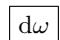

# 《数学指南——实用数学手册》3.9.4 闵可夫斯基几何

## 概述

本节是 3.9「现代物理的几何」下的第 4 小节，用 [[伪酉几何]]（伪正交空间）的框架把闵可夫斯基空间 $M_4$ 严格定义为**符号差为 $(3,1)$ 的四维实伪酉空间**。全节以「坐标无关」为组织原则：只使用与伪法正交基选取无关的概念，为下一小节 3.9.5 中对 [[狭义相对论]] 的几何化阐述（爱因斯坦相对性原理）作准备。

内容依次为：$M_4$ 的定义与 [[洛伦兹内积]] → [[洛伦兹群]]、$SO(3,1;M_4)$、正常洛伦兹群 $SO^+(3,1;M_4)$ 与 [[庞加莱群]] → [[类空类时类光向量]] 分类 → [[固有时与弧长]] → [[定向与体积形式]] → $M_4$ 上的多重线性代数（张量代数、外代数/格拉斯曼代数、内代数/[[克利福德代数]]、嘉当微分学、[[霍奇星算子]]），最后给出 [[霍奇δ算子]]、[[发散量算子Div]] 与 [[Alt算子]] 的定义。

## 关键定义与公式

闵可夫斯基几何的不定内积：

$$
\boxed {\boldsymbol {u} \boldsymbol {v} := B (\boldsymbol {u}, \boldsymbol {v}) \quad \text {对所有} \quad \boldsymbol {u}, \boldsymbol {v} \in M _ {4}.}\tag{3.81}
$$

**定义**：闵可夫斯基空间 $M_4$ 是个实伪酉（即伪正交）空间，其内积形式的**符号差为 (3,1)**。

伪法正交基的条件（脚注 1) 说明文献中亦使用对应于 $-uv$ 的内积约定，本节约定使欧几里得标准度量成为特殊情形）：

$$
\begin{array}{r} {e _ {1} ^ {2} = e _ {2} ^ {2} = e _ {3} ^ {2} = 1, \quad e _ {4} ^ {2} = - 1,} \\ {e _ {j} e _ {k} = 0, \quad \text {对} \quad j \neq k.} \end{array}\tag{3.82}
$$

向量分解与洛伦兹内积的分量表示：

$$
\boxed {\boldsymbol {u} = x _ {1} \boldsymbol {e} _ {1} + x _ {2} \boldsymbol {e} _ {2} + x _ {3} \boldsymbol {e} _ {3} + x _ {4} \boldsymbol {e} _ {4}}\tag{3.83}
$$

$$
\boxed {\boldsymbol {u} \boldsymbol {u} ^ {*} = x _ {1} x _ {1} ^ {*} + x _ {2} x _ {2} ^ {*} + x _ {3} x _ {3} ^ {*} - x _ {4} x _ {4} ^ {*} \quad \text {对所有} \quad u, u ^ {*} \in M _ {4}}.\tag{3.84}
$$

弧长（含类空与类时两种情形）：

$$
\frac {\mathrm{d} s}{\mathrm{d} \sigma} = \left\{ \begin{array}{l l} {{\sqrt {u ^ {\prime} (\sigma) ^ {2}},}} & {{\text {其中} u ^ {\prime} (\sigma) ^ {2} \geqslant 0,}} \\ {{\mathrm{i} \sqrt {- u ^ {\prime} (\sigma) ^ {2}},}} & {{\text {其中} u ^ {\prime} (\sigma) ^ {2} <   0.}} \end{array} \right.
$$

$$
\boxed {\mathrm{d} s ^ {2} = u ^ {\prime} (\sigma) ^ {2} \mathrm{d} \sigma^ {2}.}\tag{3.85}
$$

固有时（$c$ 为真空中的光速）：

$$
\boxed {\tau := \frac {1}{c} \int_ {\sigma_ {1}} ^ {\sigma} \sqrt {- u ^ {\prime} (\sigma) ^ {2}} \mathrm{d} \sigma}\tag{3.86}
$$

体积形式与定向：

$$
\boxed {\mu := \mathrm{d} x ^ {1} \wedge \mathrm{d} x ^ {2} \wedge \mathrm{d} x ^ {3} \wedge \mathrm{d} x ^ {4}.}\tag{3.87}
$$

$$
\boxed {\alpha := \operatorname{sgn} \mu (b _ {1}, b _ {2}, b _ {3}, b _ {4})}
$$

霍奇 $\delta$ 算子：

$$
\boxed {\delta \omega := - (- 1) ^ {(4 - p) p} * \mathrm{d} * \omega .}\tag{3.88}
$$

发散量算子与 Alt 算子：

$$
\boxed {\operatorname{Div} F := \partial_ {j} T ^ {j k} e _ {k},}
$$

$$
\operatorname{Alt} (\boldsymbol {B}) := B ^ {1} \left(\boldsymbol {e} _ {2} \wedge \boldsymbol {e} _ {3}\right) + B ^ {2} \left(\boldsymbol {e} _ {3} \wedge \boldsymbol {e} _ {1}\right) + B ^ {3} \left(\boldsymbol {e} _ {1} \wedge \boldsymbol {e} _ {2}\right).
$$

## 对称群

- **洛伦兹群** $O(3,1;M_4)$：线性算子 $A:M_4\to M_4$ 属于该群当且仅当它保持洛伦兹内积，正文写作 $(Au)(Au)=uv$（见 [[queries/394节洛伦兹群定义式AuAu讹误]]）。
- **$SO(3,1;M_4)$**：由所有满足 $\det A=1$ 的 $A\in O(3,1;M_4)$ 组成。
- **正常洛伦兹群** $SO^+(3,1;M_4)$：由满足 $\operatorname{sgn}(Au)e_4=\operatorname{sgn}u\,e_4$（对所有 $u\in M_4$）的 $A\in SO(3,1;M_4)$ 组成；此定义与伪法正交基的选取无关。
- **庞加莱群** $P(M_4)$：由所有变换 $u'=Au+a$（$A\in O(3,1;M_4)$，$a\in M_4$）组成，被称为「量子场论中最重要的群」。

$$SO(3,1;M_4)$$ 中元素保持定向不变，而 $SO^+(3,1,M_4)$ 中元素还另外保持时间的方向。

## 向量分类、弧长与固有时

向量的分类（$u\in M_4$）：(i) $u^2>0$ 为类空；(ii) $u^2<0$ 为类时；(iii) $u^2=0$ 为类光。

弧长的两种情形：若曲线 $u=u(\sigma)$ 对所有 $\sigma$ 为类空，则 $s=\int_{\sigma_1}^{\sigma}\sqrt{u'(\sigma)^2}\,\mathrm d\sigma$ 可作为曲线上的新参数；若曲线为类时，则可用固有时 $\tau$ 作为新参数（式 3.86）。脚注指出：类时曲线代表粒子的运动，固有时可充作与粒子同标架的时钟所测得的时间。

## 定向与体积形式

挑出一个固定的伪法正交基 $e_1,e_2,e_3,e_4$ 来对闵可夫斯基空间定向，并定义体积形式 $\mu=\mathrm dx^1\wedge\mathrm dx^2\wedge\mathrm dx^3\wedge\mathrm dx^4$，其中 $\mathrm dx^j:X\to\mathbb R$ 为满足 $\mathrm dx^j(e_k)=\delta_{jk}$ 的线性映射。

对 $M_4$ 的任意一组基 $b_1,b_2,b_3,b_4$，定义该基的定向 $\alpha:=\operatorname{sgn}\mu(b_1,b_2,b_3,b_4)$；$\alpha=1$ 称正定向，$\alpha=-1$ 称负定向。

**定理**：(i) 对任意伪法正交基 $e_1',\dots,e_4'$ 有 $\mu=\alpha'\mathrm dx'^1\wedge\mathrm dx'^2\wedge\mathrm dx'^3\wedge\mathrm dx'^4$，其中常数 $\alpha'$ 依该基为正或负定向取值；(iii) 一个洛伦兹变换 $A$ 保定向当且仅当 $\det A=1$，即 $A\in SO(3,1;M_4)$。（原文缺 (ii)，且 $\alpha'$ 的取值表述重复，见 [[queries/394节定向定理缺ii与α取值重复]]。）

## $M_4$ 上的多重线性代数与算子

$M_4$ 作为线性空间可套用全部多重线性代数概念，本节列出：(i) 张量代数；(ii) 外代数（格拉斯曼代数）；(iii) 内代数（克利福德代数）；(iv) 嘉当微分学；(v) 霍奇算子 $*$（对偶算子）。

正文强调：所有算子 $d,\delta,\operatorname{Div}$ 都有不变性意义，不依赖于用来定义它们的伪法正交基；$*$ 算子同样不变，但须假定只在定义中使用**正定向**的伪法正交基——基的定向变化将使 $*$ 变成 $(-1)*$。

- **张量代数**：对 $u,v\in M_4$ 定义张量积 $u\otimes v$。
- **外代数（格拉斯曼代数）**：$u\wedge v=u\otimes v-v\otimes u$，满足 $u\wedge v=-v\wedge u$；$u\wedge v$ 不再属于 $M_4$，而属于对偶空间 $M_4^*$ 上的反称双线性形空间。
- **霍奇 $*$ 算子作用**：$*(e_1\wedge e_2)=e_4\wedge e_3$，$*(e_2\wedge e_3)=e_4\wedge e_1$，$*(e_3\wedge e_1)=e_4\wedge e_2$；$*(e_1\wedge e_4)=e_2\wedge e_3$，$*(e_2\wedge e_4)=e_3\wedge e_1$，$*(e_3\wedge e_4)=e_1\wedge e_2$；且 $**(u\wedge v)=v\wedge u$。
- **内代数（克利福德代数）**：$u\vee v+v\vee u=2uv$。
- **微分形式**：$\mathrm dx^j(e_k)=\delta_{jk}$ 给出对偶基，由此得 $p$ 形式（$p=1,2,3,4$）；$\mu$ 是 4 形式的例子。
- **外导数 $d$**：对函数 $a$ 有 $\mathrm da=\partial_1a\,\mathrm dx^1+\dots+\partial_4a\,\mathrm dx^4$；$\mathrm d(a\,\mathrm dx^1)=\partial_2a\,\mathrm dx^2\wedge\mathrm dx^1+\partial_3a\,\mathrm dx^3\wedge\mathrm dx^1+\partial_4a\,\mathrm dx^4\wedge\mathrm dx^1$；对体积形式有 $\mathrm d\mu=0$。
- **$\delta$ 算子与 $*$ 的对偶公式**：$*1=\mathrm dx^1\wedge\mathrm dx^2\wedge\mathrm dx^3\wedge\mathrm dx^4$；$*\mathrm dx^1=\mathrm dx^2\wedge\mathrm dx^3\wedge\mathrm dx^4$；$*(\mathrm dx^1\wedge\mathrm dx^2)=\mathrm dx^3\wedge\mathrm dx^4$，$*(\mathrm dx^2\wedge\mathrm dx^3)=\mathrm dx^1\wedge\mathrm dx^4$，$*(\mathrm dx^3\wedge\mathrm dx^1)=\mathrm dx^2\wedge\mathrm dx^4$；缺失表达式由 $**\omega=-(-1)^{(4-p)p}\omega$ 补齐。
- **例 4**：$*(\mathrm dx^3\wedge\mathrm dx^4)=\mathrm dx^2\wedge\mathrm dx^1$，$*(\mathrm dx^2\wedge\mathrm dx^3\wedge\mathrm dx^4)=\mathrm dx^1$，$*\mu=-1$。
- **例 5**：$*(a\,\mathrm dx^1+b\,\mathrm dx^2)=a\,\mathrm dx^2\wedge\mathrm dx^3\wedge\mathrm dx^4+b\,\mathrm dx^3\wedge\mathrm dx^4\wedge\mathrm dx^1$。
- **发散量算子**：对 $F=T^{jk}e_j\otimes e_k$，$\operatorname{Div}F:=\partial_jT^{jk}e_k$（爱因斯坦求和约定，指标 1 到 4）。
- **Alt 算子**：对 $B=B^1e_1+B^2e_2+B^3e_3$，$\operatorname{Alt}(B):=B^1(e_2\wedge e_3)+B^2(e_3\wedge e_1)+B^3(e_1\wedge e_2)$。

## 示例

**例 1**：$*(e_1\wedge(ae_1+be_2))=*(be_1\wedge e_2)=b(e_4\wedge e_3)$。

**例 2**：1 形式为 $\omega=a_1\mathrm dx^1+a_2\mathrm dx^2+a_3\mathrm dx^3+a_4\mathrm dx^4$，系数为实值函数 $a_j:M_4\to\mathbb R$。

**例 3**：见上文外导数条目。

**例 4、例 5**：见上文 $\delta$ 算子条目。

## 引用与文献

- 一般张量计算公式与算子不变性证明可在文献 **[212]** 中找到（该文献编号在本节中未落地，见 [[queries/394节文献212与图像缺失]]）。
- 外导数的定义参看 1.5.10.5；张量积参看 2.4.3.1。

## 关联页面

- 上游：[[伪酉几何]]、[[伪酉空间]]、[[伪法正交基]]
- 主题：[[闵可夫斯基几何]]、[[闵可夫斯基空间M4]]、[[洛伦兹内积]]
- 群：[[洛伦兹群]]、[[庞加莱群]]、[[伪正交群]]
- 物理：[[狭义相对论]]、[[洛伦兹变换]]、[[克利福德代数]]
- 人物：[[闵可夫斯基]]、[[洛伦兹]]、[[爱因斯坦]]

## 存疑之处

- 洛伦兹群定义式左端写作 $(Au)(Au)$；
- 定向定理缺 (ii) 且 $\alpha'$ 取值表述重复；
- 脚注 1) 关于类时曲线「以高于光速运动的粒子」的表述；
- 外导数定义处的图像未加载。

详见对应 query 页面。

<!-- llm-wiki:embedded-images -->
## Embedded Images

### Document

<!-- llm-wiki:embedded-images -->

## Related
- [[sources/10-数学指南实用数学手册--12-396-旋量几何和费米子--fdzrju]]
