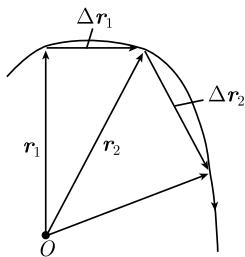

# 《数学指南——实用数学手册》1.9.5 功、势能和积分曲线

本节是《数学指南——实用数学手册》第 1.9 章「向量分析与物理学领域」下的第 1.9.5 小节，讨论力场沿路径做功的曲线积分定义、势（势能）函数的引入、重力场算例，以及把「势存在」「旋度为零」「功与路径无关」「闭路径功为零」四条判据联系起来的**主定理**。

## 功的定义

设质量为 $m$ 的点沿 $C^1$ 类路径

$$M: \boldsymbol{r} = \boldsymbol{r}(t), \quad \alpha \le t \le \beta$$

运动，力场 $\boldsymbol{F} = \boldsymbol{F}(\boldsymbol{r})$。则由定义，力场 $\boldsymbol{F}$ 的功为曲线积分（脚注 1）：

$$
\boxed{W := \int_{M} \boldsymbol{F}\,\mathrm{d}\boldsymbol{r}}
$$

它可以用以下公式（脚注 2）计算：

$$
W = \int_{\alpha}^{\beta} \boldsymbol{F}(\boldsymbol{r}(t))\,\boldsymbol{r}'(t)\,\mathrm{d}t .
$$

### 脚注

1. 在一级近似里，有 $W = \sum_{j=1}^{n} \boldsymbol{F}(\boldsymbol{r}_j)\Delta \boldsymbol{r}_j$（图 1.101），即**功 = 力 × 距离**。
2. 如果令 $\boldsymbol{F} = a\boldsymbol{i} + b\boldsymbol{j} + c\boldsymbol{k}$ 与 $\mathrm{d}\boldsymbol{r} = \mathrm{d}x\,\boldsymbol{i} + \mathrm{d}y\,\boldsymbol{j} + \mathrm{d}z\,\boldsymbol{k}$，则 $\omega := \boldsymbol{F}\,\mathrm{d}\boldsymbol{r}$ 是**一次微分式**。用微分式的语言来说，得到

$$
W = \int_{M} \omega
$$

（见 1.7.6.3）。该表述把功接入 1.7.6 节建立的微分式积分语言。

## 势（势能）

一个极其重要的特殊情形是：存在函数 $U$，使得在 $D$ 上

$$
\boxed{\boldsymbol{F} = -\operatorname{grad} U .}
$$

此时 $U$ 称为向量场 $\boldsymbol{F} = \boldsymbol{F}(\boldsymbol{r})$ 在 $D$ 上的**势**，功为

$$
\boxed{W = U(Q) - U(P) ,}
$$

其中 $Q$ 为路径的**起点**，$P$ 为**终点**（图 1.102(a)）。也可称 $U$ 为**势能**。

> 注意符号次序：本节写作 $W = U(Q) - U(P)$，与 [[concepts/位势公式]] 中 $\int_M \mathrm{d}U = U(P) - U(Q)$ 的端点次序相反，两者是同一关系的不同书写方向，比对时应留意。

## 例：重力场

令 $\boldsymbol{F} = -mg\boldsymbol{k}$ 为笛卡儿坐标系下作用在质量为 $m$ 的石块上的重力（$g$ 是重力加速度），则势能为

$$
\boxed{U = mgz .}
$$

实际上，有 $\operatorname{grad} U = U_z \boldsymbol{k} = -\boldsymbol{F}$。如果一个石块从高为 $z > 0$ 的地方落到 $z = 0$ 的地方，则 $W = U = mgz$ 是地球的引力场所做的功；在落地的时候，它转换成了热能（和动能 —— 校者）。

本节只讨论均匀重力场（常数场 $\boldsymbol{F} = -mg\boldsymbol{k}$），与 [[concepts/太阳引力公式]] 所处理的中心力场不是同一对象，其结论不可互相套用。

## 主定理

设 $\boldsymbol{F}$ 为 $R^3$ 的区域 $D$ 中的一个 $C^2$ 类力场。则下列诸条件相互等价：

- **(i)** $\boldsymbol{F}$ 在 $D$ 中有 $C^1$ 类势能。
- **(ii)** 在 $D$ 上，$\operatorname{curl} \boldsymbol{F} = 0$。
- **(iii)** 功 $W = \int_M \boldsymbol{F}\,\mathrm{d}\boldsymbol{r}$ 与路径 $M$ 无关，即它只依赖于 $M$ 的起点和终点。
- **(iv)** 对每个 $C^1$ 类闭路径 $M$，有 $\int_M \boldsymbol{F}\,\mathrm{d}\boldsymbol{r} = 0$（图 1.102(b)）。

**唯一性**：如果 $\boldsymbol{F}$ 的势 $U$ 在 $D$ 上存在，则在相差一个常数因子的意义上它是唯一确定的。

## 图像

- 图 1.101：功 = 力 × 距离。
- 图 1.102(a)：路径 $M$ 由起点 $Q$ 到终点 $P$（附对应插图）。
- 图 1.102(b)：闭路径 $M$ 上环量为零。

插图见 `media/10-数学指南实用数学手册--12-195-功势能和积分曲线--1a5dngy/` 下的三张图片。

## 相关页面

- 概念：[[concepts/功]]、[[concepts/力场]]、[[concepts/势与势函数]]、[[concepts/势能]]、[[concepts/一次微分式]]、[[concepts/曲线积分]]、[[concepts/路径无关性与可积性条件]]、[[concepts/位势公式]]、[[concepts/梯度]]、[[concepts/旋度]]、[[concepts/向量场]]、[[concepts/笛卡儿坐标系]]
- 发现：[[findings/功的曲线积分定义式与计算式]]、[[findings/功的一级近似等于力乘距离]]、[[findings/势定义为力场等于负梯度]]、[[findings/功等于起点与终点势能之差]]、[[findings/重力场势能等于mgz]]、[[findings/主定理四条件等价]]、[[findings/势在相差常数意义下唯一]]
- 相关 source：[[sources/10-数学指南实用数学手册--20-176-微积分基本定理高斯-斯托克斯定理--omolnc]]（1.7.6 节，一次微分式与位势公式的来源）、[[sources/10-数学指南实用数学手册--13-19-向量分析与物理学领域--sooafn]]（1.9 节总论）

<!-- llm-wiki:embedded-images -->
## Embedded Images

### Document

<!-- llm-wiki:embedded-images -->
