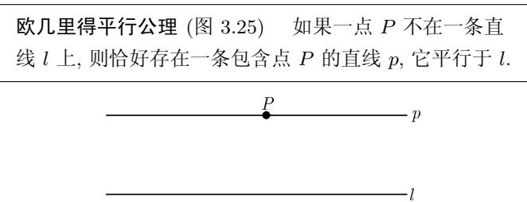

# 《数学指南——实用数学手册》3.2.6 欧几里得平行公理

本节是《数学指南——实用数学手册》第 3 章「几何学」第 3.2 节「初等几何学」下的第 3.2.6 小节，篇幅极短，由三段内容构成：平行直线的定义、欧几里得平行公理的陈述（含图 3.25），以及一段关于平行公理可证性问题的历史评注与认识论警示。

## 平行直线的定义

原文逐字为：

> 平行直线的定义 称两条直线 $l$ 和 $m$ 平行, 如果它们不相交于一点.

这一定义是本节全部内容的出发点：平行被界定为「不相交于一点」这一纯粹的关联性（incidence）条件，而不涉及距离、方向或无穷远点等附加结构。

## 欧几里得平行公理

原文逐字为：

> **欧几里得平行公理 (图 3.25)** 如果一点 $P$ 不在一条直线 $l$ 上, 则恰好存在一条包含点 $P$ 的直线 $p$, 它平行于 $l$.

图 3.25 的两条水平直线中，上方直线标记为 $p$，线上有黑点标注 $P$；下方直线标记为 $l$。图中「恰好存在一条」的存在性与唯一性两重要求均由该陈述给出。

## 历史评注

本节以加框公式的形式提出所谓的平行问题：

$$
\boxed {\text {平行公理能从欧几里得的其他公理证明吗?}}
$$

原文续称：这是一个 2000 多年中著名的未解决的数学问题。K. F. 高斯（1777—1855）是第一个意识到「平行公理」不能由其他公理证明的人，但是为了回避可能的非理性的麻烦，他一直都没有发表这个结果。俄罗斯数学家 N. I. 罗巴切夫斯基（1793—1856）在 1830 年出版了一本关于新型几何的书，在这种几何中平行公理就不成立，这便是罗巴切夫几何（或者称为非欧双曲几何）。匈牙利数学家 J. 波尔约（1802—1860）独立地得到了相似的结果。

需要注意，源文对高斯「未发表」及其动机的叙述属转述性史料判断，而非可验证的定理陈述；见 [[平行公理不可证的历史评注]]。

## 平面的欧氏几何

原文逐字为：

> 平面的欧氏几何 3.2.5 中包含了平行公理的希尔伯特公理对于平面的通常几何成立, 这正像在图 3.21～图 3.25 中所描述的那样.

本节在此把自身的平行公理归入 3.2.5 的 [[希尔伯特公理体系]]：包含平行公理的希尔伯特公理系统刻画的是平面的通常几何（即欧氏平面几何）。此处「3.2.5 中包含了平行公理的希尔伯特公理」语序拗口，且正文所称图 3.21～图 3.25 与本文档的图像编号存在衔接问题，已记入 [[326节图号3-21至3-25与节号对应存疑]]。

## 形象化和直观性可以产生误导

原文逐字为：

> 形象化和直观性可以产生误导 图 3.25 表明了平行公理显然是正确的。但是这个观点是错误的！这个错误所基于的事实是，我们直观地以为一条直线必定是某种「直」的东西。但是几何公理中没有任何一个说它应该如此。下面在 3.2.7 和 3.2.8 的两种几何解释了这点。

这是本节的方法论警示：公理体系本身并不规定「直线」必须是直观意义上的「直」对象，因此图 3.25 的几何直观不构成对平行公理的证明或确证。源文指向 3.2.7 与 3.2.8 所讨论的两种几何作为解释。

## 与相邻小节的关系

- 父节：[[10-数学指南实用数学手册--8-32-初等几何学--hrjbm1]]（3.2 初等几何学）。
- 前置小节：3.2.5 希尔伯特公理（[[10-数学指南实用数学手册--13-325-几何的希尔伯特公理--12h82yg]]），本节所述平行公理是其中平行公理组的具体形态。
- 后续小节：3.2.7 与 3.2.8 的「两种几何」，对应于 [[非欧双曲几何学]] 与 [[非欧椭圆几何学]]。
- 姊妹小节：3.2.1 平面三角学、3.2.2 对大地测量学的应用、3.2.3 球面几何学。

## 证据强度评估

本节是手册的叙述性与历史性文字，不含实证结果。平行直线的定义与平行公理的陈述精确，可作为定义性知识引用；历史评注（高斯、罗巴切夫斯基 1830 年著作、波尔约的独立性）属标准科学史叙事，其中高斯未发表的动机为转述性判断，宜标注为待核实史料而非确证事实。源文未对高斯、罗巴切夫斯基、波尔约三人的贡献归属越界归因，本条同样不将「不可证明」的结论安到其他实体（如希尔伯特）头上。

## 原图

- `media/10-数学指南实用数学手册--12-326-欧几里得平行公理--13vdhop/001-079bf8fa699d6452c7eebe42199689b482f7ccca8f776b7f8b91790e5901adfe.jpg` — 图 3.25 欧几里得平行公理

## 相关页面

- [[欧几里得平行公理]]
- [[平行直线的定义]]
- [[形象化和直观性可以产生误导]]
- [[非欧双曲几何学]]
- [[希尔伯特公理体系]]
- [[高斯]]、[[罗巴切夫斯基]]、[[波尔约]]

<!-- llm-wiki:embedded-images -->
## Embedded Images

### Document

<!-- llm-wiki:embedded-images -->

## Related
- [[sources/10-数学指南实用数学手册--21-45-公理方法及其与哲学认识论之关系的历史--edmip1]]
