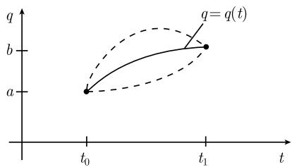

# 《数学指南——实用数学手册》5.1.1 欧拉－伯努利方程

本页是《数学指南——实用数学手册》5.1.1 节「欧拉－伯努利方程」的源文档摘要。该节属于 5.1「单变量函数的变分法」的核心定理部分，给出变分问题的主定理（欧拉-拉格朗日方程）、变分的解释、强/弱局部极小值定义、守恒律以及两条推广。相关背景见 [[变分法]]。

> ⚠️ 命名说明：本节标题写作「欧拉－伯努利方程」，但正文给出的中心方程是通行的 **欧拉-拉格朗日方程**。本书内部亦称其为「欧拉方程」。这一命名差异见 [[欧拉-伯努利方程]] 与查询页 [[欧拉-伯努利方程是否等同欧拉-拉格朗日方程]]。

## 一、变分问题的提出

设给定实数 $t_0, t_1, q_0, q_1$，满足 $t_0 \leqslant t_1$。考虑极小化问题

$$
\begin{array}{c} \displaystyle\int_{t_0}^{t_1} L(q(t), q'(t), t)\,\mathrm{d}t \stackrel{!}{=} \min, \\ q(t_0) = a,\quad q(t_1) = b, \end{array}\tag{5.1}
$$

以及更一般的极小化问题

$$
\begin{array}{c} \displaystyle\int_{t_0}^{t_1} L(q(t), q'(t), t)\,\mathrm{d}t \stackrel{!}{=} \text{稳态}, \\ q(t_0) = a,\quad q(t_1) = b. \end{array}\tag{5.2}
$$

其中 $L$ 称为**拉格朗日函数**，假定它充分正则。

## 二、主定理（欧拉-拉格朗日方程）

**主定理** 若 $q = q(t)$，$t_0 \leqslant t \leqslant t_1$ 为 (5.1) 或 (5.2) 的 $C^2$ 解，则对于所述的拉格朗日函数 $L$，有欧拉-拉格朗日方程：

$$
\frac{\mathrm{d}}{\mathrm{d}t} L_{q'} - L_{q} = 0.\tag{5.3}
$$

**历史来源**：欧拉于 1744 年在其论文 *Methodus inveniendi lineas curvas maximi minimive proprietate gaudentes, sive solutio problematis isoperimetrici latissimo sensu accepti* 中证明此定理，据此奠定了变分法作为一门数学学科的基础。1762 年拉格朗日简化了欧拉的推导，并将方程 (5.3) 推广到多变量函数（见 (5.46)）。[[queries/卡拉泰奥多里]] 把欧拉的变分法称为「现有的最漂亮的数学成果之一」。

**注**：欧拉-拉格朗日方程等价于方程 (5.2)。另一方面，方程 (5.3) 仅仅表达了极小化问题 (5.1) 的一个**必要条件**：(5.1) 的解满足 (5.3)，但反之未必正确。5.1.5 中将给出充分条件。

## 三、推广到方程组

若在 (5.1) 或 (5.2) 中 $q$ 是一向量 $\boldsymbol{q} = (q_1, \cdots, q_F)$，则 (5.3) 必须用欧拉-拉格朗日方程组代替：

$$
\frac{\mathrm{d}}{\mathrm{d}t} L_{q_j'} - L_{q_j} = 0,\quad j = 1, \dots, F.\tag{5.4}
$$

## 四、力学中的拉格朗日运动方程

在力学中，当力与时间无关并且有势能时，拉格朗日函数可选成

$$
L = \text{动能} - \text{势能}.
$$

即

$$
\frac{\mathrm{d}}{\mathrm{d}t}\frac{\partial L(q(t), q'(t), t)}{\partial q'} - \frac{\partial L(q(t), q'(t), t)}{\partial q} = 0.
$$

于是系统 (5.4) 就是著名的**拉格朗日运动方程**。参数 $t$ 对应于时间，$q$ 是任意的位置向量。属于这一类的变分问题 (5.2) 称为**哈密顿稳态作用原理**。

原文评论：若考虑质点沿曲线或曲面的运动（例如圆周或球面摆），必须把约束力加到牛顿方程中，以使质点保持在曲线或球面上，这是一个复杂的过程；拉格朗日创造性地引入适当的坐标而完全不用约束力，使方程优雅得多。牛顿方程常表达成「力等于质量乘加速度」，无法推广到电动力学、相对论和粒子物理这样更一般的物理对象；相反，拉格朗日公式可以推广到物理中出现的所有场论。相应的讨论见文献 [212]。

## 五、变分问题解的解释

考虑通过点 $(t_0, q_0)$ 和 $(t_1, q_1)$ 的一族曲线

$$
q = q(t) + \varepsilon h(t),\quad t_0 \leqslant t \leqslant t_1,\tag{5.5}
$$

所谓通过点 $(t_0, q_0)$ 和 $(t_1, q_1)$ 是指满足 $h(t_0) = h(t_1) = 0$（图 5.1）。设 $\varepsilon$ 是一小参数。将这一族曲线代入积分 (5.1) 得

$$
\varphi(\varepsilon) := \int_{t_0}^{t_1} L(q(t) + \varepsilon h(t),\, q'(t) + \varepsilon h'(t),\, t)\,\mathrm{d}t.
$$

- (i) 若 $q = q(t)$ 是极小化问题 (5.1) 的解，则 $\varphi = \varphi(\varepsilon)$ 在 $\varepsilon = 0$ 处达到极小，特别地有

$$
\varphi'(0) = 0.\tag{5.6}
$$

- (ii) 依据定义，问题 (5.2) 意指函数 $\varphi = \varphi(\varepsilon)$ 在 $\varepsilon = 0$ 达到临界点。由此可见 (5.6) 成立。

由 (5.6) 得到欧拉-拉格朗日方程，详细证明见 [212]。令

$$
J(q) := \int_{t_0}^{t_1} L(q(t), q'(t), t)\,\mathrm{d}t
$$

和

$$
\| q \|_k := \sum_{j=0}^{k} \max_{t_0 \leqslant t \leqslant t_1} | q^{(j)}(t) |,
$$

其中 $q^{(0)}(t) = q(t)$。于是 $\varphi(\varepsilon) = J(q + \varepsilon h)$。**积分 $J$ 的一阶变分**定义为 $\delta J(q)h := \varphi'(0)$，因此 (5.6) 隐含

$$
\delta J(q) h = 0
$$

（一阶变分为零），物理学中通常简记作 $\delta J = 0$。**二阶变分**定义成

$$
\delta^2 J(q) h^2 := \varphi''(0).
$$

## 六、强和弱局部极小值

设定义在 $[t_0, t_1]$ 上的 $C^1$ 函数 $q = q(t)$ 满足 $q(t_0) = a$，$q(t_1) = b$。函数 $q$ 是 (5.1) 的**强极小值**（相应地**弱极小值**），如果存在一数 $\eta > 0$，使得对于定义在 $[t_0, t_1]$ 上满足 $q_*(t_0) = a$、$q_*(t_1) = b$ 和

$$
\| q_* - q \|_k < \eta
$$

的所有 $C^1$ 函数 $q_*$，当 $k = 0$（相应地 $k = 1$）时成立

$$
J(q_*) \geqslant J(q).
$$

这一定义可逐字逐句地推广到方程组情形。**每一弱（相应地强）局部极小值都是欧拉-拉格朗日方程的一个解。**

## 七、守恒律

对于拉格朗日方程 $\dfrac{\mathrm{d}}{\mathrm{d}t} L_{q'} - L_q = 0$，可写作

$$
L_{q'q'} q'' + L_{q'q} q' + L_{q't} - L_q = 0.\tag{5.7}
$$

量

$$
p(t) := L_{q'}(q(t), q'(t), t)
$$

称为（广义）**矩量**。

- **(i) 能量守恒**：若拉格朗日函数与时间 $t$ 无关（系统相对于时间齐性），则 (5.7) 取形式 $\dfrac{\mathrm{d}}{\mathrm{d}t}(q' L_{q'} - L) = 0$，于是

$$
q'(t) p(t) - L(q(t), q'(t), t) = \text{常数}.\tag{5.8}
$$

左端对应于力学中系统的能量。

- **(ii) 矩量守恒**：若 $L$ 与位置无关，即不依赖于 $q$（系统相对于位置齐性），则 $\dfrac{\mathrm{d}}{\mathrm{d}t} L_{q'} = 0$，因此

$$
p(t) = \text{常数}.\tag{5.9}
$$

- **(iii) 速度守恒**：若 $L$ 既不依赖于位置 $q$，又不依赖于时间 $t$，则 $L_{q'}(q'(t)) = \text{常数}$，其解为

$$
q'(t) = \text{常数}.\tag{5.10}
$$

由此可得曲线族 $q(t) = \alpha + \beta t$ 是 (5.7) 的解。

## 八、诺特定理和本性守恒律

一般来说，变分法对于拉格朗日积分（即变分积分）的任何对称性质都会产生守恒律。这是 [[诺特]] 于 1918 年证明的一个著名定理的内容，该定理可在 [212] 中找到。

## 九、推广到带高阶导数的变分问题

如果拉格朗日函数依赖于直到 $n$ 阶导数，那么欧拉-拉格朗日方程 (5.4) 必须用下列方程代替：

$$
L_{q_j} - \frac{\mathrm{d}}{\mathrm{d}t} L_{q_j'} + \frac{\mathrm{d}^2}{\mathrm{d}t^2} L_{q_j''} - \dots + (-1)^n \frac{\mathrm{d}^n}{\mathrm{d}t^n} L_{q_j^{(n)}},\quad j = 1, \dots, F.
$$

按照稳态作用原理，还必须给定 $q_j^{(k)}$，$k = 0, 1, \cdots, n-1$ 在 $t_0$ 和 $t_1$ 时刻的值。

> 原文此式被竖线 $|\cdot|$ 包围且未写出「$= 0$」，疑为排印或 OCR 讹误，见 [[511节高阶导数方程缺少等于零记号与竖线符号]]。

## 十、脚注与原书信息

- 译者脚注：评述欧拉在赞美大自然服从力学定律的同时给出「上帝安排」的神学解释，并以牛顿「第一推动力」作对比，指出这是时代的局限。
- 脚注 1)：丹齐格（Dantzig）于 1950 年前后在美国提出了线性最优化中基本的**单形法**（见 5.5），这是现代最优化理论的基础。
- 原文另有一处脚注说明拉格朗日函数充分正则的条件：$L: \mathbb{R} \times \mathbb{R} \times [t_0, t_1] \to \mathbb{R}$ 为 $C^2$ 函数即可。
- 正文引用文献 [212] 两处（详细证明与诺特定理），本书未给出该条目的完整信息。
- 图 5.1 的本地图像未加载（[[511节图51未能加载与参考文献212条目缺失]]）。

## 相关页面

- 概念：[[欧拉-拉格朗日方程]]、[[拉格朗日函数]]、[[一阶变分与二阶变分]]、[[强弱局部极小值]]、[[queries/哈密顿稳态作用原理]]、[[拉格朗日运动方程]]、[[queries/守恒律与诺特定理]]、[[findings/511节三条守恒律与广义矩量]]、[[带高阶导数的欧拉-拉格朗日方程]]
- 实体：[[欧拉]]、[[拉格朗日]]、[[哈密顿]]、[[queries/卡拉泰奥多里]]、[[诺特]]
- 上位来源：[[变分法]]

<!-- llm-wiki:embedded-images -->
## Embedded Images

### Document

<!-- llm-wiki:embedded-images -->
