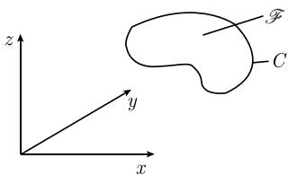
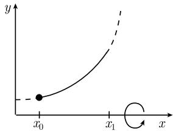
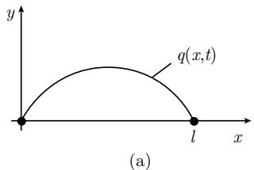

# 《数学指南——实用数学手册》5.2 多变量函数的变分法

## 本节定位

本节把 5.1「单变量函数的变分法」的结果推广到多变量情形：自变量由单变量 t 变为 $R^{N}$ 中的点 $\boldsymbol{x}=(x_{1},\dots,x_{N})$，未知函数由单个函数变为 $K$ 个分量 $\boldsymbol{q}=(q_{1},\dots,q_{K})$，一阶导数由 $q'$ 变为偏导数矩阵 $\partial\boldsymbol{q}=(\partial_{j}q_{k})$，其中 $\partial_{j}=\partial/\partial x_{j}$。定义域由区间 $[t_{0},t_{1}]$ 变为有界区域 $D$，端点条件变为边界条件 $\boldsymbol{q}=\boldsymbol{\psi}$ 在 $\partial D$ 上。

全节分三个子节：

- **5.2.1 欧拉-拉格朗日方程**：给出多元变分问题提法 (5.44)/(5.45)、主定理 (5.46) 及其推论；
- **5.2.2 应用**：平面问题 (5.47)/(5.48)、极小曲面 (5.49)、悬链曲面、泊松方程第一边值问题 (5.50)/(5.51)、弹性膜、泊松方程第二与第三边值问题 (5.52)–(5.55)、振动弦的稳态作用原理 (5.58)/(5.59)；
- **5.2.3 带约束的问题和拉格朗日乘子**：以拉普拉斯方程的本征值问题 (5.60)/(5.61) 为例，把 5.1.6 的乘子法推广到多元情形。

## 5.2.1 问题提法与主定理

极小化问题与稳态问题（边界条件为 Dirichlet 型）：

```latex
\begin{array}{c}
\int_{D} L(\boldsymbol{x},\boldsymbol{q},\partial\boldsymbol{q})\,\mathrm{d}\boldsymbol{x} \stackrel{!}{=} \min, \\
\boldsymbol{q}=\boldsymbol{\psi},\ \text{在}\ \partial D\ \text{上},
\end{array} \tag{5.44}

\begin{array}{c}
\int_{D} L(\boldsymbol{x},\boldsymbol{q},\partial\boldsymbol{q})\,\mathrm{d}\boldsymbol{x} \stackrel{!}{=} \text{稳态}, \\
\boldsymbol{q}=\boldsymbol{\psi},\ \text{在}\ \partial D\ \text{上}.
\end{array} \tag{5.45}
```

记号约定：

```latex
\partial_{j}=\partial/\partial x_{j},\quad
\boldsymbol{x}=(x_{1},\dots,x_{N}),\quad
\boldsymbol{q}=(q_{1},\dots,q_{K}),\quad
\partial\boldsymbol{q}=(\partial_{j}q_{k}).
```

假定 $L$ 与 $\boldsymbol{\psi}$ 在边界 $\partial D$ 上充分光滑。

**主定理**：如果 $\boldsymbol{q}=\boldsymbol{q}(t)$ 是 (5.44) 或 (5.45) 的解，那么 $\boldsymbol{q}$ 在 $D$ 上满足欧拉-拉格朗日方程（方程编号 5.46，带脚注 1)）：

```latex
\sum_{j=1}^{N}\partial_{j}L_{\partial_{j}q_{k}}-L_{q_{k}}=0,\quad k=1,\dots,K. \tag{5.46}
```

脚注 1) 给出更详细的写法：

```latex
\sum_{j=1}^{N}\frac{\partial}{\partial x_{j}}\frac{\partial L(Q)}{\partial(\partial_{j}q_{k})}
-\frac{\partial L(Q)}{\partial q_{k}}=0,\quad k=1,\dots,K,
```

其中 $Q=(\boldsymbol{x},\boldsymbol{q}(\boldsymbol{x}),\partial\boldsymbol{q}(\boldsymbol{x}))$。

原文指出这些著名方程由拉格朗日在 1762 年推导；物理中各领域的理论都可借助 (5.46) 用公式表达，其中 (5.45) 对应稳态作用原理。

**推论**：对于充分光滑的函数 $\boldsymbol{q}$，问题 (5.45) 等价于 (5.46)。

## 5.2.2 应用

### 平面（二维）问题

```latex
\begin{array}{c}
\int_{D} L(q(x,y),q_{x}(x,y),q_{y}(x,y),x,y)\,\mathrm{d}x\,\mathrm{d}y \stackrel{!}{=} \min, \\
q=\psi,\ \text{在}\ \partial D\ \text{上}
\end{array} \tag{5.47}
```

可解的一个必要条件是欧拉-拉格朗日方程可解：

```latex
\frac{\partial}{\partial x}L_{q_{x}}+\frac{\partial}{\partial y}L_{q_{y}}-L_{q}=0 \tag{5.48}
```

### 极小曲面（图 5.18）

寻找曲面 $\mathcal{F}: z=q(x,y)$，在通过给定边界曲线 $C$ 的曲面中有最小面积：

```latex
\int_{D}\sqrt{1+q_{x}(x,y)^{2}+q_{y}(x,y)^{2}}\,\mathrm{d}x\,\mathrm{d}y \stackrel{!}{=} \min,\quad
q=\psi,\ \text{在}\ \partial D\ \text{上},
```

其欧拉-拉格朗日方程为

```latex
\frac{\partial}{\partial x}\left(\frac{q_{x}}{\sqrt{1+q_{x}^{2}+q_{y}^{2}}}\right)
+\frac{\partial}{\partial y}\left(\frac{q_{y}}{\sqrt{1+q_{x}^{2}+q_{y}^{2}}}\right)=0. \tag{5.49}
```

该方程的所有解都称为极小曲面；原文称 (5.49) 在几何上意味着曲面的平均曲率恒等于零。

### 悬链曲面（图 5.19）

让曲线 $y=y(x)$ 绕 x 轴旋转得到面积最小的曲面：

```latex
\int_{x_{0}}^{x_{1}} L(y(x),y'(x),x)\,\mathrm{d}x \stackrel{!}{=} \min,\quad
y(x_{0})=y_{0},\quad y(x_{1})=y_{1},
```

这里 $L=y\sqrt{1+y'^{2}}$。根据 (5.8)，由欧拉-拉格朗日方程得到 $y'L_{y'}-L=$ 常数，即有

```latex
\frac{y(x)}{\sqrt{1+y'(x)^{2}}}=\text{常数}.
```

悬链面 $y=c\cosh\left(\frac{x}{c}+b\right)$ 是一个解；原文称此悬链曲面是通过旋转曲线得到的唯一的极小曲面。

### 泊松方程的第一边界问题

```latex
\int_{D}\frac{1}{2}(q_{x}^{2}+q_{y}^{2}-2fq)\,\mathrm{d}x\,\mathrm{d}y \stackrel{!}{=} \min,\quad
q=\psi,\ \text{在}\ \partial D\ \text{上} \tag{5.50}
```

的每一个充分光滑的解都满足

```latex
-q_{xx}-q_{yy}=f,\ \text{在}\ D\ \text{上},\qquad q=\psi,\ \text{在}\ \partial D\ \text{上}. \tag{5.51}
```

这就是泊松方程的第一边值问题。

### 弹性膜

物理上 (5.51) 对应于由边界 $C$ 张成的膜 $z=q(x,y)$ 的极小势能原理（图 5.18）。至于重力，取 $f(x,y)=-\rho g$（$\rho$ 为密度，$g$ 为重力常数）。

### 泊松方程的第二和第三边界值问题

```latex
\int_{D}(q_{x}^{2}+q_{y}^{2}-2fq)\,\mathrm{d}x\,\mathrm{d}y
+\int_{\partial D}(aq^{2}-2bq)\,\mathrm{d}s \stackrel{!}{=} \min \tag{5.52}
```

的每一个充分光滑的解满足

```latex
-q_{xx}-q_{yy}=f,\ \text{在}\ D\ \text{上}, \tag{5.53}
```

```latex
\frac{\partial q}{\partial \boldsymbol{n}}+aq=b,\ \text{在}\ \partial D\ \text{上}. \tag{5.54}
```

其中 $s$ 表示在数学意义下正定向的边界曲线上的弧长，且外法向导数为

```latex
\frac{\partial q}{\partial \boldsymbol{n}}=n_{1}q_{x}+n_{2}q_{y},
```

$\boldsymbol{n}=n_{1}\boldsymbol{i}+n_{2}\boldsymbol{j}$ 为单位外法向向量（图 5.20）。

对于 $a\equiv 0$（相应地 $a\not\equiv 0$），(5.53)（相应地 (5.54)）称为泊松方程第二（相应地第三）边值问题。边界条件 (5.54) 在变分问题 (5.52) 中并未出现，因此这是一个**自然边界条件**。对于 $a\equiv 0$，$f$ 与 $b$ 不是任意的，必须满足可解性条件

```latex
\int_{D}f\,\mathrm{d}x\,\mathrm{d}y+\int_{\partial D}b\,\mathrm{d}s=0. \tag{5.55}
```

**证明轮廓**（三步法）：

- 步骤 1：用 $q+\varepsilon h$ 代替 $q$，代入泛函得 $\varphi(\varepsilon)$，由 $\varphi'(0)=0$ 得

```latex
\frac{1}{2}\varphi'(0)=\int_{D}(q_{x}h_{x}+q_{y}h_{y}-fh)\,\mathrm{d}x\,\mathrm{d}y
+\int_{\partial D}(aqh-bh)\,\mathrm{d}s=0. \tag{5.56}
```

若 $a\equiv 0$，则 (5.55) 由 (5.56) 取 $h\equiv 1$ 推出。

- 步骤 2：分部积分得到

```latex
-\int_{D}(q_{xx}+q_{yy}+f)h\,\mathrm{d}x\,\mathrm{d}y
+\int_{\partial D}\left(\frac{\partial q}{\partial\boldsymbol{n}}+aq-b\right)h\,\mathrm{d}s=0. \tag{5.57}
```

- 步骤 3：启发式论证（原文称其正确性完全可以证明）。(i) 取沿 $\partial D$ 为 0 的任意光滑 $h$，边界积分为 0，得 $q_{xx}+q_{yy}+f=0$ 在 $D$ 上；(ii) 于是 $D$ 上积分为 0，边界上的 $h$ 可任取，得 $\partial q/\partial\boldsymbol{n}+aq-b=0$ 在 $\partial D$ 上。

**注**：对变分问题 (5.50) 类似讨论导致类似结果；由于在 $\partial D$ 上 $q=\psi$，此种情形限制 $h$ 在 $\partial D$ 上 $h=0$，于是从结论 (i) 得到 (5.51)。

### 振动弦的稳态作用原理（图 5.21(a)(b)）

设 $q=q(x,t)$ 描述弦在 $t$ 时刻点 $x$ 处的位移，定义域

```latex
D:=\{(x,t)\in\mathbb{R}^{2}: 0\leqslant x\leqslant l,\ t_{0}\leqslant t\leqslant t_{1}\}.
```

取拉格朗日函数

```latex
L=\text{动能}-\text{势能}=\frac{1}{2}\rho q_{t}^{2}-\frac{1}{2}kq_{x}^{2}
```

（$\rho$ 为密度，$k$ 为材料常数），稳态作用原理为

```latex
\begin{array}{l}
\int_{D}L\,\mathrm{d}x \stackrel{!}{=} \text{平稳}, \\
q\ \text{沿着边界}\ \partial D\ \text{给定}.
\end{array}
```

相应的欧拉-拉格朗日方程 $(L_{q_{t}})_{t}+(L_{q_{x}})_{x}=0$ 导致弦振动方程

```latex
\frac{1}{c^{2}}q_{tt}-q_{xx}=0, \tag{5.58}
```

其中 $c^{2}=k/\rho$。定理：(5.58) 的最一般的 $C^{2}$ 解是

```latex
q(x,t)=a(x-ct)+b(x+ct), \tag{5.59}
```

这里 $a,b$ 为任意 $C^{2}$ 函数。解 (5.59) 对应于以速度 $c$ 在相反方向传播的两个波的叠加（一个从左到右，另一个从右到左）。

## 5.2.3 带约束的问题和拉格朗日乘子

### 拉普拉斯方程的本征值问题

```latex
\begin{array}{l}
\int_{D}(q_{x}^{2}+q_{y}^{2})\,\mathrm{d}x\,\mathrm{d}y \stackrel{!}{=} \min,\quad q=0\ \text{在}\ \partial D\ \text{上}, \\
\int_{\partial D}q^{2}\,\mathrm{d}s=1.
\end{array} \tag{5.60}
```

类似于 5.1.6，选择拉格朗日函数

```latex
\mathcal{L}:=L+\lambda q^{2}=q_{x}^{2}+q_{y}^{2}+\lambda q^{2},
```

实数 $\lambda$ 称为拉格朗日乘子。$\mathcal{L}$ 的欧拉-拉格朗日方程为

```latex
\frac{\partial}{\partial x}\mathcal{L}_{q_{x}}+\frac{\partial}{\partial y}\mathcal{L}_{q_{y}}-\mathcal{L}_{q}=0,
```

这对应于本征值问题

```latex
q_{xx}+q_{yy}=\lambda q,\ \text{在}\ D\ \text{上},\quad q=0,\ \text{在}\ \partial D\ \text{上}. \tag{5.61}
```

可以证明 (5.61) 是 (5.60) 存在 $C^{2}$ 解的一个必要条件。在这种情形下拉格朗日乘子成为一个本征值。

## 图与图像资产

| 图号 | 内容 | 图像状态 |
|---|---|---|
| 图 5.18 | 极小曲面（同时用于弹性膜的极小势能原理） | 已加载 |
| 图 5.19 | 悬链曲面 | 未能加载 |
| 图 5.20 | 泊松方程边值问题（区域 $D$、边界定向、外法向 $\boldsymbol{n}$） | 已加载 |
| 图 5.21(a)(b) | 振动弦的平稳作用原理 | 未能加载 |

图像以 `media/10-数学指南实用数学手册--12-52-多变量函数的变分法--gloqg1/` 为根路径存放。

## 关键实体与概念

- 人物：[[拉格朗日]]（(5.46) 的推导者，1762）；[[泊松]]、[[拉普拉斯]]（仅以方程/问题命名出现）。原文未点名 (5.59) 的达朗贝尔，故不据推测建立该实体页。
- 概念：[[多变量变分法]]、[[多元欧拉-拉格朗日方程]]、[[极小曲面]]、[[悬链曲面]]、[[泊松方程边值问题]]、[[弹性膜的极小势能原理]]、[[振动弦的稳态作用原理]]、[[弦振动方程的行波解]]、[[拉普拉斯方程本征值问题]]。
- 与前置章节的联系：[[自然边界条件]]（5.1.8 已建立，本节 (5.54) 是其多元实例）、[[拉格朗日乘子]] 与 [[带约束变分问题与拉格朗日乘子]]（5.1.6）、[[欧拉-拉格朗日方程]] 与 [[变分法]]（5.1）。

## 本节留下的疑点

见 [[521节主定理q等于q_t记号疑点]]、[[queries/521节方程546中L的下标qk疑点]]、[[522节弹性膜外力密度f与q混淆疑点]]、[[522节极小曲面平均曲率在边界上为零疑点]]、[[522节图519与图521未能加载]]。

<!-- llm-wiki:embedded-images -->
## Embedded Images

### Document






<!-- llm-wiki:embedded-images -->

## Related
- [[sources/10-数学指南实用数学手册--6-517-应用--16qab30]]
